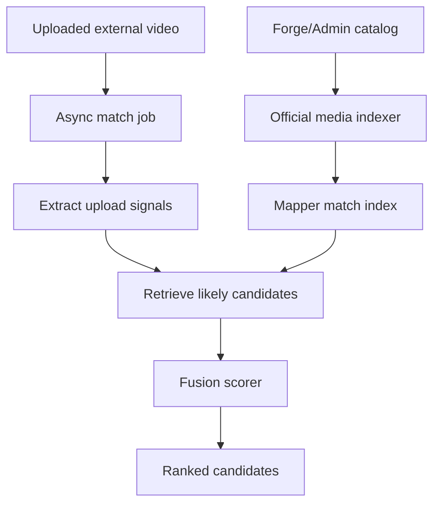
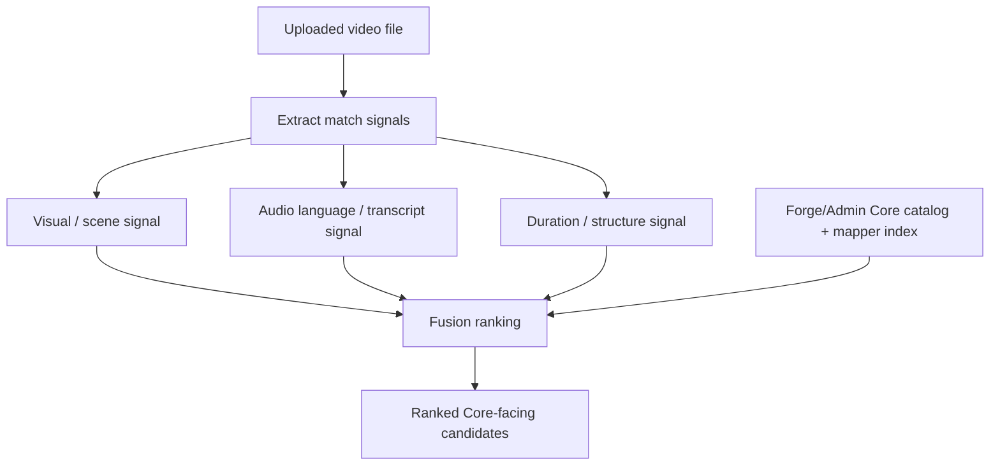

# Video Source Mapper Requirements

## Summary

Build a backend workflow that accepts an uploaded re-use video, processes it as
an async job, and returns a ranked list of Core-facing source candidates. Each
candidate identifies the source `coreId`, the likely Core `videoVariantId`, a
numeric confidence score, and a review-friendly match-strength label.

## Problem Frame

Today, source attribution is manual. A person watches an external re-upload,
then searches through Jesus Film videos and language variants until they find
similar scenes. The product goal is analytics attribution: given a video someone
else uploaded, identify which official Jesus Film source video it came from so
analytics can roll up to the right Core video.

Metadata cannot be trusted because re-uploaders may change titles,
descriptions, channel context, thumbnails, compression, crops, overlays, and
editing. The durable signal is the media content itself.

## Key Decisions

- **Return Core-facing IDs.** The API response should use `coreId` for
  `Video.coreId` and `videoVariantId` for Core's video variant ID, which Forge
  stores as `VideoDub.coreId`.
- **Use Dub internally, variant externally.** Forge's internal model names Core
  video variants as `VideoDub` because the varying axis is usually audio
  language. The public matcher response should still use `videoVariantId`
  because the analytics target speaks Core terminology.
- **Run matching asynchronously.** Video processing should create a job and let
  clients poll for ranked candidates instead of holding one long upload request
  open.
- **Fuse signals into one ranked list.** Visual, audio/transcript, and
  duration/structure evidence should produce one candidate ranking, not separate
  visual and audio answers.
- **Use media-signature retrieval, not classic RAG.** The mapper should retrieve
  likely official candidates from video/audio/transcript signatures, then score
  them. It should not depend on an LLM generation step to decide identity.
- **Prefer visual source identity, require audio for variant strength.** Visual
  or scene evidence should anchor the likely `coreId`; audio language and
  transcript evidence should rank the likely `videoVariantId` within that
  source.
- **Keep evidence internal in v1.** The public response stays compact. Internal
  evidence can support tuning, debugging, and later review APIs.
- **Store matcher-specific state, not a duplicate catalog.** The mapper may own
  async jobs, match results, and compact official-media indexes. Forge/Admin
  remains the source of truth for videos, dubs, editions, subtitles, and media
  URLs.
- **Start with broad catalog coverage.** The prototype should index a broad
  Core catalog slice rather than a small hand-picked set, while still keeping
  validation data separate.
- **Keep a Core ID title map.** The mapper should maintain a lightweight map of
  every included `coreId` and its selected display title so candidate results
  and operator logs can be interpreted without re-querying Admin for every row.
- **Defer model-assisted video comparison.** A multimodal model may help review
  or rerank candidates later, but v1 should prove signature retrieval and
  fusion scoring first.

## Actors

- A1. Analytics operator or system uploads an external video file and consumes
  ranked attribution candidates.
- A2. Mapper backend processes uploaded media, compares it to official media
  indexes, and returns candidate rankings.
- A3. Forge/Admin supplies canonical Core-synced catalog data, including
  `Video`, `VideoDub`, `VideoEdition`, subtitles, durations, and media URLs.
- A4. Future reviewers may inspect internal evidence when confidence needs
  tuning, but this is not part of the v1 public API.

## Requirements

**API behavior**

- R1. The matcher accepts a downloaded video file as the v1 input.
- R2. The matcher creates an async processing job and returns a job identifier
  before matching is complete.
- R3. The matcher exposes job status so clients can poll until candidate results
  are ready.
- R4. The final public response returns only a ranked `candidates` list.
- R5. Each candidate includes `coreId`, `videoVariantId`, `confidence`, and
  `matchStrength`.
- R6. `matchStrength` is one of `high`, `medium`, or `low`.
- R7. The response does not expose evidence breakdowns in v1.

**Matching semantics**

- R8. Candidate ranking should identify the source `coreId` primarily from
  visual or scene evidence.
- R9. Candidate ranking should identify the likely `videoVariantId` from audio
  language and transcript evidence when available.
- R10. Duration, structure, and partial-overlap signals should influence ranking
  but should not override strong content evidence on their own.
- R11. When visual evidence strongly identifies one `coreId` but audio evidence
  cannot confidently isolate one Dub, the result may return the top two or
  three likely `videoVariantId` candidates under that same `coreId`.
- R12. A `high` match should generally require visual/source evidence and
  audio/variant evidence to support the same candidate.
- R13. External metadata such as title, description, channel, and thumbnail
  should be treated as weak context only.

**Catalog and indexing**

- R14. The mapper should use Forge/Admin as the catalog source of truth rather
  than duplicating the full video catalog.
- R15. The mapper may maintain its own matcher-specific index keyed by
  `coreId`, `videoVariantId`, and optionally Video Edition identity.
- R16. The mapper should not store raw uploaded videos long-term unless a later
  review workflow explicitly requires it.
- R17. Official-media indexes should be reusable across requests so each upload
  does not require reprocessing the official catalog.
- R18. Official-media indexes should store compact timecoded signatures rather
  than raw official videos.
- R19. Matching should retrieve likely source candidates before fusion scoring
  so the scorer compares against a bounded candidate set.
- R20. The first index should target a broad catalog slice instead of a small
  hand-picked set.
- R21. The mapper should store a lightweight Core ID map for included videos,
  including `coreId` and title.

## Key Flow

- F1. Async match request
  - **Trigger:** A caller uploads an external video file for attribution.
  - **Actors:** A1, A2, A3
  - **Steps:** The mapper creates a job, extracts matching signals from the
    upload, compares them to the official-media index, fuses the signals, and
    stores the ranked result for polling.
  - **Outcome:** The caller receives a ranked candidate list using Core-facing
    identifiers.

## Candidate Shape

```ts
type MatchResponse = {
  candidates: Array<{
    coreId: string
    videoVariantId: string
    confidence: number
    matchStrength: "high" | "medium" | "low"
  }>
}
```

`coreId` maps to Forge/Admin `Video.coreId`. `videoVariantId` maps to
Forge/Admin `VideoDub.coreId`, which is Core's video variant ID.

## Prototype Architecture



The mapper should pull official media references from Forge/Admin, process those
references into compact searchable signatures, and reuse that index across match
jobs. Uploaded media should be processed into the same families of signals, then
discarded or retained only according to the v1 retention policy.

## Retrieval Strategy

The retrieval strategy should be staged:

- **Coarse source retrieval:** use visual or scene signatures to find likely
  source `coreId` candidates.
- **Variant ranking:** use audio language, audio fingerprints, transcript
  overlap, and subtitle similarity to rank likely `videoVariantId` candidates
  under the strongest source videos.
- **Fusion scoring:** combine visual/source, audio/transcript, and
  duration/structure signals into the public ranked candidate list.

The system should avoid a single whole-video embedding as the primary index.
Timecoded signatures are more useful because re-uploads may be clipped, trimmed,
overlaid, or partially reordered.

## Fusion Model



The fusion should be visual-first and agreement-aware. Visual or scene evidence
anchors source identity. Audio language and transcript evidence ranks the
specific Dub/variant. Agreement between both raises confidence; disagreement
lowers match strength rather than forcing two separate answers.

## Success Criteria

- The prototype reduces a manual watch-and-search workflow to a short ranked
  candidate list.
- The top candidates use the exact `coreId` and `videoVariantId` terminology
  needed by analytics.
- The system can explain internally why a candidate ranked highly, even though
  that evidence is not exposed in v1.
- The broad-catalog prototype can be validated against a small human-labeled
  set before expanding confidence thresholds or automation.
- Broad catalog indexing can run without losing the ability to inspect which
  Core videos were included and what title each `coreId` resolves to.

## Scope Boundaries

- YouTube URL ingestion is deferred; v1 starts with downloaded video file
  upload.
- Public evidence breakdowns are deferred; v1 exposes only ranked candidates.
- Model-assisted "watch and compare" matching is deferred until the signature
  retrieval prototype has been validated.
- Long-term storage of uploaded raw videos is out of scope for v1.
- Moderation, enforcement, and suspicious-video discovery are outside this
  product's identity.
- Indexing every Core video and Dub is not required before the prototype can be
  evaluated, but the default should be a broad catalog slice rather than a tiny
  hand-picked catalog.
- A small hand-picked catalog-only prototype is no longer the default; use a
  broad catalog slice and keep validation examples separate.

## Dependencies / Assumptions

- Forge/Admin has Core-synced `Video`, `VideoDub`, `VideoEdition`,
  `VideoSubtitle`, duration, and media URL data available or retrievable.
- Existing semantic scene/transcript embeddings may help the prototype, but
  identity-oriented matching may need a different index shape than Forge's
  current search/recommendation embeddings.
- The mapper's own database is justified if it stores async job state, match
  results, and compact matcher indexes with lifecycles separate from Admin's
  catalog.

## Outstanding Questions

### Resolve Before Planning

- What upload size and duration limits should v1 support?
- How many candidates should the API return by default?
- What thresholds map numeric `confidence` to `high`, `medium`, and `low`?
- Which official media source should seed the first prototype index: HLS,
  downloadable renditions, Mux playback, or another approved source?
- How long should job results and internal evidence be retained?
- Which compact signatures are enough for the first useful prototype?
- Which title locale or fallback order should the Core ID title map use?

### Deferred To Planning

- Where should matcher indexes live: the mapper database, object storage,
  pgvector, or a specialized media index?
- Which visual/audio fingerprinting libraries or services should be evaluated?
- How should the mapper authenticate against Forge/Admin or Core data?

## Sources / Research

- `CONCEPTS.md` defines `Video`, `Dub`, `Video Edition`, and `Language`.
- `apps/admin/prisma/schema.prisma` defines `Video.coreId` and
  `VideoDub.coreId`.
- `apps/admin/CLAUDE.md` documents that `VideoDub` is Forge's rename of Core's
  `video-variant`.
- `apps/yt-video-mapper-backend/docs/handoffs/forge-agent-prompt.md` contains
  the earlier handoff from the initial brainstorm.
