# Archived Backup — Live Personalized Watch Recommendations - Plan

<!-- ARCHIVED BACKUP: DO NOT IMPLEMENT, PLAN, TICKET, OR LOAD AS ACTIVE CONTEXT. -->

> [!CAUTION]
> **ARCHIVED BACKUP — DO NOT IMPLEMENT.** This brainstorm is retained only for posterity and as a possible fallback architecture. It is not an active product contract, planning input, roadmap source, or implementation instruction. Agents must not pick it up, create tickets from it, change roadmap status because of it, or include its detailed requirements and decisions in current task context unless the user explicitly asks to revisit this named backup plan.

The team decided not to implement this live-agent architecture. Current recommendation work, when explicitly requested, must start from `docs/plans/2026-08-18-2219-feat-watch-recommendation-learning-system-plan.md` and its active roadmap tickets rather than from this file.

## Goal Capsule

Historical design objective: deliver a personalized “what to watch next” block below the Web video player. Every eligible block load would ask a live recommendation agent to curate real catalog videos from the viewer’s latest profile, per-video watch evidence, and pseudonymized histories from similar viewers.

If explicitly revived, this design would cover the viewer-facing behavior, anonymous and signed-in profile continuity, watch-matrix feedback loop, peer-assisted recommendation inputs, model-output constraints, and graceful fallback for the first below-player slice. It would not redesign public Watch search or extend personalization to the homepage, mobile, or TV.

At drafting time, no product decision blocked a later planning pass. That statement is historical and grants no authority to plan or implement this archived design. If the user explicitly revives it, privacy review of persistent anonymous profiling and model-provider data handling would be required before production activation.

---

## Product Contract

### Summary

The Recommendations block becomes a live, feedback-driven service rather than a fixed related-content shelf. Anonymous viewers receive a durable server-side recommendation profile by default through an opaque first-party identifier, signed-in viewers use their account profile, and a new account automatically absorbs the browser’s anonymous profile.

“Self-learning” in this slice means that accepted viewing and recommendation interactions update the viewer’s stored evidence and interest profile for later requests. It does not mean online training or fine-tuning of model weights.

### Problem Frame

Current main has useful but disconnected pieces: authenticated watch progress, anonymous browser-local progress, player preferences, Admin-owned semantic catalog retrieval, and tool-callable catalog search. It does not have a server-side anonymous recommendation profile or a production below-player Recommendations implementation; the current production Web section dispatcher returns no component for `VideoRecommendationsBlock`, while a demo route exercises the existing semantic scene-recommendation query.

The broader recommendation-system plan in `docs/plans/2026-08-18-2219-feat-watch-recommendation-learning-system-plan.md` spans a large experimentation and ranking platform. This contract deliberately defines the smallest coherent product slice: live recommendations below the player, durable viewer evidence, automatic anonymous-to-account continuity, and a safe fallback.

### Key Decisions

- **Below-player recommendations are the only surface in this slice.** `(session-settled: user-directed — chosen over changing public Watch search or other discovery surfaces so next-video discovery can ship as a focused slice.)` Governs R1, R2, R29, and R30.
- **A live recommendation agent runs for every eligible block load.** `(session-settled: user-directed — chosen over a cached or deterministic personalized slate because the result must reflect the latest profile and watch evidence on each load.)` Governs R1–R5 and R24–R28.
- **Anonymous profiles persist by default, with high transparency and an easy opt-out to session-only behavior.** `(session-settled: user-directed — chosen over signed-in-only or session-only personalization so anonymous viewers retain useful continuity.)` Governs R6–R11.
- **The interest profile is visible and editable.** `(session-settled: user-directed — chosen over a hidden inferred persona so a viewer can inspect, correct, reset, or remove the data shaping recommendations.)` Governs R12–R14.
- **Creating an account automatically merges the browser profile into the new account.** `(session-settled: user-directed — chosen over one-time merge confirmation for immediate continuity, with the acknowledged shared-browser attribution risk.)` Governs R15 and R16.
- **Similar-viewer evidence is detailed but pseudonymized before reaching the agent.** `(session-settled: user-directed — chosen over named peer identities or reusable credentials because the useful input is the peer profile and watch sequence, not the person’s identity.)` Governs R21–R23 and R26.
- **The model curates catalog results; it does not author catalog records.** `(session-settled: user-approved — chosen so live curation can add contextual judgment without allowing fabricated or unavailable videos.)` Governs R2–R5 and R27.

### Actors

- **A1 — Anonymous viewer:** watches without an account and either uses the default durable profile or opts out to session-only recommendations.
- **A2 — Signed-in or newly registered viewer:** receives recommendations from an account-backed profile and may inherit an anonymous browser profile when creating the account.
- **A3 — Recommendation profile service:** resolves viewer identity, stores the interest profile and watch matrix, applies controls, and merges profiles.
- **A4 — Similar-viewer retriever:** finds useful peer evidence and converts it to prompt-scoped candidate identities.
- **A5 — Live recommendation agent:** evaluates the current viewer context, calls retrieval tools, and selects and orders catalog video IDs.
- **A6 — Catalog and retrieval tools:** return authoritative, playable video candidates and metadata from Admin-owned catalog/search capabilities.
- **A7 — Recommendations block:** requests, renders, and attributes recommendations without becoming a dependency of player playback.

### Requirements

#### Live Recommendation Experience

- **R1.** Every eligible load of the Web below-player Recommendations block MUST initiate a live recommendation request using the current video and the latest accepted version of the viewer’s profile and watch matrix.
- **R2.** The live agent MUST be able to call authoritative catalog and retrieval tools during the request; an internal tool contract is required, while MCP is an implementation option rather than a product requirement.
- **R3.** The agent MUST only select and order video IDs returned by those tools for that request. It MUST NOT invent a video, use a model-authored URL, or return arbitrary catalog data.
- **R4.** Before rendering, the service MUST validate that each selected video still satisfies the applicable visibility, playability, locale, audience-safety, deduplication, and current-video-exclusion rules.
- **R5.** An agent error, invalid result, or timeout MUST NOT delay or break player playback. The block MUST fall back to a safe catalog-derived list, or remain absent when no valid fallback exists.

#### Anonymous and Signed-In Identity

- **R6.** An anonymous viewer who has not opted out MUST receive an opaque, first-party recommendation-profile identifier that resolves to a server-side anonymous profile.
- **R7.** The browser identifier MUST contain no profile attributes or watch history and MUST not be treated as a recommendation signal. Its only recommendation purpose is to locate the server-side profile.
- **R8.** Durable anonymous persistence MUST be disclosed in clear product language with a readily accessible path to view controls and opt out.
- **R9.** Opting out MUST stop durable anonymous profiling for future activity, remove the anonymous profile from active recommendation stores according to the deletion policy, and continue with browser-session-only recommendation context. Any narrowly required retained audit record MUST be unavailable to recommendation processing.
- **R10.** Session-only context MUST expire with the browser session and MUST NOT be silently promoted back into a durable anonymous profile while the opt-out remains active.
- **R11.** Signed-in viewers MUST use an account-backed recommendation profile rather than a separate durable anonymous profile for new recommendation activity.

#### Viewer Profile and Account Continuity

- **R12.** The stored interest profile MUST be visible to the viewer and MUST support correction, removal of individual interests, reset, and deletion.
- **R13.** The profile MAY summarize content affinities, language and playback preferences, and negative or positive viewing evidence. It MUST NOT infer or label sensitive demographics, beliefs, spiritual status, or health characteristics for recommendation purposes.
- **R14.** A viewer edit or reset MUST take effect no later than the next live block request and MUST take precedence over older inferred profile statements until new qualifying evidence supports a change.
- **R15.** When an anonymous viewer creates a new account, the system MUST automatically and idempotently merge the browser’s anonymous recommendation profile and watch matrix into the new account profile.
- **R16.** After a successful merge, subsequent activity from that browser MUST resolve to the account profile while signed in, and the anonymous source profile MUST NOT continue as an independently active duplicate. This automatic behavior applies to new-account creation in this slice; signing into a pre-existing account is outside scope.

#### Watch Matrix and Feedback Loop

- **R17.** The system MUST maintain per-video recommendation and playback evidence for the viewer, including recommendation impression and position, click or selection, playback start, active watch time, elapsed time and duration, completion or early exit, repeat or resume behavior, seek or skip behavior, and the recommendation request that caused the visit when applicable.
- **R18.** The watch matrix MUST retain relevant playback context such as locale, audio language, subtitle state, and sound or volume state when available. Technical quality signals such as buffering and playback errors MUST remain distinguishable from content-preference evidence and MUST NOT automatically count as disinterest.
- **R19.** Qualifying recommendation clicks and playback evidence MUST update the stored watch matrix and MAY update the visible interest profile. The accepted update MUST be available to the next live recommendation request.
- **R20.** Recommendation request, impression, selection, and playback records MUST be attributable end to end so the system can distinguish a displayed recommendation from one the viewer selected and meaningfully watched.

#### Similar-Viewer Evidence

- **R21.** The recommendation path MUST be able to retrieve profiles and per-video watch histories from viewers whose profile or viewing evidence is similar to the current viewer, subject to minimum data-quality and privacy rules.
- **R22.** When eligible peer evidence exists, the recommendation request MUST supply it to the agent behind request-scoped candidate IDs. The approved evidence MAY include content affinities, watch sequence, engagement strength, and relevant playback context needed for curation.
- **R23.** Peer evidence supplied to the agent MUST NOT include names, email addresses, account handles, raw cookie values, authentication or session credentials, or persistent peer identifiers that the agent or model provider can reuse across requests.
- **R24.** A lack of eligible peer evidence MUST be a supported cold-start state. The agent MUST still be able to recommend from the current video, the current viewer’s available evidence, and catalog retrieval.

#### Agent Data and Output Controls

- **R25.** The live agent MAY receive the current viewer’s purpose-limited interest profile and watch matrix plus pseudonymized peer evidence. The raw browser cookie and reusable identity credentials MUST remain outside the model input.
- **R26.** Recommendation prompts, traces, logs, and evaluation captures MUST follow explicit access, retention, deletion, redaction, and model-provider data-use controls for both current-viewer and peer histories.
- **R27.** Every rendered recommendation MUST retain machine-readable provenance sufficient to identify the catalog candidates considered, selected video ID, recommendation request, model or fallback path, and validation result without exposing another viewer’s identity to the client.
- **R28.** Personalized responses MUST be private to the resolved viewer context and MUST NOT enter shared public caches, SEO output, or static route payloads.

#### Surface and Operational Boundaries

- **R29.** The personalized request and block MUST remain operationally separate from core player startup so personalization work cannot make the video unplayable.
- **R30.** This slice MUST preserve the existing public Watch route’s non-personalized cache and discovery behavior outside the below-player block.

### Key Flows

```mermaid
flowchart LR
    V["Viewer loads video"] --> B["Below-player block requests recommendations"]
    B --> I["Resolve anonymous or account profile"]
    I --> P["Load interest profile and watch matrix"]
    P --> S["Retrieve pseudonymized similar-viewer evidence"]
    S --> A["Live agent calls catalog tools"]
    A --> G["Validate and hydrate real video IDs"]
    G --> R["Render recommendations"]
    A -. "error, invalid, or timeout" .-> F["Safe catalog fallback"]
    F --> G
    R --> E["Capture impression, click, and playback evidence"]
    E --> U["Update watch matrix and eligible profile fields"]
    U --> B
```

- **F1 — Anonymous live recommendation:** A1 loads a video; A7 resolves the opaque profile identifier through A3; A3 supplies the stored profile and watch matrix; A4 supplies eligible peer evidence; A5 calls A6, curates valid video IDs, and A7 renders them.
- **F2 — Feedback-driven next request:** A1 or A2 sees and selects a recommendation; A7 records its request and position; subsequent playback updates per-video evidence; A3 applies the accepted update so the next F1 request uses it.
- **F3 — Transparent opt-out:** A1 opens profile controls and opts out; A3 stops durable collection, performs the configured deletion or disassociation, starts session-only context, and ensures later requests do not recreate durable persistence.
- **F4 — Automatic account merge:** A1 creates an account; A3 merges the anonymous profile and watch matrix into the new account idempotently; A2 immediately receives account-backed recommendations using the combined evidence.
- **F5 — Peer-assisted curation:** A4 finds sufficiently similar histories, replaces persistent identities with request-scoped candidate IDs, and supplies relevant profile and watch evidence; A5 uses that evidence together with A6’s real catalog candidates.
- **F6 — Independent fallback:** A5 fails, exceeds its budget, or selects invalid videos; the recommendation path uses a validated catalog fallback or omits the block while the player continues unaffected.

### Acceptance Examples

- **AE1 — First anonymous visit:** Given an eligible anonymous viewer has not opted out, when the Recommendations block first loads, then a server-side profile is created behind an opaque browser identifier and the live path returns only validated catalog videos or a safe fallback.
- **AE2 — Learning from meaningful viewing:** Given an anonymous viewer selects a recommended video and watches enough for the event to qualify, when a later block loads, then the request uses the updated watch matrix and profile version.
- **AE3 — No false dislike from playback failure:** Given a viewer starts a recommendation but a recorded playback error prevents continued watching, when the profile update runs, then the failure remains a quality signal and is not automatically interpreted as content disinterest.
- **AE4 — Profile correction:** Given a viewer removes an inferred interest, when the next Recommendations block loads, then the removed interest is absent from agent context and the prior inference does not immediately overwrite the edit.
- **AE5 — Anonymous opt-out:** Given a durable anonymous viewer opts out, when later videos are watched without signing in, then only session context is used and no new durable anonymous profile is silently created.
- **AE6 — New-account continuity:** Given an anonymous browser has a profile and watch matrix, when its viewer creates an account, then the anonymous evidence is merged exactly once into the account profile and the next block uses the account-backed result without an extra confirmation step.
- **AE7 — Shared-browser consequence:** Given a browser profile contains activity from more than one person, when one person creates an account, then the automatic merge still attributes that browser profile to the new account, and the visible profile controls allow the account holder to inspect, correct, reset, or delete it.
- **AE8 — Pseudonymized peer histories:** Given peer evidence is eligible for a request, when the agent input is inspected, then peers are represented only by request-scoped candidate IDs and approved profile and watch fields, with no name, email, raw cookie, credential, or reusable peer identifier.
- **AE9 — Fabricated result rejection:** Given the model returns a video ID that was not returned by a catalog tool for that request, when results are validated, then the ID is rejected and is never rendered.
- **AE10 — Agent failure isolation:** Given the model request times out, when the viewer plays or continues the current video, then playback remains unaffected and the block uses a safe fallback or stays absent.

### Success Criteria

- Anonymous and signed-in viewers can receive a live below-player list based on their latest available profile and watch evidence.
- A qualifying recommendation selection and watch session can be traced into the watch matrix and is available to a subsequent recommendation request.
- A viewer can inspect, edit, reset, delete, or opt out of the profile that shapes recommendations, and those actions take effect as specified.
- New-account creation merges the current anonymous recommendation profile exactly once and leaves no independently active duplicate.
- Similar-viewer evidence can influence curation without sending direct identity, raw cookies, session credentials, or persistent peer IDs to the model.
- Every rendered item is a validated, real catalog video returned through the request’s retrieval path.
- Model failure never blocks player playback and produces only a validated fallback or no block.

---

<!-- ce-section: work-relationships -->
## How This Work Fits Together

- **Would have owned:** the Web below-player recommendation experience, anonymous recommendation identity, account-backed continuity, watch-matrix feedback, pseudonymized peer inputs, live-agent curation contract, and safe fallback.
- **Would have built on:** Admin-owned catalog and semantic retrieval; the existing scene-recommendation query and demo; existing Web authentication, watch progress, player preference, and viewer-identity seams.
- **Would have proceeded independently of:** a redesign of public Watch search, homepage feed personalization, mobile or TV recommendations, and a full experimentation or learning-to-rank platform.
- **Could have enabled later:** reuse of the profile and evidence model on other surfaces, richer candidate-generation and evaluation layers, and controlled deterministic or learned ranking alongside the live agent.
- **Has no current authority:** the active recommendation plan remains `docs/plans/2026-08-18-2219-feat-watch-recommendation-learning-system-plan.md`. Only an explicit user request to revive this named backup can reopen its relationship to that plan or its roadmap tickets.

---

## Scope Boundaries

### In Scope

- Web below-player Recommendations block for what to watch next.
- Live agent execution on each eligible block load.
- Tool-called catalog and retrieval, strict result validation, and a safe fallback.
- Durable anonymous profiles by default, session-only opt-out, and account profiles.
- Visible, editable interest profiles and per-video watch matrices.
- Automatic anonymous-profile merge on new-account creation.
- Pseudonymized similar-viewer profiles and histories as agent input.
- Recommendation-to-playback attribution and the controls required to operate the feedback loop safely.

### Out of Scope

- Public Watch search architecture or results behavior.
- Homepage, collection page, mobile, or TV personalization.
- Online model training, fine-tuning, or changing model weights from viewer behavior.
- Inferring sensitive demographics, beliefs, spiritual status, or health characteristics.
- Requiring MCP as the internal transport when an equivalent typed tool interface satisfies the contract.
- A broad experimentation console, promotion workflow, editorial override UI, or general-purpose recommendation platform.
- Merging an anonymous browser profile when signing into a pre-existing account.

---

## Dependencies and Assumptions

- Admin remains the authority for catalog visibility, video metadata, semantic retrieval, and agent-callable search capabilities.
- Existing authenticated watch progress and browser-side playback preference code are starting seams, not a complete recommendation profile.
- Anonymous persistent profiling, peer-history use, and model-provider processing receive product privacy and security review before production activation.
- The selected model and provider support the approved data-use, retention, regional-processing, latency, reliability, and cost constraints.
- Similar-viewer evidence will be sparse during cold start; the product remains useful through current-video, current-viewer, and catalog retrieval alone.
- Personalized requests can be isolated from the cacheable Watch page and player startup path.
- The exact definition of “qualifying” evidence is calibrated through planning and evaluation, while preserving the required distinction between engagement, preference, and technical playback failure.

---

## Questions Only If Explicitly Revived

### Would Resolve During Replanning

- What event schema, versioning strategy, qualification thresholds, decay rules, and conflict rules should implement R17–R20?
- What limits should apply to peer count, history depth, candidate count, prompt size, model latency, retry behavior, cost, and fallback activation?
- Which current Admin retrieval endpoints can be reused directly, and where is a new typed recommendation-tool boundary required?
- What retention and expiry periods, provider settings, audit logs, deletion propagation, and regional controls satisfy the approved privacy review?
- How should the existing broad recommendation plan and roadmap tickets be regrouped so this first slice has one coherent delivery path without duplicating work?

### Would Resolve Before Production Activation

- Complete privacy and security approval for default durable anonymous profiling, automatic shared-browser account merge, peer-history processing, and the selected model provider.
- Establish measured launch thresholds for player isolation, recommendation latency, valid-result rate, fallback rate, profile-control correctness, and deletion correctness.

---

## Sources

- `CONCEPTS.md`
- `apps/web/AGENTS.md`
- `apps/web/CLAUDE.md`
- `apps/web/src/components/sections/index.tsx`
- `apps/web/src/app/(demo)/demo-recommendations/[slug]/[locale]/page.tsx`
- `apps/web/src/lib/recommendations.ts`
- `apps/web/src/lib/watch-progress-client.ts`
- `apps/web/src/lib/watch-volume-preference.ts`
- `apps/web/src/lib/language-preference-client.ts`
- `apps/web/src/lib/subtitle-preference-client.ts`
- `apps/web/src/lib/viewer-id.ts`
- `apps/admin/src/graphql/queries/scene-recommendations.ts`
- `apps/admin/src/services/scene-recommendations-retriever.ts`
- `apps/admin/src/graphql/queries/watch-search.ts`
- `apps/admin/src/services/watch-search.service.ts`
- `apps/admin/src/app/api/internal/agent-tools/search-videos/route.ts`
- `apps/admin/src/services/experience-ai/agent-tools.service.ts`
- `apps/admin/prisma/schema.prisma`
- `apps/mastra/src/mastra/tools/search-videos.ts`
- `docs/plans/2026-08-18-2219-feat-watch-recommendation-learning-system-plan.md`
- `docs/roadmap/content-discovery/feat-378-consent-aware-recommendation-profile.md`
- [OWASP Session Management Cheat Sheet](https://cheatsheetseries.owasp.org/cheatsheets/Session_Management_Cheat_Sheet.html)
- [RFC 6265: HTTP State Management Mechanism](https://www.rfc-editor.org/rfc/rfc6265.html)
- [ICO data minimisation guidance](https://ico.org.uk/for-organisations/uk-gdpr-guidance-and-resources/data-protection-principles/a-guide-to-the-data-protection-principles/data-minimisation/)
