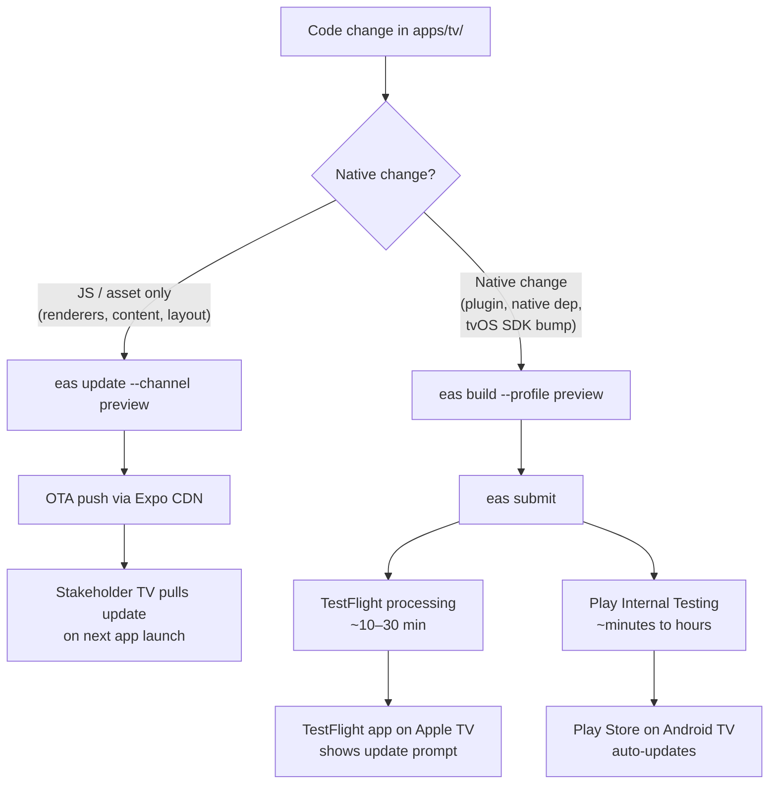

# TV App — Internal Stakeholder Distribution

## Problem Frame

The `apps/tv/` Expo TV app (Apple TV + Android TV) is in active prototype development with frequent iteration on SDUI renderers. A small group of internal stakeholders (2–5 people: design, product, ministry leads) need to be able to **install and run the TV app on their own personal Apple TV or Android TV**, keep it installed indefinitely, and pick up new builds without any tunnelling, ADB session, USB cable, or developer machine being involved.

Today there is no such path: no `eas.json` exists in `apps/tv/`, the bundle IDs (`org.jesusfilm.forgetv` for both platforms) are not yet registered in App Store Connect or Google Play Console (assumed, to be verified during the account-access prerequisite), and no internal-tester groups have been provisioned. Anything stakeholders see must currently come from a build running off Urim's machine — which doesn't satisfy "available at any time."

## Approach

**Approach D — Store-track internal testing on both platforms (TestFlight + Google Play Internal Testing) as the install rails, with EAS Update layered on top for OTA JS-only changes.**

This makes JS-only iterations (the dominant case for an SDUI renderer prototype) reach stakeholders in seconds with no rebuild and no install prompt, while native changes still flow through a normal EAS Build + EAS Submit. No per-build human review applies after first-build clearance: TestFlight Internal Testing skips Beta App Review for ASC-user testers (only export-compliance and automated processing apply, and `ITSAppUsesNonExemptEncryption: false` is already set in `app.json`); Play Internal Testing has no human review tier; EAS Update OTA pushes bypass review entirely.

## Requirements

**Build & Submit Pipeline**

- R1. `apps/tv/eas.json` defines a `preview` build profile for both platforms producing internal-distribution-ready binaries: signed `.ipa` for tvOS submitted to TestFlight, signed `.aab` for Android TV submitted to the Play Console Internal Testing track.
- R1a. An EAS project is initialized for `apps/tv/` under a JFP **organizational** Expo account (not a personal account), separate from `apps/mobile/`'s project but co-located in the same org so secrets and channel-push rights survive personnel changes. `apps/tv/app.json` gains `owner`, `extra.eas.projectId`, `updates.url`, and a `runtimeVersion` entry — mirroring the shape already present in `apps/mobile/app.json` but with a TV-specific projectId.
- R2. `eas submit` works end-to-end for both platforms from Urim's machine using non-interactive credentials (App Store Connect API key for iOS, Play Console service account JSON for Android), so the full ship sequence is `eas build --profile preview --platform all && eas submit --profile preview --platform all` with no manual upload steps. Both credentials are stored in EAS Environments (visibility: sensitive) or the existing Doppler instance — never on local disk in source-controlled or shared locations — matching the secret-handling pattern already used by `apps/mobile/` (see `apps/mobile/.env.example` for the documented Doppler + EAS Environments split).
- R3. The `preview` profile uses environment values appropriate for staging-like internal use (e.g. CMS endpoint, GraphQL URL) — defined alongside the profile so stakeholders aren't pointed at dev-only or production-only data.

**OTA Updates**

- R4. EAS Update is configured with a `preview` channel that the `preview` build profile subscribes to, so any `eas update --channel preview` push reaches stakeholders' installed builds on next app launch. This requires adding `expo-updates` to `apps/tv/package.json` (`apps/mobile/` already depends on it; `apps/tv/` does not yet) and running `eas update:configure`, which writes the `updates.url` and `runtimeVersion` entries into `apps/tv/app.json` covered by R1a. Without these prerequisites, `eas update` calls succeed at the CDN but reach no installed app.
- R5. Runtime version policy is set to `policy: "fingerprint"` (not `sdkVersion` as `apps/mobile/` uses). The `react-native-tvos` fork can move its RN minor without an Expo SDK bump, and a `sdkVersion` policy would let an OTA push reach a binary whose native side has actually changed. `fingerprint` keys the runtime to the prebuild output, catching native drift automatically. Native changes bump the fingerprint and force a rebuild; JS/asset changes do not. The policy is documented in `apps/tv/CLAUDE.md` (per R12) so it isn't a tribal-knowledge trap.
- R6. Stakeholders can identify which JS bundle they are running by opening the **Expo Dev Menu** (dev-client builds expose this without code changes), with the lookup steps documented in the stakeholder onboarding doc (R8). Avoids building a new in-app UI surface for an audience small enough to ask directly.
- R6a. EAS Update fallback behavior is explicit: on update-check failure (CDN unreachable, network timeout) the app proceeds with the embedded JS bundle within a bounded timeout (Expo's default `fallbackToCacheTimeout` is acceptable; document the chosen value). This guarantees the app launches for a stakeholder demo even during an Expo / Cloudflare incident.
- R6b. Push authority for the `preview` channel is bounded: only members of the JFP organizational EAS account with the necessary role can push, the EAS project's member list is reviewed before stakeholder onboarding, and `expo-updates` codesigning is configured (or explicitly deferred) so the runtime can verify bundle authenticity. Single-actor push is acceptable for the prototype window if the channel cannot be extended to other publishers without an explicit role grant.

**Stakeholder Onboarding**

- R7. Each stakeholder is added as an **Internal Tester** in App Store Connect (their Apple ID added as an ASC user with the `Developer` role or to an Internal Tester group) and as a tester in the Play Console Internal Testing tester list (Google account / group).
- R7a. Offboarding procedure is documented: removing a stakeholder requires removing them from the ASC tester group **and** the Play Console tester list. EAS Update has no per-user revocation — once a binary is installed, it continues to receive OTA pushes from the channel until the stakeholder uninstalls the app. Document this limitation so future operators don't assume tester-list removal stops update delivery.
- R8. A short stakeholder-facing onboarding doc lives in the repo (e.g. `apps/tv/docs/stakeholder-install.md`) with literal step-by-step install instructions for both platforms — including the Apple TV TestFlight install flow (which is non-obvious: TestFlight is a separate tvOS app stakeholders must install first) and the Android TV Play Internal Testing opt-in URL flow. The doc opens with a **pre-onboarding device checklist** covering Apple TV configurations that block install (Family Sharing / child Apple ID, Screen Time / Restrictions, MDM-managed Apple IDs) and Android TV configurations (Play Store presence, sideload-permission state) — surfaced before the install steps so failures are diagnosed in seconds rather than 10 minutes.
- R9. After initial onboarding, stakeholders receive new native builds **passively** (TestFlight shows an update prompt; Play Store auto-updates by default) and OTA JS pushes **silently** (next app launch). No re-onboarding step is required for new builds.

**Operational Workflow**

- R10. Shipping a JS-only change to all stakeholders is a single command (`eas update --channel preview`) and reaches them within minutes of next app launch.
- R11. Shipping a native change is a documented two-command sequence (`eas build --profile preview --platform all` then `eas submit --profile preview --platform all`) with no manual ASC/Play Console clicking required per build.
- R12. The repo documents (in `apps/tv/CLAUDE.md` or a colocated doc) when a change is JS-OTA-eligible vs requires a rebuild, so future agents working on the TV app can ship correctly without rediscovering the rules.
- R12a. A **TestFlight keep-alive cadence** is enforced: a fresh native build is cut and submitted at least every 60 days even if no native changes have landed, because TestFlight builds expire 90 days after upload and an expired build refuses to launch regardless of OTA status (OTA cannot rescue an expired host binary). The 90-day expiration and the 60-day keep-alive floor are called out in the stakeholder onboarding doc (R8) so a stakeholder opening the app on day 91 understands the failure mode.

**Account & Listing Prerequisites** _(unblocking work, not implementation)_

- R12b. A **stakeholder device survey** is completed before R13/R14 work begins, enumerating each of the 2–5 stakeholders' TV hardware (Apple TV model + tvOS version, Android TV / Google TV / Fire TV / Roku / smart-TV-built-in OS) and the Apple ID / Google account they intend to use. Outcome scenarios explicitly addressed: (a) all stakeholders have Apple-TV-only → defer R14 entirely until a real Android stakeholder emerges; (b) some stakeholders have Fire TV / Roku / Tizen / webOS → those stakeholders are either loaned a compatible device or carved out of the initial rollout (do not pretend the Android pipeline serves them); (c) mixed but small → both pipelines proceed. The survey is **a R13/R14 prerequisite**, not a deferred verification step.
- R13. Confirm JFP's Apple Developer Program membership exists, identify its admin, and obtain ASC access for Urim with sufficient role to register the `org.jesusfilm.forgetv` tvOS app entry, manage internal testers, and create an App Store Connect API key. Includes a **bundle-ID availability audit**: confirm `org.jesusfilm.forgetv` is not already registered (as a placeholder, a shipped app, or a similar-named app that could trigger Apple's "similar to existing app" flags) in the JFP account, because namespace conflicts in `org.jesusfilm.*` could silently block registration or force unexpected metadata review.
- R14. Confirm JFP's Google Play Console exists (or open one if not), obtain admin access for Urim, register the `org.jesusfilm.forgetv` Android TV app, and complete the Internal Testing prerequisites — which are **more than "minimal"**: the store listing form, content rating questionnaire, privacy policy URL, target API/SDK declarations, the mandatory **Data Safety form** (asks SDK-level data-collection questions that an SDUI app fetching from Strapi must answer accurately), TV form-factor declaration with Leanback launcher intent, and a TV banner asset. If the account is newly registered, Google's 2024+ policy requiring a 12-tester / 14-day closed-testing cohort applies to higher tiers; this does not block Internal Testing but is a boundary to not cross. Create a service account JSON for `eas submit` with the **minimum-necessary IAM role** (Release Manager scoped to the single `org.jesusfilm.forgetv` app, not an org-wide Admin role), stored alongside the ASC API key per R2.

## Success Criteria

- A stakeholder with a personal Apple TV (running tvOS 16+, matching the project's deployment target) can complete the onboarding doc in under 10 minutes and reach the TV app's home screen.
- A stakeholder with a personal Android TV / Google TV can complete the onboarding doc in under 10 minutes and reach the TV app's home screen.
- Once onboarded, a stakeholder receives a JS-only change (e.g. a renderer tweak) on next app launch with **zero action** beyond opening the app.
- Once onboarded, a stakeholder receives a native rebuild via a TestFlight/Play update prompt with at most one tap, and never needs to re-enter an invite code, sign in again, or sideload anything.
- The full ship sequence for a JS change is one command from Urim's machine; for a native change it is two commands; neither requires opening App Store Connect or Play Console UIs per build.
- **Invite re-issuance** survives Urim being unavailable: another team member with ASC and Play Console access can re-issue an invite using only the in-repo docs. **Shipping new builds and OTA pushes do not survive Urim's absence by design** — the ship sequence runs from Urim's machine with Urim's ASC user. If multi-operator shipping becomes necessary, it is a follow-up (requires secondary ASC/Play admin access, credentials in a shared store beyond Urim's local `.env.local`, and a tested runbook).

## Scope Boundaries

- **Not** in scope: external (non-internal) TestFlight testers, public beta, App Store / Play Store production listings, marketing copy, screenshots beyond what Internal Testing minimally requires.
- **Not** in scope: crash reporting (Sentry, etc.), analytics, remote logging — explicitly deferred. R6's Expo Dev Menu lookup is a manual debugging aid, not a telemetry pipeline.
- **Not** in scope: CI-driven automatic builds on every commit. Initial scope is Urim manually running `eas build` / `eas submit` / `eas update` from his machine. CI automation is a follow-up if the cadence justifies it.
- **Not** in scope: a custom MDM, internal app catalog, or in-house update server. EAS Update + the official TestFlight/Play install rails are the answer.
- **Not** in scope: shared distribution config with `apps/mobile/`. The mobile app already has its own `eas.json` and credentials; the TV app gets a parallel-but-independent setup. This is a deliberate bet that two small config files are cheaper to maintain than one shared one right now, acknowledged to compound divergence cost later (every cross-cutting change — credential rotation, EAS CLI bump, channel rename, env-var convention — gets paid twice). Trigger for consolidation: when both apps need a synchronized credential rotation or an EAS CLI major bump that touches both configs, unify then rather than pre-emptively.
- **Not** in scope: changes to the TV app's runtime behavior, renderers, or feature surface. This work is purely about distribution and update plumbing.

## Key Decisions

- **TestFlight + Play Internal Testing chosen over EAS internal-distribution URLs**: EAS internal distribution works for iPhones (Safari install) but is effectively non-viable for Apple TV (no Safari, install requires Xcode). TestFlight is the only stakeholder-friendly tvOS install path, so symmetry pushes Android to Play Internal Testing.
- **Hybrid TestFlight + APK sideload (Approach C) rejected**: with multiple builds per week, requiring Android stakeholders to manually re-sideload on every build creates per-build friction that compounds; the one-time Play Console listing setup is a smaller ongoing cost than the recurring sideload UX hit.
- **EAS Update adopted from day one rather than added later**: builds are frequent and predominantly JS (SDUI renderer iterations), so the cost of the OTA discipline (runtime version bumps, channel awareness) is repaid almost immediately in saved build minutes and quieter stakeholder UX. Adopting it later would require throwing away muscle memory built around full rebuilds.
- **Internal Testing tier chosen for both stores (not external/closed)**: 2–5 stakeholders fits well under the 100-tester internal cap on both platforms, and internal tier explicitly skips Apple Beta App Review.
- **Account access treated as a real prerequisite (R13/R14), not assumed**: Urim does not currently know the state of JFP's ASC and Play Console access. Implementation cannot start until these are sorted, so they are first-class blocking prerequisites, not "deferred."

## Dependencies / Assumptions

- **Assumed**: JFP already holds an Apple Developer Program membership (strong signal: `apps/mobile/` ships via EAS to internal distribution, which implies existing ASC + signing credentials). To be confirmed under R13.
- **Assumed**: JFP either holds a Google Play Console developer account or can open one for $25 one-time. To be confirmed under R14.
- **Assumed**: stakeholders' Apple TVs run tvOS 16.0+ (matches `app.json` `tvosDeploymentTarget: "16.0"`) — Apple TV HD and Apple TV 4K (2nd/3rd gen) all qualify.
- **Assumed**: stakeholders' Android TVs / Google TVs run a Play Store-bearing OS (so e.g. an unrooted Fire TV would _not_ be a target — it has Amazon Appstore, not Play Store). To verify with the actual stakeholder list.
- **Depends on**: someone with JFP admin rights granting Urim the necessary roles in ASC and Play Console.

## Outstanding Questions

### Resolve Before Planning

- _(none — all product-level decisions are settled. Implementation can proceed once R13/R14 access is granted.)_

### Deferred to Planning

- [Affects R1][Technical] `apps/tv/eas.json` defines **only** the `preview` profile on this pass. `development` and `production` profiles are deliberately not defined upfront — scope excludes production listings, and the dev-client workflow doesn't yet need a distinct `development` profile. Add them later only when a concrete need appears.
- [Affects R1][Technical] The repo root `/eas.json` already exists and defines a `preview` profile with `distribution: "internal"` and `appVersionSource: "remote"`. Confirm during planning whether EAS CLI inherits this when an app-level `apps/tv/eas.json` is absent or partially defined, and ensure `apps/tv/eas.json` correctly **overrides** `distribution: "internal"` so the `preview` build flows to TestFlight / Play Internal Testing rather than EAS's internal-distribution URL surface.
- [Affects R2][Technical] App Store Connect authentication: API key (`ASC_KEY_ID` / `ASC_ISSUER_ID` / `.p8`) is the recommended modern path for `eas submit`, but Apple ID + app-specific password also works. Pick one and document credential storage location (EAS Environments or Doppler per R2).
- [Affects R3][Technical] Where do `preview`-profile env values come from — `app.config.js` extra, EAS env-var settings, or a `.env.preview` pattern matching how `apps/mobile/` does it? Resolve during planning by reading the mobile setup; if the answer is "same mechanism as mobile," R3 collapses to `environment: "preview"` on the `preview` profile.
- [Affects R3][Needs research] Characterize the data served by the `preview`-profile CMS/GraphQL endpoint: is it published-only content, draft-inclusive, or does it include any PII (user accounts, donor data)? Stakeholder personal TVs have no MDM / enterprise data controls, so data reaching them matters. Tighten token scope or Cloudflare WAF rules on the preview endpoint if sensitive.
- [Affects R6b][Technical] Decide whether `expo-updates` codesigning is configured for the `preview` channel now, or explicitly deferred to a follow-up. Deferring is acceptable for a prototype, but should be named as a choice rather than an oversight.
- [Affects R7][Technical] Are stakeholders added individually to ASC/Play, or is a Google Group / ASC tester group used for easier add/remove? Depends on whether the stakeholder list is volatile.
- [Affects R8][Technical] Confirm during planning that the Apple TV TestFlight install flow actually works as documented (Apple TV running tvOS 16+, TestFlight installable from the tvOS App Store, invite redemption flow). Worth a quick smoke test on real hardware before writing the stakeholder doc.
- [Affects R14][Needs research] Play Console privacy policy URL is mandatory even for Internal Testing — confirm whether JFP has an existing privacy policy URL that can be reused or whether one needs to be authored / linked.
- [Affects R14][Needs research] Confirm Android TV submission specifics: Google Play distinguishes TV vs phone form factors; the listing must declare TV support via Leanback launcher intent and may require a TV banner asset. Verify the minimum required asset set for Internal Testing.

## Next Steps

`-> /ce-plan` for structured implementation planning. The plan should sequence R13/R14 (account access prerequisites) explicitly as a blocking first phase before any `eas.json` work begins, since they gate everything downstream.
