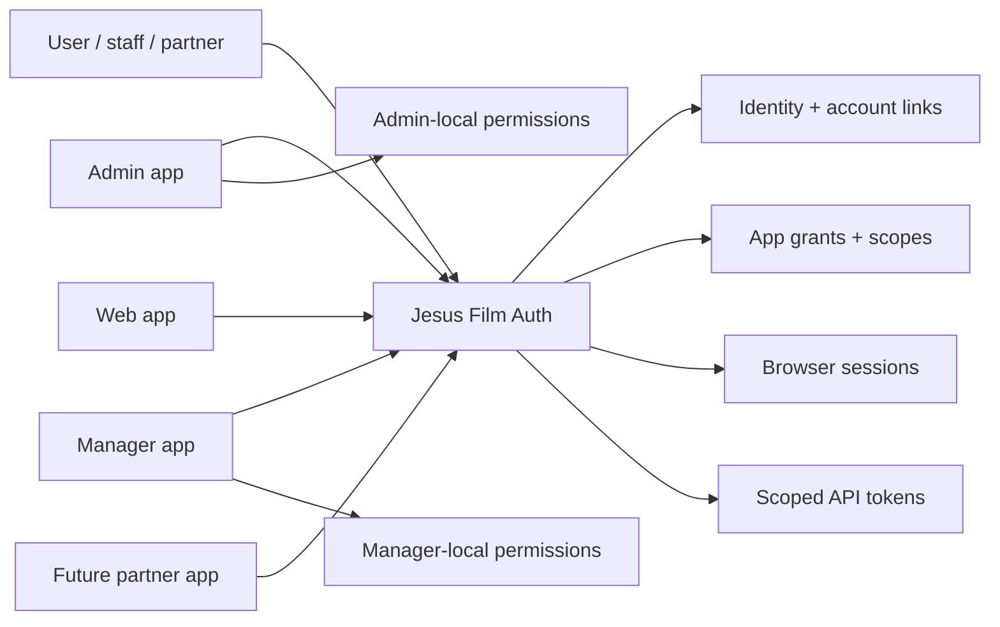

# Jesus Film Auth Platform

## Problem Frame

Authentication currently lives inside `apps/admin`, even though the intended
domain is broader than admin. `auth.jesusfilm.org` already behaves like a
central SSO origin, but the Better Auth configuration, user/session tables,
Firebase migration path, trusted origins, and role model are still coupled to
admin's app boundary.

The current admin login path is also not a reliable proof of SSO because it
depends on cross-subdomain cookie sharing between the auth and admin origins.
That coupling makes the browser cookie jar part of the app boundary and blurs
whether admin is truly consuming a central Auth authority or relying on a
colocated admin-specific workaround. The new direction is to abandon shared
cookies for admin: Auth should keep its own Auth-domain session, while admin
acts as a proper OAuth/OIDC-style Auth consumer with its own app-local session
or token validation boundary.

Jesus Film needs a standalone Auth project that can serve as the identity and
authorization entry point for first-party applications across local, staging,
preview, and production environments. The platform should remove the need for
each app to maintain separate Firebase dev/stage/prod auth environments, while
leaving room for future partner or external applications to register and request
access.

## Requirements

**Identity Authority**

- R1. Auth is extracted from `apps/admin` into its own application/service and
  becomes the canonical Jesus Film identity authority.
- R2. Auth owns login, SSO provider configuration, Better Auth sessions,
  Firebase lazy migration, account linking, trusted origins, and user identity.
- R3. Admin becomes a relying application/client of Auth rather than the owner
  of Auth behavior.
- R4. Existing admin user rows do not need to be migrated from the current
  Better Auth tables. Auth can start from Auth-owned identities and explicit
  app grants.
- R5. The first implementation must migrate `apps/admin` to authenticate
  through the standalone Auth service before the extraction is considered
  complete.
- R5a. Auth owns global membership: whether a person is an approved Jesus Film
  identity allowed to use first-party systems at all.

**Scopes and Authorization**

- R6. Auth uses scopes as the cross-application authorization primitive.
  Scopes describe what an app may access or do, such as profile, email, admin
  access, content write, workflow trigger, or manager enrichment run.
- R6a. Auth owns app-level grants/scopes that decide which registered apps a
  person or service may access.
- R7. Auth may still expose coarse shared standing, but app-specific domain
  rules remain owned by each application. Roles are not the primary SSO
  contract.
- R8. Auth must make requested and granted scopes visible to users or operators
  during app authorization, account review, or operator review, even when the
  app is auto-approved.
- R9. First-party Jesus Film apps are auto-approved for configured scopes, but
  the scope grant is still recorded and visible for audit/review.

**Application Registry and Environments**

- R10. Auth owns an application registry for Jesus Film apps such as admin,
  manager, web, and future apps.
- R11. Each registered app can have environment-specific redirect origins and
  callback URLs for local development, previews, staging, and production.
- R12. Local and staging auth are first-class flows. Developers should not need
  separate Firebase dev/stage/prod projects just to authenticate app sessions.
- R13. Production app registrations and production scopes require stronger
  approval than local or staging registrations.

**Tokens and API Access**

- R14. Auth issues browser sessions for interactive app login.
- R15. Auth also issues scoped API access tokens for first-party app-to-app and
  server API calls.
- R16. Auth distinguishes user-delegated tokens from application/service tokens.
  User-delegated tokens preserve the human principal; service tokens preserve
  the calling app and environment principal.
- R17. Tokens must be auditable, revocable, scoped, and bounded by expiry.
- R18. Tokens are audience-bound and environment-bound. A token issued for one
  app or environment must not be accepted as a general-purpose credential for
  another app or production environment.
- R19. Token issuance follows least privilege: apps receive only the scopes
  configured and approved for that app, environment, token family, and caller.

**External and Partner Applications**

- R20. The Auth model must support future non-Jesus Film application owners,
  including partner organizations and external developers.
- R21. External/partner applications are not auto-approved by default. They
  require explicit approval before production use.
- R22. The product model must support trust tiers such as first-party,
  partner-approved, and external-untrusted.
- R23. Open self-service registration for external apps is not required for the
  first implementation slice, but the requirements and data model should not
  block it later.

**Operations and Audit**

- R24. Auth provides an operator-visible view of registered apps, environments,
  scopes, redirect origins, issued grants, active sessions, and token posture.
- R25. Auth records audit events for login, migration, app registration changes,
  scope approval changes, token issuance, token revocation, and suspicious or
  rejected auth attempts.
- R26. Auth has a clear emergency revocation story for an app, environment,
  user, session, or token family.
- R27. Auth audit logs must avoid storing raw secrets, bearer tokens, passwords,
  refresh tokens, or unnecessary PII.
- R27a. Auth deploys as its own Railway service, separate from admin, with its
  own healthcheck, environment variables, database migration path, and custom
  domain ownership for `auth.jesusfilm.org`.

**Admin Migration**

- R28. `apps/admin` must use Auth as its login/session authority after the
  extraction, while continuing to enforce admin-local permissions and ABAC.
- R29. Admin must request explicit Auth scopes for the capabilities it needs,
  including dashboard access, content editing, media operations, workflow
  triggering, and user administration.
- R30. Admin must keep its existing protected routes, GraphQL scope-auth gates,
  workflow trigger protections, and admin-only settings semantics after the
  migration.
- R31. Admin login, logout, session refresh, and unauthorized redirects must
  continue to work across `admin.jesusfilm.org`, `auth.jesusfilm.org`, local
  development, staging, and preview environments.
- R32. Admin must not rely on Auth-domain cookies being shared with
  `admin.jesusfilm.org`. Auth-domain cookies stay scoped to Auth; admin receives
  identity and grants through an explicit OAuth/OIDC-style consumer flow.
- R33. Admin must establish its own app-local authenticated state after Auth
  completes login, using a planned exchange/verification mechanism rather than
  reading a shared parent-domain session cookie.
- R34. Local development, preview deployments, staging, and production must use
  the same conceptual consumer flow, with environment-specific app
  registrations and redirect URLs.

## Relationship Model

## Success Criteria

- Admin can authenticate through the standalone Auth service instead of owning
  its own embedded Better Auth route.
- A user can sign into Auth and return to admin with an admin-local
  authenticated state established through an explicit OAuth/OIDC-style consumer
  flow, not a shared `.jesusfilm.org` cookie.
- Auth can deny app access for a person who is not globally approved or lacks
  the app-level scopes/grants for admin.
- Local and staging admin authentication work through documented Auth app
  registrations rather than separate Firebase projects or ad hoc cookie
  workarounds.
- Admin's protected dashboard, GraphQL mutations, workflows, media surfaces,
  and user-management screens still enforce their existing authorization
  boundaries after migrating to Auth.
- A first-party app can be registered with separate local, staging, and
  production redirect origins and configured scopes.
- A developer can use central Auth for local development without provisioning a
  separate Firebase auth environment for that app.
- Auth can issue both browser sessions and scoped API tokens, with clear audit
  records for each.
- Scope grants are inspectable by operators and can be revoked.
- Tokens issued for local or staging app registrations cannot be used as
  production credentials.
- The model can represent future partner/external apps without opening public
  self-service registration in v1.

## Scope Boundaries

- Do not build a public external developer portal in the first slice.
- Do not make Auth the owner of every app's fine-grained domain authorization.
  Apps still enforce local business rules after receiving identity/scopes.
- Do not require user consent prompts for trusted first-party Jesus Film apps in
  v1. First-party grants are auto-approved by configuration.
- Do not decommission Firebase for existing users without a verified migration
  path.
- Do not turn admin-specific workflow, content, or media permissions into a
  global Auth product unless they are needed as cross-app scopes.

## Key Decisions

- **Scope-first SSO contract:** Scopes are more explainable than roles at the
  app authorization boundary and support future token issuance, audit, and
  external app review.
- **Hybrid membership/access model:** Auth owns global membership plus
  app-level grants/scopes. Apps own detailed domain permissions and ABAC after
  Auth has established the user or service principal.
- **First-party auto-approval:** Jesus Film apps should feel seamless to staff
  and developers. Scope disclosure and audit matter, but repeated consent
  screens would add friction without meaningful internal-user value.
- **API tokens in v1:** Auth should be a platform surface, not only a login
  page. Supporting user-delegated and service tokens early prevents each app
  from inventing its own bearer-token pattern.
- **External apps as future-capable, not first-slice open registration:** The
  registry should model partner and external ownership from the beginning, but
  public self-service review flows can wait until the trusted first-party path
  is working.

## Existing Context

- `apps/admin/src/auth/config.ts` currently creates the Better Auth instance.
- `apps/admin/src/app/api/auth/[...all]/route.ts` owns the Better Auth route,
  Firebase lazy migration wrapper, CORS behavior, and auth rate limiting.
- `apps/admin/src/auth/origins.ts` currently hardcodes production auth defaults
  and trusted app origins.
- `apps/admin/src/auth/config.ts` currently attempts cross-subdomain sessions
  through `AUTH_COOKIE_DOMAIN`; the new direction is to retire this as the
  admin/Auth integration mechanism.
- `apps/admin/prisma/schema.prisma` currently stores Better Auth `User`,
  `Session`, `Account`, and `Verification` models alongside admin domain data.
- `docs/solutions/auth/better-auth-secret-must-not-fallback-to-hardcoded-value.md`
  and
  `docs/solutions/auth/better-auth-firebase-migration-must-block-public-signup.md`
  capture existing auth safety constraints that must carry forward.

## Dependencies / Assumptions

- Better Auth remains the underlying auth framework unless planning discovers a
  blocking limitation.
- `auth.jesusfilm.org` remains the canonical production Auth origin.
- `apps/auth` will deploy on Railway as a separate service from `apps/admin`.
- First implementation should prioritize `apps/admin` as the first relying
  client because auth is currently embedded there.

## Outstanding Questions

### Resolve Before Planning

- None.

### Deferred to Planning

- [Affects R4][Technical] Should the first extraction use a temporary shared
  database bridge, a separate Auth database from day one, or a hybrid migration
  path?
- [Affects R6-R19][Needs research] What Better Auth features or plugins should
  back scoped tokens, app registration, token introspection, and revocation?
- [Affects R13][Technical] What approval workflow should distinguish local,
  staging, preview, and production app registrations?
- [Affects R15-R19][Security] What token format, storage, expiry, rotation, and
  introspection model should be used for user-delegated and service tokens?
- [Affects R20-R23][Product] What minimum fields are needed now to avoid
  blocking future partner/external app ownership without shipping a public
  developer portal?
- [Affects R28-R34][Technical] Should admin establish app-local authenticated
  state through an OAuth/OIDC-style authorization-code flow, token
  introspection, signed JWT verification, or a transition-specific bridge?

## Next Steps

-> `/ce:plan` for structured implementation planning.
