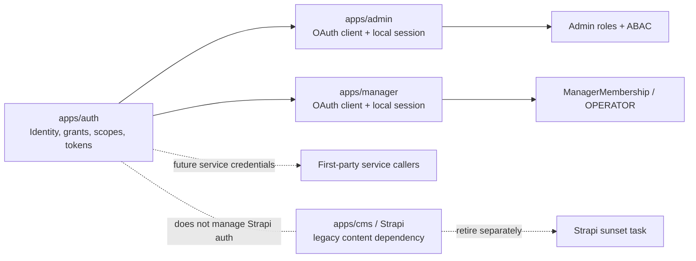

# Auth Consolidation Across Apps

## Problem Frame

Jesus Film now has a standalone Auth app, and the repo has already started
moving first-party staff tools toward OAuth with app-local sessions. The next
problem is consolidation: make Auth the clear authority for human identity,
app-level grants, and eventually service credentials without accidentally
deepening Strapi's role in the platform.

Strapi/CMS should be retired in a separate decommissioning effort. This work
must not migrate Strapi admin users, Strapi API tokens, or Strapi GraphQL auth
onto the new Auth system. Strapi remains a legacy dependency to remove, not a
first-party OAuth relying client to modernize.

## Requirements

**Human App Login**

- R1. First-party staff apps that require human login use `apps/auth` as the
  OAuth/OIDC identity authority and establish app-local sessions after callback.
- R2. Downstream apps must not rely on shared `.jesusfilm.org` cookies,
  Auth-domain cookies, Admin cookies, or Strapi cookies as their primary login
  boundary.
- R3. `apps/admin` remains an Auth relying client and keeps Admin-local
  session state after OAuth login.
- R4. `apps/manager` remains a separate Auth relying client and keeps
  Manager-local session state after OAuth login.
- R5. Legacy Manager `strapi-jwt` cookies must not grant Manager dashboard
  access. They may exist only as rollback/deletion hazards until the Strapi
  removal task eliminates the dependency.

**Authorization Model**

- R6. Auth owns global membership, registered app access, app-level scopes,
  grants, revocation, and audit for first-party apps.
- R7. Auth does not own app-specific domain authorization. Apps continue to
  enforce their own business permissions after Auth establishes the principal.
- R8. Admin keeps editorial roles, coarse permission keys, and ABAC checks
  locally.
- R9. Manager access requires explicit Manager authorization such as active
  Admin-owned `ManagerMembership` with `ManagerRole.OPERATOR`; Admin editorial
  roles alone must not imply Manager access.
- R10. Auth scopes describe the cross-app authorization contract. App-local
  roles and ABAC describe what the user may do inside a specific app.

**Service-To-Service Credentials**

- R11. Existing env-CSV bearer surfaces may remain during the migration when
  they are bounded, internal, documented, and covered by narrow permission
  allowlists.
- R12. New long-lived service credentials should default toward Auth-owned,
  scoped, audience-bound, environment-bound, expiring, revocable credentials
  unless a documented exception justifies an env-CSV bearer.
- R13. The consolidation plan must inventory every service bearer surface and
  classify it as keep as-is, convert to Auth-issued service credential, replace
  by a different app contract, or delete during Strapi retirement.
- R14. Service credentials must not be able to create human app sessions or
  satisfy human-only app access such as Manager dashboard access.
- R14a. A legacy bearer may be removed only after the receiving app validates
  the replacement credential's issuer, audience, environment, scopes, expiry,
  and revocation posture.

**Strapi Boundary**

- R15. `apps/cms` must not become an OAuth relying client of `apps/auth` as
  part of this work.
- R16. This work must not restructure Strapi admin authentication, Strapi
  users/roles, Strapi API tokens, or Strapi GraphQL plugin auth.
- R17. Work that removes Strapi dependencies belongs in the separate Strapi
  sunset/decommissioning track, not in Auth consolidation.
- R18. Auth consolidation may remove other apps' dependency on Strapi auth
  artifacts, but only by moving those apps to Auth/Admin-owned contracts, not
  by modifying Strapi authentication.

**Operational Visibility**

- R19. Operators can tell which app grants, scopes, sessions, and service
  credentials are Auth-owned versus legacy/local bearer credentials.
- R20. Cutover and rollback notes must preserve receiver-first deployment
  ordering for service credentials so callers are not deployed before receivers
  can validate them.
- R21. Auth-related audit logs must avoid storing raw secrets, bearer tokens,
  refresh tokens, passwords, client secrets, or unnecessary PII.

## Relationship Model

## Success Criteria

- Admin and Manager human login both flow through Auth OAuth and establish
  host-local sessions.
- A Manager dashboard request with only legacy Strapi auth is rejected.
- Admin editorial permissions do not grant Manager dashboard access unless
  the user also has explicit Manager membership.
- The repo has an inventory of app-local sessions, legacy cookies, env bearer
  surfaces, Auth-owned scopes, and Strapi-dependent auth artifacts.
- Each service-to-service credential surface has a disposition: keep, convert
  to Auth-issued service credential, replace, or delete with Strapi sunset.
- Any converted service credential is rejected when presented to the wrong app,
  environment, or scope boundary.
- No implementation unit asks Strapi/CMS to adopt Auth OAuth, Auth scopes, or
  Auth-managed users.
- Operator-facing docs clearly distinguish Auth-owned access from local app
  permissions and legacy Strapi dependencies.

## Scope Boundaries

- Do not migrate Strapi/CMS authentication to `apps/auth`.
- Do not make `apps/cms` an OAuth/OIDC relying client.
- Do not change Strapi admin users, Strapi roles, Strapi API token behavior,
  or Strapi GraphQL auth as part of Auth consolidation.
- Do not decommission Strapi data, schedulers, GraphQL consumers, or job state
  in this work. Reference the Strapi sunset track instead.
- Do not make Auth the owner of Admin ABAC, Manager role semantics, or
  app-specific business authorization.
- Do not require every existing env-CSV bearer to be migrated immediately.
  Some internal bearers may remain if their blast radius is intentionally
  narrow and documented.

## Key Decisions

- **Strapi is retired, not modernized:** Moving Strapi auth into Auth would add
  integration work to a dependency the product wants to remove. Deletion is the
  cleaner endpoint.
- **OAuth plus local sessions for human apps:** Auth should prove identity and
  app grants; each relying app should own its local browser session boundary.
- **Scopes at the app boundary, roles inside apps:** Auth scopes are the
  cross-app contract. Admin and Manager keep the local permission models that
  understand their domain data.
- **Service credentials migrate by inventory, not ideology:** Existing bearer
  keys have different risk profiles. The plan should classify them rather than
  forcing a one-size-fits-all migration.

## Dependencies / Assumptions

- `apps/auth` remains the canonical Auth service for first-party apps.
- `docs/brainstorms/2026-05-11-jesus-film-auth-platform-requirements.md` and
  `docs/roadmap/platform/feat-121-jesus-film-auth-platform.md` remain the
  foundation for Auth's identity, app registry, scope, token, and audit model.
- `docs/roadmap/platform/feat-125-manager-auth-oauth-admin-backend-migration.md`
  remains the current Manager OAuth and Manager membership migration origin.
- Strapi decommissioning should build on
  `docs/brainstorms/2026-05-11-consumer-migration-u5b-strapi-sunset-strategy-requirements.md`
  or a successor document rather than this Auth consolidation scope.

## Outstanding Questions

### Resolve Before Planning

- None.

### Deferred to Planning

- [Affects R11-R13][Needs inventory] Which bearer surfaces still exist across
  Admin, Manager, Web, Mobile, TV, CMS, scripts, and CI?
- [Affects R12-R13][Technical] Which existing env-CSV bearers should become
  Auth-issued service credentials in the first consolidation slice?
- [Affects R19][Technical] Which operator surface should show legacy/local
  bearers versus Auth-owned grants and tokens?
- [Affects R17-R18][Coordination] Which Strapi auth artifacts are deleted by
  Auth consolidation because other apps stop depending on them, and which are
  deferred to full Strapi sunset?

## Next Steps

-> `/ce:plan` for structured implementation planning.
