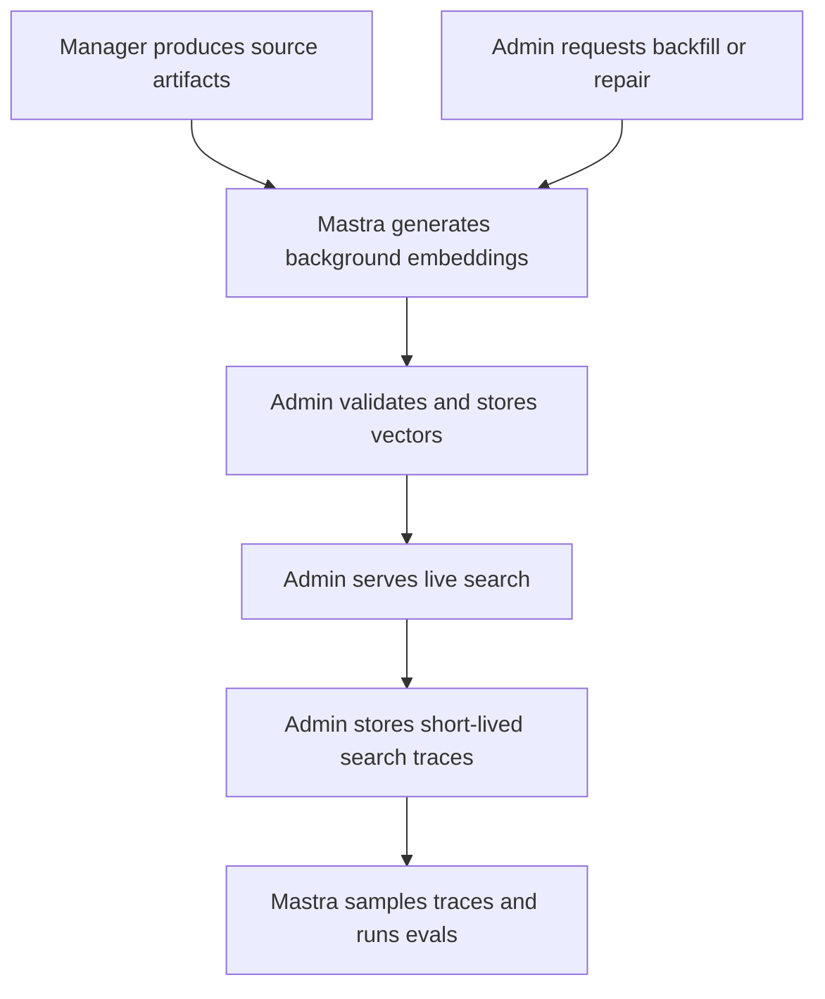

# Mastra Embedding and Search Observability Migration

## Summary

Mastra will become the owner of background embedding generation and embedding
workflow execution, while Admin remains the owner of vector storage, indexing,
and public search APIs. A second staged track will add semantic search
observability, with Admin retaining short-lived production search traces and
Mastra sampling them for eval generation, quality reports, and future retrieval
tuning.

---

## Problem Frame

Forge now has a deployed Mastra runtime and authenticated Studio gateway, but
embedding generation and embedding-related workflow ownership are still split
across Manager and Admin. Manager currently produces transcript embedding
artifacts for enrichment paths, Admin generates or imports other embeddings, and
Admin search reads the final pgvector state.

This split makes it harder to reason about which system owns AI provider calls,
batching, retries, provenance, costs, and run diagnostics. It also makes search
quality work harder to operate because retrieval behavior can change without a
first-class eval and trace loop tied to the workflows that created the vectors.

---

## Conceptual Flow

Prose requirements govern where this diagram compresses details.

---

## Actors

- A1. Manager: Produces media-derived source artifacts such as transcript text
  and timed segments, and launches Mastra for new enrichment work.
- A2. Admin: Owns vector persistence, search retrieval, public search
  contracts, backfill intent, and production search trace retention.
- A3. Mastra: Owns embedding workflows, provider calls, chunk planning where
  relevant, retries, provenance, and workflow observability.
- A4. Operator: Starts or reviews backfills, repairs, and search-quality work
  from the product surfaces and Mastra Studio.
- A5. Search evaluator: Uses Mastra reports to understand search quality,
  generate candidate evals, and promote stable regression benchmarks.

---

## Key Flows

- F1. Transcript embedding migration
  - **Trigger:** Manager produces transcript text and timed segments, or Admin
    requests a transcript embedding backfill or repair.
  - **Actors:** A1, A2, A3, A4
  - **Steps:** Manager or Admin launches Mastra; Mastra plans transcript chunks,
    generates chunk embeddings, records provenance, and submits final chunks and
    vectors to Admin; Admin validates and stores the vectors for search.
  - **Outcome:** Manager no longer generates transcript embeddings in either
    transcript-only or full enrichment paths.
  - **Covered by:** R1, R2, R3, R4, R7, R9, R10

- F2. Later embedding migrations
  - **Trigger:** Transcript migration contract proof is complete.
  - **Actors:** A2, A3, A4
  - **Steps:** Scene embeddings migrate next, then experience embeddings, using
    separate Admin ingest contracts and removing the old producer for each type.
  - **Outcome:** All background content embedding generation is owned by Mastra.
  - **Covered by:** R1, R5, R6, R7, R8, R9, R10

- F3. Search observability and eval generation
  - **Trigger:** Admin serves production search queries or Mastra runs offline
    search eval workflows.
  - **Actors:** A2, A3, A5
  - **Steps:** Admin records every production search trace for short-term
    retention; Admin applies basic quality and abuse labels; Mastra samples
    traces, optionally classifies ambiguous samples, generates candidate evals,
    and produces quality reports.
  - **Outcome:** Search quality can be measured and tuned without placing Mastra
    in the live user search path.
  - **Covered by:** R11, R12, R13, R14, R15, R16

---

## Requirements

**Embedding ownership**

- R1. Mastra must own all background content embedding generation after the
  migration, including provider calls, batching, retries, run diagnostics, and
  embedding workflow observability.
- R2. Admin must remain the authority for vector storage, indexing, publication
  gates, and public search API contracts.
- R3. Manager must remain the authority for media-derived source artifacts, but
  transcript embedding generation must leave Manager.
- R4. The transcript phase must remove Manager embedding generation from both
  the transcript-only trigger path and the full enrichment workflow path.
- R5. The migration order must be transcript embeddings first, scene embeddings
  second, and experience embeddings third.
- R6. The shared embedding-generation contract and hardening work must come
  after the concrete embedding types have migrated, unless planning finds a
  small shared primitive that is necessary for the first phase.

**Admin ingest and persistence**

- R7. Each embedding type must have a separate Admin ingest contract rather than
  a generic embedding blob contract.
- R8. Mastra must submit final embedding payloads to Admin: text/snippet content,
  relevant timing or locale facts, model/provenance metadata, dimensions, and
  vectors.
- R9. Admin ingest must validate authorization, identity, dimensions, model
  metadata, source/version metadata, and type-specific constraints before
  persisting.
- R10. Admin ingest must be idempotent by default and support explicit repair,
  force re-embed, and model-upgrade modes.

**Removal and proof**

- R11. As each embedding type migrates, the old embedding producer for that type
  must be removed rather than left as a long-term fallback.
- R12. Contract proof is the deletion gate: tests must show Mastra output is
  accepted by Admin ingest, stored in existing vector-backed search data, and
  readable by existing Admin search or retrieval behavior.
- R13. Parity and eval reports should support quality confidence, but they are
  not required as the gate for deleting old producer code.

**Provenance and observability**

- R14. Admin must store compact provenance for Mastra-written embeddings so a
  vector can be traced to source content, model/version, generation mode,
  timestamp, and Mastra run identity.
- R15. Manager and Admin product surfaces should show product-level status and
  outcomes, while Mastra owns detailed workflow traces, retries, provider
  calls, costs, and failure diagnostics.
- R16. Production embedding workflows should persist immediately through Admin
  ingest APIs; dry-run and eval modes may stop before writing.

**Search evals and traces**

- R17. Mastra must not participate in live user search request handling in V1,
  including live query embedding generation.
- R18. Admin must store every production search query run as the trace source of
  truth for no longer than 30 days.
- R19. After 30 days, per-query traces must be deleted; only aggregate metrics
  and human-approved sanitized or promoted eval queries may survive.
- R20. Admin must apply transparent first-pass query quality and abuse labels,
  and Mastra may use optional LLM classification for ambiguous or high-impact
  sampled queries.
- R21. Mastra eval generation must cover catalog-derived queries, multilingual
  locale-quality queries, and real viewer-intent queries.
- R22. Generated evals must use a hybrid truth model: source-anchored expected
  results for scale, judge scoring for nuance, and human promotion for durable
  regression gates.

---

## Acceptance Examples

- AE1. **Covers R4, R7, R8, R12.** Given transcript text and timed segments are
  available for a video, when Manager launches the transcript embedding workflow,
  Mastra generates final chunks and vectors, Admin accepts them through the
  transcript-specific ingest contract, and existing Admin search can read the
  stored transcript vectors.
- AE2. **Covers R10.** Given a transcript embedding workflow is retried with the
  same source content, chunking settings, model, and mode, when Mastra submits
  the same payload again, Admin treats the write as unchanged rather than
  blindly overwriting healthy vectors.
- AE3. **Covers R10, R16.** Given an operator explicitly requests a force
  re-embed or model-upgrade run, when Mastra submits new vectors, Admin accepts
  the intentional overwrite only under that explicit mode.
- AE4. **Covers R18, R19, R20.** Given Admin has stored production search traces,
  when a trace is older than 30 days, per-query trace data is deleted while
  aggregates and approved sanitized benchmarks may remain.
- AE5. **Covers R17.** Given a real user performs a search on the live site, when
  the request is served, Admin handles the production search path without
  requiring Mastra to generate the live query embedding or orchestrate retrieval.

---

## Success Criteria

- Mastra is the only system generating migrated embedding types, starting with
  transcript embeddings.
- Admin continues to serve the same public search contracts while reading
  vectors written through Mastra-owned workflows.
- Operators can tell whether an embedding run succeeded, skipped, repaired, or
  failed, and can inspect detailed diagnostics in Mastra.
- Search quality work gains a durable eval loop without adding Mastra to the
  live search path.
- Planning can break the migration into small PRs without re-litigating the
  ownership boundary.

---

## Scope Boundaries

- Do not move live user search orchestration into Mastra in V1.
- Do not move live query embedding generation into Mastra in V1.
- Do not move Admin vector storage, publication gates, or public search response
  contracts out of Admin.
- Do not implement transcript, scene, experience, and search observability in
  one giant PR.
- Do not keep old embedding producers indefinitely after a type has migrated.
- Do not treat generated production-trace eval candidates as durable benchmarks
  until they are sanitized and human-promoted.

---

## Key Decisions

- Mastra owns embedding generation; Admin owns persistence and search:
  Preserves Admin as the data/search authority while moving workflow intelligence
  and provider execution into the workflow runtime.
- Transcript first: It proves the Manager source artifact to Mastra workflow to
  Admin ingest path, and removes current Manager embedding generation from both
  transcript-only and full enrichment paths.
- Separate ingest contracts: Transcript, scene, and experience embeddings carry
  different identity, locale/timing, and validation rules.
- Immediate production writes: A successful production embedding workflow should
  mean Admin accepted the vectors, while dry-run/eval modes provide safety
  without creating import limbo.
- Contract proof gates deletion: The migration prioritizes a crisp ownership
  cutover over long-lived duplicate producers.
- Admin stores traces first: Production search observability remains anchored in
  Admin, with Mastra sampling from that source for evals and tuning.

---

## Dependencies / Assumptions

- `apps/mastra` and `apps/mastra-gateway` remain the deployed runtime and Studio
  surfaces for workflow execution and detailed observability.
- Admin can expose authenticated ingest capabilities for each embedding type
  without changing public search API contracts.
- Manager can launch Mastra for new enrichment work once transcript source data
  is available.
- Admin can launch Mastra for backfills, retries, repairs, and model-upgrade
  work.
- Production search trace storage is acceptable with a 30-day maximum raw
  retention window and sanitization before long-lived eval promotion.

---

## Outstanding Questions

### Resolve Before Planning

- None.

### Deferred to Planning

- [Affects R7-R10][Technical] Define the exact Admin ingest contract for the
  transcript phase and the minimum shared shape future scene and experience
  contracts should mirror.
- [Affects R10][Technical] Define how Admin decides unchanged, missing, stale,
  repairable, force, and model-upgrade states from Mastra-submitted provenance.
- [Affects R14][Technical] Decide where compact embedding provenance is stored
  for each embedding type and how search/debug surfaces read it.
- [Affects R18-R20][Technical] Design the production search trace retention,
  purge, quality-label, and abuse-label mechanism.
- [Affects R21-R22][Technical] Decide how generated candidate evals are reviewed,
  promoted, and protected from low-quality or adversarial production queries.

## Next Steps

Proceed to `/ce:plan` for the transcript embedding migration slice first, using
this document as the scope source.
