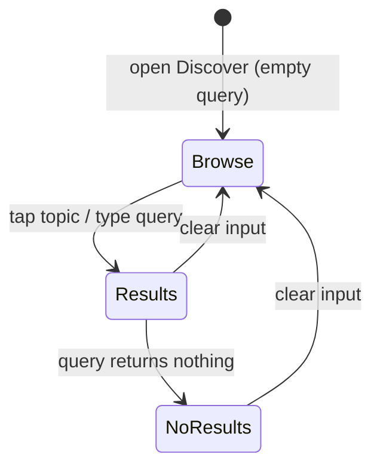

# Mobile Discover Browse Topics

## Summary

Add a browse-topics empty state to the mobile **Discover** tab: six gradient "bubble" chips — the same categories the web search overlay shows — rendered when the search box is empty. Tapping a bubble fills the search bar with its term and runs the search inline, replacing today's dead-end placeholder line.

---

## Problem Frame

On web, focusing the search bar reveals six category cards that turn an empty search into a one-tap starting point. Mobile has no equivalent: when the Discover search box is focused and empty, the screen shows a single line — _"Search for videos about any topic"_ — and nothing to act on. A user who opens Discover without a specific title in mind has to invent a query from a blank box. The browse topics give that user a concrete, tappable way in, and bring mobile to parity with a discovery affordance web users already have.

---

## Key Decisions

- Gradient bubbles over web's square cards. Mobile-shaped, compact, and thumb-friendly; honors the "bubbles not squares" intent while keeping each category's color identity.
- Tap fills the bar and auto-runs the search. Web runs the search but leaves the input empty; filling the visible input lets the user see and edit the term, matching "pre-fill and quickly search."
- Mirror web's six categories, hardcoded. Cross-platform parity and one shared mental model. Admin-driven or dynamic topics are deferred.

---

## Requirements

**Topics & content**

- R1. The Discover empty state presents six browse topics matching web: Bible Stories, Parables, Animated, Study, Family, Christmas.
- R2. Each topic has a display label and a distinct search term (mirroring web's term per category); the search term runs the query, not the label.
- R3. The topic set is hardcoded in the mobile app — no fetch and no admin configuration.

**Interaction**

- R4. Topics appear only when the search input is empty and no search has run or returned.
- R5. Tapping a topic fills the input with its search term and runs the search inline on Discover, with no navigation away from the tab.
- R6. Once a search runs, the existing result grid (or the existing no-results state) replaces the topics.
- R7. Clearing the search input back to empty returns the user to the browse-topics state.

**Visual & accessibility**

- R8. Topics render as gradient "bubble" chips — rounded pills with a soft per-topic gradient fill, a small leading icon, and the label — wrapping to fit the viewport width.
- R9. Each topic keeps a distinct color and icon identity, reusing web's per-category palette where practical, within the app's existing typography, spacing, and color tokens.
- R10. Each bubble is an accessible, tappable button with press feedback and a label conveying that it searches that topic.

### Empty-state lifecycle

---

## Key Flows

- F1. Browse to search
  - **Trigger:** User opens Discover (or clears the search box) with an empty query.
  - **Steps:** Six topic bubbles render → user taps one → the input fills with that topic's search term → the existing debounced search runs → results render in the grid.
  - **Outcome:** The user reaches a category's results in one tap, without typing.
  - **Covers:** R1, R4, R5, R6.
- F2. Return to browse
  - **Trigger:** User clears the search input back to empty.
  - **Steps:** The result grid is dismissed → the six bubbles re-render.
  - **Outcome:** The browse affordance is always the empty-state home for Discover.
  - **Covers:** R7.

---

## Acceptance Examples

- AE1. Empty Discover.
  - **Given** the Discover tab with an empty search box, **when** it renders, **then** the six topic bubbles show in place of the old placeholder text.
  - **Covers:** R1, R4, R8.
- AE2. Tap a topic.
  - **Given** the bubbles are showing, **when** the user taps "Christmas", **then** the input shows its search term and results for it render inline on Discover.
  - **Covers:** R2, R5, R6.
- AE3. Topic returns nothing.
  - **Given** a tapped topic returns no results, **when** the search completes, **then** the app shows its existing no-results state — not the bubbles.
  - **Covers:** R6.
- AE4. Clearing returns to browse.
  - **Given** results are showing from a tapped topic, **when** the user clears the input, **then** the six bubbles reappear.
  - **Covers:** R7.

---

## Scope Boundaries

- Admin-configurable or dynamically fetched topics — deferred; revisit if keeping web and mobile in sync becomes a maintenance pain.
- Search history, recent searches, and personalized or recommended topics — a separate feature.
- Changes to the Home tab, the `search` query, the result cards, or result navigation — out of scope; this feature reuses them as-is.
- Per-topic dedicated landing pages instead of running a search — out; tapping runs a search, matching web.

---

## Dependencies / Assumptions

- Builds on the existing Discover search on `main` (`apps/mobile/app/(tabs)/watch.tsx` plus `SEARCH` in `apps/mobile/src/lib/queries.ts`).
- Assumes the admin `search` query returns a useful mix for these terms — it already serves the same terms on web.
- Assumes the six generic search terms stay meaningful; if a term returns weak results, that is content/search tuning, not this feature.

---

## Outstanding Questions

**Deferred to Planning**

- Icon source: web's SVG icon set may not port directly to React Native — pick an RN-friendly icon source or matched glyphs.
- Gradient and contrast: reuse web's gradients as-is, or tune them for the dark Discover background while keeping the label legible.
- Clear affordance: confirm whether the search input already exposes a clear control, or one is needed, since R7 depends on reaching the empty state.
- Layout details: whether to show a small "Browse" heading above the bubbles, and whether they wrap into rows or sit in a single horizontal scroll row.

---

## Sources / Research

- Web prior art: `apps/web/src/lib/search-categories.ts` (the six categories and their search terms), `apps/web/src/components/SearchOverlay.tsx` (the grid and tap handler — tap runs `search(searchTerm)`), `apps/web/src/components/SearchCategoryIcons.tsx` (per-category icons).
- Mobile target: `apps/mobile/app/(tabs)/watch.tsx` (the Discover screen and its empty-state placeholder line), `apps/mobile/src/lib/queries.ts` (`SEARCH`), `apps/mobile/src/components/search/SearchResultCard.tsx` (the result grid).
- Reuse candidates: the `glassPill` pattern in `apps/mobile/src/components/ui/HomeHeader.tsx`, `useTypography` in `apps/mobile/src/hooks/useTypography.ts`, and color tokens in `apps/mobile/src/lib/color.ts`.
