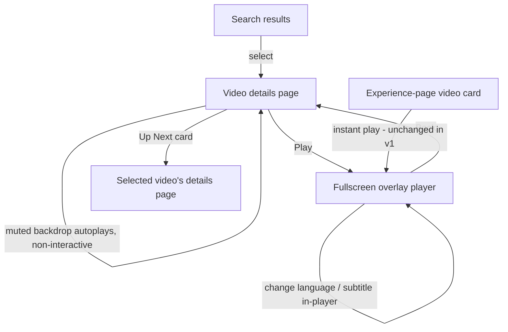

# TV Video-Details Page — Requirements

## Summary

A dedicated video-details page for the TV app (`apps/tv`), reached when a viewer selects a search result. A muted cinematic backdrop previews the film while a focused **Play** hands off to the existing fullscreen overlay player; below it sit title/metadata, description, an Up Next rail, Related Questions, and a Bible-quotes carousel — with language & subtitle selection (on the page and in-player) and capability-gated Share/Download. It reuses the app's existing renderers and overlay player, adapted to the 10-foot Crimson Gallery UI.

---

## Problem Frame

The web and mobile apps both have a video-details page: search for a video, open it, and land on a player surface with the video's text, related questions, "up next", and language/subtitle/download/share controls — all sourced from admin GraphQL.

The TV app has none of this. It has three screens (Home, Experience detail, Search) and plays videos only through a global fullscreen overlay triggered by a card's `onPress`. Selecting a search result jumps straight into that overlay — there is no surface that shows what a video _is_ (its description, languages, related questions, siblings) before or around playback. This brainstorm defines that missing surface for TV, preserving the web/mobile functionality where it makes sense at couch distance and dropping or re-shaping what doesn't (e.g., offline download). The bias throughout is **reuse**: the TV app already ships a muted-backdrop hero, a mature fullscreen player, and renderers for related questions / text / bible quotes.

---

## Key Decisions

- **Hybrid player model (backdrop preview + fullscreen handoff).** The page is a launch surface: a muted looping backdrop teases the film, and Play opens the existing fullscreen overlay. Chosen over an inline-autoplaying player because it composes two patterns the app already ships (the muted hero backdrop and the overlay player), keeping the overlay largely intact and the page on-brand with Home/Experience screens.
- **Search-only entry in v1.** The details page is reached from search results. Experience-page video cards keep their current instant-play behavior, so existing screens don't change.
- **Language & subtitle selection both pre-play and in-player.** The richest TV experience for a multi-language ministry catalog. Accepted consequence: the fullscreen overlay gains subtitle rendering and an in-player language/subtitle menu rather than being reused untouched.
- **Capability-probed Share & Download (native → QR → hide).** A living-room TV has no offline-viewing use case and no user-facing file system, so these actions probe platform capability: native intent if available, else a QR-to-phone handoff, else the action is hidden.
- **Reuse by mirroring.** No shared cross-app component package exists; apps share GraphQL fragments/operations, not React components. TV reuses its own existing renderers (related questions, text, bible quotes), the overlay player, and the QR `LinkModal`, and mirrors mobile's data operations.
- **Lean-bulk + lazy-per-dub data.** Some videos carry thousands of dubs, so the page fetches a lean video + dub-list payload and lazily loads per-dub subtitles/downloads only for the active dub.

---

## Entry & Playback Flow

---

## Requirements

### Page & Entry

- R1. A video-details page exists as its own TV screen, reached when a viewer selects a search result.
- R2. Selecting a search result navigates to the details page rather than starting playback directly. Experience-page video cards keep their current instant-play behavior in v1.
- R3. The page paints immediately with available seed data (title, thumbnail) while the full video payload loads.

### Backdrop preview & playback handoff

- R4. The upper region shows a muted, looping autoplay backdrop of the video, fading into the warm-stone background; it falls back to a cinematic still when no stream is available and is non-interactive.
- R5. A focused Play control starts playback in the existing fullscreen overlay player; the details page itself never becomes the playback surface.
- R6. The backdrop preview pauses while the fullscreen overlay is open and resumes when it closes.
- R7. Returning from the overlay restores focus to the details page (the Play control or the last-focused element).

### Language & subtitles

- R8. The viewer can choose the audio language (dub) on the details page before playing; the chosen dub is what plays.
- R9. The viewer can turn subtitles on/off and choose a subtitle language on the details page.
- R10. The viewer can change audio language and subtitles during fullscreen playback via an in-player menu, without exiting.
- R11. The active language and subtitle selection are a single shared source of truth across the details page and the in-player menu, and persist across the page ↔ fullscreen round trip.
- R12. Subtitles render as readable cues during fullscreen playback.
- R13. Selection surfaces use the TV overlay-panel vocabulary — a focusable list with a checkmark on the active row and a crimson focus glow — not a touch-style sheet.

### Content sections

- R14. The page shows the video title, metadata (e.g., label, duration, available-language count), and a description.
- R15. An "Up Next" rail shows sibling videos under the same parent; selecting a card opens that video's details page.
- R16. A "Related Questions" section shows the video's study questions as expandable rows; because the video data carries questions without inline answers, expanding presents a QR/CTA handoff (e.g., chat/ask on the viewer's phone) rather than an in-page answer.
- R17. A "Bible Quotes" section shows the verses referenced by the video.

### Share & Download (capability-gated)

- R18. Share and Download are capability-probed per platform: use a native intent when the platform exposes one, else a QR-to-phone handoff, else hide the action entirely.
- R19. The Share handoff opens/share the video on the viewer's phone; the Download handoff continues the download on the viewer's phone. No file is stored on the TV.

### Data & performance

- R20. The page fetches a lean video payload (video plus dub list, excluding per-dub media) and lazily fetches subtitles/downloads only for the active dub.
- R21. Re-entering a previously viewed video reads from cache without a blocking refetch.

### TV UX & focus

- R22. Every interactive element is D-pad focusable with the crimson focus treatment; the layout respects the 80px safe-gutter and 10-foot type scale.
- R23. The page follows the Crimson Gallery system — warm stone surfaces, crimson used sparingly for the focused control and active state, no borders.

---

## Key Flows

- F1. Search → details
  - **Trigger:** Viewer selects a search result.
  - **Steps:** Navigate to the details page; paint seed data; load the lean video payload; backdrop preview begins muted autoplay.
  - **Covered by:** R1, R2, R3, R4, R20.

- F2. Play → fullscreen → return
  - **Trigger:** Viewer presses the focused Play control.
  - **Steps:** Backdrop pauses; fullscreen overlay opens and plays the active dub with the active subtitle selection; on Back, the overlay closes, the backdrop resumes, and focus returns to the page.
  - **Covered by:** R5, R6, R7, R11, R12.

- F3. Change language / subtitles
  - **Trigger:** Viewer opens the Language or Subtitles control — on the details page or in-player.
  - **Steps:** A focusable overlay panel lists available options with the active row checked; selecting one updates the shared selection; playback (or the next play) reflects it.
  - **Covered by:** R8, R9, R10, R11, R13.

- F4. Share / Download
  - **Trigger:** Viewer selects Share or Download (shown only where supported).
  - **Steps:** Probe platform capability; use a native intent if present, else present a QR card to continue on the phone.
  - **Covered by:** R18, R19.

- F5. Related Questions
  - **Trigger:** Viewer expands a related question.
  - **Steps:** Row expands to a QR/CTA handoff inviting the viewer to continue the conversation on their phone.
  - **Covered by:** R16.

---

## Acceptance Examples

- AE1. **Covers R6.** Given the backdrop preview is playing, when the viewer presses Play and the overlay opens, then the backdrop pauses; when the viewer presses Back, the backdrop resumes.
- AE2. **Covers R8, R11.** Given the viewer selects a non-default language on the details page, when they press Play, then the overlay plays that dub; when they return and Play again, the same dub is still selected.
- AE3. **Covers R10, R11.** Given playback is in fullscreen, when the viewer opens the in-player menu and switches subtitle language, then subtitles update without leaving playback, and the details page reflects the same selection on return.
- AE4. **Covers R18.** Given a platform with no native share intent but able to render a QR, when the viewer selects Share, then a QR handoff is shown; given a platform that supports neither, the Share action is not rendered.
- AE5. **Covers R16.** Given a video whose questions have no answers, when the viewer expands a question, then a QR/CTA handoff is shown rather than an inline answer.
- AE6. **Covers R20.** Given a video with thousands of dubs, when the page opens, then it loads the lean video + dub list without a multi-megabyte blocking fetch; per-dub subtitles/downloads load only when the active dub's panel is opened.

---

## Success Criteria

- Functional parity with the web/mobile video-details experience, adapted to the 10-foot UI, for every feature that maps to TV.
- The page is interactive and painted quickly even for videos with thousands of dubs — no multi-megabyte blocking fetch on open.
- Every action is reachable by D-pad with a visible focus state; nothing crowds the 80px safe-gutter.
- Net-new code is bounded to the page shell, the language/subtitle panels + in-player menu + subtitle rendering, and the capability-gated Share/Download — existing renderers and the overlay player are reused.

---

## Scope Boundaries

**Deferred for later:**

- Routing experience-page video cards through the details page (they keep instant-play in v1).
- Any richer on-page engagement surface beyond Related Questions (e.g., a web-style floating question panel).

**Out of scope:**

- Offline / local download to TV storage — "Download" is a QR handoff to the phone only.
- Editorial Experience-override composition of the video page (the page is video-derived, not driven by the SDUI/Experience block pipeline).
- A series/collection page variant — this brainstorm covers the single-video details page.

---

## Dependencies / Assumptions

- Admin GraphQL exposes the needed video fields: dubs with streaming URLs, locales (title/description/snippet), images, duration, parent/children relations (for Up Next siblings), study questions, bible citations, and per-dub subtitles/downloads. Mobile's existing video operations are the template.
- The existing fullscreen overlay player can be extended to render subtitles, host an in-player language/subtitle menu, and switch dubs live.
- Playback uses validated Mux streaming URLs.
- Queries run English-only (`{ locale: "en" }`), matching the TV app's current convention.

---

## Outstanding Questions

**Deferred to planning:**

- Exact route path/name for the new page and how the search result passes seed data to it.
- The mechanism for the shared watch-session state (active dub + subtitle selection) the page panel and in-player menu both read and write.
- How subtitles are rendered in the overlay (parse-and-overlay vs. a native text track) and how live dub-switching reuses or extends the current player.
- Whether the Up Next rail adapts the existing card renderer or uses a details-specific variant.

---

## Sources / Research

Reuse targets and templates in the repo (repo-relative):

- Overlay player to reuse + extend: `apps/tv/src/components/VideoPlayer.tsx`, `apps/tv/src/contexts/VideoPlayerContext.tsx`.
- Muted-backdrop hero pattern to mirror for the preview: `apps/tv/src/components/sections/VideoHeroRenderer.tsx`, `apps/tv/src/components/HomeHero.tsx`.
- Renderers to reuse on the page: `apps/tv/src/components/sections/RelatedQuestionsRenderer.tsx`, `TextRenderer.tsx`, `BibleQuotesCarouselRenderer.tsx`; card/focus primitives in `apps/tv/src/components/FocusableCard.tsx`, `ContentRail.tsx`, `TVFocusGuideView.tsx`.
- QR / capability handoff pattern: `apps/tv/src/components/LinkModal.tsx`, `apps/tv/src/lib/validateUrl.ts`.
- Data operation templates (lean bulk + lazy per-dub): `apps/mobile/src/lib/queries.ts` (`GET_VIDEO_BY_SLUG`, `GET_VIDEO_DUB`), `apps/mobile/src/lib/normalizeVideo.ts`; shared watch-session shape: `apps/mobile/src/contexts/WatchSessionProvider.tsx`. TV's current operations: `apps/tv/src/lib/queries.ts`.
- Design system for the page: `apps/tv/.stitch/DESIGN.md` (Crimson Gallery) and the three Stitch mockups in project "Forge TV App - Video Details Page"; the chosen direction is the **Hybrid Backdrop Preview** screen.
- Design tokens in code: `apps/tv/src/lib/colors.ts`, `apps/tv/src/lib/scale.ts`.
