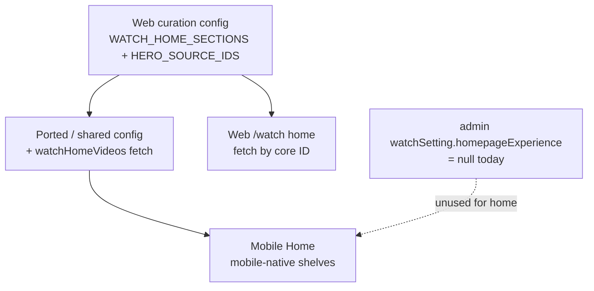

## Summary

Give the mobile app a dedicated, content-rich Home that renders the same curated content web's `/watch` home shows, reorganized for a phone: a swipeable hero with a chip rail that swaps the featured video, vertical-scrolling content shelves below, a slim logo + search top bar, a compact mission / beta-tester section at the end, and the web footer's essentials relocated to Profile/About. The content is sourced by porting web's home curation to mobile — not from an admin Experience, because none exists.

---

## Problem Frame

The mobile Home tab has no real home today. `ExperienceShell` resolves a homepage Experience via `watchSetting.homepageExperience` and `CuratedHomeLayout` renders its blocks — but that field is **`null` on the prod admin the app reads**, so the resolved Experience is empty and Home renders nothing. That is the "barebones" Home.

The web `/watch` home is full of content, but **not** because it reads an Experience. It is assembled from a hardcoded curation config in web's code — `WATCH_HOME_SECTIONS` (the rows), `WATCH_HOME_HERO_SOURCE_IDS` (the hero/chip items), and a `watchHomeVideos` query that fetches those videos and collections by core ID. The curation lives in source, not in the CMS.

So the two homes do not share a data source today, and there is no homepage Experience to point mobile at. The faithful way to get "the same content as web" onto mobile is to port web's curation config and its fetch path, then render the result with a mobile-native layout. The design choices below (hero, chip rail, header, mission, footer) are presentation and are unaffected by where the content comes from.

---

## Key Decisions

- **Mobile sources the home by porting web's curation, not from an Experience.** Replicate web's `WATCH_HOME_*` config and the `watchHomeVideos` fetch on mobile so it renders the exact set web curates. Preferred form is hoisting the config to a shared package consumed by both apps; a mobile-local copy is acceptable only with an explicit sync obligation, since the curation will drift otherwise. Consequence: changing the home's rows is a code/release change, not a CMS edit.
- **The home stops depending on the null homepage Experience.** Mobile's existing SDUI Experience path (`ExperienceShell` / `CuratedHomeLayout`) no longer drives Home. Whether the existing block renderers are reused by adapting the ported model into block shapes, or new shelf components are built closer to web's section/card, is a planning choice.
- **Hero swaps via chips, not only swipe.** The hero is full-bleed, auto-advancing, and swipeable, with a chip rail beneath (the hero/featured set from `WATCH_HOME_HERO_SOURCE_IDS`) where tapping a chip swaps the featured video. The chip path preserves web's "pick the featured video" interaction and avoids a horizontal-swipe-vs-vertical-scroll gesture fight against the content feed.
- **Mission/promo lives on Home and stays app-baked.** The "global missions" storytelling and "Become a beta tester" CTA render as a compact section at the end of Home. Like web, this is a local component — its copy/CTA change with an app release, not a CMS edit.
- **Footer essentials move to Profile/About.** The web footer is almost entirely external `jesusfilm.org` links; tailing a phone feed with "leave the app" links is wrong. The essentials relocate to Profile/About; the redundant marketing nav is dropped.
- **Search stays one tap from Home.** A slim top bar over the hero carries the JesusFilm logo and a search icon that opens the existing Discover search, mirroring web's persistent search without a heavy search pill competing with the hero.

---

## Requirements

**Home content and source**

- R1. Mobile Home renders the same curated set web's `/watch` shows, sourced by porting web's home curation (`WATCH_HOME_*` config) and the `watchHomeVideos` fetch — not from `watchSetting.homepageExperience`, which is null.
- R2. Each configured section renders as a horizontal content shelf, stacked in a vertical scroll, in the config's order, with its eyebrow/title/description.
- R3. The curation config should be shared between web and mobile (single source) or, if copied into mobile, carry an explicit obligation to keep it in sync with web.
- R4. The layout is mobile-native (full-bleed hero + shelves), not a structural copy of the web grid.

**Hero and chip rail**

- R5. The hero renders full-bleed at the top of Home, auto-advancing and swipeable between the featured items, with page indicators.
- R6. A horizontal chip rail (the featured/hero set) sits directly under the hero; tapping a chip swaps the hero to that item without navigating away.
- R7. The hero keeps its affordances: Watch Now action, mute/unmute, and a poster/preview frame.

**Header and search**

- R8. A slim translucent top bar over the hero shows the JesusFilm logo (left) and a search icon (right).
- R9. Tapping search opens the existing Discover search surface.

**Mission and invitation**

- R10. A compact mission section renders near the end of Home: the "Built for global missions" framing, the three mission points, the "what we're building next" highlights, and the invitation.
- R11. The "Become a beta tester" CTA opens the external mailchimp signup in the system browser.

**Profile/About (relocated footer)**

- R12. Profile/About surfaces the footer essentials: social links (X, Facebook, Instagram, YouTube), Give/Giving, Privacy Policy, Legal Statement, Newsletter signup, and an About/Contact entry.
- R13. The redundant marketing nav (Products, Resources, Partners) is not carried into the app.

**Resilience**

- R14. When the curated fetch returns nothing or fails, Home shows a meaningful state (loading, error with retry, or a non-broken empty state), never a blank screen that reads as broken.

---

## Key Flows

- F1. Home paint
  - **Trigger:** User opens the Home tab.
  - **Steps:** The ported curation drives a `watchHomeVideos` fetch by core ID → Home renders the hero, chip rail, and content shelves.
  - **Covers R1, R2, R4.**
- F2. Swap the featured video
  - **Trigger:** User swipes the hero or taps a chip in the rail.
  - **Outcome:** The featured hero item changes in place; no navigation occurs.
  - **Covers R5, R6.**
- F3. Search from Home
  - **Trigger:** User taps the search icon in the top bar.
  - **Outcome:** The Discover search surface opens.
  - **Covers R8, R9.**
- F4. Open a shelf item
  - **Trigger:** User taps a card in any content shelf.
  - **Outcome:** Routes to the video or series detail (reusing the existing routing rule: series-shaped → series page, single video → watch page).
  - **Covers R2.**
- F5. Beta invitation
  - **Trigger:** User taps "Become a beta tester" in the mission section.
  - **Outcome:** The external mailchimp signup opens in the system browser.
  - **Covers R10, R11.**

---

## Acceptance Examples

- AE1. Empty/failed fetch
  - **Given** the curated fetch returns no renderable items or errors,
  - **When** Home loads,
  - **Then** it shows a clear loading/empty/error state with retry — never a blank screen. **Covers R1, R14.**
- AE2. Hero slide count
  - **Given** the featured set has a single item, **then** the chip rail and page indicators are hidden; **given** multiple items, **then** chips and indicators render. **Covers R5, R6.**
- AE3. Chip stays on Home
  - **Given** the user taps a chip, **then** the hero updates and the user remains on Home (the chip is a swap control, not a link). **Covers R6.**

---

## Scope Boundaries

**Deferred for later**

- Authoring an admin homepage Experience and migrating both platforms to read it (the SDUI single-source path). Out of scope now; a possible future consolidation.
- Mobile-native personalization surfaces — Continue Watching, recently viewed, recommendations.

**Outside this work**

- Changes to the web `/watch` home — it stays as-is (aside from optionally extracting the curation config into a shared package).
- Carrying the full marketing footer nav (Products/Resources/Partners) into the app.
- Language picker / Experience switching on Home.

---

## Dependencies / Assumptions

- **Content already resolves on the admin mobile reads.** The curated core IDs (e.g., `11_Advent`, `7_0-ncs`, `7_Origins2Worth`) are fetched by web from the same prod admin (`admin.jesusfilm.org`) the mobile app points at, so no admin/content authoring or handoff is required for the content to appear. Verified: the homepage Experience is null, but the curated videos/collections themselves resolve.
- **Config-drift risk.** Web's `WATCH_HOME_*` curation evolves over time; a mobile-local copy will silently drift from web. A shared package is the mitigation; if copied, the sync obligation must be explicit.
- **Known platform constraints the implementation must honor (flagged for the planner):**
  - The swipeable hero must use the built-in `PanResponder`, not `react-native-gesture-handler` (which breaks Expo Go in this app).
  - Swapping the hero's video source must follow the frozen-source + `replaceAsync` pattern for `expo-video`, or the player releases mid-play (black/stuck).
- The `watchHomeVideos` operation/fragment is web-side today and must be ported or shared for mobile to fetch by core ID.

---

## Outstanding Questions

**Deferred to planning**

- Shared package vs. mobile-local copy for the curation config and the `watchHomeVideos` operation — and where a shared package would live.
- Whether to adapt the ported curation model into mobile's existing block-renderer shapes, or build new shelf/card components closer to web's `WatchHomeSection`/`WatchHomeCard`.
- What becomes of the existing `ExperienceShell` / `CuratedHomeLayout` once Home no longer reads the homepage Experience (repurposed for other routes vs. retired for Home).
- Whether hero auto-advance and mute state should persist as the user scrolls past the hero (the current layout already pauses/blurs the hero on scroll).
- Where exactly Profile/About renders the relocated footer essentials (existing Profile tab vs. a nested About screen).

---

## Sources / Research

- Web home curation (the content to port): `apps/web/src/lib/watch-home-config.ts` (`WATCH_HOME_SECTIONS`, `WATCH_HOME_HERO_SOURCE_IDS`, `WATCH_HOME_PLAYLIST_SEQUENCE`), `apps/web/src/lib/watch-home.ts`, `apps/web/src/lib/fragments/watch-home.ts` (`watchHomeVideos`).
- Web home composition (presentation reference): `apps/web/src/components/home/WatchHomePage.tsx`, `WatchHomeTvCarousel.tsx`, `WatchHomeSection.tsx`, `WatchHomePromo.tsx`, `WatchHomeFooter.tsx`.
- Mobile Home + the now-bypassed SDUI path: `apps/mobile/app/(tabs)/index.tsx`, `apps/mobile/src/components/sections/CuratedHomeLayout.tsx`, `SectionDispatcher.tsx`, `VideoHeroRenderer.tsx`; `apps/mobile/src/contexts/ExperienceShell.tsx` (`watchSetting.homepageExperience` — null in prod), `ExperienceProvider.tsx`.
- Mobile surfaces to route into: `apps/mobile/app/(tabs)/watch.tsx` (Discover search), `apps/mobile/app/(tabs)/profile.tsx`.
- Verification: `watchSetting(locale:"en").homepageExperience` returns `null` on `https://admin.jesusfilm.org/api/graphql` (no auth required). Live reference page: `https://watch.jesusfilm.org/watch`.
