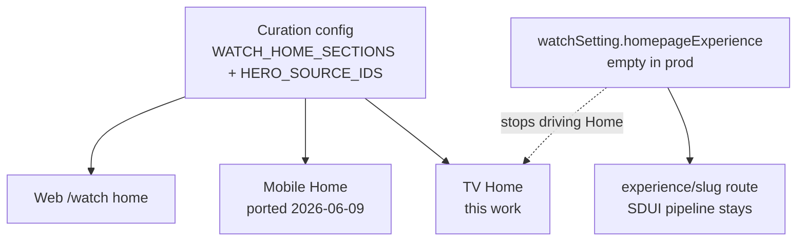

## Summary

Give the TV app two new surfaces, built in order. First a TV series detail
screen — trailer-or-poster hero, title, description, D-pad episode browsing,
language carry-through — adapting the mobile/web series ethos to 10-foot UI.
Then a content-rich TV Home that renders the same curated content as web and
mobile, laid out as a focus-driven showcase: a canvas that reflects the
focused card, the hero pool as the first Featured rail, every configured
section as a rail below, and a mission tail with a QR-code beta signup. The
new Home replaces the current empty Experience-driven home.

---

## Problem Frame

The TV home today renders the homepage Experience resolved via
`watchSetting.homepageExperience` through the SDUI pipeline. That Experience
is effectively empty on the prod admin, so the screen shows a lone hero and
a search chip — nothing to browse.

Web and mobile look full because their homes never read that Experience.
Both assemble the page from a curation config in code — `WATCH_HOME_SECTIONS`
(the rows), `WATCH_HOME_HERO_SOURCE_IDS` (the featured set) — and a
`watchHomeVideos` fetch by core ID. Mobile ported web's curation on
2026-06-09 (`docs/brainstorms/2026-06-09-mobile-home-watch-parity-requirements.md`);
TV is the last platform without it.

The curated rows also contain series-shaped cards (e.g., the Gospel
collections), and TV has no series surface: its watch screen is built for
leaf videos — siblings come from the parent's children, so a collection
lands with no Up Next and possibly nothing playable. A content-rich Home
would route users into a dead end. That is why the series screen ships
first.

---

## Key Decisions

- **TV sources Home by porting web's curation, not from the homepage
  Experience.** Same call mobile made: replicate the `WATCH_HOME_*` config
  and the `watchHomeVideos` fetch so TV renders the exact set web curates.
  This is the third per-app copy of the curation — the sync obligation is
  now real, and hoisting to a shared package is a planning question.
- **The new Home replaces the Experience-driven home outright.** The SDUI
  homepage path stops driving the home screen. The SDUI pipeline itself
  stays — `experience/[slug]` still uses it.
- **Series screen first, one surface for every entry point.** A
  series-shaped record (label `SERIES`/`COLLECTION`, or any record with
  children — web's `isSeriesRecord` rule) gets a dedicated TV series screen,
  and the watch route redirects there when its record resolves
  series-shaped. Home cards, TV search results, and deep links all land on
  the same screen.
- **Focus-driven showcase over an autoplay hero.** The top of Home is a
  canvas reflecting whatever card is focused, not a self-playing carousel.
  Parity is at the data level — same items, same rows. Web's hero playlist
  sequencing and Mux inserts are presentation and intentionally do not
  port; an autoplay hero on TV also costs a scarce video decode slot and
  fights D-pad focus.
- **Mission tail stays, footer does not.** The mission storytelling renders
  as a compact section at the end of Home, with the beta-tester CTA as a QR
  code a phone can scan — the TV answer to a CTA that opens a browser on
  other platforms. The marketing footer and external links do not carry to
  TV.
- **Series actions are Play Trailer and Language only.** Share has no TV
  affordance, and a series has no single downloadable or captionable asset,
  so Share/Download/Subtitles do not carry over. Language selection carries
  into episodes opened from the screen, mirroring mobile.

---

## Requirements

**Series screen — routing**

- R1. A series-shaped record (label `SERIES`/`COLLECTION`, or any record
  with children) renders the TV series detail screen, not the single-video
  watch screen.
- R2. The watch route redirects to the series screen when its resolved
  record is series-shaped, so home cards, TV search results, and deep links
  behave identically.

**Series screen — content**

- R3. The screen shows a SERIES label, the series title, and the series
  description.
- R4. When the series has a playable trailer (its own dub with a non-null
  `hls`), a focusable Play Trailer action plays it; when none exists, the
  screen shows the series artwork with no dead action.
- R5. The series' videos (its children, in their defined order) render as
  D-pad-navigable cards showing thumbnail and title; selecting one opens
  that episode's watch details screen.

**Series screen — actions**

- R6. A Language action opens TV's existing language selection; selecting a
  language swaps the trailer dub when a matching dub exists and is carried
  into any episode opened from the screen.
- R7. The action set is Play Trailer and Language only — no Share, Download,
  or Subtitles.

**Home — content and source**

- R8. TV Home renders the same curated set as web and mobile — the hero
  pool plus every configured section in config order — sourced by porting
  web's curation config and the `watchHomeVideos` fetch, not from
  `watchSetting.homepageExperience`.
- R9. The new Home replaces the Experience-driven home rendering; the SDUI
  pipeline remains in use by the experience route.

**Home — layout and navigation**

- R10. A showcase canvas at the top of Home shows the artwork, title, and
  description of the currently focused card. It defaults to the first
  featured item on load and retains the last focused card when focus moves
  to non-card elements.
- R11. The hero pool renders as the first rail (Featured); focusing any of
  its cards swaps the showcase.
- R12. Every configured section renders as a horizontal, D-pad-navigable
  rail stacked vertically in config order, with its eyebrow and title.
  Sections configured as grids on web render as rails on TV.
- R13. Selecting a card opens the watch details screen for a single video
  and the series screen for a series-shaped record (the R1 rule).
- R14. Search stays reachable at the top of Home and is D-pad-reachable
  from the first rail.

**Home — mission tail**

- R15. A compact mission section renders at the end of Home: the mission
  storytelling cards plus a QR code that links to the beta-tester signup.
  No element performs an external-link action on the TV itself.

**Resilience**

- R16. Both surfaces show meaningful loading, error-with-focusable-retry,
  and empty states — never a blank screen that reads as broken.

---

## Key Flows

- F1. Home paint
  - **Trigger:** User opens the app.
  - **Steps:** The ported curation drives the `watchHomeVideos` fetch →
    showcase paints from the first featured item → Featured rail and
    section rails render in config order → mission tail at the end.
  - **Covers R8, R10, R11, R12, R15.**
- F2. Browse with the showcase
  - **Trigger:** User moves D-pad focus across cards in any rail.
  - **Outcome:** The showcase swaps to the focused card's artwork, title,
    and description; no navigation occurs.
  - **Covers R10, R11.**
- F3. Open a video card
  - **Trigger:** User selects a single-video card in a rail.
  - **Outcome:** The standard watch details screen for that video.
  - **Covers R13.**
- F4. Open a series
  - **Trigger:** User selects a series-shaped card on Home, a series result
    in TV search, or a deep link resolving to a series slug.
  - **Steps:** Routing lands on the series screen → user browses episode
    cards → selecting an episode opens its watch details, carrying the
    selected language.
  - **Covers R1, R2, R5, R6, R13.**
- F5. Search from Home
  - **Trigger:** User focuses the search chip and selects it.
  - **Outcome:** The existing TV search screen opens.
  - **Covers R14.**
- F6. Beta invitation
  - **Trigger:** User reaches the mission section and views the QR code.
  - **Outcome:** Scanning with a phone opens the beta signup there; the TV
    performs no action.
  - **Covers R15.**

---

## Acceptance Examples

- AE1. **Covers R1, R2.** Given a TV search result or deep link that
  resolves to a record with label `SERIES`, when opened, then the series
  screen renders — not the single-video watch screen.
- AE2. **Covers R4.** Given a series with no playable trailer, when its
  screen opens, then the artwork renders and no Play Trailer action is
  focusable.
- AE3. **Covers R6.** Given a language selected on the series screen, when
  an episode is opened, then the episode plays in that language.
- AE4. **Covers R10.** Given focus on a card in any rail, when focus moves
  to the search chip, then the showcase keeps showing the last focused
  card.
- AE5. **Covers R16.** Given the curated fetch fails, when Home loads, then
  an error state with a focusable Retry renders — never a blank screen.

---

## Scope Boundaries

**Deferred for later**

- Dwell-to-video-preview on the showcase (auto-playing a muted preview
  after focus rests on a card).
- Personalization rows — Continue Watching, recently viewed,
  recommendations.
- Re-translating episode card titles when the series language changes
  (mirrors mobile's deferral; the trailer dub and carry-through still
  swap).
- Authoring an admin homepage Experience and migrating all three platforms
  to read it — the SDUI single-source consolidation remains a future move.

**Outside this work**

- Changes to web or mobile apps, and any `apps/admin` change — the admin
  surface already exposes everything both screens need.
- The web footer, external marketing links, and newsletter signup on TV.
- A sidebar navigation shell or any navigation restructure beyond Home.

---

## Dependencies / Assumptions

- **The curated content resolves on the prod admin TV reads.** Verified
  during the mobile port: the homepage Experience is empty, but the curated
  videos and collections themselves resolve via `watchHomeVideos`.
- **Config-drift risk, now ×3.** Web's curation evolves; mobile carries a
  copy; TV adds a third. Either the config hoists to a shared package or
  the TV copy carries an explicit sync obligation — planning decides the
  form, but the obligation itself is committed.
- **The `watchHomeVideos` operation lives in web and mobile today.** TV
  needs its own copy or a shared one; TV queries follow the app's existing
  public-query and hardcoded `locale: "en"` conventions.
- **Known platform constraints the implementation must honor (flagged for
  the planner):**
  - tvOS decode slots are scarce — a mounted background video player can
    starve a fullscreen one. The showcase is image-based by design; any
    future video preview must respect this.
  - D-pad focus work must use the app's established patterns
    (`TVFocusGuideView` containment, `hasTVPreferredFocus` restore on
    back-navigation, focus-driven scale/glow on cards).
  - The curation includes time-of-day-variant section titles; these port
    as data with the config.

---

## Outstanding Questions

**Deferred to planning**

- Shared package vs. TV-local copy for the curation config and the
  `watchHomeVideos` operation — and where a shared package would live.
- Episode browsing shape on the series screen for large collections: a
  single rail vs. multiple rows vs. a focus-scrollable grid.
- Whether section descriptions appear anywhere on TV Home (web shows them,
  mobile omits them for density) and how the showcase clamps long
  descriptions.
- QR code production for the beta CTA: pre-rendered asset vs. generated at
  build/runtime.
- What the series screen's hero looks like while a trailer is playing
  (inline vs. handing off to the watch player).

---

## Sources / Research

- Web home curation (the content to port):
  `apps/web/src/lib/watch-home-config.ts` (`WATCH_HOME_SECTIONS`,
  `WATCH_HOME_HERO_SOURCE_IDS`), `apps/web/src/lib/watch-home.ts`,
  `apps/web/src/lib/fragments/watch-home.ts` (`watchHomeVideos`).
- Mobile's port of the same content (precedent and routing rule):
  `docs/brainstorms/2026-06-09-mobile-home-watch-parity-requirements.md`,
  `apps/mobile/src/lib/watchHome/config.ts`,
  `apps/mobile/src/components/home/HomeCard.tsx` (series-shaped →
  `/series/[slug]`, else `/watch/[slug]`).
- Mobile series detail (the ethos the TV series screen adapts):
  `docs/brainstorms/2026-06-08-mobile-series-detail-page-requirements.md`,
  `apps/web/src/lib/content.ts` (`isSeriesRecord`).
- TV surfaces being extended or replaced: `apps/tv/app/index.tsx` (current
  Experience-driven home), `apps/tv/app/watch/[slug].tsx` +
  `apps/tv/src/lib/normalizeVideo.ts` (leaf-video watch screen; siblings
  from parent's children), `apps/tv/app/search.tsx`,
  `apps/tv/app/experience/[slug].tsx` (SDUI pipeline stays here).
- TV building blocks: `apps/tv/src/components/FocusableCard.tsx`,
  `apps/tv/src/components/ContentRail.tsx`,
  `apps/tv/src/components/TVFocusGuideView.tsx`, `apps/tv/CLAUDE.md`
  (Crimson Gallery design system, focus conventions, known pitfalls).
- Verification: `watchSetting(locale:"en").homepageExperience` resolves
  empty on prod admin while the curated core IDs resolve — established
  during the mobile port.
