## Summary

Replace the mobile app's "download the MP4 and hand it to the OS share sheet" flow with true in-app offline downloads. From a video — or a whole series — the user chooses quality, audio language (Dub), and subtitle tracks (or none), accepts the existing Terms of Use, and the media plus its subtitles and poster are saved into persistent, backup-excluded app-private storage and played back offline from a new "My Downloads" library. The download engine is built for unreliable field networks — resumable, background-capable, wifi-only-optional, and queued. Each video holds one offline copy at a time, changed through a non-destructive swap, and a series can be downloaded as a single batch.

---

## Problem Frame

The target user is a field viewer in a low-connectivity area: they want to download a video on a good connection and watch it later, offline, in their own language.

Today's download control doesn't serve that. It writes the selected MP4 to the device's volatile cache and immediately opens the OS share sheet, which typically saves the file to the Camera Roll and then discards the cached copy. The result is a loose media file outside the app: it can't be played in the app's own player, it isn't tied to the chosen audio language or subtitles, the OS can purge it, and it's hard to find again. For someone whose whole need is "open the app offline and watch this in my language," that flow misses on every axis.

The design assumes a primarily personal device. JFP's field reality is often a shared device spanning languages, which makes the one-audio-language-per-video limit a known sharp edge — holding multiple audio languages per video stays deferred (see Scope Boundaries).

The remedy is to make a download something the app _owns_ — durable, language- and subtitle-aware, and watchable in-app with no network.

---

## Key Decisions

- **One offline copy per video, swapped non-destructively.** A video is either not downloaded or downloaded; there's no stacking a second quality, language, or subtitle set. But changing the copy does not throw the working one away first: the new selection downloads while the old copy stays watchable, and the old is removed only when the new one completes. The user is warned up front that their current copy will be replaced.

- **Series download is in v1.** A series can be downloaded as one batch that applies a single set of choices across every segment and enqueues them through the existing queue. It reuses the per-video download machinery rather than adding a parallel one.

- **Device-limited storage with guardrails, not a cap or auto-evict.** The app imposes no storage ceiling and never deletes a download to make room. It surfaces sizes and warns before a download that won't fit, but the user — who deliberately curated this offline content — stays in control of what gets removed.

- **Access, not rights.** The driver is offline access, not content protection, so downloads live in app-private storage with no DRM or encryption-at-rest. If JFP content is later found to carry redistribution restrictions, that assumption must be revisited before shipping — it changes the storage design.

- **Replace the raw-file export entirely.** The current "save a shareable MP4 to the device" behavior is removed, not kept as a parallel option. Offline content exists only inside the app.

- **Extend, don't rebuild.** The quality picker and Terms-of-Use modal already exist in the download sheet. This feature reuses them and adds the genuinely new parts: persistent storage, an in-app library, offline playback, and a robust download engine.

---

## Requirements

**Download selection & terms**

- R1. From a video's detail page, the user starts a download from the existing control, which opens a sheet to choose what to save.
- R2. The sheet lets the user choose the video quality (rendition) to download, reusing the current size-based tiering (Highest / High / Low).
- R3. The sheet lets the user choose the audio language (Dub) to download, independent of the language currently playing.
- R4. The sheet lets the user choose subtitle tracks from those available for the video, including an explicit "No subtitles" option.
- R5. The user must accept the existing Terms of Use before a download can start.

**Series / bulk download**

- R6. A series exposes a "download all" entry that opens the same download sheet, applying one set of quality / language / subtitle choices across every segment and showing the combined total download size before the user confirms.
- R7. "Download all" enqueues each segment as an individual per-video download through the standard queue; each segment follows the same one-copy, state, storage, and integrity rules as a single download.

**Download engine & reliability**

- R8. Downloads are resumable: a graceful pause or background captures and persists the OS resume token so the transfer continues from where it stopped rather than restarting.
- R9. Downloads continue while the app is backgrounded or the screen is off. (Carries native investigation cost — see Dependencies / Assumptions.)
- R10. A wifi-only setting restricts downloads to wifi, with a per-download override to allow cellular; this requires runtime network-type detection the app does not have today.
- R11. The user can queue several videos (or a whole series); the queue — pending items plus the active item's state — persists and rehydrates across an app restart, with visible per-item progress.

**Offline storage & governance**

- R12. Downloaded media, subtitle files, and poster images are stored in persistent app-private storage that the OS neither evicts nor backs up (excluded from iCloud / iTunes backup).
- R13. The app imposes no storage cap; the user can download until the device is near full, with a small free-space reserve the app refuses to cross.
- R14. Before each download starts — including each queued item individually — the app checks free space against the full footprint (video + subtitles + poster, handling missing or zero rendition sizes from admin) and warns when it won't fit; it never auto-deletes existing downloads to make room.
- R15. The app shows storage used per download (including subtitles and poster) and in total.

**Offline library & playback**

- R16. A "My Downloads" library lists the user's offline videos and is reachable with no network connection.
- R17. The user can play a downloaded video fully offline — the video and the chosen subtitle tracks both read from local files, with no network call. (Subtitles load from disk; today they fetch over HTTP — see Dependencies.)
- R18. The offline experience does not depend on the online metadata cache: title, the locally-downloaded poster, and the media persist locally, and the per-video download-state badge is keyed off the local store, not the GraphQL query.

**Per-video state, swap & deletion**

- R19. While an offline copy exists, the detail-page control shows a downloaded state (a green tick). Tapping it offers two actions: delete the copy, or change the download (quality / language / subtitles).
- R20. Changing the download is a non-destructive swap: after the user confirms a warning that the current offline copy will be replaced, the new selection downloads while the existing copy stays watchable, and the old copy is removed only once the new one completes. A failed or interrupted swap leaves the original copy intact.
- R21. Deleting an offline copy is atomic and idempotent — it removes media, subtitles, poster, and the manifest entry together, and an interrupted delete is recoverable on next launch.
- R22. The control reflects the states between not-downloaded and downloaded — queued, downloading (with progress), paused (auto-resuming), and failed (needs an explicit user retry) — with Paused and Failed shown distinctly.

**Integrity & offline-readiness**

- R23. On launch the app reconciles each download record against on-disk bytes: resume when a resume token was persisted, otherwise restart cleanly. A partial file is never presented as complete, and the green tick (R19) requires a completed, size-verified file.
- R24. The offline record stores the rendition identity (Dub + quality) and subtitle identities, not just captured URLs. Before any download starts or resumes, the engine re-resolves fresh media and subtitle URLs (admin's URLs are volatile); a re-resolution that needs the network while the device is offline leaves the item queued, not failed.
- R25. Failed and canceled downloads have defined byte handling: a transient failure keeps the partial file for resume; a cancel or terminal failure removes it. Storage exhaustion mid-download fails the active item (resumable), never marks it complete.
- R26. Offline playback reads the local video and subtitle files through a path the app's URL guards permit for app-private files — today those guards allow only Mux HTTPS and block the `file:` scheme, so a dedicated local-media allow-path is required.

**Replacing the old export**

- R27. The in-app offline download replaces the current "download MP4 then hand to the OS share sheet" behavior; saving a raw, shareable file is no longer offered.

### Download-control state machine (illustrates R19–R25)

```mermaid
stateDiagram-v2
  [*] --> NotDownloaded
  NotDownloaded --> Queued: start (quality/language/subtitles + ToU)
  Queued --> Downloading
  Queued --> Canceled: user cancels
  Downloading --> Paused: connection drop / backgrounded / wifi-only on cellular
  Paused --> Downloading: resume (re-resolve URL first)
  Downloading --> Failed: HTTP error / integrity fail / storage full mid-download
  Failed --> Queued: user retry
  Downloading --> Canceled: user cancels
  Downloading --> Downloaded: complete + size-verified
  Downloaded --> NotDownloaded: delete (atomic)
  Downloaded --> Downloading: change download (non-destructive swap; old kept until new completes)
  Canceled --> [*]
  Downloaded: Downloaded (green tick)
```

Partial bytes are kept on Paused and Failed (for resume) and removed on Canceled or terminal failure.

---

## Key Flows

- F1. Download a single video.
  - **Trigger:** User taps download on a detail page for a video with no existing offline copy.
  - **Steps:** Choose quality + audio language + subtitles (or "No subtitles") → accept Terms of Use → the download is queued → it progresses (resumable, wifi-aware, continuing in the background) → the control becomes a green tick.
  - **Covers:** R1–R5, R8–R11, R19, R22, R23.

- F2. Download a whole series.
  - **Trigger:** User taps "download all" on a series.
  - **Steps:** Choose one set of quality + language + subtitles → the sheet shows the combined total size → accept Terms of Use → every segment is enqueued and downloads through the standard queue.
  - **Covers:** R6, R7, R11, R14.

- F3. Watch offline.
  - **Trigger:** User opens the app with no connection and goes to My Downloads.
  - **Steps:** The library loads from local storage → the user picks a video → it plays from the local file with the chosen audio and subtitles, no network call.
  - **Covers:** R16, R17, R18, R26.

- F4. Change a download (non-destructive swap).
  - **Trigger:** User wants a different rendition, language, or subtitle set for a video they've already downloaded.
  - **Steps:** Tap the green tick → choose "change download" → pick new options → confirm the warning that the current copy will be replaced → the new selection downloads while the old copy stays watchable → on success the old copy is removed; on failure it stays.
  - **Covers:** R19, R20, R24.

- F5. Failure, storage, and recovery handling.
  - **Trigger:** A download is interrupted — connection drop, app killed, disk fills, or a server error.
  - **Steps:** Transient interruptions move the item to Paused and auto-resume (re-resolving the URL); terminal errors move it to Failed for explicit retry; on next launch the app reconciles on-disk bytes against records and resumes or restarts; nothing is auto-deleted and no partial file is shown as complete.
  - **Covers:** R13, R14, R23, R24, R25.

---

## Acceptance Examples

- AE1. Green-tick actions.
  - **Covers R19, R20.**
  - **Given** a video already downloaded in High / English / no subtitles, **When** the user taps its green tick, **Then** they are offered delete or change-download — not a blind second download.

- AE2. Non-destructive swap survives failure.
  - **Covers R20.**
  - **Given** a downloaded High / English copy, **When** the user changes it to Low / Spanish and the new download fails midway, **Then** the original High / English copy is still present and watchable.

- AE3. App-kill recovery.
  - **Covers R23.**
  - **Given** a download is ~60% complete and the app is killed, **When** the app relaunches, **Then** it resumes from ~60% if a resume token was persisted, otherwise restarts cleanly — and the partial file is never shown as a completed download.

- AE4. Resume re-resolves the URL.
  - **Covers R8, R24.**
  - **Given** a paused download whose stored media URL has since expired, **When** it resumes, **Then** the engine re-resolves a fresh URL before continuing rather than failing on the stale one.

- AE5. Wifi-only override.
  - **Covers R10.**
  - **Given** wifi-only is on and the device is on cellular, **When** the user starts a download, **Then** it does not begin on cellular unless the user takes the explicit allow-on-cellular override.

- AE6. Won't-fit warning.
  - **Covers R14.**
  - **Given** the full footprint (video + subtitles + poster) of a queued item exceeds remaining space, **When** that item is about to start, **Then** the app warns it won't fit and starts nothing and deletes nothing.

- AE7. No subtitles.
  - **Covers R4, R17.**
  - **Given** the user selects "No subtitles", **When** the download completes and plays offline, **Then** no subtitle track is bundled or shown.

- AE8. Offline subtitle plays from disk.
  - **Covers R17, R26.**
  - **Given** a downloaded video with a chosen subtitle track and no network, **When** the user plays it, **Then** the subtitle renders from the local file (no HTTP fetch, not blocked by the URL guards).

- AE9. Series total size.
  - **Covers R6.**
  - **Given** a series of N segments and a chosen quality / language, **When** the user opens "download all", **Then** the sheet shows the summed total size before they confirm.

---

## Scope Boundaries

**Deferred for later**

- Holding more than one audio language offline for the same video — a known sharp edge on shared multilingual devices, but out of v1.

**Outside this product's identity**

- Rights enforcement, DRM, or encryption-at-rest — this is an offline-access feature, not content protection.
- Exporting a raw, shareable media file to the device — replaced by in-app-only storage.

---

## Dependencies / Assumptions

- **Offline video playback — feasible with an app-side change.** `expo-video` (v3.0.16) accepts a local `file://` URI as a video source at the SDK level (verified against the installed types). But the app does not pass URLs straight to the player: `validateStreamingUrl` (`apps/mobile/src/lib/validateUrl.ts`) allows only the `stream.mux.com` host and `BLOCKED_SCHEMES` blocks `file:`. The plan must add a dedicated local-media allow-path (confirm the URI is inside the app's download directory) rather than loosen the existing HTTPS/Mux guards.
- **Offline subtitles — not yet verified, separate data path.** Subtitles are not played through `expo-video`'s native subtitle track (the player disables it); they render via a custom overlay (`apps/mobile/src/components/watch/SubtitleOverlay.tsx`) that `fetch()`es the VTT over HTTP and runs it through `validateActionUrl`. Offline subtitles must be read from local disk (a file read), not fetched — treat this as a second feasibility spike during planning.
- **Resumable downloads — legacy module, foreground-only.** `createDownloadResumable` / `DownloadResumable` / `savable()` live in `expo-file-system/legacy` (the module the current download already imports), not the new v19 surface (whose `File.downloadFileAsync` is one-shot with no resume). Resume across a restart works only by manually persisting `savable()` and rehydrating it; the legacy task is foreground-only. Confirm the legacy API is still functional on Expo 54 and note the deprecation risk.
- **Background download — needs native work.** The legacy resumable task does not progress while backgrounded (its progress callback is suspended and the transfer is foreground-bound), so R9 requires native background-download support — an iOS background `URLSession` configuration and an Android equivalent. Treat R9 as carrying investigation cost, not free.
- **Network detection — dependency to add.** There is no `@react-native-community/netinfo` or `expo-network` dependency installed. R10's wifi-only setting and the engine's connection-drop detection require adding one; wifi gating is app-side logic layered on connectivity events.
- **Volatile media URLs.** Admin `downloads[].url` (renditions) and `vttSrc` (subtitles) are volatile/expiring CDN URLs — the Apollo cache strips them (`apps/mobile/src/lib/cachePersistence.ts`) precisely because they don't last. The offline manifest therefore stores rendition + subtitle identity, and the engine re-resolves fresh URLs before each start/resume (R24). Whether they are explicitly signed/short-lived is unconfirmed — see Outstanding Questions.
- **Persistent, backup-excluded storage required.** There is no offline media store today; the only persistence is the Apollo cache in AsyncStorage, which strips media URLs and expires after 24h. The offline manifest and media must live in new persistent app-private storage with the OS backup-exclusion attribute set — the plain document directory is included in iCloud / iTunes backup by default (R12).
- **Renditions & subtitles source.** Renditions come from admin GraphQL `downloads[]` per Dub (each a direct MP4 URL with a byte size, already tiered in the sheet). Subtitle tracks are VTT files per Dub via the Video Edition, each with a language and a "primary" flag. The poster comes from a remote URL via `apps/mobile/src/lib/resolveImageUrl.ts` and must be downloaded locally for the offline library (R18).

---

## Outstanding Questions

**Deferred to Planning**

- Subtitle selection multiplicity: a single subtitle track or several? The user's wording ("subtitle tracks", "other subtitles") leans toward more than one; the answer shapes the offline subtitle picker UI.
- Are admin `downloads[].url` / `vttSrc` explicitly signed / short-lived? Determines re-resolution cadence and whether resume tokens (URL-bound) stay valid.
- Background-download mechanism and the fallback when the OS suspends the transfer.
- Series download edge cases: how to handle a segment that lacks the chosen quality or language (per-segment fallback, skip, or warn), and how the series control shows aggregate state and progress.
- Whether the sheet's audio-language picker defaults to the currently-playing Dub.
- Whether losing wifi pauses the active item or lets it finish, and per-item queue controls (pause / reorder / cancel).
- Orphan handling if a Dub or rendition is removed upstream in admin after download.

---

## Sources / Research

Current code this feature extends or replaces (repo-relative):

- `apps/mobile/src/components/watch/DownloadSheet.tsx` — current download flow (MP4 → cache → OS share sheet), the Terms-of-Use modal + checkbox, and the size-based quality tiering to reuse.
- `apps/mobile/app/watch/download.tsx` — the download modal route, lazily fetching the active Dub's downloads on open.
- `apps/mobile/src/components/watch/ActionButtonRow.tsx` — the detail-page action row holding the download control.
- `apps/mobile/src/components/watch/VideoPlayer.tsx` — the `expo-video` player; HLS-only today, the surface that must accept a local file for offline playback.
- `apps/mobile/src/components/watch/SubtitleOverlay.tsx` — the custom subtitle renderer that fetches VTT over HTTP; must read local files offline.
- `apps/mobile/src/lib/validateUrl.ts` — `validateStreamingUrl` / `validateActionUrl` and `BLOCKED_SCHEMES`; the guards that block `file:` and must gain a local-media allow-path.
- `apps/mobile/src/lib/normalizeVideo.ts` and `apps/mobile/src/lib/queries.ts` — the `downloads[]` (renditions) and `videoEdition.subtitles[].vttSrc` shapes the download flow reads.
- `apps/mobile/src/lib/cachePersistence.ts` — the Apollo / AsyncStorage cache that strips media URLs and expires in 24h, showing why a new persistent store is needed.
- `apps/mobile/src/lib/resolveImageUrl.ts` — poster URL resolution; posters must be downloaded locally for the offline library.
- `apps/mobile/src/contexts/WatchSessionProvider.tsx` — the watch-session context holding the active video and its on-demand media.
- `apps/mobile/src/lib/terms-of-use.ts` — the canonical Terms-of-Use text the accept step reuses.
