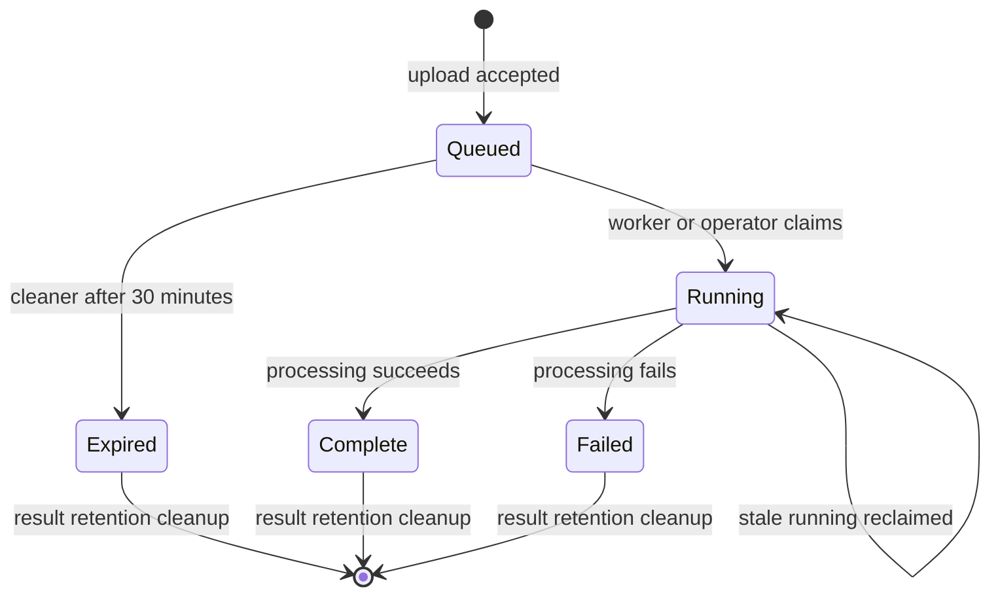

# Yt-Mapper Queued Job Expiry

## Summary

Add yt-video-mapper-only expiry for queued match jobs: if a job remains queued for 30 minutes, a scheduled cleaner removes its raw upload and marks the lightweight job row as `expired`. Polling an expired job returns a clear terminal response instead of leaving the caller stuck on `queued`.

---

## Problem Frame

The yt-video-mapper backend now has a worker that drains queued match jobs, but queue safety should not depend on every submitted job being promptly claimed or later polled by a client. A caller can submit an upload, lose interest, never poll again, and leave the job plus its raw media input sitting in the durable queue. During worker incidents, deploy windows, or high-volume testing, those forgotten jobs can accumulate and make queue state harder to reason about.

The service needs a yt-mapper-scoped cleanup behavior that protects storage and queue hygiene while keeping the public polling contract understandable for known job IDs.

---

## Key Decisions

- **Expired is a distinct terminal state.** Expiry is different from matcher failure, so callers should be able to tell that the job aged out before processing.
- **Cleaner owns abandoned-job cleanup.** Expiry cannot rely on client polling because abandoned jobs are the exact case that needs cleanup.
- **Uploads are removed, rows are preserved.** Raw media bytes should disappear when the queued job expires, while the lightweight job row remains pollable until normal result retention removes it.
- **Manual rescue is allowed before cleanup.** An operator can still process an overdue queued job until the scheduled cleaner marks it `expired`.

---

## Requirements

**Expiry Policy**

- R1. Only yt-video-mapper match jobs in `apps/yt-video-mapper-backend` are in scope for this expiry behavior.
- R2. A queued yt-mapper match job becomes eligible to expire when it has remained unclaimed for 30 minutes.
- R3. Expiry applies only while a job is still `queued`; `running` jobs continue to use the existing stale-running reclaim behavior.
- R4. Expiry applies to existing queued jobs after deploy, not only to newly created jobs.

**Cleaner Behavior**

- R5. A yt-mapper scheduled cleaner runs every minute to find queued jobs that have crossed the 30-minute expiry threshold.
- R6. The cleaner removes the raw uploaded media for each expired queued job.
- R7. The cleaner marks each expired queued job with terminal status `expired` and safe error code `job_expired`.
- R8. The cleaner preserves the lightweight expired job row until the normal yt-mapper result-retention window removes terminal job records.
- R9. The cleaner operates independently of client polling, so abandoned jobs expire even when nobody polls their job IDs.

**API and Operator Semantics**

- R10. Polling an expired job returns `{ jobId, status: "expired", errorCode: "job_expired" }`.
- R11. Expired jobs cannot later be claimed by the background worker or manual process endpoint.
- R12. A queued job older than 30 minutes can still be manually processed if the cleaner has not yet marked it `expired`.
- R13. A client polling a non-expired queued job continues to receive the existing queued response.

---

## Actors

- A1. **yt-mapper API client:** submits uploads and polls known match job IDs.
- A2. **Match Job Worker:** claims queued or stale-running jobs and processes them.
- A3. **Scheduled Cleaner:** expires abandoned queued jobs and removes their raw uploads.
- A4. **Operator:** may manually process a known queued job before it is expired.

---

## Key Flows

- F1. Queued job expires without polling
  - **Trigger:** A queued yt-mapper match job passes the 30-minute threshold.
  - **Actors:** A3.
  - **Steps:** Cleaner runs on its one-minute cadence -> finds the overdue queued job -> removes the raw upload -> marks the job `expired` with `job_expired`.
  - **Outcome:** The job leaves the queue, the upload no longer consumes storage, and the job ID remains pollable.
  - **Covers:** R2, R5, R6, R7, R8, R9.
- F2. Client polls an expired job
  - **Trigger:** A client polls a job ID after the cleaner expired it.
  - **Actors:** A1.
  - **Steps:** The API reads the terminal job row -> returns the expired response.
  - **Outcome:** The caller gets a clear terminal result and stops waiting.
  - **Covers:** R10.
- F3. Operator rescues an overdue queued job
  - **Trigger:** A known queued job is older than 30 minutes, but the cleaner has not marked it expired yet.
  - **Actors:** A4, A2.
  - **Steps:** Operator manually processes the known job -> normal processing claims it -> the job follows the existing running/complete/failed lifecycle.
  - **Outcome:** Manual recovery remains possible until the cleaner formally expires the job.
  - **Covers:** R11, R12.

---

## Acceptance Examples

- AE1. Cleaner expires an abandoned queued job.
  - **Given** a yt-mapper match job has been queued for more than 30 minutes, **when** the scheduled cleaner runs, **then** the job becomes `expired`, its raw upload is removed, and its row remains pollable.
  - **Covers:** R2, R5, R6, R7, R8, R9.
- AE2. Expired polling response.
  - **Given** a job has status `expired`, **when** a client polls it, **then** the API returns `{ jobId, status: "expired", errorCode: "job_expired" }`.
  - **Covers:** R10.
- AE3. Running jobs are not queue-expired.
  - **Given** a job was claimed before the 30-minute queued threshold, **when** the cleaner runs later, **then** the cleaner does not expire it because running recovery belongs to stale-running reclaim.
  - **Covers:** R3.
- AE4. Manual process can beat the cleaner.
  - **Given** a queued job is older than 30 minutes but has not yet been marked expired, **when** an operator manually processes it, **then** normal processing can proceed.
  - **Covers:** R11, R12.
- AE5. Existing backlog expires on rollout.
  - **Given** already-queued jobs are older than 30 minutes at deployment time, **when** the cleaner first runs after the feature is live, **then** those overdue queued jobs expire.
  - **Covers:** R4.

---

## Success Criteria

- Overdue queued yt-mapper jobs no longer remain in the queue indefinitely.
- Expired jobs do not retain raw upload bytes.
- Polling a known expired job produces a terminal response that is distinguishable from matcher failure and from an unknown job.
- The existing worker and stale-running recovery behavior remains intact for non-expired and running jobs.

---

## Scope Boundaries

- Queue, worker, and retention behavior outside `apps/yt-video-mapper-backend` is out of scope.
- Expiring or killing long-running jobs by total age is out of scope.
- Replacing the yt-mapper worker with an external queue service is out of scope.
- Building a public queue listing, queue admin API, or broad operator dashboard is out of scope.
- Full historical result-row reaping is out of scope beyond preserving expired rows until the existing yt-mapper result-retention policy removes terminal jobs.

---

## Dependencies / Assumptions

- The existing yt-mapper match job lifecycle remains the foundation: queued jobs are claimable, running jobs can be reclaimed when stale, and complete/failed jobs are terminal.
- The cleaner can safely remove uploaded media independently from preserving the lightweight job record.
- The first production rollout is allowed to expire old queued yt-mapper jobs that already exceed the 30-minute threshold.

---

## Sources / Research

- `CONCEPTS.md` defines Match Job and Match Job Worker vocabulary, including queued, running, and stale-running recovery semantics.
- `apps/yt-video-mapper-backend/src/services/match-job.service.ts` contains the current job statuses, result response shape, upload cleanup on terminal processing, and worker-facing queue drain behavior.
- `apps/yt-video-mapper-backend/src/db/match-job.repository.ts` contains the current Prisma claim logic for queued and stale-running jobs.
- `apps/yt-video-mapper-backend/prisma/schema.prisma` contains the `MatchJob` model, `retentionExpiresAt`, and current job status enum.
- `apps/yt-video-mapper-backend/src/worker.ts` contains the process-local worker loop that drains queued jobs.
- `docs/solutions/platform/yt-video-mapper-backend-app-durable-match-job-upload-poll-process-pattern.md` calls out the current cleanup caveat: `retentionExpiresAt` exists, but a cleanup worker still needs to delete expired rows and leftover uploads.
