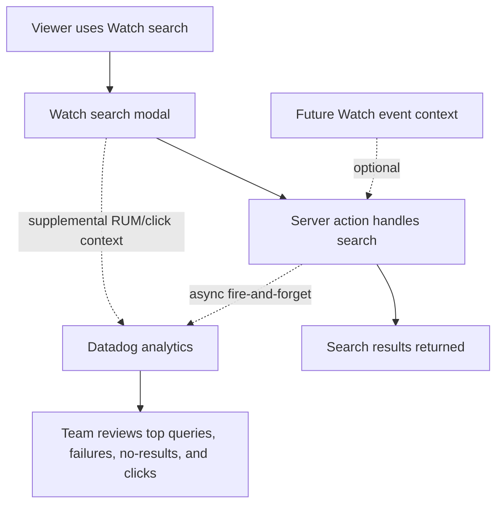

# Watch Search Analytics

## Summary

`feat-197` adds server-side Datadog-backed analytics for anonymous Watch search
behavior. The v1 scope captures every submitted search request and load-more
request that reaches the server action, including exact submitted query text,
search outcomes, no-result cases, latency, and result counts. Browser RUM can
add supplemental UX context and clicked-result events, while Watch event
collection remains optional future context rather than a dependency.

---

## Problem Frame

Algolia gave the team a product lens on search: what viewers searched for,
which searches failed, and which results drew clicks. The replacement Watch
search path needs that observability before broader eval or personalization
work can explain user demand.

The immediate need is product analytics, not Mastra eval trace plumbing. The
team wants Datadog-visible search behavior now, and top-search/no-result counts
must not depend on browser RUM sampling. The canonical event should be emitted
from the server-side search path for every submitted search request that reaches
the app.

---

## Key Decisions

- **Server-side canonical events.** Every Watch search request and load-more
  request that reaches the server action emits a canonical Datadog analytics
  event. This is the source of truth for top-search, no-result, failure,
  latency, and result-count analysis.
- **Fire-and-forget delivery.** Datadog event writes are asynchronous,
  non-blocking, and best-effort. Search never waits for a Datadog response
  before returning results, and Datadog send failures must not fail or slow the
  user-facing search response.
- **RUM is supplemental.** Browser RUM can add UI context, result-click events,
  and correlation to frontend behavior, but RUM sampling must not be the only
  path for submitted-search or outcome analytics.
- **Exact query text.** v1 sends the exact submitted query text to Datadog so
  top-search and no-result analysis remain useful.
- **Anonymous means no attached identity.** Search events must not include name,
  email, full user id, auth token, cookie, session id, IP address, or bearer
  material, but raw query text is not sanitized in v1.
- **Optional Watch context.** The search analytics contract can accept sanitized
  Watch-event context later, but Watch event storage and ingest are not part of
  this ticket.

---

## Actors

- A1. **Viewer.** Searches from the Watch modal and clicks results.
- A2. **Search owner.** Reviews Datadog to understand user demand and search
  failures.
- A3. **Watch search UI.** Owns query submission, result display, load-more,
  optional RUM context, and result-click behavior.
- A4. **Watch search server action.** Handles submitted search and load-more
  requests, and emits canonical server-side Datadog events.
- A5. **Datadog.** Receives server-side analytics events and supplemental RUM
  context.
- A6. **Future Watch event provider.** May provide sanitized context for the
  same analytics events later.

---

## Requirements

**Event Capture**

- R1. Watch search must emit one canonical server-side Datadog event for every
  submitted search request and load-more request that reaches the server action.
- R2. Canonical server-side events must cover completed, failed, and no-result
  outcomes.
- R3. Datadog event delivery must be asynchronous, non-blocking, best-effort,
  and fire-and-forget: the search response must not wait for Datadog, and
  Datadog failures must not block search, change visible search state, close
  the modal, or break result navigation.
- R4. Completed and no-result events must include query text, result count,
  result source, search mode, latency, site language, selected Search Language,
  and detected query language when available.
- R5. Failed events must include query context, result source when known,
  language context, and a safe failure category.
- R6. Load-more events must include query context, requested page position or
  offset, added result count, total visible result count, and failure state when
  load-more fails.
- R7. Result-clicked events should be sent to Datadog with query context,
  clicked result id, slug, type, title, position, result source, and selected
  Search Language. If result-click counts must become exact, add a server-side
  click/beacon path; RUM click events alone are supplemental.

**Payload Policy**

- R8. v1 must send exact submitted query text to Datadog rather than hashing,
  categorizing, or redacting it.
- R9. Search event payloads must not include name, email, full user id, auth
  token, cookie, session id, IP address, bearer key, or API key material.
- R10. The requirements and verification must state that raw query text can
  contain sensitive words a viewer typed, even though no identity fields are
  attached.

**Reviewability**

- R11. The Datadog review path must let the team inspect top queries, no-result
  queries, failed queries, clicked results, language mismatch signals, and
  search-mode health.
- R12. The ticket must document the Datadog MCP query path when available, or a
  Datadog UI query/report path when MCP coverage is unavailable.

**Watch Context Compatibility**

- R13. The search analytics contract must accept an optional sanitized Watch
  context object without requiring Watch event collection to exist.
- R14. When no Watch context provider exists, search analytics must still emit
  the same core server-side analytics events.
- R15. Future Watch context may include anonymous page, video, playback,
  language, and referrer fields, but it must follow the same identity exclusion
  policy as search events.

---

## Key Flows

- F1. Search succeeds
  - **Trigger:** A viewer submits a non-empty Watch search.
  - **Actors:** A1, A3, A4, A5
  - **Steps:** The UI calls the server action, the server action runs search,
    starts a fire-and-forget Datadog event send, and returns results without
    waiting for Datadog.
  - **Outcome:** Datadog can group the query by result source, search mode,
    language context, latency, and result count, and search response time is not
    coupled to Datadog response time.
  - **Covered by:** R1, R2, R3, R4, R8, R9

- F2. Search returns no results
  - **Trigger:** A viewer submits a search that completes with zero results.
  - **Actors:** A1, A2, A3, A4, A5
  - **Steps:** The server action receives an empty result set, starts a
    fire-and-forget no-result event send, and returns the empty result response.
  - **Outcome:** The search owner can find high-volume no-result queries in
    Datadog without relying on RUM sampling.
  - **Covered by:** R1, R2, R3, R4, R11

- F3. Search fails or load-more fails
  - **Trigger:** The initial search request or a load-more request fails.
  - **Actors:** A1, A2, A3, A4, A5
  - **Steps:** The server action starts a fire-and-forget failed-search or
    failed-load-more event send and preserves the existing visible failure
    behavior.
  - **Outcome:** Datadog shows failure patterns without exposing bearer,
    cookie, IP, session, or user identity fields.
  - **Covered by:** R1, R2, R3, R5, R6, R9

- F4. Viewer clicks a result
  - **Trigger:** A viewer activates a search result card.
  - **Actors:** A1, A2, A3, A5
  - **Steps:** The UI records the clicked result with its query context through
    supplemental RUM or a future click/beacon path, then lets normal navigation
    continue.
  - **Outcome:** Datadog can show which results and positions receive clicks
    for a query; exact click counting can be added with a server-side beacon if
    needed.
  - **Covered by:** R3, R7, R11

- F5. Future Watch context is present
  - **Trigger:** A future Watch event provider exposes sanitized context to the
    search analytics emitter.
  - **Actors:** A3, A4, A5, A6
  - **Steps:** Search events include the optional context; if the provider is
    absent, the event omits the context and still emits.
  - **Outcome:** The same search event contract can later connect search demand
    to page/video/playback context without redesigning search analytics.
  - **Covered by:** R13, R14, R15

---

## Acceptance Examples

- AE1. Search completion includes useful analytics.
  - **Covers R1, R2, R4, R8.** Given a viewer searches `Jesus`, when the
    server action returns results, then a server-side Datadog event is started
    with query text `Jesus`, result count, result source, search mode, latency,
    site language, and selected Search Language.

- AE2. No-result searches are visible.
  - **Covers R1, R2, R4, R11.** Given a search completes with zero results,
    when the server action returns the empty result response, then Datadog
    receives a no-result event that can be grouped by query and language
    context.

- AE3. Search failures do not break the UI.
  - **Covers R3, R5, R9.** Given Datadog throws while a failed-search event is
    being sent, when the server action handles the search failure, then the
    viewer still sees the normal retry state and no identity fields are sent.

- AE4. Result clicks preserve navigation.
  - **Covers R3, R7.** Given search results are visible, when a viewer clicks
    the third result, then Datadog receives a result-clicked event with position
    `3` and normal result navigation continues.

- AE5. Exact query text is retained in v1.
  - **Covers R8, R10.** Given a viewer submits a query containing raw text they
    typed, when the search event is emitted, then v1 sends that submitted text
    to Datadog without hashing or redaction.

- AE6. Watch context is optional.
  - **Covers R13, R14, R15.** Given no Watch context provider exists, when a
    search event is emitted, then the core search payload is still sent; given a
    sanitized Watch context exists, then the same event includes that context
    without identity fields.

- AE7. Datadog cannot slow search.
  - **Covers R3.** Given Datadog is slow or unavailable, when a viewer submits a
    search, then the search response returns without waiting for Datadog and no
    Datadog delivery error is surfaced to the viewer.

---

## Success Criteria

- The search owner can answer which submitted queries are most common, which
  queries fail or return no results, and which results get clicked from
  Datadog.
- The implementation can be verified without changing public search response
  shapes or Watch search UX.
- Tests cover server-side event emission, non-blocking fire-and-forget Datadog
  delivery, send failure swallowing, exact query text, identity-field exclusion,
  and optional Watch context.
- The roadmap ticket can move to planning without reopening the analytics sink,
  query-text policy, or Watch-events dependency decisions.

---

## Scope Boundaries

- Watch event storage, Watch event API routes, and personalization training data
  are out of scope.
- Exact submitted-search outcome analytics are in scope for every request that
  reaches the server action. Logging unsubmitted keystrokes, abandoned queries,
  browser-blocked click events, or requests that never reach the server is out
  of scope.
- Query sanitization, hashing, and sensitive-pattern redaction are out of scope
  for v1.
- Mastra eval generation, Admin search trace retention, and eval sampling are
  out of scope.
- A full Datadog dashboard or monitor is not required; a documented review path
  is required.

---

## Dependencies / Assumptions

- Existing Watch Datadog RUM initialization remains available for supplemental
  browser context and result-click instrumentation.
- Datadog credentials may be absent in local or preview environments, so event
  helpers must tolerate missing or uninitialized Datadog clients.
- RUM sampling must not affect canonical submitted-search outcome counts because
  those events are emitted from the server-side search path.
- The current Watch search flow already has access to search result metadata,
  result source, search mode, latency, resolved Search Language, and result
  positions.
- The old Watch event roadmap is historical context only because it assumes
  cookie/session-based collection.

---

## Sources / Research

- `docs/roadmap/content-discovery/feat-197-watch-search-query-outcome-logging.md`
- `docs/roadmap/platform/feat-182-web-watch-datadog-rum.md`
- `docs/roadmap/content-discovery/feat-090-watch-event-collection.md`
- `apps/web/CLAUDE.md`
- `apps/web/src/components/DatadogRum.tsx`
- `apps/web/src/components/FloatingSearchController.tsx`
- `apps/web/src/components/SearchOverlay.tsx`
- `apps/web/src/components/search/VideoCard.tsx`
- `apps/web/src/lib/search.ts`
- `apps/web/src/lib/search-actions.ts`
- `apps/web/src/lib/search-query-language.ts`
