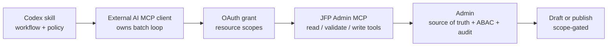

# Bulk Locale Factory MCP and Codex Skill

## Problem Frame

Editors need to create additional locales for existing Experiences quickly, but a raw translation pass is not enough. Localized pages must preserve editorial intent, respect the current Experience block schema, avoid broken video/media references, and be publishable by a properly authorized AI workflow.

The desired model is "bring your own AI": Codex, Claude, Gemini, or another MCP client should be able to run the localization loop using Forge data and Forge validation, without Admin owning every generation decision. The Forge side should provide OAuth-scoped JFP Admin MCP primitives for reading, validating, diffing, writing, and publishing locale content. A Codex skill should drive the Bulk Locale Factory agent loop, quality policy, media replacement policy, and reporting behavior.

## Shape at a Glance

> Directional shape for planning, not an implementation diagram.

## Requirements

**Agent-Owned Bulk Loop**

- R1. The Bulk Locale Factory runs as an external-agent loop: the MCP exposes primitives, and the AI client decides batching, retries, generation strategy, and task order.
- R2. The agent can discover Experiences missing one or more requested target locales.
- R3. The agent can read a source ExperienceLocale and enough related context to produce a target locale draft.
- R4. The agent can create draft target locales and update any existing locale the authenticated user is allowed to edit.
- R5. The default path may stop at draft creation/update, but an AI client with `experience:publish` and an explicit user instruction may publish the target locale after validation succeeds.

**Codex Skill Responsibilities**

- R6. A published `forge-bulk-locale-factory` Codex skill drives the localization loop, including discovery, per-locale generation, validation, write, optional publish, and final reporting.
- R7. The skill stores durable operating guidance, not live Experience content. Suitable skill reference data includes translation policy, block preservation rules, locale quality rubric, theological/editorial review rules, MCP tool contract guidance, and curated glossary terms.
- R8. The skill must instruct agents to ask the MCP for live source content, target locale state, video/media availability, and validation results instead of relying on stale embedded examples.
- R9. The skill must report created, updated, skipped, failed, and warning states with editor links when available.

**Translation and Adaptation Policy**

- R10. The default localization policy is locale-aware adaptation: preserve source intent and structure where useful, while allowing natural idiom, metadata, title framing, and CTA wording in the target locale.
- R11. The agent must preserve source block structure unless target-locale media availability, editorial quality, or explicit user instruction justifies a change.
- R12. The agent must never invent video IDs, media IDs, scripture references, or URLs. Referenced entities must come from MCP-returned data or the source locale.
- R13. The agent must surface material content changes as review warnings rather than silently hiding them in the final draft.

**Video and Media Availability**

- R14. The factory must evaluate target-locale availability for all video-bearing blocks, including hero videos, single video blocks, carousels/sliders, media collections, related video sections, and future video recommendation blocks.
- R15. For unavailable source videos, the agent should first seek target-locale-compatible replacements that preserve the block's editorial intent.
- R16. If a list/slider falls below a minimum useful count after unavailable videos are removed and no strong replacements exist, the agent may remove that block from the draft content and must report that decision. Runtime-only hiding is out of scope for this workflow.
- R17. The MCP must provide enough availability information for the agent to distinguish playable target-language media, acceptable subtitle fallback, unavailable media, and low-confidence metadata.
- R18. Replacement recommendations must be grounded in Admin/Core-backed video data and must include why the candidate fits the source block's intent and target locale.

**MCP Tooling Capabilities**

- R19. The MCP exposes read primitives for listing Experiences, listing locales, reading locale content, finding missing locales, and reading relevant video/media/scripture context.
- R20. The MCP exposes validation primitives for block schema validity, target-locale media availability, scripture/reference validity, and source-vs-target diffs.
- R21. The MCP exposes write primitives for creating and updating ExperienceLocale drafts through Admin-owned service boundaries.
- R22. MCP tool outputs must be rich enough for an agent to verify and iterate: include IDs, status, warnings, validation failures, diffs, editor URLs, and next recommended checks where applicable.
- R23. MCP tools should remain primitive rather than wrapping the whole bulk workflow in one hidden `bulk_create_locales` operation.

**OAuth and Authorization**

- R24. The MCP must be OAuth-able as a protected remote HTTP MCP server.
- R25. OAuth scopes are resource-centered:
  - `experience:read`
  - `experience:locale:create`
  - `experience:locale:update`
  - `experience:locale:validate`
  - `media:read`
  - `video:read`
  - `bible:read`
  - `experience:publish`
- R26. The default Bulk Locale Factory grant may include `experience:publish` for trusted Admin operators, but publish remains a separate scope and must never be implied by create/update scopes.
- R27. `experience:locale:update` allows updating any ExperienceLocale the authenticated user is allowed to edit; it is not limited to locales created during the current run.
- R28. Every write must pass both OAuth scope checks and Admin ABAC checks.
- R29. The MCP must not accept unrelated Admin/web/app tokens as proof of MCP authorization, and it must not pass the client OAuth token through to downstream Admin APIs.
- R30. If a client token lacks a required scope, the MCP must fail with an insufficient-scope response that names the minimum required scope set for that operation.
- R31. The MCP must enforce practical abuse controls for external agents, including request limits and bounded payload sizes for read, validation, and write tools.

**Audit and Review**

- R32. Every create/update/publish performed through the MCP records enough provenance to identify MCP/agent-originated edits, the authenticated user, affected locale, changed fields, and publish reason.
- R33. The final factory report must identify locales that were created, updated, published, skipped, or left needing human attention because of media replacements, removed sections, validation repairs, low-confidence references, or large adaptation changes.
- R34. AI publish must require successful validation, `experience:publish`, an explicit publish instruction, and Admin ABAC permission.

## Success Criteria

- An authenticated external AI client can create or update draft locales for a batch of Experiences without using the Admin browser UI.
- The agent can repair or remove target-locale-incompatible video sections instead of creating broken translated pages.
- Draft writes are validated against current Admin schemas and permissions before persistence.
- A trusted OAuth grant can let agents create, update, validate, and publish locales when the user explicitly asks for publish.
- A Codex skill can run the loop repeatably using MCP data and produce a clear summary of created, updated, skipped, failed, and review-warning locales.
- A downstream planner can implement the first slice without inventing the product boundary between skill, MCP, OAuth, and Admin.

## Scope Boundaries

- No publish without explicit user instruction, successful validation, `experience:publish`, and Admin ABAC permission.
- No hidden Admin-owned bulk generation loop in v1; the external agent owns the loop.
- No storing live Experience content inside the Codex skill.
- No replacing Admin as the source of truth for Experiences, media, videos, scripture, permissions, or audit.
- No guarantee that every target locale should be published without human review; the skill must stop when policy or validation marks a locale as unsafe to publish.
- No full Experience Editor MCP parity in this slice, though tools should be shaped so full editor parity can grow from them.

## Key Decisions

- **External agent owns the factory loop.** This preserves bring-your-own-AI behavior and keeps the MCP as a composable tool surface.
- **Published skill drives procedure and policy.** Codex skills are the right home for workflow instructions, quality rubrics, translation/media judgment rules, and publish gates for Admin operators.
- **MCP owns live data and side effects.** Admin-backed tools provide current content, validation, ABAC, persistence, and audit.
- **Preserve intent over exact blocks.** Target-locale media gaps may require replacement or removal, and those changes must be visible to reviewers.
- **OAuth scopes are resource-centered.** Video, media, and Bible access are separate resource scopes used by the localization workflow, not sub-scopes of Experience.
- **Update authority is broad within ABAC.** An agent with `experience:locale:update` can update any locale the authenticated user can edit.
- **Publish authority is explicit.** An agent can publish only when the token includes `experience:publish`, the user explicitly requested publishing, validation passed, and Admin ABAC permits it.
- **The OAuth app is Admin MCP, not an experience-only client.** Bulk Locale Factory is the first capability, but the app/client identity should support future Admin-side MCP tools.

## Dependencies / Assumptions

- Admin is the source of truth for Experiences and per-locale content.
- Existing ExperienceLocale modeling supports independent draft/publish state per locale.
- Existing Admin validation and block-schema gates should be reused rather than duplicated in a standalone MCP-only validator.
- OAuth integration should align with the current MCP HTTP authorization model: protected-resource discovery, bearer tokens on every request, scoped access, and resource/audience-bound tokens.
- The Codex skill will live in a publishable, discoverable skill location for Admin-side operators and be versioned alongside the MCP tool contract guidance.

## Outstanding Questions

### Resolve Before Planning

None.

### Deferred to Planning

- [Affects R17, R18][Technical] Exact media availability policy: what counts as acceptable target-language playback vs. subtitle fallback for each block type.
- [Affects R16][Product] Minimum useful counts for carousels/sliders/media collections by block type.
- [Affects R19-R23][Technical] Whether the MCP server should call Admin GraphQL, Admin services directly, or dedicated internal HTTP endpoints.
- [Affects R24-R29][Technical] OAuth provider integration details and whether Forge Auth or another authorization server issues MCP audience-bound tokens.
- [Affects R31][Technical] Initial rate limits and payload-size ceilings for each MCP tool class.
- [Affects R32][Technical] Exact audit/provenance storage shape for MCP-originated writes.
- [Affects R6-R9][Technical] Packaging location and distribution model for the `forge-bulk-locale-factory` Codex skill.
- [Affects R12, R20][Needs research] Scripture/reference validation depth required for non-English locales.

## Next Steps

-> `/ce:plan` for structured implementation planning.
