# Forge RAG database: full entity-relationship diagram

[Open the SVG](schema.svg) · [PNG for sharing](schema.png) · [Mermaid source](schema.mmd) · [Consumer-registry draft PR #2397](https://github.com/JesusFilm/forge/pull/2397) · [This documentation draft PR #2398](https://github.com/JesusFilm/forge/pull/2398)



The diagram lists every table, every column with its type, nullability, default,
keys, indexes and check constraints, and every relationship with its cardinality
and delete behaviour, for two sets of tables in the **same** RAG PostgreSQL
database:

- **Existing (blue)** — the eight `public` corpus, acquisition and maintenance
  tables defined by the migrations committed on `main`.
- **Draft (amber)** — the five `consumer_private` registry tables proposed in
  draft PR #2397. They are not merged and may change before they land.

Nothing here was read from a live database. The SQL migrations are the
authoritative source; the Prisma datamodel is shown only for name mapping.
Every table below cites the file that defines it. Anything inferred rather than
read from SQL is labelled **inferred**.

## Legend

| Diagram element                                        | Meaning                                                                                                     |
| ------------------------------------------------------ | ----------------------------------------------------------------------------------------------------------- |
| Entity header `schema.table · existing` on blue        | Committed on `main`; see revision pins below                                                                |
| Entity header `schema.table · DRAFT PR #2397` on amber | Defined only by the unmerged migration in PR #2397                                                          |
| Row columns                                            | PostgreSQL type · column name · key marker · notes                                                          |
| Key markers `PK`, `FK`, `UK`, `PK,FK`                  | Primary key member, foreign key member, unique (single-column UNIQUE), or both PK and FK                    |
| `NN` / `NULL`                                          | `NOT NULL` / nullable                                                                                       |
| `= value`                                              | Column `DEFAULT` as written in SQL                                                                          |
| `UQ name` / `IX name` / `GIN name` / `HNSW name`       | Unique index, B-tree index, GIN index, HNSW (pgvector) index, by name; composite indexes list their columns |
| `CK ...`                                               | `CHECK` constraint summary                                                                                  |
| `→ table.column`                                       | Foreign-key target; `ON DELETE` behaviour follows                                                           |
| `GEN`                                                  | Generated (computed, stored) column                                                                         |
| `logical → table.column, no FK`                        | A reference the application relies on that the database does **not** enforce                                |
| Solid line                                             | A real `FOREIGN KEY` constraint, read parent (bar end) → child (crow's-foot end)                            |
| Dashed line                                            | A logical reference inferred from application code; not a constraint                                        |
| `\|\|` / `\|o` / `o{` / `\|{`                          | Exactly one / zero or one / zero or more / one or more (crow's-foot notation)                               |

Type names are normalised to lowercase PostgreSQL names. The corpus migration
writes them in uppercase (`UUID`, `TEXT`, `JSONB`, `TIMESTAMPTZ`, `INTEGER`,
`BOOLEAN`, `TSVECTOR`); `timestamptz` is `timestamp with time zone`, `integer` is
`int4`, and `halfvec(1536)` is the pgvector half-precision vector type. Where a
migration does not state `ON UPDATE`, PostgreSQL's default `NO ACTION` applies;
where it does not name a constraint, PostgreSQL assigns a default name (listed
below as inferred).

## Revision pins and source inventory

Inspected on 2026-09-23 from Git history only, without connecting to any
database.

| Set                                   | Pinned revision                                                                                                                                                                                                                                                                                   | Files read                                                                                                                                                                                                                                                                                                                                                                                                                                                                                                                                                                                                                                                                                                               | Authority                                                                                                                                                                                                                                                                                              |
| ------------------------------------- | ------------------------------------------------------------------------------------------------------------------------------------------------------------------------------------------------------------------------------------------------------------------------------------------------- | ------------------------------------------------------------------------------------------------------------------------------------------------------------------------------------------------------------------------------------------------------------------------------------------------------------------------------------------------------------------------------------------------------------------------------------------------------------------------------------------------------------------------------------------------------------------------------------------------------------------------------------------------------------------------------------------------------------------------ | ------------------------------------------------------------------------------------------------------------------------------------------------------------------------------------------------------------------------------------------------------------------------------------------------------ |
| Existing corpus schema                | `origin/main` at `5a30f5ddceeb4dc29d7ceb87718600a30af91401` (fetched 2026-09-23). Last commit touching `apps/rag/prisma/` on `main`: `3e8f1dcf40fe052afdba6b09907b9b71d7e81d6f` (2026-09-07). These files are byte-identical at this PR branch's base `77eb63fbb325f6279955f34cffd1f8994f9281dd`. | [`apps/rag/prisma/migrations/20260827000000_init_rag_schema/migration.sql`](../../../apps/rag/prisma/migrations/20260827000000_init_rag_schema/migration.sql) · [`20260831000000_harden_corpus_maintenance/migration.sql`](../../../apps/rag/prisma/migrations/20260831000000_harden_corpus_maintenance/migration.sql) · [`20260904000000_add_raw_document_promotion_index/migration.sql`](../../../apps/rag/prisma/migrations/20260904000000_add_raw_document_promotion_index/migration.sql) · [`apps/rag/prisma/schema.prisma`](../../../apps/rag/prisma/schema.prisma)                                                                                                                                                | Migrations are authoritative for every column, constraint and index. Prisma cannot express the `halfvec`, generated `tsvector`, GIN and HNSW objects; [`apps/rag/scripts/check-schema-drift.ts`](../../../apps/rag/scripts/check-schema-drift.ts) lists exactly those as expected raw-SQL differences. |
| Draft consumer registry               | PR #2397 head `a562de94ab9d0522dc2002d3d265535839797753` (branch `feat/rag-consumer-registry`), the branch head at inspection time                                                                                                                                                                | [`apps/rag/prisma/migrations/20260923000000_consumer_registry_foundation/migration.sql`](https://github.com/JesusFilm/forge/blob/a562de94ab9d0522dc2002d3d265535839797753/apps/rag/prisma/migrations/20260923000000_consumer_registry_foundation/migration.sql) · [`apps/rag/src/adapters/postgres/consumer-registry.ts`](https://github.com/JesusFilm/forge/blob/a562de94ab9d0522dc2002d3d265535839797753/apps/rag/src/adapters/postgres/consumer-registry.ts) · [`apps/rag/src/contracts/consumer-registry.ts`](https://github.com/JesusFilm/forge/blob/a562de94ab9d0522dc2002d3d265535839797753/apps/rag/src/contracts/consumer-registry.ts) · the design note under `docs/roadmap/rag/evidence/feat-527/` in that PR | The migration is the only definition of these tables; they are deliberately outside Prisma's datamodel. The adapter is cited only for application behaviour (owner creation, audit writes).                                                                                                            |
| Code used to infer logical references | Same `main` revision                                                                                                                                                                                                                                                                              | [`apps/rag/src/adapters/postgres/index.ts`](../../../apps/rag/src/adapters/postgres/index.ts) (language-sweep audit insert, cache upserts, raw-document create) · [`apps/rag/scripts/lib/raw-document-promotion.ts`](../../../apps/rag/scripts/lib/raw-document-promotion.ts) (promotion filters by `source_key`) · [`apps/rag/scripts/query.ts`](../../../apps/rag/scripts/query.ts) (`allowedSourceKeys` retrieval policy)                                                                                                                                                                                                                                                                                             | Evidence for dashed lines only; none of these creates a database constraint.                                                                                                                                                                                                                           |
| Operational context                   | Same `main` revision                                                                                                                                                                                                                                                                              | [`apps/rag/docs/ops/postgres-and-schema.md`](../../../apps/rag/docs/ops/postgres-and-schema.md) · [`apps/rag/tests/schema.test.mjs`](../../../apps/rag/tests/schema.test.mjs) · [`apps/rag/docker-compose.yml`](../../../apps/rag/docker-compose.yml) (local image `pgvector/pgvector:pg18-trixie`)                                                                                                                                                                                                                                                                                                                                                                                                                      | Confirms the expected object list and that `_prisma_migrations` exists as Prisma bookkeeping.                                                                                                                                                                                                          |

## Table inventory

Thirteen tables, 102 columns, eight foreign keys.

| #   | Table                              | Status         | Prisma model          | Primary key                                | Defined by                                                                                    |
| --- | ---------------------------------- | -------------- | --------------------- | ------------------------------------------ | --------------------------------------------------------------------------------------------- |
| 1   | `public.sources`                   | existing       | `Source`              | `id`                                       | init migration `20260827000000`                                                               |
| 2   | `public.documents`                 | existing       | `Document`            | `id`                                       | init `20260827000000`; `updated_at` added by `20260831000000`                                 |
| 3   | `public.chunks`                    | existing       | `Chunk`               | `id`                                       | init `20260827000000`                                                                         |
| 4   | `public.chunk_embeddings`          | existing       | `ChunkEmbedding`      | `chunk_id` (also the FK)                   | init `20260827000000`                                                                         |
| 5   | `public.http_cache`                | existing       | `HttpCache`           | `url`                                      | init `20260827000000`                                                                         |
| 6   | `public.robots_cache`              | existing       | `RobotsCache`         | `robots_url`                               | init `20260827000000`                                                                         |
| 7   | `public.raw_documents`             | existing       | `RawDocument`         | `id`                                       | init `20260827000000`; two columns added by `20260831000000`; index added by `20260904000000` |
| 8   | `public.language_change_audits`    | existing       | `LanguageChangeAudit` | `id`                                       | `20260831000000_harden_corpus_maintenance`                                                    |
| 9   | `consumer_private.consumers`       | draft PR #2397 | none (raw SQL)        | `id`                                       | `20260923000000_consumer_registry_foundation` at `a562de94`                                   |
| 10  | `consumer_private.members`         | draft PR #2397 | none (raw SQL)        | `(consumer_id, github_user_id)`            | same draft migration                                                                          |
| 11  | `consumer_private.environments`    | draft PR #2397 | none (raw SQL)        | `(consumer_id, environment)`               | same draft migration                                                                          |
| 12  | `consumer_private.usage_daily`     | draft PR #2397 | none (raw SQL)        | `(consumer_id, environment, day, outcome)` | same draft migration                                                                          |
| 13  | `consumer_private.lifecycle_audit` | draft PR #2397 | none (raw SQL)        | `id`                                       | same draft migration                                                                          |

## Column inventory

`Null` is `no` for `NOT NULL` columns. Defaults are quoted as written in the
migration. Index and constraint names are the SQL names; names marked
_inferred_ are PostgreSQL defaults for constraints the draft SQL leaves unnamed.

### 1. `public.sources` — existing

Source: init migration `20260827000000`, `CREATE TABLE "sources"`.

| Column             | Type          | Null | Default             | Constraints and indexes                           |
| ------------------ | ------------- | ---- | ------------------- | ------------------------------------------------- |
| `id`               | `uuid`        | no   | `gen_random_uuid()` | PK `sources_pkey`                                 |
| `key`              | `text`        | no   | —                   | unique index `sources_key_uq`                     |
| `name`             | `text`        | no   | —                   | —                                                 |
| `domain`           | `text`        | yes  | —                   | —                                                 |
| `trust`            | `text`        | yes  | —                   | —                                                 |
| `ingestion_mode`   | `text`        | yes  | —                   | —                                                 |
| `languages`        | `jsonb`       | no   | `'[]'::jsonb`       | —                                                 |
| `default_tags`     | `jsonb`       | no   | `'[]'::jsonb`       | —                                                 |
| `default_category` | `text`        | yes  | —                   | —                                                 |
| `rights`           | `text`        | yes  | —                   | —                                                 |
| `content_hash`     | `text`        | yes  | —                   | —                                                 |
| `indexed_at`       | `timestamptz` | yes  | —                   | —                                                 |
| `created_at`       | `timestamptz` | no   | `CURRENT_TIMESTAMP` | —                                                 |
| `updated_at`       | `timestamptz` | no   | `CURRENT_TIMESTAMP` | no trigger maintains it; application code sets it |

### 2. `public.documents` — existing

Source: init migration `20260827000000`, `CREATE TABLE "documents"` and its
`ALTER TABLE ... ADD CONSTRAINT`; `updated_at` from
`20260831000000_harden_corpus_maintenance`.

| Column          | Type          | Null | Default             | Constraints and indexes                                                                                                                                                               |
| --------------- | ------------- | ---- | ------------------- | ------------------------------------------------------------------------------------------------------------------------------------------------------------------------------------- |
| `id`            | `uuid`        | no   | `gen_random_uuid()` | PK `documents_pkey`                                                                                                                                                                   |
| `source_id`     | `uuid`        | no   | —                   | FK `documents_source_id_fkey` → `sources(id)` `ON DELETE CASCADE ON UPDATE NO ACTION`; index `documents_source_idx`; first column of unique index `documents_source_canonical_url_uq` |
| `canonical_url` | `text`        | no   | —                   | second column of unique index `documents_source_canonical_url_uq (source_id, canonical_url)`                                                                                          |
| `url`           | `text`        | yes  | —                   | —                                                                                                                                                                                     |
| `title`         | `text`        | yes  | —                   | —                                                                                                                                                                                     |
| `language`      | `text`        | yes  | —                   | —                                                                                                                                                                                     |
| `category`      | `text`        | yes  | —                   | —                                                                                                                                                                                     |
| `content_hash`  | `text`        | no   | —                   | —                                                                                                                                                                                     |
| `chunk_count`   | `integer`     | no   | `0`                 | —                                                                                                                                                                                     |
| `first_seen`    | `timestamptz` | no   | `CURRENT_TIMESTAMP` | —                                                                                                                                                                                     |
| `last_seen`     | `timestamptz` | no   | `CURRENT_TIMESTAMP` | —                                                                                                                                                                                     |
| `indexed_at`    | `timestamptz` | yes  | —                   | —                                                                                                                                                                                     |
| `updated_at`    | `timestamptz` | no   | `CURRENT_TIMESTAMP` | added 2026-08-31; no trigger maintains it                                                                                                                                             |

### 3. `public.chunks` — existing

Source: init migration `20260827000000`, `CREATE TABLE "chunks"`, its two GIN
indexes and two `ALTER TABLE ... ADD CONSTRAINT` statements.

| Column        | Type          | Null                    | Default             | Constraints and indexes                                                                                                                                                                               |
| ------------- | ------------- | ----------------------- | ------------------- | ----------------------------------------------------------------------------------------------------------------------------------------------------------------------------------------------------- |
| `id`          | `uuid`        | no                      | `gen_random_uuid()` | PK `chunks_pkey`                                                                                                                                                                                      |
| `document_id` | `uuid`        | no                      | —                   | FK `chunks_document_id_fkey` → `documents(id)` `ON DELETE CASCADE ON UPDATE NO ACTION`; index `chunks_document_idx`                                                                                   |
| `source_id`   | `uuid`        | no                      | —                   | FK `chunks_source_id_fkey` → `sources(id)` `ON DELETE CASCADE ON UPDATE NO ACTION`; index `chunks_source_idx`. Independent of `document_id`: nothing checks that it equals the document's `source_id` |
| `ord`         | `integer`     | no                      | —                   | no unique `(document_id, ord)`; `tests/schema.test.mjs` asserts that absence                                                                                                                          |
| `text`        | `text`        | no                      | —                   | input of `search_tsv`                                                                                                                                                                                 |
| `char_start`  | `integer`     | no                      | —                   | —                                                                                                                                                                                                     |
| `char_end`    | `integer`     | no                      | —                   | —                                                                                                                                                                                                     |
| `token_count` | `integer`     | no                      | —                   | —                                                                                                                                                                                                     |
| `tags`        | `jsonb`       | no                      | `'[]'::jsonb`       | GIN index `chunks_tags_gin`                                                                                                                                                                           |
| `created_at`  | `timestamptz` | no                      | `CURRENT_TIMESTAMP` | —                                                                                                                                                                                                     |
| `search_tsv`  | `tsvector`    | not declared (see note) | —                   | `GENERATED ALWAYS AS (to_tsvector('english', "text")) STORED`; GIN index `chunks_search_tsv_gin`                                                                                                      |

Note on `search_tsv`: the SQL declares no `NOT NULL`, so the catalogue reports
the column as nullable and Prisma models it as `Unsupported("tsvector")?`. Its
value is always computed from the non-null `text` column, so in practice it is
never null. Both facts are stated rather than collapsed into one.

### 4. `public.chunk_embeddings` — existing

Source: init migration `20260827000000`, `CREATE TABLE "chunk_embeddings"`,
`CREATE INDEX ... USING hnsw`, and `ALTER TABLE ... ADD CONSTRAINT`. Requires
`CREATE EXTENSION IF NOT EXISTS vector`, which the same migration runs first.

| Column            | Type            | Null | Default             | Constraints and indexes                                                                                                                                                      |
| ----------------- | --------------- | ---- | ------------------- | ---------------------------------------------------------------------------------------------------------------------------------------------------------------------------- |
| `chunk_id`        | `uuid`          | no   | —                   | PK `chunk_embeddings_pkey`; FK `chunk_embeddings_chunk_id_fkey` → `chunks(id)` `ON DELETE CASCADE ON UPDATE NO ACTION`. PK = FK, so each chunk has at most one embedding row |
| `embedding`       | `halfvec(1536)` | no   | —                   | HNSW index `chunk_embeddings_hnsw` with `halfvec_cosine_ops`                                                                                                                 |
| `embedding_model` | `text`          | no   | —                   | index `chunk_embeddings_model_idx`                                                                                                                                           |
| `embedded_at`     | `timestamptz`   | no   | `CURRENT_TIMESTAMP` | —                                                                                                                                                                            |

### 5. `public.http_cache` — existing

Source: init migration `20260827000000`, `CREATE TABLE "http_cache"`.

| Column          | Type          | Null | Default             | Constraints and indexes |
| --------------- | ------------- | ---- | ------------------- | ----------------------- |
| `url`           | `text`        | no   | —                   | PK `http_cache_pkey`    |
| `etag`          | `text`        | yes  | —                   | —                       |
| `last_modified` | `text`        | yes  | —                   | —                       |
| `body_hash`     | `text`        | yes  | —                   | —                       |
| `status_code`   | `integer`     | yes  | —                   | —                       |
| `fetched_at`    | `timestamptz` | no   | `CURRENT_TIMESTAMP` | —                       |
| `updated_at`    | `timestamptz` | no   | `CURRENT_TIMESTAMP` | —                       |

### 6. `public.robots_cache` — existing

Source: init migration `20260827000000`, `CREATE TABLE "robots_cache"`.

| Column        | Type          | Null | Default             | Constraints and indexes |
| ------------- | ------------- | ---- | ------------------- | ----------------------- |
| `robots_url`  | `text`        | no   | —                   | PK `robots_cache_pkey`  |
| `body`        | `text`        | yes  | —                   | —                       |
| `status_code` | `integer`     | yes  | —                   | —                       |
| `fetched_at`  | `timestamptz` | no   | `CURRENT_TIMESTAMP` | —                       |
| `updated_at`  | `timestamptz` | no   | `CURRENT_TIMESTAMP` | —                       |

### 7. `public.raw_documents` — existing

Source: init migration `20260827000000`, `CREATE TABLE "raw_documents"` and
two indexes; `index_attempted_at` and `index_attempted_model` from
`20260831000000_harden_corpus_maintenance`; `raw_documents_promotion_latest_idx`
from `20260904000000_add_raw_document_promotion_index` (created
`CONCURRENTLY IF NOT EXISTS`).

| Column                  | Type          | Null | Default             | Constraints and indexes                                                                                                                         |
| ----------------------- | ------------- | ---- | ------------------- | ----------------------------------------------------------------------------------------------------------------------------------------------- |
| `id`                    | `uuid`        | no   | `gen_random_uuid()` | PK `raw_documents_pkey`; last column of `raw_documents_promotion_latest_idx`                                                                    |
| `source_key`            | `text`        | no   | —                   | index `raw_documents_source_key_idx`; first column of `raw_documents_promotion_latest_idx`; logical reference to `sources.key`, **no FK**       |
| `url`                   | `text`        | no   | —                   | —                                                                                                                                               |
| `canonical_url`         | `text`        | no   | —                   | second column of `raw_documents_promotion_latest_idx`; **no** unique `(source_key, canonical_url)` (asserted absent by `tests/schema.test.mjs`) |
| `title`                 | `text`        | yes  | —                   | —                                                                                                                                               |
| `raw_content`           | `text`        | no   | —                   | —                                                                                                                                               |
| `status`                | `integer`     | yes  | —                   | —                                                                                                                                               |
| `body_hash`             | `text`        | yes  | —                   | —                                                                                                                                               |
| `etag`                  | `text`        | yes  | —                   | —                                                                                                                                               |
| `last_modified`         | `text`        | yes  | —                   | —                                                                                                                                               |
| `fetched_at`            | `timestamptz` | no   | `CURRENT_TIMESTAMP` | third column of `raw_documents_promotion_latest_idx` (`DESC`)                                                                                   |
| `not_modified`          | `boolean`     | no   | `false`             | —                                                                                                                                               |
| `ingested_at`           | `timestamptz` | yes  | —                   | index `raw_documents_ingested_at_idx`                                                                                                           |
| `index_attempted_at`    | `timestamptz` | yes  | —                   | added 2026-08-31                                                                                                                                |
| `index_attempted_model` | `text`        | yes  | —                   | added 2026-08-31                                                                                                                                |

Composite index `raw_documents_promotion_latest_idx` is on
`(source_key, canonical_url, fetched_at DESC, id DESC)`.

### 8. `public.language_change_audits` — existing

Source: `20260831000000_harden_corpus_maintenance`, `CREATE TABLE "language_change_audits"` and two indexes.

| Column           | Type          | Null | Default             | Constraints and indexes                                                                                                         |
| ---------------- | ------------- | ---- | ------------------- | ------------------------------------------------------------------------------------------------------------------------------- |
| `id`             | `uuid`        | no   | `gen_random_uuid()` | PK `language_change_audits_pkey`                                                                                                |
| `run_id`         | `text`        | no   | —                   | index `language_change_audits_run_idx`; first column of unique index `language_change_audits_run_document_uq`                   |
| `document_id`    | `uuid`        | no   | —                   | second column of `language_change_audits_run_document_uq (run_id, document_id)`; logical reference to `documents.id`, **no FK** |
| `source_key`     | `text`        | no   | —                   | logical reference to `sources.key`, **no FK**                                                                                   |
| `old_language`   | `text`        | yes  | —                   | —                                                                                                                               |
| `new_language`   | `text`        | yes  | —                   | —                                                                                                                               |
| `detector_model` | `text`        | yes  | —                   | —                                                                                                                               |
| `created_at`     | `timestamptz` | no   | `CURRENT_TIMESTAMP` | —                                                                                                                               |

### 9. `consumer_private.consumers` — draft PR #2397

Source: `20260923000000_consumer_registry_foundation/migration.sql` at
`a562de94`, `CREATE TABLE consumer_private.consumers`.

| Column       | Type          | Null    | Default             | Constraints and indexes                                                                                                                                        |
| ------------ | ------------- | ------- | ------------------- | -------------------------------------------------------------------------------------------------------------------------------------------------------------- |
| `id`         | `uuid`        | no (PK) | `gen_random_uuid()` | PK (unnamed in SQL; default name `consumers_pkey`, _inferred_). Trigger `guard_consumer_identity` rejects any change to `id` and any `DELETE`                  |
| `name`       | `text`        | no      | —                   | `UNIQUE` (default name `consumers_name_key`, _inferred_); `CHECK (name ~ '^[a-z0-9-]+$' AND length(name) BETWEEN 1 AND 80)`; trigger rejects changes to `name` |
| `state`      | `text`        | no      | `'pending'`         | `CHECK (state IN ('pending', 'active', 'suspended', 'revoked'))`; values only, no transition rules                                                             |
| `created_at` | `timestamptz` | no      | `now()`             | —                                                                                                                                                              |
| `updated_at` | `timestamptz` | no      | `now()`             | no trigger maintains it                                                                                                                                        |

### 10. `consumer_private.members` — draft PR #2397

Source: same draft migration, `CREATE TABLE consumer_private.members`.

| Column           | Type          | Null | Default | Constraints and indexes                                                                                                                                                                               |
| ---------------- | ------------- | ---- | ------- | ----------------------------------------------------------------------------------------------------------------------------------------------------------------------------------------------------- |
| `consumer_id`    | `uuid`        | no   | —       | first column of PK `(consumer_id, github_user_id)`; FK → `consumers(id)` `ON DELETE RESTRICT` (`ON UPDATE` not stated → `NO ACTION`); trigger `lock_membership_parent` rejects updates that change it |
| `github_user_id` | `bigint`      | no   | —       | second column of the PK; `CHECK (github_user_id > 0)`; a GitHub account ID, not a reference to any local user table                                                                                   |
| `role`           | `text`        | no   | —       | `CHECK (role IN ('owner', 'member'))`; deferred constraint trigger `require_owner_after_member_change` requires at least one `owner` row per consumer at commit                                       |
| `created_at`     | `timestamptz` | no   | `now()` | —                                                                                                                                                                                                     |

No index other than the PK; the PK's leading column serves `consumer_id` lookups.

### 11. `consumer_private.environments` — draft PR #2397

Source: same draft migration, `CREATE TABLE consumer_private.environments`.

| Column                | Type          | Null | Default              | Constraints and indexes                                                                                                                                                                      |
| --------------------- | ------------- | ---- | -------------------- | -------------------------------------------------------------------------------------------------------------------------------------------------------------------------------------------- |
| `consumer_id`         | `uuid`        | no   | —                    | first column of PK `(consumer_id, environment)`; FK → `consumers(id)` `ON DELETE RESTRICT`                                                                                                   |
| `environment`         | `text`        | no   | —                    | second column of the PK; `CHECK (environment ~ '^[a-z0-9-]+$' AND length(environment) BETWEEN 1 AND 40)`                                                                                     |
| `state`               | `text`        | no   | `'pending'`          | `CHECK (state IN ('pending', 'active', 'suspended', 'revoked'))`                                                                                                                             |
| `allowed_source_keys` | `text[]`      | no   | `'{}'` (empty array) | table-level `CHECK (array_position(allowed_source_keys, NULL) IS NULL)` forbids NULL elements; elements are logical references to `sources.key`, **no FK**, no existence or uniqueness check |
| `created_at`          | `timestamptz` | no   | `now()`              | —                                                                                                                                                                                            |
| `updated_at`          | `timestamptz` | no   | `now()`              | no trigger maintains it                                                                                                                                                                      |

No triggers and no index other than the PK.

### 12. `consumer_private.usage_daily` — draft PR #2397

Source: same draft migration, `CREATE TABLE consumer_private.usage_daily`.
The migration comment reserves it for a later usage ticket; the draft has no
code that writes or reads it.

| Column          | Type     | Null | Default | Constraints and indexes                                                                                                |
| --------------- | -------- | ---- | ------- | ---------------------------------------------------------------------------------------------------------------------- |
| `consumer_id`   | `uuid`   | no   | —       | PK column 1; composite FK `(consumer_id, environment)` → `environments(consumer_id, environment)` `ON DELETE RESTRICT` |
| `environment`   | `text`   | no   | —       | PK column 2; composite FK as above                                                                                     |
| `day`           | `date`   | no   | —       | PK column 3; UTC day is a convention in the PR notes only, not enforced by the type                                    |
| `outcome`       | `text`   | no   | —       | PK column 4; `CHECK (outcome IN ('success', 'client_error', 'server_error'))`                                          |
| `request_count` | `bigint` | no   | `0`     | `CHECK (request_count >= 0)`                                                                                           |

No timestamps, no triggers, no index other than the PK.

### 13. `consumer_private.lifecycle_audit` — draft PR #2397

Source: same draft migration, `CREATE TABLE consumer_private.lifecycle_audit`.

| Column                 | Type          | Null    | Default             | Constraints and indexes                                                                      |
| ---------------------- | ------------- | ------- | ------------------- | -------------------------------------------------------------------------------------------- |
| `id`                   | `uuid`        | no (PK) | `gen_random_uuid()` | PK (default name `lifecycle_audit_pkey`, _inferred_)                                         |
| `consumer_id`          | `uuid`        | no      | —                   | FK → `consumers(id)` `ON DELETE RESTRICT`; **no index** on this column                       |
| `actor_github_user_id` | `bigint`      | no      | —                   | `CHECK (actor_github_user_id > 0)`; logical reference to `members.github_user_id`, **no FK** |
| `action`               | `text`        | no      | —                   | `CHECK (action IN ('created', 'member_added', 'member_removed'))`                            |
| `occurred_at`          | `timestamptz` | no      | `now()`             | —                                                                                            |

## Relationships

### Foreign keys (solid lines)

Cardinality is read parent → child. Every child column is `NOT NULL`, so each
child row has exactly one parent.

| #   | Child → parent                                                                     | Constraint                                                              | ON DELETE  | ON UPDATE             | Cardinality                                                                                                                                            | Source                                            |
| --- | ---------------------------------------------------------------------------------- | ----------------------------------------------------------------------- | ---------- | --------------------- | ------------------------------------------------------------------------------------------------------------------------------------------------------ | ------------------------------------------------- |
| 1   | `documents.source_id` → `sources.id`                                               | `documents_source_id_fkey`                                              | `CASCADE`  | `NO ACTION`           | one source : zero or more documents                                                                                                                    | init migration                                    |
| 2   | `chunks.document_id` → `documents.id`                                              | `chunks_document_id_fkey`                                               | `CASCADE`  | `NO ACTION`           | one document : zero or more chunks                                                                                                                     | init migration                                    |
| 3   | `chunks.source_id` → `sources.id`                                                  | `chunks_source_id_fkey`                                                 | `CASCADE`  | `NO ACTION`           | one source : zero or more chunks; independent of #2                                                                                                    | init migration                                    |
| 4   | `chunk_embeddings.chunk_id` → `chunks.id`                                          | `chunk_embeddings_chunk_id_fkey`                                        | `CASCADE`  | `NO ACTION`           | one chunk : zero or one embedding (PK = FK)                                                                                                            | init migration                                    |
| 5   | `members.consumer_id` → `consumers.id`                                             | unnamed (_inferred_ default `members_consumer_id_fkey`)                 | `RESTRICT` | `NO ACTION` (default) | one consumer : one or more members **at commit** — the FK alone allows zero; the deferred `require_owner_*` triggers make zero owners a commit failure | draft migration                                   |
| 6   | `environments.consumer_id` → `consumers.id`                                        | unnamed (_inferred_ default `environments_consumer_id_fkey`)            | `RESTRICT` | `NO ACTION` (default) | one consumer : zero or more environments                                                                                                               | draft migration                                   |
| 7   | `usage_daily(consumer_id, environment)` → `environments(consumer_id, environment)` | unnamed (_inferred_ default `usage_daily_consumer_id_environment_fkey`) | `RESTRICT` | `NO ACTION` (default) | one environment : zero or more daily rows                                                                                                              | draft migration                                   |
| 8   | `lifecycle_audit.consumer_id` → `consumers.id`                                     | unnamed (_inferred_ default `lifecycle_audit_consumer_id_fkey`)         | `RESTRICT` | `NO ACTION` (default) | one consumer : zero or more audit rows (the adapter always writes a `created` row in the creating transaction, but SQL does not require it)            | draft migration; adapter for the behavioural note |

No table in `consumer_private` references a `public` table, and no `public`
table references `consumer_private`.

### Logical references (dashed lines) — inferred, not enforced

| Reference                                                                                                     | Evidence                                                                                                                                                                                                                                | Enforced?                                                                       |
| ------------------------------------------------------------------------------------------------------------- | --------------------------------------------------------------------------------------------------------------------------------------------------------------------------------------------------------------------------------------- | ------------------------------------------------------------------------------- |
| `raw_documents.source_key` = `sources.key`                                                                    | Promotion selects raw rows `WHERE source_key = <key>` for a named source (`scripts/lib/raw-document-promotion.ts`); the dashboard treats every `source_key` in `raw_documents` as an acquisition signal for a source                    | No FK; a raw row may name a key with no `sources` row                           |
| `language_change_audits.document_id` = `documents.id` and `language_change_audits.source_key` = `sources.key` | The language-sweep adapter updates `documents` joined to `sources` on `s.key = <sourceKey>` and inserts the audit with the same `document_id` and `source_key` (`src/adapters/postgres/index.ts`, `INSERT INTO language_change_audits`) | No FK; audit rows survive document deletion                                     |
| `environments.allowed_source_keys[]` elements = `sources.key`                                                 | PR #2397's design note describes the column as per-environment allowed source keys; retrieval already filters by `allowedSourceKeys` (`scripts/query.ts`)                                                                               | No FK and no element validation; an empty array's meaning is not defined by SQL |
| `lifecycle_audit.actor_github_user_id` = `members.github_user_id`                                             | The registry adapter writes the acting owner's ID (creation) or the verified owner's ID (member changes) as the actor                                                                                                                   | No FK; an actor need not remain a member                                        |

### Relationships considered and not drawn

- `http_cache.url` and `robots_cache.robots_url` are keyed by the request URL
  that the acquisition code looked up or upserted (`src/adapters/postgres/index.ts`,
  `httpCache.findUnique`/`upsert`, `robotsCache.findUnique`/`upsert`). No code
  joins them to `raw_documents`, `documents` or each other, so no line is drawn.
- `chunk_embeddings.embedding_model` and `raw_documents.index_attempted_model`
  are free-text model names with no lookup table.
- `chunks.source_id` versus `chunks.document_id → documents.source_id`: both
  FKs exist, but nothing enforces that they agree.

## Triggers and functions

The committed corpus migrations define **no** triggers or functions. All of
the following come from the draft migration and are `LANGUAGE plpgsql`.

| Trigger                             | Table       | Timing                                                                                        | Function                                     | Effect                                                                                                                     |
| ----------------------------------- | ----------- | --------------------------------------------------------------------------------------------- | -------------------------------------------- | -------------------------------------------------------------------------------------------------------------------------- |
| `guard_consumer_identity`           | `consumers` | `BEFORE UPDATE OR DELETE FOR EACH ROW`                                                        | `consumer_private.guard_consumer_identity()` | Raises on `DELETE`; raises if `NEW.id` or `NEW.name` differs from `OLD`                                                    |
| `lock_membership_parent`            | `members`   | `BEFORE UPDATE OR DELETE FOR EACH ROW`                                                        | `consumer_private.lock_membership_parent()`  | Raises if an `UPDATE` changes `consumer_id`; locks the parent `consumers` row `FOR UPDATE` to serialise membership changes |
| `require_owner_after_create`        | `consumers` | `AFTER INSERT`, constraint trigger, `DEFERRABLE INITIALLY DEFERRED`, `FOR EACH ROW`           | `consumer_private.require_owner()`           | At commit, raises if the consumer exists and has no `members` row with `role = 'owner'`                                    |
| `require_owner_after_member_change` | `members`   | `AFTER UPDATE OR DELETE`, constraint trigger, `DEFERRABLE INITIALLY DEFERRED`, `FOR EACH ROW` | `consumer_private.require_owner()`           | Same check for `OLD.consumer_id`                                                                                           |

These are DML invariants. They do not bind a privileged role that disables
triggers or truncates tables, and SQL permits multiple owners. The draft
adapter only creates the initial owner and lets an owner add or remove
ordinary members; it has no ownership-transfer or owner-removal path.

## Privileges (draft only)

The draft migration runs `REVOKE ALL ON SCHEMA consumer_private FROM PUBLIC`,
`REVOKE ALL ON ALL TABLES/FUNCTIONS IN SCHEMA consumer_private FROM PUBLIC`,
and `ALTER DEFAULT PRIVILEGES IN SCHEMA consumer_private REVOKE ALL ON TABLES/FUNCTIONS FROM PUBLIC`.
It grants nothing to any role. The committed corpus migrations contain no
`GRANT` or `REVOKE`; the read-only reader role is provisioned by scripts, not
migrations (see below).

## Objects deliberately not drawn

| Object                         | Why                                                                                                                                                                                                         |
| ------------------------------ | ----------------------------------------------------------------------------------------------------------------------------------------------------------------------------------------------------------- |
| `public._prisma_migrations`    | Prisma Migrate bookkeeping. Its columns are defined by Prisma, not by any file in this repository, so they cannot be cited here. The ops runbook queries `migration_name`, `finished_at`, `rolled_back_at`. |
| Extension `vector`             | `CREATE EXTENSION IF NOT EXISTS vector` in the init migration supplies `halfvec` and the `hnsw` access method. It is not a table.                                                                           |
| Roles and grants               | The read-only login/group roles are created by `apps/rag/scripts/verify-readonly.ts` and `scripts/lib/readonly-role.ts`, outside migrations. Role state on any real database was not inspected.             |
| Sequences, views, RLS policies | None are defined by any inspected file.                                                                                                                                                                     |

## Regenerate

From the repository root, using Node and a Chromium binary. Tooling lives
outside the repository, so no application dependency or lockfile changes.

```bash
mkdir -p "$HOME/mermaid-render"
PUPPETEER_SKIP_DOWNLOAD=true npm install --prefix "$HOME/mermaid-render" @mermaid-js/mermaid-cli@11.12.0 prettier@3.8.1
printf '%s\n' '{"executablePath":"/snap/bin/chromium","args":["--no-sandbox"]}' > "$HOME/mermaid-render/puppeteer.json"
MMDC="$HOME/mermaid-render/node_modules/.bin/mmdc"
"$MMDC" -i docs/diagrams/rag-database/schema.mmd -o docs/diagrams/rag-database/schema.svg -p "$HOME/mermaid-render/puppeteer.json" -b white -w 4000
"$MMDC" -i docs/diagrams/rag-database/schema.mmd -o docs/diagrams/rag-database/schema.png -p "$HOME/mermaid-render/puppeteer.json" -b white -w 4000 -s 2
```

Adjust `executablePath` for another machine. A tool directory under `$HOME`
avoids Snap Chromium's private `/tmp`. Use `--no-sandbox` only for this local,
trusted source. Layout is deterministic for a given Mermaid version; the SVG is
zoomable, the PNG is a 2× raster for chat and slides.

Mermaid syntax notes for editors of `schema.mmd`: keep the YAML title quoted
(an unquoted `#` starts a YAML comment), never leave a bare `%%` line (Mermaid's
comment stripper needs text after the marker), and keep `classDef` to
`fill`/`stroke`/`color` (the ER lexer rejects `stroke-width`).

## Validation

- Rendered with Mermaid CLI 11.12.0 and Chromium 153 to SVG and PNG; inspected
  the PNG for every entity, label and line.
- Scripted check: every one of the 13 entity headers and 102 attribute rows in
  `schema.mmd` appears in the rendered SVG text; the SVG parses as XML.
- Reviewed each column, constraint, index, trigger and FK in this README
  against the pinned migration files line by line.
- Prettier 3.8.1 check on the changed Markdown; `git diff --check`.
- Documentation only. No application code, migration, data, credential,
  deployment or repository-setting change; no database was connected to.

## Limitations and what could not be established

- **No live verification.** "Existing" means committed on `main`, not
  confirmed against the production database. Production may differ if objects
  were created outside migrations; only a live catalogue read would show that.
- **Draft may change.** The amber tables are pinned to PR #2397 at
  `a562de94`. Re-pin and re-render if that PR is revised.
- **Unnamed draft constraints.** The draft SQL names none of its PK, UNIQUE,
  CHECK or FK constraints. Names shown as _inferred_ are PostgreSQL defaults
  and were not observed.
- **Prisma bookkeeping.** `_prisma_migrations` columns are not in this
  repository and are omitted.
- **Logical references are inferences** from application code cited above;
  the five dashed lines (four rows in the table, one covering two columns of
  `language_change_audits`) are the complete set found. No further relationship
  could be established for `http_cache`, `robots_cache` or the model-name
  columns.
- **`search_tsv` nullability** is stated both ways (not declared `NOT NULL`;
  always computed) rather than resolved.
- **Semantics not in SQL** — UTC day for `usage_daily.day`, the meaning of an
  empty `allowed_source_keys`, state transitions, and audit completeness — are
  application or documentation conventions, labelled as such.
- **Column purpose** is not documented in SQL (no `COMMENT ON`), so this
  README describes structure, not business meaning.
