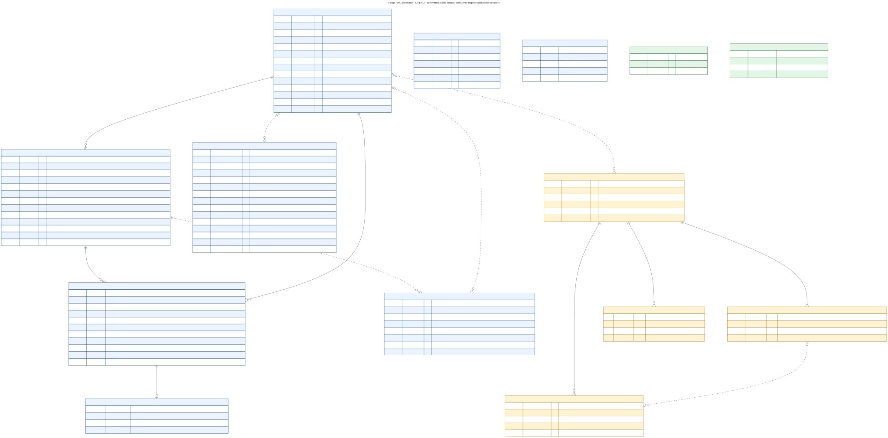

# Forge RAG database: full entity-relationship diagram

[Open SVG](schema.svg) · [PNG](schema.png) · [Mermaid source](schema.mmd) · [PR #2398](https://github.com/JesusFilm/forge/pull/2398)



This diagram covers all 14 repository-defined tables: eight public corpus tables
(blue), four consumer registry tables (amber), and two portal authentication tables
(green). All are committed on `main`. V1 has one runtime environment per consumer;
lifecycle state and source grants live on `consumers`, with no `environments` table.

No live database was inspected. This is committed structure, not deployment evidence.
Unmerged feat-527 credential/lifecycle changes are excluded and require a later refresh.

## Revision and source inventory

Inspected 2026-09-28 at `origin/main` commit
`7bfed3f9fc228bfd5e3353697f91d7e6a05c9464`.
Migrations are authoritative; private schemas deliberately stay outside Prisma.

| Tables                                                                                              | Defining source                                                                                                            |
| --------------------------------------------------------------------------------------------------- | -------------------------------------------------------------------------------------------------------------------------- |
| `sources`, `documents`, `chunks`, `chunk_embeddings`, `http_cache`, `robots_cache`, `raw_documents` | [Initial migration](../../../apps/rag/prisma/migrations/20260827000000_init_rag_schema/migration.sql)                      |
| `language_change_audits`; `documents.updated_at`; `raw_documents.index_attempted_*`                 | [Maintenance migration](../../../apps/rag/prisma/migrations/20260831000000_harden_corpus_maintenance/migration.sql)        |
| `raw_documents` promotion index                                                                     | [Promotion index](../../../apps/rag/prisma/migrations/20260904000000_add_raw_document_promotion_index/migration.sql)       |
| `consumers`, `members`, `usage_daily`, `lifecycle_audit`                                            | [Merged registry migration](../../../apps/rag/prisma/migrations/20260923000000_consumer_registry_foundation/migration.sql) |
| `oauth_states`, `sessions`                                                                          | [Portal migration](../../../apps/rag/prisma/migrations/20260924000000_portal_sessions/migration.sql)                       |

Logical references are inferred from [corpus adapter](../../../apps/rag/src/adapters/postgres/index.ts),
[raw promotion](../../../apps/rag/scripts/lib/raw-document-promotion.ts),
[registry adapter](../../../apps/rag/src/adapters/postgres/consumer-registry.ts) and
[registry contract](../../../apps/rag/src/contracts/consumer-registry.ts).
[Portal storage](../../../apps/rag/src/adapters/postgres/portal-sessions.ts) stores hashes,
not raw session tokens; GitHub IDs and logins refer to external identities.

## Legend

| Diagram element                                  | Meaning                                                                                                     |
| ------------------------------------------------ | ----------------------------------------------------------------------------------------------------------- |
| Row columns                                      | PostgreSQL type · column name · key marker · notes                                                          |
| Key markers `PK`, `FK`, `UK`, `PK,FK`            | Primary key member, foreign key member, unique (single-column UNIQUE), or both PK and FK                    |
| `NN` / `NULL`                                    | `NOT NULL` / nullable                                                                                       |
| `= value`                                        | Column `DEFAULT` as written in SQL                                                                          |
| `UQ name` / `IX name` / `GIN name` / `HNSW name` | Unique index, B-tree index, GIN index, HNSW (pgvector) index, by name; composite indexes list their columns |
| `CK ...`                                         | `CHECK` constraint summary                                                                                  |
| `→ table.column`                                 | Foreign-key target; `ON DELETE` behaviour follows                                                           |
| `GEN`                                            | Generated (computed, stored) column                                                                         |
| `logical → table.column, no FK`                  | A reference the application relies on that the database does **not** enforce                                |
| Solid line                                       | A real `FOREIGN KEY` constraint, read parent (bar end) → child (crow's-foot end)                            |
| Dashed line                                      | A logical reference inferred from application code; not a constraint                                        |
| `\|\|` / `\|o` / `o{` / `\|{`                    | Exactly one / zero or one / zero or more / one or more (crow's-foot notation)                               |

Type names are normalised to lowercase PostgreSQL names. The corpus migration
writes them in uppercase (`UUID`, `TEXT`, `JSONB`, `TIMESTAMPTZ`, `INTEGER`,
`BOOLEAN`, `TSVECTOR`); `timestamptz` is `timestamp with time zone`, `integer` is
`int4`, and `halfvec(1536)` is the pgvector half-precision vector type. Where a
migration does not state `ON UPDATE`, PostgreSQL's default `NO ACTION` applies;
where it does not name a constraint, PostgreSQL assigns a default name (listed
below as inferred).

## Public column inventory

### 1. `public.sources` — existing

Source: init migration `20260827000000`, `CREATE TABLE "sources"`.

| Column             | Type          | Null | Default             | Constraints and indexes                           |
| ------------------ | ------------- | ---- | ------------------- | ------------------------------------------------- |
| `id`               | `uuid`        | no   | `gen_random_uuid()` | PK `sources_pkey`                                 |
| `key`              | `text`        | no   | —                   | unique index `sources_key_uq`                     |
| `name`             | `text`        | no   | —                   | —                                                 |
| `domain`           | `text`        | yes  | —                   | —                                                 |
| `trust`            | `text`        | yes  | —                   | —                                                 |
| `ingestion_mode`   | `text`        | yes  | —                   | —                                                 |
| `languages`        | `jsonb`       | no   | `'[]'::jsonb`       | —                                                 |
| `default_tags`     | `jsonb`       | no   | `'[]'::jsonb`       | —                                                 |
| `default_category` | `text`        | yes  | —                   | —                                                 |
| `rights`           | `text`        | yes  | —                   | —                                                 |
| `content_hash`     | `text`        | yes  | —                   | —                                                 |
| `indexed_at`       | `timestamptz` | yes  | —                   | —                                                 |
| `created_at`       | `timestamptz` | no   | `CURRENT_TIMESTAMP` | —                                                 |
| `updated_at`       | `timestamptz` | no   | `CURRENT_TIMESTAMP` | no trigger maintains it; application code sets it |

### 2. `public.documents` — existing

Source: init migration `20260827000000`, `CREATE TABLE "documents"` and its
`ALTER TABLE ... ADD CONSTRAINT`; `updated_at` from
`20260831000000_harden_corpus_maintenance`.

| Column          | Type          | Null | Default             | Constraints and indexes                                                                                                                                                               |
| --------------- | ------------- | ---- | ------------------- | ------------------------------------------------------------------------------------------------------------------------------------------------------------------------------------- |
| `id`            | `uuid`        | no   | `gen_random_uuid()` | PK `documents_pkey`                                                                                                                                                                   |
| `source_id`     | `uuid`        | no   | —                   | FK `documents_source_id_fkey` → `sources(id)` `ON DELETE CASCADE ON UPDATE NO ACTION`; index `documents_source_idx`; first column of unique index `documents_source_canonical_url_uq` |
| `canonical_url` | `text`        | no   | —                   | second column of unique index `documents_source_canonical_url_uq (source_id, canonical_url)`                                                                                          |
| `url`           | `text`        | yes  | —                   | —                                                                                                                                                                                     |
| `title`         | `text`        | yes  | —                   | —                                                                                                                                                                                     |
| `language`      | `text`        | yes  | —                   | —                                                                                                                                                                                     |
| `category`      | `text`        | yes  | —                   | —                                                                                                                                                                                     |
| `content_hash`  | `text`        | no   | —                   | —                                                                                                                                                                                     |
| `chunk_count`   | `integer`     | no   | `0`                 | —                                                                                                                                                                                     |
| `first_seen`    | `timestamptz` | no   | `CURRENT_TIMESTAMP` | —                                                                                                                                                                                     |
| `last_seen`     | `timestamptz` | no   | `CURRENT_TIMESTAMP` | —                                                                                                                                                                                     |
| `indexed_at`    | `timestamptz` | yes  | —                   | —                                                                                                                                                                                     |
| `updated_at`    | `timestamptz` | no   | `CURRENT_TIMESTAMP` | added 2026-08-31; no trigger maintains it                                                                                                                                             |

### 3. `public.chunks` — existing

Source: init migration `20260827000000`, `CREATE TABLE "chunks"`, its two GIN
indexes and two `ALTER TABLE ... ADD CONSTRAINT` statements.

| Column        | Type          | Null                    | Default             | Constraints and indexes                                                                                                                                                                               |
| ------------- | ------------- | ----------------------- | ------------------- | ----------------------------------------------------------------------------------------------------------------------------------------------------------------------------------------------------- |
| `id`          | `uuid`        | no                      | `gen_random_uuid()` | PK `chunks_pkey`                                                                                                                                                                                      |
| `document_id` | `uuid`        | no                      | —                   | FK `chunks_document_id_fkey` → `documents(id)` `ON DELETE CASCADE ON UPDATE NO ACTION`; index `chunks_document_idx`                                                                                   |
| `source_id`   | `uuid`        | no                      | —                   | FK `chunks_source_id_fkey` → `sources(id)` `ON DELETE CASCADE ON UPDATE NO ACTION`; index `chunks_source_idx`. Independent of `document_id`: nothing checks that it equals the document's `source_id` |
| `ord`         | `integer`     | no                      | —                   | no unique `(document_id, ord)`; `tests/schema.test.mjs` asserts that absence                                                                                                                          |
| `text`        | `text`        | no                      | —                   | input of `search_tsv`                                                                                                                                                                                 |
| `char_start`  | `integer`     | no                      | —                   | —                                                                                                                                                                                                     |
| `char_end`    | `integer`     | no                      | —                   | —                                                                                                                                                                                                     |
| `token_count` | `integer`     | no                      | —                   | —                                                                                                                                                                                                     |
| `tags`        | `jsonb`       | no                      | `'[]'::jsonb`       | GIN index `chunks_tags_gin`                                                                                                                                                                           |
| `created_at`  | `timestamptz` | no                      | `CURRENT_TIMESTAMP` | —                                                                                                                                                                                                     |
| `search_tsv`  | `tsvector`    | not declared (see note) | —                   | `GENERATED ALWAYS AS (to_tsvector('english', "text")) STORED`; GIN index `chunks_search_tsv_gin`                                                                                                      |

Note on `search_tsv`: the SQL declares no `NOT NULL`, so the catalogue reports
the column as nullable and Prisma models it as `Unsupported("tsvector")?`. Its
value is always computed from the non-null `text` column, so in practice it is
never null. Both facts are stated rather than collapsed into one.

### 4. `public.chunk_embeddings` — existing

Source: init migration `20260827000000`, `CREATE TABLE "chunk_embeddings"`,
`CREATE INDEX ... USING hnsw`, and `ALTER TABLE ... ADD CONSTRAINT`. Requires
`CREATE EXTENSION IF NOT EXISTS vector`, which the same migration runs first.

| Column            | Type            | Null | Default             | Constraints and indexes                                                                                                                                                      |
| ----------------- | --------------- | ---- | ------------------- | ---------------------------------------------------------------------------------------------------------------------------------------------------------------------------- |
| `chunk_id`        | `uuid`          | no   | —                   | PK `chunk_embeddings_pkey`; FK `chunk_embeddings_chunk_id_fkey` → `chunks(id)` `ON DELETE CASCADE ON UPDATE NO ACTION`. PK = FK, so each chunk has at most one embedding row |
| `embedding`       | `halfvec(1536)` | no   | —                   | HNSW index `chunk_embeddings_hnsw` with `halfvec_cosine_ops`                                                                                                                 |
| `embedding_model` | `text`          | no   | —                   | index `chunk_embeddings_model_idx`                                                                                                                                           |
| `embedded_at`     | `timestamptz`   | no   | `CURRENT_TIMESTAMP` | —                                                                                                                                                                            |

### 5. `public.http_cache` — existing

Source: init migration `20260827000000`, `CREATE TABLE "http_cache"`.

| Column          | Type          | Null | Default             | Constraints and indexes |
| --------------- | ------------- | ---- | ------------------- | ----------------------- |
| `url`           | `text`        | no   | —                   | PK `http_cache_pkey`    |
| `etag`          | `text`        | yes  | —                   | —                       |
| `last_modified` | `text`        | yes  | —                   | —                       |
| `body_hash`     | `text`        | yes  | —                   | —                       |
| `status_code`   | `integer`     | yes  | —                   | —                       |
| `fetched_at`    | `timestamptz` | no   | `CURRENT_TIMESTAMP` | —                       |
| `updated_at`    | `timestamptz` | no   | `CURRENT_TIMESTAMP` | —                       |

### 6. `public.robots_cache` — existing

Source: init migration `20260827000000`, `CREATE TABLE "robots_cache"`.

| Column        | Type          | Null | Default             | Constraints and indexes |
| ------------- | ------------- | ---- | ------------------- | ----------------------- |
| `robots_url`  | `text`        | no   | —                   | PK `robots_cache_pkey`  |
| `body`        | `text`        | yes  | —                   | —                       |
| `status_code` | `integer`     | yes  | —                   | —                       |
| `fetched_at`  | `timestamptz` | no   | `CURRENT_TIMESTAMP` | —                       |
| `updated_at`  | `timestamptz` | no   | `CURRENT_TIMESTAMP` | —                       |

### 7. `public.raw_documents` — existing

Source: init migration `20260827000000`, `CREATE TABLE "raw_documents"` and
two indexes; `index_attempted_at` and `index_attempted_model` from
`20260831000000_harden_corpus_maintenance`; `raw_documents_promotion_latest_idx`
from `20260904000000_add_raw_document_promotion_index` (created
`CONCURRENTLY IF NOT EXISTS`).

| Column                  | Type          | Null | Default             | Constraints and indexes                                                                                                                         |
| ----------------------- | ------------- | ---- | ------------------- | ----------------------------------------------------------------------------------------------------------------------------------------------- |
| `id`                    | `uuid`        | no   | `gen_random_uuid()` | PK `raw_documents_pkey`; last column of `raw_documents_promotion_latest_idx`                                                                    |
| `source_key`            | `text`        | no   | —                   | index `raw_documents_source_key_idx`; first column of `raw_documents_promotion_latest_idx`; logical reference to `sources.key`, **no FK**       |
| `url`                   | `text`        | no   | —                   | —                                                                                                                                               |
| `canonical_url`         | `text`        | no   | —                   | second column of `raw_documents_promotion_latest_idx`; **no** unique `(source_key, canonical_url)` (asserted absent by `tests/schema.test.mjs`) |
| `title`                 | `text`        | yes  | —                   | —                                                                                                                                               |
| `raw_content`           | `text`        | no   | —                   | —                                                                                                                                               |
| `status`                | `integer`     | yes  | —                   | —                                                                                                                                               |
| `body_hash`             | `text`        | yes  | —                   | —                                                                                                                                               |
| `etag`                  | `text`        | yes  | —                   | —                                                                                                                                               |
| `last_modified`         | `text`        | yes  | —                   | —                                                                                                                                               |
| `fetched_at`            | `timestamptz` | no   | `CURRENT_TIMESTAMP` | third column of `raw_documents_promotion_latest_idx` (`DESC`)                                                                                   |
| `not_modified`          | `boolean`     | no   | `false`             | —                                                                                                                                               |
| `ingested_at`           | `timestamptz` | yes  | —                   | index `raw_documents_ingested_at_idx`                                                                                                           |
| `index_attempted_at`    | `timestamptz` | yes  | —                   | added 2026-08-31                                                                                                                                |
| `index_attempted_model` | `text`        | yes  | —                   | added 2026-08-31                                                                                                                                |

Composite index `raw_documents_promotion_latest_idx` is on
`(source_key, canonical_url, fetched_at DESC, id DESC)`.

### 8. `public.language_change_audits` — existing

Source: `20260831000000_harden_corpus_maintenance`, `CREATE TABLE "language_change_audits"` and two indexes.

| Column           | Type          | Null | Default             | Constraints and indexes                                                                                                         |
| ---------------- | ------------- | ---- | ------------------- | ------------------------------------------------------------------------------------------------------------------------------- |
| `id`             | `uuid`        | no   | `gen_random_uuid()` | PK `language_change_audits_pkey`                                                                                                |
| `run_id`         | `text`        | no   | —                   | index `language_change_audits_run_idx`; first column of unique index `language_change_audits_run_document_uq`                   |
| `document_id`    | `uuid`        | no   | —                   | second column of `language_change_audits_run_document_uq (run_id, document_id)`; logical reference to `documents.id`, **no FK** |
| `source_key`     | `text`        | no   | —                   | logical reference to `sources.key`, **no FK**                                                                                   |
| `old_language`   | `text`        | yes  | —                   | —                                                                                                                               |
| `new_language`   | `text`        | yes  | —                   | —                                                                                                                               |
| `detector_model` | `text`        | yes  | —                   | —                                                                                                                               |
| `created_at`     | `timestamptz` | no   | `CURRENT_TIMESTAMP` | —                                                                                                                               |

## Private schema column inventory

Every private column is NOT NULL; `PK` columns imply NOT NULL. Unnamed constraints use PostgreSQL default names, inferred rather than live-observed.

### `consumer_private.consumers`

| Type          | Column                | Keys | Constraints / defaults / indexes                                        |
| ------------- | --------------------- | ---- | ----------------------------------------------------------------------- |
| `uuid`        | `id`                  | PK   | NN · = gen_random_uuid() · trigger: immutable, row undeletable          |
| `text`        | `name`                | UK   | NN · UNIQUE · CK ~ '^[a-z0-9-]+$' and length 1..80 · trigger: immutable |
| `text`        | `state`               | —    | NN · = 'pending' · CK in (pending, active, suspended, revoked)          |
| `text[]`      | `allowed_source_keys` | —    | NN · = '{}' · CK no NULL elements · logical → sources.key, no FK        |
| `timestamptz` | `created_at`          | —    | NN · = now()                                                            |
| `timestamptz` | `updated_at`          | —    | NN · = now() · no auto-update trigger                                   |

### `consumer_private.members`

| Type          | Column           | Keys   | Constraints / defaults / indexes                                                  |
| ------------- | ---------------- | ------ | --------------------------------------------------------------------------------- |
| `uuid`        | `consumer_id`    | PK, FK | NN · → consumers.id · ON DELETE RESTRICT · trigger: cannot move between consumers |
| `bigint`      | `github_user_id` | PK     | NN · CK > 0 · GitHub account ID, not a local user FK                              |
| `text`        | `role`           | —      | NN · CK in (owner, member) · deferred trigger: at least 1 owner per consumer      |
| `timestamptz` | `created_at`     | —      | NN · = now()                                                                      |

### `consumer_private.usage_daily`

| Type     | Column          | Keys   | Constraints / defaults / indexes                 |
| -------- | --------------- | ------ | ------------------------------------------------ |
| `uuid`   | `consumer_id`   | PK, FK | NN · → consumers.id · ON DELETE RESTRICT         |
| `date`   | `day`           | PK     | NN · UTC day by convention only, not enforced    |
| `text`   | `outcome`       | PK     | NN · CK in (success, client_error, server_error) |
| `bigint` | `request_count` | —      | NN · = 0 · CK >= 0                               |

### `consumer_private.lifecycle_audit`

| Type          | Column                 | Keys | Constraints / defaults / indexes                              |
| ------------- | ---------------------- | ---- | ------------------------------------------------------------- |
| `uuid`        | `id`                   | PK   | NN · = gen_random_uuid()                                      |
| `uuid`        | `consumer_id`          | FK   | NN · → consumers.id · ON DELETE RESTRICT · no index beyond PK |
| `bigint`      | `actor_github_user_id` | —    | NN · CK > 0 · logical → members.github_user_id, no FK         |
| `text`        | `action`               | —    | NN · CK in (created, member_added, member_removed)            |
| `timestamptz` | `occurred_at`          | —    | NN · = now()                                                  |

### `portal_private.oauth_states`

| Type          | Column         | Keys | Constraints / defaults / indexes |
| ------------- | -------------- | ---- | -------------------------------- |
| `text`        | `state_hash`   | PK   | NN · oauth_states_pkey           |
| `text`        | `browser_hash` | —    | NN                               |
| `timestamptz` | `expires_at`   | —    | NN                               |

### `portal_private.sessions`

| Type          | Column           | Keys | Constraints / defaults / indexes           |
| ------------- | ---------------- | ---- | ------------------------------------------ |
| `text`        | `token_hash`     | PK   | NN · sessions_pkey                         |
| `bigint`      | `github_user_id` | —    | NN · CK > 0 · GitHub identity, no local FK |
| `text`        | `github_login`   | —    | NN                                         |
| `timestamptz` | `expires_at`     | —    | NN · IX portal_sessions_expires_idx        |

## Relationships

Seven solid foreign keys; all child columns are NOT NULL. Four corpus FKs use
ON DELETE CASCADE; three registry FKs use ON DELETE RESTRICT. All use PostgreSQL's
ON UPDATE NO ACTION default. The exact child/parent columns and cardinalities are
labelled on the diagram. `chunk_embeddings.chunk_id` is both PK and FK, so a chunk
has zero or one embedding. The registry deferred owner trigger requires one or
more members at commit, including at least one owner; this exceeds the FK alone.

Five dashed logical references are inferred: raw source key, language audit document
and source, consumer allowed source keys, and audit actor GitHub ID. None has a FK.
An actor may cease to be a member. Portal tables have no FK to members: a GitHub
identity can sign in before joining a consumer. No SQL requires `chunks.source_id`
to equal its document's source. Cache URLs and model names have no established
relationship to another table and are not connected.

## Triggers and functions

The corpus and portal migrations define **no** triggers or functions. All of
the following come from the committed registry migration and are `LANGUAGE plpgsql`.

| Trigger                             | Table       | Timing                                                                                        | Function                                     | Effect                                                                                                                     |
| ----------------------------------- | ----------- | --------------------------------------------------------------------------------------------- | -------------------------------------------- | -------------------------------------------------------------------------------------------------------------------------- |
| `guard_consumer_identity`           | `consumers` | `BEFORE UPDATE OR DELETE FOR EACH ROW`                                                        | `consumer_private.guard_consumer_identity()` | Raises on `DELETE`; raises if `NEW.id` or `NEW.name` differs from `OLD`                                                    |
| `lock_membership_parent`            | `members`   | `BEFORE UPDATE OR DELETE FOR EACH ROW`                                                        | `consumer_private.lock_membership_parent()`  | Raises if an `UPDATE` changes `consumer_id`; locks the parent `consumers` row `FOR UPDATE` to serialise membership changes |
| `require_owner_after_create`        | `consumers` | `AFTER INSERT`, constraint trigger, `DEFERRABLE INITIALLY DEFERRED`, `FOR EACH ROW`           | `consumer_private.require_owner()`           | At commit, raises if the consumer exists and has no `members` row with `role = 'owner'`                                    |
| `require_owner_after_member_change` | `members`   | `AFTER UPDATE OR DELETE`, constraint trigger, `DEFERRABLE INITIALLY DEFERRED`, `FOR EACH ROW` | `consumer_private.require_owner()`           | Same check for `OLD.consumer_id`                                                                                           |

These are DML invariants. They do not bind a privileged role that disables
triggers or truncates tables, and SQL permits multiple owners. The registry
adapter only creates the initial owner and lets an owner add or remove
ordinary members; it has no ownership-transfer or owner-removal path.

## Privileges

The committed registry migration runs `REVOKE ALL ON SCHEMA consumer_private FROM PUBLIC`,
`REVOKE ALL ON ALL TABLES/FUNCTIONS IN SCHEMA consumer_private FROM PUBLIC`,
and `ALTER DEFAULT PRIVILEGES IN SCHEMA consumer_private REVOKE ALL ON TABLES/FUNCTIONS FROM PUBLIC`.
It grants nothing to any role. The committed corpus migrations contain no
`GRANT` or `REVOKE`; the read-only reader role is provisioned by scripts, not
migrations (see below).

## Regenerate

From the repository root, using Node and a Chromium binary. Tooling lives
outside the repository, so no application dependency or lockfile changes.

```bash
mkdir -p "$HOME/mermaid-render"
PUPPETEER_SKIP_DOWNLOAD=true npm install --prefix "$HOME/mermaid-render" @mermaid-js/mermaid-cli@11.12.0 prettier@3.8.1
printf '%s\n' '{"executablePath":"/snap/bin/chromium","args":["--no-sandbox"]}' > "$HOME/mermaid-render/puppeteer.json"
MMDC="$HOME/mermaid-render/node_modules/.bin/mmdc"
"$MMDC" -i docs/diagrams/rag-database/schema.mmd -o docs/diagrams/rag-database/schema.svg -p "$HOME/mermaid-render/puppeteer.json" -b white -w 4000
"$MMDC" -i docs/diagrams/rag-database/schema.mmd -o docs/diagrams/rag-database/schema.png -p "$HOME/mermaid-render/puppeteer.json" -b white -w 4000 -s 2
```

Adjust `executablePath` for another machine. A tool directory under `$HOME`
avoids Snap Chromium's private `/tmp`. Use `--no-sandbox` only for this local,
trusted source. Layout is deterministic for a given Mermaid version; the SVG is
zoomable, the PNG is a 2× raster for chat and slides.

Mermaid syntax notes for editors of `schema.mmd`: keep the YAML title quoted
(an unquoted `#` starts a YAML comment), never leave a bare `%%` line (Mermaid's
comment stripper needs text after the marker), and keep `classDef` to
`fill`/`stroke`/`color` (the ER lexer rejects `stroke-width`).

The portal migration revokes PUBLIC schema/table privileges and default table
privileges. It grants nothing; its comment reserves USAGE and SELECT/INSERT/DELETE
for a separate portal role. Private role provisioning and live grants are not
verified by this diagram.

## Validation and limitations

- Mermaid CLI 11.12.0 rendered SVG/PNG; every entity and column was checked in SVG.
- 14 tables, 103 columns, seven FKs and five logical references, checked against all five committed migrations.
- Prettier on Markdown and `git diff --check`.
- `_prisma_migrations` is omitted: Prisma owns its definition outside this repo.
- No live catalogue, production privilege or deployment verification.
- `search_tsv` is computed but not explicitly NOT NULL.
- No repository-defined sequences, views or RLS policies. `vector` is an extension.
- UTC usage day, empty source-grant meaning, state transitions and audit completeness are application conventions, not all enforced in SQL.
- Credentials and lifecycle extensions remain outside this pinned main snapshot.
