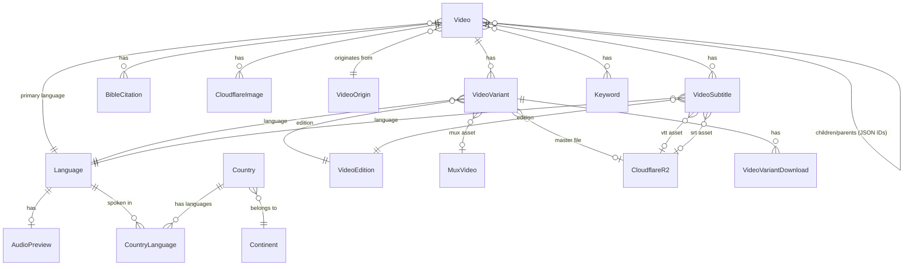

# CMS Gateway Data Sync

## Overview

Build an automated sync pipeline in Strapi v5 that pulls language, country, and video data (with 14+ sub-types) from the JesusFilm API gateway (`https://api-gateway.central.jesusfilm.org/graphql`) into the CMS. The sync runs on a configurable cron schedule and can be triggered manually. It uses Strapi i18n for translations, upsert-by-gateway-ID for idempotency, and soft-delete for removals. The manager app will later consume and enrich this data.

## Problem Statement / Motivation

The Forge CMS currently has a minimal Video content type (title, slug, image) and no language or country data. Apps/web and apps/mobile need rich, localized video metadata served through the Strapi GraphQL API. Manually maintaining this data is unsustainable — the gateway holds thousands of videos with translations in hundreds of languages. An automated sync makes the CMS the local source of truth for all Forge apps. (see origin: `docs/brainstorms/2026-03-19-cms-gateway-sync-requirements.md`)

## Proposed Solution

A Strapi v5 service module (`src/api/gateway-sync/`) with:

1. **GraphQL client** using Node.js native `fetch` (no new dependencies)
2. **Three sync phases** executed sequentially: Languages → Countries → Videos
3. **Cron task** in `config/server.ts` with configurable schedule via `GATEWAY_SYNC_CRON` env var
4. **Custom API endpoint** (`POST /api/gateway-sync/trigger`) for manual triggers
5. **Upsert logic** matching records by a `gatewayId` field (string, unique index)
6. **Soft-delete pass** after each phase completes, with circuit-breaker protection
7. **Source tagging** (`source: "gateway" | "manager"`) to protect manager-enriched records

## Technical Approach

### Architecture

```
config/server.ts (cron enabled)
config/cron-tasks.ts (schedule → calls sync service)
       ↓
src/api/gateway-sync/
  ├── services/gateway-sync.ts    -- orchestrator (runFullSync)
  ├── services/gateway-client.ts  -- fetch wrapper for gateway GraphQL
  ├── services/sync-languages.ts  -- language sync logic
  ├── services/sync-countries.ts  -- country sync logic
  ├── services/sync-videos.ts     -- video sync logic (paginated)
  ├── controllers/gateway-sync.ts -- manual trigger endpoint
  └── routes/gateway-sync.ts      -- POST /api/gateway-sync/trigger
```

All new content types live under `src/api/<type>/content-types/<type>/schema.json`.

### Content Type Architecture

**Decision: Collection types vs. Components** (see origin Q9 from SpecFlow)

| Type                   | Kind            | Rationale                                                            |
| ---------------------- | --------------- | -------------------------------------------------------------------- |
| `Language`             | Collection type | Referenced by many types, queryable independently                    |
| `AudioPreview`         | Component       | Belongs to exactly one Language                                      |
| `Country`              | Collection type | Referenced by CountryLanguage, queryable independently               |
| `Continent`            | Collection type | Own entity, shared across countries (see origin: continent decision) |
| `CountryLanguage`      | Collection type | Junction table with its own fields (speakers, order, etc.)           |
| `Video`                | Collection type | Primary entity, replaces existing Video type                         |
| `VideoVariant`         | Collection type | Referenced by downloads, queryable by language                       |
| `VideoVariantDownload` | Component       | Belongs to exactly one VideoVariant                                  |
| `VideoEdition`         | Collection type | Shared across variants and subtitles                                 |
| `MuxVideo`             | Collection type | Referenced by variants, has its own lifecycle                        |
| `VideoSubtitle`        | Collection type | Queryable by language and edition                                    |
| `BibleCitation`        | Component       | Belongs to exactly one Video                                         |
| `BibleBook`            | Collection type | Shared reference data, i18n translated name                          |
| `Keyword`              | Collection type | Shared across videos, queryable by language                          |
| `VideoOrigin`          | Collection type | Shared reference data                                                |
| `CloudflareR2`         | Collection type | Referenced by variants, subtitles, downloads                         |
| `CloudflareImage`      | Component       | Embedded in Video, not independently queryable                       |

**Common fields on all gateway-sourced collection types:**

- `gatewayId` (string, required, unique) — match key for upserts
- `source` (enumeration: `gateway`, `manager`, default: `gateway`) — ownership tag (see origin: R12)

**i18n-enabled content types** (with `pluginOptions.i18n.localized: true`):

- Language (name field localized)
- Country (name field localized)
- Continent (name field localized)
- BibleBook (name field localized)
- Video (title, description, snippet, studyQuestions, imageAlt localized)

**Non-localized fields** (shared across all locales): gatewayId, slug, label, source, published, locked, noIndex, publishedAt, and all relation fields.

### ERD



### Implementation Phases

#### Phase 1: Content Type Schemas and Infrastructure

Create all new content type schemas and the sync infrastructure without modifying the existing Video type yet.

**Tasks:**

- [x] Create `Language` content type schema (`src/api/language/content-types/language/schema.json`) with: gatewayId (string, unique, required), bcp47 (string), iso3 (string), slug (string), source (enumeration). i18n enabled, `name` field localized.
- [x] Create `AudioPreview` component (`src/components/language/audio-preview.json`) with: value (string/URL), duration (integer), size (integer), bitrate (integer), codec (string)
- [x] Create `Continent` content type schema with: gatewayId, source. i18n enabled, `name` field localized.
- [x] Create `Country` content type schema with: gatewayId, population (integer), latitude (float), longitude (float), flagPngSrc (string), flagWebpSrc (string), languageCount (integer), languageHavingMediaCount (integer), source. i18n enabled, `name` field localized. Relation: continent (manyToOne).
- [x] Create `CountryLanguage` content type with: gatewayId, speakers (integer), displaySpeakers (integer), primary (boolean), suggested (boolean), order (integer), source. Relations: language (manyToOne), country (manyToOne).
- [x] Create `BibleBook` content type with: gatewayId, osisId (string), alternateName (string), paratextAbbreviation (string), isNewTestament (boolean), order (integer), source. i18n enabled, `name` field localized.
- [x] Create `VideoOrigin` content type with: gatewayId, name (string), description (text), source.
- [x] Create `VideoEdition` content type with: gatewayId, name (string), source.
- [x] Create `MuxVideo` content type with: gatewayId, assetId (string), playbackId (string), duration (integer), readyToStream (boolean), downloadable (boolean), primaryLanguageId (string), source.
- [x] Create `CloudflareR2` content type with: gatewayId, contentLength (biginteger), contentType (string), fileName (string), originalFilename (string), publicUrl (string), source.
- [x] Create `Keyword` content type with: gatewayId, value (string), source. Relation: language (manyToOne).
- [x] Create `VideoVariant` content type with: gatewayId, slug (string), duration (integer), lengthInMilliseconds (biginteger), hls (string), dash (string), share (string), downloadable (boolean), published (boolean), version (integer), brightcoveId (string), source. Relations: language, videoEdition, muxVideo, asset (CloudflareR2).
- [x] Create `VideoVariantDownload` component with: quality (enumeration), size (float), height (integer), width (integer), bitrate (integer), url (string), version (integer).
- [x] Create `VideoSubtitle` content type with: gatewayId, primary (boolean), vttSrc (string), srtSrc (string), vttVersion (integer), srtVersion (integer), value (string), edition (string), source. Relations: language, videoEdition, vttAsset (CloudflareR2), srtAsset (CloudflareR2).
- [x] Create `BibleCitation` component with: osisId (string), chapterStart (integer), chapterEnd (integer), verseStart (integer), verseEnd (integer), order (integer). Relation: bibleBook.
- [x] Create `CloudflareImage` component with: aspectRatio (string), url (string), mobileCinematicHigh (string), mobileCinematicLow (string), mobileCinematicVeryLow (string), thumbnail (string), videoStill (string), blurhash (string).
- [x] Enable cron in `config/server.ts`: add `cron: { enabled: true, tasks: cronTasks }` and import from `config/cron-tasks.ts`
- [x] Create `config/cron-tasks.ts` with configurable schedule via `GATEWAY_SYNC_CRON` env var (default: `0 3 * * *` — daily at 3am)

**Success criteria:** All content types registered in Strapi admin, cron fires on schedule.

#### Phase 2: Gateway Client and Language Sync

Build the GraphQL client and the first sync phase (languages), including dynamic i18n locale registration.

**Tasks:**

- [x] Create `src/api/gateway-sync/services/gateway-client.ts` — Apollo Client wrapper for gateway GraphQL (replaced native fetch with Apollo Client + codegen typed documents)
- [x] Create `src/api/gateway-sync/services/sync-languages.ts`:
  1. Fetch all languages from gateway in single request
  2. Register as Strapi i18n locale (uses raw knex bulk insert for performance)
  3. Upsert Language records by gatewayId
  4. Create localized entries for each translation in the name field
  5. Upsert AudioPreview component data on each Language
  6. Soft-delete pass with circuit breaker
- [x] Create `src/api/gateway-sync/services/gateway-sync.ts` — orchestrator with phased execution, selective scope, in-memory lock, and summary logging

**Concurrency guard:**

```typescript
let syncInProgress = false

async function runFullSync(strapi) {
  if (syncInProgress) {
    strapi.log.warn("[gateway-sync] Sync already in progress, skipping")
    return { skipped: true }
  }
  syncInProgress = true
  try {
    // ... sync phases
  } finally {
    syncInProgress = false
  }
}
```

**Success criteria:** Languages appear in Strapi with all locales registered, re-run is idempotent.

#### Phase 3: Country and Continent Sync

**Tasks:**

- [x] Create `src/api/gateway-sync/services/sync-countries.ts`:
  1. Fetch all countries from gateway (single request)
  2. Extract and deduplicate continents → upsert Continent records (with i18n names)
  3. Upsert Country records with continent relation, i18n country names, all scalar fields
  4. Upsert CountryLanguage junction records linking countries to languages
  5. Soft-delete pass for Country, Continent, CountryLanguage (same circuit-breaker pattern)

**Success criteria:** Countries, continents, and country-language associations present and correct.

#### Phase 4: Video Sync (Paginated, Full Depth)

The largest and most complex phase. Process videos page by page to control memory.

**Tasks:**

- [x] Create `src/api/gateway-sync/services/sync-videos.ts`:
  1. First pass — upsert reference types: BibleBook, VideoOrigin, VideoEdition (extracted from video responses)
  2. Paginated video loop (page size configurable via `GATEWAY_SYNC_VIDEO_PAGE_SIZE`, default 100):
     - Upsert Video records with core fields, i18n translations, CloudflareImage components
     - Upsert StudyQuestions, BibleCitations, VideoSubtitles as separate collection type records
     - Link Keywords to videos
     - Store children as JSON gateway ID arrays
     - Progress logging with count/total percentages
  3. Soft-delete pass with circuit breaker
- [x] Create `src/api/gateway-sync/services/sync-video-variants.ts` (split from videos for clarity):
  1. Pre-pass: upsert VideoEdition and MuxVideo dependencies per batch
  2. Paginated variant upsert with VideoVariantDownload components
  3. Uses `clearableRelation()` helper for safe relation clearing
  4. Soft-delete pass

**Children/Parents strategy:** Store as JSON string arrays (`childGatewayIds`, `parentGatewayIds`) on the Video content type. This avoids forward-reference issues during pagination — a video on page 1 can reference a child on page 50 without that child existing yet. Consuming apps resolve references via a second query by gatewayId. (see origin: R3 "stored as references (gateway IDs)")

**Memory management:** Process and flush each page before fetching the next. Do not accumulate all video data in memory. Only the seen-IDs set (strings) grows across pages.

**Manager enrichment protection:** During upsert, skip any record where `source === "manager"`. During soft-delete, skip any record where `source === "manager"`. (see origin: R12)

**Success criteria:** All published videos with full depth data present in CMS, pagination completes fully, re-run is idempotent.

#### Phase 5: Manual Trigger Endpoint

**Tasks:**

- [x] Create `src/api/gateway-sync/controllers/gateway-sync.ts` with `trigger` (202 Accepted, fire-and-forget) and `status` actions
- [x] Create `src/api/gateway-sync/routes/gateway-sync.ts` with `POST /trigger` and `GET /status` (both admin-authenticated)
- [x] Wire cron task in `config/cron-tasks.ts` to call `runFullSync()` on configurable `GATEWAY_SYNC_CRON` schedule

**Success criteria:** Manual trigger via API works, returns immediately, sync runs in background.

#### Phase 6: Migrate Existing Video References

Replace the existing Video content type and update all consumers.

**Tasks:**

- [x] Redesign `src/api/video/content-types/video/schema.json` — replaced with full gateway schema. `slug` changed from `uid` to `string`.
- [ ] Update `src/bootstrap/seed-easter.ts` — currently disabled with TODO comment. Needs rewrite to reference gateway-synced videos by `gatewayId` or tag as `source: "manager"`.
- [ ] Verify component schemas still work — `sections/video.json`, `sections/video-hero.json`, `sections/media-collection-item.json`, `sections/video-carousel-item.json` relations to `api::video.video` need GraphQL field selection updates.
- [ ] Update `packages/graphql/src/watchExperience.ts` — field selections must change for new Video shape (CloudflareImage components instead of Strapi media).
- [ ] Run codegen in `packages/graphql/` after schema changes
- [ ] Update any consuming code in `apps/web/` and `apps/mobile/` that references the old Video shape

**Success criteria:** Existing Easter experience still renders, watchExperience query works with new schema, codegen passes.

## System-Wide Impact

### Interaction Graph

Sync trigger (cron or API) → `gateway-sync.runFullSync()` → sequential calls to `sync-languages`, `sync-countries`, `sync-videos` → each calls `gateway-client` for fetches → each calls `strapi.documents()` for upserts → Strapi fires content-type lifecycle hooks (beforeCreate, afterCreate, etc.) → Strapi auto-rebuilds GraphQL schema if content types change at boot → `packages/graphql` codegen must be re-run after schema changes → `apps/web` and `apps/mobile` queries may need updating.

### Error Propagation

- Gateway fetch errors (network, timeout, 5xx) → caught by gateway-client retry logic → after 3 retries, bubbles up to orchestrator → orchestrator logs error, releases lock, reports partial failure
- Strapi document service errors (validation, unique constraint) → caught per-record in sync service → logged and skipped (don't abort entire sync for one bad record) → summary includes error count
- i18n locale creation errors → caught with fallback to `strapi.db.query()` direct insert → if both fail, log error and continue (record will be created in default locale only)

### State Lifecycle Risks

- **Partial video upsert**: If a video's core record is created but its variants fail, the video exists without variants. Next sync run will fill in the variants. Acceptable per R11.
- **Orphaned sub-types**: If a VideoVariant is created but its parent Video upsert fails, the variant is orphaned. Mitigation: upsert the parent Video first, then sub-types. If parent fails, skip sub-types for that video.
- **Soft-delete during gateway outage**: Circuit breaker prevents mass unpublishing. If gateway returns 0 records but Strapi has >0, skip soft-delete and log error.

### API Surface Parity

- All new content types are automatically exposed via Strapi's GraphQL plugin (configured in `config/plugins.ts`)
- The `packages/graphql` typed client must be regenerated after schema changes
- No REST API consumers exist (per CLAUDE.md: "GraphQL plugin is the primary API")

## Acceptance Criteria

### Functional Requirements

- [x] Languages, countries, and all published videos are present in the CMS after a sync run
- [x] Re-running sync is idempotent: no duplicates, updated records reflect latest gateway data
- [x] Video pagination completes fully (terminates when page returns fewer than limit)
- [x] Translated content is accessible via Strapi's i18n locale API
- [x] Manual sync can be triggered via `POST /api/gateway-sync/trigger` (authenticated)
- [x] Cron schedule is configurable via `GATEWAY_SYNC_CRON` environment variable
- [x] Records with `source: "manager"` are never overwritten or soft-deleted by sync
- [x] Records removed from gateway are soft-deleted (set to draft), not hard-deleted
- [x] Circuit breaker prevents mass unpublishing when gateway returns empty data
- [x] Concurrent sync attempts are rejected (in-memory lock)

### Non-Functional Requirements

- [x] Sync completes within Railway container memory limits (process pages sequentially, don't accumulate)
- [ ] Gateway requests include 30s timeout with 3 retries for transient errors
- [x] Structured logging with `[gateway-sync]` prefix for all sync operations
- [x] Summary log at end of each sync: created/updated/soft-deleted/errored counts per type, total duration

### Quality Gates

- [x] All new content type schemas validate in Strapi admin
- [ ] `packages/graphql` codegen passes after schema changes
- [ ] Easter experience seed still works (seed-easter.ts updated)
- [ ] watchExperience query in `packages/graphql` compiles and returns data

## Dependencies & Prerequisites

- Gateway API at `https://api-gateway.central.jesusfilm.org/graphql` remains publicly accessible (see origin: Dependencies)
- Node.js 22+ for native `fetch` (already in devcontainer)
- Strapi v5.36.0 i18n plugin supports programmatic locale creation via `strapi.plugin('i18n').service('locales').create()` — confirmed by framework research, with fallback to `strapi.db.query('plugin::i18n.locale').create()`
- No new npm dependencies required (native fetch, Strapi built-in services)

## Risk Analysis & Mitigation

| Risk                                                         | Likelihood | Impact                                 | Mitigation                                                          |
| ------------------------------------------------------------ | ---------- | -------------------------------------- | ------------------------------------------------------------------- |
| Gateway returns thousands of languages → Strapi locale bloat | Medium     | Performance degradation in admin panel | Monitor. If needed, add locale filtering in future.                 |
| Offset pagination inconsistency during gateway data changes  | Low        | Missed or duplicated records           | Acceptable per R11; next full sync catches up                       |
| Video sync duration exceeds cron interval                    | Low        | Overlapping syncs                      | In-memory lock prevents concurrent runs                             |
| Gateway outage triggers mass soft-delete                     | Medium     | All videos unpublished                 | Circuit breaker: skip soft-delete if 0 records returned             |
| Easter seeder creates slug conflicts with gateway data       | Medium     | Unique constraint errors               | Rewrite seeder to lookup by gatewayId or tag as `source: "manager"` |

## Sources & References

### Origin

- **Origin document:** [docs/brainstorms/2026-03-19-cms-gateway-sync-requirements.md](docs/brainstorms/2026-03-19-cms-gateway-sync-requirements.md) — Key decisions: upsert by gateway ID, Strapi i18n for translations, replace existing Video type, soft-delete on removal, source tagging for manager enrichment

### Internal References

- Strapi CMS config: `apps/cms/config/plugins.ts` (i18n enabled line 57, GraphQL config)
- Strapi server config: `apps/cms/config/server.ts` (where cron will be added)
- Current Video schema: `apps/cms/src/api/video/content-types/video/schema.json`
- Experience schema (i18n example): `apps/cms/src/api/experience/content-types/experience/schema.json`
- Bootstrap pattern: `apps/cms/src/bootstrap/internal-api-token.ts` (advisory locks, service pattern)
- Easter seeder: `apps/cms/src/bootstrap/seed-easter.ts` (document service usage, needs updating)
- Video component references: `src/components/sections/video.json`, `video-hero.json`, `media-collection-item.json`, `video-carousel-item.json`
- GraphQL typed client: `packages/graphql/src/watchExperience.ts` (needs updating)

### External References

- [Strapi v5 Cron Jobs](https://docs.strapi.io/cms/configurations/cron)
- [Strapi v5 Document Service API](https://docs.strapi.io/cms/api/document-service)
- [Strapi v5 i18n Plugin](https://docs.strapi.io/cms/features/internationalization)
- [Strapi v5 Custom Routes](https://docs.strapi.io/cms/backend-customization/routes)
- [Strapi i18n locale service source](https://github.com/strapi/strapi/blob/main/packages/plugins/i18n/server/src/services/locales.ts)

### Institutional Learnings

- Strapi v5 `contentAPI.sanitize.query()` silently strips `populate` params without role permissions — use API token for server-side calls (see `docs/solutions/cms/strapi-v5-populate-role-sanitization.md`)
- Use shared client modules for any SDK instantiated in multiple services (see `docs/solutions/platform/videoforge-manager-integration.md`)
