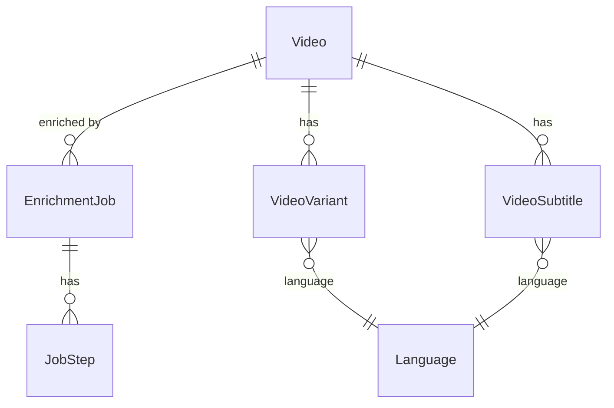

# feat: Wire apps/manager to consume Strapi CMS data exclusively

## Overview

The CMS gateway sync (Phases 1-5 complete) populates Strapi with all language, country, continent, and video data from the JFP Gateway. However, `apps/manager` doesn't use any of it — the LanguageGeoSelector fetches from a non-existent endpoint, the coverage page derives data from ephemeral file-based job records, and language labels on the jobs page are empty. Additionally, enrichment jobs are stored in a file (`.data/jobs.json`) that's lost on every Railway deploy.

This work:

1. Models enrichment jobs as a Strapi content type (durable storage)
2. Wires the coverage page to load videos from Strapi dynamically
3. Passes geo data (languages/countries/continents) as server-side props
4. Populates language labels on job pages from CMS

## Problem Statement / Motivation

1. **Enrichment jobs are ephemeral** — file-based state lost on every deploy/restart (production blocker, todo #029).
2. **Coverage page is non-functional** — no real video data, groups fake "collections" from jobs by status instead of showing actual CMS video catalog with per-language coverage.
3. **LanguageGeoSelector broken** — fetches geo data client-side from a route that doesn't exist.
4. **Language labels empty** — jobs page shows raw IDs instead of names.

## Proposed Solution

### New CMS content types

Model enrichment jobs as a Strapi content type so they're durable and queryable via GraphQL alongside videos.

### Server-side data flow

Page server components query Strapi's existing GraphQL API and pass data as props to client components. No new Next.js API routes for geo data.

### Dynamic video loading

The coverage page queries Strapi for videos filtered by selected language(s), loading variants and subtitles to determine per-language coverage status.

## Technical Approach

### New Content Types in `apps/cms`

#### `EnrichmentJob` (collection type)

```
apps/cms/src/api/enrichment-job/content-types/enrichment-job/schema.json
```

| Field           | Type                                             | Notes                              |
| --------------- | ------------------------------------------------ | ---------------------------------- |
| `video`         | relation (manyToOne → Video)                     | The video being enriched           |
| `muxAssetId`    | string, required                                 | Mux asset ID                       |
| `muxPlaybackId` | string                                           | Mux playback ID                    |
| `languages`     | JSON                                             | Array of target language codes     |
| `status`        | enumeration: pending, running, completed, failed | Job lifecycle                      |
| `currentStep`   | string                                           | Currently executing step name      |
| `retries`       | integer, default 0                               | Retry count                        |
| `startedAt`     | datetime                                         | When processing began              |
| `completedAt`   | datetime                                         | When processing finished           |
| `artifacts`     | JSON                                             | Map of artifact type → storage URL |
| `errors`        | JSON                                             | Array of `{ step, message, at }`   |
| `steps`         | repeatable component (enrichment.job-step)       | Step-level tracking                |

No i18n. No `source` field — these are always manager-created.

#### `enrichment.job-step` (component)

```
apps/cms/src/components/enrichment/job-step.json
```

| Field        | Type                                                                    | Notes                   |
| ------------ | ----------------------------------------------------------------------- | ----------------------- |
| `name`       | enumeration: transcription, translation, chapters, metadata, embeddings | Step identifier         |
| `status`     | enumeration: pending, running, completed, failed, skipped               | Step lifecycle          |
| `retries`    | integer, default 0                                                      |                         |
| `startedAt`  | datetime                                                                |                         |
| `finishedAt` | datetime                                                                |                         |
| `error`      | text                                                                    | Error message if failed |

#### ERD



### Architecture

```
Server Components (RSC)                          Client Components
─────────────────────                            ─────────────────
coverage/page.tsx                          ───►  CoverageReportClient
  ↳ queries Strapi for geo data (props)           ↳ LanguageGeoSelector (receives geoData prop)
  ↳ queries Strapi for videos + variants          ↳ video grid (coverage by language)
    filtered by selected language(s)              ↳ enrichment job status overlay

jobs/page.tsx                              ───►  LiveJobsTable
  ↳ queries Strapi for enrichment jobs            (receives typed job data)
  ↳ queries Strapi for language labels

jobs/[id]/page.tsx                         ───►  LiveJobDetailHeader
  ↳ queries single enrichment job from Strapi
```

### Implementation Phases

#### Phase 1: CMS Content Types

Create the `EnrichmentJob` content type and `enrichment.job-step` component in `apps/cms`.

**Files to create:**

- [ ] `apps/cms/src/api/enrichment-job/content-types/enrichment-job/schema.json`
- [ ] `apps/cms/src/components/enrichment/job-step.json`

**Then:**

- [ ] Run Strapi locally to register the types
- [ ] Run codegen in `packages/graphql/` to regenerate introspection types
- [ ] Commit generated files alongside schema changes

#### Phase 2: Replace File-Based Job State

Replace `apps/manager/src/lib/state.ts` (file-based) with Strapi GraphQL mutations.

**Files to modify:**

- [ ] `apps/manager/src/lib/state.ts` — rewrite `createJob`, `getJob`, `listJobs`, `updateJob`, `updateStepStatus` to use Apollo Client + Strapi GraphQL mutations instead of file I/O
- [ ] `apps/manager/src/app/api/jobs/route.ts` — update to use new state functions (interface stays the same)
- [ ] `apps/manager/src/app/api/jobs/[id]/route.ts` — same
- [ ] `apps/manager/src/workflows/videoEnrichment.ts` — same (calls `updateJob`/`updateStepStatus`)

The `JobRecord` TypeScript type can stay as-is — it maps cleanly to the Strapi content type. The state module's public API doesn't change, only the backing store.

#### Phase 3: Geo Data as Server-Side Props

Fetch language/country/continent data server-side and pass as props. No new API routes.

**Files to modify:**

- [ ] `apps/manager/src/app/dashboard/coverage/page.tsx` — query Strapi for continents, countries, languages, countryLanguages; assemble `GeoPayload`; pass as prop to `CoverageReportClient`
- [ ] `apps/manager/src/features/coverage/coverage-report-client.tsx` — accept + forward `geoData` prop
- [ ] `apps/manager/src/features/coverage/LanguageGeoSelector.tsx` — accept `initialGeoData` prop; skip client-side fetch when provided
- [ ] `apps/manager/src/app/dashboard/jobs/page.tsx` — query language labels from Strapi, pass as `languageLabelsById`
- [ ] `apps/manager/src/app/dashboard/jobs/[id]/page.tsx` — same

#### Phase 4: Coverage Page — Dynamic Video Loading

Replace job-based "collections" with real CMS video data.

**Files to modify:**

- [ ] `apps/manager/src/app/dashboard/coverage/page.tsx` — query Videos with their variants and subtitles, filtered by selected language(s). Group by `label` (collection, episode, series, etc.) or parent/child hierarchy (`childGatewayIds`). Determine per-video coverage: does a variant exist for the selected language? Subtitles? Pass to `CoverageReportClient`.
- [ ] `apps/manager/src/features/coverage/coverage-report-client.tsx` — update `ClientVideo` type and `groupJobsIntoCollections` to work with CMS video data instead of `JobRecord`. Coverage status derived from variant/subtitle existence per language rather than enrichment step completion. Overlay enrichment job status where available.

**Coverage status logic:**

For a given video + selected language:

- **Subtitles report**: `human` if VideoSubtitle exists, `ai` if EnrichmentJob completed transcription/translation, `none` otherwise
- **Audio report**: `human` if VideoVariant exists with hls/dash URLs, `ai` if EnrichmentJob completed voiceover, `none` otherwise
- **Meta report**: `human` if Video has description + keywords, `ai` if EnrichmentJob completed metadata/chapters, `none` otherwise

#### Phase 5: Cleanup

- [ ] `apps/manager/src/cms/client.ts` — remove TODO comment
- [ ] Fix CLAUDE.md conventions about GraphQL operations location
- [ ] Delete `.data/` directory handling from state.ts (no longer needed)
- [ ] Update `apps/manager/CLAUDE.md` to reflect that jobs are now stored in Strapi

## Files Summary

| Action     | File                                                                       | Purpose                              |
| ---------- | -------------------------------------------------------------------------- | ------------------------------------ |
| Create     | `apps/cms/src/api/enrichment-job/content-types/enrichment-job/schema.json` | EnrichmentJob content type           |
| Create     | `apps/cms/src/components/enrichment/job-step.json`                         | Job step component                   |
| Regenerate | `packages/graphql/src/graphql-env.d.ts`                                    | Updated introspection types          |
| Modify     | `apps/manager/src/lib/state.ts`                                            | Replace file I/O with Strapi GraphQL |
| Modify     | `apps/manager/src/app/api/jobs/route.ts`                                   | Use Strapi-backed state              |
| Modify     | `apps/manager/src/app/api/jobs/[id]/route.ts`                              | Use Strapi-backed state              |
| Modify     | `apps/manager/src/workflows/videoEnrichment.ts`                            | Use Strapi-backed state              |
| Modify     | `apps/manager/src/app/dashboard/coverage/page.tsx`                         | Server-side geo + video queries      |
| Modify     | `apps/manager/src/features/coverage/coverage-report-client.tsx`            | Accept geoData prop, CMS video data  |
| Modify     | `apps/manager/src/features/coverage/LanguageGeoSelector.tsx`               | Accept initialGeoData prop           |
| Modify     | `apps/manager/src/app/dashboard/jobs/page.tsx`                             | Query jobs + labels from Strapi      |
| Modify     | `apps/manager/src/app/dashboard/jobs/[id]/page.tsx`                        | Query single job from Strapi         |
| Modify     | `apps/manager/src/cms/client.ts`                                           | Remove TODO                          |
| Modify     | `CLAUDE.md`                                                                | Fix GraphQL operations convention    |
| Modify     | `packages/graphql/CLAUDE.md`                                               | Fix operations location convention   |
| Modify     | `apps/manager/CLAUDE.md`                                                   | Document Strapi-backed job storage   |

## Acceptance Criteria

### Functional Requirements

- [ ] EnrichmentJob content type registered in Strapi admin
- [ ] Creating an enrichment job persists to Strapi (survives deploys)
- [ ] Jobs page lists enrichment jobs from Strapi GraphQL
- [ ] Job detail page loads single job from Strapi
- [ ] Coverage page loads real videos from Strapi, grouped into collections
- [ ] Coverage shows per-language status (subtitles, audio, metadata) based on variant/subtitle existence
- [ ] LanguageGeoSelector renders continent/country sidebar from server-side CMS data
- [ ] Language labels display on jobs pages (e.g., "Spanish" not raw IDs)
- [ ] All pages degrade gracefully if CMS is temporarily unavailable

### Quality Gates

- [ ] `pnpm --filter @forge/manager typecheck` passes
- [ ] `pnpm --filter @forge/manager lint` passes
- [ ] `packages/graphql` codegen passes after schema changes
- [ ] Enrichment workflow runs end-to-end with Strapi-backed job state

## Dependencies & Prerequisites

- Strapi CMS running with gateway-synced data
- Records are published (confirmed: gateway sync uses `status: "published"`)
- `STRAPI_URL` and `STRAPI_API_TOKEN` env vars configured
- API token must have create/update/read permissions on `EnrichmentJob`

## Risk Analysis & Mitigation

| Risk                                                                | Likelihood | Impact                     | Mitigation                                                        |
| ------------------------------------------------------------------- | ---------- | -------------------------- | ----------------------------------------------------------------- |
| Strapi GraphQL mutations slower than file I/O for job updates       | Medium     | Workflow steps take longer | Acceptable — durability outweighs speed. Batch updates if needed. |
| Thousands of CountryLanguage records require many paginated fetches | Medium     | Slow coverage page load    | Pagination loops with `pageSize: 100`                             |
| Strapi pagination cap silently truncates results                    | High       | Missing data               | Use `_connection` queries with `pageInfo` + pagination loop       |
| Video query for coverage returns too many results                   | Medium     | Memory/timeout             | Paginate, filter by label (collections first), lazy-load          |
| CMS unavailable during workflow step update                         | Low        | Job state lost             | Retry with backoff; log warning                                   |

## Sources & References

### Internal References

- Apollo Client pattern: `apps/web/src/lib/client.ts`
- Query + cache pattern: `apps/web/src/lib/content.ts:180`
- Manager CMS client: `apps/manager/src/cms/client.ts`
- GeoPayload contract: `apps/manager/src/features/coverage/LanguageGeoSelector.tsx:33-37`
- Current job types: `apps/manager/src/types/job.ts`
- Current file state: `apps/manager/src/lib/state.ts`
- Video schema: `apps/cms/src/api/video/content-types/video/schema.json`
- Component pattern: `apps/cms/src/components/video/variant-download.json`

### Institutional Learnings

- Apollo `fetchPolicy: "no-cache"` — bypass Apollo cache for server-side freshness (`docs/solutions/web/nextjs16-cachecomponents-isr.md`)
- Lazy getter for Apollo Client — module-scope instantiation crashes CI (`docs/solutions/platform/new-app-ci-and-deployment-patterns.md`)
- Strapi v5 content API returns only published records by default (`docs/solutions/cms/strapi-v5-populate-role-sanitization.md`)
- API token must have permission to populate relations (`docs/solutions/cms/strapi-v5-populate-role-sanitization.md`)
- Use `{ set: [] }` to clear Strapi v5 relations, never `null` (`docs/solutions/integration-issues/strapi-v5-manytone-relation-clearing.md`)
