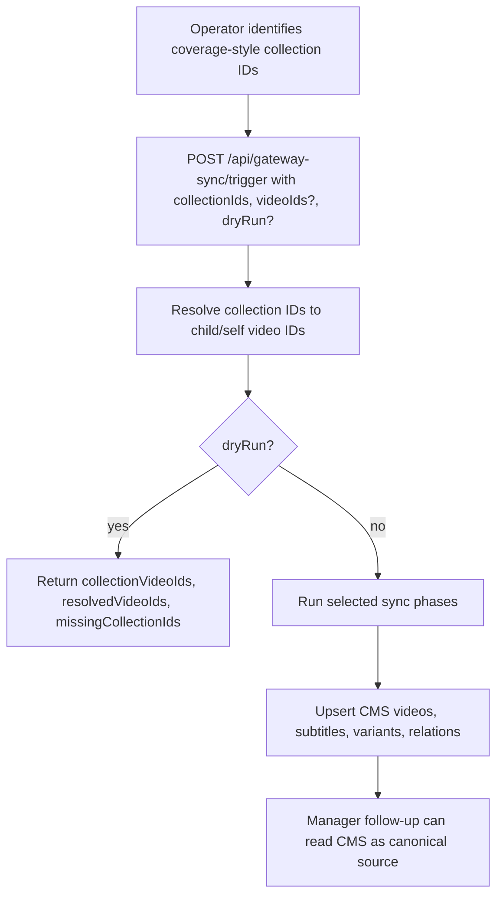

# Staging CMS Collection Seed Import

## Overview

Extend the existing Strapi `gateway-sync` pipeline so staging and local environments can seed a limited, operator-selected slice of gateway media data into CMS. The operator supplies coverage-style collection IDs and/or explicit video IDs, and the sync resolves them into the concrete video graph automatically before importing only that subset.

This keeps `apps/cms` as the canonical source of content while avoiding a full gateway import just to unblock `apps/manager` development.

## Problem Statement / Motivation

The current gateway sync in `apps/cms` is optimized for full synchronization:

- `POST /gateway-sync/trigger` accepts only `scope`
- `sync-videos.ts` paginates across all published videos
- `sync-video-variants.ts` paginates across all variants
- soft-delete passes assume a full authoritative crawl

That does not match the current staging need:

- CMS is still effectively empty for manager development
- asking an operator to manually discover every child video ID is too expensive
- manager coverage semantics are based on top-level labeled videos plus `children`, not on a separate collection content type
- limited seed imports must be additive and safe, not globally destructive

The old VideoForge coverage flow already established the grouping model: a “collection” is the top-level video row returned by the gateway coverage query, and the actual selectable media are the child video IDs, or the top-level video itself when no children exist.

## Proposed Solution

Extend the existing admin-authenticated gateway sync trigger to accept optional selection inputs:

- `collectionIds?: string[]`
- `videoIds?: string[]`
- `dryRun?: boolean`

Behavior is inferred, not declared:

- if both `collectionIds` and `videoIds` are empty, run the existing full sync behavior
- if either list has values, run a limited seed import

In limited runs:

1. Resolve each supplied collection ID into an array of video IDs
2. Union that result with any explicit `videoIds`
3. Dedupe into the final selected video set
4. Import only that selected video graph into Strapi
5. Skip global soft-delete behavior

The reusable core is a collection-to-video transformer function in the CMS gateway-sync layer. The trigger becomes the staging-friendly entry point, but the resolution logic remains reusable for later CLI or admin UI affordances.

## Technical Approach

### Collection semantics

This plan treats **collection IDs as coverage-style collection IDs**, which in practice are the gateway IDs of top-level labeled videos. They are **not** `JourneyCollection.id` values from the separate journeys graph.

Resolution rule:

- if the selected top-level video has one or more `children`, the collection expands to those child video IDs
- if the selected top-level video has no `children`, the collection expands to its own ID

### Public interface changes

#### `apps/cms/src/api/gateway-sync/controllers/gateway-sync.ts`

Extend the trigger body from:

```ts
// apps/cms/src/api/gateway-sync/controllers/gateway-sync.ts
type TriggerBody = {
  scope?: string | string[]
}
```

to:

```ts
// apps/cms/src/api/gateway-sync/controllers/gateway-sync.ts
type TriggerBody = {
  scope?: string | string[]
  collectionIds?: string[]
  videoIds?: string[]
  dryRun?: boolean
}
```

Example request:

```json
{
  "scope": ["languages", "countries", "keywords", "videos", "video-variants"],
  "collectionIds": ["top-level-video-a", "top-level-video-b"],
  "videoIds": ["standalone-video-c"],
  "dryRun": true
}
```

Example dry-run response:

```json
{
  "message": "Gateway sync dry run complete",
  "isFullSync": false,
  "requestedCollectionIds": ["top-level-video-a", "top-level-video-b"],
  "requestedVideoIds": ["standalone-video-c"],
  "collectionVideoIds": {
    "top-level-video-a": ["child-1", "child-2"],
    "top-level-video-b": ["top-level-video-b"]
  },
  "resolvedVideoIds": ["child-1", "child-2", "top-level-video-b", "standalone-video-c"],
  "missingCollectionIds": [],
  "phases": ["languages", "countries", "keywords", "videos", "video-variants"]
}
```

### New internal selection contract

Add a shared selection context inside the gateway-sync service layer:

```ts
// apps/cms/src/api/gateway-sync/services/gateway-sync.ts
type SyncSelection = {
  collectionIds: string[]
  videoIds: string[]
  resolvedVideoIds: string[]
  collectionVideoIds: Record<string, string[]>
  missingCollectionIds: string[]
  isFullSync: boolean
  dryRun: boolean
}
```

This object is passed to the video-related phases. Languages, countries, and keywords can ignore it.

### New collection-to-video transformer

Add a reusable resolver in the gateway-sync service layer:

```ts
// apps/cms/src/api/gateway-sync/services/resolve-collection-video-ids.ts
export type ResolveCollectionVideoIdsInput = {
  collectionIds: string[]
}

export type ResolveCollectionVideoIdsResult = {
  collectionVideoIds: Record<string, string[]>
  resolvedVideoIds: string[]
  missingCollectionIds: string[]
}
```

Implementation details:

- query gateway `videos(where: { ids: [...] })`
- request:
  - `id`
  - `label`
  - `children { id }`
- only coverage-style top-level IDs are expected
- map each returned row to:
  - `children[].id` when children exist
  - `[row.id]` when no children exist
- compute `missingCollectionIds` from requested IDs not returned by the gateway
- flatten and dedupe into `resolvedVideoIds`

Recommended GraphQL document:

```graphql
# apps/cms/src/api/gateway-sync/services/resolve-collection-video-ids.ts
query ResolveCollectionVideoIds($ids: [ID!]!) {
  videos(where: { ids: $ids, published: true }, limit: 2000) {
    id
    label
    children {
      id
    }
  }
}
```

### Limited sync execution model

#### Full sync

Preserve the current behavior:

- `sync-videos.ts` paginates all published videos
- `sync-video-variants.ts` paginates all variants
- soft-delete passes remain enabled

#### Limited sync

Infer limited mode from `resolvedVideoIds.length > 0`.

In limited mode:

- `sync-videos.ts` must fetch only selected videos from the gateway, not all published videos
- `sync-video-variants.ts` must sync only variants belonging to the selected videos
- global `softDeleteUnseen()` passes must be skipped

Because the generated gateway schema supports `videos(where: { ids: [...] })` and nested `variants`, but does **not** expose a `videoVariants` query filtered by video IDs, the limited implementation should avoid a global variant crawl.

Instead:

1. Add a dedicated selected-videos query in `sync-videos.ts` that fetches:
   - all current video fields needed by the video sync
   - nested `variants` with the fields currently used by `sync-video-variants.ts`
2. Reuse a shared helper to upsert variants from an in-memory batch derived from the selected video rows
3. Keep the existing paginated `videoVariants` path only for full syncs

This yields efficient limited imports without changing the full-sync strategy.

### Phase-level behavior

#### Languages

- continue current full sync behavior in both full and limited runs
- no special selection logic
- keep current locale registration behavior

#### Countries

- continue current full sync behavior in both full and limited runs
- no selection logic

#### Keywords

- continue current full sync behavior in both full and limited runs
- keeps manager metadata and coverage displays usable without partial keyword gaps

#### Videos

- full run: existing paginated `published: true` crawl
- limited run: selected-video query using resolved ID list
- preserve existing upsert-by-gateway-ID behavior
- preserve `Video.label`, `childGatewayIds`, subtitles, bible citations, study questions, images, origins, and keyword relations

#### Video variants

- full run: existing paginated `videoVariants` crawl
- limited run: flatten nested `video.variants` from the selected-video query
- preserve edition and mux-video pre-pass behavior
- keep using the current Strapi relation-clearing pattern via `clearableRelation()`

### Destructive-safety rules

Limited imports are always additive and non-destructive.

That means:

- no `softDeleteUnseen()` during limited runs
- no cleanup based on “not seen in this run”
- existing `source: "manager"` protection remains unchanged
- rerunning the same limited seed import must remain idempotent

### Environment and rollout guard

This workflow is primarily for staging and local environments. Add an env guard such as:

- `GATEWAY_SYNC_ENABLE_LIMITED_IMPORT=true`

Behavior:

- full sync remains available everywhere
- limited seed import request bodies are rejected unless the env guard is enabled

This prevents accidental production use while keeping staging simple.

### Operator flow



## Implementation Phases

### Phase 1: Trigger and selection plumbing

- [ ] Extend `gateway-sync.trigger` request body to accept `collectionIds`, `videoIds`, and `dryRun`
- [ ] Add a `SyncSelection` contract in `services/gateway-sync.ts`
- [ ] Infer `isFullSync` from empty vs non-empty selection lists
- [ ] Reject limited imports when the staging/local env guard is disabled
- [ ] Preserve current background execution for non-dry-run imports

### Phase 2: Collection transformer

- [ ] Create `services/resolve-collection-video-ids.ts`
- [ ] Add typed GraphQL query for top-level video lookup by ID
- [ ] Map returned rows to `collectionVideoIds`
- [ ] Return `resolvedVideoIds` and `missingCollectionIds`
- [ ] Unit test child-expansion, self-expansion, dedupe, and missing-ID behavior

### Phase 3: Limited video sync

- [ ] Add selected-video query path to `sync-videos.ts`
- [ ] Share video upsert logic across full and limited runs
- [ ] Flatten nested variants from selected videos into a reusable batch shape
- [ ] Extract shared variant upsert helper from `sync-video-variants.ts`
- [ ] Skip `softDeleteUnseen()` when running limited imports

### Phase 4: Dry run and observability

- [ ] Add dry-run controller response with resolved IDs and missing IDs
- [ ] Include `isFullSync` and selected phase list in the response
- [ ] Log when a run is full vs limited
- [ ] Log collection resolution mismatches and missing collection IDs clearly

### Phase 5: Validation against manager needs

- [ ] Verify imported videos preserve `label` + `children` semantics expected by the legacy coverage model
- [ ] Verify imported variants retain Mux asset mappings needed for selection/submission flows
- [ ] Document that this plan seeds CMS only; the manager-side `/dashboard/coverage` data-source rewrite remains a separate implementation step

## Acceptance Criteria

- [ ] Admin trigger accepts `collectionIds`, `videoIds`, and `dryRun`
- [ ] Empty selection inputs still run the existing full sync behavior
- [ ] Supplying coverage-style collection IDs resolves to concrete child/self video IDs automatically
- [ ] Supplying both collection IDs and explicit video IDs produces a deduped union
- [ ] Dry run returns the resolved mapping without writing CMS data
- [ ] Limited imports do not soft-delete unrelated CMS content
- [ ] Re-running the same limited import is idempotent
- [ ] Selected videos import with the same gateway-backed fields used by manager coverage: labels, child IDs, subtitles, variants, images, keywords, study questions, and bible citations
- [ ] Limited import can be enabled on staging without changing full-sync behavior elsewhere

## Success Metrics

- A staging operator can seed a small CMS dataset from a handful of collection IDs without manually sourcing every video ID
- A dry run makes it obvious which requested collections mapped successfully and which did not
- The limited import path does not perform a full gateway crawl for videos or variants
- Seeded CMS content matches the legacy coverage grouping model closely enough for manager follow-up work

## Dependencies & Risks

### Dependencies

- Existing `apps/cms/src/api/gateway-sync/` service structure
- Gateway `videos(where: { ids: [...] })` support
- Nested `Video.children` and `Video.variants` availability in the gateway schema
- Admin-authenticated `POST /gateway-sync/trigger`

### Risks

- **Wrong collection ID type**: if operators supply `JourneyCollection.id` values instead of coverage-style top-level video IDs, resolution will fail. The trigger contract and docs must state the expected ID type clearly.
- **Gateway payload drift**: if the selected-video query omits fields currently relied on by the full sync helpers, limited imports will produce incomplete CMS records.
- **Relation clearing regressions**: variant and subtitle upserts must keep the existing Strapi v5 `{ set: [] }` semantics via `clearableRelation()` when source relations are missing.
- **Large operator selection**: a very large `collectionIds` list could behave like a near-full import. Request validation should cap total IDs per run.

## References & Research

### Internal References

- `docs/brainstorms/2026-03-19-cms-gateway-sync-requirements.md`
- `docs/plans/2026-03-19-001-feat-cms-gateway-data-sync-plan.md`
- `apps/cms/src/api/gateway-sync/services/gateway-sync.ts`
- `apps/cms/src/api/gateway-sync/controllers/gateway-sync.ts`
- `apps/cms/src/api/gateway-sync/services/sync-videos.ts`
- `apps/cms/src/api/gateway-sync/services/sync-video-variants.ts`
- `apps/manager/src/app/dashboard/coverage/page.tsx`

### Relevant Learnings

- `docs/solutions/integration-issues/strapi-v5-manytone-relation-clearing.md`
  - keep using `{ set: [] }` via `clearableRelation()` for missing Strapi many-to-one relations
- `docs/solutions/platform/restoring-upstream-ui-verbatim.md`
  - preserve legacy coverage semantics instead of inventing a new grouping model during migration
- `apps/manager/CLAUDE.md`
  - current coverage is still blocked on replacing file-based job-state assumptions with a durable CMS-backed source

## Out of Scope

- Rewriting `apps/manager` coverage page in this work item
- Importing journeys or `JourneyCollection` records
- Real-time sync, webhook sync, or bidirectional updates back to the gateway
- Building a Strapi admin UI button beyond the existing admin-authenticated trigger endpoint
