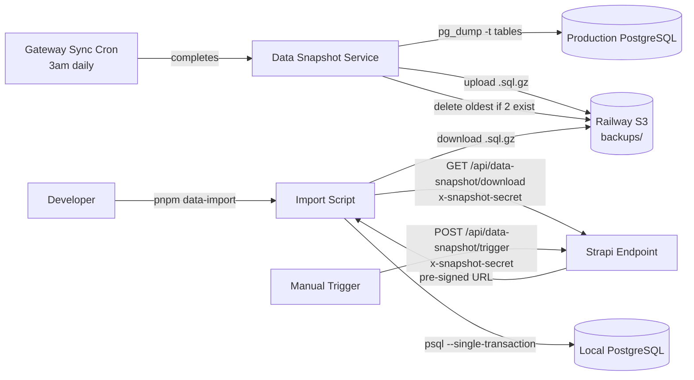

# feat: CMS dev data snapshot via Strapi-owned export

## Overview

Gateway-sync takes 4+ hours. Developers need the result, not to re-run it. This feature makes Strapi produce a compressed pg_dump of video/language/country content after each sync, upload it to Railway S3, and expose a secret-protected endpoint so developers can pull and restore it locally in minutes.

Replaces the rejected GitHub Actions approach on branch `feat/cms-database-export-import` (see origin: `docs/brainstorms/2026-03-24-cms-dev-data-snapshot-requirements.md`).

## Problem Statement / Motivation

Every developer who sets up or resets their local CMS environment must either:

- Run gateway-sync for 4+ hours, or
- Get a database dump from someone manually

The earlier GitHub Actions proposal required production DB credentials in GitHub Secrets and duplicated S3 credentials across systems. Strapi already has both — it should own this process.

## Proposed Solution

A new Strapi API (`api::data-snapshot`) following the gateway-sync pattern:

1. **Export service** — runs `pg_dump` on an allowlist of content tables, compresses, uploads to S3, deletes previous snapshot
2. **Cron integration** — chains after gateway-sync completion (not time-based offset)
3. **API endpoints** — trigger export manually + get pre-signed download URL, both protected by a Doppler-managed shared secret
4. **Import script** — local CLI tool (`pnpm data-import`) that downloads and restores into dev PostgreSQL

## Technical Considerations

### pg_dump availability

The CMS Dockerfile uses `node:24-bookworm-slim` which does **not** include PostgreSQL client tools. Must add:

```dockerfile
RUN apt-get update && apt-get install -y --no-install-recommends postgresql-client && rm -rf /var/lib/apt/lists/*
```

### Railway S3 specifics

Per documented learnings (`docs/solutions/platform/optional-railway-s3-local-fallback.md`):

- Use `forcePathStyle: true`
- Lazy-import `@aws-sdk/client-s3` with singleton pattern
- Use `Boolean(env.RAILWAY_S3_BUCKET)` as the S3 toggle
- `@aws-sdk/s3-request-presigner` for pre-signed URLs

### Table allowlist (pg_dump `-t` flags)

These are the content tables derived from the gateway-sync scope (collection names from `schema.json` files):

**Video-related (12):**
| Table | Content Type |
|---|---|
| `videos` | Video |
| `video_variants` | VideoVariant |
| `video_subtitles` | VideoSubtitle |
| `video_study_questions` | VideoStudyQuestion |
| `video_editions` | VideoEdition |
| `video_origins` | VideoOrigin |
| `keywords` | Keyword |
| `bible_citations` | BibleCitation |
| `bible_books` | BibleBook |
| `mux_videos` | MuxVideo |
| `cloudflare_r2s` | CloudflareR2 |
| `videos_keywords_lnk` | M2M join table (auto-generated) |

**Language-related (2):**
| Table | Content Type |
|---|---|
| `languages` | Language |
| `i18n_locale` | Strapi i18n Locale (created by sync-languages when registering locales) |

**Country-related (3):**
| Table | Content Type |
|---|---|
| `countries` | Country |
| `country_languages` | CountryLanguage |
| `continents` | Continent |

**Strapi internal tables to include:**

- `*_lnk` join tables for any relations between the above content types (Strapi v5 generates these automatically). The exact names need to be verified against a running instance. pg_dump supports wildcards in `-t` patterns.

**Total: ~17 content tables + join tables.**

> **Note:** The `audio_previews` component table may also be needed (referenced by languages). Verify at implementation time by inspecting the live PostgreSQL schema.

### Auth model

A custom middleware checks `x-snapshot-secret` header against `DATA_SNAPSHOT_SECRET` env var using `crypto.timingSafeEqual` (per `docs/solutions/platform/new-app-ci-and-deployment-patterns.md`). This is simpler than Strapi admin auth and works for both CLI tools and automation.

### Import strategy

Nisal's existing import script (`feat/cms-database-export-import` branch) has a solid pattern we can adapt:

- Downloads from S3
- Decompresses gzip stream
- Preprocesses SQL (strips publications, meta-commands)
- Restores via `psql --single-transaction` (atomic — failure rolls back)
- Drops content tables before restore (inside the transaction)
- Refuses `NODE_ENV=production`

His utility functions (`data-import-utils.ts`) and tests (31 unit tests) are reusable.

### Snapshot retention

Keep at most 2 snapshots. On each new export: delete the oldest snapshot first (if 2 exist), then upload the new one. This ensures there is always at least one valid snapshot available during the export process.

## System-Wide Impact

- **Interaction graph**: Export chains off gateway-sync completion → pg_dump → S3 upload → old snapshot delete. No other systems are affected.
- **Error propagation**: Export failures are logged but do not affect gateway-sync (fire-and-forget after sync completes). Import failures roll back via `--single-transaction`.
- **State lifecycle risks**: Mitigated by keeping 2 snapshots. Old snapshot is only deleted when 2 already exist, so there's always at least one available during upload.
- **API surface parity**: No existing interfaces expose similar functionality.
- **Integration test scenarios**: (1) Full export→download→import cycle on a test database; (2) Import into a database that already has data; (3) Secret validation rejects bad tokens.

## Acceptance Criteria

- [x] Nightly gateway-sync completion triggers a pg_dump of content tables and uploads to S3 (R1)
- [x] Only video, language, and country-related tables are included — no user/admin data (R2)
- [x] `GET /api/data-snapshot/download` returns a pre-signed S3 URL when correct secret is provided (R3)
- [x] `POST /api/data-snapshot/trigger` manually triggers a new snapshot (R5)
- [x] Both endpoints reject requests without valid `x-snapshot-secret` header (R3)
- [x] `pnpm data-import` downloads latest snapshot and restores into local PostgreSQL (R4)
- [x] Import refuses to run when `NODE_ENV=production` (R6)
- [x] At most 2 snapshots kept in S3; oldest deleted when a new one is created
- [ ] Developer can go from empty local DB to working CMS dataset in under 5 minutes
- [x] `postgresql-client` is added to the CMS Dockerfile
- [x] `DATA_SNAPSHOT_SECRET` is documented in `.env.example`
- [ ] Branch `feat/cms-database-export-import` is deleted after this work ships

## Success Metrics

- Developer DB seeding time drops from 4+ hours to < 5 minutes
- No production database credentials leave the Strapi service boundary
- Zero new GitHub Secrets required

## Dependencies & Risks

| Dependency / Risk                                           | Mitigation                                                                 |
| ----------------------------------------------------------- | -------------------------------------------------------------------------- |
| `pg_dump` not in container                                  | Add `postgresql-client` to Dockerfile (verified: `bookworm` repos have it) |
| Strapi v5 may use unpredictable table names for join tables | Verify against live schema; use pg_dump `-t` glob patterns (e.g. `*_lnk`)  |
| Railway S3 pre-signed URL support                           | `@aws-sdk/s3-request-presigner` works with any S3-compatible API           |
| No snapshot available during export                         | Keep 2 snapshots; only delete oldest when 2 exist                          |
| Large dump size slows download                              | Gzip compression; video/language/country data is mostly text/metadata      |

## Implementation Phases

### Phase 1: Export Service + Dockerfile

**Files to create/modify:**

```
apps/cms/src/api/data-snapshot/
  services/data-snapshot.ts     # pg_dump + S3 upload + old snapshot cleanup
  services/s3-client.ts         # Lazy singleton S3 client (PutObject, GetObject presign, DeleteObject)
  services/snapshot-tables.ts   # Hardcoded allowlist constant
  controllers/data-snapshot.ts  # trigger + download handlers
  routes/data-snapshot.ts       # Route definitions with secret middleware
  middlewares/secret-auth.ts    # x-snapshot-secret header validation

apps/cms/config/cron-tasks.ts   # Chain snapshot after gateway-sync
apps/cms/Dockerfile             # Add postgresql-client
apps/cms/.env.example           # Add DATA_SNAPSHOT_SECRET
```

**`services/snapshot-tables.ts`** — Hardcoded allowlist:

```typescript
export const SNAPSHOT_TABLES = [
  // Video-related
  "videos",
  "video_variants",
  "video_subtitles",
  "video_study_questions",
  "video_editions",
  "video_origins",
  "keywords",
  "bible_citations",
  "bible_books",
  "mux_videos",
  "cloudflare_r2s",
  // Language-related
  "languages",
  "i18n_locale",
  // Country-related
  "countries",
  "country_languages",
  "continents",
] as const
```

> Join tables (`*_lnk`) will be discovered at implementation time and added.

**`services/data-snapshot.ts`** — Core logic:

1. Spawn `pg_dump` with `-t` flag for each table in the allowlist, pipe through gzip
2. Upload compressed output to S3 at `backups/cms-snapshot-YYYY-MM-DD.sql.gz`
3. List existing `backups/cms-snapshot-*.sql.gz` objects; if 2 exist, delete the oldest
4. Track status (in-progress, last run, last result) like gateway-sync

**`services/s3-client.ts`** — Lazy singleton following documented pattern:

```typescript
import { S3Client } from "@aws-sdk/client-s3"

let client: S3Client | null = null

export function getS3Client(): S3Client {
  if (client) return client
  client = new S3Client({
    endpoint: process.env.RAILWAY_S3_ENDPOINT,
    region: process.env.RAILWAY_S3_REGION ?? "auto",
    credentials: {
      accessKeyId: process.env.RAILWAY_S3_ACCESS_KEY_ID!,
      secretAccessKey: process.env.RAILWAY_S3_SECRET_ACCESS_KEY!,
    },
    forcePathStyle: true,
  })
  return client
}
```

**`middlewares/secret-auth.ts`** — Timing-safe comparison:

```typescript
import { timingSafeEqual } from "node:crypto"

export default (config, { strapi }) => {
  return async (ctx, next) => {
    const secret = ctx.request.headers["x-snapshot-secret"]
    const expected = process.env.DATA_SNAPSHOT_SECRET
    if (!expected || !secret) {
      ctx.status = 401
      return
    }
    const a = Buffer.from(String(secret))
    const b = Buffer.from(expected)
    if (a.length !== b.length || !timingSafeEqual(a, b)) {
      ctx.status = 401
      return
    }
    await next()
  }
}
```

**Cron chaining** — modify `config/cron-tasks.ts` to trigger snapshot after sync:

```typescript
const cronTasks = {
  "gateway-sync": {
    task: async ({ strapi }) => {
      // ... existing sync code ...
      await syncService.runFullSync()

      // Chain snapshot export after successful sync
      strapi.log.info("[data-snapshot] Triggering post-sync snapshot")
      const snapshotService = strapi.service("api::data-snapshot.data-snapshot")
      await snapshotService.createSnapshot()
    },
    // ...
  },
}
```

**Dockerfile change:**

```dockerfile
# Before USER cms line, add:
RUN apt-get update && apt-get install -y --no-install-recommends postgresql-client && rm -rf /var/lib/apt/lists/*
```

### Phase 2: Import Script

Adapt Nisal's import script from `feat/cms-database-export-import`:

**Files to create/modify:**

```
apps/cms/src/scripts/data-import.ts       # Import orchestrator (adapted from Nisal's version)
apps/cms/src/scripts/data-import-utils.ts  # Utility functions (cherry-pick from Nisal's branch)
apps/cms/src/scripts/data-import-utils.test.ts  # Tests (cherry-pick from Nisal's branch)
apps/cms/package.json                      # Add data-import script + @aws-sdk deps
```

**Import flow:**

1. Read `DATA_SNAPSHOT_SECRET` and CMS endpoint from env (pulled via `pnpm fetch-secrets`)
2. Hit `GET /api/data-snapshot/download` with `x-snapshot-secret` header
3. Receive pre-signed S3 URL
4. Download and decompress `.sql.gz`
5. Preprocess SQL (strip publications, meta-commands — reuse Nisal's `shouldKeepLine`)
6. Restore via `psql --single-transaction` against local `DATABASE_URL`
7. Refuse to run if `NODE_ENV=production`

**package.json additions:**

```json
{
  "scripts": {
    "data-import": "tsx src/scripts/data-import.ts"
  },
  "dependencies": {
    "@aws-sdk/client-s3": "^3.0.0",
    "@aws-sdk/s3-request-presigner": "^3.0.0"
  }
}
```

### Phase 3: Cleanup

- [ ] Delete branch `feat/cms-database-export-import` from GitHub
- [ ] Add `DATA_SNAPSHOT_SECRET` to Doppler configs (`forge-cms/dev` and `forge-cms/prd`)
- [ ] Document the solution via `ce:compound`

## Alternative Approaches Considered

| Approach                                    | Why rejected                                                                                                            |
| ------------------------------------------- | ----------------------------------------------------------------------------------------------------------------------- |
| **GitHub Actions pg_dump** (Nisal's branch) | Requires production DB credentials in GitHub Secrets; duplicates S3 credentials; another system to maintain outside CMS |
| **Railway backup template**                 | Separate Railway service to deploy and configure; no API endpoint for dev tooling                                       |
| **JSON content export**                     | Slower export and import; more code to maintain; doesn't capture Strapi relation internals faithfully                   |
| **Railway native backups**                  | No download capability; designed for restore-in-place disaster recovery only                                            |

## ERD — Data Flow



## Sources & References

### Origin

- **Origin document:** [docs/brainstorms/2026-03-24-cms-dev-data-snapshot-requirements.md](docs/brainstorms/2026-03-24-cms-dev-data-snapshot-requirements.md) — Key decisions: Strapi owns export, pg_dump with table allowlist, Doppler-managed secret auth, only keep latest snapshot

### Internal References

- Gateway-sync service pattern: `apps/cms/src/api/gateway-sync/services/gateway-sync.ts`
- Gateway-sync controller pattern: `apps/cms/src/api/gateway-sync/controllers/gateway-sync.ts`
- Gateway-sync route pattern: `apps/cms/src/api/gateway-sync/routes/gateway-sync.ts`
- Cron registration: `apps/cms/config/cron-tasks.ts`
- S3 config (env vars): `apps/cms/config/plugins.ts`
- Database config: `apps/cms/config/database.ts`
- Dockerfile: `apps/cms/Dockerfile`
- Nisal's import utilities: `feat/cms-database-export-import` branch → `apps/cms/src/scripts/data-import-utils.ts`

### Institutional Learnings

- Railway S3 lazy singleton + `forcePathStyle: true`: `docs/solutions/platform/optional-railway-s3-local-fallback.md`
- Timing-safe secret comparison: `docs/solutions/platform/new-app-ci-and-deployment-patterns.md`
- Strapi v5 relation clearing (`{ set: [] }`): `docs/solutions/integration-issues/strapi-v5-manytone-relation-clearing.md`
- Doppler env var management: `docs/solutions/platform/videoforge-manager-integration.md`

### Related Work

- Nisal's rejected branch: `feat/cms-database-export-import` (to be deleted after this ships)
