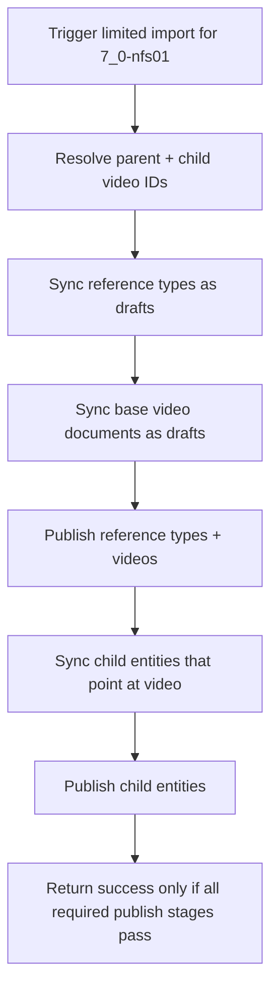

# CMS Gateway Sync Video Child Publishing

## Overview

Fix the Strapi v5 draft/publish regression in `apps/cms` so a limited gateway import can reliably bring in collection `7_0-nfs01`, its parent video, its 3 episode videos, and all related child content without leaving support records draft-only or depending on SQL link-table repair.

The proper fix is to keep the importer inside Strapi's Document Service model, publish records in dependency order, and make create and update paths use the same draft-first flow.

## Problem Statement / Motivation

Current local testing shows the importer is still not reliable for relation-heavy child types:

- base `video` records can import and publish successfully
- `video-subtitle`, `video-variant`, `bible-citation`, and `video-study-question` can still fail publish with `1 relation(s) of type api::video.video associated with this entity do not exist`
- the current code mixes Document Service writes with low-level `strapi.db.query(...)` reads and raw Knex link-table rewrites, which bypasses Strapi's document model and make failures harder to reason about
- the update path is not symmetrical with the create path: new records are created as drafts, but existing gateway-owned records are still updated with `status: "published"` inline
- the current bug writeup in `docs/solutions/cms/gateway-sync-limited-import-testing-bugs.md` says `docs.publish({ documentId })` alone is sufficient, but the current local behavior on Strapi `5.36.0` contradicts that assumption

This blocks trustworthy local and staging seed imports and creates false-positive "successful import" reports when child content remains unpublished.

## Proposed Solution

Refactor gateway sync so all gateway-owned upserts follow a single document-safe flow:

1. sync lookup and reference content as drafts
2. sync base video documents as drafts
3. publish reference types and videos
4. sync child content that depends on published videos
5. publish child content
6. rerun the same staged flow for updates, without special SQL repair paths

This keeps relation writes inside the Document Service, removes row-id repair logic, and makes publish order explicit instead of relying on a final bulk sweep to recover from earlier draft-only writes.

## Implementation Notes

The current implementation reached the clean-import acceptance criteria without extracting a separate
base-video/child-content phase inside `sync-videos.ts`, but warm reruns are still open:

- make gateway-owned creates and updates draft-first
- normalize `video` to a direct many-to-one document relation
- remove SQL join-table repair
- make publish discovery operate on document IDs that still have no published row
- fail the sync when a publish stage has real failures

## Technical Approach

### Flow changes

## Implementation Phases

### Phase 1: Normalize gateway upsert semantics

- Change `upsertByGatewayId()` in `apps/cms/src/api/gateway-sync/services/strapi-helpers.ts` so gateway-owned records update as drafts too, not with inline `status: "published"`.
- Keep manager-owned records skipped exactly as today.
- Keep `publishDrafts()` as the single publish entry point for gateway-owned records.
- Change `publishDrafts()` to return structured results instead of a bare count:
  - `published`
  - `failed`
  - `failedDocumentIds`
- Treat publish failures for required content types as sync failures, not warning-only noise.

### Phase 2: Remove mixed relation strategies

- Remove `repairVideoChildRelationLinks()` and any raw Knex writes to `*_lnk` tables from `apps/cms/src/api/gateway-sync/services/strapi-helpers.ts`.
- Keep entity-level `strapi.db.query(...)` only for discovering draft rows; do not use it to mutate relations.
- Normalize many-to-one relation payloads to the document-safe single-value form:
  - `video: videoDocId`
  - `language: clearableRelation(langDocId)`
  - `videoEdition: clearableRelation(editionDocId)`
  - `muxVideo: clearableRelation(muxDocId)`
  - `bibleBook: clearableRelation(bookDocId)`
- Reserve `connect` only for actual multi-relation fields.

### Phase 3: Split base-video sync from child-content sync

- Refactor `apps/cms/src/api/gateway-sync/services/sync-videos.ts` so base video upsert is separated from child entity upserts.
- Base video sync should own:
  - core scalar fields
  - origin
  - primary language
  - images
  - child gateway IDs
  - keyword relation update
- Child-content sync should own:
  - study questions
  - bible citations
  - subtitles
- Child-content sync must run only after the relevant `video` documents have been published.
- Keep the existing "include the parent collection video in resolved IDs" behavior for limited imports.

### Phase 4: Make stage ordering explicit in the orchestrator

- Replace the current single end-of-run `CONTENT_TYPES_TO_PUBLISH` sweep in `apps/cms/src/api/gateway-sync/services/gateway-sync.ts` with stage-scoped publish steps.
- Use this publish order:
  1. reference and lookup types: `continent`, `language`, `country`, `country-language`, `keyword`, `bible-book`, `video-origin`, `video-edition`, `mux-video`
  2. `video`
  3. child types: `video-subtitle`, `video-variant`, `bible-citation`, `video-study-question`
- Fail the sync result if a required publish stage has any failures.
- Keep limited import scope and dry-run behavior unchanged.

### Phase 5: Make reruns first-class

- Ensure the second import of the same collection uses the same draft-first, publish-later flow for updated documents.
- Do not preserve the current split behavior where create paths rely on `publishDrafts()` but update paths publish inline.
- Keep relation-clearing behavior from `docs/solutions/integration-issues/strapi-v5-manytone-relation-clearing.md`:
  - use `{ set: [] }` for missing optional many-to-one relations
  - never pass `null`
  - do not preserve stale relation references via `undefined`

## Public Interfaces / Internal Contracts

No external API changes are required for `POST /api/gateway-sync/trigger` or the limited import request shape.

Internal service contracts should change as follows:

- `publishDrafts(strapi, uid)` returns a structured result instead of `number`
- `sync-videos.ts` exposes separate helpers for base video sync and child-content sync
- gateway sync treats publish failures as first-class sync errors

## Acceptance Criteria

- [x] Fresh local import of collection `7_0-nfs01` completes without `api::video.video do not exist` publish errors.
- [x] The imported set includes exactly 4 `Video` documents: parent `7_0-nfs01` plus `7_0-nfs0101`, `7_0-nfs0102`, and `7_0-nfs0103`.
- [x] Parent video `7_0-nfs01` is published and its `children` relation shows the 3 episode videos in Strapi admin.
- [x] `video-subtitle`, `video-variant`, `bible-citation`, and `video-study-question` all have published rows after the run, not draft-only rows.
- [ ] Re-running the same limited import on a warm DB completes without child publish regressions.
- [x] The importer no longer writes directly to `*_lnk` tables anywhere in the gateway-sync path.
- [x] A publish-stage failure increments sync errors and fails the run instead of reporting a false success.

## Validation Plan

### Required manual regression

- Reset the local CMS DB.
- Run the existing local testing flow from `docs/solutions/cms/gateway-sync-local-testing.md`.
- Trigger a limited import for `7_0-nfs01`.
- Verify in Strapi admin:
  - `Video` shows the 4 expected records
  - the parent video is published
  - each child-supporting type has published records
- Verify in SQLite or DB inspection:
  - published rows exist for `video_subtitles`, `video_variants`, `bible_citations`, and `video_study_questions`
  - no required type has `0` published rows after the run
- Repeat the same import without wiping the DB and confirm the update path remains clean.

### Observability checks

- Logs must show publish counts and failures per stage.
- Status output must reflect publish-stage failures in the final result, not just warn in the background.

## Dependencies & Risks

### Dependencies

- Existing gateway-sync structure under `apps/cms/src/api/gateway-sync/`
- Existing limited-import resolution behavior that already includes the parent collection video
- Existing local validation runbook in `docs/solutions/cms/gateway-sync-local-testing.md`

### Risks

- **Strapi 5.36.0 document-service bug persists even after staged publishing**: if the Document Service only flow still fails after this refactor, stop adding importer workarounds and capture a minimal upstream reproduction instead.
- **Silent success regression**: if publish failures remain warning-only, operators will continue trusting incomplete imports.
- **Update-path drift**: fixing only fresh creates will leave reruns broken; the plan must unify create and update semantics.
- **Over-coupled video sync helper**: if `sync-videos.ts` is not actually split cleanly, child content may still be created before videos are publishable.

## Alternative Approaches Considered

- **Raw join-table repair**: rejected. It mixes row-level DB mutation with Strapi document writes and is exactly the incompatible strategy called out by current upstream guidance.
- **Disable Draft & Publish on child content types**: rejected for this fix. It changes editorial behavior and avoids the bug by changing the model rather than making the importer correct.
- **Large document middleware refactor**: deferred. Use a repo-local Document Service only fix first; only escalate to middleware work if the staged flow still reproduces the bug.

## References & Research

### Internal references

- `docs/brainstorms/2026-03-19-cms-gateway-sync-requirements.md`
- `docs/plans/2026-03-19-001-feat-cms-gateway-data-sync-plan.md`
- `docs/plans/2026-03-23-001-feat-staging-cms-collection-seed-import-plan.md`
- `docs/solutions/cms/gateway-sync-local-testing.md`
- `docs/solutions/cms/gateway-sync-limited-import-testing-bugs.md`
- `docs/solutions/integration-issues/strapi-v5-manytone-relation-clearing.md`
- `apps/cms/src/api/gateway-sync/services/strapi-helpers.ts`
- `apps/cms/src/api/gateway-sync/services/gateway-sync.ts`
- `apps/cms/src/api/gateway-sync/services/sync-videos.ts`
- `apps/cms/src/api/gateway-sync/services/sync-video-variants.ts`

### External references

- Strapi Document Service API: https://docs.strapi.io/cms/api/document-service
- Strapi relations docs: https://docs.strapi.io/cms/api/rest/relations
- Strapi issue `#24850` on relation handling with `documentId`: https://github.com/strapi/strapi/issues/24850
- Strapi issue `#23460` on published relation breakage after republish: https://github.com/strapi/strapi/issues/23460

## Documentation Follow-up

- Update `docs/solutions/cms/gateway-sync-limited-import-testing-bugs.md` to remove the now-stale claim that a final `docs.publish({ documentId })` sweep alone solves child publishing.
- Add a short "clean run + rerun" verification section for `7_0-nfs01` to `docs/solutions/cms/gateway-sync-local-testing.md`.
- Record the final root cause and chosen staged-publish design once verified locally.
