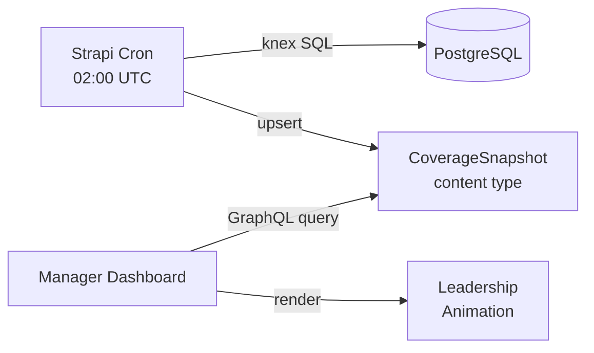

# feat: Daily Coverage Snapshot Tracking for Enrichment Progress

## Overview

Add a daily cron task in Strapi that captures library-wide enrichment coverage (subtitles, audio variants, AI metadata) broken down by language. Snapshots are stored as a Strapi content type and queryable via GraphQL so the Manager dashboard can serve historical trend data for monthly leadership animations.

## Problem Statement / Motivation

The Manager app enriches media content (transcription, translation, metadata, subtitles) but there is no historical record of library coverage. Leadership needs month-over-month progress visualizations. The existing `/dashboard/coverage` page computes real-time coverage but nothing is persisted for trend analysis. (see origin: `docs/brainstorms/2026-03-28-coverage-snapshot-tracking-requirements.md`)

## Proposed Solution

A Strapi v5 cron task runs daily, queries the database via raw knex SQL, aggregates coverage metrics, and writes a `CoverageSnapshot` record. The Manager dashboard reads snapshots via Strapi GraphQL for trend display.

### Architecture



## Technical Approach

### Phase 1: CoverageSnapshot Content Type

Create `apps/cms/src/api/coverage-snapshot/content-types/coverage-snapshot/schema.json`:

```json
{
  "kind": "collectionType",
  "collectionName": "coverage_snapshots",
  "info": {
    "singularName": "coverage-snapshot",
    "pluralName": "coverage-snapshots",
    "displayName": "Coverage Snapshot",
    "description": "Daily enrichment coverage snapshot for trend tracking"
  },
  "options": {
    "draftAndPublish": false
  },
  "attributes": {
    "date": {
      "type": "date",
      "required": true,
      "unique": true
    },
    "computedAt": {
      "type": "datetime",
      "required": true
    },
    "totalVideos": {
      "type": "integer",
      "required": true
    },
    "videosWithAiMetadata": {
      "type": "integer",
      "required": true
    },
    "languageCoverage": {
      "type": "json",
      "required": true
    }
  }
}
```

**Key design decisions:**

- `draftAndPublish: false` — snapshots are operational data, not editorial content (see origin: `docs/solutions/cms/strapi-enrichment-job-content-type.md`)
- `date` field with `unique: true` — enables idempotent upsert (R6)
- `computedAt` — captures exact computation time for debugging (distinct from `date` which is the logical day)
- `totalVideos` and `videosWithAiMetadata` — library-wide metrics as top-level integers (R3)
- `languageCoverage` as JSON — per-language breakdown (R2), avoids repeatable component overhead

**`languageCoverage` JSON shape:**

```typescript
type LanguageCoverageEntry = {
  languageCoreId: string // e.g., "529"
  languageName: string // e.g., "English" — included for display convenience
  subtitlesHuman: number // videos with at least one non-AI subtitle in this language
  subtitlesAi: number // videos where ALL subtitles in this language are AI-generated
  audioHuman: number // videos with at least one non-AI variant in this language
  audioAi: number // videos where ALL variants in this language are AI-generated
}

// languageCoverage: LanguageCoverageEntry[]
```

**Human vs AI classification (follows existing Manager pattern):** A video is "human" for a language if it has at least one non-AI subtitle/variant for that language. A video is "ai" for a language only if ALL its subtitles/variants for that language are AI-generated. Mutually exclusive — a video appears in exactly one bucket per language.

**Filesystem structure:**

```
apps/cms/src/api/coverage-snapshot/
  content-types/coverage-snapshot/schema.json
  services/coverage-snapshot.ts
  routes/coverage-snapshot.ts        # (optional, only if custom routes needed)
  controllers/coverage-snapshot.ts   # (optional, only if custom routes needed)
```

### Phase 2: Coverage Computation Service

Create `apps/cms/src/api/coverage-snapshot/services/coverage-snapshot.ts`:

This service uses `strapi.db.connection` (knex) for efficient SQL aggregation. The coverage computation queries all published content and aggregates per-language metrics in SQL rather than loading all records into memory.

**Critical SQL considerations (from SpecFlow analysis):**

1. **Published-only filtering:** All content types have `draftAndPublish: true`. Raw queries MUST filter `WHERE published_at IS NOT NULL` to avoid counting draft rows. Without this, every metric is inflated by up to 2x. (Follows pattern in `apps/cms/src/api/core-sync/services/sync-videos.ts:654-700`)

2. **i18n locale deduplication for videos:** The `videos` table has `i18n: { localized: true }`, creating separate rows per locale. Use `COUNT(DISTINCT document_id) WHERE published_at IS NOT NULL` for total video count. Variants and subtitles are NOT localized, so no locale concern there.

3. **Null-language exclusion:** Variants and subtitles may have no `language` relation set. These are excluded from per-language counts (they fall outside any language bucket). The join to the link table naturally excludes them.

**SQL approach (pseudocode):**

```sql
-- Library-wide: total published videos (deduplicated across locales)
SELECT COUNT(DISTINCT document_id) AS total
FROM videos
WHERE published_at IS NOT NULL;

-- Library-wide: videos with AI metadata
SELECT COUNT(DISTINCT document_id) AS total
FROM videos
WHERE published_at IS NOT NULL AND ai_metadata = true;

-- Per-language subtitle coverage:
-- For each (video, language) pair, determine if ALL subtitles are AI or if any are human
SELECT
  l.core_id AS language_core_id,
  l.name AS language_name,
  COUNT(DISTINCT CASE WHEN has_human THEN v.document_id END) AS subtitles_human,
  COUNT(DISTINCT CASE WHEN NOT has_human AND has_any THEN v.document_id END) AS subtitles_ai
FROM (
  SELECT
    vsl.video_id,
    sll.language_id,
    BOOL_OR(NOT vs.ai_generated) AS has_human,
    TRUE AS has_any
  FROM video_subtitles vs
  JOIN video_subtitles_video_lnk vsl ON vsl.video_subtitle_id = vs.id
  JOIN video_subtitles_language_lnk sll ON sll.video_subtitle_id = vs.id
  WHERE vs.published_at IS NOT NULL
  GROUP BY vsl.video_id, sll.language_id
) sub
JOIN videos v ON v.id = sub.video_id AND v.published_at IS NOT NULL
JOIN languages l ON l.id = sub.language_id AND l.published_at IS NOT NULL
GROUP BY l.core_id, l.name;

-- Same pattern for audio variants using video_variants tables
```

**Idempotent upsert pattern (R6):**

```typescript
// Find existing snapshot for today
const existing = await strapi
  .documents("api::coverage-snapshot.coverage-snapshot")
  .findFirst({
    filters: { date: todayStr },
  })

if (existing) {
  await strapi.documents("api::coverage-snapshot.coverage-snapshot").update({
    documentId: existing.documentId,
    data: snapshotData,
  })
} else {
  await strapi.documents("api::coverage-snapshot.coverage-snapshot").create({
    data: { date: todayStr, ...snapshotData },
  })
}
```

### Phase 3: Cron Task Registration

Add a new entry to `apps/cms/config/cron-tasks.ts`:

```typescript
"coverage-snapshot": {
  task: async ({ strapi }) => {
    strapi.log.info("[coverage-snapshot] Starting daily coverage snapshot");
    try {
      await (strapi.service("api::coverage-snapshot.coverage-snapshot") as any).createSnapshot();
      strapi.log.info("[coverage-snapshot] Snapshot complete");
    } catch (error) {
      strapi.log.error("[coverage-snapshot] Failed:", error);
    }
  },
  options: {
    rule: env("COVERAGE_SNAPSHOT_CRON", "0 2 * * *"), // 02:00 UTC daily
    // IMPORTANT: Must run BEFORE core-sync (03:00 UTC) to capture
    // pre-sync state. If core-sync schedule changes, update this too.
  },
},
```

**Cron enablement:** Shares the existing `CORE_SYNC_ENABLED` gate. No separate env var unless a concrete need arises (see origin: Key Decisions).

**Timing:** 02:00 UTC, one hour before core-sync at 03:00 UTC. This captures coverage state before any core-sync data import could alter the numbers. The ordering dependency is documented in a comment.

### Phase 4: GraphQL Access & Manager Integration

**Strapi GraphQL auto-generation:** Creating the content type with `draftAndPublish: false` automatically exposes it via Strapi's GraphQL plugin. No custom resolvers needed. The following query will work out of the box:

```graphql
query GetCoverageSnapshots(
  $filters: CoverageSnapshotFiltersInput
  $sort: [String]
) {
  coverageSnapshots(filters: $filters, sort: $sort) {
    date
    computedAt
    totalVideos
    videosWithAiMetadata
    languageCoverage
  }
}
```

**Manager API endpoint** at `apps/manager/src/app/api/coverage-snapshots/route.ts`:

- Accepts `startDate` and `endDate` query params
- Queries Strapi GraphQL with date range filter: `{ date: { gte: startDate, lte: endDate } }`
- Returns JSON array of snapshots sorted by date ascending
- Uses the existing Apollo client from `apps/manager/src/cms/client.ts`

**GraphQL codegen flow:**

1. After creating the content type, run Strapi locally
2. Run codegen in `packages/graphql/` to pick up `CoverageSnapshot` types
3. Define the typed query in `apps/manager/src/cms/` or directly in the API route
4. Until codegen runs, use untyped `gql` from `@apollo/client` with `as any` (established pattern from `docs/solutions/cms/strapi-enrichment-job-content-type.md`)

### Phase 5: Permissions & API Token Access

The Manager app authenticates to Strapi via `STRAPI_API_TOKEN`. After creating the content type:

1. In Strapi admin → Settings → API Tokens → edit the Manager token
2. Grant `find` and `findOne` permissions on `coverage-snapshot`
3. No `create`/`update`/`delete` needed for Manager — only the cron task writes

## System-Wide Impact

- **Interaction graph:** Cron task → coverage-snapshot service → knex SQL queries → PostgreSQL. No callbacks, middleware, or observers involved. Manager reads via standard GraphQL — no side effects.
- **Error propagation:** Cron task wraps in try/catch and logs errors. A failed snapshot does not affect core-sync or any other system. The cron runs again next day.
- **State lifecycle risks:** The `unique: true` constraint on `date` plus find-then-upsert prevents duplicate snapshots. If the upsert fails mid-write, the next run overwrites cleanly.
- **API surface parity:** This is a new content type with no existing equivalent. No other interfaces need updating.

## Acceptance Criteria

- [ ] `CoverageSnapshot` content type created with schema per Phase 1
- [ ] Coverage computation service correctly counts published-only, locale-deduplicated videos
- [ ] Per-language metrics follow human-vs-AI mutually exclusive classification
- [ ] Cron task registered and runs daily at 02:00 UTC when `CORE_SYNC_ENABLED=true`
- [ ] Running cron twice on same date produces exactly one snapshot (idempotent)
- [ ] Manager API endpoint returns snapshots filtered by date range
- [ ] GraphQL codegen updated to include `CoverageSnapshot` types
- [ ] After 7 days, querying snapshots returns 7 records with correct coverage data

## Success Metrics

- Snapshots accumulate daily without manual intervention
- Leadership animation can be built from snapshot API showing per-language coverage trends
- Coverage percentages match the existing `/dashboard/coverage` real-time computation (within reasonable delta from timing differences)

## Dependencies & Prerequisites

- `CORE_SYNC_ENABLED=true` in Railway environment (already set for core-sync)
- Manager API token must be granted read access to the new content type
- Strapi must be running locally for GraphQL codegen after content type creation

## Implementation Order

```
1. Create CoverageSnapshot content type (schema.json)
2. Create coverage-snapshot service with SQL computation
3. Add cron task entry to cron-tasks.ts
4. Test locally: run cron manually, verify snapshot created
5. Run GraphQL codegen in packages/graphql/
6. Create Manager API endpoint for snapshot history
7. Update API token permissions in Strapi admin
8. Deploy to Railway
```

## Sources & References

### Origin

- **Origin document:** [docs/brainstorms/2026-03-28-coverage-snapshot-tracking-requirements.md](docs/brainstorms/2026-03-28-coverage-snapshot-tracking-requirements.md) — Key decisions: daily cron over event-driven, Strapi content type over external storage, Strapi cron over external scheduler, per-language granularity

### Internal References

- Cron task pattern: `apps/cms/config/cron-tasks.ts`
- Cron config: `apps/cms/config/server.ts:12-15`
- Raw knex SQL pattern: `apps/cms/src/api/core-sync/services/bulk-upsert.ts:69`
- Draft/publish filtering: `apps/cms/src/api/core-sync/services/sync-videos.ts:654-700`
- Coverage computation logic: `apps/manager/src/app/api/videos/route.ts:105-139`
- EnrichmentJob content type (reference): `apps/cms/src/api/enrichment-job/content-types/enrichment-job/schema.json`
- Manager Apollo client: `apps/manager/src/cms/client.ts`

### Institutional Learnings

- Strapi v5 draft/publish: every row exists twice (draft + published). Filter `published_at IS NOT NULL` in raw SQL. (`docs/solutions/performance-issues/strapi-nested-relation-truncation-and-n-plus-one-manager-20260328.md`)
- Content type creation requires codegen before typed GraphQL works. Use untyped `gql` as interim. (`docs/solutions/cms/strapi-enrichment-job-content-type.md`)
- Railway filesystem is ephemeral — all state must be in PostgreSQL. (`docs/solutions/platform/cms-database-snapshot-restore-automation.md`)
- Raw knex upsert pattern: `INSERT ... ON CONFLICT ... DO UPDATE` via `.onConflict().merge()`. (`docs/solutions/cms/core-sync-incremental-delta-sync.md`)
