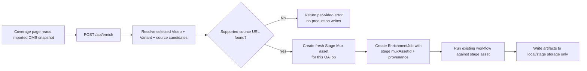
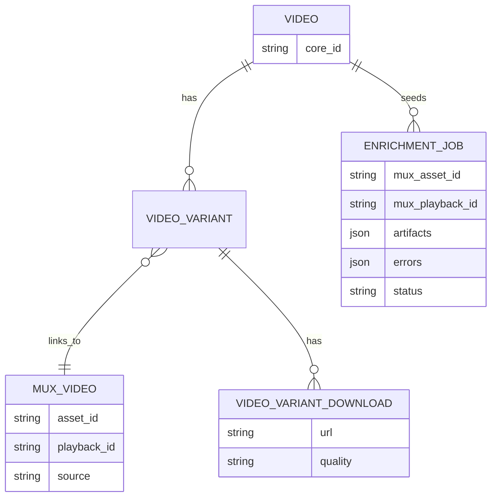

# feat: Stage Materialization Workflow for Snapshot-Backed Enrichment

## Overview

Keep the imported CMS snapshot as a realistic, production-shaped browse surface in local dev and staging, but never run enrichment directly against the production-linked Mux asset IDs embedded in that snapshot.

Instead, when an operator selects a video from the coverage UI and starts enrichment, the manager should:

1. Read the selected video's metadata from the imported snapshot
2. Resolve a safe source URL only for the selected videos
3. Return actionable per-video errors when no safe source exists
4. Create a fresh stage-side clone of the selected production-linked Mux asset in the Stage Mux environment for this QA run
5. Run transcription, subtitle translation, and related workflow steps against the stage asset ID created in the previous step
6. Write artifacts only to local or stage storage

This creates a safe "production-shaped metadata, stage-only processing" workflow that mirrors real deployment behavior without writing back to production Mux or mutating production CMS data. Snapshot-backed enrichment never runs against the production-linked Mux asset directly; it always runs against a stage clone created for the current job.

## 2026-04-04 Audit Update

This plan drifted in one important way after testing against a larger restored snapshot: the branch no longer precomputes per-video download eligibility across the whole library in `/api/videos`.

That original approach required a heavy nested `videos -> variants -> downloads` crawl and became the main local bottleneck on snapshot-sized datasets. The implemented strategy is now:

- keep `/api/videos` focused on cached coverage data
- validate stage-clone source availability only for the selected videos inside `/api/enrich`
- return per-video unsupported-source errors after selection instead of dimming unsupported tiles in advance

The rest of the stage-materialization boundary still stands: jobs are created only from fresh stage assets, and provenance remains on `job.artifacts.materialization`.

## Problem Statement / Motivation

The current local snapshot contains CMS records whose `mux_videos.asset_id` values resolve in production Mux, not in stage or dev. The current enrichment path in the manager app assumes those linked Mux asset IDs are directly usable:

- `/api/enrich` looks up selected videos and immediately uses the first linked `variant.muxVideo.assetId`
- the coverage UI calls `/api/enrich` directly from the existing "Enrich Now" action
- the enrichment workflow then transcribes and translates against that linked asset ID

That is unsafe and unrealistic for QA:

- It mixes imported production-shaped CMS data with non-production runtime credentials
- It creates pressure to point dev/staging manager at production Mux just to make QA work
- It makes it too easy to accidentally run write operations in the wrong environment later
- It prevents us from validating the real non-production workflow boundary that we actually want before deploy

The desired workflow is stricter:

- Read metadata from the imported snapshot
- Process using stage Mux assets only
- Write job state and artifacts to stage/local only

## Research Summary

### Internal Findings

- The coverage page currently posts selected `videoIds` and `languages` straight to `/api/enrich`, which then uses the snapshot-linked `muxVideo.assetId` directly.
- The coverage videos API does not currently expose whether a tile has a downloadable MP4 source that can be used for stage cloning.
- The manager already has a safe artifact boundary: when `RAILWAY_S3_BUCKET` is unset, outputs go to local `.tmp/artifacts/`; otherwise they go to the configured non-production bucket.
- The current workflow does not publish translated outputs back to CMS or overwrite existing Mux assets. It produces artifacts and job state only.
- `EnrichmentJob` already has enough structure for a QA-only implementation:
  - `muxAssetId`
  - `muxPlaybackId`
  - `artifacts` JSON
  - `errors` JSON
  - optional `video` relation
- In the current imported local snapshot, only a limited subset of records expose obvious downloadable source URLs:
  - `110` `video_variants` currently have `hls`
  - `110` distinct `video_variants` are linked to `video_variant_downloads`
  - those rows collapse to only `8` distinct videos with downloadable URLs in the restored dataset
  - sample download URLs are public Mux static MP4 URLs such as `https://stream.mux.com/{PLAYBACK_ID}/720p.mp4`

This means the MVP must handle "browseable in snapshot, but not yet materializable" as a first-class outcome.

### External Mux Findings

- Mux environments are isolated containers for assets, live streams, access tokens, and signing keys. Assets are scoped to their environment, and an access token from one environment cannot manage assets in another.
- Creating a Mux asset is documented as "create a new asset from a source URL that Mux downloads."
- The documented asset input URL examples are downloadable media files such as `MP4`, `MOV`, `MKV`, and `TS`.
- Mux documents `mux://assets/{asset_id}` for clips created from existing Mux assets, but that is not a documented cross-environment cloning workflow.

## Proposed Solution

Introduce a job-scoped stage materialization step between snapshot-backed video selection and the existing enrichment workflow.

### High-Level Flow



### Design Principles

1. Production snapshot is read-only context  
   The imported CMS snapshot remains the browse and selection surface only.

2. Each QA run gets its own stage copy  
   The implementation does not need a durable cache or mapping model. Creating duplicate stage assets is acceptable for this QA-only workflow.

3. Existing job tracking is enough  
   The current `EnrichmentJob` record should carry the stage asset ID plus source provenance in `artifacts` and `errors`.

4. Minimal QA-only UX impact  
   The feature should stay invisible to end users and avoid pushing heavy eligibility work onto the coverage browse path. Unsupported selections should fail clearly at enrich time.

5. Unsupported sources fail closed  
   If a selected video does not expose a materializable source URL, the system should skip it with a clear error rather than falling back to production Mux access.

## Technical Approach

### Architecture Changes

#### 1. Use `EnrichmentJob` as the only durable record

Do not add a new CMS content type for stage materializations.

Instead, keep the implementation job-scoped:

- create a fresh stage clone for each selected video/job
- create the `EnrichmentJob` against the stage asset ID
- record source provenance inside `EnrichmentJob.artifacts`

Suggested provenance shape:

```ts
type JobMaterializationArtifact = {
  mode: "snapshot_to_stage_clone"
  sourceVideoCoreId: string
  sourceMuxAssetId: string
  sourceMuxPlaybackId?: string
  sourceInputHost?: string
  sourceInputType: "download_mp4" | "operator_url" | "unknown"
  sourceLanguageId?: string
  sourceLanguageCode?: string
  primaryRequestedTargetLanguageCode?: string
  requestedTargetLanguageIds?: string[]
  resolvedTargetLanguageCodes?: string[]
  resolvedMuxSubtitleLanguageCode?: string
  sourceSelectionReason?: string
  sourceSelectionAttemptedCodes?: string[]
  sourceEnvironment: "mux-production"
  targetEnvironment: "mux-stage"
  stageMuxAssetId: string
  stageMuxPlaybackId: string
}
```

Suggested storage location:

- `job.artifacts.materialization`
- no separate provenance artifact file in the current branch strategy

This keeps the workflow simple and avoids any new schema or GraphQL type work for the MVP.

#### 2. Add a manager service that creates a stage clone for one job

Create a manager service responsible for:

- resolving the best input URL for a selected snapshot-backed video
- creating one new stage Mux asset for the current job
- returning the stage asset IDs plus source provenance

Suggested file:

- `apps/manager/src/services/stageClone.ts`

Suggested API shape:

```ts
type StageCloneResult =
  | {
      status: "ready"
      sourceVideoCoreId: string
      sourceMuxAssetId: string
      sourceMuxPlaybackId?: string
      sourceInputUrl: string
      sourceInputType: "download_mp4"
      stageMuxAssetId: string
      stageMuxPlaybackId: string
    }
  | {
      status: "unsupported"
      sourceVideoCoreId: string
      sourceMuxAssetId?: string
      reason:
        | "no_variant_with_mux"
        | "no_materializable_source_url"
        | "no_mux_supported_downloadable_source"
        | "source_requires_manual_copy"
    }
  | {
      status: "errored"
      sourceVideoCoreId: string
      sourceMuxAssetId?: string
      message: string
    }
```

#### 3. Change `/api/enrich` to clone to stage before job creation

Current behavior:

- fetch selected videos
- pick first `variant.muxVideo.assetId`
- create job immediately against that asset

New behavior:

- fetch selected videos plus source candidates needed for cloning
- call `createStageCloneForJob(video, sourceLanguage)`
- if ready:
  - create the job against the stage asset ID and playback ID
  - record source provenance on the job/artifacts
  - kick off the existing enrichment workflow unchanged
- if unsupported:
  - add an entry to the existing `errors` response payload
- if errored:
  - add an entry to the existing `errors` response payload

This preserves the existing route contract shape while changing the execution asset from production-linked to stage-only.

#### 4. Keep the enrichment workflow itself stage-agnostic

`runVideoEnrichment()` should continue to operate on whatever `muxAssetId` it is given. The workflow should not need special knowledge about "snapshot" versus "stage" sources.

That separation is valuable:

- `/api/enrich` becomes the policy boundary
- the clone step stays outside the workflow
- `runVideoEnrichment()` remains a pure execution pipeline
- `/api/jobs` can continue to create a brand-new Mux asset from an operator-supplied URL as it does today

#### 5. Changed strategy: validate source eligibility only for selected videos

The original plan was to expose a lightweight `hasDownloadableMp4` flag from `apps/manager/src/app/api/videos/route.ts` so unsupported tiles could be dimmed before selection.

That strategy was abandoned after snapshot-scale QA because it pushed a heavy nested variant/download crawl onto the coverage hot path.

The implemented branch now does this instead:

- `/api/videos` stays coverage-only and is cached per selected language set
- `/api/enrich` fetches the full variant/download graph only for the selected videos
- unsupported videos return per-video errors through the existing `errors` payload

This keeps the stage-clone eligibility check off the browse path while preserving the fail-closed server boundary.

### Source URL Resolution Strategy

#### MVP Source Priority

1. Preferred: `video_variant_downloads.url` when it points to a downloadable Mux MP4
2. Optional operator fallback: explicit external `inputUrl` supplied outside the snapshot flow
3. Not in MVP: direct use of snapshot-linked production asset IDs
4. Deferred: using `video_variants.hls` as an ingestion source unless manually validated against stage Mux first

Why MP4 first:

- it matches Mux's documented "URL of the file that Mux should download and use"
- the imported snapshot already contains real public MP4 URLs for some variants
- it avoids relying on an undocumented or weakly documented cross-environment behavior

Because current source coverage is limited, the route must make unsupported cases visible instead of pretending all snapshot videos can be processed.

### Minimal QA UI Change

No end-user product UI changes are required.

The original "dim unsupported tiles before selection" idea is no longer the active strategy for this branch. The current QA-facing behavior stays intentionally small:

- same coverage page
- same selection workflow
- same `/api/enrich` endpoint
- unsupported selections are rejected with actionable per-video errors at enrich time instead of via a whole-library precomputed eligibility flag

The actual "cloned to stage" details can still live in:

- server logs
- job detail pages
- `EnrichmentJob.artifacts`
- local/stage artifact output

### Data Model Sketch



## Implementation Phases

### Phase 1: Source discovery and job-scoped provenance

- [x] Create `apps/manager/src/services/stageClone.ts`
- [x] Implement `resolveMaterializationSource(video)` with MP4-first selection
- [x] Move source eligibility checks off the coverage hot path and into `/api/enrich` for the selected videos only
- [x] Define the `job.artifacts.materialization` payload shape
- [x] Return structured unsupported reasons when no source URL is available

**Success criteria:** manager can inspect snapshot data and determine whether a selected video is safely materializable without touching production Mux.

### Phase 2: Create a fresh stage clone per job

- [x] Implement `createStageCloneForJob(video, sourceLanguage)`
- [x] Create one new stage Mux asset per QA run via `createMuxAsset({ inputUrl, generateSubtitles, subtitleLanguageCode })`
- [x] Return stage asset IDs plus source provenance
- [x] Keep provenance on `job.artifacts.materialization` instead of writing a separate `materialization-source.json` artifact

**Success criteria:** a supported snapshot-backed video can be cloned into the Stage Mux environment and immediately handed off to the existing workflow.

### Phase 3: Route integration with minimal QA-only UI change

- [x] Update `apps/manager/src/app/api/enrich/route.ts` to clone to stage before creating jobs
- [x] Keep the existing request shape from the coverage page unchanged
- [x] Keep the coverage page browse path free of whole-library stage-clone eligibility preloads
- [x] Return per-video unsupported-source results through the existing `errors` payload after selection
- [x] Keep `runVideoEnrichment()` unchanged except for any new provenance artifact writes
- [x] Store the source provenance under `EnrichmentJob.artifacts`
- [x] Keep the current response shape, using the existing `errors` array for unsupported or failed clones

**Success criteria:** the existing coverage UI continues to work without a global eligibility preload, and the actual jobs run only against stage asset IDs created for that QA run.

### Phase 4: QA hardening

- [x] Add unit tests for source URL resolution and unsupported-source outcomes
- [ ] Add mocked integration tests for `/api/enrich` covering:
  - supported video -> stage clone created -> job created
  - unsupported source -> error returned, no job created
  - Mux create failure -> error returned, no workflow start
- [x] Add manual QA instructions for local/staging:
  - select a snapshot-backed video
  - trigger enrichment from the existing coverage UI
  - confirm the created job uses a stage asset ID
  - confirm artifacts stay in local/stage storage
  - confirm job provenance records the original production-linked asset ID
  - confirm unsupported selections fail with actionable per-video errors and no production writes

**Success criteria:** QA can exercise realistic snapshot-backed content selection without any need to point non-production manager environments at production Mux credentials.

## Alternative Approaches Considered

### 1. Keep using the snapshot-linked Mux asset IDs directly

Rejected.

This preserves the current broken environment split and encourages unsafe credential usage. It also fails the central goal: production-shaped data should be browse context, not a direct write path.

### 2. Point local/staging manager at production Mux

Rejected.

This would make QA easier in the short term but erases the safety boundary we want to preserve. It also increases the blast radius of future feature work.

### 3. Add a dedicated `StageMaterialization` CMS model with durable cache/reuse

Rejected for MVP.

That approach is more durable, but it is more product than this QA-only workflow needs. You explicitly do not need a reusable cache and do not mind duplicate stage copies per run.

### 4. Use HLS URLs as the primary materialization input

Deferred.

The imported snapshot does contain `hls` playback URLs, but Mux's asset-ingest docs explicitly describe downloadable file URLs such as MP4, MOV, MKV, and TS. We should not make HLS ingest the MVP dependency until it is validated against the stage environment.

## Acceptance Criteria

### Functional Requirements

- [x] Selecting videos from the coverage page still uses the imported snapshot data for browse and selection
- [x] The coverage page no longer precomputes stage-clone eligibility across the full library before selection
- [x] `/api/enrich` never creates enrichment jobs directly from snapshot-linked production Mux asset IDs in local/staging workflows
- [x] For supported videos, `/api/enrich` creates a fresh stage-side Mux clone for the current QA run
- [x] The created `EnrichmentJob` uses the stage asset ID, not the original production-linked asset ID
- [x] The job records source provenance in existing job metadata/artifacts
- [x] If a selected video has no supported source URL, the request returns an error entry and performs no production writes
- [x] Enrichment artifacts are written only to local or configured non-production storage

### Non-Functional Requirements

- [x] The workflow boundary remains fail-closed: unsupported sources do not fall back to production credentials or production writes
- [x] No dedicated durable cache or new CMS model is required for MVP
- [x] UI change stays limited to the manager QA surface and does not affect end-user product surfaces
- [x] The implementation preserves the existing `runVideoEnrichment()` contract so `/api/jobs` does not regress

### Quality Gates

- [x] Unit coverage for source resolution and clone setup logic
- [ ] Mocked integration coverage for `/api/enrich` clone branches
- [x] Manual QA in local dev using the imported snapshot and a non-production Mux environment
- [x] Manual verification that the created job's `muxAssetId` is a stage asset ID, not the original snapshot-linked production asset ID

## Success Metrics

- Operators can browse production-shaped snapshot data locally and successfully start safe QA runs without changing Mux credentials to production
- Unsupported videos fail with actionable per-video reasons instead of ambiguous downstream workflow errors
- Zero enrichment jobs in local/staging are created against production Mux asset IDs
- Each successful QA run leaves enough provenance on the job/artifacts to prove which production-linked source was cloned into stage

## Dependencies & Prerequisites

- Non-production Mux credentials must be configured for the target manager environment
- The selected snapshot-backed videos must expose a supported materialization source URL, or the route must return errors for unsupported videos
- Local/staging artifact storage must remain non-production (`.tmp/artifacts/` locally or the configured non-production bucket)

## Risk Analysis & Mitigation

### Risk: Too few snapshot videos have usable downloadable source URLs

Current local data suggests only a small subset of videos are immediately materializable via known MP4 URLs.

Mitigation:

- make unsupported-source results explicit in the route response
- scope MVP success to "supported videos can be processed safely"
- decide in follow-up work whether to expand snapshot source coverage or validate HLS ingest as an additional safe source type

### Risk: Duplicate stage assets increase cost

Accepted tradeoff for MVP.

This workflow is QA-only, and you explicitly do not need durable reuse. Simpler job-scoped cloning is preferable to building a cache layer before it is needed.

### Risk: Provenance becomes unclear once the stage asset exists

Mitigation:

- store source and target identifiers in `EnrichmentJob.artifacts.materialization`

### Risk: Route complexity grows and breaks `/api/enrich`

Mitigation:

- isolate the new branching logic in `stageClone.ts`
- keep `runVideoEnrichment()` unchanged
- add mocked integration coverage around the route contract

## Documentation Plan

After implementation:

- add a `docs/solutions/` entry describing the safe snapshot-backed enrichment workflow
- update local QA guidance to state clearly that imported snapshot Mux asset IDs are browse-time context only
- document the explicit rule: "production-shaped snapshot data is read-only context; each QA run clones into stage and processes there"

## References & Research

### Internal References

- Existing snapshot-backed enrich route: `apps/manager/src/app/api/enrich/route.ts:20`
- Current coverage UI action: `apps/manager/src/features/coverage/coverage-report-client.tsx:1373`
- Mux asset creation in manager: `apps/manager/src/services/mux.ts:78`
- Existing local/stage artifact boundary: `apps/manager/src/services/storage.ts:1`
- Existing enrichment job creation: `apps/manager/src/lib/state.ts:168`
- Existing `EnrichmentJob` schema: `apps/cms/src/api/enrichment-job/content-types/enrichment-job/schema.json`
- Snapshot restore caveats: `docs/solutions/platform/cms-database-snapshot-restore-automation.md`
- Core sync model shape for video variants and Mux metadata: `docs/brainstorms/2026-03-19-cms-core-sync-requirements.md`

### External References

- Mux fundamentals: environments are isolated and access tokens are environment-scoped  
  [https://www.mux.com/docs/core/mux-fundamentals](https://www.mux.com/docs/core/mux-fundamentals)
- Mux asset creation: asset inputs are source URLs that Mux downloads  
  [https://www.mux.com/docs/api-reference/video/assets/create-asset](https://www.mux.com/docs/api-reference/video/assets/create-asset)
- Mux getting-started asset guide: create an asset from a video file URL  
  [https://www.mux.com/docs/core/stream-video-files](https://www.mux.com/docs/core/stream-video-files)
- Mux static renditions guide: downloadable MP4 renditions and URL format  
  [https://www.mux.com/docs/guides/enable-static-mp4-renditions](https://www.mux.com/docs/guides/enable-static-mp4-renditions)

## Next Step

Implement this as a backend-only manager change that clones supported snapshot-backed videos into stage on a per-job basis, stores provenance on the existing `EnrichmentJob`, and then runs the current workflow against the newly created stage asset.
