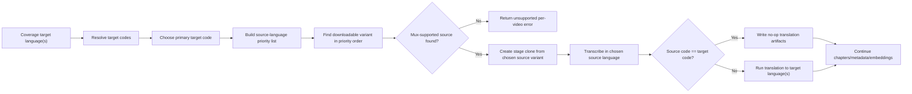

# feat: Deterministic Source-Language Priority for Snapshot Enrichment

## Overview

Define a deterministic source-variant selection policy for snapshot-backed enrichment so the selected report/enrichment language is no longer confused with an arbitrary available source variant.

When an operator chooses language `X` in coverage and enriches a video, manager should:

1. Prefer a downloadable source variant in language `X` if `X` is supported by Mux generated subtitles
2. Otherwise fall back in this fixed order:
   - English (`en`)
   - Spanish (`es`)
   - French (`fr`)
   - any other available variant whose language is supported by Mux generated subtitles
3. If no downloadable variant exists in any Mux-supported language, fail the selected video as unsupported instead of choosing an arbitrary non-Mux-supported source

This policy should govern the source video used for:

- transcription
- source subtitles
- chapters
- metadata
- downstream translation targets

The goal is to make enrichment behave predictably for a chosen language target while staying inside Mux’s supported source-language boundary.

This plan extends the current `feat-031` enrichment pipeline work in [feat-031 AI Video Enrichment Pipeline](/Users/o/.codex/worktrees/1ec2/forge/docs/roadmap/media-generation/feat-031-ai-video-enrichment-pipeline.md).

## Problem Statement / Motivation

The current snapshot enrichment flow still picks the "best available downloadable variant" using the video’s source metadata and variant ordering, not the operator’s selected enrichment language.

That creates surprising behavior:

- An operator can select English in coverage and still get a Filipino transcript because the chosen downloadable source variant was Filipino.
- The job looks wrong to QA because the transcription artifact is not in the language they thought they were enriching.
- Chapters and metadata are generated from the actual source transcript, so they also drift with the fallback source language.

Recent local QA exposed this clearly:

- Job `uv2rhxe9a66mrxubdalgotye` was created from a source variant with:
  - `sourceLanguageCode: "fil"`
  - `resolvedMuxSubtitleLanguageCode: "auto"`
  - `resolvedTargetLanguageCodes: ["en"]`
- The operator had selected English in the coverage UI.
- The saved transcript and `subtitles.vtt` were Filipino-ish source output, while the English result only existed in `translation-en.json`.

That is technically consistent with the current code, but it is not the behavior the operator expects.

## Requirements Trace

This plan is driven by one operator-facing requirement:

- when QA enriches for language `X`, the app should try to enrich from a source variant in language `X` first, but only if `X` is usable by Mux generated subtitles

That requirement breaks into these technical obligations:

1. Normalize the requested enrichment language before source selection  
   Raw CMS IDs cannot drive source selection directly.

2. Pick exactly one source variant per job  
   Transcription, chapters, and metadata all depend on one real source transcript.

3. Use a deterministic fallback order when `X` is absent or unsupported  
   The fallback must be stable and explainable, not based on whatever variant happens to come first.

4. Fail closed when no safe source exists  
   The system should not silently pick a non-Mux-supported source language and hope `auto` is good enough.

5. Preserve honest job semantics  
   The job must clearly show:
   - what language was requested
   - which source language was actually transcribed
   - whether translation was required or skipped as a no-op

## Scope Boundaries

This plan is intentionally limited to snapshot-backed enrichment source selection.

In scope:

- source-variant selection policy for `/api/enrich`
- stage-clone candidate ordering
- job metadata semantics for requested vs chosen source language
- workflow behavior when source and target language are the same
- per-video unsupported errors when no Mux-supported source exists

Out of scope:

- changing the coverage browse/filter model itself
- adding a new CMS content type or persistent source-language cache
- changing Mux-supported language coverage beyond what Mux currently supports
- redesigning the jobs UI beyond whatever metadata is already exposed
- adding human editorial review flows for bad automatic transcripts

## Research Summary

### Internal Findings

- `/api/enrich` resolves target language IDs from coverage, then calls `createStageCloneForJob(...)` with `preferredSourceLanguageId` derived from the existing source-language plan in [route.ts](/Users/o/.codex/worktrees/1ec2/forge/apps/manager/src/app/api/enrich/route.ts).
- Stage-clone source selection in [stageClone.ts](/Users/o/.codex/worktrees/1ec2/forge/apps/manager/src/services/stageClone.ts) currently:
  - sorts variants by one preferred language ID
  - then picks the first variant with a trusted downloadable MP4
  - then asks Mux to use the chosen variant language if mappable, otherwise `auto`
- The supported Mux generated-subtitle language set is already codified in [mux-language.ts](/Users/o/.codex/worktrees/1ec2/forge/apps/manager/src/lib/mux-language.ts):
  - `bg`, `ca`, `cs`, `da`, `de`, `el`, `en`, `es`, `fi`, `fr`, `hr`, `it`, `nl`, `no`, `pl`, `pt`, `ro`, `ru`, `sk`, `sv`, `tr`, `uk`, plus `auto`
- Existing bug history already showed the importance of aligning selected source variant and actual Mux transcription language:
  - [007-complete-p1-align-stage-clone-language-with-chosen-variant.md](/Users/o/.codex/worktrees/1ec2/forge/todos/007-complete-p1-align-stage-clone-language-with-chosen-variant.md)
- Existing UX history also shows that selection-time enrich decisions are preferred over heavy preload logic:
  - [008-complete-p1-defer-download-eligibility-check-until-enrich-selection.md](/Users/o/.codex/worktrees/1ec2/forge/todos/008-complete-p1-defer-download-eligibility-check-until-enrich-selection.md)

### External Findings

Mux’s current guidance is that auto-generated captions for on-demand video should be created in the same language as the source audio, and current VOD auto-generated caption support is a fixed language list rather than arbitrary language autodetection for every spoken language. Relevant docs:

- [Automatic subtitle translations with AI | Mux](https://www.mux.com/docs/examples/ai-translation-subtitles)
- [Auto-generated captions for on-demand video now supports 21 additional languages | Mux](https://support-agent.mux.com/docs/changelog/additional-languages-for-vod-auto-generated-captions)

That means a deterministic source-language priority policy is safer than the current opportunistic fallback to any downloadable variant.

## Proposed Solution

Replace the current single `preferredSourceLanguageId` hint with an explicit ordered source-language candidate policy derived from the selected enrichment language.

### Policy

For a requested enrichment language `X`:

1. If `X` is Mux-supported, prefer a downloadable source variant in `X`
2. If not available, prefer `en`
3. If not available, prefer `es`
4. If not available, prefer `fr`
5. If not available, prefer any other downloadable variant whose language is Mux-supported
6. If no Mux-supported downloadable source exists, return a per-video unsupported error and do not create a job

For multi-target enrich requests, source selection is anchored to one **primary requested target language**:

- use the first resolved target language code in request order
- continue to translate into all requested target languages after transcription

This keeps one deterministic source policy per job while preserving the current multi-target translation contract.

### Important Semantics

- The selected coverage language `X` remains the requested enrichment/target language
- The chosen source variant language may still differ from `X` after fallback
- If fallback occurs, job metadata must show both:
  - requested language `X`
  - chosen source language `Y`
- If source and target are the same language, translation should not run as a needless cross-language translation

### High-Level Technical Design



Non-prescriptive pseudo-flow:

```text
resolvedTargets = resolveTargetLanguageCodes(request.targetLanguageIds)
primaryTarget = resolvedTargets[0]
sourcePriority = buildSourcePriority(primaryTarget)
candidate = pickDownloadableVariant(video.variants, sourcePriority)

if no candidate:
  return unsupported

clone = createStageClone(candidate)
sourceCode = candidate.languageCode

if sourceCode == primaryTarget:
  persist no-op translated artifacts for that target
else:
  run translation from sourceCode to resolvedTargets
```

## Technical Approach

### 1. Introduce explicit source-language priority resolution

Add a small policy layer near [stageClone.ts](/Users/o/.codex/worktrees/1ec2/forge/apps/manager/src/services/stageClone.ts) or [mux-language.ts](/Users/o/.codex/worktrees/1ec2/forge/apps/manager/src/lib/mux-language.ts) that computes:

- whether requested language `X` is Mux-supported
- the ordered candidate source-language list for this job

Suggested behavior:

```ts
resolveSourceLanguagePriority("en") // ["en", "es", "fr", ...other mux-supported]
resolveSourceLanguagePriority("es") // ["es", "en", "fr", ...other mux-supported]
resolveSourceLanguagePriority("fil") // ["en", "es", "fr", ...other mux-supported]
```

The "other mux-supported" tail should exclude duplicates and preserve a stable deterministic order.

### 2. Change stage clone selection from one preferred language to an ordered list

Extend [stageClone.ts](/Users/o/.codex/worktrees/1ec2/forge/apps/manager/src/services/stageClone.ts) so selection becomes:

- scan variants/downloads for candidate variants in priority order
- only consider variants whose language resolves to a Mux-supported generated-subtitle language
- keep current trusted-URL and best-rendition selection rules once a candidate language bucket is chosen

Suggested API evolution:

```ts
type CreateStageCloneOptions = {
  preferredSourceLanguageIds?: string[]
  requestedTargetLanguageCode?: string
}
```

or

```ts
type CreateStageCloneOptions = {
  sourceLanguagePriority: Array<{
    coreId?: string
    code: string
    reason:
      | "requested"
      | "fallback-en"
      | "fallback-es"
      | "fallback-fr"
      | "fallback-supported"
  }>
}
```

The chosen candidate should record:

- actual chosen variant language ID/code
- why it won (`requested`, `fallback-en`, etc.)
- whether the chosen language is the same as the primary requested target

### 3. Update `/api/enrich` to derive source priority from the selected target language

In [route.ts](/Users/o/.codex/worktrees/1ec2/forge/apps/manager/src/app/api/enrich/route.ts):

- resolve the selected target language IDs into normalized language codes
- for each selected video, compute the source-language priority list from the first requested target language
- pass that ordered policy into stage clone resolution
- stop deriving preferred source from `primaryLanguage` for this feature path

This is the core semantic change:

- before: source preference comes from video metadata
- after: source preference comes from the operator’s chosen enrichment language, constrained by Mux support and explicit fallbacks

The route should also persist a small explicit source-selection summary so later job analysis does not require reading code:

```ts
{
  primaryRequestedTargetLanguageCode: "en",
  sourceSelectionReason: "fallback-supported",
  sourceSelectionAttemptedCodes: ["en", "es", "fr", "ru", "de"]
}
```

### 4. Make job metadata explicit about requested vs chosen source

Extend `job.artifacts.materialization.data` to include fields such as:

```ts
{
  requestedTargetLanguageIds: ["529"],
  resolvedTargetLanguageCodes: ["en"],
  sourceSelectionPolicy: "requested-or-fallback-mux-supported",
  sourceSelectionReason: "fallback-supported",
  sourceLanguageId: "12551",
  sourceLanguageCode: "fil"
}
```

This will make jobs like `uv2rhxe9a66mrxubdalgotye` explain themselves clearly in the future.

### 5. Clarify translation behavior when source equals target

The policy should avoid pointless translation when the chosen source language already matches the requested target language.

Recommended behavior:

- if `sourceLanguageCode === targetLanguageCode`, skip cross-language translation
- either:
  - treat source subtitles/transcript as the target-language output, or
  - produce a no-op translation artifact for consistency

The plan recommends a no-op translation path that preserves the current artifact contract while avoiding LLM translation drift.

Concrete artifact behavior for the no-op path:

- still write `subtitles-{lang}` and `translation-{lang}` artifacts
- mark them as derived without LLM translation, for example with:
  - `mode: "source_equals_target"`
  - `translated: false`
- keep `transcript` and `subtitles.vtt` as the canonical source-language artifacts

This avoids breaking the current jobs detail UI or downstream artifact expectations.

### 6. Keep unsupported non-Mux source languages as explicit failures

If no downloadable variant exists in any of:

- requested language `X` when Mux-supported
- English
- Spanish
- French
- any other Mux-supported language

then `/api/enrich` should fail that video with a clear message like:

- `No downloadable source available in a Mux-supported language`

That is preferable to using an arbitrary non-supported language and generating low-quality or confusing transcription output.

## Open Questions

### Resolved During Planning

- **Which target language drives source selection when multiple target languages are requested?**  
  Use the first resolved target language code in request order. One job can only transcribe one source variant, so the source policy needs one deterministic anchor.

- **Should same-language translation be skipped entirely or represented in artifacts?**  
  Represent it as a no-op artifact write. This preserves the current artifact contract while avoiding unnecessary model work.

### Deferred to Future Product/UX Work

- **Should the jobs UI explicitly label "source transcript language" versus "requested enrichment language"?**  
  Not required for this implementation, but likely worthwhile because fallback source choice can still be surprising even when correct.

- **Should coverage UI expose which source languages are actually available before enrichment starts?**  
  Not part of this plan. This remains a separate UX/performance decision.

## Acceptance Criteria

- [x] Source variant selection for snapshot enrichment follows the exact order:
  - requested language `X` if Mux-supported
  - `en`
  - `es`
  - `fr`
  - any remaining Mux-supported language
- [x] `/api/enrich` no longer uses video `primaryLanguage` as the main source-selection preference for this flow
- [x] Stage clone only picks downloadable variants whose language resolves to a Mux-supported generated-subtitle language
- [x] If no Mux-supported downloadable source exists, the video is skipped with a truthful per-video error and no job is created
- [x] Job materialization metadata records both the requested target language and the actual chosen source language
- [x] For multi-target requests, source selection uses the first resolved target language code in request order and records that choice in metadata
- [x] If chosen source language equals target language, translation does not run as a needless cross-language transform
- [x] If chosen source language equals target language, no-op translation artifacts are still written so existing artifact contracts remain stable
- [x] Tests cover:
  - requested language available and Mux-supported
  - requested language unsupported, falling back to `en`
  - no `en`, falling back to `es`
  - no `en`/`es`, falling back to `fr`
  - no priority languages, falling back to another Mux-supported language
  - no Mux-supported downloadable source, yielding unsupported
  - source equals target, yielding no-op translation artifacts
  - multi-target request uses the first resolved target code for source priority
- [x] Browser/API QA confirms:
  - current snapshot English-target enrich on `7_0-nfs0101` falls back truthfully to Spanish when English is unavailable
  - unsupported requested language does not force an unsupported source
  - same-language Spanish enrich writes no-op translation artifacts with explicit metadata
  - job detail metadata explains fallback selection clearly

## Success Metrics

- Operators no longer see "surprise" source transcripts in a random language when enriching for a chosen report language
- Jobs with fallback sources become explainable from their saved materialization metadata
- Fewer low-confidence chapter/metadata failures caused by arbitrarily chosen non-Mux-supported source variants

## Dependencies & Risks

### Dependencies

- [feat-031 AI Video Enrichment Pipeline](/Users/o/.codex/worktrees/1ec2/forge/docs/roadmap/media-generation/feat-031-ai-video-enrichment-pipeline.md)
- Current stage-clone snapshot workflow in [2026-04-01-feat-stage-materialization-for-snapshot-enrichment-plan.md](/Users/o/.codex/worktrees/1ec2/forge/docs/plans/2026-04-01-feat-stage-materialization-for-snapshot-enrichment-plan.md)

### Risks

- Some videos that currently "sort of work" through `auto` may become unsupported once we enforce Mux-supported source-language selection
- Translation/no-op behavior needs careful handling so artifact expectations do not regress
- Coverage UI expectations may still need a later follow-up to show requested vs chosen source language more clearly on the job page

### Mitigations

- Preserve the existing artifact names even when translation becomes a no-op
- Record explicit source-selection metadata so QA can explain fallback behavior from the job record alone
- Keep unsupported-source failures per-video and non-fatal to mixed selections so one bad source does not block all selected videos
- Validate against known real snapshot cases before rollout, including:
  - English-requested jobs that currently land on non-English sources
  - non-Mux-supported requested languages
  - videos with only one downloadable source in a non-priority but still Mux-supported language

## Implementation Phases

### Phase 1: Policy Helpers

- Add a deterministic Mux-supported source-language priority helper
- Add tests for requested language + fallback ordering

### Phase 2: Stage Clone Selection

- Update stage-clone candidate resolution to accept ordered priorities
- Restrict source selection to Mux-supported languages only
- Persist source-selection reason in the clone result

### Phase 3: Enrich Route Integration

- Replace `primaryLanguage`-driven preference in `/api/enrich`
- Persist requested-vs-chosen language metadata
- Update unsupported error wording
- Add primary-target selection semantics for multi-target requests

### Phase 4: Workflow Semantics

- Add no-op translation behavior when source equals target
- Ensure artifact and job metadata stay consistent

### Phase 5: QA

- API QA against known cases:
  - `uv2rhxe9a66mrxubdalgotye`-style mismatch case
  - English-first success case
  - non-Mux-supported requested language fallback case
- Browser QA from coverage selection through job detail inspection

## References & Research

### Internal References

- [stageClone.ts](/Users/o/.codex/worktrees/1ec2/forge/apps/manager/src/services/stageClone.ts)
- [route.ts](/Users/o/.codex/worktrees/1ec2/forge/apps/manager/src/app/api/enrich/route.ts)
- [mux-language.ts](/Users/o/.codex/worktrees/1ec2/forge/apps/manager/src/lib/mux-language.ts)
- [2026-04-01-feat-stage-materialization-for-snapshot-enrichment-plan.md](/Users/o/.codex/worktrees/1ec2/forge/docs/plans/2026-04-01-feat-stage-materialization-for-snapshot-enrichment-plan.md)
- [007-complete-p1-align-stage-clone-language-with-chosen-variant.md](/Users/o/.codex/worktrees/1ec2/forge/todos/007-complete-p1-align-stage-clone-language-with-chosen-variant.md)

### External References

- [Automatic subtitle translations with AI | Mux](https://www.mux.com/docs/examples/ai-translation-subtitles)
- [Auto-generated captions for on-demand video now supports 21 additional languages | Mux](https://support-agent.mux.com/docs/changelog/additional-languages-for-vod-auto-generated-captions)
