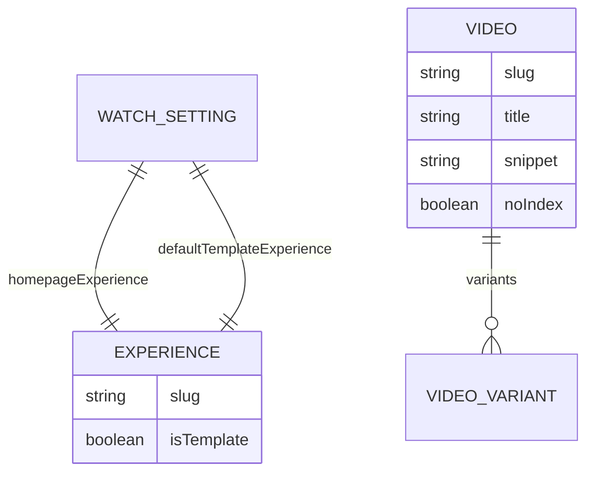
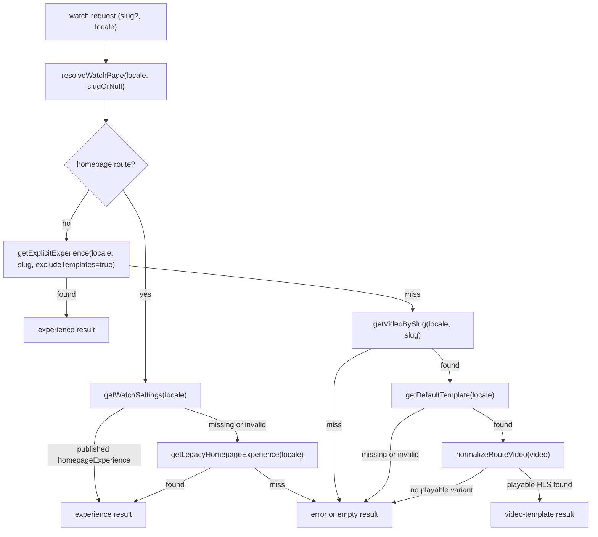

# feat: Watch Settings and Generic Single-Video Template Pages

## Overview

Move watch homepage selection into a localized `Watch Settings` singleton, mark reusable template experiences with `Experience.isTemplate`, and make `/watch/[slug]` and `/watch/[slug]/[locale]` fall back from explicit `Experience.slug` pages to `Video.slug` pages rendered through a default template experience.

This keeps templates as regular `Experience` entries. Do not add a separate `SingleVideoTemplate` content type.

## Problem Statement / Motivation

- `Experience.isHomepage` is ambiguous today. Multiple experiences can be marked homepage, and web silently uses the first GraphQL result.
- Arbitrary video slugs do not render unless a matching `Experience` exists.
- A dedicated template content type would duplicate the existing editorial block system for little benefit.
- Existing video sections require authored `streamingUrl` values, so they cannot currently bind to a route video at runtime.

## Requirements Trace

| Requirement                                                                 | Why it exists                                                                               | Plan coverage                                                        |
| --------------------------------------------------------------------------- | ------------------------------------------------------------------------------------------- | -------------------------------------------------------------------- |
| One authoritative homepage per locale                                       | Replaces ambiguous `isHomepage` behavior and gives editors one place to manage it           | `WatchSetting` single type, Unit 1, Unit 2, Acceptance Criteria 1-3  |
| Existing curated experience pages must keep working unchanged               | Explicit watch pages are already in production and should continue to win on matching slugs | Key Decision 4, Unit 2, Acceptance Criteria 4 and 9                  |
| Any matching `Video.slug` should be able to render through a default layout | Removes the need to create one `Experience` entry per video                                 | Key Decisions 2, 5, and 6, Units 2-3, Acceptance Criteria 5-8        |
| Editors should keep using the existing `Experience` block editor            | Avoids duplicating the editorial model with a one-off template type                         | Overview, Key Decision 2, Unit 1                                     |
| Route caching and on-demand revalidation must stay correct                  | Watch pages depend on Next ISR and Strapi webhooks today                                    | Context & Research, Unit 4, Test Plan                                |
| Rollout must not blank `/watch` while editors backfill settings             | New settings data will not exist in every locale on first deploy                            | Key Decision 3, Unit 2, Risks / Dependencies, Acceptance Criteria 10 |

## Scope Boundaries

- No new `SingleVideoTemplate` content type.
- No custom CMS admin page in v1; use Strapi content manager for the singleton.
- No locale-to-dubbed-variant mapping beyond the video's primary published HLS source.
- No public watch pages for template experiences by their own slug.
- No automatic bulk migration that rewrites editorial data on boot; rollout uses soft fallback behavior instead.

## Context & Research

### Repo Patterns

- `apps/web/src/lib/content.ts` currently resolves homepage with `filters: { isHomepage: { eq: true } }` and slug pages with `filters: { slug: { eq: slug } }`.
- `apps/web/src/app/page.tsx`, `apps/web/src/app/[slug]/page.tsx`, and `apps/web/src/app/[slug]/[locale]/page.tsx` all assume the result is a concrete `Experience`.
- `apps/web/src/app/api/revalidate/route.ts` only handles `model === "experience"` today.
- `apps/web/next.config.mjs` sets `basePath: "/watch"`, so `revalidatePath()` must keep using internal route paths like `/${slug}` rather than `/watch/${slug}`.
- `apps/web/src/proxy.ts` already owns locale redirects, which means watch page resolvers must stay pure functions of route params and must not reintroduce request-bound APIs such as `headers()`.
- `apps/cms/src/admin/app.tsx` proves the repo can add custom settings pages, but v1 does not need one if a Strapi singleton is sufficient.
- `sections.video` and `sections.video-hero` currently require explicit `streamingUrl`; generic pages need a route-bound mode instead.
- `ExperienceSectionRenderer`, `SectionContentRenderer`, and `SlotContentRenderer` are three separate block entry points, so route-video context must be threaded through all three to cover top-level, section-nested, and container-nested video blocks.
- `apps/web/package.json` has no automated test runner configured, so verification needs to assume typecheck/build plus manual route smoke tests unless we deliberately add new tests as follow-up work.

### Institutional Learnings

- Keep the existing route-level ISR pattern. Do not introduce `headers()` or other dynamic APIs into watch page routes.
- Continue fetching Strapi data server-side in RSCs with `fetchPolicy: "no-cache"` and let Next route caching handle freshness.
- Extend the existing webhook + `revalidatePath()` flow instead of replacing it.
- Prefer one shared cached resolver for page rendering and metadata whenever route precedence becomes more complex, so the HTML and SEO surfaces cannot drift.
- Regenerate `packages/graphql/src/graphql-env.d.ts` after every Strapi schema change; never hand-edit generated GraphQL output.

### Research Decision

No external research is needed for this plan. The repo already contains the relevant Strapi, watch-page, and revalidation patterns.

## Data Model



- Add `apps/cms/src/api/watch-setting/content-types/watch-setting/schema.json` as a localized `singleType`.
- Fields:
  - `homepageExperience`: one-to-one relation to `Experience`
  - `defaultTemplateExperience`: one-to-one relation to `Experience`
- Set `draftAndPublish: true` on `WatchSetting` so editors can stage changes consistently with the rest of the watch content model.
- Add `isTemplate: boolean` to `Experience`, default `false`, non-localized.
- Keep `Experience.isHomepage` in the schema for rollout safety, but stop using it in web. Treat it as deprecated.

## Key Decisions

1. Use a localized Strapi single type for v1, not a custom admin settings page.

   Editors can manage homepage/template selectors through built-in content manager UI. If the relation picker UX becomes too loose later, a custom settings page can sit on top of the same data model.

2. Reuse regular `Experience` entries as templates.

   `defaultTemplateExperience` must point at an `Experience` with `isTemplate=true`. `homepageExperience` must point at a non-template experience.

3. Roll out homepage settings behind a temporary legacy fallback.

   If a locale has no published `WatchSetting.homepageExperience`, the web app should temporarily fall back to the current `isHomepage` query for that locale. This avoids blanking `/watch` or `/watch/<locale>` during rollout. There is no equivalent fallback for generic single-video templates; if no default template is configured, unmatched video slugs should continue to show the current empty/error state.

4. Public explicit experience slugs win over video slugs.

   Route resolution order is:
   - homepage locale alias (`/watch/en`, `/watch/es`, etc.)
   - explicit `Experience.slug` where `isTemplate!==true`
   - fallback `Video.slug` + default template
   - existing empty/error state

   Template experiences are fetched only through `Watch Settings.defaultTemplateExperience`, not exposed as public watch pages by their own slug. Page rendering and metadata must both use this same precedence helper so they cannot resolve different content for the same URL.

5. Generic pages reuse existing video blocks via a route-video switch.

   Add `useRouteVideo: boolean` to `sections.video` and `sections.video-hero`. When true, the renderer ignores authored playback data and binds to the current route video instead.

   Because Strapi component JSON cannot express the desired conditional validation cleanly, runtime rendering must continue to treat authored `streamingUrl` as required whenever `useRouteVideo!==true`.

6. Template playback source is chosen from `Video.variants`, not from site locale.

   Use the first published HLS variant in this order:
   - a variant whose language matches `video.primaryLanguage`
   - otherwise the first published variant with non-empty `hls`

   If no playable variant exists, render the existing watch error state instead of a broken player.

7. Generic fallback pages use video metadata.

   When a route resolves through a template, SEO metadata should come from the resolved `Video` record: `title`, `snippet ?? description`, first image, and `noIndex`.

8. Settings misconfiguration fails soft.

   If `homepageExperience` points at a template, or `defaultTemplateExperience` points at a non-template, log a warning and ignore the invalid relation rather than crashing.

9. No cross-locale fallback in v1.

   Explicit locale routes keep current semantics: resolve data in the requested locale only. Unqualified routes continue to use `DEFAULT_LOCALE`.

## High-Level Technical Design

This section is intentionally non-prescriptive. It captures the route-resolution flow and where normalization belongs, without locking implementation into exact function signatures.



- `resolveWatchPage` should be the single cache-wrapped entry point used by `page.tsx` and metadata generation. That keeps route precedence, rollout fallback, and error handling aligned across both surfaces.
- `normalizeRouteVideo` should run on the server and return a render-ready shape with poster image, text, `noIndex`, and streaming URL already resolved. Client components should not inspect `Video.variants` or guess which asset to play.
- Internal cache invalidation should continue using paths without the `/watch` prefix because the Next app is mounted with `basePath: "/watch"`.

## Public Interfaces / Types

- New CMS single type: `WatchSetting`
- New `Experience` field: `isTemplate: boolean`
- New section fields:
  - `ComponentSectionsVideo.useRouteVideo: boolean`
  - `ComponentSectionsVideoHero.useRouteVideo: boolean`
- New web resolver union in `apps/web/src/lib/content.ts`:

  ```ts
  type ResolvedWatchPage =
    | { kind: "experience"; experience: WatchExperience }
    | {
        kind: "video-template"
        template: WatchExperience
        routeVideo: RouteVideo
      }

  type WatchPageResult =
    | { data: ResolvedWatchPage; error: null }
    | { data: null; error: ErrorLike | Error }
  ```

- New route video type limited to what the renderer needs:

  ```ts
  type RouteVideo = {
    documentId: string
    slug: string
    title: string
    snippet: string | null
    description: string | null
    noIndex: boolean
    imageUrl: string | null
    imageAlt: string | null
    streamingUrl: string | null
  }
  ```

## Implementation Units

### 1. CMS Model and GraphQL Contract

**Goal:** Add settings/template fields and update the generated schema.

**Files**

- `apps/cms/src/api/watch-setting/content-types/watch-setting/schema.json` (new)
- `apps/cms/src/api/experience/content-types/experience/schema.json`
- `apps/cms/src/components/sections/video.json`
- `apps/cms/src/components/sections/video-hero.json`
- `packages/graphql/src/graphql-env.d.ts` (generated)

**Changes**

- Add `WatchSetting` localized single type with draft/publish enabled.
- Add `Experience.isTemplate`.
- Add `useRouteVideo` to `video` and `video-hero`.
- Make `streamingUrl` and explicit `video` relation optional in template-capable video blocks.
- Add field descriptions/help text clarifying homepage vs default template selection.
- Regenerate GraphQL schema/types after Strapi changes before authoring new typed web queries, so the web work can stay on `@forge/graphql` typed operations instead of temporary untyped GraphQL documents.

**Non-goals**

- No new `SingleVideoTemplate` content type.
- No custom admin page in this first rollout.

### 2. Watch Page Resolution and Metadata

**Goal:** Resolve homepage, explicit experiences, and generic video pages through one server-side entry point.

**Files**

- `apps/web/src/lib/content.ts`
- `apps/web/src/app/page.tsx`
- `apps/web/src/app/[slug]/page.tsx`
- `apps/web/src/app/[slug]/[locale]/page.tsx`
- `apps/web/src/lib/experience-metadata.ts`

**Changes**

- Add `getWatchSettings(locale)`.
- Add `getLegacyHomepageExperience(locale)` as a temporary rollout fallback used only when no valid published watch setting exists for that locale.
- Add `getVideoBySlug(locale, slug)` that fetches `Video` metadata plus `variants { hls, published, language }` and `primaryLanguage`.
- Replace direct route calls to `getWatchExperience(...)` with a new `resolveWatchPage(...)`.
- Add a metadata helper built on top of the same resolver instead of maintaining a second precedence path in `experience-metadata.ts`.
- Homepage resolves through `WatchSetting.homepageExperience`, falling back to legacy `isHomepage` only while settings are absent or invalid during rollout.
- Slug routes use precedence: locale alias -> explicit non-template experience -> video template fallback.
- Generic template fallback stays disabled when `defaultTemplateExperience` is missing or invalid.
- Normalize route-video playback source and poster data on the server before any section rendering begins.
- Generic metadata uses `Video.title`, `snippet ?? description`, first image, `imageAlt ?? title`, and `noIndex`.

**Defaults**

- Keep `DEFAULT_LOCALE` for unqualified routes.
- Preserve current `/watch/<locale>` homepage shortcut behavior.

### 3. Template-Aware Section Rendering

**Goal:** Let template experiences bind their primary player blocks to the route video without duplicating section types.

**Files**

- `apps/web/src/components/sections/index.tsx`
- `apps/web/src/components/sections/Section.tsx`
- `apps/web/src/components/sections/Container.tsx`
- `apps/web/src/components/sections/Video.tsx`
- `apps/web/src/components/sections/VideoHero.tsx`
- `apps/web/src/lib/fragments/video-section.ts`
- `apps/web/src/lib/fragments/video-hero.ts`

**Changes**

- Thread optional `routeVideo` through top-level, section-nested, and container-nested renderers.
- When `useRouteVideo=false`, preserve existing behavior exactly.
- When `useRouteVideo=true`, `Video` and `VideoHero` pull poster/title/subtitle/stream source from `routeVideo`.
- When `useRouteVideo!==true`, treat authored playback data as still required at runtime; malformed blocks should fail soft with a warning rather than crashing the whole route.
- Keep CTA fields CMS-authored.
- For `VideoHero`, use authored `heading` and `subheading` when provided; otherwise fall back to route video `title` and `snippet ?? description`.

**Non-goals**

- No route-video mode for `VideoCarousel` or `MediaCollection` in v1.
- No new section type just for template pages.

### 4. Revalidation, Cache Behavior, and Validation

**Goal:** Keep ISR behavior correct once watch routes depend on settings, template experiences, and route videos.

**Files**

- `apps/web/src/app/api/revalidate/route.ts`
- `apps/cms/src/bootstrap/revalidation-webhook.ts`

**Changes**

- Extend the webhook handler to accept:
  - `model === "experience"` for explicit pages and homepage/template changes
  - `model === "video"` to revalidate matching generic pages when a route video changes
  - `model === "watch-setting"` to revalidate homepage paths
- Revalidate these internal paths:
  - homepage aliases: always `"/"` plus `"/${locale}"` for every entry in `SUPPORTED_LOCALES`
  - `experience` with slug + locale: `/${slug}/${locale}` and additionally `/${slug}` when `locale === DEFAULT_LOCALE`
  - `video` with slug + locale: `/${slug}/${locale}` and additionally `/${slug}` when `locale === DEFAULT_LOCALE`
  - `video` with slug but no reliable locale: `/${slug}` plus all `/${slug}/${supportedLocale}` paths
- Keep `revalidate = 60` as the safety net for broad invalidation cases that cannot be enumerated from a webhook payload, especially:
  - edits to the default template experience itself
  - changes to `WatchSetting.defaultTemplateExperience`
- Do not introduce `revalidateTag()` in this work; the current route-level ISR pattern is already established and works with Apollo's server-side query setup.
- Add runtime guards:
  - ignore `homepageExperience` when it points at `isTemplate=true`
  - ignore `defaultTemplateExperience` when `isTemplate!==true`
  - ignore route-video playback when no published HLS variant exists

## System-Wide Impact

- **Route + metadata parity:** homepage pages, slug pages, and metadata generation all need to consume the same resolver so SEO cannot describe one entity while the page renders another.
- **CMS publishing lifecycle:** `WatchSetting` becomes part of the published-content path, so unpublished or invalid relations must degrade gracefully instead of breaking watch routes.
- **Caching semantics:** proxy-based locale redirects remain unchanged; page routes stay param-driven and cacheable, and revalidation continues to target internal paths because of `basePath: "/watch"`.
- **Renderer contract:** adding `routeVideo` is a cross-cutting prop change across top-level sections and nested section containers, not just a single component tweak.
- **Codegen workflow:** the new single type and component fields change the GraphQL contract for both `apps/cms` and `packages/graphql`, so codegen becomes a hard dependency before web implementation can settle.

## Acceptance Criteria

- [x] Editors can mark an `Experience` as a template with `isTemplate`.
- [x] Editors can pick one homepage experience and one default watch template in `Watch Settings`.
- [x] `/watch` no longer depends on `isHomepage`; it uses `Watch Settings.homepageExperience`.
- [x] `/watch/[slug]` and `/watch/[slug]/[locale]` still render explicit non-template experiences unchanged when one exists.
- [x] Template experiences are not rendered as public watch pages through their own slug.
- [x] When no experience exists but a `Video.slug` matches, the route renders through the default template experience.
- [x] A template experience can use existing `video` and `video-hero` blocks in `useRouteVideo` mode without hardcoding the video record or streaming URL.
- [x] Generic fallback pages derive SEO metadata from the matched `Video`.
- [x] Existing non-template experience pages are unaffected.
- [x] During rollout, `/watch` and `/watch/<locale>` still render through the legacy homepage query when the new localized `Watch Settings` entry has not been published yet.
- [x] If no valid default template is configured, unmatched video slugs continue to fail in the existing controlled way rather than rendering a broken template.
- [x] GraphQL codegen is regenerated and web typecheck/build pass.

## Test Plan

Because `apps/web` does not currently ship an automated page test suite, this rollout needs explicit manual route smoke checks alongside typecheck/build verification.

### CMS Model

- Create a non-template experience and a template experience; confirm both save and appear in GraphQL.
- Create localized `Watch Settings` entries and confirm selectors persist.

### Route Resolution

- `/watch` renders the selected homepage experience.
- `/watch/en` and other locale-homepage aliases still resolve correctly.
- If `Watch Settings` is unpublished or missing for a locale, homepage resolution falls back to the current `isHomepage` behavior for that locale.
- An explicit experience slug beats a same-name video slug.
- A video slug with no matching experience renders the default template.
- A slug with neither experience nor video still shows the current empty/error state.

### Template Rendering

- `useRouteVideo=false` keeps current video block behavior.
- `useRouteVideo=true` renders player/poster/title copy from the route video.
- Missing HLS variant produces a controlled error state rather than a broken player.
- A malformed authored block without `useRouteVideo=true` and without `streamingUrl` fails soft instead of crashing the full page.

### Revalidation

- `experience` webhook still revalidates explicit pages.
- `video` webhook revalidates matching generic pages.
- `watch-setting` webhook revalidates homepage paths.
- Editing the default template experience eventually updates generic video pages via the 60-second ISR safety net even though those paths cannot be enumerated directly.

### Verification Commands

- `cd apps/cms && pnpm codegen`
- `cd packages/graphql && pnpm generate`
- `cd apps/web && pnpm typecheck`
- `cd apps/web && pnpm build`

### Implementation Notes

- Explicit experience rendering was smoke-tested locally against the seeded `christmas` experience after reseeding the local CMS.
- Generic video-template fallback logic was implemented and verified through typecheck/build, but not fully smoke-tested end-to-end because no local `Watch Settings.defaultTemplateExperience` entry was authored in this run.

## Risks / Dependencies

- **Rollout dependency:** editors must create and publish `Watch Settings` entries per locale.
  Mitigation: keep homepage reads on a temporary legacy `isHomepage` fallback until settings are populated and verified.
- **Template-wide cache invalidation is not enumerable:** when the default template experience or default template selector changes, the app cannot cheaply list every affected video slug.
  Mitigation: rely on the existing `revalidate = 60` safety net for those broad invalidation cases and document that behavior as intentional.
- **Template block validation gets weaker at the schema level:** making `streamingUrl` optional enables route-bound templates but also allows malformed authored blocks.
  Mitigation: add explicit help text in CMS and fail soft at render time when a non-template block is missing required authored playback data.
- **Editor relation pickers remain broad:** Strapi’s built-in picker will show all experiences, not only template-marked ones.
  Mitigation: runtime validation plus field descriptions in v1; add a custom admin UI only if editorial mistakes become frequent.
- **No automated web route tests exist today:** regressions in precedence or metadata can slip through if we rely only on types.
  Mitigation: keep the resolver centralized, verify with manual route smoke tests, and consider resolver-focused tests as a follow-up if this surface keeps evolving.

## Operational / Rollout Notes

- Ship schema and resolver changes with homepage fallback still enabled.
- Create and publish localized `Watch Settings` entries and at least one published template-marked experience per locale that needs generic video fallback.
- Verify homepage aliases and one generic video route per enabled locale before removing the legacy `isHomepage` fallback in a separate follow-up.

## References & Research

- `apps/web/src/lib/content.ts`
- `apps/web/src/app/page.tsx`
- `apps/web/src/app/[slug]/page.tsx`
- `apps/web/src/app/[slug]/[locale]/page.tsx`
- `apps/web/src/app/api/revalidate/route.ts`
- `apps/web/src/proxy.ts`
- `apps/web/next.config.mjs`
- `apps/web/src/components/sections/index.tsx`
- `apps/web/src/components/sections/Section.tsx`
- `apps/web/src/components/sections/Container.tsx`
- `apps/cms/src/api/experience/content-types/experience/schema.json`
- `apps/cms/src/api/video/content-types/video/schema.json`
- `apps/cms/src/api/video-variant/content-types/video-variant/schema.json`
- `apps/cms/src/components/sections/video.json`
- `apps/cms/src/components/sections/video-hero.json`
- `docs/solutions/web/nextjs16-cachecomponents-isr.md`
- `docs/solutions/web/nextjs-headers-defeats-route-cache.md`
- `docs/solutions/graphql/server-side-strapi-queries-nextjs.md`
- `docs/solutions/cms/strapi-v5-bootstrap-webhook-seeding.md`
