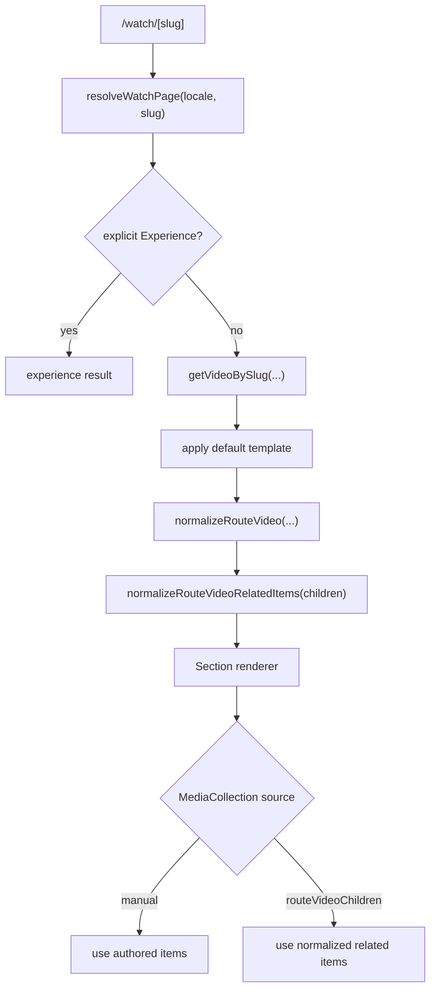

# feat: Single-Video Template Related Media Collection

## Overview

Allow `MediaCollection` blocks inside the generic single-video watch template to render runtime-related content for the current route video instead of only static CMS-authored `items`.

The existing `MediaCollection` block stays manual by default. Editors opt into route-driven behavior on a per-block basis for template pages.

## Problem Statement / Motivation

- Generic single-video pages now support route-bound `Video` and `VideoHero` blocks, but `MediaCollection` is still static.
- That means a reusable single-video template cannot show “related videos” for the current route video unless editors manually author items per video, which defeats the point of the template system.
- The CMS already has curated video graph data via `Video.children` / `Video.parents`; the watch template should be able to reuse that without creating one `Experience` per video.

## Requirements Trace

| Requirement                                                                                       | Why it exists                                                         | Plan coverage                                                   |
| ------------------------------------------------------------------------------------------------- | --------------------------------------------------------------------- | --------------------------------------------------------------- |
| `MediaCollection` must stay backward-compatible for normal pages                                  | Existing watch experiences rely on manual `items`                     | Scope, Key Decisions 1-2, Unit 1, Acceptance Criteria 1         |
| A single-video template page must be able to show route-specific related media                    | Editors need one reusable layout for arbitrary `Video.slug` routes    | Overview, Key Decisions 2-4, Units 2-3, Acceptance Criteria 2-5 |
| The runtime should use an existing video relationship, not invent an opaque recommendation system | Repo already syncs curated relations from core API                    | Context & Research, Key Decision 3                              |
| Empty or sparse related data must fail soft                                                       | Some videos may not have related children in local or production data | Key Decision 5, Risks, Acceptance Criteria 6                    |
| The watch route should continue resolving through one shared server-side path                     | Avoid page/metadata drift and preserve current caching model          | Context & Research, Unit 2, Acceptance Criteria 7               |

## Scope Boundaries

- No automatic recommendations based on keywords, embeddings, or study questions in v1.
- No change to route precedence or generic single-video template resolution.
- No client-side fetching inside `MediaCollection`; keep data assembly on the server via existing `packages/graphql` flow.
- No removal of manual `items` authoring.
- No mobile implementation in this change unless separately requested.

## Context & Research

### Repo Patterns

- `apps/web/src/lib/content.ts` already resolves generic single-video routes through one shared `resolveWatchPage(...)` path and normalizes route-bound playback metadata into `RouteVideo`.
- `apps/web/src/components/sections/index.tsx`, `Section.tsx`, and `Container.tsx` already thread `routeVideo` into route-aware sections (`Video`, `VideoHero`) across top-level, nested section, and container slot renderers.
- `apps/web/src/components/sections/MediaCollection.tsx` currently only enriches static CMS `items` and returns `null` when `items` is empty.
- `apps/web/src/lib/enrichment.ts` already defines the card-ready `EnrichedMediaItem` shape used by `MediaCollection`.
- `apps/cms/src/components/sections/media-collection.json` contains editorial heading/copy/CTA fields plus manual `items`; there is no runtime source selector today.
- `apps/cms/src/api/video/content-types/video/schema.json` includes curated self-referential `children` / `parents` relations populated by core sync.
- The local snapshot has real related-graph data: for the published `jesus` video, `children=61` and `parents=4`, so there is enough existing data to ground a runtime-related-content feature.

### Institutional Learnings

- Keep GraphQL field additions fully threaded through the whole pipeline. `docs/solutions/mobile/media-collection-overlay-carousel-pipeline.md` shows how missing one fragment layer causes fields to appear null even when CMS data exists.
- Keep watch data server-normalized and route-cached; do not push relationship selection into client components.
- Preserve explicit editorial control wherever runtime fallback is added. The current watch-template work already follows this pattern with `useRouteVideo` instead of replacing authored video behavior globally.

### Research Decision

No external research is needed. The repo already has the relevant watch-template, GraphQL, and media-collection patterns, plus an existing curated related-video graph in the CMS data model.

## Key Decisions

1. Add an explicit source selector to `MediaCollection`.

   The block should remain manual unless an editor deliberately switches it to a route-driven mode. This avoids surprising changes to existing pages.

2. Reuse existing editorial wrapper fields.

   `title`, `subtitle`, `description`, `categoryLabel`, `ctaLink`, and `ctaLabel` remain CMS-authored. Only the item list becomes runtime-populated when the block is in related-content mode.

3. Define “related” in v1 as `routeVideo.children`.

   `Video.children` is the strongest repo-native signal because it is curated, already synced from the core API, and materially populated. `parents` are inverse links and are better treated as fallback or future extension, not the primary related-content source in v1.

4. Normalize related items on the server into the existing `EnrichedMediaItem` shape.

   `MediaCollection` should keep rendering one unified item shape. Route-derived related videos should be mapped into the same shape as manual items instead of creating a second rendering path.

5. Empty related data fails soft.

   If the current route video has no related children, the block should render nothing by default rather than throwing or rendering a broken carousel.

6. Route-driven related content is only meaningful on generic single-video pages.

   If a `MediaCollection` block is configured for route-related mode on a non-template experience page, the runtime should degrade safely to no items and log a development warning rather than guessing.

## High-Level Technical Design



- Extend the route-video server payload to include a small normalized related-items array derived from `Video.children`.
- Add a source field on `ComponentSectionsMediaCollection`, for example:
  - `manual`
  - `routeVideoChildren`
- Update `MediaCollection` to choose between authored CMS `items` and `routeVideo.relatedItems` based on that source field.
- Keep the card rendering path unchanged by mapping route-related videos into `EnrichedMediaItem`.

## Public Interfaces / Types

### CMS

- Update `apps/cms/src/components/sections/media-collection.json`
- Add a new enum field, e.g.:

```json
{
  "itemsSource": {
    "type": "enumeration",
    "enum": ["manual", "routeVideoChildren"],
    "default": "manual",
    "required": false
  }
}
```

Optional help text:

- `manual`: use authored `items`
- `routeVideoChildren`: ignore authored `items` and use the current route video's related children

### Web

Either extend `RouteVideo` or introduce a nested related-item type:

```ts
type RouteVideoRelatedItem = {
  documentId: string
  slug: string
  title: string
  label: string | null
  imageUrl: string | null
}

type RouteVideo = {
  documentId: string
  slug: string
  title: string
  snippet: string | null
  description: string | null
  noIndex: boolean
  imageUrl: string | null
  imageAlt: string | null
  streamingUrl: string | null
  relatedItems: RouteVideoRelatedItem[]
}
```

## Alternative Approaches Considered

### 1. Auto-populate every empty `MediaCollection` on template pages

Rejected because it is too implicit. An editor could leave `items` empty intentionally and get unrelated runtime behavior without any visible CMS signal.

### 2. Add a dedicated `RelatedMediaCollection` block

Rejected for now because it duplicates the existing layout/copy variants of `MediaCollection` and creates more editorial concepts than the repo needs.

### 3. Use `parents + children + keyword overlap`

Rejected for v1 because it adds ranking logic and ambiguity. `children` is already curated and sufficient for the initial implementation.

## Implementation Units

### 1. CMS Block Contract

**Goal:** Let editors opt a `MediaCollection` block into route-derived related content.

**Files**

- `apps/cms/src/components/sections/media-collection.json`
- `apps/cms/schema.graphql`
- `packages/graphql/src/graphql-env.d.ts`

**Changes**

- Add a source selector field to `MediaCollection`.
- Keep `items` present for manual mode.
- Regenerate GraphQL outputs so the web app can read the new selector through typed fragments.

**Non-goals**

- No new content type
- No new admin page

### 2. Route Video Query + Normalization

**Goal:** Fetch and normalize related children for generic single-video pages.

**Files**

- `apps/web/src/lib/content.ts`
- `apps/web/src/lib/experience-metadata.ts` if metadata helpers share route types

**Changes**

- Extend `GET_ROUTE_VIDEO` to request child video data needed for cards:
  - `documentId`
  - `slug`
  - `title`
  - `label`
  - `images { url }`
- Add server normalization for related children:
  - exclude nulls
  - exclude self by `documentId` / `slug`
  - prefer stable order from Strapi relation ordering
  - optionally cap count defensively for large graphs
- Attach normalized related items to the existing route-video result so section renderers can use them without extra fetches.

### 3. Media Collection Runtime Rendering

**Goal:** Let `MediaCollection` choose between manual items and route-derived related items.

**Files**

- `apps/web/src/lib/fragments/media-collection.ts`
- `apps/web/src/components/sections/MediaCollection.tsx`
- `apps/web/src/components/sections/index.tsx`
- `apps/web/src/components/sections/Section.tsx`
- `apps/web/src/components/sections/Container.tsx`
- `apps/web/src/lib/enrichment.ts` if the shared item shape needs a helper for route-derived records

**Changes**

- Add the new source field to the media collection fragment.
- Thread `routeVideo` into `MediaCollection` the same way `Video` and `VideoHero` already receive it.
- Compute:
  - manual mode -> current authored/enriched items
  - route-video mode -> normalized `routeVideo.relatedItems`
- Keep the existing variants (`carousel`, `grid`, `collection`, `hero`, `player`) working with either data source.
- Continue returning `null` when the selected source yields zero items.

### 4. Template QA and Guardrails

**Goal:** Make the behavior understandable and safe for editors.

**Files**

- `docs/plans/2026-04-06-feat-single-video-related-media-collection-plan.md`
- Optional inline CMS descriptions in `media-collection.json`

**Changes**

- Document that `routeVideoChildren` is intended for single-video template pages.
- Confirm manual collections on existing experience pages remain unchanged.
- Confirm route-video mode degrades safely when used outside a generic single-video page or when the current video has no children.

## SpecFlow Analysis

### Primary User Flow

1. Editor opens the default single-video template `Experience`
2. Editor adds or edits a `MediaCollection` block
3. Editor sets its source to `routeVideoChildren`
4. User visits `/watch/[video-slug]`
5. Route resolves to generic single-video template
6. `MediaCollection` renders cards for the route video’s curated child videos

### Edge Cases

- Video has zero children: block renders nothing, page remains healthy
- Video has many children: rendering should preserve relation order and cap item count if needed
- Editor leaves manual `items` in the block while selecting route mode: runtime ignores them, but CMS data is preserved if they switch back to manual
- Block is nested inside `Section` or `Container`: route-video context must still reach it
- Localized route video lacks localized child titles: plan should tolerate null titles and fall back safely
- Explicit non-template experience uses route mode accidentally: degrade safely, avoid hard runtime errors

### Acceptance Criteria

- [x] Existing manual `MediaCollection` blocks render unchanged on normal experience pages
- [x] `MediaCollection` has an explicit CMS source selector with `manual` as the default
- [x] A generic single-video template page can render related items for the current route video without authored manual `items`
- [x] Related-item data comes from the current route video’s curated `children` relation in v1
- [x] The same route-driven behavior works for top-level, `Section`-nested, and `Container`-nested media collection blocks
- [x] If the route video has no related children, the block fails soft and the page still renders normally
- [x] The watch route continues using the shared `resolveWatchPage(...)` server path; no client-side fetching is introduced

## Dependencies & Risks

### Dependencies

- The generic single-video template system from `2026-04-04-feat-watch-settings-single-video-template-pages-plan.md`
- Current GraphQL/codegen flow for CMS schema changes
- Existing `Video.children` sync quality from core-sync

### Risks

- Some videos may have sparse or noisy `children` data, which could make “related” feel inconsistent across titles
- Adding a new media collection source field requires careful fragment/codegen updates across top-level and nested render paths
- Passing route-derived related items through the existing item pipeline could expose assumptions in `enrichMediaItem(...)` that currently only hold for CMS-authored items

### Mitigations

- Keep the source explicit and opt-in
- Normalize route-related records into the exact shape `MediaCollection` already expects
- Fail soft on empty related data
- Verify nested render paths, not just top-level blocks

## Success Metrics

- Editors can configure a single `MediaCollection` block on the single-video template and see route-specific related cards across different `/watch/[slug]` pages
- No regressions to existing authored media collection pages
- No new runtime error states on videos without related children

## Verification

- `pnpm --filter @forge/graphql generate`
- `pnpm --filter @forge/cms build`
- `pnpm --filter @forge/cms typecheck`
- `pnpm --filter @forge/web typecheck`
- `pnpm --filter @forge/web build`
- Manual smoke:
  - configure the single-video template with a `MediaCollection` using `routeVideoChildren`
  - visit at least two generic routes such as `/watch/jesus` and another video with different child relations
  - verify the card set changes with the route video
  - verify a normal curated page with manual media collection items is unchanged
  - verify a route with zero children still renders the rest of the page cleanly

### Verification Outcome

- Completed codegen and builds:
  - `pnpm --filter @forge/graphql generate`
  - `pnpm --filter @forge/cms build`
  - `pnpm --filter @forge/cms typecheck`
  - `pnpm --filter @forge/web typecheck`
  - `pnpm --filter @forge/web build`
- Manual smoke on local dev servers after restarting Strapi to load the new schema:
  - `/watch/jesus` rendered a `Related Videos` carousel with route-derived cards including `The Beginning`, `Birth of Jesus`, and `Childhood of Jesus`
  - `/watch/my-last-day` rendered the same block with a different route-derived card set, showing `My Last Day - Trailer`
  - `/watch/christmas` preserved its authored manual collection and did not render the `Related Videos` template block

## References & Research

- Internal patterns:
  - `apps/web/src/lib/content.ts`
  - `apps/web/src/components/sections/MediaCollection.tsx`
  - `apps/web/src/lib/enrichment.ts`
  - `apps/web/src/components/sections/index.tsx`
  - `apps/web/src/components/sections/Section.tsx`
  - `apps/web/src/components/sections/Container.tsx`
  - `apps/cms/src/components/sections/media-collection.json`
  - `apps/cms/src/components/sections/media-collection-item.json`
  - `apps/cms/src/api/video/content-types/video/schema.json`
- Existing plan:
  - `docs/plans/2026-04-04-feat-watch-settings-single-video-template-pages-plan.md`
- Institutional learning:
  - `docs/solutions/mobile/media-collection-overlay-carousel-pipeline.md`
