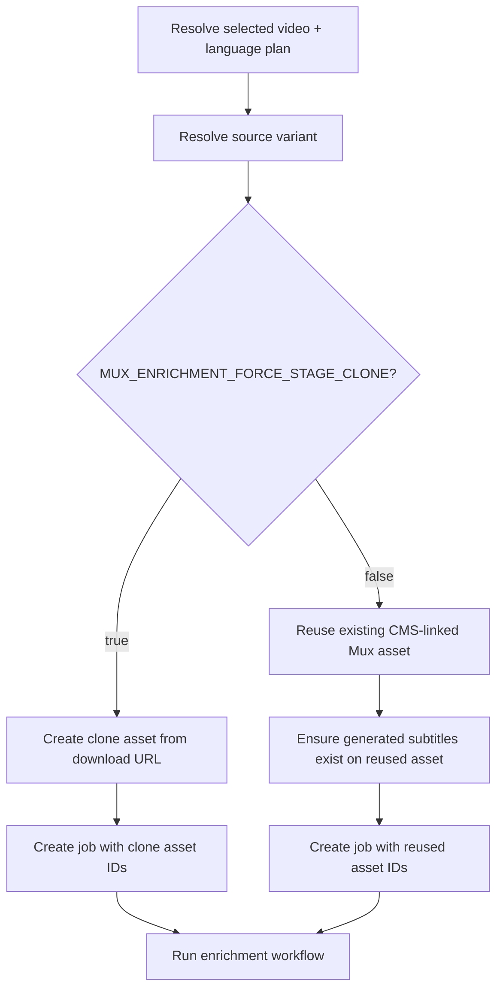

# feat: Gate Mux clone enrichment by environment

## Overview

Add an explicit manager feature flag so non-production environments can keep the
current clone-first enrichment workflow, while production can process directly
against the existing CMS-linked Mux asset without creating a duplicate asset for
every job.

Desired behavior:

- local/dev/stage deployments set a flag and continue the current
  `snapshot_to_stage_clone` behavior
- production leaves that flag unset and skips per-job Mux asset duplication
- both modes keep the same language-selection policy and job/artifact outputs
- job metadata stays honest about which Mux asset was processed and why

## Problem Statement

The current branch assumes the same materialization strategy everywhere:

- select a downloadable source variant
- create a fresh Mux asset for the job
- run enrichment on that new asset

That strategy was the right safety boundary for dev and staging, where imported
CMS data points at production Mux assets while the manager runtime uses
non-production Mux credentials.

But it is no longer the right default for production:

- production CMS `muxVideo.assetId` values already point at the same Mux
  environment the manager should process in
- cloning every selected video creates unnecessary duplicate assets and extra
  preparation work
- the current code hard-codes the stage-clone path into `/api/enrich`, so there
  is no way to opt out cleanly

We need a strategy split:

- keep clone-first as the explicit safety mode for non-production environments
- use direct asset reuse in production by default

## Found Brainstorm

No directly relevant recent brainstorm was found for this exact scope.

## Research Summary

### Internal findings

The current behavior is defined by the stage-materialization work:

- `docs/plans/2026-04-01-feat-stage-materialization-for-snapshot-enrichment-plan.md`
- `apps/manager/src/services/stageClone.ts`
- `apps/manager/src/app/api/enrich/route.ts`

Right now `/api/enrich` always:

1. fetches selected videos and variants from CMS
2. resolves a downloadable source URL
3. calls `createStageCloneForJob(...)`
4. creates the `EnrichmentJob` against the new clone asset

The job metadata reflects that assumption:

- `mode: "snapshot_to_stage_clone"`
- `sourceEnvironment: "mux-production"`
- `targetEnvironment: "mux-stage"`

The current transcription step in `apps/manager/src/services/transcription.ts`
does **not** create subtitles. It only:

- waits for a ready subtitle track on the given asset
- downloads the VTT text track
- writes transcript and subtitle artifacts

That means a direct-production path cannot just stop cloning; it also needs a
way to ensure generated subtitles exist on the reused asset.

### External Mux findings

Mux’s current official docs confirm two important things:

1. Auto-generated subtitles can be requested when creating an asset.
2. Auto-generated subtitles can also be added later to an existing asset via
   the `generate-subtitles` endpoint on the asset’s audio track.

Sources:

- [Add auto-generated captions to your videos and use transcripts](https://www.mux.com/docs/guides/add-autogenerated-captions-and-use-transcripts)
- [VOD auto-generated captions are now available in 22 languages](https://www.mux.com/blog/guau-wauw-vau-wow-vod-auto-generated-captions-are-now-available-in-22-languages)

That makes a no-clone production path technically viable without changing the
core transcript parsing model.

## Changed Strategy

This plan intentionally changes one assumption from
`2026-04-01-feat-stage-materialization-for-snapshot-enrichment-plan.md`.

Old assumption:

- per-job stage cloning is the universal enrich path

New assumption:

- per-job cloning is a **flagged materialization mode** for environments where
  CMS-linked Mux assets do not belong to the runtime’s Mux environment
- direct processing against the existing CMS-linked asset is the default when
  the runtime and CMS-linked asset environment already match

The original stage-materialization plan remains correct for local/dev/staging.
This plan narrows that behavior instead of deleting it.

## Proposed Solution

### 1. Introduce an explicit clone-mode feature flag

Add a server env flag in `apps/manager/src/config/env.ts`:

Suggested name:

- `MUX_ENRICHMENT_FORCE_STAGE_CLONE`

Suggested semantics:

- `true`:
  - keep today’s behavior
  - resolve a downloadable source
  - create a new clone asset
  - run enrichment on the clone
- `false` or missing:
  - do not clone
  - run enrichment against the existing CMS-linked Mux asset

Why a flag instead of `NODE_ENV`:

- stage deployments often still run with `NODE_ENV=production`
- the real distinction is Mux asset/environment alignment, not framework mode

### 2. Separate source selection from materialization strategy

`apps/manager/src/services/stageClone.ts` currently mixes two concerns:

- choosing the best source variant/language
- creating a new asset from a downloadable MP4

Refactor the boundary into two explicit phases:

1. `resolveEnrichmentSource(...)`
   - choose the best Mux-backed source variant using the current language
     priority rules
   - capture:
     - source video core ID
     - source language metadata
     - source Mux asset ID
     - source Mux playback ID
     - optional downloadable MP4 URL
2. `materializeEnrichmentTarget(...)`
   - if clone flag is on:
     - require a downloadable source URL
     - create a new asset
   - if clone flag is off:
     - reuse the existing source Mux asset and playback ID directly

This keeps language-selection correctness shared across both modes while making
downloadable-URL requirements clone-only.

### 3. Add a direct-processing materialization mode

Introduce a second durable materialization mode beside
`snapshot_to_stage_clone`, for example:

```ts
type JobMaterializationMode =
  | "snapshot_to_stage_clone"
  | "direct_mux_asset_reuse"
```

For direct reuse jobs, persist metadata like:

```ts
{
  mode: "direct_mux_asset_reuse",
  sourceVideoCoreId: "...",
  sourceMuxAssetId: "...",
  sourceMuxPlaybackId: "...",
  sourceLanguageId: "...",
  sourceLanguageCode: "en",
  sourceSelectionReason: "requested",
  sourceSelectionAttemptedCodes: ["ru", "en", "es", "fr"],
  sourceEnvironment: "mux-production",
  targetEnvironment: "mux-production",
  reusedMuxAssetId: "...",
  reusedMuxPlaybackId: "..."
}
```

This keeps the job detail page and future audits honest:

- clone mode means “new asset created”
- direct mode means “original asset reused”

### 4. Ensure subtitles exist on direct-production jobs

Because `transcription.ts` only waits for ready subtitle tracks, direct mode
needs an additive Mux helper that can ensure generated subtitles exist on an
existing asset before transcription begins.

Recommended addition in `apps/manager/src/services/mux.ts`:

- retrieve asset tracks
- resolve the primary audio track
- detect whether a usable generated subtitle track already exists for the chosen
  source language
- if not, call Mux’s retroactive `generate-subtitles` API for that asset/audio
  track and language

Recommended behavior:

- if a ready generated track already exists, do nothing
- if a generated track is already preparing, do nothing and let the current
  polling logic wait
- if no generated track exists, request one
- if the asset cannot support subtitle generation, fail with a clear direct-mode
  error instead of silently falling back to clone mode

### 5. Keep clone mode as the current non-production safety boundary

When `MUX_ENRICHMENT_FORCE_STAGE_CLONE=true`, preserve current logic:

- resolve only trusted downloadable MP4 sources
- create a new asset for every job
- record `targetEnvironment: "mux-stage"`
- never process directly against production-linked asset IDs in dev/stage

This is the guardrail that still protects local and staging when their CMS data
points at production Mux.

### 6. Update `/api/enrich` to branch on materialization mode

Refactor `apps/manager/src/app/api/enrich/route.ts` so the route chooses a
materialization path before creating the job:



The route should keep the same response contract:

- `jobs[]`
- `errors[]`

but the error reasons will differ by mode:

- clone mode can still fail on missing downloadable MP4
- direct mode can fail on missing usable Mux asset or subtitle-generation
  setup

### 7. Keep the workflow stage-agnostic

`runVideoEnrichment()` should continue to process whatever `muxAssetId` it
receives.

Do not teach the workflow to understand:

- clone mode
- direct mode
- production vs staging policy

That decision belongs in `/api/enrich` and the materialization helpers.

### 8. Keep the job environment indicator additive and honest

`apps/manager/src/lib/mux-environment.ts` already interprets clone jobs as
staging and defaults missing metadata to production.

After this change:

- clone jobs should still surface as staging
- direct-reuse jobs should explicitly persist `targetEnvironment:
"mux-production"`
- the existing environment indicator from `feat-047` should continue to work
  without guesswork

## Technical Considerations

### Identifier and playback guarantees

Direct mode should only reuse a source variant when both exist:

- `muxVideo.assetId`
- `muxVideo.playbackId`

If either is missing, fail closed with a clear per-video error.

### Source selection policy should not fork

The language-priority logic from:

- `docs/plans/2026-04-04-feat-source-language-priority-for-enrichment-plan.md`

should stay shared. The new split is about **materialization target**, not
language-choice semantics.

### Direct mode must not silently reintroduce cross-environment risk

The flag is intentionally one-way:

- non-production sets it to keep clone safety
- production omits it to reuse assets directly

Do not add clever runtime fallbacks like:

- “if direct mode fails, then clone”

That would blur the environment contract and make operator expectations fuzzy.

## Alternative Approaches Considered

### 1. Keep always cloning everywhere

Rejected because it needlessly duplicates assets in production and preserves a
non-production workaround as the permanent default.

### 2. Infer behavior from `NODE_ENV`

Rejected because stage deployments commonly run with production framework
settings, so `NODE_ENV` does not express Mux environment alignment.

### 3. Detect direct-vs-clone implicitly from Mux credentials

Rejected because the repo should not infer deployment intent from credentials
alone. The operator/deployment config should state the policy explicitly.

## SpecFlow Notes

Important edge cases to cover:

- clone flag on, but no downloadable MP4 exists
- clone flag off, and the selected source variant has `assetId` but no
  `playbackId`
- clone flag off, and the reused asset has no generated subtitle track yet
- clone flag off, and subtitle generation on the existing asset errors
- direct job reuses a signed playback asset and the runtime lacks Mux signing
  keys for subtitle fetch
- job detail environment badge disagrees with stored materialization metadata
- old clone jobs still render correctly after the new direct mode ships

## Red/Green TDD Plan

### Unit 1: Flag contract and policy helper

Red:

- add env/config tests for `MUX_ENRICHMENT_FORCE_STAGE_CLONE`
- add pure policy tests for:
  - flag on -> clone mode
  - flag off/missing -> direct mode

Green:

- parse the new env flag in `apps/manager/src/config/env.ts`
- add a tiny helper like `getEnrichmentMaterializationMode()`

Refactor:

- keep policy choice out of route handlers so later CMS-sync or Mux-upload work
  can reuse it

### Unit 2: Split source resolution from materialization

Red:

- add tests that prove source variant selection works the same in both modes
- add tests that clone mode still requires a downloadable URL
- add tests that direct mode only requires `muxVideo.assetId` and
  `muxVideo.playbackId`

Green:

- refactor `stageClone.ts` into:
  - shared source resolution
  - clone-only materialization
  - direct-reuse materialization

Refactor:

- rename the file/module if needed so it no longer implies “clone only”

### Unit 3: Mux helper for retroactive subtitles on existing assets

Red:

- add `mux.ts` tests for:
  - generated track already ready
  - generated track already preparing
  - no generated track -> request generation
  - no usable audio track -> clear error

Green:

- implement additive Mux helper(s) to inspect tracks and request generated
  subtitles on existing assets

Refactor:

- keep asset inspection and subtitle-request logic small and composable so
  `transcription.ts` remains focused on polling + VTT parsing

### Unit 4: `/api/enrich` branching behavior

Red:

- add route tests for:
  - clone mode creates a new target asset
  - direct mode reuses the existing asset
  - direct mode persists `direct_mux_asset_reuse` metadata
  - clone mode preserves `snapshot_to_stage_clone` metadata

Green:

- update `/api/enrich` to branch on the new policy helper
- create jobs against either the clone asset or the original asset as
  appropriate

Refactor:

- centralize per-mode metadata writing so route logic stays readable

### Unit 5: Job read model and environment UI compatibility

Red:

- add tests proving direct-reuse jobs classify as production
- add tests proving old clone jobs still classify as staging

Green:

- update `mux-environment.ts` and any job-detail helpers only if needed for the
  new explicit direct mode

Refactor:

- keep materialization metadata promotion in one place so future CMS/Mux sync
  work can build on it

## Acceptance Criteria

- [x] `MUX_ENRICHMENT_FORCE_STAGE_CLONE=true` preserves the current clone-first
      behavior in local/dev/stage
- [x] When `MUX_ENRICHMENT_FORCE_STAGE_CLONE` is missing or false, `/api/enrich`
      creates jobs against the existing CMS-linked Mux asset instead of
      creating a duplicate asset
- [x] Direct mode no longer requires a downloadable MP4 source URL
- [x] Direct mode ensures generated subtitles exist on the reused asset before
      transcription waits for them
- [x] Clone-mode jobs still persist `snapshot_to_stage_clone` metadata and show
      as staging in the job detail UI
- [x] Direct-mode jobs persist explicit reuse metadata and show as production in
      the job detail UI
- [x] No silent fallback from direct mode to clone mode occurs
- [x] Existing manual QA flows in local/staging remain unchanged when the flag
      is enabled

## Verification

- `pnpm --filter @forge/manager test`
- `pnpm --filter @forge/manager lint`
- `pnpm --filter @forge/manager typecheck`
- local/stage QA with `MUX_ENRICHMENT_FORCE_STAGE_CLONE=true`
  - create an enrich job
  - confirm a fresh clone asset is created
  - confirm job materialization metadata still reports staging
- production-like QA with the flag unset
  - create an enrich job
  - confirm job `muxAssetId` matches the source variant’s existing Mux asset ID
  - confirm no new duplicate asset is created
  - confirm generated subtitles are requested or reused on that asset
  - confirm job detail shows production Mux environment

Verification update:

- [x] Automated manager coverage passed:
  - `pnpm --filter @forge/manager test`
  - `pnpm --filter @forge/manager lint`
  - `pnpm --filter @forge/manager typecheck`
- [ ] Live environment smoke test with `MUX_ENRICHMENT_FORCE_STAGE_CLONE=true`
      and with the flag unset was not run in this change; local dev is typically
      configured for the clone-safe non-production path, so the new direct
      production path is currently validated by unit and route coverage rather than
      an end-to-end job run

## Documentation Plan

If implemented, update:

- `docs/plans/2026-04-01-feat-stage-materialization-for-snapshot-enrichment-plan.md`
  - note that always-clone is now non-production-only
- `docs/solutions/platform/videoforge-manager-integration.md`
  - document the new flag and direct-production behavior
- `docs/roadmap/media-generation/feat-047-mux-environment-indicator-on-job-detail.md`
  - confirm the environment indicator now covers both clone and direct jobs

## Risks

- Direct mode may surface subtitle-generation edge cases that clone mode hid,
  because clone creation always requested generated subtitles up front.
- Some production assets may have playback policies or track states that were
  never exercised in local clone-first QA.
- If the flag is misconfigured in staging, the app could try to reuse
  production-linked CMS asset IDs with non-production Mux credentials and fail
  noisily. That is acceptable and safer than silent cross-environment writes.

## References

### Internal

- `apps/manager/src/app/api/enrich/route.ts`
- `apps/manager/src/services/stageClone.ts`
- `apps/manager/src/services/transcription.ts`
- `apps/manager/src/services/mux.ts`
- `apps/manager/src/lib/mux-environment.ts`
- `docs/plans/2026-04-01-feat-stage-materialization-for-snapshot-enrichment-plan.md`
- `docs/plans/2026-04-04-feat-source-language-priority-for-enrichment-plan.md`

### External

- [Mux: Add auto-generated captions to your videos and use transcripts](https://www.mux.com/docs/guides/add-autogenerated-captions-and-use-transcripts)
- [Mux blog: retroactively add generated captions to existing content](https://www.mux.com/blog/guau-wauw-vau-wow-vod-auto-generated-captions-are-now-available-in-22-languages)
