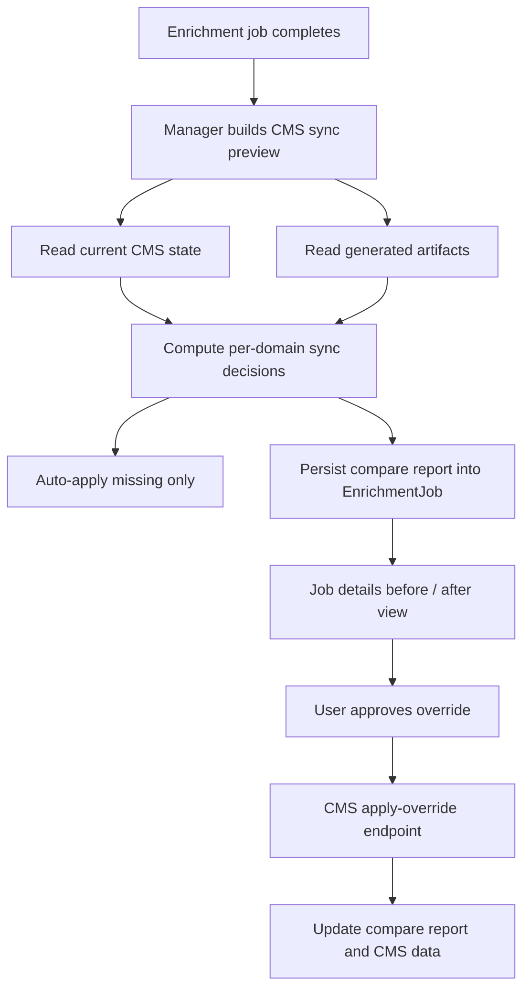

# feat: Sync enrichment results into CMS models with reviewable overrides

## Overview

Port the useful outcomes of a completed enrichment job into the right CMS-owned persistence layer, using this policy:

- automatically add **missing** CMS data
- **never overwrite** existing CMS data automatically
- when CMS already has data, record a durable compare result in the job
- show the user a **before / after** view in job details
- allow an explicit **override** action only after the user approves it

This plan intentionally separates:

- outcomes that fit existing CMS content types
- outcomes that need a new CMS content type
- outcomes that should **not** become Strapi content types because the repo already has a better CMS-owned persistence layer

## Problem Statement

The manager app currently finishes enrichment jobs with useful outputs, but those results mostly stay in Forge artifact storage:

- transcript JSON
- source and translated subtitle VTTs
- chapters JSON
- metadata JSON
- embeddings JSON

The CMS only receives the durable job record through [Enrichment Job](/Users/o/.codex/worktrees/1ec2/forge/apps/cms/src/api/enrichment-job/content-types/enrichment-job/schema.json), not the editorially useful outcomes themselves.

That creates three real product gaps:

1. CMS-driven experiences cannot reuse most enrichment results.
2. There is no non-destructive sync path from job outputs into CMS models.
3. Operators cannot review “generated vs existing CMS data” before deciding to override current content.

## Found Brainstorm

No directly relevant recent brainstorm was found for this exact scope.

## Current State Research

### Relevant existing CMS models

The current CMS already has strong homes for some outcomes:

- [Video](/Users/o/.codex/worktrees/1ec2/forge/apps/cms/src/api/video/content-types/video/schema.json)
  - localized `title`, `description`, `snippet`
  - `aiMetadata` boolean
  - relations to subtitles, keywords, bible citations, variants
- [Video Subtitle](/Users/o/.codex/worktrees/1ec2/forge/apps/cms/src/api/video-subtitle/content-types/video-subtitle/schema.json)
  - `vttSrc`, `srtSrc`, `language`, `video`, `source`, `aiGenerated`
  - relation to [Cloudflare R2](/Users/o/.codex/worktrees/1ec2/forge/apps/cms/src/api/cloudflare-r2/content-types/cloudflare-r2/schema.json) assets
- [Keyword](/Users/o/.codex/worktrees/1ec2/forge/apps/cms/src/api/keyword/content-types/keyword/schema.json)
  - `value`, `language`, `videos`, `source`
- [Enrichment Job](/Users/o/.codex/worktrees/1ec2/forge/apps/cms/src/api/enrichment-job/content-types/enrichment-job/schema.json)
  - durable job state only

The repo also already has a CMS-owned persistence layer for embeddings, but it is **not** a Strapi content type:

- [pgvector best-practice doc](/Users/o/.codex/worktrees/1ec2/forge/docs/solutions/best-practices/pgvector-embedding-indexing-strapi-v5.md)
- [embedding indexer](/Users/o/.codex/worktrees/1ec2/forge/apps/cms/src/api/embedding/services/indexer.ts)

That matters because “the right CMS destination” for embeddings is the existing `video_embeddings` table, not a new Strapi collection type.

### Current enrichment result shapes

- [transcription.ts](/Users/o/.codex/worktrees/1ec2/forge/apps/manager/src/services/transcription.ts)
  - `text`
  - `segments[]`
  - `language`
  - artifact keys: `transcript`, `subtitles`
- [subtitleTranslation/index.ts](/Users/o/.codex/worktrees/1ec2/forge/apps/manager/src/services/subtitleTranslation/index.ts)
  - VTT subtitle track per target language
  - translation JSON per target language
- [chapters.ts](/Users/o/.codex/worktrees/1ec2/forge/apps/manager/src/services/chapters.ts)
  - `[{ title, startSeconds, endSeconds, summary }]`
- [metadata.ts](/Users/o/.codex/worktrees/1ec2/forge/apps/manager/src/services/metadata.ts)
  - `{ title, description, topics[], speakers[], tags[], language }`
- [embeddings.ts](/Users/o/.codex/worktrees/1ec2/forge/apps/manager/src/services/embeddings.ts)
  - `chunks[]`, `averagedEmbedding`, optional `metadataEmbedding`, dimensions, model

## Mapping Decision

### The right CMS home for each job outcome

| Job outcome                             | Right CMS destination                                       | Existing or new                                        | Why                                                                    |
| --------------------------------------- | ----------------------------------------------------------- | ------------------------------------------------------ | ---------------------------------------------------------------------- |
| Source subtitles / translated subtitles | `VideoSubtitle` + optional `CloudflareR2` asset relation    | Existing                                               | Subtitle tracks already have a publishable CMS model                   |
| Plain transcript JSON                   | **No new content type**; keep as job artifact               | No new type                                            | It duplicates the subtitle cue model and is mainly workflow/debug data |
| Metadata title / description            | `Video`                                                     | Existing                                               | These fields already exist and are editorially meaningful              |
| Topics / tags / speakers                | `Keyword` with `type` discriminator                         | Extend existing                                        | Avoids creating three premature content types                          |
| Chapters                                | `VideoChapter`                                              | **New**                                                | No current chapter model exists                                        |
| Embeddings                              | `video_embeddings` pgvector table via CMS embedding service | Existing CMS-owned persistence, **not** a content type | This is already the correct storage shape                              |

### Important explicit non-goals

- Do **not** create a `VideoTranscript` content type in v1.
  - The source subtitle track is the canonical CMS representation of transcript-aligned text.
  - `transcript.json` remains a job artifact for detailed UI/debug/export use.
- Do **not** create a Strapi content type for embeddings.
  - The repo already chose raw pgvector tables because Strapi content types are the wrong abstraction for vectors.

## Proposed Data Model Changes

### 1. Extend `Keyword`

Add a `type` enum to [Keyword](/Users/o/.codex/worktrees/1ec2/forge/apps/cms/src/api/keyword/content-types/keyword/schema.json):

- `keyword`
- `topic`
- `speaker`

This follows the existing direction already captured in [feat-002](/Users/o/.codex/worktrees/1ec2/forge/docs/roadmap/topic-experiences/feat-002-wire-enrichment-metadata-to-cms.md) and avoids premature topic/speaker-specific content types.

### 2. Add `VideoChapter`

Create a new `video-chapter` collection type with fields like:

- `coreId` or stable synthetic key
- `order`
- `title`
- `summary`
- `startSeconds`
- `endSeconds`
- `language` relation
- `video` relation
- `source` enum (`core` | `manager`)
- `aiGenerated` boolean

This gives chapters a first-class CMS home without forcing them into `Video` JSON blobs.

### 3. Reuse existing `VideoSubtitle`

Store generated subtitle tracks through [Video Subtitle](/Users/o/.codex/worktrees/1ec2/forge/apps/cms/src/api/video-subtitle/content-types/video-subtitle/schema.json):

- source transcript-derived subtitle VTT
- translated subtitle VTTs

Recommended v1 policy:

- CMS canonical value is the VTT track
- translation JSON remains a job artifact, not a CMS model

### 4. Reuse existing embedding service

For embeddings, use the existing CMS embedding service:

- [embedding indexer](/Users/o/.codex/worktrees/1ec2/forge/apps/cms/src/api/embedding/services/indexer.ts)

The compare/approval UX still applies, but the write target is the existing vector table rather than a content type.

## Architecture

### High-level flow



### Responsibility split

Recommended split:

- **Manager**
  - owns generated artifacts
  - owns job detail UI
  - owns durable compare report in `EnrichmentJob.artifacts` / step details
- **CMS**
  - owns content-type writes and embedding-table writes
  - owns domain-specific upsert / override logic close to the schema

This argues for adding CMS-side sync endpoints/services instead of teaching manager to hand-assemble low-level mutations for every content type.

## User Experience

### Default behavior

When a job completes, the system automatically:

- checks current CMS state
- applies only clearly missing data
- skips anything that would overwrite an existing CMS value

### Before / after review

On the job detail page, the user sees a CMS Sync section with one card per domain:

- Subtitles
- Metadata
- Chapters
- Embeddings

Each card shows:

- current CMS state
- generated job state
- sync result:
  - `applied_missing`
  - `skipped_existing`
  - `unsupported`
  - `failed`
- explanation text

### Override flow

If CMS already has data:

- the card shows a side-by-side compare
- no automatic overwrite occurs
- the user can click `Override CMS with generated data`
- the action requires explicit confirmation
- the compare report updates after success

## Sync Semantics By Domain

### Subtitles

**Missing-only auto-apply**

- If a subtitle track for the language does not exist in CMS:
  - create a `VideoSubtitle`
  - create or link a `CloudflareR2` asset if needed
  - mark `source: "manager"` and `aiGenerated: true`

**Skip if existing**

- If a subtitle track already exists for that language:
  - skip auto-write
  - show existing VTT vs generated VTT preview
  - offer override

### Metadata

**Missing-only auto-apply**

- Set `Video.title` only if blank
- Set `Video.description` only if blank
- Optionally set `Video.snippet` only if blank and derived policy is approved
- Create missing manager-sourced keywords/topics/speakers if absent
- Set `Video.aiMetadata = true` once manager-sourced metadata has been applied

**Skip if existing**

- If title or description already exists, do not overwrite automatically
- If a given keyword/topic/speaker already exists, do not duplicate it
- Show current vs generated values and allow explicit override

### Chapters

**Missing-only auto-apply**

- If no manager-sourced chapter set exists for `video + language`, create `VideoChapter` rows

**Skip if existing**

- If manager-sourced or editorial chapter rows already exist for `video + language`, skip auto-replace
- Show current ordered chapter list vs generated chapter list
- Override action replaces the chapter set for that `video + language`

### Embeddings

**Missing-only auto-apply**

- If no `video_embeddings` rows exist for the target video, index generated chunk embeddings

**Skip if existing**

- If embedding rows already exist, skip automatic reindexing
- Show compare summary:
  - current chunk count / model
  - generated chunk count / model
- Override action reindexes the video

## Schema / Contract Changes

### CMS schema

- Extend [Keyword](/Users/o/.codex/worktrees/1ec2/forge/apps/cms/src/api/keyword/content-types/keyword/schema.json) with `type`
- Add `video-chapter` content type
- Regenerate [schema.graphql](/Users/o/.codex/worktrees/1ec2/forge/apps/cms/schema.graphql) and downstream GraphQL types in [packages/graphql](/Users/o/.codex/worktrees/1ec2/forge/packages/graphql)

### Manager job contract

Add a durable `cmsSync` report stored in job artifacts metadata or additive step details, for example:

```ts
type CmsSyncStatus =
  | "applied_missing"
  | "skipped_existing"
  | "failed"
  | "unsupported"
  | "override_applied"

type CmsSyncEntry = {
  domain: "subtitles" | "metadata" | "chapters" | "embeddings"
  key: string
  status: CmsSyncStatus
  explanation: string
  current?: unknown
  generated?: unknown
  approvedOverride?: boolean
}
```

This report becomes the source for the before / after UI.

## Key Technical Decisions

### 1. Replace stale `cms_notify` with a real `cms_sync` step

The branch currently has stale `cms_notify` vocabulary but no real implementation. This feature should not revive that name. It should introduce a truthful sync step such as `cms_sync` or `content_sync`.

### 2. CMS owns write logic

Do not spread low-level content-type mutation rules throughout manager. Put:

- upsert rules
- duplicate detection
- bulk replace logic
- embedding reindex logic

behind CMS-side services and endpoints.

### 3. Missing-only is field-aware for metadata and set-aware for chapters

For metadata, non-destructive sync can happen per field/per relation.

For chapters, the meaningful compare unit is the whole ordered chapter set for a video-language pair, not individual rows merged ad hoc.

### 4. Embeddings are a deliberate exception to “content types”

The correct CMS-owned shape already exists outside Strapi content types. The plan should keep that instead of inventing a poor schema just for consistency.

## Implementation Units

- [ ] **Unit 1: Define CMS sync targets and compare model**

  **Goal:** Create a deterministic mapping from enrichment outputs to CMS destinations.

  **Files:**
  - Manager sync planning code
  - CMS sync domain types
  - tests for compare decisions

  **Red**
  - failing tests for each domain:
    - missing subtitles -> apply
    - existing subtitles -> skip + compare
    - blank metadata field -> apply
    - existing metadata field -> skip
    - no chapters -> apply
    - existing chapters -> skip
    - no embeddings -> apply
    - existing embeddings -> skip

  **Green**
  - implement compare model and decision logic

  **Refactor**
  - centralize domain mapping so UI and workflow read the same report

- [ ] **Unit 2: Add / extend CMS schema**

  **Goal:** Create the right CMS storage models for what does not fit yet.

  **Files:**
  - [apps/cms/src/api/keyword/content-types/keyword/schema.json](/Users/o/.codex/worktrees/1ec2/forge/apps/cms/src/api/keyword/content-types/keyword/schema.json)
  - new `video-chapter` schema
  - generated [apps/cms/schema.graphql](/Users/o/.codex/worktrees/1ec2/forge/apps/cms/schema.graphql)
  - regenerated [packages/graphql](/Users/o/.codex/worktrees/1ec2/forge/packages/graphql)

  **Red**
  - failing schema / service tests expecting keyword typing and chapter persistence

  **Green**
  - add `Keyword.type`
  - add `VideoChapter`
  - regenerate GraphQL artifacts

  **Refactor**
  - keep chapter schema minimal and language-aware

- [ ] **Unit 3: Build CMS-side sync services and endpoints**

  **Goal:** Let CMS own apply-missing and override behavior.

  **Files:**
  - new CMS sync service / controller routes
  - embedding service integration
  - subtitle / metadata / chapter write services

  **Red**
  - failing tests for:
    - subtitle create-if-missing
    - metadata fill-if-blank
    - chapter create-if-missing
    - embedding index-if-missing
    - non-destructive skip on existing data

  **Green**
  - implement CMS-side services
  - expose preview/apply/override endpoints

  **Refactor**
  - make writes idempotent and transactional where possible

- [ ] **Unit 4: Add manager workflow sync step and durable compare report**

  **Goal:** Persist CMS compare/apply results onto the job.

  **Files:**
  - [videoEnrichment.ts](/Users/o/.codex/worktrees/1ec2/forge/apps/manager/src/workflows/videoEnrichment.ts)
  - [types/job.ts](/Users/o/.codex/worktrees/1ec2/forge/apps/manager/src/types/job.ts)
  - [state.ts](/Users/o/.codex/worktrees/1ec2/forge/apps/manager/src/lib/state.ts)

  **Red**
  - failing workflow tests proving compare report round-trips through jobs
  - failing tests proving missing data is auto-applied but existing data is skipped

  **Green**
  - add real `cms_sync` step
  - persist compare report and results

  **Refactor**
  - remove stale `cms_notify` vocabulary in the same scope

- [ ] **Unit 5: Build before / after job detail UI with override approval**

  **Goal:** Give operators visibility and control.

  **Files:**
  - [live-job-detail-header.tsx](/Users/o/.codex/worktrees/1ec2/forge/apps/manager/src/features/jobs/live-job-detail-header.tsx)
  - [live-job-steps-table.tsx](/Users/o/.codex/worktrees/1ec2/forge/apps/manager/src/features/jobs/live-job-steps-table.tsx)
  - new CMS sync compare UI
  - [globals.css](/Users/o/.codex/worktrees/1ec2/forge/apps/manager/src/app/globals.css)

  **Red**
  - failing UI tests for:
    - missing-only applied state
    - skipped-existing compare rendering
    - override confirmation flow
    - embeddings compare summary

  **Green**
  - implement compare cards and approval flow

  **Refactor**
  - keep the compare section readable on mobile and desktop

## Risks & Mitigations

- **Risk:** Auto-applying “missing” metadata may still surprise editors if blank fields were intentionally blank.
  - **Mitigation:** keep the missing-only policy explicit and auditable in the compare report; allow future per-domain toggles.

- **Risk:** Chapters are hard to merge incrementally.
  - **Mitigation:** treat chapters as a set for compare/override.

- **Risk:** Embeddings don’t fit the “content type” mental model.
  - **Mitigation:** state clearly in product copy that embeddings sync into the CMS search index, not into an editor-facing content model.

- **Risk:** Manager and CMS could drift on compare logic.
  - **Mitigation:** make CMS the authority for apply/override decisions and persist the returned report directly.

## Acceptance Criteria

- [ ] Missing subtitle tracks are created in CMS without overwriting existing tracks.
- [ ] Missing metadata fields and missing manager-sourced keyword/topic/speaker relations are added without overwriting existing values.
- [ ] A new chapter content type stores generated chapters when none exist for the video-language pair.
- [ ] Existing chapter sets are not overwritten automatically.
- [ ] Embeddings are indexed into the CMS-owned vector store only when absent.
- [ ] Existing embeddings are not automatically reindexed.
- [ ] Job details show before / after compare views for all skipped-existing domains.
- [ ] Users can explicitly approve an override from the job page.
- [ ] Override actions update CMS state and the job compare report.
- [ ] Transcript JSON and translation JSON remain artifacts and are not duplicated into unnecessary CMS content types.
- [ ] The stale `cms_notify` concept is removed or replaced by a real `cms_sync` step in the same implementation.

## Verification

Manager:

- `pnpm --filter @forge/manager test`
- `pnpm --filter @forge/manager lint`
- `pnpm --filter @forge/manager typecheck`

CMS:

- `pnpm --filter @forge/cms test`
- schema generation / GraphQL type regeneration checks

PR-focused:

- `pnpm run format:check`

Manual QA:

1. Run enrichment on a video with no manager-generated subtitle for a target language.
2. Confirm CMS gets a new `VideoSubtitle` and the job reports `applied_missing`.
3. Re-run the same language and confirm the job reports `skipped_existing` with compare UI.
4. Run enrichment on a video with blank `Video.description` and no manager keywords.
5. Confirm missing fields/relations are created without clobbering existing editorial values.
6. Run enrichment on a video with no manager chapters and confirm `VideoChapter` rows are created.
7. Re-run and confirm chapters are skipped until the user explicitly overrides.
8. Run enrichment on a video with no embeddings and confirm CMS indexing occurs.
9. Re-run and confirm embeddings are skipped until override approval.

## References

- [feat-031 AI Video Enrichment Pipeline](/Users/o/.codex/worktrees/1ec2/forge/docs/roadmap/media-generation/feat-031-ai-video-enrichment-pipeline.md)
- [feat-002 Wire Enrichment Metadata Back to CMS](/Users/o/.codex/worktrees/1ec2/forge/docs/roadmap/topic-experiences/feat-002-wire-enrichment-metadata-to-cms.md)
- [Video](/Users/o/.codex/worktrees/1ec2/forge/apps/cms/src/api/video/content-types/video/schema.json)
- [Video Subtitle](/Users/o/.codex/worktrees/1ec2/forge/apps/cms/src/api/video-subtitle/content-types/video-subtitle/schema.json)
- [Keyword](/Users/o/.codex/worktrees/1ec2/forge/apps/cms/src/api/keyword/content-types/keyword/schema.json)
- [Enrichment Job](/Users/o/.codex/worktrees/1ec2/forge/apps/cms/src/api/enrichment-job/content-types/enrichment-job/schema.json)
- [Embedding indexer](/Users/o/.codex/worktrees/1ec2/forge/apps/cms/src/api/embedding/services/indexer.ts)
- [pgvector Setup and Embedding Indexing in Strapi v5](/Users/o/.codex/worktrees/1ec2/forge/docs/solutions/best-practices/pgvector-embedding-indexing-strapi-v5.md)
- [Mux sync plan](/Users/o/.codex/worktrees/1ec2/forge/docs/plans/2026-04-09-feat-mux-sync-for-enrichment-outputs-plan.md)
