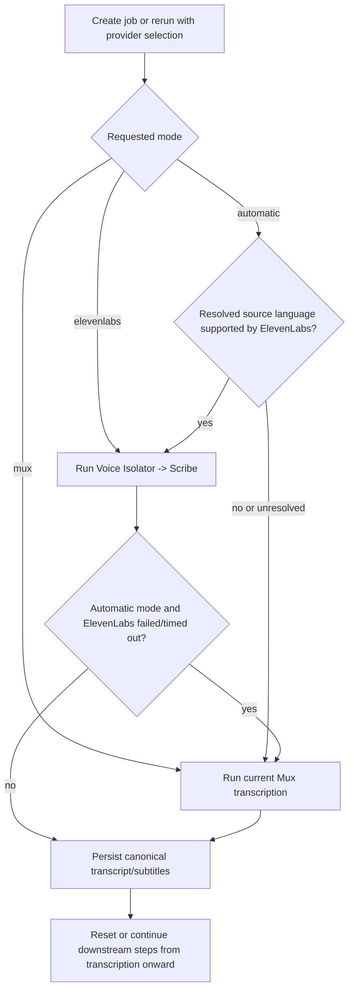

# feat: Add ElevenLabs transcription routing to manager enrichment

## Overview

Add an ElevenLabs transcription path to Forge Manager that:

- uses ElevenLabs Voice Isolator plus Scribe for supported source languages
- falls back to the existing Mux transcription path for unsupported languages
- automatically falls back to Mux in the same run when automatic ElevenLabs transcription fails or times out
- preserves the canonical `transcript.json` and `subtitles.vtt` artifacts consumed by translation, chapters, metadata, embeddings, and Mux sync
- allows operators to rerun transcription per job with an explicit provider selection
- captures provider diagnostics and diarization internally without exposing speaker-aware subtitle output in v1

This plan stays intentionally narrow. It does not redesign the whole enrichment workflow, replace Mux globally, or ship speaker-attributed subtitles. Those remain follow-up work, especially under `feat-050`.

## Found Brainstorm

Relevant brainstorm found and used as planning input:

- `docs/brainstorms/2026-04-11-elevenlabs-transcription-pipeline-brainstorm.md`

Key decisions carried forward:

- default to ElevenLabs for supported source languages
- run Voice Isolator on every ElevenLabs attempt
- keep current canonical transcript/subtitle artifacts
- capture diarization internally only
- auto-fallback to Mux for automatic ElevenLabs failures
- support manual per-job provider reruns

## Research Decision

External research is required here because this feature integrates a third-party API and long-running media-processing behavior where stale assumptions would be costly.

Official docs reviewed:

- [ElevenLabs Speech to Text overview](https://elevenlabs.io/docs/overview/capabilities/speech-to-text)
- [ElevenLabs Create transcript API](https://elevenlabs.io/docs/api-reference/speech-to-text/convert)
- [ElevenLabs Get transcript API](https://elevenlabs.io/docs/api-reference/speech-to-text/get)
- [ElevenLabs Voice Isolator overview](https://elevenlabs.io/docs/overview/capabilities/voice-isolator)

Important confirmed capability constraints:

- Scribe v2 supports 90+ languages, word timestamps, diarization, and keyterms
- Create transcript accepts either uploaded files or `cloud_storage_url` over HTTPS
- async webhook support exists, but the current manager workflow model is not yet built around webhook-driven resumption
- Voice Isolator supports audio and video inputs up to 500MB / 1 hour and is explicitly intended for noise, music, and ambient interference cleanup

## Current State Research

### Current transcription seam

- `apps/manager/src/services/transcription.ts` is Mux-only today.
- It polls for ready generated subtitle tracks, fetches WebVTT, parses it into `TranscriptSegment[]`, and writes canonical `transcript` and `subtitles` artifacts.
- Downstream consumers assume that contract rather than provider-specific payloads.

### Workflow orchestration seam

- `apps/manager/src/workflows/videoEnrichment.ts` is the right place for provider routing, fallback rules, and job-state recording.
- Transcription runs first; translation, chapters, metadata, and embeddings fan out afterward.
- The `after()` background model is already used in `apps/manager/src/app/api/jobs/route.ts`.

### Job state and operator surfaces

- Durable job state lives in `apps/manager/src/lib/state.ts` and `apps/manager/src/types/job.ts`.
- Existing override/recovery patterns live under:
  - `apps/manager/src/app/api/jobs/[id]/mux-sync/override/route.ts`
  - `apps/manager/src/app/api/jobs/[id]/embedding-sync/override/route.ts`
  - `apps/manager/src/lib/mux-sync-override.ts`
- Operator UI surfaces are:
  - `apps/manager/src/app/dashboard/jobs/[id]/page.tsx`
  - `apps/manager/src/features/jobs/live-job-detail-header.tsx`
  - `apps/manager/src/app/dashboard/jobs/new-job-form.tsx`

### Important repo realities

- Branch naming must follow `feat/description`; this work is already on `feat/elevenlabs-transcription-pipeline`.
- PRs target `main`, use conventional commit language, and must not skip hooks.
- Manager env must be validated in `apps/manager/src/config/env.ts`.
- The storage layer already supports local `.tmp/artifacts/` fallback when Railway S3 is unset.
- The workflow directives are inert unless the workflow plugin is enabled, so local smoke tests should assume plain async execution unless that setup is present.

### Existing drift to account for

`apps/manager/src/app/dashboard/jobs/new-job-form.tsx` currently posts a payload shape that does not match `apps/manager/src/app/api/jobs/route.ts`. Do not blindly expand that form for provider selection without first reconciling or intentionally bypassing the create-job UI surface. The rerun operator flow should live on job detail regardless.

## Institutional Learnings Applied

- `docs/solutions/platform/videoforge-manager-integration.md`:
  keep provider integrations behind dedicated services and stay inside the workflow boundaries
- `docs/solutions/integration-issues/manager-mux-subtitle-override-recovery-non-destructive-replacement-20260410.md`:
  replacement flows must be non-destructive and resumable
- `docs/solutions/integration-issues/manager-job-read-model-source-language-metadata-20260409.md`:
  persist truth in artifacts, then promote the useful summary into the read model
- `docs/solutions/cms/strapi-enrichment-job-content-type.md`:
  richer provider state belongs in flexible artifact JSON, not a schema churn spree
- `docs/solutions/integration-issues/manager-embeddings-transcript-aware-optional-metadata-2026-04-08.md`:
  additive internal metadata is fine, but do not contaminate the canonical transcript contract
- `docs/solutions/best-practices/vector-embedding-storage-scope-sequencing-2026-04-11.md`:
  keep this PR focused on transcription routing and rerun state; do not fold speaker-attributed subtitle output into it

## Problem Frame

Forge’s current transcription path is simple and durable, but it performs poorly on the exact media quality issues the team called out: noisy film audio, music, ambient noise, and overlapping speakers. The product goal is not “replace Mux everywhere.” It is “prefer a stronger transcription path when we know it should help, without forcing downstream consumers to care.”

That makes this a routing and state problem as much as a provider problem:

- which provider runs by default
- what happens when the source language is unresolved
- what happens when ElevenLabs fails
- how reruns are requested and audited
- how provider truth is visible in job details

If those rules are not explicit, the feature will feel unreliable even if transcription quality improves.

## Requirements Trace

- R1. Automatic mode routes to ElevenLabs only when the resolved source language is explicitly supported; otherwise use Mux.
- R2. Every automatic or forced ElevenLabs attempt runs Voice Isolator before Scribe.
- R3. Automatic mode falls back to Mux in the same run when ElevenLabs fails or times out.
- R4. Canonical `transcript.json` and `subtitles.vtt` artifacts remain unchanged in shape and meaning.
- R5. Provider choice, resolved provider, fallback reason, and attempt history are durable and visible in job state.
- R6. Manual reruns support explicit provider selection per job.
- R7. Forced reruns honor the operator’s requested provider instead of silently switching to another provider.
- R8. Reruns do not race with in-flight transcription attempts.
- R9. Reruns invalidate or recompute downstream artifacts derived from transcription.
- R10. Diarization is captured internally only and not exposed as speaker-aware subtitle output in this scope.
- R11. The implementation follows Red/Green TDD.
- R12. The implementation includes an operator-focused user smoke test.

## Scope Boundaries

In scope:

- ElevenLabs routing and service integration inside Manager
- provider selection state and fallback state
- original-source URL persistence needed to call ElevenLabs safely
- manual transcription rerun API and job-detail operator control
- internal-only diarization capture
- canonical artifact preservation
- tests and operator smoke testing

Out of scope:

- speaker-attributed subtitle rendering or CMS schema changes
- broad multi-provider framework abstractions outside transcription
- changing translation, chapters, metadata, embeddings, or Mux sync contracts
- webhook-driven orchestration redesign for all background jobs
- replacing Mux as the global default for all use cases

## Proposed User Flow



## Technical Decisions

### 1. Provider request modes

Adopt a three-mode request model:

```ts
type RequestedTranscriptionProvider = "automatic" | "elevenlabs" | "mux"
type ResolvedTranscriptionProvider = "elevenlabs" | "mux"
```

Rules:

- `automatic`:
  choose ElevenLabs only when the source language is concretely resolved and supported; otherwise choose Mux
- `elevenlabs`:
  force ElevenLabs and surface a failure if it cannot run
- `mux`:
  force the existing Mux path

This keeps the default product behavior smart while making manual reruns meaningful.

### 2. Source-language authority

The plan should not route `language: "auto"` jobs to ElevenLabs speculatively.

Decision:

- only automatic-route to ElevenLabs when the resolved source language is concrete
- unresolved or `auto` source language uses Mux
- promote the final source-language decision into job state so UI and QA can explain why routing happened

This follows the repo’s existing “source language truth must be explicit” pattern.

### 3. Source media for ElevenLabs

Do not depend on a Mux playback URL as the source input to ElevenLabs. The current manager pipeline does not already expose a clean downloadable media URL for this feature.

Decision:

- persist the original ingest `inputUrl` on the job record or in durable job metadata
- pass that original HTTPS source URL to ElevenLabs as `cloud_storage_url`
- for legacy jobs missing the original ingest URL, disable forced ElevenLabs reruns and fall back to Mux-only behavior

This keeps the ElevenLabs path compatible with current ingest behavior and avoids same-PR static rendition work.

### 4. ElevenLabs completion transport

Official docs support async webhook delivery, but the current manager workflow is not yet built around webhook-driven job resumption.

Decision for v1:

- use synchronous provider calls inside the transcription step
- enforce conservative request timeouts around Voice Isolator and Scribe
- on timeout in `automatic` mode, record the failure and fall back to Mux immediately
- isolate all ElevenLabs API interaction in a dedicated service so webhook-driven async can be added later without reshaping the rest of the workflow

This is the most compatible option with the current `after()` plus workflow-step model.

### 5. Canonical artifact replacement rules

Canonical `transcript` and `subtitles` artifacts should only be replaced after a transcription attempt succeeds.

Decision:

- keep provider-attempt state separate from canonical artifacts
- do not overwrite canonical artifacts with partial or failed ElevenLabs output
- if a forced rerun fails, preserve the previously successful canonical transcript/subtitle artifacts

This mirrors the repo’s non-destructive override pattern.

### 6. Internal provider metadata and diarization

Persist provider-specific truth in metadata artifacts, not in public downloadable artifacts.

Recommended shape:

```ts
type TranscriptionAttempt = {
  attemptId: string
  requestedProvider: RequestedTranscriptionProvider
  resolvedProvider: ResolvedTranscriptionProvider
  status: "running" | "completed" | "failed" | "fallback_completed"
  sourceLanguageCode?: string
  fallbackFromProvider?: "elevenlabs"
  fallbackReason?: string
  startedAt: string
  finishedAt?: string
}

type TranscriptionRoutingMetadata = {
  currentAttemptId?: string
  attempts: TranscriptionAttempt[]
  finalProvider?: ResolvedTranscriptionProvider
  finalSourceLanguageCode?: string
  diarization?: {
    speakerCount?: number
    segments?: Array<{
      speakerId: string
      start: number
      end: number
      text?: string
    }>
  }
}
```

Storage recommendation:

- canonical metadata artifact entry in `job.artifacts.transcriptionRouting`
- summary fields promoted into the read model in `state.ts` for list/detail UI access

### 7. Rerun lifecycle

Manual reruns should be modeled as “restart from transcription forward,” not “replace one file in place.”

Decision:

- add a dedicated rerun endpoint such as `apps/manager/src/app/api/jobs/[id]/transcription/rerun/route.ts`
- reject reruns when transcription is actively running
- when accepted, clear or invalidate artifacts and step results from:
  - transcription
  - translation
  - chapters
  - metadata
  - embeddings
  - mux_upload
- preserve previous successful canonical artifacts until the rerun succeeds
- append a new transcription attempt record before background execution begins

## Implementation Phases

### Phase 1: Provider state and source URL foundation

Files:

- `apps/manager/src/types/job.ts`
- `apps/manager/src/lib/state.ts`
- `apps/manager/src/lib/job-artifacts.ts`
- `apps/manager/src/config/env.ts`
- `apps/manager/src/app/api/jobs/route.ts`

Tasks:

- persist original ingest `inputUrl` as durable job metadata
- add requested/resolved transcription provider state
- add job artifact metadata helpers for transcription routing
- add validated ElevenLabs env vars:
  - `ELEVENLABS_API_KEY`
  - optional timeout settings
  - optional support-list override only if truly needed
- promote final provider and fallback summary into the job read model

Success criteria:

- jobs can persist enough information to deterministically choose or explain a provider
- no import-time crash occurs when ElevenLabs env vars are absent in local/CI contexts that do not use that provider

### Phase 2: ElevenLabs transcription service

Files:

- add `apps/manager/src/services/elevenlabs-transcription.ts`
- modify `apps/manager/src/services/transcription.ts` or add a thin router service
- reuse `apps/manager/src/lib/vtt.ts`

Tasks:

- implement Voice Isolator call
- implement Scribe call using `cloud_storage_url`
- convert provider output into existing `TranscriptSegment[]` plus plain text
- expose internal diarization data alongside canonical transcript results
- keep the service boundary narrow and mockable

Success criteria:

- the ElevenLabs path returns the same canonical shape as the Mux path
- diarization is available internally without changing public artifact semantics

### Phase 3: Workflow routing and fallback

Files:

- `apps/manager/src/workflows/videoEnrichment.ts`
- `apps/manager/src/services/transcription.ts`
- `apps/manager/src/workflows/videoEnrichment.test.ts`

Tasks:

- resolve requested mode and source language into a provider choice
- run automatic ElevenLabs fallback to Mux on supported failure cases
- record attempt history and final provider
- preserve canonical artifacts until a successful final provider result exists

Success criteria:

- automatic mode chooses the right provider deterministically
- automatic same-run fallback works
- forced reruns do not silently switch providers

### Phase 4: Manual rerun API and operator UI

Files:

- add `apps/manager/src/app/api/jobs/[id]/transcription/rerun/route.ts`
- add test for the new route
- `apps/manager/src/app/dashboard/jobs/[id]/page.tsx`
- `apps/manager/src/features/jobs/live-job-detail-header.tsx`
- optionally `apps/manager/src/features/jobs/...` presenter/helper files if needed

Tasks:

- add rerun endpoint with provider selection validation
- block reruns during active transcription
- append a new attempt record and reset downstream steps
- expose provider history and rerun action in job detail UI

Success criteria:

- operators can force `elevenlabs` or `mux` for a job rerun
- the UI clearly shows what provider actually ran and whether fallback happened

## Red/Green TDD Plan

### Unit 1: Transcription routing metadata helpers

Files:

- add/modify `apps/manager/src/lib/job-artifacts.test.ts`
- add/modify `apps/manager/src/lib/state.test.ts`

Red:

- failing tests for reading/writing `transcriptionRouting` metadata
- failing tests for promoted read-model fields for final provider and fallback reason
- failing tests for preserving existing metadata when new attempt entries are appended

Green:

- add helpers and read-model derivation that satisfy the tests

### Unit 2: ElevenLabs service output mapping

Files:

- add `apps/manager/src/services/elevenlabs-transcription.test.ts`
- add `apps/manager/src/services/elevenlabs-transcription.ts`

Red:

- failing tests for Voice Isolator + Scribe happy path mapping into `text` plus `segments`
- failing tests for diarization extraction staying internal-only
- failing tests for keyterm forwarding and timeout/error mapping

Green:

- implement the service with mocked provider responses

### Unit 3: Workflow routing and fallback

Files:

- modify `apps/manager/src/workflows/videoEnrichment.test.ts`
- modify `apps/manager/src/services/transcription.test.ts`

Red:

- failing tests for automatic supported-language routing to ElevenLabs
- failing tests for unsupported-language routing to Mux
- failing tests for automatic ElevenLabs timeout/failure fallback to Mux
- failing tests proving forced `elevenlabs` reruns do not silently resolve to Mux
- failing tests proving canonical artifacts are not replaced by failed forced reruns

Green:

- implement routing and fallback in the workflow and transcription seam

### Unit 4: Rerun route and conflict handling

Files:

- add `apps/manager/src/app/api/jobs/[id]/transcription/rerun/route.test.ts`
- add `apps/manager/src/app/api/jobs/[id]/transcription/rerun/route.ts`

Red:

- failing tests for accepted rerun requests
- failing tests for invalid provider values
- failing tests for rejection while transcription is active
- failing tests that downstream steps/artifacts reset from transcription onward

Green:

- implement the rerun route and state-reset behavior

### Unit 5: Job detail provider presentation

Files:

- add/modify presenter-level tests near the job detail UI if extracted
- otherwise add focused UI tests for any new provider-summary helpers

Red:

- failing tests for displaying final provider, requested mode, and fallback status
- failing tests for hiding rerun controls when job state is not eligible

Green:

- implement minimal UI needed to satisfy the operator flow

## User Smoke Test

This feature requires an operator-level smoke test, not just unit coverage.

### Smoke test environment

- run manager locally with valid Mux and ElevenLabs credentials
- rely on local `.tmp/artifacts/` storage if Railway S3 is not configured
- use an HTTPS source media URL that has a concrete supported language and audible background noise

### Smoke test flow

1. Create a job through the supported API surface for a supported source language.
2. Wait for the job to complete.
3. Open the job detail page and verify:
   - final provider shows `elevenlabs`
   - canonical transcript/subtitle artifacts are downloadable
   - downstream steps still complete successfully
4. Trigger a manual rerun with forced provider `mux`.
5. Verify:
   - rerun is accepted only when no transcription attempt is active
   - downstream steps reset from transcription onward
   - the completed job now shows attempt history with both providers
   - final provider shows `mux` for the rerun attempt

Optional secondary smoke:

- run a job with `language: auto` or an unsupported language and confirm the final provider remains `mux`

## Verification Commands

Primary automated checks:

```bash
pnpm --filter @forge/manager test -- src/lib/job-artifacts.test.ts
pnpm --filter @forge/manager test -- src/lib/state.test.ts
pnpm --filter @forge/manager test -- src/services/transcription.test.ts
pnpm --filter @forge/manager test -- src/services/elevenlabs-transcription.test.ts
pnpm --filter @forge/manager test -- src/workflows/videoEnrichment.test.ts
pnpm --filter @forge/manager test -- "src/app/api/jobs/[id]/transcription/rerun/route.test.ts"
pnpm --filter @forge/manager lint
pnpm --filter @forge/manager typecheck
```

## Risks and Mitigations

### Risk: source URL is missing for legacy jobs

Mitigation:

- persist original ingest URL for new jobs
- degrade legacy reruns to Mux-only with a clear operator explanation

### Risk: synchronous ElevenLabs calls exceed practical runtime budgets

Mitigation:

- enforce explicit provider timeouts
- keep the provider service isolated so webhook-driven async can be added later
- keep automatic fallback to Mux in the same workflow run

### Risk: reruns corrupt the only usable transcript

Mitigation:

- do not overwrite canonical artifacts until a new attempt succeeds
- preserve attempt history separately from final artifact promotion

### Risk: source-language ambiguity causes inconsistent provider choice

Mitigation:

- only use automatic ElevenLabs routing when the source language is concretely resolved
- store the decision reason in durable state

## Delivery Notes

- Keep the implementation in one manager-scoped PR if possible.
- Target branch naming: `feat/elevenlabs-transcription-pipeline`.
- PR target: `main`.
- Keep `feat-081` as the implementation ticket and `feat-049` as the benchmark/reference ticket.
- Do not expand scope into speaker-visible subtitles; point follow-up requests to `feat-050`.
- `docs/roadmap/media-generation/feat-081-elevenlabs-transcription-pipeline.md` is already set to `status: "in-progress"` to reflect active planning work.

## References & Research

### Internal references

- `docs/brainstorms/2026-04-11-elevenlabs-transcription-pipeline-brainstorm.md`
- `docs/roadmap/media-generation/feat-081-elevenlabs-transcription-pipeline.md`
- `apps/manager/src/services/transcription.ts`
- `apps/manager/src/workflows/videoEnrichment.ts`
- `apps/manager/src/types/job.ts`
- `apps/manager/src/lib/state.ts`
- `apps/manager/src/lib/vtt.ts`
- `apps/manager/src/app/api/jobs/route.ts`
- `apps/manager/src/app/dashboard/jobs/new-job-form.tsx`
- `docs/solutions/platform/videoforge-manager-integration.md`
- `docs/solutions/integration-issues/manager-mux-subtitle-override-recovery-non-destructive-replacement-20260410.md`
- `docs/solutions/integration-issues/manager-job-read-model-source-language-metadata-20260409.md`

### External references

- [ElevenLabs Speech to Text overview](https://elevenlabs.io/docs/overview/capabilities/speech-to-text)
- [ElevenLabs Create transcript API](https://elevenlabs.io/docs/api-reference/speech-to-text/convert)
- [ElevenLabs Get transcript API](https://elevenlabs.io/docs/api-reference/speech-to-text/get)
- [ElevenLabs Voice Isolator overview](https://elevenlabs.io/docs/overview/capabilities/voice-isolator)
