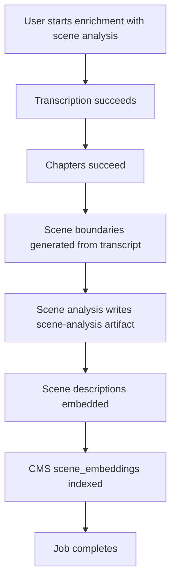
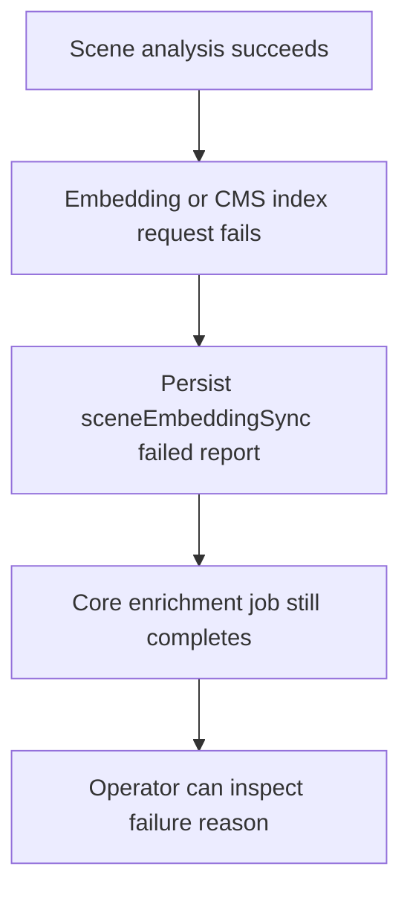
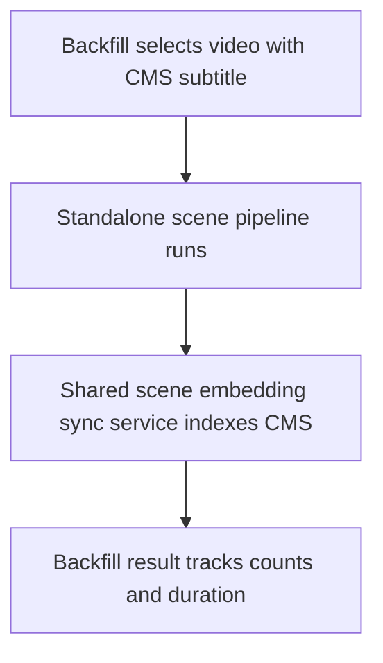

# feat: Integrate scene embeddings into enrichment pipeline

## Overview

Make scene embedding/indexing part of the optional enrichment scene-analysis path, so a completed enrichment job can produce:

1. transcript and subtitles from Mux transcription
2. chapters and scene boundaries from the generated transcript
3. scene analysis from Mux still frames plus the generated transcript chunks
4. scene embeddings indexed into CMS `scene_embeddings`

The main reason is transcript availability. The standalone backfill pipeline was intentionally decoupled from enrichment because many catalog videos already had human-produced Core API subtitles. That is still useful for backfill. But for new enrichment jobs, the workflow itself already guarantees a transcript after the `transcription` step, so scene embeddings should not require an existing CMS subtitle URL.

## Problem Statement

Current state has two partial paths:

- `apps/manager/src/workflows/videoEnrichment.ts` can optionally run scene analysis after transcription, chapters, and scene boundaries when `runSceneAnalysis` is true. It writes the `scene-analysis` artifact but stops before embedding/indexing those scenes.
- `apps/manager/src/services/sceneEmbedder.ts` runs the standalone subtitle-driven backfill path, reads `scene-analysis`, embeds scene descriptions, and posts rows to CMS `/scene-embedding/index`.

This creates a gap: enrichment-created videos can have generated transcripts and scene analysis, but still miss the `scene_embeddings` index that powers recommendations and semantic grouping.

## Proposed Solution

Keep both scene-analysis entry points, but share the embedding/indexing part.

1. Extract the "read or receive scene analysis -> embed descriptions -> index into CMS" logic from `sceneEmbedder.ts` into a reusable manager service.
2. Keep `processVideoForBackfill()` as a wrapper for the existing subtitle-driven catalog backfill, but make it call the shared service.
3. In `videoEnrichment.ts`, after optional `analyzeAllScenes()` succeeds, call the shared service with the in-memory scene analysis result so it does not need to re-read artifact storage.
4. Update the CMS scene-embedding index API to support `videoDocumentId` targets, or add an equivalent manager-side resolver, so enrichment does not need to know Strapi's numeric `videoId`.
5. Persist a compact scene-embedding sync report into the enrichment job artifact metadata, similar in spirit to transcript embedding sync, so failures are visible without making core enrichment fail.

Recommended v1 policy: scene embedding remains optional and error-isolated under `runSceneAnalysis`. If scene embedding fails, the job should record a failed scene-embedding sync report and keep the core enrichment job completed.

## Key Decisions

### Keep standalone backfill and enrichment integration

The earlier decoupling decision remains correct for bulk catalog processing:

- standalone backfill consumes existing Core API VTT subtitles
- enrichment consumes the Mux-generated transcript from the same job

Unifying the execution entry point would reintroduce the wrong dependency for one of these use cases. Instead, unify the embedding/indexing service that both paths call.

### Accept `videoDocumentId` for scene indexing

`/scene-embedding/index` currently requires numeric `videoId` in every scene row. Enrichment jobs already carry `videoDocumentId` for transcript embedding sync, not necessarily numeric Strapi row IDs.

Preferred implementation:

- Add a `videoDocumentId` request-level target to CMS `/scene-embedding/index`.
- Resolve it inside CMS to a published numeric video row, following the pattern in `apps/cms/src/api/embedding/services/indexer.ts`.
- Preserve numeric `videoId` support for backfill and existing callers.
- Reject draft-only or missing videos with explicit 409/404 errors.

This keeps CMS responsible for its own row identity and mirrors the transcript embedding endpoint.

### Do not force scene embeddings into `embeddings.json`

Transcript chunk embeddings and scene embeddings are different products:

- transcript embeddings index what was said, chunked from the transcript
- scene embeddings index an LLM-generated scene description enriched by visual stills, themes, tone, scripture, demographics, and spiritual context

Keep `embeddings.json` focused on transcript and optional video metadata embeddings. Scene analysis remains `scene-analysis.json`; scene embedding sync can be represented as a separate job metadata artifact such as `sceneEmbeddingSync`.

### Use the same embedding model but not necessarily the same implementation

Both transcript and scene embeddings use `text-embedding-3-small` semantics. The current transcript service has stronger response validation in `embeddings.ts`, while `sceneEmbedder.ts` has batch retry plus single-item fallback.

Implementation should either:

- extract a small shared `requestEmbeddingVectors()` helper from `embeddings.ts`, if that stays clean; or
- keep a scene-specific helper but copy the stronger response ordering/dimension validation.

Do not overbuild a generic embedding framework in this slice.

## Technical Approach

### 1. Manager shared scene embedding service

Create a service responsible for scene embedding and CMS indexing, for example:

- `apps/manager/src/services/sceneEmbeddingSync.ts`

Suggested API:

```ts
type SyncSceneAnalysisInput = {
  assetId: string
  videoDocumentId?: string
  videoId?: number
  coreId?: string | null
  muxAssetId: string
  playbackId: string
  language?: string
  analysisResult?: SceneAnalysisResult
}
```

Responsibilities:

- load `scene-analysis.json` only when `analysisResult` is not provided
- filter empty descriptions before embedding
- request embeddings in batches
- validate embedding count, order, dimension, and finite values
- fallback to one-at-a-time embedding when batch embedding fails, preserving the existing resilience behavior
- build CMS scene rows
- post rows to CMS in chunks to avoid large payloads
- return a compact report with status, scene counts, skipped empty scenes, model, dimensions, token usage when available, and CMS indexed count

### 2. Backfill wrapper reuse

Update `apps/manager/src/services/sceneEmbedder.ts` so `processVideoForBackfill()` still owns:

- running `runSceneAnalysisPipeline()`
- cost/timing metadata for backfill
- adapting `BackfillVideo` into the shared service input

But it should no longer own all scene embedding request/indexing logic directly.

### 3. Enrichment workflow wiring

In `apps/manager/src/workflows/videoEnrichment.ts`, extend the existing `if (input.runSceneAnalysis)` block:

1. generate boundaries from `chaptersResult.value.result.chapters` and `transcription.text`
2. run `analyzeAllScenes()`
3. call the new `syncSceneAnalysisEmbeddings()` with the in-memory analysis result
4. persist a job artifact metadata entry such as `artifacts.sceneEmbeddingSync`
5. log and persist failures without failing the overall enrichment job

Use the same error-isolated pattern already documented in `docs/solutions/platform/multimodal-scene-analysis-pipeline.md`.

### 4. CMS scene index target resolution

Extend `apps/cms/src/api/scene-embedding/services/indexer.ts` and controller validation so `/scene-embedding/index` accepts one of:

- legacy row-level `scenes[].videoId`
- request-level `videoId`
- request-level `videoDocumentId`

Recommended request shape for enrichment:

```json
{
  "videoDocumentId": "abc123",
  "scenes": [
    {
      "muxAssetId": "mux_asset_id",
      "playbackId": "playback_id",
      "sceneIndex": 0,
      "startSeconds": 0,
      "endSeconds": 30,
      "description": "Themes: hope...",
      "embedding": [0.1]
    }
  ]
}
```

CMS should resolve the request-level target and apply the resolved numeric `videoId` to every scene before delete/insert.

Validation rules:

- if both request-level target and row-level `videoId` are present, they must not conflict
- target must resolve to a published video
- duplicate `(resolvedVideoId, sceneIndex)` should still be rejected
- `skipDelete` should remain supported for chunked uploads, but only within a single resolved target per request

### 5. Reporting and UI behavior

The first implementation can avoid a large UI surface. Store enough data for operators and follow-up UI:

```ts
type SceneEmbeddingSyncReport = {
  domain: "scene_embeddings"
  status: "indexed" | "skipped_empty" | "unsupported" | "failed"
  videoDocumentId?: string
  resolvedVideoId?: number
  model?: string
  dimensions?: number
  generatedSceneCount: number
  indexableSceneCount: number
  indexedSceneCount?: number
  skippedEmptySceneIndexes?: number[]
  reason?: string
}
```

For the job page v1:

- no noisy success subline is required if scene embeddings succeed
- if it fails, show a compact failed sync detail under the scene analysis area or future scene embeddings step
- do not add overwrite/approval UI unless there is an intentional scene-embedding overwrite policy to expose

## User Flows

### Flow 1: New enrichment job with scene analysis enabled



Expected outcome: video has scene rows in CMS without needing a pre-existing CMS subtitle URL.

### Flow 2: Scene embedding fails after scene analysis succeeds



Expected outcome: optional recommendation indexing failure is visible but does not turn the whole enrichment job red.

### Flow 3: Existing backfill worker



Expected outcome: backfill behavior remains compatible while sharing the indexing implementation.

## Acceptance Criteria

- [ ] Enrichment jobs with `runSceneAnalysis: true` index scene embeddings into CMS after scene analysis succeeds.
- [ ] Enrichment scene embedding indexing uses the generated enrichment transcript path, not `subtitleUrl`.
- [ ] Backfill still processes existing subtitle-backed videos and indexes scene embeddings.
- [ ] Shared manager scene embedding sync logic handles empty scene descriptions, batch embedding failures, single-item fallback, chunked CMS index posts, and structured reports.
- [ ] CMS `/scene-embedding/index` supports `videoDocumentId` resolution to a published video while preserving existing numeric `videoId` callers.
- [ ] Scene embedding failures in enrichment are persisted and logged but do not fail the core enrichment job.
- [ ] No duplicate or conflicting `(video, sceneIndex)` rows are inserted during a chunked CMS upload.
- [ ] Tests cover enrichment success, enrichment scene-embedding failure, backfill reuse, CMS `videoDocumentId` resolution, and CMS validation failures.

## Non-Goals

- Do not mix transcript table naming cleanup into this slice. That work is tracked separately under `docs/roadmap/content-discovery/feat-080-transcript-embedding-table-rename.md`.
- Do not merge transcript chunk embeddings and scene embeddings into one table.
- Do not build the final recommendation UI.
- Do not require scene embedding for every enrichment job unless the caller enables scene analysis.
- Do not add a broad generic CMS sync framework unless a second scene-specific approval flow becomes necessary.
- Do not switch from thumbnail stills to native video input in this slice.

## Implementation Units

### Unit 1: CMS scene target resolution

Files:

- `apps/cms/src/api/scene-embedding/services/indexer.ts`
- `apps/cms/src/api/scene-embedding/controllers/scene-embedding.ts`
- `apps/cms/src/api/scene-embedding/controllers/scene-embedding.test.ts` or existing CMS test location

Tasks:

- add target resolution by `videoDocumentId` following the transcript embedding indexer pattern
- enforce published-only resolution
- allow request-level target fields while preserving row-level `videoId` compatibility
- return resolved video summary in the index response

### Unit 2: Shared manager scene embedding sync service

Files:

- `apps/manager/src/services/sceneEmbeddingSync.ts`
- `apps/manager/src/services/sceneEmbeddingSync.test.ts`
- optionally `apps/manager/src/services/embeddings.ts` if extracting a focused vector-request helper

Tasks:

- move scene description embedding/indexing out of `sceneEmbedder.ts`
- keep existing retry and single-item fallback behavior
- improve response validation to match transcript embedding expectations
- return a typed report suitable for job artifact metadata

### Unit 3: Backfill wrapper migration

Files:

- `apps/manager/src/services/sceneEmbedder.ts`
- existing backfill tests, if present

Tasks:

- keep `processVideoForBackfill()` behavior stable
- call the shared service after `runSceneAnalysisPipeline()`
- preserve returned backfill metrics: `videoId`, `sceneCount`, token usage, embedding tokens, and duration

### Unit 4: Enrichment workflow integration

Files:

- `apps/manager/src/workflows/videoEnrichment.ts`
- `apps/manager/src/workflows/videoEnrichment.test.ts`
- `apps/manager/src/types/job.ts`
- `apps/manager/src/lib/state.ts` or artifact normalization helpers if needed

Tasks:

- call shared scene embedding sync after `analyzeAllScenes()`
- pass `videoDocumentId`, `muxAssetId`, `playbackId`, transcript language, and in-memory scene analysis
- persist `sceneEmbeddingSync` artifact metadata
- keep the optional scene-analysis error boundary intact

### Unit 5: Minimal job detail surfacing

Files:

- `apps/manager/src/features/jobs/live-job-steps-table.tsx`
- `apps/manager/src/features/jobs/embedding-sync-card.test.ts` or a new focused job-step test

Tasks:

- avoid success noise when scene embeddings index cleanly
- surface failed/unsupported scene embedding sync state only when useful
- keep styling consistent with existing job detail cards if any UI is added

## Verification Plan

Automated:

- `pnpm --filter @forge/cms test -- src/api/scene-embedding/controllers/scene-embedding.test.ts src/api/scene-embedding/services/indexer.test.ts`
- `pnpm --filter @forge/manager test -- src/services/sceneEmbeddingSync.test.ts src/services/sceneEmbedder.test.ts src/workflows/videoEnrichment.test.ts`
- `pnpm --filter @forge/cms typecheck`
- `pnpm --filter @forge/manager typecheck`
- targeted eslint/prettier on touched CMS and manager files

Manual:

- Run one enrichment job with `runSceneAnalysis: true` and a `videoDocumentId`.
- Confirm the job produces `scene-analysis.json`.
- Confirm `scene_embeddings` row count grows for the resolved video.
- Confirm no pre-existing CMS `subtitleUrl` is required for the enrichment path.
- Re-run the same job or sync path and confirm delete/insert remains idempotent.
- Force CMS indexing failure and confirm the job records a failed scene-embedding sync report while core enrichment still completes.

SQL spot checks:

```sql
SELECT video_id, COUNT(*) AS scenes
FROM scene_embeddings
WHERE video_id = :resolved_video_id
GROUP BY video_id;
```

```sql
SELECT scene_index, description, model, language
FROM scene_embeddings
WHERE video_id = :resolved_video_id
ORDER BY scene_index;
```

## Risks and Mitigations

- **Risk: numeric/video document identity mismatch.** Mitigation: resolve targets inside CMS and reject draft-only/missing videos explicitly.
- **Risk: duplicate or partial rows during chunked uploads.** Mitigation: keep first chunk delete plus subsequent `skipDelete`, but constrain each request to one resolved target and preserve duplicate scene-index validation.
- **Risk: optional scene embeddings make enrichment slower.** Mitigation: only run under `runSceneAnalysis`; keep failures isolated and log timing.
- **Risk: embedding helper duplication drifts between transcript and scene paths.** Mitigation: extract only a small vector request helper or add tests that enforce dimensions/order/finiteness in the scene path.
- **Risk: UI becomes noisy like the transcript embedding sync card did before cleanup.** Mitigation: no success sublines by default; show details only for failed/unsupported states.

## References and Research

- `docs/brainstorms/2026-04-02-video-content-vectorization-requirements.md` - original vectorization requirements and key decision that scene embeddings complement transcript embeddings.
- `docs/plans/2026-04-06-001-feat-multimodal-scene-analysis-plan.md` - explains why standalone scene analysis was decoupled from enrichment for subtitle-backed backfill.
- `docs/solutions/platform/multimodal-scene-analysis-pipeline.md` - documents the current still-frame OpenRouter approach and optional enrichment error-isolation pattern.
- `docs/solutions/best-practices/pgvector-embedding-indexing-strapi-v5.md` - raw SQL pgvector indexing patterns, validation boundaries, batch insert constraints, and HNSW guidance.
- `docs/scene-vectorization-overview.md` - explains how scene descriptions become `text-embedding-3-small` vectors and how recommendations consume `scene_embeddings`.
- `apps/manager/src/workflows/videoEnrichment.ts` - current optional enrichment scene-analysis hook.
- `apps/manager/src/services/sceneEmbedder.ts` - current backfill-only bridge from scene analysis artifacts to CMS scene embedding index.
- `apps/cms/src/api/scene-embedding/services/indexer.ts` - current CMS scene embedding write path.
- `apps/cms/src/api/embedding/services/indexer.ts` - transcript embedding target-resolution pattern to reuse.
