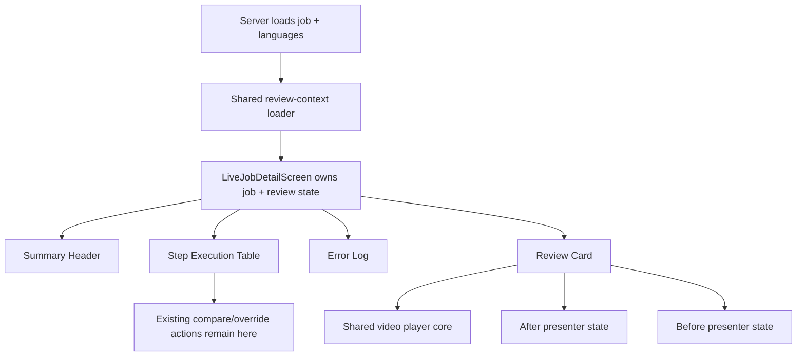

# feat: Add job detail enrichment review player

## Overview

Add a new review card to the manager job details page, placed below the existing
`Error Log`, that lets operators inspect enrichment results through a unified
Before / After surface.

The card should default to `After`, reuse the same player behavior as the web
video player, and switch both the player and the surrounding detail panel when
tabs change. `Before` means current live Mux and CMS state for the target
video. `After` means generated outputs from the current enrichment job. In v1,
the review card is read-first: it summarizes the enrichment outcome in context,
while existing step-level compare and override cards remain the authoritative
action surfaces.

Because the repo explicitly forbids cross-imports between app contexts, “reuse
the apps/web player” cannot mean importing
[Video.tsx](/Users/o/.codex/worktrees/e3cc/forge/apps/web/src/components/sections/Video.tsx)
directly into manager. The smallest honest way to reuse that player is to
extract a shared `video.js` player core into `packages/`, then have both
`apps/web` and `apps/manager` wrap the same primitive.

## Problem Statement

The current manager job detail page gives operators fragments of the story:

- summary header and Mux link
- step execution table
- step-level compare cards for specific domains such as Mux subtitle sync and
  transcript embedding sync
- raw artifact links
- error log

What it does not provide is one coherent review surface that answers:

- what does the enriched video look like now?
- what does the live current state look like before those generated changes?
- which generated subtitles, chapters, title, and description should the
  operator be reviewing together?

That gap makes QA slower and more error-prone. Operators have to mentally stitch
the result together from workflow rows and artifact downloads instead of
reviewing the player and adjacent content in one place.

## Found Brainstorm

Found brainstorm from 2026-04-12:
[docs/brainstorms/2026-04-12-job-detail-enrichment-review-player-brainstorm.md](/Users/o/.codex/worktrees/e3cc/forge/docs/brainstorms/2026-04-12-job-detail-enrichment-review-player-brainstorm.md).
Using it as context for planning.

Key decisions already made in the brainstorm:

- add one unified review card at the bottom of the job page
- place it below `Error Log`
- use live current Mux and CMS state for `Before`
- use current job artifacts and compare reports for `After`
- switch both player and detail panel together when tabs change

## Research Decision

Local repo context is strong for this feature, so external research is not
needed.

The codebase already has:

- a clear manager job-detail page composition
- existing compare-card patterns for step-level review
- a canonical web `video.js` player implementation
- institutional learnings about job read-model promotion, Mux subtitle flows,
  and stable player reuse

## Repo Workflow Notes

Implementation should follow the repo workflow rules already documented in
[CLAUDE.md](/Users/o/.codex/worktrees/e3cc/forge/CLAUDE.md) and
[AGENTS.md](/Users/o/.codex/worktrees/e3cc/forge/AGENTS.md):

- branch name: `feat/job-detail-enrichment-review-player`
- PR target branch: `main`
- PR title format: `feat(manager): add job detail enrichment review player`
- keep this work in one scope-focused PR
- follow the repo workflow checklist: `ce:plan -> ce:work -> ce:review -> ce:compound`

## Current State Research

### Existing page composition

The current job page is straightforward:

- [apps/manager/src/app/dashboard/jobs/[id]/page.tsx](/Users/o/.codex/worktrees/e3cc/forge/apps/manager/src/app/dashboard/jobs/[id]/page.tsx)
  renders:
  - the live header block
  - the step table
  - the `Error Log`
- [apps/manager/src/features/jobs/live-job-detail-header.tsx](/Users/o/.codex/worktrees/e3cc/forge/apps/manager/src/features/jobs/live-job-detail-header.tsx)
  currently owns local job state and delegates live polling through
  [apps/manager/src/features/jobs/live-job-steps-table.tsx](/Users/o/.codex/worktrees/e3cc/forge/apps/manager/src/features/jobs/live-job-steps-table.tsx)

That makes the placement simple, but it also reveals an architectural gap: the
new review card cannot safely live below `Error Log` and stay in sync unless the
page has one shared live-state owner instead of separate local state islands.

### Existing compare and review patterns

Manager already has good precedents for small review surfaces:

- [apps/manager/src/features/jobs/live-job-steps-table.tsx](/Users/o/.codex/worktrees/e3cc/forge/apps/manager/src/features/jobs/live-job-steps-table.tsx)
  includes inline Mux subtitle compare cards and override actions
- [apps/manager/src/features/jobs/embedding-sync-card.tsx](/Users/o/.codex/worktrees/e3cc/forge/apps/manager/src/features/jobs/embedding-sync-card.tsx)
  establishes the current compare-card language:
  - title
  - status badge
  - two-panel summary grid
  - explicit action messaging

Those patterns support building a new bottom review card without redesigning the
page, but they also argue against duplicating action buttons in two surfaces.

### Canonical player reuse boundary

The reusable web player behavior lives today in:

- [apps/web/src/components/sections/Video.tsx](/Users/o/.codex/worktrees/e3cc/forge/apps/web/src/components/sections/Video.tsx)
- [apps/web/src/components/sections/CarouselVideo.tsx](/Users/o/.codex/worktrees/e3cc/forge/apps/web/src/components/sections/CarouselVideo.tsx)

Important constraints:

- the repo forbids cross-imports between app contexts
- there is no shared tabs primitive today
- there is no existing shared player package

That means the plan needs to avoid both bad options:

1. importing `apps/web` code directly into manager
2. building a third manager-only `video.js` player

The right move is a small shared package that holds the generic `video.js`
player shell and lets each app keep app-specific wrappers.

### Available data today

The current job page has strong generated-data access but weak live-state access:

- [apps/manager/src/lib/job-artifacts.ts](/Users/o/.codex/worktrees/e3cc/forge/apps/manager/src/lib/job-artifacts.ts)
  already maps:
  - `transcript`
  - `subtitles`
  - `chapters`
  - `metadata`
  - `embeddings`
  - `subtitles-{lang}`
  - `translation-{lang}`
- [apps/manager/src/types/job.ts](/Users/o/.codex/worktrees/e3cc/forge/apps/manager/src/types/job.ts)
  already has durable compare reports for:
  - `muxSync`
  - `embeddingSync`
  - `sceneEmbeddingSync`
- [apps/manager/src/lib/state.ts](/Users/o/.codex/worktrees/e3cc/forge/apps/manager/src/lib/state.ts)
  already promotes source-language provenance from `materialization`

But `Before` is not yet well-defined in code:

- the server page query returns the job plus language labels
- it does not return a live CMS/Mux review model for subtitles, title,
  description, or chapters
- `JobRecord` does not yet expose a single top-level review source for the
  target `videoDocumentId`

So the plan must explicitly define where each `Before` domain comes from.

### Relevant institutional learnings

The most relevant documented learnings are:

1. [docs/solutions/integration-issues/manager-job-read-model-source-language-metadata-20260409.md](/Users/o/.codex/worktrees/e3cc/forge/docs/solutions/integration-issues/manager-job-read-model-source-language-metadata-20260409.md)
   - keep read-model promotion in one boundary
   - support both object-shaped and legacy stringified metadata payloads
2. [docs/solutions/integration-issues/manager-mux-subtitle-override-recovery-non-destructive-replacement-20260410.md](/Users/o/.codex/worktrees/e3cc/forge/docs/solutions/integration-issues/manager-mux-subtitle-override-recovery-non-destructive-replacement-20260410.md)
   - Mux subtitle replacement must stay non-destructive and resumable
3. [docs/solutions/platform/videoforge-manager-integration.md](/Users/o/.codex/worktrees/e3cc/forge/docs/solutions/platform/videoforge-manager-integration.md)
   - Mux subtitles are the real transcription source
   - shared SDK clients should stay lazy
4. [docs/solutions/best-practices/playlist-video-player-sdui-mobile-20260409.md](/Users/o/.codex/worktrees/e3cc/forge/docs/solutions/best-practices/playlist-video-player-sdui-mobile-20260409.md)
   - keep one stable player instance rather than remounting repeatedly
5. [docs/solutions/integration-issues/manager-coverage-dashboard-review-regression-cleanup.md](/Users/o/.codex/worktrees/e3cc/forge/docs/solutions/integration-issues/manager-coverage-dashboard-review-regression-cleanup.md)
   - do not collapse empty and failed states into one signal

## Alternative Approaches Considered

### 1. Import the web player directly into manager

Rejected because the repo explicitly disallows cross-imports between app
contexts.

### 2. Build a manager-only player that visually matches the web player

Rejected because the repo already has duplicated `video.js` logic inside web,
and a third implementation would make playback and caption behavior drift.

### 3. Persist a frozen pre-job `Before` snapshot

Rejected for v1 because the user explicitly chose live current state for
`Before`, and a durable snapshot model would expand scope into new persistence
contracts.

## Scope Boundaries

In scope:

- a new bottom review card below `Error Log`
- shared player extraction so manager and web reuse the same player core
- a live `Before` review data contract for subtitles, title, description, and
  chapter fallback state
- generated `After` review data driven by current job artifacts and compare
  reports
- explicit partial-state handling
- red/green test coverage and a user smoke test

Out of scope:

- new CMS content types or new CMS sync persistence for chapters
- moving all step-level compare flows into the new review card
- redesigning the whole job detail page
- replacing current Mux or embedding override flows
- a frozen pre-job snapshot model
- hero-player or watch-page redesign work in `apps/web`

## Product Decisions

### 1. The new review card is additive and read-first

In v1, the review card summarizes and presents state. Existing step-level cards
remain the authoritative action surfaces for:

- Mux subtitle override
- transcript embedding override
- any failure remediation already attached to workflow rows

The new card may link or visually point operators toward those existing step
surfaces, but it should not duplicate mutating actions in its first version.

### 2. `After` is the default tab

Operators arrive on this page to review what the job produced. Defaulting to
`After` keeps the first render aligned with that task.

### 3. `Before` and `After` switch the whole review mode together

The tab selection changes:

- the player subtitle context
- the adjacent title / description panel
- the chapter summary panel
- the availability messaging for missing live or generated content

It does **not** leave the player on one state while the details move to another.

### 4. The player video source stays stable across tabs in v1

Use the job’s `muxPlaybackId` HLS stream for both tabs in v1.

Rationale:

- the underlying video content is the same review subject
- the important comparison is subtitle track plus surrounding enrichment detail,
  not a separate pre-job and post-job video render
- keeping the HLS source stable avoids unnecessary player churn and aligns with
  the stable-player learning from the mobile playlist work

Tabs should change track registration and surrounding detail content, not force
player remounts or unrelated source changes.

### 5. Define `Before` per domain

#### Player subtitle track

- `Before`: current live Mux subtitle track for the active language when
  available
- `After`: generated job subtitle artifact for the active language when
  available

If neither exists for a tab/language pair, the player still renders and the card
shows an explicit `No subtitle track available` state.

#### Title and description

- `Before`: current live CMS values for the target video
- `After`: generated metadata artifact values from the current job

#### Chapters

- `Before`: current live CMS chapter data if available for this video and
  language
- `After`: generated chapter artifact

If live chapters do not exist yet in the current product slice, the `Before`
chapter panel must show an explicit unavailable state rather than pretending the
domain is comparable.

#### Provenance and compare status

Use durable job metadata and compare reports when available:

- `materialization`
- `muxSync`
- `embeddingSync`
- `sceneEmbeddingSync`

The review card should consume normalized helpers rather than digging through
nested artifact JSON ad hoc.

### 6. Multi-language selection must be explicit

For jobs with multiple generated language outputs:

- default active language:
  1. `primaryRequestedTargetLanguageCode` when that language has a generated
     subtitle artifact
  2. first `resolvedTargetLanguageCodes` entry with generated subtitle data
  3. first sorted generated subtitle artifact language
  4. `sourceLanguageCode`
- preserve the operator’s selected language across tab switches and live refresh
- if a selected language has data only on one tab, keep the selection and show
  an explicit unavailable state on the other tab instead of silently switching
  languages

### 7. Empty, unsupported, and failed are separate states

The review card must distinguish:

- `loading`
- `loaded_empty`
- `unsupported`
- `failed`

This matters most for older jobs and partial jobs where:

- `videoDocumentId` is missing
- live CMS data cannot be queried
- live Mux subtitle data is absent
- generated metadata or chapter artifacts were never produced

## Technical Approach

### 1. Introduce one shared live job-detail state owner

The current page splits responsibility across:

- page server render
- `LiveJobDetailHeader`
- `LiveJobStepsTable`

To keep the new review card synchronized, introduce one client-side detail
screen component that owns:

- current `JobRecord`
- polling lifecycle
- derived compare state
- review card selection state

Recommended shape:

- add a new client component such as
  `apps/manager/src/features/jobs/live-job-detail-screen.tsx`
- move the current header + steps composition into it
- render:
  - summary header
  - step table
  - error log
  - review card

This avoids drift where the step table refreshes but the review card does not.

### 2. Add a manager-owned review context loader

Create one shared server-side loader that can be used by:

- initial server render
- a manager API route for refreshes

Recommended shape:

- shared function:
  `apps/manager/src/features/jobs/review-player/load-job-review-context.ts`
- refresh route:
  `apps/manager/src/app/api/jobs/[id]/review-context/route.ts`

The loader should:

1. accept the current `JobRecord`
2. resolve the target video identity
3. read current live CMS state for `Before`
4. read current live Mux subtitle state for `Before`
5. read generated job artifacts for `After`
6. return one normalized review context for the presenter/UI

### 3. Promote or resolve the target video identity cleanly

Do not make the UI hunt for `videoDocumentId` in raw nested artifacts.

Recommended options, in order:

1. expose `video.documentId` in the job page query and page-level server loader
2. if a top-level `JobRecord.videoDocumentId` promotion is warranted, add it in
   the same read-model boundary pattern used for source-language promotion
3. fall back to `materialization` only inside a shared loader, never in the UI

The chosen implementation should follow the precedent from
[docs/solutions/integration-issues/manager-job-read-model-source-language-metadata-20260409.md](/Users/o/.codex/worktrees/e3cc/forge/docs/solutions/integration-issues/manager-job-read-model-source-language-metadata-20260409.md):
one promotion boundary, not duplicated field digging in multiple components.

### 4. Extract a shared `video.js` player package

Add a small shared workspace package, for example:

- `packages/video-player/`

It should contain only the reusable player core:

- `video.js` instance lifecycle
- stable player ref
- play / pause
- mute / unmute
- fullscreen
- scrubber / time display
- track registration API
- source + poster updates without destructive remount behavior

Then update:

- `apps/web/src/components/sections/Video.tsx`
- `apps/web/src/components/sections/CarouselVideo.tsx`
- manager review-card wrapper

to consume that shared primitive.

This keeps the user’s “use the apps/web player” request honest without breaking
the repo boundary rules.

### 5. Keep the review view-model explicit and testable

Add a pure presenter layer, for example:

- `apps/manager/src/features/jobs/review-player/review-player-presenter.ts`

Responsibilities:

- map `JobRecord` + live review context into UI-ready data
- choose default tab
- choose default language
- preserve language selection rules
- surface `missing` vs `failed` vs `unsupported`
- expose read-only links or anchors back to existing step-level compare surfaces

This should be mostly pure data transformation, with strong unit coverage.

### 6. Use a conservative first version of the UI

Recommended card layout:

1. card header
   - title
   - active language selector when relevant
   - compact status summary
2. tab strip
   - `After`
   - `Before`
3. shared player area
4. two-column detail area
   - metadata panel
   - subtitle / chapter / provenance summary panel

Keep the new tabs local to this card. There is no existing shared tabs primitive
to reuse directly, so a focused local component is the right size.

### 7. Relationship to existing step cards

In v1:

- keep Mux subtitle compare cards inside the step table
- keep embedding sync compare cards inside the step table
- let the review card summarize those states
- if the operator needs an override action, they use the existing step-level
  surface

That keeps the new card from becoming a second competing action center.

## Flow Diagram

## Red/Green TDD Units

- [x] **Unit 1: Define the review-state contract and selection rules**

  **Goal:** Make the tab, language, and empty-state behavior deterministic
  before touching UI.

  **Files:**
  - Add: [apps/manager/src/features/jobs/review-player/review-player-presenter.ts](/Users/o/.codex/worktrees/e3cc/forge/apps/manager/src/features/jobs/review-player/review-player-presenter.ts)
  - Add tests beside it
  - Update: [apps/manager/src/types/job.ts](/Users/o/.codex/worktrees/e3cc/forge/apps/manager/src/types/job.ts) only if new read-only review types are needed

  **Red**
  - failing tests for:
    - default tab = `After`
    - default language selection order
    - preserving selected language across tab switches
    - `loaded_empty` vs `failed` vs `unsupported`
    - older jobs with no usable `videoDocumentId`

  **Green**
  - implement a pure presenter that maps:
    - live CMS/Mux review context
    - generated job artifacts
    - existing compare reports
      into one UI-ready state tree

- [x] **Unit 2: Extract the shared `video.js` player core**

  **Goal:** Reuse the web player honestly without cross-importing app code.

  **Files:**
  - Add: [packages/video-player/package.json](/Users/o/.codex/worktrees/e3cc/forge/packages/video-player/package.json)
  - Add package source + tests
  - Add package `test`, `lint`, and `typecheck` scripts so workspace validation can run cleanly
  - Update: [apps/web/src/components/sections/Video.tsx](/Users/o/.codex/worktrees/e3cc/forge/apps/web/src/components/sections/Video.tsx)
  - Update: [apps/web/src/components/sections/CarouselVideo.tsx](/Users/o/.codex/worktrees/e3cc/forge/apps/web/src/components/sections/CarouselVideo.tsx)

  **Red**
  - failing smoke/component tests for the shared player core:
    - source update without destructive remount assumptions
    - control callbacks still wire correctly
    - optional text-track registration API works

  **Green**
  - move the generic player lifecycle into the new package
  - keep app-specific wrappers thin
  - preserve current web behavior for controls and poster handling

- [x] **Unit 3: Build the live `Before` / generated `After` data loader**

  **Goal:** Give the review card one trustworthy server-side source instead of
  deriving everything in the UI.

  **Files:**
  - Add: [apps/manager/src/features/jobs/review-player/load-job-review-context.ts](/Users/o/.codex/worktrees/e3cc/forge/apps/manager/src/features/jobs/review-player/load-job-review-context.ts)
  - Add: [apps/manager/src/app/api/jobs/[id]/review-context/route.ts](/Users/o/.codex/worktrees/e3cc/forge/apps/manager/src/app/api/jobs/[id]/review-context/route.ts)
  - Update: [apps/manager/src/app/dashboard/jobs/[id]/page.tsx](/Users/o/.codex/worktrees/e3cc/forge/apps/manager/src/app/dashboard/jobs/[id]/page.tsx)
  - Update: [apps/manager/src/lib/state.ts](/Users/o/.codex/worktrees/e3cc/forge/apps/manager/src/lib/state.ts) or page query only if needed for a cleaner `videoDocumentId` path
  - Update: [apps/manager/src/services/mux.ts](/Users/o/.codex/worktrees/e3cc/forge/apps/manager/src/services/mux.ts) only if a small live text-track inspection helper is needed

  **Red**
  - failing tests for:
    - live CMS title/description resolution
    - live Mux subtitle-track resolution
    - generated subtitle artifact resolution by language
    - explicit missing chapter fallback
    - separate empty vs failed results

  **Green**
  - implement the review-context loader
  - use the job playback source for both tabs
  - return explicit domain-level states for subtitles, metadata, chapters, and
    provenance

- [x] **Unit 4: Render the review card below `Error Log` with shared live state**

  **Goal:** Add the new review surface without splitting live state across
  multiple components.

  **Files:**
  - Add: [apps/manager/src/features/jobs/live-job-detail-screen.tsx](/Users/o/.codex/worktrees/e3cc/forge/apps/manager/src/features/jobs/live-job-detail-screen.tsx)
  - Add: [apps/manager/src/features/jobs/review-player/review-player-card.tsx](/Users/o/.codex/worktrees/e3cc/forge/apps/manager/src/features/jobs/review-player/review-player-card.tsx)
  - Update: [apps/manager/src/features/jobs/live-job-detail-header.tsx](/Users/o/.codex/worktrees/e3cc/forge/apps/manager/src/features/jobs/live-job-detail-header.tsx)
  - Update: [apps/manager/src/features/jobs/live-job-steps-table.tsx](/Users/o/.codex/worktrees/e3cc/forge/apps/manager/src/features/jobs/live-job-steps-table.tsx)
  - Update: [apps/manager/src/app/dashboard/jobs/[id]/page.tsx](/Users/o/.codex/worktrees/e3cc/forge/apps/manager/src/app/dashboard/jobs/[id]/page.tsx)
  - Update: [apps/manager/src/app/globals.css](/Users/o/.codex/worktrees/e3cc/forge/apps/manager/src/app/globals.css)

  **Red**
  - failing component tests for:
    - review card renders below `Error Log`
    - `After` is selected by default
    - tab switching updates both player and detail panel
    - selected language persists across tab switches
    - existing step compare cards still render
    - unavailable domains show explicit empty-state messaging

  **Green**
  - hoist live job state into one screen-level owner
  - render the new review card below the error block
  - keep step-level action cards intact

## Risks and Mitigations

### Risk: player extraction breaks current web playback behavior

**Mitigation:** keep the extracted package narrowly scoped to the existing
generic player shell and update web wrappers in the same PR with smoke coverage
and `apps/web` typecheck/lint.

### Risk: live `Before` data becomes slow or flaky

**Mitigation:** separate:

- `loaded_empty`
- `unsupported`
- `failed`

and make the review-context loader return explicit per-domain state. Never
collapse live-fetch failure into “no data.”

### Risk: the new card duplicates existing compare and override actions

**Mitigation:** keep the review card read-first in v1 and let step cards remain
the authoritative mutating surfaces.

### Risk: older jobs do not hydrate cleanly

**Mitigation:** reuse the existing read-model promotion pattern and write tests
for legacy `materialization` payload shapes and jobs without usable video
identity.

### Risk: multi-language behavior feels random

**Mitigation:** lock the language-selection order into pure presenter tests and
preserve explicit operator choice across refreshes.

## Verification

### Automated

- `pnpm --filter @forge/manager test`
- `pnpm --filter @forge/manager typecheck`
- `pnpm --filter @forge/manager lint`
- `pnpm --filter @forge/web typecheck`
- `pnpm --filter @forge/web lint`
- targeted tests for the new shared player package if one is added

### User Smoke Test

Use a known completed job that has:

- a playable `muxPlaybackId`
- generated subtitle artifacts
- generated metadata artifact
- generated chapters artifact
- a resolvable target `videoDocumentId` when available

Smoke steps:

1. Run manager locally and open
   `http://localhost:3002/dashboard/jobs/<job-id>` or the equivalent
   environment URL for a completed QA job.
2. Confirm the new review card appears below `Error Log`.
3. Confirm `After` is selected by default.
4. Confirm the player renders and the surrounding detail card shows generated
   subtitle / metadata / chapter context.
5. Switch to `Before` and confirm both the player subtitle context and the
   detail panel update together.
6. If the job has multiple generated subtitle languages, switch languages and
   confirm the selection persists across tab toggles.
7. Confirm live-only or generated-only domains show explicit unavailable states
   instead of blank space or generic failure text.
8. Confirm existing Mux subtitle compare cards and embedding compare cards still
   appear in the step table and continue to own their override actions.

## Success Criteria

- Operators can review a completed enrichment job through one player-centered
  surface instead of stitching the result together from step rows and raw
  artifacts.
- `Before` reliably reflects live current Mux/CMS state, with explicit fallback
  states when a domain is unavailable.
- `After` reliably reflects the current job’s generated artifacts and compare
  summaries.
- Manager and web share one underlying player core rather than diverging into
  separate implementations.
- The change lands as one scope-focused PR on a conventional
  `feat/job-detail-enrichment-review-player` branch targeting `main`.
