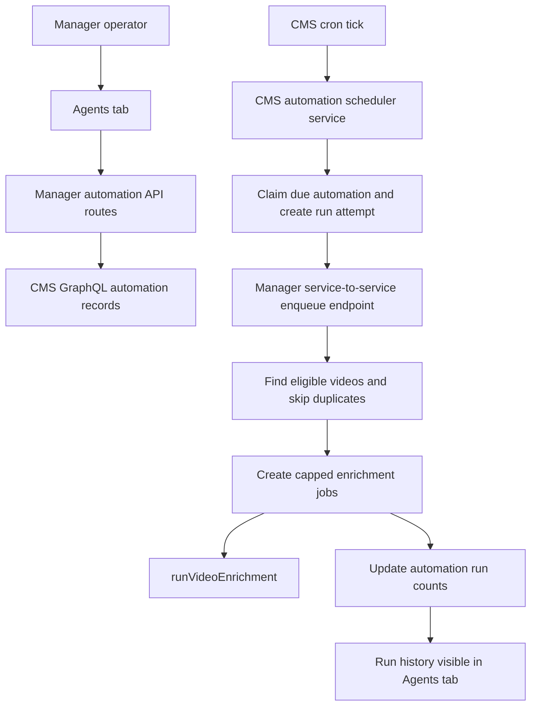
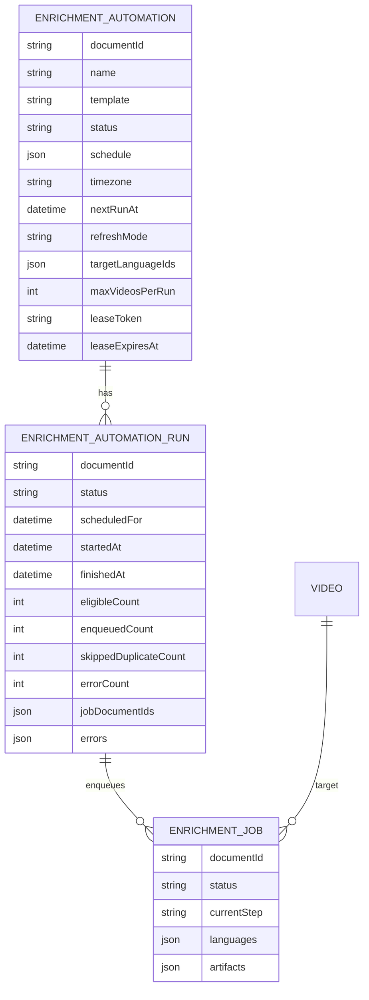

# feat: Manager Agents Automations

## Overview

Add an `Agents` tab to the Manager dashboard for recurring enrichment automations. Operators can create, inspect, pause, and resume template-driven automations such as:

- videos missing source subtitles
- videos missing target-language subtitles or translations
- videos missing metadata
- videos missing transcript embeddings
- videos missing scene embeddings when the existing scene-analysis sync path supports the selected scope

The implementation should use Manager as the operator surface and Strapi CMS as the durable scheduler/state anchor. Active automations keep checking on their schedule until paused, even when the current backlog is empty.

## Found Brainstorm

Found brainstorm from 2026-04-12: `manager-agents-automations`. It resolves the main product direction:

- Primary surface: Manager dashboard `Agents` tab.
- Execution model: CMS-owned durable automation definitions with a Strapi cron-style scheduler.
- Creation model: constrained work templates, not free-form agent prompts.
- Throughput model: schedule cadence and per-cycle cap are separate.
- Backlog behavior: no eligible videos is a normal no-op cycle, not completion.
- Refresh behavior: per-automation `missing only` or `refresh AI-generated too`.
- Language behavior: target languages are required only for subtitle/translation templates.

## Requirements Trace

- R1. Add an `Agents` dashboard tab using the existing Manager nav pattern.
- R2. Show active/current and paused automations, including schedule summaries like `Daily at 9:00 AM` or `Every minute`.
- R3. Create automations from constrained templates only.
- R4. V1 creatable templates cover source subtitles, target subtitles/translations, and metadata; transcript and scene embedding templates remain gated until coverage-backed eligibility exists.
- R5. Require exactly one target language for target subtitle/translation automations.
- R6. Support `missing only` and `refresh AI-generated too` refresh modes.
- R7. Convert UI schedule choices into a narrow cron-compatible execution model.
- R8. Enforce a max videos/jobs per cycle cap.
- R9. Keep active automations running after an empty backlog.
- R10. Execute from Strapi CMS scheduled tasks, not from a browser session.
- R11. Use red/green TDD before implementation.
- R12. Include a user smoke test before PR handoff.

## Scope Boundaries

In scope:

- Manager Agents tab, list sections, creation flow, pause/resume controls, and recent run history.
- CMS-owned automation and run-attempt state.
- CMS cron tick that claims due automations and dispatches capped work through Manager.
- Manager service endpoint that enqueues work for a claimed run.
- Eligibility and de-duplication rules for each V1 template.
- Tests that prove scheduler, cap, dedupe, language validation, pause/resume, no-op cycles, and UI state formatting.

Out of scope for V1:

- Free-form natural language agent instructions.
- Arbitrary user-authored cron strings.
- Editing saved automation definitions after creation. Use pause/resume plus create-new for material changes.
- Forcibly cancelling an already claimed cycle when an automation is paused.
- Rewriting the whole enrichment workflow to become a generic step-subset runner unless the implementation proves that refactor is required and well-tested.
- Broad embedding storage architecture changes beyond the existing transcript/scene embedding sync paths.

## Current State Research

### Manager dashboard and auth

- `apps/manager/src/features/nav/dashboard-nav.tsx` owns the dashboard tabs for `Report` and `Jobs`.
- `apps/manager/src/app/dashboard/layout.tsx` renders the shared dashboard shell and `DashboardNav`.
- `apps/manager/src/app/dashboard/page.tsx` redirects the dashboard root to coverage.
- `apps/manager/src/lib/auth.ts` centralizes Manager API auth with Strapi session cookies and `MANAGER_API_KEY` bearer tokens.
- `apps/manager/src/app/api/backfill/start/route.ts` shows the claim-before-background-dispatch pattern.
- `apps/manager/src/app/api/enrich/route.ts` creates jobs from selected videos and target language IDs, then dispatches `runVideoEnrichment`.

### Job and workflow state

- `apps/cms/src/api/enrichment-job/content-types/enrichment-job/schema.json` is the durable job state model.
- `apps/cms/src/components/enrichment/job-step.json` is the repeatable step component used by jobs.
- `apps/manager/src/lib/state.ts` owns typed GraphQL fragments, `createJob`, `updateJob`, `updateStepStatus`, and read-model normalization.
- `apps/manager/src/workflows/videoEnrichment.ts` currently runs transcription, translation, chapters, metadata, embeddings, mux upload, and optional scene analysis. It does not yet expose a general "run only metadata" or "run only embeddings" mode.
- `apps/manager/src/lib/workflow-steps.ts` defines the persisted step list.

### CMS scheduler and state patterns

- `apps/cms/config/server.ts` wires Strapi cron tasks.
- `apps/cms/config/cron-tasks.ts` registers `coverage-snapshot` and `core-sync` cron tasks.
- `apps/cms/src/api/core-sync/services/core-sync.ts` uses an in-memory single-flight guard plus persisted watermarks.
- `apps/cms/database/migrations/2026.04.02T00.00.00.create-core-sync-states.ts` shows a raw table migration for internal operational state.
- `apps/cms/src/api/coverage-snapshot/services/coverage-snapshot.ts` shows user-visible operational history as a content type.
- `apps/cms/src/middlewares/api-token-auth.ts` explains the repo's custom route API-token middleware.

### Related compound learnings

- `docs/solutions/platform/backfill-worker-pattern-manager-20260407.md`
  - Claim synchronously before background work.
  - Check content type before JSON parsing.
  - Cap error logs and truncate messages.
  - Keep batch workers idempotent and retry persistence writes.
  - Verify Strapi raw SQL column names against the target DB.
- `docs/solutions/cms/strapi-enrichment-job-content-type.md`
  - Use durable Strapi state for jobs.
  - Use `draftAndPublish: false` for operational records that are not editorial content.
  - Repeatable components require read-then-write updates.
- `docs/solutions/performance-issues/manager-video-coverage-sql-aggregation-20260402.md`
  - Bulk dashboard/eligibility reads should avoid Strapi GraphQL N+1 paths.
  - Custom SQL endpoints/services must preserve API-token protection.
- `docs/solutions/cms/core-sync-incremental-delta-sync.md`
  - Persist scheduler watermarks atomically and advance only after success.
- `docs/solutions/cms/codegen-strips-optional-graphql-variables.md`
  - Verify generated GraphQL output after schema changes; optional filters have failed silently before.
- `docs/solutions/best-practices/vector-embedding-storage-scope-sequencing-2026-04-11.md`
  - Keep transcript and scene embedding storage concerns separate and avoid expanding this PR into a vector architecture rewrite.
- `docs/solutions/platform/multimodal-scene-analysis-pipeline.md`
  - Optional scene analysis should be error-isolated and reuse existing clients where possible.

## Research Decision

External research was skipped. The repo has direct, pinned patterns for every relevant moving part: Manager auth/API routes, Strapi cron, durable job state, raw SQL eligibility reads, GraphQL codegen, and enrichment workflow behavior.

## Product Decisions

### 1. Creation defaults to active

When an operator saves a valid automation, create it as `active` and compute the first `nextRunAt`. Operators can immediately pause it from the list.

### 2. Pause blocks future cycles only

Pausing an automation should prevent future claims. It should not try to kill a cycle that has already been claimed and dispatched.

### 3. No-op is a successful run attempt

If no eligible videos are found, record a run attempt with `status: "no_op"` and `enqueuedCount: 0`, advance `nextRunAt`, and keep the automation active.

### 4. Cap videos per cycle

Treat the per-cycle cap as videos per scheduler cycle. If one selected video creates one job in the current workflow, this is equivalent to job count today, but the UI and data model should say videos so the contract survives future multi-job expansion.

### 5. Refresh mode never touches human-owned outputs

`missing only` means no existing output for that template and scope. `refresh AI-generated too` means missing outputs plus AI-owned outputs. Human-owned outputs remain ineligible.

### 6. Store schedules as narrow UI config plus computed next run

Do not store arbitrary cron strings from users. Store a narrow `schedule` JSON shape and a computed `nextRunAt`; the CMS cron task can tick frequently and claim due automations.

Recommended schedule shape:

```ts
type AutomationSchedule =
  | { kind: "every_minute"; timezone: string }
  | { kind: "hourly"; minute: number; timezone: string }
  | { kind: "daily"; hour: number; minute: number; timezone: string }
  | {
      kind: "weekly"
      weekday: "sun" | "mon" | "tue" | "wed" | "thu" | "fri" | "sat"
      hour: number
      minute: number
      timezone: string
    }
```

## Proposed Architecture



### Responsibility split

- Manager owns the operator UI, creation/pause/resume API routes, service-to-service enqueue endpoint, job creation, and workflow dispatch.
- CMS owns automation definitions, run-attempt history, due-time claiming, cron ticks, and any raw SQL needed for efficient eligibility reads.
- `packages/graphql` remains the typed client layer. Do not hand-edit generated outputs; regenerate after CMS schema changes.

## Proposed Data Model

Add CMS content types with `draftAndPublish: false`:

### `enrichment-automation`

Fields:

- `name`: string, required
- `template`: enum
  - `source_subtitles_missing`
  - `target_subtitles_missing`
  - `metadata_missing`
  - `transcript_embeddings_missing`
  - `scene_embeddings_missing`
- `status`: enum `active | paused`, required
- `schedule`: json, required, narrow UI schedule shape
- `scheduleSummary`: string, optional denormalized display text
- `timezone`: string, required
- `nextRunAt`: datetime, nullable
- `lastRunAt`: datetime, nullable
- `lastRunStatus`: enum `success | partial | failed | no_op`, nullable
- `refreshMode`: enum `missing_only | refresh_ai_generated`, required
- `targetLanguageIds`: json, optional string array
- `maxVideosPerRun`: integer, required, min 1
- `leaseToken`: string, nullable
- `leaseExpiresAt`: datetime, nullable
- `runs`: oneToMany relation to `enrichment-automation-run`

### `enrichment-automation-run`

Fields:

- `automation`: manyToOne relation to `enrichment-automation`, required
- `status`: enum `claimed | running | success | partial | failed | no_op`, required
- `scheduledFor`: datetime, required
- `startedAt`: datetime, nullable
- `finishedAt`: datetime, nullable
- `eligibleCount`: integer, default 0
- `enqueuedCount`: integer, default 0
- `skippedDuplicateCount`: integer, default 0
- `errorCount`: integer, default 0
- `jobDocumentIds`: json, bounded string array
- `errors`: json, bounded array of truncated messages
- `summary`: string, optional

Recommended additive job link:

- Add optional `automationRun` relation from `enrichment-job` to `enrichment-automation-run` if implementation confirms it is straightforward after codegen.
- If the relation is too much for V1, persist automation/run metadata in `EnrichmentJob.artifacts.automation` and explicitly document the weaker filtering behavior.

### ERD



## Implementation Units

### Unit 1: Red tests for contracts and scheduler behavior

Goal: fail first on the core product contract before any implementation.

Files to create or modify:

- `apps/cms/src/api/enrichment-automation/services/scheduler.test.ts`
- `apps/cms/src/api/enrichment-automation/services/schedule.test.ts`
- `apps/cms/src/api/enrichment-automation/services/eligibility.test.ts`
- `apps/manager/src/features/agents/schedule-summary.test.ts`
- `apps/manager/src/features/agents/automation-validation.test.ts`
- `apps/manager/src/app/api/automations/route.test.ts`
- `apps/manager/src/app/api/automations/[id]/status/route.test.ts`
- `apps/manager/src/app/api/automations/runs/[id]/enqueue/route.test.ts`

Test scenarios:

- Active due automation is claimed once, creates a run attempt, and advances `nextRunAt`.
- Paused automation is not claimed.
- Existing lease prevents overlapping cycle.
- Empty eligible set records `no_op` and leaves automation active.
- Per-cycle cap never enqueues more than `maxVideosPerRun`.
- Pending/running duplicate jobs in the same automation key are skipped.
- Target subtitle/translation automations require exactly one target language ID.
- Metadata and source subtitle templates do not require target language IDs.
- Embedding templates are rejected for creation and runner no-op stale records until coverage-backed eligibility exists.
- Invalid or later-missing target language IDs fail validation clearly.
- `refresh_ai_generated` includes AI-owned outputs and excludes human-owned outputs.
- Service-to-service enqueue route rejects cookie-only/session callers and accepts the configured bearer key.
- Schedule summaries format every-minute, hourly, daily, and weekly schedules.

Green implementation should not start until these tests fail for the expected reasons.

### Unit 2: CMS automation state and scheduler

Goal: add durable automation definitions, run attempts, and a Strapi cron tick that claims due work.

Files likely to create or modify:

- `apps/cms/src/api/enrichment-automation/content-types/enrichment-automation/schema.json`
- `apps/cms/src/api/enrichment-automation-run/content-types/enrichment-automation-run/schema.json`
- `apps/cms/src/api/enrichment-automation/services/schedule.ts`
- `apps/cms/src/api/enrichment-automation/services/scheduler.ts`
- `apps/cms/src/api/enrichment-automation/services/manager-client.ts`
- `apps/cms/config/cron-tasks.ts`
- `apps/cms/config/server.ts`
- `apps/cms/src/api/enrichment-job/content-types/enrichment-job/schema.json` if adding the optional `automationRun` relation
- `apps/cms/CLAUDE.md` if new env vars become permanent package guidance

Approach:

- Add content types using Strapi conventions and `draftAndPublish: false`.
- Add a cron task such as `enrichment-automations` with a narrow tick rule, defaulting to once per minute.
- Do not tie automation scheduling solely to `CORE_SYNC_ENABLED`. Add a dedicated enable flag, for example `ENRICHMENT_AUTOMATIONS_ENABLED`, and update `server.ts` so cron is enabled when either existing cron work or automations need it.
- Add `MANAGER_INTERNAL_URL` and a Manager bearer secret to CMS env expectations.
- Claim due automations with a transactional raw SQL update when possible:
  - `status = active`
  - `next_run_at <= now`
  - no unexpired lease
  - set `leaseToken` and `leaseExpiresAt`
- Create a run attempt before dispatching to Manager.
- Always release or expire the lease and update `nextRunAt` after terminal run states.
- Bound persisted `errors` and `jobDocumentIds` arrays.

Verification:

- `pnpm --filter @forge/cms test`
- `pnpm --filter @forge/cms lint`
- `pnpm --filter @forge/cms typecheck`

### Unit 3: Manager automation routes and enqueue service

Goal: let the UI manage automation definitions and let CMS cron securely enqueue capped work.

Files likely to create or modify:

- `apps/manager/src/app/api/automations/route.ts`
- `apps/manager/src/app/api/automations/[id]/status/route.ts`
- `apps/manager/src/app/api/automations/runs/[id]/enqueue/route.ts`
- `apps/manager/src/features/agents/automation-contract.ts`
- `apps/manager/src/features/agents/eligibility.ts`
- `apps/manager/src/features/agents/schedule-summary.ts`
- `apps/manager/src/lib/auth.ts` if a service-only bearer helper is needed
- `apps/manager/src/lib/state.ts`
- `apps/manager/src/types/job.ts`
- `apps/manager/src/workflows/videoEnrichment.ts` only if a tested template-to-workflow options contract is required
- `apps/manager/src/config/env.ts`
- `apps/manager/CLAUDE.md` if new env vars become permanent package guidance

Approach:

- UI-facing routes use `authenticateRequest`.
- Service-to-service enqueue route should require the Manager bearer key and should not rely on a browser session.
- Validate request JSON with Zod and the content-type pattern from the backfill route.
- Resolve and validate target language IDs using the existing `deriveEnrichLanguagePlan` conventions.
- Decide whether V1 templates call the full existing enrichment workflow or add explicit step options. If step options are added, test skipped-step persistence and UI display before wiring them to automations.
- Add automation origin metadata or an `automationRun` relation when creating jobs so de-dupe and run history are durable.
- Reuse `createJob`, `updateJob`, and `runVideoEnrichment`; do not create a parallel job-state model.
- Keep transcript and scene embedding templates gated behind coverage-backed eligibility and the existing embedding sync paths.

Verification:

- `pnpm --filter @forge/manager test`
- `pnpm --filter @forge/manager lint`
- `pnpm --filter @forge/manager typecheck`

### Unit 4: Agents dashboard UI

Goal: add the operator surface for listing, creating, pausing, resuming, and understanding automations.

Files likely to create or modify:

- `apps/manager/src/features/nav/dashboard-nav.tsx`
- `apps/manager/src/app/dashboard/agents/page.tsx`
- `apps/manager/src/features/agents/agents-page.tsx`
- `apps/manager/src/features/agents/automation-form.tsx`
- `apps/manager/src/features/agents/automation-list.tsx`
- `apps/manager/src/features/agents/automation-run-history.tsx`
- `apps/manager/src/app/globals.css` or the existing Manager style surface, reusing existing colors only

UI requirements:

- Add `Agents` next to `Report` and `Jobs`.
- Group active/current automations separately from paused automations.
- Show schedule summary, template label, refresh mode, target languages when applicable, cap, next run, last run, and recent result.
- `New automation` flow starts from templates and reveals only relevant fields.
- Target language picker appears only for templates that need it.
- Pause/resume controls update status without deleting history.
- No-op, partial, failed, and successful cycle results should be readable without opening raw JSON.

Design constraints:

- Reuse existing Manager colors; do not introduce new one-off hex values.
- Keep the main dashboard as a real app surface, not a marketing page.
- Buttons/cards should follow the existing dashboard radius and density.
- Keep user-facing copy concise and operational.

Verification:

- Component/helper tests for summary formatting and form validation.
- Browser smoke test described below.

### Unit 5: GraphQL codegen and PR validation

Goal: keep the CMS schema, typed client, and Manager operations aligned.

Files likely to change:

- `apps/cms/schema.graphql` if regenerated by Strapi.
- `packages/graphql/src/graphql-env.d.ts` through the generator only.
- Manager inline GraphQL operations that query/mutate automation records.

Required commands after CMS schema changes:

- `pnpm --filter @forge/cms codegen`
- `pnpm turbo run generate --filter=@forge/graphql`
- Verify optional filters remain present in generated output where queries rely on them.

PR-focused validation:

- `pnpm --filter @forge/cms test`
- `pnpm --filter @forge/cms lint`
- `pnpm --filter @forge/cms typecheck`
- `pnpm --filter @forge/manager test`
- `pnpm --filter @forge/manager lint`
- `pnpm --filter @forge/manager typecheck`
- `pnpm format:check`
- Broaden to `pnpm test`, `pnpm lint`, and `pnpm typecheck` if shared schema/codegen changes affect more than CMS and Manager.

## Red/Green TDD Sequence

1. Write failing CMS scheduler tests for due claim, pause skip, no-op, cap, duplicate skip, lease overlap, and next-run calculation.
2. Implement the smallest CMS state/scheduler logic to turn those tests green.
3. Write failing Manager API tests for create validation, service auth, target language validation, capped enqueue, and run summary updates.
4. Implement Manager routes/services to turn those tests green.
5. Write failing presenter/form tests for template-specific fields and schedule summaries.
6. Implement Agents UI helpers and page components to turn those tests green.
7. Add regression tests around GraphQL operation shape after codegen if optional filters are introduced.
8. Only then run package lint/typecheck and the user smoke test.

## User Smoke Test

Use local Manager and CMS with a small controlled data set.

1. Start local CMS and Manager using the repo's local dev flow.
2. Log in as a Manager user.
3. Open `/dashboard/agents`.
4. Create an automation:
   - template: missing target-language subtitles
   - target language: one available language
   - schedule: every minute
   - cap: 1 video per cycle
   - refresh mode: missing only
5. Confirm it appears under active automations with a readable schedule summary and next-run time.
6. Trigger or wait for one scheduler tick with no eligible videos; confirm a `no_op` run appears and the automation remains active.
7. Seed or identify one eligible video; trigger or wait for the next tick; confirm exactly one job is created and linked to the run.
8. Confirm a second immediate tick does not enqueue the same pending/running video again.
9. Pause the automation; confirm future ticks do not enqueue work.
10. Resume it; confirm `nextRunAt` is recomputed and the automation returns to active.
11. Open the linked job and confirm the normal Jobs detail page still renders the job with expected source-language and artifact metadata.

Capture screenshots or a short video for the PR if the UI changes are non-trivial.

## Risks & Mitigations

- Duplicate automation work and spend
  - Mitigation: transactional claim, per-run lease, pending/running de-dupe, and tests before implementation.
- Browser-session scheduling
  - Mitigation: CMS cron is the only scheduler; service-to-service Manager enqueue uses bearer auth.
- Human content overwrite
  - Mitigation: `refresh_ai_generated` never includes human-owned outputs; tests must cover human-vs-AI eligibility.
- GraphQL schema drift
  - Mitigation: regenerate CMS/package GraphQL outputs in the same PR and inspect generated optional filters.
- Raw SQL drift
  - Mitigation: verify Strapi snake-cased columns against the target DB before merging any eligibility SQL.
- Over-scoping the enrichment workflow
  - Mitigation: keep V1 template-to-workflow mapping explicit; defer broad step-subset workflow refactors unless tests prove they are required.
- UI performance
  - Mitigation: use bounded run history and efficient summary endpoints/queries; avoid bulk nested GraphQL reads for dashboard counts.

## Open Questions With Defaults

1. Should V1 allow editing saved automations?
   - Default: no. Pause/resume only; create a new automation for material changes.
2. Should CMS use existing `MANAGER_API_KEY` or a dedicated CMS-to-Manager secret?
   - Default: reuse the existing bearer key path, but keep the service route bearer-only.
3. Should run history be retained forever?
   - Default: store durable records and only fetch recent runs in Manager; add retention later if storage becomes a real issue.
4. Should pause interrupt an already claimed cycle?
   - Default: no. It blocks future cycles only.
5. Should metadata/embedding templates run the full existing enrichment workflow?
   - Default: yes unless a step-subset workflow contract is added with red/green tests and UI-safe skipped-step handling.

## PR & Branch Requirements

- Branch: `feat/manager-agents-automations`.
- Target PR base: `main`.
- Use conventional commits such as `feat: add manager agents automations`.
- Do not skip pre-commit hooks with `--no-verify`.
- Keep the PR scoped to Manager/CMS automation state, scheduler, and UI. Split follow-up work if the workflow step-subset contract or embedding architecture grows beyond this scope.
- Before PR handoff, run the PR-focused validation commands above plus the user smoke test.
- After implementation, update `docs/roadmap/media-generation/feat-084-manager-agents-automations.md` to `status: "complete"` only when the feature is actually done.

## References

- `docs/brainstorms/2026-04-12-manager-agents-automations-requirements.md`
- `docs/roadmap/media-generation/feat-084-manager-agents-automations.md`
- `apps/manager/src/features/nav/dashboard-nav.tsx`
- `apps/manager/src/app/dashboard/layout.tsx`
- `apps/manager/src/app/api/enrich/route.ts`
- `apps/manager/src/lib/auth.ts`
- `apps/manager/src/lib/state.ts`
- `apps/manager/src/workflows/videoEnrichment.ts`
- `apps/cms/config/cron-tasks.ts`
- `apps/cms/config/server.ts`
- `apps/cms/src/api/enrichment-job/content-types/enrichment-job/schema.json`
- `apps/cms/src/middlewares/api-token-auth.ts`
- `packages/graphql/src/graphql.ts`
- `docs/solutions/platform/backfill-worker-pattern-manager-20260407.md`
- `docs/solutions/cms/strapi-enrichment-job-content-type.md`
- `docs/solutions/performance-issues/manager-video-coverage-sql-aggregation-20260402.md`
- `docs/solutions/cms/core-sync-incremental-delta-sync.md`
- `docs/solutions/cms/codegen-strips-optional-graphql-variables.md`
- `docs/solutions/best-practices/vector-embedding-storage-scope-sequencing-2026-04-11.md`
