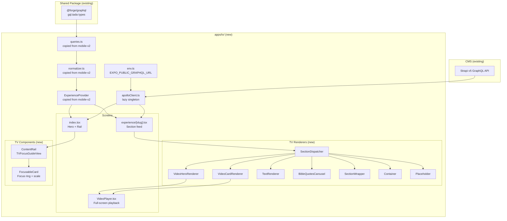

# feat: TV App Prototype — Apple TV & Android TV

## Overview

Add a TV app (`apps/tv/`) to the Forge monorepo that renders the existing CMS-driven Experience pipeline on Apple TV and Android TV. The app reuses the SDUI pipeline logic (normalizer, queries, ExperienceProvider) from `apps/mobile-v2/` and rewrites all renderers for 10-foot UI with D-pad focus navigation.

This is a working prototype, not a production app. It validates that the SDUI architecture works on TV and establishes the foundation for a production decision.

## Problem Frame

Urim's roadmap items are blocked on upstream search and topic infrastructure. This time goes toward the TV app — the third rendering target for the SDUI pipeline. The architecture (Strapi → GraphQL → normalizer → dispatcher → renderers) was designed for multi-surface delivery. A TV app validates this with existing CMS content, adding reach to living rooms. (see origin: `docs/brainstorms/2026-04-10-tv-app-prototype-requirements.md`)

## Requirements Trace

- R1. App builds and runs on Apple TV Simulator and Android TV Emulator
- R2. Home screen renders hero (from `isHomepage` Experience) + Experiences rail from CMS via GraphQL
- R3. D-pad navigation works: move between hero and rail, scroll within rail, select items
- R4. Selecting an Experience opens the detail screen (vertical section feed of blocks)
- R5. Video playback works full-screen with play/pause and ±10s seek via remote
- R6. Focus rings visible and follow D-pad movement consistently
- R7. Loading spinner during fetch; error screen with focusable retry button on failure
- R8. Focus navigation feels responsive (no perceptible lag)
- R9. Video playback quality acceptable on TV display
- R10. Experience detail screen is readable — doesn't feel like a stretched phone app

## Scope Boundaries

- No search, topic browsing, deep linking, analytics, offline, localization, or store submission
- No auto-preview on focus (static thumbnails only)
- Non-core renderers (MediaCollection, Quiz, NavigationCarousel, VideoCarousel, EasterDates) handled by PlaceholderRenderer
- No shared package extraction — copy files for now, extract later if a third consumer appears
- Development/preview EAS build profiles only

### Deferred to Separate Tasks

- Production EAS build profiles and App Store / Play Store submission: separate roadmap item after prototype succeeds
- `packages/sdui/` shared package extraction: follow-up if TV prototype validates and a third consumer appears

## Context & Research

### Relevant Code and Patterns

- `apps/mobile-v2/src/lib/normalizer.ts` — `TYPENAME_TO_KIND` map, `normalizeExperience()`, `NormalizedBlock` type. ~100 LOC, pure logic, fully reusable.
- `apps/mobile-v2/src/lib/queries.ts` — 13 fragments + `GET_WATCH_EXPERIENCE` + `LIST_EXPERIENCES`. gql.tada typed, no UI code. Fully reusable.
- `apps/mobile-v2/src/contexts/ExperienceProvider.tsx` — React context with O(1) `getSectionByKey` lookup, recursive indexing of sectionWrapper/container children. Pure React, fully reusable.
- `apps/mobile-v2/src/components/sections/SectionDispatcher.tsx` — switch on `kind` with `classifySection()` for videoCard classification. Pattern reusable; renderer imports are the replacement surface.
- `apps/mobile-v2/src/lib/apolloClient.ts` — lazy singleton `getApolloClient()` with `HttpLink`, 15s timeout, bearer token.
- `apps/mobile-v2/src/lib/config.ts` — `getGraphQLUrl()` per-platform URL, `getApiToken()`.
- `apps/mobile-v2/src/env.ts` — `@t3-oss/env-core` with module-scope `_inlined` trick for Metro EAS Update inlining.
- `apps/mobile-v2/metro.config.js` — pnpm singleton resolver for `react`/`react-native`, monorepo watchFolders, `.cjs` ext.
- `apps/mobile-v2/src/lib/types.ts`, `parseSectionKey.ts`, `resolveImageUrl.ts`, `validateUrl.ts` — utility modules.

### Institutional Learnings

- **Metro pnpm singleton resolution** (critical): Must configure custom `resolveRequest` in `metro.config.js` from day one. `extraNodeModules` alone is not sufficient. For TV, the singleton map keys `react-native` to the `react-native-tvos` alias path. (`docs/solutions/mobile/metro-pnpm-symlink-react-duplicate-resolution.md`)
- **Structural renderers are mandatory**: Missing `SectionWrapperRenderer`/`ContainerRenderer` causes nested content to silently vanish. (`docs/solutions/best-practices/expo-tv-platform-setup-sdui-monorepo-20260410.md`)
- **EAS Update env var inlining bug**: Module-scope `_inlined` references required. (`docs/solutions/runtime-errors/metro-env-inlining-eas-update-white-screen-20260410.md`)
- **ExperienceProvider siblingContent propagation**: Must preserve recursive indexing of sectionWrapper and container children. (`docs/solutions/mobile/sdui-experience-provider-block-index-parent-child-loss.md`)
- **expo-video stability**: `useVideoPlayer(source)` — source must be stable `useRef`, not state. Use `replaceAsync()` for source swapping. (`docs/solutions/best-practices/playlist-video-player-sdui-mobile-20260409.md`)
- **Fragment spread validation**: Wrong dynamic zone union causes entire query rejection (blank screen). Verify against `apps/cms/schema.graphql`. (`docs/solutions/integration-issues/expo-graphql-schema-drift-and-fragment-validation.md`)
- **Back-navigation focus loss**: react-native-tvos issue #852. Workaround: restore focus via `hasTVPreferredFocus` in `useEffect` on screen focus.
- **Expo SDK 54 health**: Run `npx expo install --check` and `npx expo-doctor` after scaffold. (`docs/solutions/build-errors/expo-doctor-sdk54-health-checks-mobile-v2-20260409.md`)

## Key Technical Decisions

- **Separate app at `apps/tv/`**: TV UX (D-pad, landscape, 10-foot) conflicts fundamentally with touch UX (gestures, portrait, small screen). Do not add TV as a platform target inside mobile-v2.
- **Import queries from mobile-v2, copy the rest**: `queries.ts` (443 LOC of GraphQL fragments) must stay as a single source of truth — CMS schema changes would silently break a copy. Import it from `apps/mobile-v2/src/lib/queries.ts` via pnpm workspace dependency. The remaining pipeline files (normalizer, ExperienceProvider, types, utilities — ~220 LOC combined) are pure logic with no `react-native` dependency and are safe to copy. If Metro cross-app import of queries causes bundler issues, fall back to copying with a `// SYNC: keep in sync with apps/mobile-v2/src/lib/queries.ts` comment.
- **`react-native-tvos` via npm alias**: `"react-native": "npm:react-native-tvos@0.81-stable"` — standard approach, confirmed working with Expo SDK 54.
- **Stack navigation only, no tab bar**: Home → Experience detail → Video fullscreen. Proven TV pattern.
- **Single GraphQL URL env var**: TV platforms don't have the iOS/Android localhost emulator split that mobile-v2 handles. Simplify to `EXPO_PUBLIC_GRAPHQL_URL`.
- **Hardcoded English locale**: All GraphQL queries requiring `$locale` use `"en"`. Localization is out of scope for prototype.
- **`cache-and-network` fetch policy**: Avoid loading flash on subsequent visits, matches mobile-v2 pattern.
- **`@forge/graphql` workspace protocol**: TV app pins `"@forge/graphql": "workspace:*"` to ensure same gql.tada types as mobile-v2.

## Open Questions

### Resolved During Planning

- **Import vs copy SDUI files**: Import `queries.ts` from mobile-v2 (443 LOC of GraphQL fragments that must stay in sync with CMS schema). Copy normalizer, ExperienceProvider, and utilities (~220 LOC of pure logic with no react-native dependency). If Metro cross-app import fails, fall back to copy with sync comment.
- **Separate iOS/Android env vars for GraphQL**: No. TV doesn't have the localhost split. Use a single `EXPO_PUBLIC_GRAPHQL_URL`.
- **Locale handling**: Hardcode `"en"` for all queries requiring `$locale`. Localization is out of scope.
- **Focus memory implementation**: In-memory `Map<string, number>` per session. No persistence needed for prototype.
- **Multiple `isHomepage` experiences**: Use `Array.find()` (first match). CMS should enforce single homepage. Add defensive handling if none found.

### Deferred to Implementation

- **Exact `react-native-tvos@0.81-stable` compatibility**: Day-1 spike validates this before further work. If it fails, stop.
- **expo-video remote control event mapping on TV**: Known to work per PR #29560, but exact API surface TBD during implementation.
- **TVFocusGuideView nesting behavior**: May need experimentation to prevent diagonal focus jumps in nested scroll containers.

## Output Structure

```
apps/tv/
├── app/
│   ├── _layout.tsx                     # Root layout + Apollo + providers
│   ├── index.tsx                       # Home screen (hero + experiences rail)
│   └── experience/[slug].tsx           # Experience detail screen
├── src/
│   ├── env.ts                          # t3-oss env (single GraphQL URL)
│   ├── lib/
│   │   ├── apolloClient.ts             # Lazy singleton Apollo Client
│   │   ├── config.ts                   # GraphQL URL + token + locale helpers
│   │   ├── normalizer.ts               # Copied from mobile-v2
│   │   ├── queries.ts                  # Imported from mobile-v2 via workspace (or copied as fallback)
│   │   ├── types.ts                    # Copied from mobile-v2
│   │   ├── resolveImageUrl.ts          # Copied from mobile-v2
│   │   └── validateUrl.ts              # Copied from mobile-v2
│   ├── contexts/
│   │   └── ExperienceProvider.tsx       # Copied from mobile-v2
│   └── components/
│       ├── sections/
│       │   ├── SectionDispatcher.tsx    # TV version (subset of kinds)
│       │   ├── VideoHeroRenderer.tsx    # TV-adapted hero
│       │   ├── VideoCardRenderer.tsx    # Landscape video card for rails
│       │   ├── TextRenderer.tsx         # Large readable text
│       │   ├── BibleQuotesCarouselRenderer.tsx  # Horizontal D-pad carousel
│       │   ├── SectionWrapperRenderer.tsx  # Structural wrapper
│       │   ├── ContainerRenderer.tsx       # Structural wrapper
│       │   └── PlaceholderRenderer.tsx     # Fallback for unhandled types
│       ├── ContentRail.tsx             # Horizontal FlatList with TVFocusGuideView
│       ├── FocusableCard.tsx           # Base focusable element with focus ring
│       └── VideoPlayer.tsx             # Full-screen TV video player
├── assets/                             # Icon, splash (TV-sized)
├── app.json                            # Expo config with config-tv plugin
├── babel.config.js                     # babel-preset-expo
├── metro.config.js                     # Singleton resolver (react-native-tvos)
├── tsconfig.json
├── package.json                        # @forge/tv
├── .env.local                          # Dev env vars (gitignored)
└── CLAUDE.md                           # TV app conventions
```

## High-Level Technical Design

> _This illustrates the intended approach and is directional guidance for review, not implementation specification. The implementing agent should treat it as context, not code to reproduce._



**Data flow for home screen:**

1. `LIST_EXPERIENCES` → experience metadata (ogImage, title, slug, isHomepage)
2. `GET_WATCH_EXPERIENCE` with `isHomepage` slug → full block data for hero
3. Normalize hero blocks → render `VideoHeroRenderer` at top
4. Map experiences list → `ContentRail` of `FocusableCard` items

**Data flow for experience detail:**

1. `GET_WATCH_EXPERIENCE` with selected slug → full block data
2. `normalizeExperience()` → `ExperienceProvider` context
3. Vertical FlatList → `SectionDispatcher` per block → TV renderers

**Navigation:**

- Home (index.tsx) → push `experience/[slug]` on card select
- Experience detail → push full-screen VideoPlayer on video select
- Menu/Back button → pop stack at each level

## Implementation Units

- [ ] **Unit 1: Expo TV Scaffolding**

  **Goal:** Create `apps/tv/` with working Expo TV build for Apple TV Simulator — the go/no-go gate.

  **Requirements:** R1

  **Dependencies:** None

  **Files:**
  - Create: `apps/tv/package.json`
  - Create: `apps/tv/app.json`
  - Create: `apps/tv/babel.config.js`
  - Create: `apps/tv/metro.config.js`
  - Create: `apps/tv/tsconfig.json`
  - Create: `apps/tv/app/_layout.tsx`
  - Create: `apps/tv/app/index.tsx` (minimal "Hello TV" screen)
  - Create: `apps/tv/CLAUDE.md`

  **Approach:**
  - `package.json`: name `@forge/tv`, `"react-native": "npm:react-native-tvos@0.81-stable"`, match Expo SDK 54 deps from mobile-v2 using `npx expo install --check`
  - `app.json`: `@react-native-tvos/config-tv` plugin with `{ "isTV": true }`, landscape orientation, dark background
  - `metro.config.js`: Copy singleton resolver pattern from `apps/mobile-v2/metro.config.js`. Singleton map must include both `react` and `react-native` (the latter resolving to `react-native-tvos` alias). Missing `react` singleton causes "Invalid hook call" from duplicate React copies.
  - `babel.config.js`: `babel-preset-expo` (required for Expo Router)
  - Run `pnpm install` then `EXPO_TV=1 npx expo prebuild --clean` then build for Apple TV Simulator
  - Minimal `index.tsx` with a `Text` + `Pressable` element to verify D-pad focus works

  **Patterns to follow:**
  - `apps/mobile-v2/metro.config.js` — singleton resolver
  - `apps/mobile-v2/package.json` — dependency versions
  - `docs/solutions/platform/adding-new-apps.md` — scaffold checklist

  **Test scenarios:**
  - Test expectation: none — pure scaffolding. Validation is build + Simulator launch.

  **Verification:**
  - `EXPO_TV=1 npx expo prebuild --clean` succeeds
  - App launches on Apple TV Simulator
  - App launches on Android TV Emulator (both platforms required for go/no-go)
  - D-pad focuses the Pressable element with visible highlight
  - `npx expo-doctor` passes
  - `pnpm typecheck --filter=@forge/tv` passes

- [ ] **Unit 2: Environment, Apollo Client, and SDUI Pipeline**

  **Goal:** Wire up env vars, Apollo Client, and copy the SDUI pipeline files so the TV app can fetch and normalize Experience data from the CMS.

  **Requirements:** R2 (data layer)

  **Dependencies:** Unit 1

  **Files:**
  - Create: `apps/tv/src/env.ts`
  - Create: `apps/tv/src/lib/config.ts`
  - Create: `apps/tv/src/lib/apolloClient.ts`
  - Copy: `apps/tv/src/lib/normalizer.ts` (from `apps/mobile-v2/src/lib/normalizer.ts`)
  - Import or copy: `apps/tv/src/lib/queries.ts` (prefer re-export from `apps/mobile-v2/src/lib/queries.ts` via workspace dep; copy as fallback)
  - Copy: `apps/tv/src/lib/types.ts` (from `apps/mobile-v2/src/lib/types.ts`)
  - Copy: `apps/tv/src/lib/resolveImageUrl.ts` (from `apps/mobile-v2/src/lib/resolveImageUrl.ts`)
  - Copy: `apps/tv/src/lib/validateUrl.ts` (from `apps/mobile-v2/src/lib/validateUrl.ts`)
  - Copy: `apps/tv/src/contexts/ExperienceProvider.tsx` (from `apps/mobile-v2/src/contexts/ExperienceProvider.tsx`)
  - Modify: `apps/tv/app/_layout.tsx` (add ApolloProvider)
  - Create: `apps/tv/.env.local`

  **Approach:**
  - `env.ts`: Simplify to single `EXPO_PUBLIC_GRAPHQL_URL` (no iOS/Android split). Keep module-scope `_inlined` pattern for EAS Update safety.
  - `config.ts`: `getGraphQLUrl()` returns the single URL. `getApiToken()` same pattern. Add `getLocale()` returning `"en"` (hardcoded for prototype).
  - `apolloClient.ts`: Copy lazy singleton pattern. Use `cache-and-network` default fetch policy.
  - `package.json`: Add `"@forge/graphql": "workspace:*"` and `"@forge/mobile-v2": "workspace:*"` (for queries import). If mobile-v2 workspace import causes Metro issues, fall back to copying queries.ts with sync comment.
  - Copied files: verify import paths resolve correctly after copy. Adjust any mobile-v2-specific imports to local paths.
  - Root `_layout.tsx`: wrap children in `ApolloProvider` using `getApolloClient()`.

  **Patterns to follow:**
  - `apps/mobile-v2/src/env.ts` — env validation with inlining trick
  - `apps/mobile-v2/src/lib/apolloClient.ts` — lazy singleton
  - `docs/solutions/runtime-errors/metro-env-inlining-eas-update-white-screen-20260410.md`

  **Test scenarios:**
  - Happy path: Apollo Client fetches `LIST_EXPERIENCES` and returns experience data
  - Error path: Network failure shows error state (verify via Apollo `error` field)
  - Edge case: Missing `EXPO_PUBLIC_STRAPI_TOKEN` — app still starts (token is optional)

  **Verification:**
  - `console.log` in root layout confirms Apollo Client instantiated and GraphQL query returns data
  - TypeScript compiles with no errors (`pnpm typecheck --filter=@forge/tv`)

- [ ] **Unit 3: FocusableCard and ContentRail Components**

  **Goal:** Build the two foundational TV UI components: a card that responds to D-pad focus with visual feedback, and a horizontal rail that constrains focus navigation.

  **Requirements:** R3, R6, R8

  **Dependencies:** Unit 1

  **Files:**
  - Create: `apps/tv/src/components/FocusableCard.tsx`
  - Create: `apps/tv/src/components/ContentRail.tsx`

  **Approach:**
  - **FocusableCard**: Pressable with `onFocus`/`onBlur` state. Focused state: 1.05x scale + high-contrast border glow. Accept `hasTVPreferredFocus` prop for initial focus control. `onPress` callback for selection.
  - **ContentRail**: Horizontal FlatList wrapped in `TVFocusGuideView` to constrain D-pad left/right within the rail. Title label above. Accept `data`, `renderItem`, `title` props. Per-session focus memory via in-memory Map (rail ID → item index) to restore position on back-navigation.

  **Patterns to follow:**
  - `docs/solutions/best-practices/expo-tv-platform-setup-sdui-monorepo-20260410.md` — TVFocusGuideView + focus ring patterns

  **Test scenarios:**
  - Happy path: FocusableCard shows focus ring when focused, hides when blurred
  - Happy path: FocusableCard scales to 1.05x on focus
  - Happy path: ContentRail constrains D-pad left/right within rail items
  - Edge case: Single-item rail — focus stays on the single card, no crash
  - Edge case: Empty rail — renders nothing or title only, no crash
  - Integration: Back-navigation restores last focused item index in rail

  **Verification:**
  - On Apple TV Simulator: D-pad moves focus between cards in a rail with visible focus ring
  - D-pad up/down exits the rail (not trapped)
  - Focus memory works after navigating away and back

- [ ] **Unit 4: Home Screen**

  **Goal:** Render the TV home screen with a hero area (from `isHomepage` Experience) and an Experiences content rail below.

  **Requirements:** R2, R3, R7

  **Dependencies:** Units 2, 3

  **Files:**
  - Modify: `apps/tv/app/index.tsx`
  - Create: `apps/tv/src/components/HomeHero.tsx` (simplified inline hero for home screen — not the full renderer)

  **Approach:**
  - Fetch `LIST_EXPERIENCES` with `variables: { locale: "en" }` for rail data and `GET_WATCH_EXPERIENCE` for homepage hero
  - Find `isHomepage` Experience from list (first match via `Array.find()`), use its slug for the full experience query. If none found, skip hero.
  - Hero: Full-width at top via `HomeHero` component (not the full `VideoHeroRenderer` — that is built in Unit 6 for the experience detail context). Shows `videoStill` or `ogImage` via expo-image, title + subtitle overlay. Static thumbnail only (no auto-preview).
  - Rail below: `ContentRail` of `FocusableCard` items, each showing `ogImage` + title. `onPress` navigates to `experience/[slug]`.
  - D-pad up → hero, down → rail
  - Loading: centered spinner. Error: message + focusable retry button.

  **Patterns to follow:**
  - `apps/mobile-v2/src/contexts/ExperienceShell.tsx` — `LIST_EXPERIENCES` usage pattern
  - `docs/solutions/mobile/experience-selection-provider-library-tab-pattern-2026-04-08.md` — `isHomepage` resolution

  **Test scenarios:**
  - Happy path: Home screen shows hero with title/image + Experiences rail with cards
  - Happy path: Selecting a rail card navigates to `experience/[slug]`
  - Happy path: D-pad moves focus between hero and rail
  - Error path: GraphQL fetch failure shows error screen with focusable retry button
  - Edge case: CMS returns zero Experiences — shows empty state message
  - Edge case: No `isHomepage` Experience — hero area hidden, rail still renders
  - Edge case: `isHomepage` slug resolves from LIST but GET_WATCH_EXPERIENCE returns null — falls back to rail-only view
  - Edge case: Experience in rail has null `ogImage` — card renders with placeholder or title only

  **Verification:**
  - Home screen renders on Apple TV Simulator with real CMS data
  - D-pad navigates between hero and rail cards
  - Selecting a card pushes to experience detail route

- [ ] **Unit 5: Structural Renderers and SectionDispatcher**

  **Goal:** Implement the structural renderers (SectionWrapper, Container, Placeholder) and the TV SectionDispatcher so the experience detail screen can render block trees correctly.

  **Requirements:** R4

  **Dependencies:** Unit 2

  **Files:**
  - Create: `apps/tv/src/components/sections/SectionDispatcher.tsx`
  - Create: `apps/tv/src/components/sections/SectionWrapperRenderer.tsx`
  - Create: `apps/tv/src/components/sections/ContainerRenderer.tsx`
  - Create: `apps/tv/src/components/sections/PlaceholderRenderer.tsx`

  **Approach:**
  - **SectionDispatcher**: Switch on `kind`. Subset of mobile-v2 kinds: `videoHero`, `sectionWrapper`, `video`, `text`, `bibleQuotesCarousel`, `container`. All others → PlaceholderRenderer. Initially, unimplemented renderer cases (videoHero, video, text, bibleQuotesCarousel) also fall through to PlaceholderRenderer — Unit 6 replaces these with real renderers.
  - **SectionWrapperRenderer**: Renders children from `sectionContent` array via SectionDispatcher recursion. Passes layout props (padding, background).
  - **ContainerRenderer**: Renders slot children via SectionDispatcher recursion. TV-adapted spacing.
  - **PlaceholderRenderer**: `__DEV__` console.warn with block kind, returns null in production.

  **Patterns to follow:**
  - `apps/mobile-v2/src/components/sections/SectionDispatcher.tsx` — dispatch pattern
  - `apps/mobile-v2/src/components/sections/SectionWrapperRenderer.tsx` — recursive child rendering
  - `docs/solutions/best-practices/expo-tv-platform-setup-sdui-monorepo-20260410.md` — structural renderers are mandatory

  **Test scenarios:**
  - Happy path: SectionDispatcher routes `sectionWrapper` kind to SectionWrapperRenderer
  - Happy path: SectionWrapperRenderer recursively renders nested children
  - Happy path: ContainerRenderer renders slot children
  - Happy path: Unknown kind renders PlaceholderRenderer (logs in dev, returns null)
  - Integration: Nested structure (sectionWrapper → container → text) renders full depth

  **Verification:**
  - A real Experience with nested blocks renders correctly — no silently missing sections
  - Dev console shows warnings for unhandled block types

- [ ] **Unit 6: Content Renderers**

  **Goal:** Implement the TV-adapted visual renderers for core block types: VideoHero (experience detail version), VideoCard, Text, and BibleQuotesCarousel.

  **Requirements:** R4, R6, R10

  **Dependencies:** Units 3, 5

  **Files:**
  - Create: `apps/tv/src/components/sections/VideoHeroRenderer.tsx`
  - Create: `apps/tv/src/components/sections/VideoCardRenderer.tsx`
  - Create: `apps/tv/src/components/sections/TextRenderer.tsx`
  - Create: `apps/tv/src/components/sections/BibleQuotesCarouselRenderer.tsx`

  **Approach:**
  - **VideoHeroRenderer**: Full-width hero for the experience detail section feed. Shows `videoStill` via expo-image, title + subtitle overlay. Focusable — select enters video playback. (Home screen uses a separate `HomeHero` component from Unit 4, not this renderer.)
  - **VideoCardRenderer**: Landscape card showing `videoStill` thumbnail + title. Focusable. Select enters video playback. Used in experience detail section feed.
  - **TextRenderer**: Large readable text for 10-foot UI. `contentParagraphs` validated with `Array.isArray()`. System font, high contrast, generous line spacing.
  - **BibleQuotesCarouselRenderer**: Horizontal D-pad-navigable carousel of quote cards. Each card shows reference + text. Wrap in `TVFocusGuideView` to contain horizontal focus.
  - All renderers: expo-image with `recyclingKey`, `hexToRgba()` for gradient stops (never `"transparent"`), composite React keys.

  **Patterns to follow:**
  - `apps/mobile-v2/src/components/sections/VideoHeroRenderer.tsx` — data shape and field access
  - `apps/mobile-v2/src/components/sections/TextRenderer.tsx` — paragraph parsing
  - `apps/mobile-v2/src/components/sections/BibleQuotesCarouselRenderer.tsx` — carousel data shape

  **Test scenarios:**
  - Happy path: VideoHeroRenderer shows image, title, subtitle from Experience data
  - Happy path: VideoCardRenderer shows thumbnail and title, is focusable
  - Happy path: TextRenderer renders paragraphs with readable font size
  - Happy path: BibleQuotesCarousel shows quote cards navigable with D-pad left/right
  - Edge case: `contentParagraphs` is not an array — renders gracefully (no crash)
  - Edge case: Missing `videoStill` image — falls back to `ogImage` or placeholder
  - Edge case: Long title text — truncates with ellipsis, doesn't overflow

  **Verification:**
  - Real Experience blocks render on TV Simulator with correct data
  - All interactive renderers show focus rings on D-pad focus
  - Text is readable at 10-foot viewing distance (large font, high contrast)

- [ ] **Unit 7: Experience Detail Screen**

  **Goal:** Wire up the experience detail route to fetch, normalize, and render a full Experience as a vertical section feed using the TV renderers.

  **Requirements:** R4, R7, R10

  **Dependencies:** Units 2, 5, 6

  **Files:**
  - Create: `apps/tv/app/experience/[slug].tsx`

  **Approach:**
  - Route receives `slug` param via Expo Router `useLocalSearchParams()`
  - Decode with `decodeURIComponent()` (slugs may contain `/`)
  - Fetch `GET_WATCH_EXPERIENCE` with `variables: { slug, locale: "en" }`, normalize with `normalizeExperience()`
  - Wrap content in `ExperienceProvider`
  - Render vertical FlatList of sections via `SectionDispatcher`
  - Loading: centered spinner. Error: message + focusable retry button.
  - Back button (menu) pops to home screen. Focus should restore on the card that was selected (via ContentRail focus memory from Unit 3).

  **Patterns to follow:**
  - `apps/mobile-v2/app/(tabs)/index.tsx` — experience fetching pattern
  - `docs/solutions/mobile/expo-router-slash-in-dynamic-route-params.md` — `encodeURIComponent` for slug params

  **Test scenarios:**
  - Happy path: Navigating to `experience/[slug]` renders that Experience's blocks in a vertical feed
  - Happy path: D-pad navigates between focusable sections in the feed
  - Happy path: Back button returns to home screen
  - Error path: Invalid slug — shows error screen with retry
  - Edge case: Experience with only unhandled block types — shows PlaceholderRenderer warnings, screen not blank (at minimum shows loading → empty state)

  **Verification:**
  - Select a card on home → experience detail renders with real blocks
  - Back button returns to home, focus restores on the previously selected card
  - Multiple experiences navigate correctly

- [ ] **Unit 8: Video Playback**

  **Goal:** Implement full-screen video playback with TV remote controls (play/pause, seek, back).

  **Requirements:** R5, R9

  **Dependencies:** Units 6, 7

  **Files:**
  - Create: `apps/tv/src/components/VideoPlayer.tsx`
  - Modify: `apps/tv/src/components/sections/VideoHeroRenderer.tsx` (wire up video launch)
  - Modify: `apps/tv/src/components/sections/VideoCardRenderer.tsx` (wire up video launch)

  **Approach:**
  - **VideoPlayer**: Full-screen expo-video player as a modal/overlay component (not a separate route — avoids URL-encoding long HLS URLs in route params). Receives `streamingUrl` via React context or callback prop.
  - Remote controls: play/pause (center/select button), seek ±10s (left/right on remote), back to experience (menu button).
  - Use stable `useRef` for video source (not state) per institutional learning.
  - Pause on screen blur via navigation listener.
  - End of video: dismiss overlay, focus returns to the video block that was playing.

  **Patterns to follow:**
  - `apps/mobile-v2/src/components/sections/VideoHeroRenderer.tsx` — video launch pattern
  - `docs/solutions/best-practices/playlist-video-player-sdui-mobile-20260409.md` — `useVideoPlayer` stability patterns

  **Test scenarios:**
  - Happy path: Selecting a video block enters full-screen playback of HLS stream
  - Happy path: Center button toggles play/pause
  - Happy path: Left/right seeks ±10s
  - Happy path: Menu button exits playback, returns to experience screen
  - Happy path: Video end returns to experience screen
  - Edge case: Invalid or unavailable stream URL — shows error, back button still works
  - Edge case: Rapid play/pause — no crash or inconsistent state

  **Verification:**
  - HLS video plays full-screen on Apple TV Simulator
  - Remote controls work as specified
  - Navigation back from video restores experience screen with correct focus

## System-Wide Impact

- **Interaction graph:** The TV app is a new, independent consumer of the Strapi GraphQL API. It does not affect existing mobile-v2 or web apps. The only shared surface is the `@forge/graphql` package (read-only dependency) and the CMS content.
- **Error propagation:** GraphQL errors surface via Apollo Client's `error` field → each screen shows error state with retry. No cross-app error propagation.
- **State lifecycle risks:** Apollo `InMemoryCache` is per-session only (no persistence). No risk of stale cache across app restarts.
- **API surface parity:** The TV app uses existing GraphQL queries (`GET_WATCH_EXPERIENCE`, `LIST_EXPERIENCES`). No new API surface created.
- **Integration coverage:** End-to-end flow (CMS → GraphQL → normalize → dispatch → render) on TV should be validated with real CMS data, not mocks.
- **Unchanged invariants:** `apps/mobile-v2/`, `apps/web/`, `packages/graphql/`, and `apps/cms/` are not modified by this plan.

## Risks & Dependencies

| Risk                                                          | Mitigation                                                                                                                                          |
| ------------------------------------------------------------- | --------------------------------------------------------------------------------------------------------------------------------------------------- |
| Expo SDK 54 + react-native-tvos incompatibility               | Unit 1 is a go/no-go gate. If it fails, stop.                                                                                                       |
| expo-video doesn't work on tvOS                               | Validated by expo/expo PR #29560, but confirmed by Unit 1 spike.                                                                                    |
| Focus management complexity with nested scrollable containers | Start simple (one rail, one hero). TVFocusGuideView constrains focus. Known back-nav bug has documented workaround.                                 |
| Metro bundler issues with react-native-tvos alias             | Singleton resolver pattern from mobile-v2 addresses this. Adjust `react-native` path in singleton map.                                              |
| Sparse CMS content makes home screen look empty               | Prototype quality depends on content. Not a blocker but affects qualitative assessment.                                                             |
| Copied SDUI files drift from mobile-v2                        | Low risk — files only change with CMS schema changes, which force both apps to update. Monitor and extract to shared package if drift becomes real. |

## Sources & References

- **Origin document:** [docs/brainstorms/2026-04-10-tv-app-prototype-requirements.md](docs/brainstorms/2026-04-10-tv-app-prototype-requirements.md)
- Best practices: [docs/solutions/best-practices/expo-tv-platform-setup-sdui-monorepo-20260410.md](docs/solutions/best-practices/expo-tv-platform-setup-sdui-monorepo-20260410.md)
- Metro resolution: [docs/solutions/mobile/metro-pnpm-symlink-react-duplicate-resolution.md](docs/solutions/mobile/metro-pnpm-symlink-react-duplicate-resolution.md)
- SDUI scaffold: [docs/solutions/mobile/mobile-v2-sdui-app-scaffold-and-review-findings.md](docs/solutions/mobile/mobile-v2-sdui-app-scaffold-and-review-findings.md)
- Env inlining: [docs/solutions/runtime-errors/metro-env-inlining-eas-update-white-screen-20260410.md](docs/solutions/runtime-errors/metro-env-inlining-eas-update-white-screen-20260410.md)
- Video patterns: [docs/solutions/best-practices/playlist-video-player-sdui-mobile-20260409.md](docs/solutions/best-practices/playlist-video-player-sdui-mobile-20260409.md)
- ExperienceProvider: [docs/solutions/mobile/sdui-experience-provider-block-index-parent-child-loss.md](docs/solutions/mobile/sdui-experience-provider-block-index-parent-child-loss.md)
- Adding apps: [docs/solutions/platform/adding-new-apps.md](docs/solutions/platform/adding-new-apps.md)
- Roadmap: feat-072 through feat-076 in `docs/roadmap/topic-experiences/`
