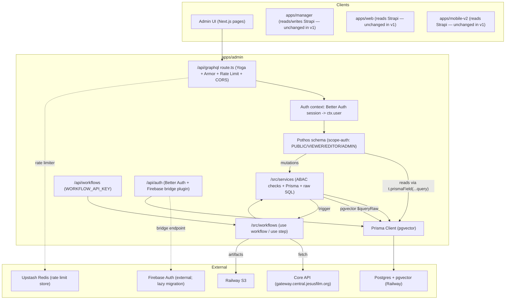

# Admin App — Next.js + GraphQL + Prisma + pgvector

## Overview

Build a new Next.js App Router app at `apps/admin/` that will eventually replace Strapi as the primary CMS and absorb `apps/manager/`. V1 establishes the architecture — Yoga + Pothos + Prisma + pgvector + useworkflow + Better Auth — and proves it with real content types (Experiences, Videos) while Strapi continues to serve existing consumers. This plan sequences the work into 13 implementation units across 5 phases so that each architectural bet is verified before being built on.

The strategic aim is not to mirror Strapi in a new tech stack — it is to design an AI-friendly data model, permission system, and documentation layer such that AI agents can extend the app confidently and the team can migrate consumer apps to it in a follow-up.

## Problem Frame

Strapi v5 has hit its ceiling for the team: no DataLoader (two production incidents where 4 parallel queries fanned out to 20K DB queries and saturated the pool — see `docs/solutions/performance-issues/strapi-language-cache-raw-sql-bypass-cms-manager-20260403.md`), limited raw SQL access, dynamic zone relation bugs, and plugin-shaped data structures that are awkward for AI workflows. The Core API's domain model reflects years of mature work and stays canonical; what's being rebuilt is the presentation/management layer with AI-readiness as a first-class input (see origin).

V1 is a parallel system. `apps/web`, `apps/mobile-v2`, and `apps/manager` stay on Strapi. Only `apps/admin/` UI consumes the new API in v1. Consumer migration and Strapi decommission are follow-up projects.

## Requirements Trace

See origin for the full set. High-leverage items this plan must satisfy:

- R1-R5. Single Next.js App Router app on Railway with strict UI/service/Prisma separation
- R6-R9. Pothos Prisma plugin for reads (with `...query` passthrough), services for writes, raw SQL only in services, query-level permission filtering
- R11-R15a. Better Auth + Firebase lazy migration, RBAC+ABAC with 4 tiers (ADMIN/EDITOR/VIEWER/PUBLIC), permissions enforced in services
- R16-R20. Default-deny transport layer, Armor plugins, rate limiting, CORS, workflow endpoint auth, embedding vector exclusion as technical control
- R21-R23a. useworkflow for background jobs, plugin wired up (not inherited from manager)
- R24-R29. Experiences with i18n + polymorphic blocks + embeddings; Videos with Core fields + variants; draft/publish for Experiences; media storage
- R30. Agent-first documentation deliverable
- R31-R35. Core sync transforms Core data into the new model; all 5 reference phases; Zod validation; Strapi stays running in parallel

## Scope Boundaries

- V1 serves admin UI only. `apps/web` and `apps/mobile-v2` stay on Strapi via `@forge/graphql`.
- `packages/graphql` reconfiguration for the new API is out of scope (follow-up).
- No Strapi data migration. New greenfield data model.
- `apps/manager/` keeps reading and writing Strapi for enrichment.
- Video vector search is out of scope (embeddings stay in manager).
- Strapi decommission is out of scope.

## Context & Research

### Relevant Code and Patterns (follow these)

- `apps/manager/src/config/env.ts` — canonical env validation pattern (`@t3-oss/env-nextjs` + zod, explicit `runtimeEnv`, `skipValidation: !!process.env.CI`). Mirror for `apps/admin/src/config/env.ts`.
- `apps/manager/src/services/storage.ts` — Railway S3 adapter with local fallback, lazy `_s3` singleton, `SAFE_KEY_PATTERN` validation, structured JSON logging. Reuse pattern for `apps/admin/src/storage/`.
- `apps/manager/src/lib/auth.ts` + `require-auth.ts` + `middleware.ts` — dual-path auth (session cookie + API key with `timingSafeEqual`). Pattern survives: Better Auth session for UI + `WORKFLOW_API_KEY` for workflow callbacks.
- `apps/manager/vitest.config.ts` + `vitest.setup.ts` — colocated `*.test.ts`, node env, test env placeholders.
- `apps/manager/railway.toml` + `nixpacks.toml` — standalone-output copy trick, `HOSTNAME=0.0.0.0`, `healthcheckPath = "/api/health"`. See `docs/solutions/deployment/nextjs-pnpm-monorepo-railway-standalone.md`.
- `apps/cms/src/api/core-sync/services/core-sync.ts` — `PHASE_ORDER`, `syncInProgress` guard, `ANALYZE` pass. Port pattern-wise, not code-wise.
- `apps/cms/src/api/core-sync/services/sync-videos.ts` — `limit`/`offset` with prefetch-next-page pipelining (`pendingFetch = fetchPage(offset + pageSize)`).
- `apps/cms/src/api/core-sync/services/bulk-upsert.ts` — `bulkUpsertByCoreId` signature and batch sizing (500). In Prisma this becomes a transaction with `upsert` batches keyed on `coreId`.
- `apps/cms/src/api/core-sync/services/strapi-helpers.ts` — `sync_state` watermark table (`phase` PK, `last_synced_at`), advance-only-on-zero-errors rule, `softDeleteUnseen` pattern.
- `apps/cms/src/api/scene-embedding/services/indexer.ts` — `toPgArray()` helper for PG18 array literal format (`{val1,val2}` with `?::text[]` cast).
- `apps/manager/src/workflows/videoEnrichment.ts` — `"use workflow"`/`"use step"` directives reference; note manager's plugin is NOT wired, admin wires it up first.
- `eslint.config.mjs` (root) — add `files: ["apps/admin/**/*.{ts,tsx}"]` block matching the manager block.

### Institutional Learnings

- `docs/solutions/platform/adding-new-apps.md` — new-app checklist (env validation, `railway.toml`, port allocation, Doppler project).
- `docs/solutions/platform/new-app-ci-and-deployment-patterns.md` — lazy SDK init, structured logging, env-at-startup validation.
- `docs/solutions/deployment/nextjs-pnpm-monorepo-railway-standalone.md` — `HOSTNAME=0.0.0.0` + standalone path flattening, `[deploy.env]` silently dropped.
- `docs/solutions/platform/optional-railway-s3-local-fallback.md` — optional-S3 toggle pattern.
- `docs/solutions/platform/backfill-worker-pattern-manager-20260407.md` — **claim lock synchronously before `after()`**; use output table as progress tracker. Directly applies to Core sync.
- `docs/solutions/best-practices/pgvector-embedding-indexing-strapi-v5.md` — HNSW index setup, batch inserts, PG18 `?::text[]` caveat.
- `docs/solutions/best-practices/pgvector-recommendation-query-locale-graphql-strapi-v5.md` — cosine similarity with locale + parent-child exclusion + DISTINCT ON. Template for admin vector resolvers.
- `docs/solutions/cms/core-sync-bulk-update-temp-table-pattern.md` — temp-table `UPDATE FROM` vs per-row update (orders of magnitude faster).
- `docs/solutions/cms/core-sync-incremental-delta-sync.md` — watermark table design, advance-only-on-zero-errors, full-sync-only soft delete.
- `docs/solutions/cms/core-sync-per-page-upsert-pattern.md` — per-page upsert for progress + resumability.
- `docs/solutions/web/nextjs-headers-defeats-route-cache.md` — calling `headers()`/`cookies()` in a page route forces dynamic rendering. Relevant for dashboard caching.
- `docs/solutions/performance-issues/strapi-nested-relation-truncation-and-n-plus-one-manager-20260328.md` — DataLoader is mandatory; Pothos `...query` passthrough replaces it.
- Root `CLAUDE.md` — PG18 `?::jsonb::text[]` quirk; Strapi snake-case is Strapi-specific (admin controls its own columns).

### External References

- **GraphQL Yoga in Next.js App Router:** `createYoga<NextContext>({ fetchAPI: { Response }, ... })` exporting `GET`, `POST`, `OPTIONS` — `fetchAPI: { Response }` is **critical** or streaming breaks. https://the-guild.dev/graphql/yoga-server/docs/integrations/integration-with-nextjs
- **Pothos Prisma plugin:** `builder.prismaObject`, `t.prismaField({ resolve: (query, ...) => prisma.x.findUnique({ ...query, where }) })`, `t.relation`. https://pothos-graphql.dev/docs/plugins/prisma
- **Pothos scope-auth:** `AuthScopes` generic, boolean combinators (`$all`/`$any`/`$not`), type- vs field-level scopes, parametric scopes for `hasPermission('read:experiences')`. https://pothos-graphql.dev/docs/plugins/scope-auth
- **Prisma pgvector:** `Unsupported("vector(N))"` syntax is authoritative (no `@db.Vector` in Prisma core — issue #26546). Prisma 7.1.0 has pgvector migration regressions (#28867) — **pin to Prisma 6.x**. `$queryRaw` tagged templates are SQL-injection-safe. https://github.com/pgvector/pgvector-node/blob/master/prisma/schema.prisma
- **pgvector indexes:** HNSW preferred (better recall/latency, incremental-insert friendly). IVFFlat needs representative data at build time. Cosine operator is `<=>`. https://github.com/pgvector/pgvector
- **Better Auth:** session-first (DB-backed cookies). Prisma adapter: `prismaAdapter(prisma, { provider: "postgresql" })`. Expo integration via `@better-auth/expo` + `expo-secure-store`. Firebase bridge via custom plugin using `createAuthEndpoint` from `better-auth/api`. https://better-auth.com/docs/concepts/plugins
- **useworkflow:** `withWorkflow(nextConfig, { workflows: { dirs: ['app/api','workflows'] } })` — **constrain `dirs` to avoid OOM**. Local World requires no API key; production world-specific. `WORKFLOW_API_KEY` is NOT a universal env — verify per target world. https://useworkflow.dev/docs/getting-started/next
- **GraphQL Armor:** `maxDepthPlugin`, `maxAliasesPlugin`, `maxTokensPlugin`, `costLimitPlugin`. **No built-in rate limiter** — use `@envelop/rate-limiter` (Redis-backed for multi-instance) or Arcjet. https://escape.tech/graphql-armor/docs/plugins/cost-limit/

## Key Technical Decisions

- **Prisma 6.x pinned:** 7.1.0 has open migration regressions with pgvector (Prisma issue #28867). Reassess when resolved.
- **`Unsupported("vector(N)")` for embedding columns:** `@db.Vector` is not in Prisma core. Prisma Studio cannot render these — acceptable tradeoff.
- **HNSW index on embeddings:** better recall/latency vs IVFFlat; no build-time data requirement; incremental-insert friendly. Created in a migration with raw `CREATE INDEX ... USING hnsw (embedding vector_cosine_ops);`.
- **Better Auth session strategy:** DB-backed sessions (not JWT). Session cookie for admin UI; bearer JWT only issued when/if external services need it via the `jwt()` plugin.
- **Firebase lazy migration via custom plugin:** Use `createAuthEndpoint` to accept a Firebase ID token, verify with Firebase Admin SDK (`checkRevoked: true`), `findOrCreate` the Better Auth user by verified email, and return a BA session. Avoids reliance on third-party community plugins. See Unit 5 design sketch.
- **Permission enforcement at two layers with explicit type classification:** Pothos scope-auth declares coarse type- and field-level scopes (ADMIN/EDITOR/VIEWER/PUBLIC, `hasPermission('read:experiences')`). Services enforce fine-grained ABAC (ownership, state) via `/src/auth/permissions.ts` helpers called at the top of every service method. **Every Pothos type is classified as either `public-shape` (safe for `t.relation` direct resolution) or `abac-gated` (must route through a service resolver even when nested)** — this closes an auth-bypass hole where `{ experience { videos } }` reached via a relation could return a different row set than `Query.videos`. Classification is a required JSDoc tag on every Pothos type definition. A parity test asserts that every `abac-gated` type returns the same row set via `Query.t(id)` and every `X.t` / `X.ts` relation path for the same principal.
- **Search hydration pattern:** pgvector `$queryRaw` returns `{ id, distance }` rows; then `prisma.experience.findMany({ where: { id: { in: ids }, ...permissionWhere }, ...query })` hydrates with Pothos selection. Permission WHERE is re-applied at hydration (defense-in-depth against raw SQL bypassing ABAC). Document as a named pattern in CLAUDE.md.
- **Per-request DataLoader context:** Every `createContext` call instantiates fresh DataLoader instances keyed by Prisma model. Services that fetch by id-in batch go through DataLoaders, not direct Prisma calls, so that service-bypassed nested fields still batch. Pothos `...query` passthrough remains the preferred path; DataLoader is the escape hatch for service-owned nested fetches.
- **Workflow principal model:** Workflows run as a synthetic **`SYSTEM` principal** with a dedicated capability set, NOT as the triggering user. Services check `user.role === 'SYSTEM'` as an explicit branch for workflow-initiated calls. The principal at trigger-time is snapshotted into the workflow input for audit, but it does not grant authority. This closes an authority-escalation hole where a triggering user's permissions would persist inside retrying workflows.
- **Core is authoritative for Core-sourced entities:** Admin v1 Core-sourced columns (Video, Language, Country, Keyword, variants) are **read-only** at the GraphQL layer. Mutations targeting these fields throw. Schema-level constraint: `source='core'` rows reject updates to Core-sourced columns; only `source='manager'` rows accept writes. Core sync upsert must **short-circuit on `existing.source === 'manager'`** (matches CMS `upsertByCoreId` behavior). This eliminates the "silent drift between Strapi and admin" problem by construction.
- **Core watermark contract on every Core-derived row:** Every model with `source='core'` stores `coreUpdatedAt` (Core's authoritative timestamp) and `syncedAt` (admin's sync timestamp). A `systemStatus` query exposes per-entity lag so operators see drift early. Matches `docs/solutions/cms/core-sync-incremental-delta-sync.md` semantics but is now required schema.
- **Audience tagging from v1 (shared with permission system):** Every Pothos field declares an audience (`tiers: [ADMIN | EDITOR | VIEWER | PUBLIC]`) — the same mechanism scope-auth uses. V1 only wires ADMIN/EDITOR/VIEWER + PUBLIC-for-health-queries, but the mechanism is in place so consumer migration (web/mobile) reuses it. A schema snapshot test fails if a PUBLIC-tier field shape changes without an explicit version bump. Apollo Federation explicitly rejected (operational cost too high for this scope).
- **Shared-entity naming mirrors Strapi where the entity carries over:** Query and field names for Experience, Video, Language, Keyword match Strapi's gql.tada schema names to minimize `apps/web` / `apps/mobile-v2` consumer rewrite when they migrate. Enumerate the mirroring rules in `apps/admin/CLAUDE.md`.
- **useworkflow build plugin is a v1 deliverable, not inherited:** Manager never wired this up. Admin does it correctly in Unit 11 with constrained `workflows.dirs` to prevent build OOM.
- **Rate limiting via `@envelop/rate-limiter` with Upstash Redis (TCP, not HTTP SDK):** operation-scope only (one Redis round-trip per HTTP request, not per-field). Uses `ioredis` against `rediss://...` for persistent connections (~2ms RTT vs ~10ms HTTP). Upstash region **must be colocated** with Railway region — documented in env guidance. Production deploys fail closed if Redis unreachable (no silent in-memory fallback on multi-instance). Arcjet rejected to avoid adding another vendor surface. IP source for PUBLIC-tier limiting is `CF-Connecting-IP` (trusted via Cloudflare Authenticated Origin Pulls); `X-Forwarded-For` explicitly ignored to prevent spoofing.
- **Connection pool: `connection_limit=10`, `pool_timeout=20`; separate sync client at `connection_limit=2`:** Original `connection_limit=5` was over-conservative for a single Railway instance with concurrent GraphQL + Core sync + Better Auth + embedding workflow. Revised: main Prisma client gets 10 connections; Core sync instantiates a dedicated PrismaClient (via a separate `DATABASE_URL_SYNC` with `connection_limit=2`) so sync cannot starve reads. Every `$transaction` callback must specify `{ timeout: 5000, maxWait: 2000 }`. PgBouncer trigger criteria defined in Ops section.
- **Core sync upsert semantics — per-row `upsert` inside `$transaction` OR raw `INSERT ... ON CONFLICT (core_id) DO UPDATE`:** The naive `createMany skipDuplicates + updateMany` pattern has a split-read race that silently loses updates and requires a UNIQUE index on `coreId`. Corrected approach: per-page `$transaction` of `upsert({ where: { coreId }, create, update })` calls OR raw SQL `INSERT ... ON CONFLICT (core_id) DO UPDATE SET ..., updated_at = EXCLUDED.updated_at WHERE "<table>".source = 'core' AND (EXCLUDED.core_updated_at > "<table>".core_updated_at OR "<table>".core_updated_at IS NULL)`. `source='manager'` rows are never overwritten by Core sync (preserves manager-owned data). UNIQUE index on `coreId` per Core-sourced model enforced in migration 0002 and asserted by a schema test.
- **Watermark advancement rule — capture-before-fetch, commit-with-data:** `fetchStartedAt = new Date()` captured **before** issuing the Core query. `sync_state.last_synced_at` advanced to `fetchStartedAt` only inside the same transaction that commits the final page of the phase AND only if `phaseStats.errors === 0`. **Never use `now()` post-write** — this would miss records Core updated during the sync run. Matches CMS semantics exactly; makes the rule explicit because it's easy to get wrong.
- **HNSW index is partial, built CONCURRENTLY:** `CREATE INDEX CONCURRENTLY experience_embedding_hnsw ON "Experience" USING hnsw (embedding vector_cosine_ops) WHERE embedding IS NOT NULL;`. Partial clause documents intent (NULL embeddings excluded by design), keeps planner stats clean. Per-session `SET LOCAL hnsw.ef_search = 40;` inside the search query (100 for recall-sensitive, 20 for typeahead); documented in CLAUDE.md.
- **useworkflow step granularity: one step per phase-page, never per-record:** A per-record step in Core sync (thousands of videos) produces thousands of persisted step records, saturating the Local World filesystem in dev and competing for connections in production. Correct granularity: `syncVideosPage(offset, limit)` is one step that fetches + transforms + upserts one page atomically. Step inputs/outputs are minimal (`{ processed, errors, nextOffset }`), never full records. Target: ~50-200 steps per full sync, not 10k+.
- **Auth migration strategy — two surfaces, both fully transparent to the user:**
  - **SSO users (Google, Apple, Okta) migrate with zero code.** BA's native social-provider adapters accept them directly. Firebase-with-Google users are really just Google users; the same Google UID resolves through BA's Google adapter. No bridge logic, no migration prompt.
  - **Firebase email/password users** — the only population with Firebase as the true identity authority — are handled via a server-side fallback on BA's sign-in endpoint: try BA → if miss, try Firebase REST API (`signInWithPassword`) with the same credentials → on success, create BA User + Account(firebase, uid) + BA credential atomically, issue normal-length BA session. The client sees one login form; the fallback is invisible.
  - Failure responses are identical across all paths (anti-enumeration). Role is set on creation only, never elevated via Firebase claim. After `FIREBASE_MIGRATION_CUTOFF_AT`, the fallback short-circuits without calling Firebase.
- **WORKFLOW_API_KEY rotation + HMAC-signed payloads:** Endpoint accepts an array of valid keys from env (`WORKFLOW_API_KEYS` comma-separated) for zero-downtime rotation. Requests must carry `X-Workflow-Timestamp` and HMAC-SHA256 signature over body; timestamp skew > 5 min → reject. Every workflow input validated by a Zod schema at the handler entry; Zod failure returns generic `400` with no field echo.
- **Session cookie hardening explicit in Better Auth config:** `cookies: { sessionToken: { attributes: { httpOnly: true, secure: true, sameSite: 'lax', domain: <host-only> } } }`. Host-only (not `.jesusfilm.org`) in v1 to keep admin sessions cleanly isolated from future web/mobile sessions. Asserted by a `Set-Cookie` smoke test.
- **Introspection gated by dedicated env var `GRAPHQL_INTROSPECTION_ENABLED` (default false):** Not inferred from `NODE_ENV`. Staging explicitly off unless a debugging session toggles it.
- **Audit logs use `sha256(email)`, never raw email:** Auth events (`auth.firebase.migrated`, `auth.firebase.linked`, `auth.firebase.reauthenticated`, `auth.firebase.rejected.collision`) log `userId` + hashed email. Full record kept in DB `audit_log` table with row-level access — stdout logs are PII-safe.
- **Doppler project `forge-admin`:** mirror manager's Doppler convention; `pnpm fetch-secrets` uses `doppler secrets download --project forge-admin --config dev --format env --no-file > .env`.
- **Deployment: NIXPACKS (not Dockerfile) unless Prisma native-engine friction appears:** Start with NIXPACKS + standalone output (matches manager). Reassess if Prisma engine binaries or `pg_dump` parity force a Dockerfile (see `docs/solutions/platform/railpack-deploy-apt-packages.md`).
- **Experience i18n strategy: per-locale rows with a `locale` FK and a canonical `experienceGroupId`:** Reviewed vs JSONB-per-field and vs single-row-with-JSON-translations. Per-locale rows give clean Prisma relations, proper uniqueness constraints, independent publish state per locale, and straightforward embeddings per locale. Final confirmation in Unit 4 after planning-spike.
- **Experience block modeling: discriminated JSONB column (`blocks jsonb` with Zod schemas per block type):** Reviewed vs polymorphic relation tables per block type. JSONB + Zod wins on agent-extensibility (adding a new block type is a single Zod schema + UI, no migration) and matches the "AI-friendly" goal. Trade: no DB-level FK integrity on nested references within blocks — mitigated by Zod validation at the service boundary.

## Open Questions

### Resolved During Planning

- **Should Pothos or services own reads?** Both, at different levels. Scope-auth applies broad allow/deny (Pothos, declarative); services apply ownership+state predicates (ABAC). Neither bypasses the other.
- **Which rate limiter?** `@envelop/rate-limiter` with Upstash Redis store.
- **Which pgvector index type?** HNSW.
- **Which Prisma version?** 6.x until 7.x migration issues with pgvector are resolved.
- **Better Auth session strategy?** DB-backed sessions via Prisma adapter.
- **Experience i18n + blocks modeling?** Per-locale rows + JSONB blocks with Zod (see Key Technical Decisions).
- **Connection pool strategy?** Start with `connection_limit=5` per process + `pool_timeout=10` and singleton Prisma client. Add Upstash Redis caching before adding PgBouncer.

### Deferred to Implementation

- **`workflows.dirs = ['src/workflows']` sufficiency for OOM prevention** — confirm on first CI build that memory stays within budget. Already constrained tighter than the default `['pages','app','src/pages','src/app']` which is the documented OOM culprit.
- **useworkflow production World selection** — Local for dev works without API keys; production World (Postgres World via `@workflow-worlds/postgres`, or Vercel World if we deploy there, or hosted Workflow service) must be chosen before Unit 10 ships because the selected backend constrains step granularity and provides its own env var names. `WORKFLOW_API_KEY` is NOT universal — world-specific.
- **Core sync table-by-table transformation shapes** — the precise field mapping from Core domain shapes to the new AI-friendly model is a design task for Unit 10; requirements doc intentionally defers this so implementation can shape it against real Core responses. Every transform must document its inverse mapping in CLAUDE.md (required for future data reconciliation).
- **Rate limit thresholds** — start with reasonable defaults (60 req/min authenticated, 10 req/min PUBLIC); tune based on admin UI + sync traffic observed in staging.
- **`FIREBASE_ROLE_ALLOWLIST` values** — which Firebase custom claims map to which Better Auth roles. Depends on what Firebase actually stores in production; finalize in Unit 5 based on observed claims. Unknown → VIEWER fallback.
- **Dashboard example scope** — minimum viable page(s) for v1 admin UI. Decide during Unit 12 based on what proves the architecture end-to-end (likely: list Experiences, create/edit Experience, trigger re-embed, view `systemStatus`).
- **Locale lookup table vs BCP47 string validation** — whether `ExperienceLocale.locale` is an FK to a `Locale` table or just a validated BCP47 string. CMS syncs a separate i18n-locales table; admin may or may not need it.

## High-Level Technical Design

> _This illustrates the intended approach and is directional guidance for review, not implementation specification. The implementing agent should treat it as context, not code to reproduce._

### Architectural shape



### Resolver pattern (canonical)

- **Read (root):** `t.prismaField({ authScopes: { hasPermission: 'read:experiences' }, resolve: (query, _, args, ctx) => ctx.services.experience.list({ query, input: args, user: ctx.user }) })`. The service does ABAC filtering inside the `where` and returns `prisma.experience.findMany({ ...query, where })`.
- **Read (nested relation):** `t.relation('blocks', { authScopes: { ... } })` — Pothos resolves via the parent's `...query`. No service call on this path; auth is declarative.
- **Mutation:** `t.field({ resolve: (_, args, ctx) => ctx.services.experience.create({ input: args, user: ctx.user }) })`. Service validates inputs with Zod, runs `canCreateExperience(user)`, then `prisma.experience.create`.
- **Vector search:** `t.prismaField({ resolve: (query, _, args, ctx) => ctx.services.experience.search({ query, input: args, user: ctx.user }) })`. The service runs `$queryRaw` for `ORDER BY embedding <=> ${vector}::vector LIMIT k`, gets `ids`, then `prisma.experience.findMany({ ...query, where: { id: { in: ids }, AND: permissionWhere } })`. Document as the _Search Hydration Pattern_ in CLAUDE.md.

### Permission model

```
roles: ADMIN | EDITOR | VIEWER | PUBLIC(null-user)

canViewExperience(user | null, experience):
  PUBLIC   -> experience.published && experience.locale.publishedLocales
  VIEWER   -> experience.published
  EDITOR   -> experience.ownerId === user.id || experience.published
  ADMIN    -> true

canEditExperience(user, experience):
  EDITOR   -> experience.ownerId === user.id && !experience.archivedAt
  ADMIN    -> true
  else     -> false

canTriggerEmbedding(user, experience):
  EDITOR   -> experience.ownerId === user.id
  ADMIN    -> true
  else     -> false
```

## Implementation Units

### Phase 1 — Foundation & Architecture Spike

- [ ] **Unit 1: Scaffold `apps/admin/` with env, tests, lint, and Railway deployment**

**Goal:** Stand up an empty Next.js App Router app that deploys cleanly to Railway and follows every existing monorepo convention.

**Requirements:** R1, R30 (skeleton for agent-first docs)

**Dependencies:** None

**Files:**

- Create: `apps/admin/package.json`, `apps/admin/next.config.ts`, `apps/admin/tsconfig.json`, `apps/admin/vitest.config.ts`, `apps/admin/vitest.setup.ts`, `apps/admin/railway.toml`, `apps/admin/.env.example`
- Create: `apps/admin/src/config/env.ts` — `@t3-oss/env-nextjs` + zod env (DATABASE*URL, DATABASE_URL_SYNC, BETTER_AUTH_SECRET, CORE_API_URL, CORE_API_TOKEN, RAILWAY_S3*\*, UPSTASH_REDIS_URL/TOKEN, WORKFLOW_API_KEYS, WORKFLOW_HMAC_SECRET, FIREBASE_PROJECT_ID, FIREBASE_CLIENT_EMAIL, FIREBASE_PRIVATE_KEY, FIREBASE_WEB_API_KEY, FIREBASE_ROLE_ALLOWLIST, FIREBASE_MIGRATION_CUTOFF_AT, GOOGLE_OAUTH_CLIENT_ID/SECRET, APPLE_OAUTH_CLIENT_ID/SECRET/KEY_ID/TEAM_ID, OKTA_OIDC_ISSUER/CLIENT_ID/CLIENT_SECRET, CORS_ALLOWED_ORIGINS, GRAPHQL_INTROSPECTION_ENABLED)
- Create: `apps/admin/src/app/layout.tsx`, `apps/admin/src/app/page.tsx` (minimal), `apps/admin/src/app/api/health/route.ts`
- Unstyled functional placeholders (design-agnostic — replaced during Unit 12 when Stitch artifacts land): `apps/admin/src/app/login/page.tsx` (email + password form + SSO buttons), `apps/admin/src/app/dashboard/page.tsx` (authenticated-state placeholder), `apps/admin/src/app/dashboard/system-status/page.tsx` (renders `systemStatus` GraphQL query for ops visibility during Core sync iteration). These exist to validate the server stack end-to-end without blocking on design.
- Create: `apps/admin/CLAUDE.md` (skeleton — filled in Unit 13)
- Modify: `eslint.config.mjs` — add `files: ["apps/admin/**/*.{ts,tsx}"]` block mirroring manager
- Modify: root `package.json` / Doppler scripts if needed

**Approach:**

- Copy `apps/manager/tsconfig.json`, `vitest.config.ts`, `vitest.setup.ts` verbatim; adjust paths only
- `next.config.ts` starts with `output: "standalone"`, `experimental.typedRoutes: true` — `withWorkflow` added in Unit 11
- `railway.toml` mirrors `apps/manager/railway.toml` (NIXPACKS, standalone copy trick, `HOSTNAME=0.0.0.0` in Railway dashboard env, `healthcheckPath = "/api/health"`). Put env vars in Railway dashboard, not `[deploy.env]` (documented gotcha).
- Provision Doppler project `forge-admin` with `dev` / `prod` configs; `pnpm fetch-secrets` script matches manager

**Patterns to follow:**

- `apps/manager/src/config/env.ts` for env validation
- `apps/manager/railway.toml` for deploy
- `docs/solutions/platform/adding-new-apps.md` checklist
- `docs/solutions/deployment/nextjs-pnpm-monorepo-railway-standalone.md`

**Test scenarios:**

- `pnpm --filter @forge/admin build` succeeds locally
- `pnpm --filter @forge/admin test` runs the placeholder test suite green
- `pnpm --filter @forge/admin lint` passes
- `/api/health` returns 200
- Env validation throws at startup when a required var is missing (not in CI mode)

**Verification:**

- Railway preview deployment reachable and `/api/health` responds
- Turbo `build`/`test`/`lint`/`typecheck`/`fetch-secrets` tasks all wire up

---

- [ ] **Unit 2: Prisma + pgvector database layer**

**Goal:** Install Prisma 6.x, enable pgvector, establish the singleton client, and land the first migration with Better Auth + sync state models.

**Requirements:** R3, R4, R8, R10

**Dependencies:** Unit 1

**Files:**

- Create: `apps/admin/prisma/schema.prisma`
- Create: `apps/admin/prisma/migrations/0001_init/migration.sql` (pgvector extension + Better Auth tables + `sync_state` + HNSW helper comment)
- Create: `apps/admin/src/db/client.ts` — singleton Prisma client (Next.js HMR-safe pattern)
- Create: `apps/admin/src/db/client.test.ts`
- Create: `apps/admin/src/db/pgvector.ts` — `toPgArray()` helper + embedding parse/format utilities (mirror `apps/cms/src/api/scene-embedding/services/indexer.ts`)

**Approach:**

- Prisma 6.x pinned; `generator client` with `previewFeatures = ["postgresqlExtensions"]`; `datasource db` with `extensions = [vector]`
- Initial schema: Better Auth models (`User`, `Session`, `Account`, `Verification` — generated via Better Auth CLI in Unit 5 but stubbed here; `User.email` as `@db.Citext` or a `lower(email)` unique index to prevent case-variant collisions), plus `sync_state` (phase PK, last_synced_at, stats JSONB) and `sync_locks` (for DB-backed cross-instance lock — replaces in-memory `syncInProgress` that does not survive horizontal scaling)
- Connection pool: main `DATABASE_URL` uses `?connection_limit=10&pool_timeout=20`. Dedicated `DATABASE_URL_SYNC` for Core sync with `?connection_limit=2`. Every `$transaction` callback specifies `{ timeout: 5000, maxWait: 2000 }`. Singleton pattern mandatory in Next.js dev (HMR-safe); Core sync instantiates its own PrismaClient from `DATABASE_URL_SYNC`.
- First migration includes `CREATE EXTENSION IF NOT EXISTS vector;` directly in `migration.sql` (safer than relying on preview feature alone). **Pre-deploy verification:** add a Railway runbook step asserting `SELECT 1 FROM pg_extension WHERE extname='vector'` returns a row before first deploy; if not, execute `CREATE EXTENSION vector` manually as the Railway DB owner. Document rollback for a failed 0001 (clearing the `_prisma_migrations` lock row for the failed migration) in the runbook.
- Document PG18 quirks in CLAUDE.md: `?::jsonb::text[]` cast unsupported, use `toPgArray()` → `?::text[]`

**Patterns to follow:**

- `apps/cms/src/api/scene-embedding/services/indexer.ts` — `toPgArray()` helper
- Prisma docs: Next.js singleton pattern
- Root `CLAUDE.md` — PG18 pgvector caveats

**Test scenarios:**

- Migration applies cleanly to fresh Postgres with pgvector extension installed
- `prisma.$queryRaw` round-trip on a `vector(1536)` column succeeds
- `toPgArray(['a','b'])` returns `'{a,b}'`; invalid chars throw
- Singleton client survives Next dev HMR without creating duplicate pools (verified via log)
- CI bootstrap asserts `pg_extension` contains `vector` before running subsequent migrations
- `email` collision test: inserting `Alice@Example.com` and `alice@example.com` fails UNIQUE constraint

**Verification:**

- `pnpm --filter @forge/admin db:migrate:dev` creates the database; `\d sync_state` shows expected columns
- A `SELECT '[]'::vector` round-trip succeeds via `$queryRaw`
- Railway staging deploy succeeds first-time (no manual `CREATE EXTENSION` intervention required) OR the runbook's manual step is documented and executed

---

- [ ] **Unit 3: GraphQL server architecture spike — Yoga + Pothos + one entity end-to-end**

**Goal:** Prove the core architectural bet before building on it. Stand up a minimal Yoga + Pothos + Prisma + scope-auth endpoint with one throwaway entity (`Ping` or similar) and verify: context injection, `...query` selection optimization, scope-auth field guards, and `fetchAPI: { Response }` streaming on Next's App Router.

**Requirements:** R2, R5, R6, R7, R9 (pattern establishment), R16 (default-deny scaffold)

**Dependencies:** Unit 2

**Execution note:** Execute as a genuine spike — if `...query` passthrough does not behave as documented with Next App Router route handlers, stop and re-evaluate the stack before continuing to Unit 4.

**Files:**

- Create: `apps/admin/src/graphql/builder.ts` — Pothos builder with `PrismaPlugin` + `ScopeAuthPlugin` + `AuthScopes` generic
- Create: `apps/admin/src/graphql/context.ts` — `createContext({ request })` returning `{ user, prisma, services }`
- Create: `apps/admin/src/graphql/schema.ts` — exports `builder.toSchema()`
- Create: `apps/admin/src/graphql/types/ping.ts` — throwaway `Ping` prismaObject/prismaField (to be deleted after spike signs off, or converted to Experience in Unit 4)
- Create: `apps/admin/src/app/api/graphql/route.ts` — Yoga handler with `fetchAPI: { Response }`, exports `GET`/`POST`/`OPTIONS`
- Create: `apps/admin/src/graphql/schema.test.ts`

**Approach:**

- Builder declares `Context: { user: User | null; prisma; services }` and `AuthScopes: { public: boolean; loggedIn: boolean; role: Role; hasPermission: Permission }`
- `Ping` has a relation to a `PingChild` so we can verify `t.relation` generates a single query with `...query`, not N+1
- `/api/graphql` route rejects unauthenticated by default via a context-level check; mark one field `authScopes: { public: true }` to verify opt-in
- Enable Prisma query logging in dev to manually confirm the expected single JOIN

**Patterns to follow:**

- GraphQL Yoga Next.js App Router integration docs
- Pothos Prisma plugin + scope-auth plugin docs

**Test scenarios:**

- Unauthenticated request returns 401/empty data (default deny)
- Authenticated request with `{ ping { id children { id } } }` issues exactly one SQL query (verified via Prisma query log assertion)
- Query with `@skip`/`@include` directives selects correct columns (`...query` reflected in SQL)
- Scope-auth blocks an unauthorized field; authorized field resolves normally
- Request cancellation via abort signal stops the in-flight Prisma query

**Verification:**

- Single SQL query count for the nested relation test (hard fail gate)
- CLAUDE.md records the verified patterns so Units 4+ can proceed confidently
- If the spike reveals Pothos+Prisma+App Router incompatibility, STOP: file follow-up research before Unit 4

---

### Phase 2 — Data Model, Auth, and Permissions

- [ ] **Unit 4: Experience and Video Prisma models + initial Pothos types**

**Goal:** Implement the AI-friendly data model for Experiences and Videos in Prisma (per-locale rows, JSONB blocks, Core provenance, embeddings). Wire up Pothos `prismaObject`/`prismaField` types.

**Requirements:** R24, R24a, R24b, R25, R27, R28, R29

**Dependencies:** Unit 3 signed off

**Files:**

- Modify: `apps/admin/prisma/schema.prisma` — add `Experience`, `ExperienceLocale` (or equivalent), `Video`, `VideoVariant`, `Language`, `Country`, `Keyword`, `MediaAsset`
- Create: `apps/admin/prisma/migrations/0002_content_types/migration.sql` — tables + HNSW index on `Experience.embedding`
- Create: `apps/admin/src/graphql/types/experience.ts`, `apps/admin/src/graphql/types/video.ts`, `apps/admin/src/graphql/types/language.ts`, etc.
- Create: `apps/admin/src/domain/blocks.ts` — Zod schemas for Experience block variants (hero, text, card, cta, mediaCollection, etc.)
- Create: `apps/admin/src/domain/blocks.test.ts`
- Delete: `apps/admin/src/graphql/types/ping.ts` from Unit 3 (post-spike cleanup)

**Approach:**

Schema shapes verified against `apps/cms/src/api/experience/content-types/experience/schema.json` and `apps/cms/src/api/video/content-types/video/schema.json` — see deepening research for full field list.

- **Experience (canonical row) — `isTemplate` is the ONLY non-localized field besides internals:**
  - `id`, `isTemplate` (boolean, non-localized), `ownerId`, `archivedAt`, `embedding Unsupported("vector(1536)")?`, timestamps
  - **Crucially:** `slug`, `isHomepage`, `pathSegment` belong on `ExperienceLocale`, NOT on `Experience`. Earlier assumption that slug was canonical is wrong — verified against Strapi schema.
- **ExperienceLocale — per-locale row:**
  - `id`, `experienceId` FK, `locale` (BCP-47), `slug` (uid, unique within locale), `isHomepage` (bool), `pathSegment`, `title`, `metaDescription`, `ogTitle`, `ogDescription`, `ogImageId?` FK (MediaAsset), `blocks Json`, `status` enum (`draft`|`published`|`archived`), `publishedAt?`, unique `(experienceId, locale)`, unique `(locale, slug)` where published
  - Per-locale publish state — editors can publish English while French stays draft
- **HNSW index:** `CREATE INDEX CONCURRENTLY experience_embedding_hnsw ON "Experience" USING hnsw (embedding vector_cosine_ops) WHERE embedding IS NOT NULL;` in raw migration SQL (partial index is intentional — NULL embeddings excluded by design; documented in CLAUDE.md).
- **Blocks — Zod discriminated union with `z.lazy()` for recursion:**
  - 16 top-level block types: `mediaCollection`, `promoBanner`, `infoBlocks`, `cta`, `videoHero`, `container`, `text`, `section`, `relatedQuestions`, `bibleQuotesCarousel`, `card`, `easterDates`, `adventCountdown`, `video`, `videoCarousel`, `navigationCarousel`. Plus `quizButton` appearing only inside `section`.
  - `section` is RECURSIVE — its `content` is a dynamic zone containing most of the other variants. Zod schema uses `z.lazy()` to avoid infinite type expansion.
  - Every block has an optional `sectionKey` string (stable identifier).
  - Validate with `.strict()` at the service boundary on write. Agent-extensibility goal: adding a new block type = add a Zod schema + UI component, no migration.
- **Video (Core-sourced, read-only in v1):**
  - `id`, `coreId` (unique), `source` enum (`core`|`manager`, default `core`), `label` enum (`collection`|`episode`|`featureFilm`|`segment`|`series`|`shortFilm`|`trailer`|`behindTheScenes`), `videoSource` enum (`internal`|`youTube`|`cloudflare`|`mux`), `locked`, `noIndex`, `aiMetadata` (bool), `coreUpdatedAt`, `syncedAt`, timestamps
  - Localized: `title`, `description`, `snippet`, `imageAlt` (likely stored per-locale in a `VideoLocale` table matching the Experience pattern — finalize in this unit)
  - Relations: `children`/`parents` (M2M self-ref), `origin` (→VideoOrigin), `primaryLanguage` (→Language), `variants` (1:N VideoVariant), `subtitles`, `studyQuestions`, `keywords` (M2M), `images`, `bibleCitations` (→BibleBook)
- **VideoVariant:** `id`, `coreId` (unique), `source`, `slug`, `duration` (int), `lengthInMilliseconds` (**Prisma `BigInt`** — CMS uses `biginteger`, easy to miss), `hls`, `dash`, `share`, `downloadable`, `published`, `version`, `brightcoveId`; relations to `language`, `videoEdition`, `muxVideo`, `asset` (cloudflare-r2), `video`, `downloads`. Note `mux_videos.duration` is always 0 — duration lives here. Note: existing CMS schema has a duplicate `aiGenerated` key — dedupe to single field in Prisma.
- **Reference data models (required for Video sync FK integrity):** `Language` (localized name; `bcp47`, `iso3`, `slug`), `Country` (`population`, `latitude`, `longitude`, `flagPngSrc`, `flagWebpSrc`, `continent`), `Keyword` (`value`, `language` FK), `Continent`, `CountryLanguage`, `VideoOrigin`, `VideoEdition`, `MuxVideo`, `BibleBook`, `BibleCitation`, `VideoImage`, `VideoSubtitle`, `VideoStudyQuestion`, `VideoVariantDownload`. Full field lists deferred to the migration itself; reference the Strapi schema JSON as source of truth.
- **Core-sourced columns enforced read-only at GraphQL layer:** Pothos types for `Video`, `Language`, `Country`, `Keyword` et al. expose only read resolvers in v1. No `create`/`update`/`delete` mutations. (Manager-owned rows via `source='manager'` are out of scope for v1 writes.)
- **Core provenance + Strapi-shared-naming:** Pothos query and field names (`experiences`, `experience`, `videos`, `video`, `languages`, `keywords`) mirror Strapi's gql.tada schema so consumer migration is naming-minimal.
- **Every Pothos type carries a classification JSDoc tag:** `/** @classification abac-gated */` or `/** @classification public-shape */`. `abac-gated` types forbid direct `t.relation` use; relations to them go through services (see Unit 7). A type-classification test verifies the tag is present and consistent.
- **Embedding exclusion hardened:** Pothos types for `Experience` exclude `embedding` via explicit field list. Additionally, the Prisma Client is extended with a middleware that strips `embedding` from returned rows unless a service explicitly opts in (so even a leak-prone resolver that returns the full Prisma row cannot expose it). Test in Unit 9 exercises resolver outputs, not just schema shape.

**Patterns to follow:**

- `apps/cms/src/api/experience/content-types/experience/schema.json` — field reference (adapt, don't copy)
- `apps/cms/src/api/video/content-types/video/schema.json` — Core field reference
- `docs/solutions/best-practices/pgvector-embedding-indexing-strapi-v5.md` — HNSW creation pattern

**Test scenarios:**

- Migration creates tables with expected columns, HNSW partial index present (`\d Experience` shows index with `WHERE` predicate)
- Unique `(experienceId, locale)` constraint enforced on ExperienceLocale
- Unique `(locale, slug)` constraint scoped to published rows (partial index)
- `isTemplate` lives on Experience; `slug`/`isHomepage`/`pathSegment` live on ExperienceLocale
- Zod block schema accepts valid block union members; rejects extras (`.strict()`)
- Zod block schema handles recursive `section.content` correctly via `z.lazy()`; 10-deep nesting still validates
- `quizButton` validates inside `section.content` but NOT at top-level `blocks`
- `VideoVariant.lengthInMilliseconds` persists values > 2^31 (BigInt)
- Pothos schema snapshot test confirms no `embedding` field on `Experience` type
- Classification tag test: every Pothos type has either `@classification abac-gated` or `@classification public-shape`
- UNIQUE index on `coreId` present for every `source='core'` model
- An Experience with 2 locales can be queried with `{ experience { locales { title blocks } } }` in a single SQL JOIN (verified via Prisma query log)

**Verification:**

- Schema applied cleanly; Pothos types compile; snapshot test confirms shape

---

- [x] **Unit 5: Better Auth + server-side Firebase email/password fallback (fully transparent migration)**

**Goal:** Integrate Better Auth with Prisma adapter. Expose native SSO (Google, Apple, Okta) via Better Auth's social-provider adapters — these need NO migration path because the SSO provider is the identity authority (if a user had "Google SSO via Firebase," they're really just a Google-SSO user and BA's Google provider accepts them natively). For Firebase **email/password** users specifically — the only population that has no direct equivalent in BA — the server adds a transparent email/password fallback: on sign-in, try BA first; if the user doesn't exist on BA, try Firebase's email/password REST API; on Firebase success, silently create a BA user + Firebase Account link and issue a normal BA session. The user has no idea they were migrated.

**Requirements:** R11, R12, R12a

**Dependencies:** Unit 4

**Files:**

- Create: `apps/admin/src/auth/config.ts` — `betterAuth({ database: prismaAdapter(prisma, { provider: "postgresql" }), plugins: [nextCookies(), genericOAuth(okta?)] })`
- Create: `apps/admin/src/auth/firebase-admin.ts` — lazy-init Firebase Admin SDK singleton (match `apps/manager/src/services/storage.ts` lazy pattern)
- Create: `apps/admin/src/auth/firebase-rest.ts` — wrapper for Firebase Auth REST API (`signInWithPassword` endpoint) with retry + timeout
- Create: `apps/admin/src/auth/rate-limit.ts` — auth-route limiter backed by Redis when configured, process-local otherwise
- Create: `apps/admin/src/app/api/auth/[...all]/route.ts` — delegates to Better Auth handler
- Modify: `apps/admin/prisma/schema.prisma` — add Better Auth models (`User`, `Session`, `Account`, `Verification`) hand-written to keep the app-owned `User.role` enum and normalized-email uniqueness aligned with the rest of the schema
- Create: `apps/admin/prisma/migrations/0002_auth/migration.sql`

**Approach:**

**Migration must be completely transparent to end users — no "migrate your account" screen, no session-length penalty, no visible difference from a normal login.**

**Auth schema shape (decided up front):**

- Keep auth in the same Prisma schema/database as the rest of `apps/admin`; no second adapter database.
- `User` remains app-owned and includes the Forge role enum (`ADMIN | EDITOR | VIEWER`), normalized email, and standard audit timestamps. `SYSTEM` stays in-process only and is not persisted as a User row.
- Better Auth adapter tables are the standard relational set: `Session`, `Account`, and `Verification`.
- Firebase migration state is represented by `Account(providerId='firebase', providerAccountId=<firebase uid>)`; do NOT create a separate `FirebaseUser` table in v1.
- Email uniqueness is normalized at the DB level (`citext` or lowercased unique index) so case-variant logins collapse to the same user.

**Two migration surfaces:**

### (a) SSO providers (Google, Apple, Okta): no migration — use BA adapters / plugins

Better Auth ships direct providers for Google and Apple. Okta lands via Better Auth's `genericOAuth(okta(...))` plugin. When a user clicks "Sign in with Google" in the admin app, BA runs the normal OAuth flow and creates an `Account` row with `providerId='google'`, `providerAccountId=<google uid>`. This works whether the user previously authenticated via Firebase-with-Google (Google was always the real identity authority) or is brand new. **No migration logic needed for these users.** Same for Apple and Okta.

This means the vast majority of Firebase-backed users cross over naturally on their next SSO sign-in with zero code.

### (b) Firebase email/password users: transparent server-side fallback on sign-in

This is the only population where Firebase itself was the identity authority (it holds the hashed password). For these users, extend the `/api/auth/sign-in/email` route around BA's email/password sign-in flow:

1. User posts `{ email, password }` to BA's sign-in endpoint
2. **Try BA first** (standard path) — if the BA user exists and the password verifies → issue session (done; all future logins skip step 3)
3. If BA returns "user not found" OR "invalid credentials" → **try Firebase email/password REST API** (`https://identitytoolkit.googleapis.com/v1/accounts:signInWithPassword`) with the same credentials. Tight timeout; server-side only (the Firebase Web API key is NOT exposed to the client).
4. **On Firebase success** (Firebase returns an ID token):
   - Verify the token via Firebase Admin SDK (`verifyIdToken`, `checkRevoked: true`) — confirms the token isn't forged
   - If `decoded.email_verified !== true`, treat as auth failure (same generic 401)
   - Create the BA `User` + `Account(providerId='firebase', providerAccountId=decoded.uid)` atomically in a single `$transaction`, with the password written into BA's own credential store (BA handles hashing) so the user's NEXT login resolves purely at step 2
   - Role from `FIREBASE_ROLE_ALLOWLIST`; unknown → `VIEWER`
   - Issue a normal-duration BA session (same length as a direct BA login — no penalty)
   - Log `auth.firebase.migrated`
5. **On Firebase failure** (or both fail) → return the exact same generic 401 response as a normal BA auth failure. Constant-time, no field echo, no hint about which backend rejected.

### Shared rules for both surfaces:

- **Role is set ONLY on account creation.** If a user already exists in BA (even from a prior migration), their role is never elevated via Firebase claim or SSO claim. ADMIN elevation requires out-of-band action.
- **Sunset:** after `FIREBASE_MIGRATION_CUTOFF_AT`, step 3 returns the same generic 401 without consulting Firebase. SSO providers remain indefinitely (they're the future state). No 410 on the interactive login endpoint — the login UX stays indistinguishable from a normal auth failure.
- **Email collision post-v1:** when direct BA signup is introduced, the Firebase fallback path gains a collision check: if a BA user exists with the same email but no firebase Account, reject the Firebase fallback rather than silently merging. Not needed in v1 (the fallback itself creates the BA user; no pre-existing BA path to collide with).
- **Rate limiting:** the entire email sign-in endpoint is rate-limited per-IP before either Better Auth or Firebase is consulted. This prevents brute force on both BA AND Firebase simultaneously. Unit 5 owns ONLY `/api/auth` rate limiting; the general GraphQL limiter stays in Unit 9. If Upstash Redis env is absent in local dev/test, use a process-local fallback limiter there only; production uses Redis-backed enforcement.
- **Login UX:** `/login` page renders email+password form + SSO buttons (Google, Apple, Okta). No Firebase SDK, no "migrate" language, no client-side Firebase dependency.
- **Session policy:** Better Auth session lifetime and cookie attributes are explicit in config, not "whatever the library default is". Pin the initial values in code: `expiresIn` ≈ 7 days, `updateAge` set explicitly, and cookies `httpOnly`, `secure` in production, `sameSite='lax'`, host-only domain.
- **Firebase Admin init:** lazy singleton only. Match the repo's existing singleton pattern and normalize `FIREBASE_PRIVATE_KEY` newlines in `env.ts`; never initialize the SDK at module import time in code paths that run during test discovery.

Audit events:

- `auth.signin.success` — BA-native email/password success
- `auth.signin.rejected` — interactive login rejected after all checks
- `auth.firebase.migrated` — Firebase email/password fallback created a BA user and linked `Account(providerId='firebase')`
- `auth.sso.linked` — first Google/Apple/Okta account linked to a BA user
- `auth.firebase.rejected.unverified` — Firebase token decoded but `email_verified !== true`
- `auth.firebase.rejected.revoked` — Firebase Admin rejected the token with revocation checking
- `auth.firebase.rejected.cutoff` — fallback blocked because `FIREBASE_MIGRATION_CUTOFF_AT` has passed
- `auth.firebase.rejected.rate_limited` — auth-route limiter rejected the attempt

All events log `userId` + `sha256(email)` only; never raw email.

**Endpoint-level rate limit:** Per-IP limit (e.g., 10/min, 100/hour) enforced in the auth-route handler before auth lookup, independent of the GraphQL rate limiter (which only wraps `/api/graphql`). Response shape remains generic to avoid email enumeration.

Sunset date enforced via `FIREBASE_MIGRATION_CUTOFF_AT`; after that date the interactive login endpoint behaves like a normal auth failure and emits `auth.firebase.rejected.cutoff`.

User role enum in Prisma: `ADMIN` | `EDITOR` | `VIEWER` (`SYSTEM` used only for workflows; PUBLIC has no User row).

**Patterns to follow:**

- Better Auth route / handler docs
- `apps/manager/src/lib/auth.ts` — route-level auth orchestration + structured logging

**Test scenarios:**

SSO paths (Google/Apple/Okta):

- Google sign-in for a new email → BA creates User + Account(google, uid), issues session, logs `auth.sso.linked`
- Google sign-in for a user previously migrated via email/password fallback → BA adds a second `google` Account row on the same User, issues session
- Apple and Okta mirror Google's tests

Firebase email/password fallback path:

- BA hit (user exists on BA) → session issued at step 2; Firebase never consulted
- BA miss + Firebase success → creates BA User + Account(firebase, uid) + BA credential record, session issued, logs `auth.firebase.migrated`
- **After migration, next login with same credentials resolves at step 2 (BA only)** — Firebase no longer consulted for that user
- BA miss + Firebase fail → generic 401 (identical response to BA-only "invalid credentials")
- Firebase returns `email_verified=false` → generic 401 (no hint)
- Firebase returns a token Admin SDK rejects (`checkRevoked`) → generic 401
- Same generic 401 response for "user doesn't exist anywhere" vs "user exists on BA but wrong password" vs "user exists on Firebase but wrong password" — no enumeration
- Role claim not in allowlist → user created as VIEWER
- Role claim for existing user → role NOT updated
- Case-variant emails resolve to same User (CITEXT / lower(email) unique index)
- After `FIREBASE_MIGRATION_CUTOFF_AT` → step 3 skipped; only BA path remains; response is the same generic 401 and audit emits `auth.firebase.rejected.cutoff`
- Firebase REST API timeout → step 3 aborts with generic 401 (doesn't hang the response)

Cross-cutting:

- Per-IP rate limit: 11th sign-in call/minute from same IP → same generic auth failure shape; request is rejected before BA/Firebase lookup
- Malformed input → 400 with no field echoes
- Audit log records `sha256(email)`, never raw email
- Transparency assertion: session lifetime returned to client is normal BA length (~7 days) regardless of whether path 2 or 3 succeeded
- Local dev/test without Upstash env still passes via process-local limiter; production path uses Redis-backed limiter
- UX smoke test: a Firebase email/password user submits the login form and lands on the dashboard with no intermediate screen, no migration text, identical UX to a BA-native user

**Verification:**

- End-to-end test with a fixture Firebase REST server (or recorded responses) covers success and failure paths
- Unit tests green with mocked Firebase Admin SDK + mocked BA internals
- Manual smoke test with a real legacy Firebase account confirms: single submit, dashboard rendered, server logs show one `auth.firebase.migrated` event; second submit for the same user shows `auth.signin.success` (BA path) with Firebase REST not called

---

- [ ] **Unit 6: Permission system + GraphQL context wiring + scope-auth integration**

**Goal:** Centralize permission functions in `/src/auth/permissions.ts`, wire Pothos scope-auth to consult them, and extend GraphQL context so every resolver receives a principal (user or PUBLIC).

**Requirements:** R13, R14, R15, R15a

**Dependencies:** Unit 5

**Files:**

- Create: `apps/admin/src/auth/permissions.ts` — `can*` functions + `Permission` type + `AuthScopes` provider
- Create: `apps/admin/src/auth/permissions.test.ts`
- Modify: `apps/admin/src/graphql/context.ts` — resolve Better Auth session from request cookies; produce `{ user | null, hasPermission(p): boolean, services }`
- Modify: `apps/admin/src/graphql/builder.ts` — scopeAuth now calls permission functions from `/src/auth/permissions.ts`

**Approach:**

- Permission signature: `canEditExperience(user: User | null, experience: Pick<Experience, 'ownerId'|'status'|'archivedAt'>): boolean` — accepts nullable user to represent PUBLIC
- Permission matrix (PUBLIC/VIEWER/EDITOR/ADMIN/SYSTEM × content × op) implemented as a table of small functions, each testable in isolation
- `SYSTEM` principal gets a dedicated capability set (`canSystemSyncCore`, `canSystemGenerateEmbedding`) — workflows run as SYSTEM, never as the triggering user. Triggering user is snapshotted into workflow input for audit but confers no authority.
- Pothos `hasPermission` scope parametric: `authScopes: { hasPermission: 'read:experiences' }` → `AuthScopes.hasPermission(p) = ctx.hasPermission(p)`
- `AuthScopes.tier: (tiers: Role[]) => tiers.includes(ctx.user?.role ?? 'PUBLIC')` — unified audience gate used by R23 audience tagging
- Services call permission functions from `/src/auth/permissions.ts` at the top of every method — not optional. Enforced by a convention test (Unit 13 CLAUDE.md notes the rule; Unit 9 adds an ESLint rule or grep test if feasible)
- Context builds per-request DataLoader instances: `context.loaders.byId.experience`, `context.loaders.byId.video`, `context.loaders.byIds.experienceLocales(experienceId)` — services returning from raw SQL use these for batched hydration so nested service-owned fetches still batch within a single request
- ABAC-gated type classification enforced: when a Pothos type is tagged `@classification abac-gated`, attempting to use `t.relation` on that type from another type's field produces a lint error (enforced by a custom AST-walking test in Unit 9). The only allowed way to reach an abac-gated type from a nested field is through a service resolver that re-applies ABAC WHERE.

**Patterns to follow:**

- Pothos scope-auth docs for parametric scopes
- Permission matrix from origin doc (R15a)

**Test scenarios:**

- Permission matrix: every (role × content × op) cell has an explicit test, including SYSTEM capabilities
- `canEditExperience(null, ...)` returns false (PUBLIC cannot edit)
- `canViewExperience(viewer, { status: 'draft' })` returns false
- GraphQL context builds `user = null` for unauthenticated requests
- Scope-auth blocks a `hasPermission: 'admin:all'` field for a VIEWER
- Service method without a `can*` check is caught by convention test
- DataLoader test: two resolvers fetching `experience(id: X)` in the same request issue exactly one SQL query
- Parity test for each abac-gated type: `Query.t(id: X)` and `X.t` relation paths return the same row for the same principal (no auth bypass via relation traversal)
- AST test: no Pothos type tagged `abac-gated` is the target of a `t.relation` call

**Verification:**

- Permission matrix test passes; every role has at least one positive and one negative case per content type

---

### Phase 3 — Content API & Security Hardening

- [ ] **Unit 7: Service layer conventions + Experience CRUD (services, resolvers, tests)**

**Goal:** Establish the canonical service layer pattern and implement Experience CRUD + list + get-by-slug end-to-end.

**Requirements:** R5, R7, R9, R11-R15, R24, R28

**Dependencies:** Unit 6

**Execution note:** Start with a failing integration test per resolver for the request/response contract.

**Files:**

- Create: `apps/admin/src/services/index.ts` — service registry assembled in context
- Create: `apps/admin/src/services/experience/experience.service.ts`
- Create: `apps/admin/src/services/experience/experience.service.test.ts`
- Create: `apps/admin/src/services/experience/experience.schemas.ts` — Zod input schemas
- Modify: `apps/admin/src/graphql/types/experience.ts` — wire resolvers to services
- Create: `apps/admin/src/graphql/mutations/experience.ts` — createExperience, updateExperience, publishExperience, archiveExperience

**Approach:**

- Canonical service signature: `method({ query, input, user })` for reads, `method({ input, user })` for mutations; service returns what Prisma returns
- Each method: (1) Zod parse input, (2) permission check via `/src/auth/permissions.ts`, (3) query-level WHERE-clause filtering via helpers, (4) Prisma call spreading `...query` for reads
- Mutations go through services; reads may go through `prismaField` + services (both use services for consistency; per-field Pothos `t.relation` is the only service-bypass and applies only to nested relations within an allowed type)
- Document the Search Hydration Pattern placeholder (implementation in Unit 8)

**Patterns to follow:**

- Resolver pattern in High-Level Technical Design
- `apps/manager/src/services/embeddings.ts` structure-wise (single service per domain)

**Test scenarios:**

- ADMIN can create, read, update, publish, archive
- EDITOR can create + edit their own; cannot edit others' (ownership ABAC)
- VIEWER can read published only
- PUBLIC can read published only (nullable user)
- Create with invalid block schema → Zod error surfaced as GraphQL user error
- List query uses `...query` → a single SQL JOIN verified by Prisma query log

**Verification:**

- Integration tests pass against a test Postgres container; ABAC matrix covered

---

- [ ] **Unit 8: Video CRUD + vector search service + Experience embedding workflow**

**Goal:** Implement Video CRUD (read-mostly, writes via Core sync), the pgvector Search Hydration Pattern for Experiences, and the Experience embedding workflow.

**Requirements:** R8, R21-R23, R25, R26, R27

**Dependencies:** Unit 7

**Files:**

- Create: `apps/admin/src/services/video/video.service.ts` + `video.service.test.ts`
- Create: `apps/admin/src/services/experience/experience.search.ts` + test — pgvector raw SQL + hydration
- Create: `apps/admin/src/services/embeddings/embeddings.service.ts` — OpenRouter/OpenAI client for generating embeddings (mirror `apps/manager/src/services/embeddings.ts` client pattern if present)
- Create: `apps/admin/src/workflows/experienceEmbedding.ts` — `"use workflow"` with `"use step"` for fetch content, generate embedding, persist
- Create: `apps/admin/src/workflows/experienceEmbedding.test.ts`
- Modify: `apps/admin/src/graphql/types/video.ts` — reads only in v1
- Create: `apps/admin/src/graphql/queries/search.ts` — `searchExperiences` prismaField

**Approach:**

- Vector search service: `$queryRaw<{ id: string; distance: number }[]>\`SELECT id, embedding <=> ${vector}::vector AS distance FROM "Experience" WHERE ... ORDER BY embedding <=> ${vector}::vector LIMIT ${k}\``then`prisma.experience.findMany({ ...query, where: { id: { in: ids }, ...permissionWhere } })` preserving the ordering in a final map
- Embedding workflow: triggered by mutation `triggerExperienceEmbedding(id)` (ADMIN/owner-EDITOR) which calls a service that triggers the workflow (services do not run heavy work inline)
- Video CRUD: reads only in v1; writes come via Core sync (Unit 10). Service methods for `list`, `getBySlug`, `getByCoreId`

**Patterns to follow:**

- `docs/solutions/best-practices/pgvector-recommendation-query-locale-graphql-strapi-v5.md` — cosine + locale + DISTINCT ON
- Manager's workflow files for `"use workflow"` / `"use step"` structure

**Test scenarios:**

- Vector search returns ordered results; permission filter applied (PUBLIC sees only published)
- Hydration preserves search order (not Prisma's default order)
- Embedding workflow generates vector for a known Experience; stored in pgvector column; re-run produces idempotent result
- Workflow failure mid-step is recoverable (spike confirmed this in Unit 3 / Unit 11)

**Verification:**

- Search integration test with known fixtures; ordering + permissions correct

---

- [ ] **Unit 9: GraphQL security hardening (Armor, rate limiting, CORS, endpoint default-deny, embedding exclusion test)**

**Goal:** Land all transport-layer and schema-level security controls as a single coherent layer.

**Requirements:** R16-R20

**Dependencies:** Unit 8

**Files:**

- Create: `apps/admin/src/graphql/plugins/armor.ts` — Armor plugin set (max-depth, max-aliases, max-tokens, cost-limit)
- Create: `apps/admin/src/graphql/plugins/rate-limit.ts` — `@envelop/rate-limiter` with Upstash Redis store
- Create: `apps/admin/src/graphql/plugins/cors.ts` — origin allowlist (admin, web, mobile)
- Modify: `apps/admin/src/app/api/graphql/route.ts` — compose plugins, disable introspection when `NODE_ENV === 'production'`
- Create: `apps/admin/src/graphql/schema.security.test.ts` — snapshot assertion that no Pothos type exposes a `vector`/`embedding` field
- Modify: `apps/admin/src/app/api/workflows/route.ts` (stub — wired in Unit 11) — `WORKFLOW_API_KEY` auth check

**Approach:**

- Armor: `maxDepthPlugin({ n: 10 })`, `maxAliasesPlugin({ n: 15 })`, `maxTokensPlugin({ n: 1000 })`, `costLimitPlugin({ maxCost: 5000 })`
- Rate limiter: **operation-scope only** (one Redis round-trip per HTTP request, never per-field) keyed by `user.id` or IP-for-PUBLIC. IP source is **`CF-Connecting-IP`** (trusted because Cloudflare Authenticated Origin Pulls guarantees Cloudflare-origin); `X-Forwarded-For` explicitly ignored. `ioredis` against `rediss://...` for persistent TCP connections (Upstash). Upstash region colocated with Railway region. **Fails closed** when Redis unreachable in production (no silent in-memory fallback on multi-instance). Starter defaults: 60 req/min authenticated, 10 req/min PUBLIC — tuned with observed traffic.
- CORS: env-driven allowlist (`CORS_ALLOWED_ORIGINS`). No wildcard with credentials.
- Cookie hardening: Better Auth config pins `httpOnly: true, secure: true, sameSite: 'lax', domain: <host-only>`. Host-only (not `.jesusfilm.org`) keeps admin session isolated from future web/mobile domains. Asserted by `Set-Cookie` smoke test.
- Introspection gated by dedicated **`GRAPHQL_INTROSPECTION_ENABLED` env (default false)** via `useDisableIntrospection` envelop plugin. Not inferred from `NODE_ENV` — staging/preview could run with `NODE_ENV=development` and silently leak the schema otherwise.
- **Embedding exclusion test (resolver-surface, not type-surface):** (1) Walk every field in the final schema; (2) execute its resolver against fixture rows where `embedding` is set to a known 1536-length array; (3) assert the serialized JSON response never contains a 1536-length numeric array anywhere; (4) widen regex to `/embed|vector|similarit/i` on field names. Plus a Prisma Client extension that strips `embedding` from returned rows unless an explicit `__includeEmbedding: true` flag is set by the embedding workflow service — so a leaky resolver that returns `...experience` spread cannot leak the vector.
- Workflow endpoint authentication (stubbed here, wired in Unit 11): accepts an array of valid keys from `WORKFLOW_API_KEYS` (comma-separated, enables rotation). Every request carries `X-Workflow-Timestamp` + HMAC-SHA256 signature over body; skew > 5 min → reject. Input validated by Zod with generic 400 on failure (no field echoes).

**Patterns to follow:**

- GraphQL Armor docs + Arcjet comparison (chose envelop rate-limiter + Upstash over Arcjet)

**Test scenarios:**

- Query depth > 10 → rejected
- Alias-bomb → rejected
- 1001 tokens → rejected
- Cost > 5000 → rejected
- Rate limit: 61st req/min from same principal → 429
- IP spoofing: `X-Forwarded-For: 1.2.3.4` does NOT bypass the limiter (only `CF-Connecting-IP` counted)
- Rate limiter fails closed: Redis unreachable + `NODE_ENV=production` + multi-instance → requests rejected, not silently allowed
- Unauthenticated request → `errors: [{ extensions: { code: 'UNAUTHENTICATED' } }]` (default deny)
- Introspection with `GRAPHQL_INTROSPECTION_ENABLED=false` → rejected (gated by env, not NODE_ENV)
- Staging smoke test: `__schema` query returns `GRAPHQL_VALIDATION_FAILED`
- CORS: request from un-allowlisted origin → preflight rejected
- Cookie hardening: `Set-Cookie` has `HttpOnly; Secure; SameSite=Lax` and no `Domain=.jesusfilm.org`
- Embedding exclusion — resolver surface: every resolver fixture-tested with `embedding` set; serialized response never contains 1536-length numeric arrays
- Embedding exclusion — field names: fields matching `/embed|vector|similarit/i` fail the test
- Prisma extension strips `embedding` from a `findUnique` result unless `__includeEmbedding: true` passed

**Verification:**

- Each scenario has a passing test; introspection gate toggled via env

---

### Phase 4 — Core Sync

- [ ] **Unit 10: Core API client + Zod validation + Core sync orchestration with transformation**

**Goal:** Build the Core API sync as a useworkflow background job that pulls all 5 reference phases (languages → countries → keywords → videos → video-variants), validates with Zod, and transforms into the AI-friendly data model.

**Requirements:** R31, R32, R33, R34

**Dependencies:** Unit 9; useworkflow plugin wiring (Unit 11) is technically sequenced after but can be developed in parallel and the workflow runs inline until plugin lands

**Files:**

- Create: `apps/admin/src/services/core-sync/core-client.ts` — GraphQL client to Core API using gql.tada
- Create: `apps/admin/src/services/core-sync/gql/index.ts` — local gql.tada setup pointing at Core schema (mirror `apps/cms/src/api/core-sync/gql`)
- Create: `apps/admin/src/services/core-sync/schemas/` — Zod schemas per Core response shape
- Create: `apps/admin/src/services/core-sync/phases/sync-languages.ts`, `sync-countries.ts`, `sync-keywords.ts`, `sync-videos.ts`, `sync-variants.ts`
- Create: `apps/admin/src/services/core-sync/transform/` — one transform module per phase (Core shape → Admin shape)
- Create: `apps/admin/src/services/core-sync/orchestrator.ts` — `PHASE_ORDER`, lock, watermark logic, `ANALYZE` pass
- Create: `apps/admin/src/workflows/coreSync.ts` — `"use workflow"` entrypoint
- Create: colocated `.test.ts` for each phase + transform
- Modify: `apps/admin/prisma/schema.prisma` — ensure `sync_state` model matches CMS pattern (already stubbed Unit 2)

**Approach:**

- **Orchestrator mirrors CMS `PHASE_ORDER`:** `languages → countries → keywords → videos → video-variants` (fixed order; later phases resolve `coreId → id` maps from earlier ones).
- **DB-backed concurrency lock (replaces CMS in-memory `syncInProgress`):** Postgres advisory lock OR `SELECT FOR UPDATE SKIP LOCKED` on a `sync_locks` row claimed SYNCHRONOUSLY **before** triggering workflow steps (per `docs/solutions/platform/backfill-worker-pattern-manager-20260407.md`). In-memory guards do not survive Railway horizontal scaling.
- **Watermark semantics (strict):**
  - `fetchStartedAt = new Date()` captured **before** issuing the Core query for a phase
  - `sync_state.last_synced_at` advanced to `fetchStartedAt` inside the same transaction that commits the final page of the phase, ONLY if `phaseStats.errors === 0`
  - **Never use `now()` post-write** — would miss records Core updated during the sync run
  - On errors, stats are persisted but watermark stays unchanged so failed records retry next run
- **Pagination:** `limit`/`offset` with prefetch-next-page pipelining (port pattern from `apps/cms/src/api/core-sync/services/sync-videos.ts:368`). Page size via env (`CORE_SYNC_VIDEO_PAGE_SIZE`, default 500). Terminate when `page.length < pageSize` OR fetch error (break, don't throw — partial progress preserved).
- **Per-page upsert (corrected):** Per-page Prisma `$transaction` of `upsert({ where: { coreId }, create, update })` calls (NOT `createMany skipDuplicates + updateMany` — that pattern has a split-read race that silently loses updates). Alternatively, raw SQL: `INSERT ... ON CONFLICT (core_id) DO UPDATE SET ..., core_updated_at = EXCLUDED.core_updated_at, synced_at = NOW() WHERE "<table>".source = 'core' AND (EXCLUDED.core_updated_at > "<table>".core_updated_at OR "<table>".core_updated_at IS NULL)`.
- **`source='manager'` short-circuit:** Core sync must NEVER overwrite rows where `existing.source === 'manager'` (matches CMS `upsertByCoreId` behavior). Upsert's update clause scoped with `WHERE source = 'core'` or pre-read + skip.
- **Soft-delete with revival:** On full sync only (no incremental watermark), set `deletedAt` on `source='core'` rows not seen. **Revival:** when upserting a row whose `coreId` matches a soft-deleted record, the UPDATE path must set `deletedAt = NULL` and cascade revival to child rows (translations, blocks, variants) explicitly in a service step.
- **Transform layer:** Each `transform/<entity>.ts` takes a Zod-parsed Core response and returns the admin-shape input. Pure functions, golden-fixture tested. Transforms documented with their inverse mapping in CLAUDE.md (required for future data reconciliation when manager absorbs).
- **Cross-phase lookup caches:** Build `languageMap`, `keywordMap`, `videoMap` (`coreId → id`) once per phase from direct Prisma queries. Mirror CMS pattern but use Prisma instead of knex.
- **Language phase i18n side effect:** CMS `sync-languages.ts` registers BCP47 codes as Strapi i18n locales. Admin equivalent: ensure `locale` rows exist in a `Locale` lookup table (if modeled) or simply validate BCP47 strings on write to `ExperienceLocale.locale`. Explicit decision point.
- **Post-phase `ANALYZE`:** Every table modified gets `ANALYZE "<table>"` via `$executeRawUnsafe` after phase completion. Map Prisma tables accordingly — Prisma has fewer link tables than Strapi (no draft/published duality) so the `PHASE_TABLES` list shrinks significantly; enumerate in the orchestrator.
- **Circuit breaker:** On full (non-incremental) sync, if a phase's first page returns 0 records, abort that phase's soft-delete (protects against Core returning empty results and mass-deleting local data).
- **ProgressReporter contract:** `{ setTotal(n), increment(n) }` interface threaded from orchestrator to each phase. In-memory state + `getPersistedSyncStatus()` (reads `sync_state` for post-restart UX). A `systemStatus` GraphQL query surfaces per-phase progress + lag per entity type (`coreUpdatedAt` vs `syncedAt`) for operator visibility.
- **Step granularity for useworkflow:** ONE step per **phase-page** (`syncVideosPage(offset, limit)`), NOT per-record. A per-record step in Core sync (thousands of videos) produces thousands of persisted step records — saturates Local World filesystem in dev, burns connections in prod. Step input/output is minimal: `{ processed: number, errors: ErrorSummary[], nextOffset: number | null }`; never full records.
- **No Strapi-specific patterns to mirror:** Prisma has no draft/publish row duplication (CMS `sync-videos.ts` "Phase 7"/"Phase 9" raw-SQL link duplication). CMS `bulkUpsertByCoreId` has Strapi-document-service-bypass concerns that don't apply. Call out in CLAUDE.md to prevent blind ports.

Known CMS schema bug to correct in Prisma: `video-variant` schema has duplicate `aiGenerated` key — keep ONE in the admin Prisma model.

**Patterns to follow:**

- `apps/cms/src/api/core-sync/services/core-sync.ts` — orchestration shape
- `apps/cms/src/api/core-sync/services/sync-videos.ts` — pagination + prefetch
- `apps/cms/src/api/core-sync/services/bulk-upsert.ts` — batching + link handling
- `docs/solutions/cms/core-sync-incremental-delta-sync.md` — watermark rules
- `docs/solutions/cms/core-sync-bulk-update-temp-table-pattern.md` — temp-table pattern if per-page upsert becomes slow
- `docs/solutions/cms/core-sync-per-page-upsert-pattern.md` — resumability

**Test scenarios:**

- Fresh full sync: all 5 phases succeed in order; `sync_state.last_synced_at` advanced
- Incremental sync (watermark set): only records with `updatedAt > watermark` fetched
- Watermark captured BEFORE fetch: record created in Core during sync is picked up on next run
- Phase with errors: watermark NOT advanced; subsequent run retries
- Soft delete: a Core record disappearing between full syncs is marked `deletedAt`
- Revival: Core record re-appearing at same `coreId` clears `deletedAt` on parent and child rows
- `source='manager'` short-circuit: row with `source='manager'` at same `coreId` is NOT overwritten by Core sync
- Circuit breaker: full sync with empty first page aborts phase, does NOT mass-soft-delete
- Cross-instance lock: two parallel invocations → second blocks/no-ops
- Zod validation failure: malformed Core response logged and rejected, sync continues or bails with clear error
- Transform: Core shape → Admin shape matches golden fixtures; inverse transforms round-trip
- Step granularity: full sync of 5000 videos produces O(100s) of step records, not O(10000s)
- UNIQUE `coreId` violation cannot occur (index-enforced; test ingests same `coreId` twice in one page)
- `ProgressReporter`: `getSyncStatus()` returns in-flight progress; `getPersistedSyncStatus()` returns post-restart state
- `systemStatus` GraphQL query exposes per-entity lag (max `coreUpdatedAt - syncedAt`)

**Verification:**

- End-to-end run against a test Core API (or fixture server) completes with expected row counts
- Incremental sync test proves watermark advancement

---

### Phase 5 — Infrastructure, DX, and Agent Documentation

- [ ] **Unit 11: useworkflow build plugin wiring + workflow endpoint auth + storage service**

**Goal:** Wire `withWorkflow` into `apps/admin/next.config.ts` with constrained `workflows.dirs`, finalize the `/api/workflows/*` auth contract, and implement the Railway S3 storage service with local fallback.

**Requirements:** R16 (default-deny), R19, R23a, R29

**Dependencies:** Unit 1 (config), Unit 9 (workflow endpoint stubs)

**Files:**

- Modify: `apps/admin/next.config.ts` — `withWorkflow(nextConfig, { workflows: { dirs: ['src/workflows'] } })`
- Create: `apps/admin/src/app/api/workflows/[...workflow]/route.ts` — auth gate (constant-time `WORKFLOW_API_KEY` check or internal session), dispatch to workflow runtime
- Create: `apps/admin/src/storage/s3.ts` — Railway S3 adapter with local fallback mirroring manager's
- Create: `apps/admin/src/storage/s3.test.ts`

**Approach:**

- `workflows.dirs` restricted to `src/workflows` only to avoid the documented OOM risk during build
- Local dev: Local World (no API key); production: confirm world-specific env names (deferred until deployment target chosen — Postgres World and Vercel World are candidates)
- **Workflow endpoint auth (full contract):**
  - Accept `WORKFLOW_API_KEYS` as comma-separated list (enables zero-downtime key rotation — deploy with new key appended, rotate callers, remove old key in follow-up deploy)
  - Every request carries `X-Workflow-Timestamp` (unix ms) + `X-Workflow-Signature` (HMAC-SHA256 of `${timestamp}\n${body}` with the key)
  - Timestamp skew > 5 min → reject (prevents replay)
  - Key check uses `timingSafeEqual` across all valid keys
  - Input validated by a Zod schema at the handler entry; Zod failure returns generic `400` with no field echoes
  - Error responses constant-time shape to prevent information leakage
- Storage service matches `apps/manager/src/services/storage.ts` line-for-line pattern: lazy `_s3`, `SAFE_KEY_PATTERN`, structured JSON logs, local fallback when `RAILWAY_S3_BUCKET` unset

**Patterns to follow:**

- `apps/manager/src/services/storage.ts`
- useworkflow `withWorkflow` + `workflows.dirs` docs
- `apps/manager/src/lib/auth.ts` — constant-time API key validation with `timingSafeEqual`

**Test scenarios:**

- Build does not OOM (observed on CI runners) — soft check via build time threshold
- Workflow endpoint without any workflow headers → 401
- Workflow endpoint with stale timestamp (>5min skew) → 401
- Workflow endpoint with bad HMAC signature → 401 (constant-time compared)
- Workflow endpoint with valid signature but old key from `WORKFLOW_API_KEYS` → 200 (rotation works)
- Zod failure at workflow handler entry → generic 400 (no field echo)
- Storage: upload to S3 when `RAILWAY_S3_BUCKET` set; upload to `.tmp/artifacts/` otherwise; unsafe key rejected

**Verification:**

- Core sync workflow from Unit 10 executes via `/api/workflows/...` with the plugin wired

---

- [ ] **Unit 12: Admin dashboard example page (deferred — design work in parallel via Stitch)**

**Status note:** Look-and-feel is being defined separately with Stitch. Unit 12 is deferred until design artifacts land. Units 1-11 and 13 do NOT block on this unit. During the interim, Unit 1 ships a minimal functional placeholder (`/login` form with email+password + SSO buttons wired to BA endpoints; `/dashboard` confirming authenticated state + a `systemStatus` page for ops visibility) so that auth + `ce:work` iteration on the server stack can be validated end-to-end without visual design decisions.

**Goal:** Once design lands, deliver realistic admin UI that exercises the full stack — list Experiences, create/edit with block editor, trigger re-embed. Proves Server Components + RSC fetching + mutations via GraphQL work.

**Requirements:** R1, R5 (UI → service via GraphQL, never direct DB), R30 (reference for agent playbook)

**Dependencies:** Unit 8, Unit 11, AND design artifacts from the parallel Stitch workstream

**Files:**

- Create: `apps/admin/src/app/dashboard/layout.tsx` — auth-gated layout using Better Auth session
- Create: `apps/admin/src/app/dashboard/experiences/page.tsx` — list (Server Component, fetches via internal Yoga or Prisma-via-service-call pattern; prefer Yoga for agent-parity)
- Create: `apps/admin/src/app/dashboard/experiences/new/page.tsx`
- Create: `apps/admin/src/app/dashboard/experiences/[id]/page.tsx`
- Create: `apps/admin/src/app/login/page.tsx`
- Create: `apps/admin/src/features/experiences/ExperienceEditor.tsx` — client component for block editing (discriminated union of block types)
- Create: `apps/admin/src/features/experiences/ReembedButton.tsx`

**Approach:**

- Dashboard layout redirects unauthenticated users to `/login`
- **`/login` page is a single simple form — no Firebase SDK, no migration language:**
  - Email + password field
  - SSO buttons: Google, Apple, Okta (each kicks off BA's native OAuth flow)
  - On email+password submit → POST to BA's sign-in endpoint; the server-side fallback in Unit 5 transparently migrates Firebase users on first login. The client doesn't know or care which backend authenticated the user.
  - On SSO button click → BA's native social flow; no migration logic needed (SSO providers are their own identity authority)
  - Error state shows the same generic message regardless of which backend rejected (no enumeration, no "your account was migrated from Firebase" copy)
- List page is a Server Component; calls a server-side GraphQL fetch (same endpoint) with session cookie — proves the auth path works for RSC
- Avoid `headers()`/`cookies()` in cacheable page routes (per `docs/solutions/web/nextjs-headers-defeats-route-cache.md`) — dashboard is dynamic by design
- Block editor uses the Zod discriminated union from Unit 4 as its schema source; adding a block type in Prisma/Zod surfaces automatically in the editor
- **The entire Firebase migration is a server-side implementation detail. There is no UI surface, no loading state, no copy, and no client dependency that reveals it exists. Users see one login form; they submit it; they're in.**

**Patterns to follow:**

- `docs/solutions/graphql/server-side-strapi-queries-nextjs.md` — RSC-fetch-then-pass-props
- Better Auth session retrieval in RSC

**Test scenarios:**

- Unauthenticated → `/login`
- Authenticated ADMIN → sees all Experiences; can create/edit/publish
- Authenticated EDITOR → sees only own + published; cannot edit others'
- Trigger re-embed → workflow starts, button disabled until completion
- Adding a block variant in `src/domain/blocks.ts` requires no editor changes (agent-extensibility check)

**Verification:**

- Manual smoke test walks the full flow; Playwright not required in v1

---

- [ ] **Unit 13: CLAUDE.md playbook, "add a new entity" guide, and Experience reference annotations**

**Goal:** Ship the agent-first documentation layer. This is a first-class deliverable (R30), not a post-hoc artifact. After this unit, an AI agent can add a new content type end-to-end by following the playbook.

**Requirements:** R30

**Dependencies:** Units 1-11 (needs patterns to exist before documenting them). Unit 12 is design-dependent and deferred; Unit 13 does NOT wait for it. The "add a new entity" playbook references Units 4-10 patterns and only mentions UI patterns in broad strokes until Unit 12 lands.

**Files:**

- Modify: `apps/admin/CLAUDE.md` — comprehensive playbook (architecture rules, resolver pattern, Search Hydration Pattern, permission pattern, embedding field exclusion rule, PG18 pgvector gotchas, how to add a new entity, how to add a new workflow, how to add a new permission, do-not-do list)
- Modify: `apps/admin/prisma/schema.prisma` — descriptive `///` comments on every model and non-obvious field; Experience and ExperienceLocale are the reference entities with especially thorough comments
- Modify: `apps/admin/src/services/experience/experience.service.ts` — doc comments that name the pattern being followed
- Modify: `apps/admin/src/graphql/types/experience.ts` — doc comments
- Create: `apps/admin/docs/add-a-new-entity.md` — step-by-step playbook a human or agent can follow
- Create: `apps/admin/docs/patterns/search-hydration.md`
- Create: `apps/admin/docs/patterns/permission-functions.md`
- Create: `apps/admin/docs/patterns/workflow-authoring.md`

**Approach:**

- CLAUDE.md mirrors root `CLAUDE.md` style — explicit DO/DO-NOT, file paths, command examples, and links into the pattern docs
- The "add a new entity" playbook references Experience as the gold-standard example with inline breadcrumbs (`// See apps/admin/src/services/experience/experience.service.ts for the canonical shape`)
- A "verification checklist" at the end of the playbook maps to the success criteria: permission check present, services dispatch only, no `embedding` field leak, Zod validation on write, test scenarios covered

**Patterns to follow:**

- Root `CLAUDE.md` and `apps/manager/CLAUDE.md` tone + structure
- `docs/solutions/` naming and frontmatter conventions (where applicable)

**Test scenarios (meta):**

- Conference-room check: pick a simple new content type (e.g., `Author`) and walk through the playbook. Every step cites an exact file and pattern. Any step that requires guesswork is a bug in the playbook.

**Verification:**

- An AI agent following only `apps/admin/CLAUDE.md` + `add-a-new-entity.md` can add a new content type (data model, service, resolvers, permissions, tests) without additional context. Demonstrated with one throwaway entity and removed.

---

## System-Wide Impact

- **Interaction graph:** New `/api/graphql`, `/api/auth/*`, `/api/workflows/*`, `/api/health` endpoints on a new Railway service. `apps/web`, `apps/mobile-v2`, `apps/manager` remain on Strapi and are not modified in this plan. Doppler gains a `forge-admin` project. Root `eslint.config.mjs` gains an `apps/admin/**` block.
- **Error propagation:** GraphQL user errors → `errors[].extensions.code` (e.g., `UNAUTHENTICATED`, `FORBIDDEN`, `USER_INPUT`). Service-level errors (Zod failures) surface as `USER_INPUT`; Prisma errors surface as `INTERNAL` with the underlying message logged but not returned. Workflow errors handled inside the workflow runtime; failures show up on a job status endpoint.
- **State lifecycle risks:**
  - Core sync partial writes — mitigated by per-page `$transaction` with per-row `upsert` + watermark-only-advanced-on-zero-errors + `fetchStartedAt` captured BEFORE the fetch
  - Better Auth session/user lifecycle — Firebase bridge plugin idempotent on re-exchange via `(providerId, providerAccountId)` unique index + replay guard
  - Embedding vector writes — idempotent re-generation per Experience; HNSW tolerates UPDATE from NULL to vector
  - Soft-delete revival — UPSERT update path explicitly clears `deletedAt` and cascades to children
- **Parallel Strapi ↔ admin coexistence:** Both systems sync from Core independently. Same `coreId`, different databases. **Design commitments protecting against silent drift:**
  - Core is authoritative for Core-sourced entities; admin v1 treats them as read-only at the GraphQL layer
  - Every Core-sourced row carries `coreUpdatedAt` + `syncedAt`; `systemStatus` query exposes per-entity lag
  - Transform layer documents inverse mapping (required for future data reconciliation when manager absorbs)
  - Editor-UX isolation: admin UI in v1 does NOT expose Core-sourced entity editing, eliminating "which UI is the source of truth" confusion by construction
- **API surface parity:** No v1 parity with Strapi's GraphQL API, but shared-entity query/field names mirror Strapi's shapes (`experiences`, `videos`, `languages`, `keywords`) to minimize future consumer rewrite. Audience tagging (`tiers: Role[]`) in place from v1 as the mechanism consumer migration will reuse. A schema snapshot test fails if a PUBLIC-tier field shape changes without explicit bump.
- **Integration coverage:** End-to-end test of Core sync against a fixture Core API (or recorded responses) covers the happy path + watermark + soft-delete + revival + `source='manager'` skip + error recovery. GraphQL integration tests cover resolver → service → Prisma path for every permission tier. Parity tests ensure every `abac-gated` Pothos type returns identical row sets via direct query and via nested relation traversal.

## Risks & Dependencies

- **R-HIGH — Prisma + pgvector + Next.js + Yoga combination is untested in this repo.** Mitigation: Unit 3 is an explicit spike. If the spike fails, the plan pauses for stack re-evaluation.
- **R-HIGH — useworkflow build plugin OOM risk.** Documented in external research (default `workflows.dirs` scans too broadly). Mitigation: constrain `dirs` to `src/workflows` in Unit 11; monitor CI build memory.
- **R-HIGH — Connection pool contention under concurrent load.** Main GraphQL traffic + Core sync + embedding workflow + Better Auth all share one process. Mitigation: main client at `connection_limit=10`, dedicated sync client at `connection_limit=2`, explicit `$transaction` timeouts (`{ timeout: 5000, maxWait: 2000 }`). PgBouncer trigger: when p95 `prisma_pool_wait_time_ms > 500` OR instance count > 1, add it.
- **R-HIGH — Parallel Strapi + admin silent drift.** Two systems writing from same Core upstream with independent cadences. Mitigation: Core-sourced columns read-only at admin GraphQL layer; `coreUpdatedAt`/`syncedAt` on every row; `systemStatus` query exposes lag; editor UX does not expose Core-entity editing in v1.
- **R-HIGH — Firebase ID token replay.** Tokens valid for ~1hr; if stolen, can be redeemed at the bridge for a long-lived BA session. Mitigation: `sha256(idToken)` recorded with TTL = `exp - now`; reject on second exchange. Bridge session `expiresAt` capped at `decoded.exp` on first migration.
- **R-HIGH — Firebase role-claim privilege escalation.** Mitigation: explicit allowlist `Record<string, Role>`; role set ONLY on User creation, never overwritten on existing users; ADMIN elevation requires out-of-band action.
- **R-HIGH — IP-source spoofing bypasses rate limiter.** Mitigation: only `CF-Connecting-IP` trusted (Cloudflare Authenticated Origin Pulls guarantee origin); `X-Forwarded-For` explicitly ignored.
- **R-MEDIUM — Prisma 7.x pgvector migration regressions.** Pinned to Prisma 6.x; must track issue #28867 for resolution.
- **R-MEDIUM — Rate limiter requires Upstash Redis account + credentials.** Provisioning dependency. Must use `ioredis`/TCP (not HTTP SDK) for acceptable latency. Must colocate region with Railway. Production fails closed on multi-instance — no silent in-memory fallback.
- **R-MEDIUM — Firebase Admin SDK needs `FIREBASE_PRIVATE_KEY` with newline handling.** Classic env var gotcha; codify in `env.ts` transformation.
- **R-MEDIUM — HNSW index build time on large Experience tables.** V1 has zero data so fine; revisit when production data lands. `CREATE INDEX CONCURRENTLY` used to avoid locks on future re-indexes.
- **R-MEDIUM — Pothos relation fan-out on per-parent-variable args.** `t.relation` with per-parent args does NOT dedupe. Mitigation: hard rule in CLAUDE.md — relations may not take per-parent-variable args; locale filter inherited from root context. Snapshot test of Prisma query count per representative query.
- **R-MEDIUM — Prisma `CREATE EXTENSION` permission on Railway.** May fail on scoped roles; leaves `_prisma_migrations` in failed-lock state. Mitigation: pre-deploy verification + runbook step; CI asserts `pg_extension` contains `vector` before proceeding.
- **R-MEDIUM — PII in stdout audit logs.** Mitigation: log `userId` + `sha256(email)` only; full record in DB `audit_log` table with row-level access.
- **R-MEDIUM — Session cookie scope ambiguity.** Mitigation: explicit `httpOnly; secure; sameSite=lax; domain=<host-only>` pinned in Better Auth config; `Set-Cookie` smoke test.
- **R-MEDIUM — `WORKFLOW_API_KEY` rotation + replay.** Mitigation: array of valid keys for zero-downtime rotation; HMAC + `X-Workflow-Timestamp` with 5-min skew check.
- **R-LOW — PG18 array-cast quirk.** Handled by `toPgArray()` helper; CLAUDE.md documents.
- **R-LOW — `NODE_ENV`-based introspection gate.** Dedicated `GRAPHQL_INTROSPECTION_ENABLED` env (default false) instead.
- **Dependency — `@forge/admin` pnpm workspace membership + Doppler `forge-admin` project** must be provisioned before Unit 1 lands.
- **Dependency — Railway Postgres with pgvector, with extension creation permission verified** must be available before Unit 2 migration runs.
- **Dependency — Upstash Redis region-colocated with Railway** must be provisioned before Unit 9 lands.
- **Dependency — useworkflow production World chosen** before Unit 10 ships (backend choice constrains step granularity + env variable names).

## Documentation / Operational Notes

- **Operational rollout:** V1 deploys as a new Railway service (`forge-admin`). Existing services untouched. First production deploy runs only the admin UI + Core sync; no consumer-facing traffic routed to the admin app.
- **Pre-deploy checklist (v1 go-live gates):**
  - `pg_extension` contains `vector` on the target Postgres
  - Upstash Redis provisioned in Railway-colocated region, `ioredis` TCP connectivity verified
  - Doppler `forge-admin` project populated with: `DATABASE_URL`, `DATABASE_URL_SYNC`, `BETTER_AUTH_SECRET`, Firebase Admin creds (`FIREBASE_PROJECT_ID`, `FIREBASE_CLIENT_EMAIL`, `FIREBASE_PRIVATE_KEY`), Firebase Web API key (`FIREBASE_WEB_API_KEY` — for the server-side fallback to `signInWithPassword`), `FIREBASE_ROLE_ALLOWLIST`, `FIREBASE_MIGRATION_CUTOFF_AT`, SSO credentials (`GOOGLE_OAUTH_*`, `APPLE_OAUTH_*`, `OKTA_OIDC_*`), `CORE_API_URL`, `CORE_API_TOKEN`, `UPSTASH_REDIS_URL`/`TOKEN`, `WORKFLOW_API_KEYS`, `WORKFLOW_HMAC_SECRET`, `CORS_ALLOWED_ORIGINS`, `GRAPHQL_INTROSPECTION_ENABLED=false`, `RAILWAY_S3_*` (optional)
  - useworkflow production World chosen and its env vars provisioned
  - Cloudflare Authenticated Origin Pulls in place (required for `CF-Connecting-IP` trust)
  - Schema snapshot tests passing; embedding-exclusion resolver-surface test passing; ABAC parity test passing
- **Runbook updates:** Add `apps/admin/` to `docs/solutions/platform/adding-new-apps.md` lineage.
- **Monitoring:** Structured JSON logs per event (`auth.firebase.*`, `sync.phase.*`, `workflow.triggered`, `rate_limit.exceeded`). Tag with `service=forge-admin`. `sha256(email)` only in logs — raw email in DB `audit_log` table.
- **PgBouncer trigger criteria:** Add PgBouncer when **either** (a) p95 `prisma_pool_wait_time_ms > 500` in production, **or** (b) instance count > 1 (horizontal scale). Not v1-blocking; deferred by design.
- **Migrations:** Every Prisma migration reviewed for pgvector gotchas + PG18 quirks. Production migrations run via Railway post-deploy hook. First migration includes `CREATE EXTENSION IF NOT EXISTS vector;` in raw SQL (not just `postgresqlExtensions` preview); pre-deploy step verifies extension exists.
- **Firebase migration operational notes:** Publish the sunset date (`FIREBASE_MIGRATION_CUTOFF_AT`) to users. Monitor `auth.firebase.migrated` count trajectory to decide when to advance the cutoff. Inactive users hit 410 post-sunset and must re-auth via Better Auth.
- **Drift watchdog:** `systemStatus` GraphQL query surfaces per-entity Core sync lag. Alert if any entity's `max(now() - syncedAt)` exceeds 1 hour during business hours.
- **Compound engineering follow-ups:** Units 4, 5, 8, and 10 each produce learnings worth capturing in `docs/solutions/` (no existing entries for Better Auth, Pothos, Prisma, pgvector, useworkflow — admin is the origin point). Run `ce:compound` after each unit lands.

## Sources & References

- **Origin document:** [`docs/brainstorms/2026-04-13-admin-app-graphql-postgres-requirements.md`](../brainstorms/2026-04-13-admin-app-graphql-postgres-requirements.md)
- **Repo references:**
  - `apps/manager/src/config/env.ts` — env validation pattern
  - `apps/manager/src/services/storage.ts` — Railway S3 adapter pattern
  - `apps/manager/src/lib/auth.ts` — dual-path auth pattern
  - `apps/manager/railway.toml` + `apps/manager/next.config.ts` — deployment pattern
  - `apps/cms/src/api/core-sync/services/core-sync.ts` — PHASE_ORDER + orchestration
  - `apps/cms/src/api/core-sync/services/sync-videos.ts` — pagination + prefetch
  - `apps/cms/src/api/core-sync/services/bulk-upsert.ts` — batch upsert pattern
  - `apps/cms/src/api/core-sync/services/strapi-helpers.ts` — watermark pattern
  - `apps/cms/src/api/scene-embedding/services/indexer.ts` — `toPgArray()` + pgvector raw SQL pattern
- **Institutional learnings (`docs/solutions/`):**
  - `platform/adding-new-apps.md`, `platform/new-app-ci-and-deployment-patterns.md`
  - `deployment/nextjs-pnpm-monorepo-railway-standalone.md`
  - `platform/optional-railway-s3-local-fallback.md`
  - `platform/backfill-worker-pattern-manager-20260407.md`
  - `best-practices/pgvector-embedding-indexing-strapi-v5.md`
  - `best-practices/pgvector-recommendation-query-locale-graphql-strapi-v5.md`
  - `cms/core-sync-bulk-update-temp-table-pattern.md`
  - `cms/core-sync-incremental-delta-sync.md`
  - `cms/core-sync-per-page-upsert-pattern.md`
  - `web/nextjs-headers-defeats-route-cache.md`
  - `performance-issues/strapi-nested-relation-truncation-and-n-plus-one-manager-20260328.md`
  - `performance-issues/strapi-language-cache-raw-sql-bypass-cms-manager-20260403.md`
- **External documentation:**
  - GraphQL Yoga Next.js App Router: https://the-guild.dev/graphql/yoga-server/docs/integrations/integration-with-nextjs
  - Pothos Prisma plugin: https://pothos-graphql.dev/docs/plugins/prisma
  - Pothos scope-auth plugin: https://pothos-graphql.dev/docs/plugins/scope-auth
  - Prisma pgvector: https://github.com/pgvector/pgvector-node/blob/master/prisma/schema.prisma
  - Prisma connection pool: https://www.prisma.io/docs/orm/prisma-client/setup-and-configuration/databases-connections/connection-pool
  - Prisma issue #28867 (pgvector migration regression): https://github.com/prisma/prisma/issues/28867
  - pgvector: https://github.com/pgvector/pgvector
  - Better Auth plugins / `createAuthEndpoint`: https://better-auth.com/docs/concepts/plugins
  - Better Auth Expo: https://better-auth.com/docs/integrations/expo
  - Firebase → Better Auth lazy migration writeup: https://saulotauil.com/2025/04/17/firebase-auth-to-better-auth.html
  - useworkflow Next.js: https://useworkflow.dev/docs/getting-started/next
  - useworkflow `withWorkflow`: https://useworkflow.dev/docs/api-reference/workflow-next/with-workflow
  - GraphQL Armor cost-limit: https://escape.tech/graphql-armor/docs/plugins/cost-limit/
  - Arcjet + Yoga rate-limit alternative: https://blog.arcjet.com/graphql-rate-limits-and-bot-detection-with-yoga-next-js-arcjet/
