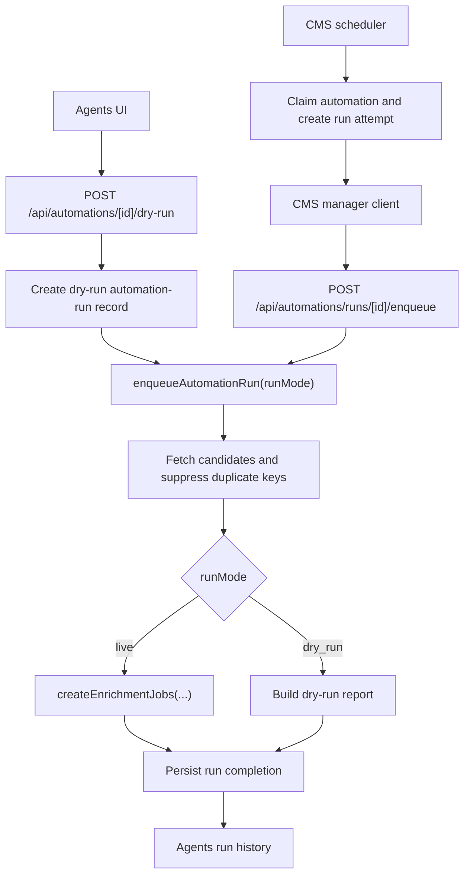

# Manager Agent Dry-Run Mode Plan

## Overview

Add a dry-run mode for Manager automations so an operator can launch an agent, reuse the same eligibility and duplicate-suppression logic as live runs, and receive a durable run report without creating normal enrichment jobs, updating canonical CMS content, updating vector indexes, or mutating Mux tracks.

This plan keeps dry-run as a first-class execution mode inside the existing automation runner and CMS scheduler paths. The mutation boundary is the current `createEnrichmentJobs(...)` call in `apps/manager/src/features/agents/automation-runner.ts`; dry-run should branch before that call and return a report-only result.

## Found Inputs

- Brainstorm: `docs/brainstorms/2026-04-13-manager-agent-dry-run-mode-brainstorm.md`
- Roadmap ticket: `docs/roadmap/media-generation/feat-087-manager-agent-dry-run-mode.md`
- Prior automation baseline: `docs/brainstorms/2026-04-12-manager-agents-automations-requirements.md`
- Branch: `feat/manager-agent-dry-run-mode`
- User requirement: Red/Green TDD and a user smoke test are required.

## Requirements Trace

- Manual launch: an operator can run an existing automation in dry-run mode without waiting for its schedule.
- Scheduled dry-run: an automation can run on schedule in dry-run mode and still use CMS claim, run attempt, completion, lease clearing, and next-run advancement.
- Same selection logic: dry-run uses the same candidate fetch, refresh-mode handling, target-language constraints, duplicate-key suppression, and cap logic as live automation dispatch.
- No live writes: dry-run does not create normal `EnrichmentJob` records, invoke `runVideoEnrichment(...)`, push tracks to Mux, sync subtitle overrides, write CMS embeddings, or call vector index writer endpoints.
- Durable report: dry-run stores a run-level report artifact that is reachable from Agents run history.
- Honest counts: `enqueuedCount` remains `0`; the report uses `wouldEnqueueCount` for intended work.
- Status separation: `status` keeps describing the execution result (`success`, `partial`, `failed`, `no_op`), while `runMode` distinguishes `live` from `dry_run`.
- UI clarity: run history marks dry-run runs and exposes the report details.

## Scope Boundaries

In scope:

- Manager automation contract, runner, service-to-service enqueue route, manual dry-run route, automation store, and Agents UI.
- CMS automation and automation-run schema changes needed to persist run mode and report JSON.
- CMS scheduler, manager client, and scheduler tests for scheduled dry-run dispatch.
- Focused Manager and CMS tests plus a browser/user smoke test.

Out of scope:

- Free-form agent instructions.
- Full workflow-level side-effect sandboxing.
- Creating report-only `EnrichmentJob` records.
- Mux track inspection beyond read-only data needed for report explanation.
- New vector indexing behavior.
- New schedule-builder capabilities beyond marking an automation as dry-run/live.

## Current State Research

- `apps/manager/src/features/agents/automation-runner.ts` already performs candidate discovery and duplicate suppression before calling `createEnrichmentJobs(...)`. This is the safest branch point.
- `apps/manager/src/app/api/automations/runs/[id]/enqueue/route.ts` is service-bearer only, receives a run id, validates the automation payload, and calls `enqueueAutomationRun(...)`. It is right for CMS scheduled dispatch but not for browser manual launches.
- `apps/cms/src/api/enrichment-automation/services/scheduler.ts` owns claim, run-attempt creation, manager dispatch, completion, next-run advancement, and lease cleanup.
- `apps/cms/src/api/enrichment-automation/services/manager-client.ts` currently posts only `{ automation }` to Manager and normalizes only flat result counts, job ids, errors, and summary.
- `apps/cms/src/api/enrichment-automation/content-types/enrichment-automation/schema.json` has no `runMode` field on the automation definition.
- `apps/cms/src/api/enrichment-automation-run/content-types/enrichment-automation-run/schema.json` has no `runMode` or report field on run history.
- `apps/manager/src/features/agents/automation-store.ts` lists automation runs but only fetches flat run counts and summary.
- `apps/manager/src/features/agents/automation-list.tsx` and `automation-run-history.tsx` have no manual launch affordance, dry-run marker, or report viewer.

## Compound Learnings Reviewed

- `docs/solutions/platform/backfill-worker-pattern-manager-20260407.md`: dry-run precedent for using the real operational path while branching into report-only execution.
- `docs/solutions/cms/strapi-enrichment-job-content-type.md`: durable Strapi operational records should stay `draftAndPublish: false` and use JSON fields for artifacts and errors.
- `docs/solutions/performance-issues/manager-video-coverage-sql-aggregation-20260402.md`: keep eligibility set-based and avoid GraphQL N+1 reads.
- `docs/solutions/integration-issues/manager-mux-subtitle-override-recovery-non-destructive-replacement-20260410.md`: Mux mutation boundaries must be explicit and non-destructive.
- `docs/solutions/integration-issues/manager-transcription-routing-artifact-boundary-20260412.md`: report artifacts should normalize and sanitize operator-facing provenance.
- `docs/solutions/integration-issues/manager-embeddings-transcript-aware-optional-metadata-2026-04-08.md`: artifact contracts should be additive.
- `docs/solutions/integration-issues/manager-agents-target-subtitle-contract-and-language-labels-20260412.md`: validate automation contracts at UI, Manager route, CMS persistence, and runner boundaries; verify with focused red/green tests and browser smoke.
- `docs/solutions/ui-bugs/manager-enrich-now-feedback-handoff-20260413.md`: separate launch acceptance feedback from long-running progress/report state.

No `docs/solutions/patterns/critical-patterns.md` file exists in this worktree.

## Research Decision

No external web research is needed for this plan. The implementation is repo-specific and the relevant behavior is fully described by the current Manager/CMS automation code, the existing dry-run backfill precedent, and the local compound docs above.

## Product Decisions

- Default run mode is `live` for all existing and newly created automations.
- Scheduled dry-run is supported by storing `runMode: "dry_run"` on the automation definition.
- Manual dry-run is supported as a user-authenticated Manager action against an automation id, not by exposing the service-bearer scheduler endpoint to the browser.
- Manual dry-run creates a durable automation-run record and report, but does not advance the automation schedule or change `nextRunAt`.
- Scheduled dry-run follows the existing scheduler lifecycle and does advance `nextRunAt`, because that is the schedule's own dry-run cadence.
- `status: "no_op"` means there were no selected candidates after eligibility and duplicate filtering. A dry-run with selected candidates returns `status: "success"` and `enqueuedCount: 0`.
- V1 report granularity includes selected candidates, duplicate suppression count, cap, target languages, and suppressed operation names. It does not need a full per-video rejection taxonomy.
- Manual dry-run should be blocked while the automation has an active lease or another in-flight run, to avoid ambiguous overlap with live scheduled work.

## Architecture



### Manager Contract

Add these concepts to `apps/manager/src/features/agents/automation-contract.ts`:

```ts
export type AutomationRunMode = "live" | "dry_run"

export type AutomationDryRunReport = {
  kind: "metadata"
  data: {
    runMode: "dry_run"
    automationDocumentId: string
    automationRunDocumentId: string
    template: AutomationTemplate
    refreshMode: AutomationRefreshMode
    targetLanguageIds: string[]
    maxVideosPerRun: number
    eligibleCount: number
    skippedDuplicateCount: number
    wouldEnqueueCount: number
    selectedCandidates: Array<{
      videoDocumentId: string
      coreId: string
      outputOwner: "missing" | "ai" | "human"
      automationKey: string
    }>
    suppressedOperations: string[]
    summary: string
    generatedAt: string
  }
}
```

Extend `EnrichmentAutomation` and `EnrichmentAutomationRun` with `runMode`, defaulting to `live` when older records omit it. Extend runner and route result types with an optional `dryRunReport`.

### CMS Persistence

Add schema fields:

- `enrichment-automation.runMode`: enumeration `["live", "dry_run"]`, default `live`, required.
- `enrichment-automation-run.runMode`: enumeration `["live", "dry_run"]`, default `live`, required.
- `enrichment-automation-run.report`: JSON, optional, used for the dry-run report artifact.

Regenerate CMS/GraphQL outputs in the implementation PR if the schema changes. Do not hand-edit generated GraphQL outputs.

### Scheduled Dispatch

Thread `runMode` from `ClaimedAutomation` through `AutomationRunDispatchResult`, `manager-client.ts`, and `scheduler.ts`.

For scheduled dry-run:

- Create and start the run attempt as today.
- Dispatch to Manager with `runMode: "dry_run"`.
- Persist completion with `enqueuedCount: 0`, `jobDocumentIds: []`, `report`, summary, and `status`.
- Advance `nextRunAt` and clear leases through the normal scheduler completion path.

### Manual Launch

Add a separate user-authenticated route, tentatively `POST /api/automations/[id]/dry-run`, because the existing enqueue route is service-bearer only and keyed by a run document id.

The manual route should:

- Authenticate with the normal Manager session.
- Load the automation from CMS by document id instead of trusting a stale client snapshot.
- Check for active lease or in-flight run and return a clear conflict response if one exists.
- Create an `enrichment-automation-run` record with `runMode: "dry_run"` and `status: "running"` or the repo's existing run-start equivalent.
- Call `enqueueAutomationRun({ runMode: "dry_run", ... })`.
- Complete the run record with the report and counts.
- Return the refreshed automation/run data to the UI.
- Avoid changing `nextRunAt` for manual dry-runs.

## Red/Green TDD Sequence

1. Red: Manager runner dry-run behavior

   Add failing tests in `apps/manager/src/features/agents/automation-runner.test.ts` proving dry-run uses the same eligibility path, returns `enqueuedCount: 0`, returns `wouldEnqueueCount`, includes selected candidate report rows, and does not call `createEnrichmentJobs(...)`.

   Green: Add `runMode` to `enqueueAutomationRun(...)`, factor any needed report helper, and branch before `createEnrichmentJobs(...)`.

2. Red: Manager enqueue route contract

   Add failing route tests in `apps/manager/src/app/api/automations/runs/[id]/enqueue/route.test.ts` proving service-bearer callers can pass `runMode: "dry_run"` and malformed run modes are rejected.

   Green: Update zod payload validation and pass `runMode` into the runner.

3. Red: CMS manager client and scheduler

   Add failing tests in `apps/cms/src/api/enrichment-automation/services/scheduler.test.ts` and manager-client coverage proving a scheduled dry-run sends `runMode`, persists `runMode` and `report`, clears leases, and advances `nextRunAt`.

   Green: Extend CMS types, normalization, scheduler completion, manager client request/response normalization, and schemas.

4. Red: Manual dry-run route

   Add failing Manager route tests for a user-authenticated manual dry-run launch: successful launch creates/completes a dry-run run record, an active lease returns conflict, and schedule fields are not advanced.

   Green: Add the route and minimal automation-store helpers for creating/completing the dry-run run record.

5. Red: Agents UI and run history

   Add failing component tests for a dry-run button, disabled/conflict state, dry-run badge in run history, `would enqueue` report copy, and report details visibility.

   Green: Update `agents-page.tsx`, `automation-list.tsx`, `automation-run-history.tsx`, and related CSS/components while following existing Manager UI patterns.

6. Red: Side-effect guard regression

   Add focused regression tests that dry-run does not call `createEnrichmentJobs(...)`, Mux track mutation helpers, CMS embedding sync/index helpers, or scene embedding index helpers from the automation dispatch path. Use mocks at existing service boundaries rather than broad end-to-end stubs.

   Green: Keep the dry-run branch above those mutation paths and make the report builder read-only.

## Verification Commands

Run focused red tests before the implementation for each slice, then rerun after each green step:

```bash
pnpm --filter @forge/manager test -- apps/manager/src/features/agents/automation-runner.test.ts
pnpm --filter @forge/manager test -- 'apps/manager/src/app/api/automations/runs/[id]/enqueue/route.test.ts'
pnpm --filter @forge/cms test -- apps/cms/src/api/enrichment-automation/services/scheduler.test.ts
```

Run full scope checks before PR:

```bash
pnpm --filter @forge/manager test
pnpm --filter @forge/manager lint
pnpm --filter @forge/manager typecheck
pnpm --filter @forge/cms test
pnpm --filter @forge/cms lint
pnpm --filter @forge/cms typecheck
pnpm --filter @forge/cms codegen
pnpm --filter @forge/graphql typecheck
pnpm lint
pnpm typecheck
git diff --check
```

If CMS codegen or GraphQL generation changes outputs, include those generated files in the same implementation PR.

## User Smoke Test

Run this after automated tests pass:

1. Start local CMS and Manager using the repo's local dev setup.
2. Sign in to Manager and open `/dashboard/agents`.
3. Create or select a metadata automation with `maxVideosPerRun: 1` and run mode `live`.
4. Click the manual dry-run action.
5. Confirm the UI shows accepted/running feedback, then a run history row marked `Dry run`.
6. Open the report details and confirm it shows `wouldEnqueueCount`, selected candidate ids, duplicate-suppression count, target languages, and suppressed operations.
7. Confirm the row shows `0 enqueued` and does not create a normal live enrichment job.
8. Confirm local logs show no Mux track create/update/delete calls and no CMS embedding/scene-index writer calls.
9. Create or switch an automation to scheduled dry-run mode, force or wait for one scheduler cycle locally, and confirm `nextRunAt` advances while the run is still marked `Dry run`.

## Risks And Mitigations

- Risk: dry-run accidentally creates normal jobs because the branch is too low in the stack. Mitigation: branch before `createEnrichmentJobs(...)` and add a direct negative assertion around that mock.
- Risk: scheduled dry-runs blur live status semantics because `enqueuedCount` is `0`. Mitigation: keep `runMode` separate from `status` and display `wouldEnqueueCount` only in the report.
- Risk: manual dry-run changes live schedule timing. Mitigation: manual dry-run writes only a run record/report and leaves `nextRunAt` unchanged.
- Risk: report JSON becomes unbounded or leaks provider/storage internals. Mitigation: keep V1 report to ids, counts, selected candidate fields, suppressed operation names, and a sanitized summary.
- Risk: CMS schema changes drift from generated GraphQL types. Mitigation: run CMS codegen and relevant GraphQL typecheck/codegen in the same PR.

## PR Readiness

- Keep the work on `feat/manager-agent-dry-run-mode`.
- Use a conventional commit, likely `feat(manager): add automation dry-run mode`.
- Target `main` with a squash-merge PR.
- Do not use `--no-verify`.
- Update `docs/roadmap/media-generation/feat-087-manager-agent-dry-run-mode.md` to `complete` only after implementation, tests, and smoke test pass.
- Run `ce:compound` or the repo's compound workflow after the implementation is complete to capture any new dry-run or automation-runner learnings.

## Implementation Notes

- Added Manager live/dry-run run-mode contracts, dry-run report artifacts, runner branching before `createEnrichmentJobs(...)`, and service/manual run routes.
- Added CMS run-mode/report persistence and scheduled dry-run dispatch support in the scheduler and manager client.
- Added Agents UI controls and history report rendering for dry-runs.
- Regenerated the Strapi GraphQL schema and `@forge/graphql` environment types.
- Verified Red/Green TDD, package tests, typechecks, lint, and a browser smoke test with the dry-run report expanded.
