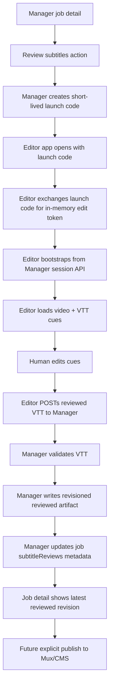

# feat: Manager Subtitle Review Editor

## Overview

Add a job-detail-first human subtitle review flow to Forge Manager. Editors should be able to launch a Forge-hosted subtitle editor from a completed Manager job, load the generated VTT artifact, adjust text and timing against the video, and save the result back as a reviewed Manager artifact.

The recommended implementation is a separate internal `apps/subtitle-editor` app forked from the MIT upstream [`laubonghaudoi/subtitle-editor`](https://github.com/laubonghaudoi/subtitle-editor), with Forge-specific session/load/save adapters. Manager remains the authority for auth, job state, artifact storage, and future publishing.

## Found Brainstorm

Found brainstorm from 2026-04-11: `manager-subtitle-editor-integration`.

Resolved decisions carried into this plan:

- Use a separate Forge-hosted internal editor app, not the upstream app unchanged.
- Launch v1 from Manager job detail.
- Save human edits as Manager-reviewed revisioned artifacts.
- Keep generated artifacts unchanged.
- Keep CMS/Mux publishing explicit follow-up actions.

## Current State

Manager already produces the subtitle artifacts this feature needs:

- `apps/manager/src/services/transcription.ts` writes `transcript.json` and source `subtitles.vtt`.
- `apps/manager/src/services/subtitleTranslation/index.ts` writes `subtitles-{lang}.vtt` and `translation-{lang}.json`.
- `apps/manager/src/lib/job-artifacts.ts` resolves logical artifact keys into authenticated artifact links.
- `apps/manager/src/app/api/jobs/[id]/artifacts/[artifact]/route.ts` serves artifacts read-only after Manager auth or signed Mux artifact access.
- `apps/manager/src/services/storage.ts` writes artifacts to Railway S3 or local `.tmp/artifacts`.
- `apps/manager/src/lib/state.ts` persists the job artifact manifest into Strapi `EnrichmentJob`.
- `apps/manager/src/app/api/jobs/[id]/mux-sync/override/route.ts` is the current explicit subtitle publish/override pattern for Mux.

The missing piece is a human-review contract: edit-session bootstrap, server-side VTT validation, reviewed artifact writes, and Manager UI that makes reviewed revisions visible.

## Research Findings

### Repo Learnings

- `docs/solutions/integration-issues/manager-mux-subtitle-override-recovery-non-destructive-replacement-20260410.md`: publish paths must be non-destructive and resumable; saving review output should not delete or overwrite existing Mux data.
- `docs/solutions/integration-issues/manager-job-read-model-source-language-metadata-20260409.md`: if truth lives in artifact metadata, promote enough of it into the read model or UI helpers so operators do not inspect raw JSON.
- `docs/solutions/platform/optional-railway-s3-local-fallback.md`: use the existing storage abstraction and local `.tmp/artifacts` fallback.
- `docs/solutions/platform/adding-new-apps.md`: new apps belong under `apps/*`; no root workspace config changes are needed.
- `docs/solutions/platform/new-app-ci-and-deployment-patterns.md`: new Next apps need env validation, lazy service initialization, Railway standalone handling, and health checks.
- `docs/solutions/platform/restoring-upstream-ui-verbatim.md`: when porting UI, copy first and adapt surgically.

### External Research

- Upstream `subtitle-editor` is Next `16.1.6` and React `19.2.4` in `package.json`, matching Manager’s major runtime shape.
- Upstream load/save is browser-local: file upload for load and Blob download for save. It is not embeddable as-is because `SubtitleProvider` is page-owned and does not accept controlled `initialSubtitles`, `mediaUrl`, or `onSave` props.
- Upstream includes Cloudflare/OpenNext/PWA-specific deployment glue (`next-pwa`, `open-next.config.ts`, `wrangler.jsonc`) that should be stripped or isolated for Forge/Railway.
- Official Next.js docs make Route Handlers the cleanest fit for Manager save APIs; they support `POST` and should be treated as public endpoints that verify auth before mutation.
- Official Next.js docs confirm Route Handlers support `OPTIONS` and per-route CORS headers, which matters because the editor app will call Manager from a separate origin with JSON and bearer auth.
- Official Next.js standalone docs require copying `.next/static` and `public` manually in self-hosted standalone output; monorepo apps may need `outputFileTracingRoot`.
- Official Mux docs support WebVTT/SRT text tracks by URL and adding tracks to existing ready assets, which matches future explicit publish-from-reviewed-artifact work.
- Official Mux docs distinguish server-side API access tokens from playback signing keys; any signed playback support must be generated by Manager on the server, not by exposing Mux credentials or signing keys to the editor app.

## Proposed Solution

### Architecture



### Responsibility Split

- **Manager**
  - owns Strapi session auth and API-key auth
  - mints short-lived, job-scoped launch codes and edit sessions
  - validates editor origin on browser-facing session routes
  - validates source artifact availability and save payloads
  - writes reviewed artifacts via `writeArtifact(...)`
  - persists `subtitleReviews` metadata into the job artifact manifest
  - renders reviewed state on the job detail page

- **Subtitle editor app**
  - owns subtitle editing UX
  - consumes only a scoped Manager edit-session token returned after launch-code exchange
  - keeps edit tokens in memory rather than in URLs or local storage
  - loads VTT text and media URL from Manager bootstrap data
  - posts VTT text back to Manager
  - preserves unsaved local draft through auth/session expiry where practical

- **CMS/Mux**
  - not mutated on review save
  - remain explicit publish targets for later actions

## Data Contracts

### Reviewed Artifact Key

Use a reviewed key that still resolves through the current VTT artifact descriptor pattern:

```ts
type ReviewedSubtitleArtifactKey = `subtitles-${string}-reviewed-r${string}`

// Example
;("subtitles-ru-reviewed-r0001")
```

Do not parse the language back out of the key as the source of truth. Persist `targetLanguage` in metadata because language codes may include hyphens.

### `subtitleReviews` Metadata Artifact

Persist review state in `job.artifacts.subtitleReviews` as a metadata artifact:

```ts
type SubtitleReviewRevision = {
  sourceArtifactKey: string
  reviewedArtifactKey: string
  targetLanguage: string
  revision: number
  baseArtifactFingerprint: string
  contentFingerprint: string
  clientSaveId?: string
  savedAt: string
  savedByUserId?: string
}

type SubtitleReviewReport = {
  revisions: SubtitleReviewRevision[]
  latestBySourceArtifactKey: Record<string, string>
  updatedAt: string
}
```

The latest pointer chooses what the editor loads when a review already exists. Generated artifacts remain the audit baseline.

### Launch Code And Edit Session Token

Add a small Manager-owned helper, likely `apps/manager/src/lib/subtitle-review-session.ts`, that signs and verifies a token containing:

- `jobId`
- `sourceArtifactKey`
- `targetLanguage`
- `baseReviewedArtifactKey`, if continuing from a previous reviewed revision
- `baseArtifactFingerprint`
- `expiresAt`
- `nonce`

Default assumptions:

- edit sessions use a dedicated `SUBTITLE_REVIEW_SESSION_SECRET`; do not fall back to `MANAGER_API_KEY`, `STRAPI_API_TOKEN`, Mux access tokens, or Mux signing keys
- token TTL is long enough for editing, for example 4 hours
- token is scoped to one job and one source artifact
- editor never receives raw Strapi credentials or `MANAGER_API_KEY`

The editor URL must not contain the long-lived edit token. Use a short-lived launch code in the URL, then have the editor exchange it for an edit-session token via a `POST` request from an allowlisted origin. The launch code should be high entropy, low privilege, short TTL, single-use, and rate-limited on exchange. If the implementation cannot support durable single-use consumption without disproportionate scope, record that as an implementation tradeoff before merging and keep the launch code exchange-only; it must not authorize a save directly.

The editor entry route should exchange the launch code immediately, set `Referrer-Policy: no-referrer` and `Cache-Control: no-store`, and remove the launch code from the visible URL after exchange. The edit-session token returned from the exchange is held in browser memory and sent with bootstrap/save requests using an authorization header. Do not persist it in local storage, include it in query strings, or echo it in logs.

Launch-code consumption needs shared state if Manager can run more than one process. Use a job-scoped shared store, such as hashed nonce records in the `subtitleReviews` metadata artifact, or explicitly record a single-Manager-instance v1 deployment assumption before merging. Do not rely on process-local memory for single-use enforcement unless the deployment topology makes that safe.

### CORS And Origin Contract

Because `apps/subtitle-editor` is a separate app, Manager subtitle-review browser APIs need an explicit origin policy:

- add a Manager env var for exact allowed editor origins, for example `SUBTITLE_EDITOR_ALLOWED_ORIGINS`
- allow only configured exact origins for launch-code exchange, bootstrap, and save
- return `Vary: Origin` on CORS responses
- support preflight for `POST` and `OPTIONS`
- allow only the request headers needed for JSON and bearer auth
- reject missing or non-allowlisted `Origin` headers on browser-facing editor routes
- avoid credentialed cross-origin cookie auth for the editor path; the bearer edit token is the cross-app auth mechanism

### Playback Contract

Manager-created assets currently use public Mux playback IDs. V1 should treat public playback as the default supported path and should fail explicitly if the job has no usable `muxPlaybackId`.

If a job ever points at a signed Mux playback ID, Manager must generate the signed playback URL server-side using existing Mux signing-key infrastructure and return a URL whose playback token lifetime is appropriate for the review session. The editor app must not receive Mux access tokens, Mux signing keys, or enough material to sign playback URLs itself.

## API Design

### Manager Session Create

Add:

`POST /api/jobs/[id]/subtitle-reviews/session`

Auth:

- Manager session auth with an actor-aware authorization helper; API-key auth is allowed only for server-to-server session creation if explicitly needed

Request:

```json
{
  "sourceArtifactKey": "subtitles-ru",
  "targetLanguage": "ru"
}
```

Response:

```json
{
  "editorUrl": "https://<subtitle-editor>/edit?launch=...",
  "expiresAt": "2026-04-13T18:00:00.000Z"
}
```

Behavior:

- verify the job exists
- verify the authenticated actor can view and review the specific job and artifact
- verify `sourceArtifactKey` is a downloadable VTT artifact
- choose latest reviewed artifact as the editing base if present
- create a short-lived launch code; do not put the edit token in the URL
- return a URL using `SUBTITLE_EDITOR_PUBLIC_URL`
- return no-store caching headers and redact launch code values from logs

### Manager Launch Exchange

Add:

`POST /api/jobs/[id]/subtitle-reviews/session/exchange`

Auth:

- launch code plus allowlisted editor `Origin`

Request:

```json
{
  "launchCode": "..."
}
```

Response:

```json
{
  "editSessionToken": "...",
  "expiresAt": "2026-04-13T22:00:00.000Z"
}
```

Behavior:

- verify launch code scope, expiry, and origin
- consume the launch code as single-use before returning an edit token
- persist launch-code consumption in shared job-scoped state, or document a single-instance deployment assumption
- return a bearer edit-session token only in the JSON response body
- set no-store caching headers and redact code/token values from logs
- rate-limit failed exchanges by origin/IP/code family so launch-code guessing remains impractical

### Manager Session Bootstrap

Add:

`POST /api/jobs/[id]/subtitle-reviews/session/bootstrap`

Auth:

- bearer edit-session token plus allowlisted editor `Origin`

Response:

```json
{
  "jobId": "job-doc-id",
  "sourceArtifactKey": "subtitles-ru",
  "baseArtifactKey": "subtitles-ru-reviewed-r0001",
  "targetLanguage": "ru",
  "muxPlaybackId": "playback-id",
  "mediaUrl": "https://player.mux.com/playback-id",
  "vtt": "WEBVTT\\n...",
  "baseArtifactFingerprint": "sha256:..."
}
```

Behavior:

- verify token scope and expiry
- verify the token actor/session is still allowed to view and review the specific job and artifact
- read the latest reviewed artifact if present, otherwise the generated source artifact
- return VTT text and media metadata in one bootstrap payload
- return 404 if the source artifact no longer exists
- return 422 if no usable playback URL can be produced
- do not accept the edit token through a query string
- set no-store caching headers and redact bearer tokens, VTT bodies, and playback URLs from logs

### Manager Save Revision

Add:

`POST /api/jobs/[id]/subtitle-reviews/revisions`

Auth:

- bearer edit-session token plus allowlisted editor `Origin`

Request:

```json
{
  "vtt": "WEBVTT\\n...",
  "baseArtifactFingerprint": "sha256:...",
  "clientSaveId": "01HQ..."
}
```

Behavior:

- verify token scope and expiry
- verify the token actor/session is still allowed to review the specific job and artifact
- verify the job/source artifact still exists
- re-read the latest reviewed pointer immediately before writing
- enforce max payload size
- validate WebVTT server-side using `apps/manager/src/lib/vtt.ts`
- reject invalid or empty cue output
- enforce optimistic concurrency by comparing the latest reviewed/base fingerprint
- make duplicate save retries idempotent using `clientSaveId` and/or `(baseArtifactFingerprint, contentFingerprint)`
- write the next reviewed artifact via `writeArtifact(...)`
- update `job.artifacts` with both:
  - reviewed artifact as `{ kind: "downloadable" }`
  - `subtitleReviews` metadata report
- return the updated job and revision summary
- set no-store caching headers and redact bearer tokens and VTT bodies from logs

Idempotency behavior:

- persist the dedupe key in the same shared review metadata that records the reviewed revision
- check for an existing `clientSaveId` or matching base/content fingerprint before writing a new reviewed artifact
- when Manager is horizontally scaled, use a persistence-level reservation or compare-and-write strategy; do not rely on process-local locks alone

Security behavior:

- treat VTT cue text as untrusted user-editable content
- render cue text as escaped text nodes only; do not render cue text through raw HTML or rich-text markup
- normalize or reject markup-like cue payloads if the upstream editor would otherwise render them unsafely

Conflict behavior:

- return `409` if the latest reviewed pointer changed since the editor loaded
- editor should keep the draft and ask the user to reload before saving
- duplicate POST retries for the same saved content should return the existing revision summary rather than creating `r0002` for the same edit

## UI Plan

### Manager Job Detail

Update `apps/manager/src/features/jobs/live-job-steps-table.tsx` or a small presenter/helper beneath it to:

- show `Review subtitles` beside eligible `subtitles` and `subtitles-{lang}` artifacts
- show `Reviewed rN` when `subtitleReviews` metadata has a latest revision
- link/download the latest reviewed artifact
- launch a new edit session rather than linking directly to the editor with raw job data

Row states to specify in the presenter:

- eligible generated VTT with `Review subtitles`
- reviewed VTT present with `Reviewed rN` and continue-review action
- ineligible artifact with no review action
- session creation in progress
- session creation failed with retryable operator-visible copy

Because the current Manager test setup favors pure presenter tests over component tests, create helper functions for eligibility and display state so Red/Green tests can stay lightweight.

### Subtitle Editor App

Add `apps/subtitle-editor` as package `@forge/subtitle-editor`:

- copy upstream app structure first, then adapt surgically
- remove or disable Cloudflare/OpenNext/PWA assumptions for v1
- add `AGENTS.md` and `CLAUDE.md`
- add `src/config/env.ts` with `@t3-oss/env-nextjs` and CI-safe `skipValidation`
- add `railway.toml`, `.env.example`, and any repo-required CI placeholder env file
- configure Railway standalone output with a no-auth healthcheck and explicit `.next/static` and `public` copy behavior
- use a port such as `3003` for local dev
- replace file-download save as the primary Forge path with a Manager save client
- keep upstream file import/export as optional utility only if it does not confuse Forge review flow
- support desktop review as the primary v1 layout; define the minimum supported viewport before implementation
- v1 editing supports desktop/tablet-width viewports only, with a target minimum of 1024px unless design review sets a different breakpoint
- below the supported editing viewport, show a non-editing fallback with a return-to-Manager action rather than a cramped editor
- for narrower supported viewports, use a stacked or collapsible layout that preserves the cue editor as the primary task surface

Editor app adapter responsibilities:

- parse `launch` from `/edit?launch=...`
- exchange the launch code for an in-memory edit token
- call Manager bootstrap API with the in-memory edit token
- hydrate subtitle tracks from returned VTT
- load the media preview from returned Mux/player metadata
- post VTT text back to Manager
- handle 401/403/409/422 states without dropping the draft
- cover initial loading, launch exchange failure, session expiry, bootstrap failure, validation error, conflict reload, save success, and return-to-Manager states
- preserve the current draft through recoverable failures and expose a clear next action for each failure state
- support keyboard cue navigation, labeled timing controls, and focus movement after save/conflict/error feedback
- render subtitle cue text as text, not HTML
- open from Manager in a new tab for v1 so the original job detail page remains available
- provide a persistent `Return to Manager` action in the editor
- warn before returning when there is an unsaved draft; after a successful save, returning should take the operator back to the source job detail page
- define focus order across media preview, cue list, cue text, timing controls, and save/error feedback before building the UI

## Red/Green TDD Plan

### Unit 1: Reviewed Subtitle Artifact Model

**Files**

- Add `apps/manager/src/lib/subtitle-review.ts`
- Add `apps/manager/src/lib/subtitle-review.test.ts`
- Modify `apps/manager/src/lib/job-artifacts.ts`
- Modify `apps/manager/src/lib/job-artifacts.test.ts`
- Modify `apps/manager/src/types/job.ts` if shared types are needed

**Red**

- failing test for `buildReviewedSubtitleArtifactKey("ru", 1) -> "subtitles-ru-reviewed-r0001"`
- failing test that latest reviewed revision is selected over generated source for editing
- failing test that reviewed artifacts resolve as `text/vtt`
- failing test that `subtitleReviews` metadata normalizes without dropping other artifacts

**Green**

- implement key builder, report normalizer, latest-revision selector, and artifact descriptor support

**Refactor**

- keep the artifact key as a storage locator only; use metadata for language/revision truth

### Unit 2: Signed Edit Sessions

**Files**

- Add `apps/manager/src/lib/subtitle-review-session.ts`
- Add `apps/manager/src/lib/subtitle-review-session.test.ts`
- Modify `apps/manager/src/config/env.ts` for `SUBTITLE_REVIEW_SESSION_SECRET`, `SUBTITLE_EDITOR_PUBLIC_URL`, and `SUBTITLE_EDITOR_ALLOWED_ORIGINS`
- Update `apps/manager/.env.example`
- Update `apps/manager/CLAUDE.md` env table

**Red**

- failing test that a token verifies only for the intended job/source artifact
- failing test that expired tokens are rejected
- failing test that tampered tokens are rejected
- failing test that the token does not expose raw service credentials
- failing test that edit-session signing requires `SUBTITLE_REVIEW_SESSION_SECRET` and does not fall back to Strapi, Manager API, or Mux secrets
- failing test that the raw edit-session token is never embedded in `editorUrl`
- failing test that required Manager editor env vars are validated consistently

**Green**

- implement launch-code exchange plus HMAC signing/verification with scoped payload, expiration, env validation, and shared launch-code consumption state where required by deployment topology

**Refactor**

- share small constant-time comparison helpers with existing auth code only if it reduces duplication cleanly

### Unit 3: Manager Review Session Routes

**Files**

- Add `apps/manager/src/app/api/jobs/[id]/subtitle-reviews/session/route.ts`
- Add `apps/manager/src/app/api/jobs/[id]/subtitle-reviews/session/exchange/route.ts`
- Add `apps/manager/src/app/api/jobs/[id]/subtitle-reviews/session/bootstrap/route.ts`
- Add route tests beside the route
- Possibly add `apps/manager/src/services/subtitleReview.ts`

**Red**

- unauthenticated session creation returns 401
- launch-code exchange rejects missing or non-allowlisted origins
- preflight returns the expected allowlisted CORS headers and `Vary: Origin`
- missing job returns 404
- non-downloadable or non-VTT artifact returns 404/422
- valid generated artifact returns an `editorUrl`
- bootstrap with a valid bearer token returns VTT text and media metadata
- bootstrap prefers latest reviewed revision when present
- bootstrap returns a clear 422 when no usable media playback URL can be produced

**Green**

- implement session creation, launch-code exchange, and bootstrap through existing `getJob`, `readArtifact`, origin, and auth helpers

**Refactor**

- keep route bodies thin and move selection/fingerprint logic into tested helpers

### Unit 4: Manager Save Revision Route

**Files**

- Add `apps/manager/src/app/api/jobs/[id]/subtitle-reviews/revisions/route.ts`
- Add route tests beside the route
- Add `apps/manager/src/lib/reviewed-vtt-validation.ts` if validation grows beyond a small helper

**Red**

- expired/tampered token returns 401/403
- wrong editor origin returns 403 and does not write an artifact
- invalid JSON returns 400
- invalid VTT returns 422 and does not write an artifact
- stale `baseArtifactFingerprint` returns 409
- duplicate retry for the same `clientSaveId` returns the already-created revision summary
- successful save writes a new reviewed artifact and updates `subtitleReviews`
- successful save leaves the generated source artifact untouched

**Green**

- validate VTT, compute content fingerprint, write reviewed artifact, and merge job artifacts through existing state helpers while preserving idempotent retries

**Refactor**

- ensure writes are idempotent enough that a retry cannot corrupt the latest pointer

### Unit 5: Manager Job Detail Review Presentation

**Files**

- Add `apps/manager/src/features/jobs/subtitle-review-presenter.ts`
- Add `apps/manager/src/features/jobs/subtitle-review-presenter.test.ts`
- Modify `apps/manager/src/features/jobs/live-job-steps-table.tsx`
- Modify `apps/manager/src/app/globals.css`

**Red**

- artifact without VTT descriptor is not reviewable
- generated `subtitles-ru` artifact is reviewable
- latest reviewed revision displays as reviewed
- launch action posts to the session route and opens the returned editor URL
- failure to create a session surfaces an operator-visible error

**Green**

- render review affordances and reviewed status using presenter helpers

**Refactor**

- keep the job table readable; do not overload the Mux sync compare card with editor state

### Unit 6: Subtitle Editor App Adapter

**Files**

- Add `apps/subtitle-editor/`
- Add `apps/subtitle-editor/AGENTS.md`
- Add `apps/subtitle-editor/CLAUDE.md`
- Add `apps/subtitle-editor/package.json`
- Add `apps/subtitle-editor/next.config.ts` with Forge/Railway standalone output behavior
- Add `apps/subtitle-editor/railway.toml` with healthcheck path and standalone build/start behavior
- Add `apps/subtitle-editor/src/app/api/health/route.ts`
- Add `apps/subtitle-editor/src/config/env.ts`
- Add `apps/subtitle-editor/.env.example`
- Add `apps/subtitle-editor/.env.ci` with non-secret placeholder values
- Add `apps/subtitle-editor/src/lib/manager-client.ts`
- Add editor adapter tests in the new app

**Red**

- bootstrap client surfaces 401/403/404/409/422 states distinctly
- launch exchange keeps edit-session tokens out of URLs and local storage
- save client posts VTT text and handles success with returned revision metadata
- editor page keeps draft text when save returns 409 or 401
- adapter can hydrate a subtitle track from Manager-provided VTT text without using a browser `File`
- editor app build works in CI without real service secrets
- env validation uses the repo's Next app pattern for `skipValidation: !!process.env.CI`
- standalone build contains static assets and public assets in the served output
- health route returns success without auth
- `.env.ci` contains no secrets and is sufficient for CI env validation where needed

**Green**

- copy upstream app, add Forge adapter, replace the primary save path, and wire the new app using Forge's Next/Railway deployment pattern

**Refactor**

- keep upstream editing components close to upstream; isolate Forge-specific code in adapter modules
- keep package extraction out of v1 unless a second host actually needs it

## User Smoke Test

Run this manually before declaring the feature done:

1. Create or find a completed Manager job with at least one generated VTT artifact, such as `subtitles-ru`.
2. Start Manager on `http://localhost:3002`.
3. Start the subtitle editor app on `http://localhost:3003`.
4. Open the Manager job detail page.
5. Click `Review subtitles` for the generated subtitle artifact.
6. Confirm the editor opens with a launch code only and loads video context plus subtitle cues.
7. Edit the first cue text and adjust one timestamp.
8. Save.
9. Return to Manager and refresh the job detail page.
10. Confirm a reviewed revision is shown, for example `subtitles-ru-reviewed-r0001`.
11. Download/open the reviewed artifact and confirm the edit is present.
12. Download/open the generated artifact and confirm it is unchanged.
13. Reopen review and confirm the editor loads the latest reviewed revision for continued editing.
14. Force an invalid VTT save or stale-save scenario and confirm the editor keeps the draft while showing an error.
15. Retry the same save request once and confirm it returns the same reviewed revision rather than creating a duplicate revision.
16. Confirm the editor exposes keyboard focus on save/error/conflict feedback and can recover from a failed save without losing the draft.
17. Confirm `Return to Manager` preserves the original job-detail context and warns before discarding an unsaved draft.

Executed 2026-04-13 with `agent-browser` against `apps/subtitle-editor` on `http://localhost:3303` and a local mock Manager on `http://localhost:3102`.

- Wide editor smoke screenshot: `/tmp/forge-subtitle-smoke/subtitle-editor-smoke-wide.png`
- Narrow fallback smoke screenshot: `/tmp/forge-subtitle-smoke/subtitle-editor-smoke-narrow.png`
- Save POST was observed with `baseArtifactFingerprint: "base-smoke"` and a generated `clientSaveId`.
- The smoke covered launch-code exchange, in-memory edit token bootstrap, VTT editing, reviewed save, and the below-1024px fallback. The live Strapi-backed Manager job-detail page was not used because no local completed job fixture was available in this worktree.

## Acceptance Criteria

- [x] A Manager operator can launch subtitle review from a job detail page artifact row.
- [x] The editor app loads one job-scoped subtitle artifact through a signed session.
- [x] The editor app can save edited VTT back to Manager without raw Strapi credentials or Manager API keys.
- [x] The long-lived edit-session token is never exposed in URLs, local storage, logs, or editor links.
- [x] Launch codes are short-lived, single-use, rate-limited on exchange, and removed from the visible editor URL after exchange.
- [x] Subtitle cue text is treated as untrusted content and never rendered as raw HTML.
- [x] Manager subtitle-review browser APIs enforce allowlisted editor origin and CORS preflight behavior.
- [x] Manager verifies the actor may review the requested job/artifact before minting or using edit sessions.
- [x] Manager validates VTT before writing.
- [x] Reviewed saves create separate revisioned artifacts and do not overwrite generated artifacts.
- [x] Job artifact metadata records the latest reviewed revision per source artifact.
- [x] Job detail shows reviewed revision status and download/open affordances.
- [x] Concurrent or stale saves fail with a clear conflict state.
- [x] Duplicate save retries are idempotent and do not create duplicate reviewed revisions for the same edit.
- [x] Auth/session expiry does not silently drop the editor draft.
- [x] CMS and Mux are not auto-mutated on review save.
- [x] V1 makes the active-output boundary explicit: save creates a reviewed Manager artifact; publish to CMS/Mux is a follow-up operator action.
- [x] The subtitle editor app follows the repo's new Next app deployment checklist, including CI-safe env validation, standalone output, and a health route.
- [x] Editor launch/exit behavior is explicit: v1 opens in a new tab, has a persistent return action, and protects unsaved drafts before exit.
- [x] V1 viewport support is explicit and does not present a cramped editing UI below the supported minimum.
- [x] Red/Green TDD units are implemented before production code for each slice.
- [x] The user smoke test passes.

## System-Wide Impact

- **Auth boundary:** Manager session cookies remain same-app only. Cross-app editor calls use launch-code exchange plus bearer edit sessions, not Strapi JWT cookies or Manager API keys.
- **CORS boundary:** subtitle-review APIs become browser-facing cross-origin endpoints. They need explicit `Origin` validation, preflight handling, and no wildcard CORS.
- **Persistent state:** reviewed artifacts and `subtitleReviews` metadata live in the existing Strapi-backed job artifact manifest. The save path must preserve unrelated artifact keys and metadata entries when merging.
- **Storage:** reviewed VTT files use the existing Railway S3/local `.tmp/artifacts` storage abstraction, so the same artifact key safety rules apply.
- **Concurrency:** `mergeJobArtifacts` serializes read-then-write updates inside one Manager process, but the save route must still recheck latest pointers immediately before persistence because future multi-instance deployments may not share in-memory locks.
- **Playback:** current Manager-created Mux assets are public playback by design. Signed playback support is a server-side Manager concern and must not push Mux signing material into the editor app.
- **Observability:** log review session creation, bootstrap failures, save validation failures, conflicts, and successful reviewed revision writes with structured events that omit raw launch codes, edit tokens, VTT bodies, and secrets.
- **Rollback:** disabling the editor launch affordance should not affect generated artifacts, reviewed artifacts, or future Mux/CMS publish paths because save output is non-destructive.
- **Operator workflow:** v1 is optimized for ad hoc review from job detail. A review queue or next-item workflow remains a follow-up if subtitle review becomes a high-throughput production task.

## PR And Branch Requirements

- Work from `feat/manager-subtitle-review-editor`.
- Prefer one PR scoped to Manager subtitle review plus the internal editor app only if the editor port stays thin. If upstream porting or deployment scaffolding expands materially, split into milestone 1 for the Manager review contract and milestone 2 for the editor app integration.
- Target `main`.
- Do not skip pre-commit hooks.
- If this grows into CMS write-back or Mux publish behavior, split that into a follow-up PR unless explicitly approved.
- Before push/PR, run package-local checks and root format/CI-sensitive checks.

## Validation Commands

```bash
pnpm --filter @forge/manager test
pnpm --filter @forge/manager lint
pnpm --filter @forge/manager typecheck
pnpm --filter @forge/subtitle-editor test
pnpm --filter @forge/subtitle-editor lint
pnpm --filter @forge/subtitle-editor typecheck
pnpm --filter @forge/subtitle-editor build
pnpm run format:check
```

If the new app introduces workspace install changes:

```bash
pnpm install --frozen-lockfile
```

If CI uses broader monorepo gates for this PR, also run:

```bash
pnpm test
pnpm lint
pnpm typecheck
```

## Risks And Mitigations

- **Cross-origin auth friction:** use a scoped edit-session token instead of relying on Manager cookies in the separate editor app.
- **Token leakage:** keep the edit token out of URLs, local storage, and logs; use a short-lived launch code for navigation and exchange it for an in-memory bearer token.
- **CORS widening:** use exact editor-origin allowlisting and `Vary: Origin`; do not use `Access-Control-Allow-Origin: *` for mutation routes.
- **Secret reuse:** use a dedicated subtitle-review session secret instead of coupling edit-session signing to Strapi, Manager API, or Mux credentials.
- **Job authorization drift:** require actor-aware job/artifact review authorization before minting or using edit sessions.
- **Cue text XSS:** treat VTT cue text as untrusted user content and never render it as raw HTML.
- **Review artifact drift:** store immutable revision artifacts plus a latest pointer in `subtitleReviews`.
- **Concurrent edits:** use optimistic concurrency with `baseArtifactFingerprint` and recheck latest reviewed pointers before writing.
- **Duplicate save retries:** make saves idempotent by client save id or content/base fingerprint so network retries do not create duplicate revisions.
- **Invalid VTT:** parse and validate server-side before writing to storage.
- **Signed playback surprise:** support current public Manager playback IDs explicitly; if signed playback appears, generate playback tokens server-side or fail with a clear operator-facing error.
- **Upstream fork drift:** copy upstream first, isolate Forge-specific adapters, and avoid rewriting the editor internals unnecessarily.
- **New app deployment drift:** follow the existing new-app Railway checklist, including env validation and standalone static asset copy behavior.
- **Scope creep into publishing:** keep CMS/Mux writes out of the review-save path.

## Future Work

- Add explicit `Publish reviewed subtitles to Mux` using the existing create-first Mux override pattern.
- Add explicit CMS `VideoSubtitle` write-back once the reviewed artifact contract has proven stable.
- Add a review queue or next-item navigation if job-detail-first review becomes too hard to operate at scale.
- Extract a reusable subtitle editor package only if the fork stabilizes and another host needs the editor core.

## References

- Brainstorm: `docs/brainstorms/2026-04-11-manager-subtitle-editor-integration-requirements.md`
- Roadmap: `docs/roadmap/media-generation/feat-081-manager-subtitle-review-editor.md`
- Upstream editor: https://github.com/laubonghaudoi/subtitle-editor
- Upstream license: https://github.com/laubonghaudoi/subtitle-editor/blob/main/LICENSE
- Next.js Route Handlers: https://nextjs.org/docs/app/getting-started/route-handlers
- Next.js authentication guide: https://nextjs.org/docs/app/guides/authentication
- Next.js standalone output: https://nextjs.org/docs/app/api-reference/config/next-config-js/output
- Mux subtitles/captions guide: https://www.mux.com/docs/guides/add-subtitles-to-your-videos
- Mux auto-generated captions guide: https://www.mux.com/docs/guides/add-autogenerated-captions-and-use-transcripts
- Mux secure playback guide: https://www.mux.com/docs/guides/secure-video-playback
