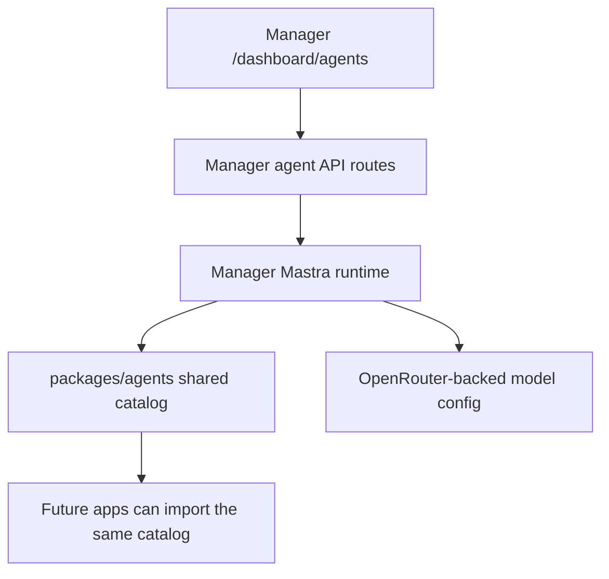

# feat: Manager Shared Mastra Agents

## Overview

Add first-class Mastra support to the Manager app through a curated shared-agent catalog. The first slice should ship a reusable package plus a Manager workbench for four starter agents:

- Translation Agent
- Video Enhancing Agent
- SEO Agent
- Marketing Agent

The shared catalog must be reusable by future apps without importing Manager UI code, while Manager becomes the first runtime surface that can browse and execute those agents.

## Planning Input

No dedicated brainstorm document exists for this exact slice. Planning proceeds directly from the user request plus the existing Manager automation baseline in [feat-084](/Users/o/.codex/worktrees/4df4/forge/docs/roadmap/media-generation/feat-084-manager-agents-automations.md).

Assumptions carried into implementation:

- curated starter agents are sufficient for V1; no free-form agent authoring UI yet
- Manager should keep the existing automation surface and add a shared-agent workbench above or alongside it
- shared reuse means agent definitions must live in `packages/`, not under `apps/manager`
- text output is enough for the first execution surface

## Local Research Summary

- [agents-page.tsx](/Users/o/.codex/worktrees/4df4/forge/apps/manager/src/features/agents/agents-page.tsx) already owns the `/dashboard/agents` UX and can be extended without adding a parallel dashboard route.
- [dashboard-nav.tsx](/Users/o/.codex/worktrees/4df4/forge/apps/manager/src/features/nav/dashboard-nav.tsx) already treats `Agents` as a first-class dashboard destination.
- [automation-contract.ts](/Users/o/.codex/worktrees/4df4/forge/apps/manager/src/features/agents/automation-contract.ts) shows that the current `Agents` area is automation-specific, so the shared-agent contract should live adjacent to it rather than overload it.
- [env.ts](/Users/o/.codex/worktrees/4df4/forge/apps/manager/src/config/env.ts) is the required entry point for any new runtime settings.
- [openrouter.ts](/Users/o/.codex/worktrees/4df4/forge/apps/manager/src/services/openrouter.ts) shows the current provider posture: OpenRouter-backed LLM access with strict validation and a default model.
- [packages/video-player/package.json](/Users/o/.codex/worktrees/4df4/forge/packages/video-player/package.json) gives the simplest precedent for a new shared package.

## External Research Summary

Using primary sources:

- Mastra documents the `Agent` class as the core primitive for typed agents, with `instructions`, `model`, optional `agents`, optional `tools`, and `generate()`/`stream()` execution methods ([Mastra Agent reference](https://mastra.ai/reference/agents/agent)).
- Mastra positions tools and MCP as optional agent capabilities rather than mandatory for every agent, which fits a first slice of curated prompt-backed specialist agents ([Mastra Using Tools docs](https://mastra.ai/docs/agents/using-tools)).
- `@mastra/core` is currently published on npm and described as the core runtime package for agents, workflows, tools, and telemetry ([npm package](https://www.npmjs.com/package/%40mastra/core)).

Inference: a first slice can safely use plain Mastra `Agent` instances without adding workflows, MCP servers, or memory until the shared catalog proves useful.

## Product Decisions

1. **Shared catalog first**
   Ship a code-defined shared catalog instead of a CMS-authored catalog. This keeps the scope bounded and makes reuse across apps straightforward.

2. **Manager as the first execution surface**
   Manager gets the browsing and execution UI now, but the catalog package must stay reusable for future apps.

3. **Curated agent metadata drives the UI**
   Each starter agent should declare its own label, summary, category, starter prompt, and form fields so the Manager workbench can stay generic.

4. **Text-first outputs**
   Return markdown/text output in V1. Avoid a large structured-output design unless a specific starter agent truly needs it.

5. **Provider configuration stays with Manager**
   The shared package should not read env vars directly. Manager owns provider/model wiring and passes the resolved model/runtime into the shared agent factory.

## Scope Boundaries

In scope:

- new shared package for agent definitions
- Mastra dependency and runtime integration
- Manager API routes for catalog + execution
- Manager UI for selecting and running starter agents
- focused tests for package and API behavior

Out of scope:

- free-form agent authoring
- persistent chat history or long-term memory
- cross-app UI integration outside Manager
- tool/MCP integrations for the starter agents
- CMS persistence for shared agent definitions or run logs

## Proposed Architecture

## Implementation Units

### Unit 1: Shared package

Goal: create a reusable `packages/agents` workspace package that exports starter agent definitions and a thin Mastra factory.

Files:

- `packages/agents/package.json`
- `packages/agents/tsconfig.json`
- `packages/agents/eslint.config.mjs`
- `packages/agents/src/index.ts`
- `packages/agents/src/catalog.ts`
- `packages/agents/src/definitions.ts`
- `packages/agents/src/catalog.test.ts`

Patterns to follow:

- [packages/video-player/package.json](/Users/o/.codex/worktrees/4df4/forge/packages/video-player/package.json)
- [packages/AGENTS.md](/Users/o/.codex/worktrees/4df4/forge/packages/AGENTS.md)

Verification:

- starter catalog exports compile cleanly
- tests prove the catalog contains the expected starter agents and field metadata

### Unit 2: Manager runtime + API

Goal: let authenticated Manager callers list and execute shared agents.

Files:

- `apps/manager/src/config/env.ts`
- `apps/manager/src/features/agents/shared-agent-contract.ts`
- `apps/manager/src/features/agents/shared-agent-runtime.ts`
- `apps/manager/src/app/api/agents/route.ts`
- `apps/manager/src/app/api/agents/route.test.ts`
- `apps/manager/src/app/api/agents/[id]/run/route.ts`
- `apps/manager/src/app/api/agents/[id]/run/route.test.ts`

Patterns to follow:

- [apps/manager/src/app/api/automations/route.ts](/Users/o/.codex/worktrees/4df4/forge/apps/manager/src/app/api/automations/route.ts)
- [apps/manager/src/lib/auth.ts](/Users/o/.codex/worktrees/4df4/forge/apps/manager/src/lib/auth.ts)
- [apps/manager/src/services/openrouter.ts](/Users/o/.codex/worktrees/4df4/forge/apps/manager/src/services/openrouter.ts)

Decisions:

- use one generic execution route shape with structured input validated by Zod
- keep runtime request execution stateless in V1
- reuse the existing Manager authentication model

Verification:

- route tests prove auth gating, validation, catalog listing, unknown-agent rejection, and successful execution result shaping

### Unit 3: Manager workbench UI

Goal: extend the existing `Agents` dashboard with a shared-agent library and execution form while keeping automations intact.

Files:

- `apps/manager/src/app/dashboard/agents/page.tsx`
- `apps/manager/src/features/agents/agents-page.tsx`
- `apps/manager/src/features/agents/shared-agent-workbench.tsx`
- `apps/manager/src/app/globals.css`

Patterns to follow:

- [agents-page.tsx](/Users/o/.codex/worktrees/4df4/forge/apps/manager/src/features/agents/agents-page.tsx)
- [automation-form.tsx](/Users/o/.codex/worktrees/4df4/forge/apps/manager/src/features/agents/automation-form.tsx)

Decisions:

- keep the current automations section below the new workbench
- use one generic renderer for agent-specific fields from the shared catalog metadata
- show starter prompt hints and last response in-page instead of introducing a chat transcript system

Verification:

- server page loads shared agent definitions and passes them into the client page
- manual smoke test in browser shows selecting each starter agent updates the form and allows execution

## Test Scenarios

1. Catalog contains exactly the expected starter IDs and stable display labels.
2. Translation agent input requires source content and target language.
3. SEO and Marketing agents can run without translation-only inputs.
4. Unauthorized API requests are rejected.
5. Unknown agent IDs return `404`.
6. Valid execution returns agent metadata plus generated text output.
7. Existing automation creation/pause/dry-run flows remain untouched.

## Verification

- `pnpm install`
- `pnpm --filter @forge/agents test`
- `pnpm --filter @forge/agents typecheck`
- `pnpm --filter @forge/agents lint`
- `pnpm --filter @forge/manager test`
- `pnpm --filter @forge/manager typecheck`
- `pnpm --filter @forge/manager lint`
- `git diff --check`
