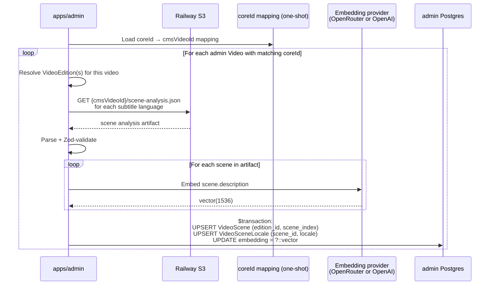

# feat: Port scene embeddings infrastructure to apps/admin (R1)

## Overview

Port scene-embedding storage, indexing, and backfill from `apps/cms`
(Strapi) to `apps/admin` (Forge Admin — Next.js + Prisma + pgvector +
useworkflow). This is the foundational migration step that unblocks
transcript embeddings (R2), hybrid search (R4), and recommendations (R5)
in admin.

Scene data is authored by `apps/manager`'s multimodal scene-analysis
pipeline and stored as `{assetId}/scene-analysis.json` in Railway S3.
Admin will read those artifacts, re-embed scene descriptions using its
own embedding service (same model as cms — `text-embedding-3-small`,
1536d), and persist into admin's Postgres with pgvector. No OpenRouter
calls during re-reading of previously-generated analysis; embeddings
are regenerated only because vectors are not cached in S3.

## Problem Frame

Admin today has per-locale embeddings on `ExperienceLocale` and a
semantic `ExperienceSearchService`, but no scene-level embeddings.
Search and recommendations rely on scene-level vectors — both are
blocked until admin has parity with cms's `scene_embeddings` table.

Admin and cms are separate Postgres databases with incompatible schemas
(integer SERIAL ids + field-level i18n in cms vs `cuid()` + per-locale
rows in admin). We cannot share tables. We can, however, re-read
manager's S3 scene-analysis artifacts — same source-of-truth the cms
indexer uses today — and produce identical scene metadata in admin's
schema shape. Scene embedding vectors are regenerated from description
text (cost is trivial at <$0.01 total for the full catalog).

## Requirements Trace

- **R1.1** — Admin gains a scene-embedding Prisma model (`VideoScene`) +
  per-locale row (`VideoSceneLocale`) with `embedding vector(1536)`,
  partial HNSW indexes per-locale, and an append-only migration file
  after `0002_auth`. (origin: R1)
- **R1.2** — Admin gains an indexer service that reads
  `scene-analysis.json` from manager's S3, transforms scene metadata
  into admin rows, re-embeds scene descriptions via admin's existing
  `generateExperienceEmbedding`-shaped helper, and persists vectors via
  raw SQL with `::vector` cast inside a Prisma `$transaction`. (origin: R1)
- **R1.3** — Admin gains a useworkflow durable backfill job that
  iterates all videos with scene-analysis artifacts and invokes the
  indexer with bounded concurrency and per-video error isolation.
  (origin: R1)
- **R1.4** — Admin exposes a `triggerSceneEmbeddingBackfill` GraphQL
  mutation (ADMIN-only via scope-auth + ABAC), mirroring the existing
  `triggerExperienceEmbedding` pattern. No vector columns exposed via
  GraphQL on any type.
- **R1.5** — Admin introduces a coreId→cms-video-id mapping file
  (generated one-shot from cms) so the indexer can translate admin
  `Video.coreId` to the integer assetId used as S3 key prefix.

## Scope Boundaries

- **Not** porting the cms REST endpoint `POST /api/scene-embeddings/sync`
  (that's R4/R5 when manager cuts over in R9).
- **Not** adding the scene embedding read path to GraphQL (recommendations
  consume it via service-level SQL, not via GraphQL `t.relation`).
- **Not** building the dashboard trigger UI on `/dashboard/embeddings` for
  scene backfill (dashboard polish is a follow-up; CLI / GraphQL
  mutation is sufficient for R1).
- **Not** supporting incremental / webhook-driven indexing from manager
  (new scenes flow through R9's manager cutover path).
- **Not** deleting cms's `scene_embeddings` table or any cms code — cms
  continues serving existing consumers until R8 consumer cutover.
- **Not** supporting cross-DB live reads against cms's Postgres — the
  only cross-DB touchpoint is the one-shot mapping dump (R1.5).
- **Not** changing scene boundaries (`startSeconds` / `endSeconds`) when
  multiple locales have slight drift — first-locale-wins; deferred as a
  quality concern.
- **Not** generating scene analysis for videos that don't have a
  `scene-analysis.json` artifact — admin is an indexer, not a pipeline
  runner for R1.

## Context & Research

### Relevant Code and Patterns

- `apps/cms/src/api/scene-embedding/services/indexer.ts` — existing
  cms indexer; authoritative reference for upsert semantics, batch
  size (30 rows per INSERT for PG param-limit safety), delete-then-insert
  pattern, and field shape.
- `apps/cms/src/bootstrap/ensure-pgvector.ts` — schema reference for
  `scene_embeddings` table columns and index definitions.
- `apps/manager/src/services/sceneAnalysis.ts` (writes
  `{assetId}/scene-analysis.json`) + `apps/manager/src/services/sceneEmbeddingSync.ts`
  (reads the same artifact, generates embeddings, posts to cms). Admin
  mirrors the second half without the POST to cms.
- `apps/manager/src/services/storage.ts` — `RAILWAY_S3_*` env + lazy
  `@aws-sdk/client-s3` + local `.tmp/artifacts/` fallback pattern.
- `apps/admin/src/services/embeddings.service.ts` — admin's
  `generateExperienceEmbedding` + Zod-validated embedding-response
  schema; the scene indexer should reuse the same provider-selection
  logic (OpenRouter OR OpenAI).
- `apps/admin/src/workflows/experienceEmbedding.ts` — admin's
  `"use workflow"` / `"use step"` reference shape to mirror.
- `apps/admin/src/db/pgvector.ts` — `toPgVector()`, `toPgArray()`
  helpers; reuse for scene embedding writes.
- `apps/admin/src/db/client.ts` — Prisma client singleton and the
  client-extension that strips embedding columns from read results
  unless caller opts in. Extend for `VideoSceneLocale.embedding`.
- `apps/admin/prisma/schema.prisma` — append-only migration convention
  per admin's CLAUDE.md. Never rewrite `0001_init`.
- `apps/admin/src/graphql/classification.test.ts` + `schema.test.ts` —
  classification assertions. New Pothos types need `@classification`
  tags; schema test must continue to assert no embedding / vector /
  similarity fields leak to GraphQL.

### Institutional Learnings

- **`docs/solutions/best-practices/pgvector-embedding-indexing-strapi-v5.md`** —
  dimension validation, batched multi-row INSERTs, safe PG array
  literals. Translate the patterns to Prisma `$executeRaw` instead of
  knex, keeping the `${pgVector}::vector` cast and `::text[]` array
  cast.
- **`docs/solutions/database-issues/set-local-requires-transaction-for-pgvector-search.md`** —
  `SET LOCAL` silently dropped outside `$transaction`. Not relevant for
  write path (no SET LOCAL on writes) but noted for the reader service
  if it ever performs a validation query with `hnsw.ef_search`.
- **`docs/solutions/performance-issues/pgvector-hnsw-index-bypass-with-where-filter-20260415.md`** —
  partial HNSW indexes per locale are required; a global HNSW on a
  table also filtered by locale gets bypassed by the planner. Mirror
  `ensure-pgvector.ts`'s `experience_embeddings_hnsw_{en,es,fr}` shape
  for `VideoSceneLocale` — create partial indexes per locale.
- **`docs/solutions/platform/backfill-worker-pattern-manager-20260407.md`** —
  claim-then-start TOCTOU pattern, output-table as progress tracker
  (no separate progress table), DISTINCT ON join constraints.
- **`docs/solutions/best-practices/vector-embedding-storage-scope-sequencing-2026-04-11.md`** —
  per-grain tables (not one generic `video_embeddings`); embeddings
  attach to the locale row, not the canonical entity. Validates the
  `VideoScene` + `VideoSceneLocale` split.
- **`docs/solutions/cms/admin-app-data-model-decisions.md`** — admin's
  modeling principles: embeddings attach to `*Locale` rows;
  language-aware semantics live on the locale.
- **`docs/solutions/platform/optional-railway-s3-local-fallback.md`** —
  `useS3 = Boolean(env.RAILWAY_S3_BUCKET)` + lazy import convention.

### External References

- None required. Local patterns are comprehensive; no external research
  pass was run.

## Key Technical Decisions

- **Scene attachment: `VideoEdition`.** Scene timecodes (`startSeconds`,
  `endSeconds`) follow the edition's cut, matching how
  `VideoSubtitle` already attaches to `VideoEdition` in admin.
  Per-locale scene descriptions attach to a separate `VideoSceneLocale`
  row, matching the `ExperienceLocale.embedding` pattern.
  _Why:_ Consistent with admin's data-model principles, avoids
  conflating language-agnostic frames with language-specific text.

- **Vector regenerated, not copied.** Admin re-embeds scene description
  text in admin using admin's OpenRouter/OpenAI key. Vectors are not
  cached in manager's S3, and cross-DB `pg_dump`-style vector copy
  from cms would require a separate column mapping and live coupling.
  Cost is trivial (~$0.005 for the entire catalog at current scale).
  _Why:_ Cleanest, no cross-DB coupling, same model guarantees
  semantically equivalent output.

- **Source text: manager's `scene-analysis.json`.** Scene metadata
  (description, themes, bible verses, demographics, spiritual context,
  chapter title, scene index, start/end seconds) comes from manager's
  S3 artifact. Admin does NOT re-run the multimodal pipeline.
  _Why:_ manager remains the authoritative producer of scene analysis;
  admin is strictly a consumer/indexer for R1.

- **Per-locale partial HNSW indexes.** Create
  `video_scene_locale_hnsw_{en,es,fr}` partial indexes keyed on locale,
  NOT a single global HNSW index. The planner silently bypasses global
  HNSW when a `WHERE locale = ?` predicate is present.
  _Why:_ Well-documented in the `pgvector-hnsw-index-bypass-with-where-filter`
  learning; admin already uses this pattern for `experience_embeddings`.

- **Backfill reads a one-shot coreId→cmsVideoId mapping file.** cms
  emits a JSON file (`scripts/dump-core-id-mapping.ts` on cms side)
  containing `[{ coreId, cmsVideoId }]`. Admin's backfill reads this
  file to translate its `Video.coreId` into the integer `assetId` used
  as S3 key prefix.
  _Why:_ Avoids live cross-DB coupling; a snapshot is sufficient for
  backfill. Post-cutover (R9), manager writes with admin's Video.id
  directly and the mapping file becomes obsolete.

- **useworkflow for backfill, not a plain script.** Admin's convention
  for long-running multi-step jobs is `"use workflow"` / `"use step"`.
  The backfill gets durability, retry semantics, and observability
  within admin's Unit 11 workflow runtime.
  _Why:_ Matches admin's existing `runExperienceEmbedding` and
  `coreSyncOrchestrator` patterns. Plain scripts in admin are reserved
  for truly one-shot operations; backfill is long-running.

- **Indexer is idempotent (upsert).** Re-running the indexer for a
  given `(editionId, locale)` overwrites existing rows without
  duplication, matching cms's delete-then-insert semantics but as
  upserts on `(scene_id, locale)` and `(edition_id, scene_index)`.
  _Why:_ Resumability without a separate progress table. `SELECT
DISTINCT edition_id FROM video_scene` already answers "what's done".

- **No GraphQL exposure of vectors.** `embedding` column excluded from
  Pothos type fields; admin's `schema.test.ts` assertion
  (`no embed|vector|similarit`) continues to pass. Read access to
  scene data goes through services (recommender, search), not direct
  GraphQL `t.relation`.
  _Why:_ Matches admin's existing security posture for
  `ExperienceLocale.embedding`; prevents accidental exfiltration.

- **Manager S3 access uses admin's existing `RAILWAY_S3_*` env.** Same
  bucket as cms + manager (single Railway S3 service). No new env vars
  required for S3 access.
  _Why:_ Single-bucket deployment matches current repo convention; the
  `{assetId}/{artifact-type}.{ext}` key format is already standard
  across apps/cms + apps/manager.

## Open Questions

### Resolved During Planning

- **Scene attachment point** (Video vs VideoLocale vs VideoEdition):
  → `VideoEdition`, consistent with `VideoSubtitle`'s attachment.
  Per-locale descriptions go on a separate `VideoSceneLocale` row.
- **Locale handling in schema** (language column vs per-locale row):
  → per-locale row pattern (`VideoSceneLocale` with `locale`
  string field), matching admin's `ExperienceLocale` convention.
- **S3 artifact format and name**: → `{cms_video_id}/scene-analysis.json`
  containing `SceneAnalysisResult = { scenes: Array<{ sceneIndex,
startSeconds, endSeconds, chapterTitle, description, themes[],
bibleVerses[], demographics[], spiritualContext[] }> }`. Confirmed
  by reading `apps/manager/src/services/sceneAnalysis.ts:428` and
  `sceneEmbeddingSync.ts:136`.
- **Are embedding vectors cached in S3?**: → No. Manager generates
  them on-the-fly and pushes to cms. Admin must regenerate during
  backfill.
- **Cost of regenerating embeddings**: → ~$0.005 for full catalog
  (~1000 videos × ~10 scenes × ~150 tokens × `text-embedding-3-small`
  @ $0.00002/1K). Essentially free.
- **Which admin model carries mux/playback identifiers**:
  → `VideoEdition.playbackId` already exists (confirmed). If
  `muxAssetId` is needed on the scene row, it's redundant with
  `VideoEdition` and can be denormalized onto `VideoScene` or
  omitted. Decision: omit from `VideoScene`; fetch via
  `VideoEdition` join when recommendations render.

### Deferred to Implementation

- **[R1.1][Technical]** Exact `VideoEdition` foreign-key column — admin
  schema review during implementation confirms whether `editionId` is
  `String @db.Uuid` or `String` (cuid). Follow the type of existing
  FKs on `VideoDub.editionId` or `VideoSubtitle.editionId`.
- **[R1.1][Technical]** Should `VideoScene` carry denormalized
  `videoId` for convenience joins, or rely on `VideoEdition.videoId`
  traversal? Implementer decides after checking the most-frequent
  query shapes in R4/R5 planning.
- **[R1.2][Technical]** Batch-insert strategy in Prisma: either
  `$executeRaw` with a generated multi-row VALUES clause (matches
  cms's 30-row batch pattern) or `prisma.videoSceneLocale.createMany`
  followed by a raw `UPDATE ... SET embedding = ... WHERE` pass for
  vectors. Prefer the first for atomicity; measure if it's hard.
- **[R1.3][Technical]** useworkflow step granularity — one step per
  video vs one step per video×locale. One per video simpler for
  resumability; one per video×locale gives finer error isolation.
  Defer to implementation based on observed failure modes.
- **[R1.5][Needs research]** Best location for the coreId mapping file
  — cms runtime-generated via a script into S3, or committed as a
  static dump file during R1? Static committed file simpler; S3 path
  cleaner for periodic refresh during migration. Implementer picks
  once the first backfill dry-run surfaces the ergonomics.
- **[R1.2][Technical]** Whether the indexer should refuse to write
  when the source artifact's embedding dimensions differ from admin's
  `EXPERIENCE_EMBEDDING_DIMENSIONS` constant (1536). Currently admin's
  embedding service already validates; decide if the indexer adds a
  second guard or trusts the service layer.
- **[R1.3][Needs research]** useworkflow concurrency behavior under
  `pLimit(N)` — does the framework's retry/checkpoint model play
  cleanly with in-step concurrency, or does it expect step-level
  parallelism? Verify during implementation by running a small dry
  batch; fall back to sequential per-video steps if unclear.

## High-Level Technical Design

> _This illustrates the intended approach and is directional guidance
> for review, not implementation specification. The implementing agent
> should treat it as context, not code to reproduce._

### Data flow



### Prisma model shape (directional)

```
model VideoScene {
  id            String   // cuid
  editionId     String   // FK to VideoEdition
  sceneIndex    Int
  startSeconds  Float
  endSeconds    Float?
  chapterTitle  String?
  createdAt     DateTime
  updatedAt     DateTime

  edition       VideoEdition
  locales       VideoSceneLocale[]

  @@unique([editionId, sceneIndex])
  @@map("video_scene")
}

model VideoSceneLocale {
  id                 String
  sceneId            String   // FK to VideoScene
  locale             String   // BCP-47
  description        String
  themes             String[]
  bibleVerses        String[]
  demographics       String[]
  spiritualContext   String[]
  sourceText         String   // what was embedded
  embedding          Unsupported("vector(1536)")?  // NULL until indexed
  model              String   @default("text-embedding-3-small")
  dimensions         Int      @default(1536)
  createdAt          DateTime
  updatedAt          DateTime

  scene              VideoScene

  @@unique([sceneId, locale])
  @@map("video_scene_locale")
}
```

Partial HNSW indexes added in raw migration SQL:

```
CREATE INDEX video_scene_locale_hnsw_en ON video_scene_locale
  USING hnsw (embedding vector_cosine_ops)
  WHERE embedding IS NOT NULL AND locale = 'en';
-- repeat for es, fr
```

## Implementation Units

- [ ] **Unit 1: Prisma schema — VideoScene + VideoSceneLocale + migration**

**Goal:** Establish admin's scene storage model with per-locale
embedding attachment, partial HNSW indexes per locale, and a new
append-only migration file.

**Requirements:** R1.1

**Dependencies:** none

**Files:**

- Modify: `apps/admin/prisma/schema.prisma`
- Create: `apps/admin/prisma/migrations/0003_scene_embeddings/migration.sql`
- Modify: `apps/admin/src/graphql/classification.test.ts` (register new
  types as abac-gated / public-shape — scene data itself is
  public-shape but embedding-column enforcement stays)
- Modify: `apps/admin/src/graphql/schema.test.ts` (extend the
  "no embed/vector/similarit field exposed" assertion to cover new
  models)
- Test: `apps/admin/prisma/schema.test.ts` (confirm models compile;
  existing test file if present, otherwise colocate a small sanity
  test next to the migration)

**Approach:**

- Add `VideoScene` and `VideoSceneLocale` to `schema.prisma`.
- FK: `VideoScene.editionId → VideoEdition.id ON DELETE CASCADE`.
- FK: `VideoSceneLocale.sceneId → VideoScene.id ON DELETE CASCADE`.
- Unique: `(editionId, sceneIndex)` on `VideoScene`, `(sceneId, locale)`
  on `VideoSceneLocale`.
- Embedding column: `Unsupported("vector(1536)")?` nullable, matching
  `ExperienceLocale.embedding` convention.
- Migration SQL: create tables, create partial HNSW indexes per locale
  (en, es, fr), create b-tree on `(edition_id, scene_index)` and
  `(scene_id, locale)`, and on `locale` for filter-only queries.
- DO NOT rewrite `0001_init` or `0002_auth`. Append as `0003`.

**Patterns to follow:**

- `apps/admin/prisma/schema.prisma` — `ExperienceLocale` and
  `VideoSubtitle` models for style.
- `apps/admin/prisma/migrations/0001_init/migration.sql` — raw SQL
  index creation pattern + `@map` snake_casing.
- `docs/solutions/performance-issues/pgvector-hnsw-index-bypass-with-where-filter-20260415.md`
  — partial HNSW pattern.

**Test scenarios:**

- `schema.test.ts` continues to pass with the new types registered.
- `classification.test.ts` ensures VideoScene and VideoSceneLocale
  have `@classification` JSDoc tags.
- Embedding column is excluded from GraphQL field lists.

**Verification:**

- `pnpm --filter @forge/admin db:generate` succeeds.
- `pnpm --filter @forge/admin db:migrate:dev` applies 0003 cleanly
  against a fresh Postgres.
- `\d video_scene_locale` shows partial HNSW indexes for `en`, `es`,
  `fr`.
- `pnpm --filter @forge/admin typecheck` green.

- [ ] **Unit 2: Manager S3 artifact reader service**

**Goal:** Provide a service admin uses to read
`{assetId}/scene-analysis.json` from manager's S3 bucket (or local
`.tmp/artifacts/` fallback) with Zod validation.

**Requirements:** R1.2

**Dependencies:** Unit 1 (for downstream typing alignment only; this
unit can ship independently).

**Files:**

- Create: `apps/admin/src/services/manager-artifacts.service.ts`
- Create: `apps/admin/src/services/manager-artifacts.service.test.ts`
- Modify: `apps/admin/src/config/env.ts` (no new vars expected; reuse
  `RAILWAY_S3_*`. Confirm they're already declared.)

**Approach:**

- Export `readSceneAnalysisArtifact(assetId: string): Promise<SceneAnalysisResult>`.
- Use existing storage adapter (admin's Unit 11 storage service in
  `src/storage/`) or lazily construct an S3 client mirroring
  `apps/manager/src/services/storage.ts`.
- `useS3 = Boolean(env.RAILWAY_S3_BUCKET)`; local fallback reads
  `.tmp/artifacts/{assetId}/scene-analysis.json`.
- Parse with a shared `SceneAnalysisResultSchema` Zod definition
  (mirror `apps/manager/src/services/sceneAnalysis.ts`'s
  `normalizeSceneAnalysis` rules).
- Return a typed result; throw a typed error if artifact missing or
  malformed.

**Patterns to follow:**

- `apps/manager/src/services/storage.ts` — S3 + local hybrid.
- `apps/admin/src/services/embeddings.service.ts` — Zod response
  validation + typed-error shape.

**Test scenarios:**

- Returns parsed result for valid JSON in local fallback.
- Throws typed error when artifact missing.
- Throws typed error on malformed JSON (missing `scenes` array,
  invalid field types).
- Handles an empty `scenes` array without crashing (returns `{ scenes: [] }`).

**Verification:**

- Unit tests pass.
- `pnpm --filter @forge/admin typecheck` green.

- [ ] **Unit 3: coreId → cmsVideoId mapping prerequisite**

**Goal:** Generate a one-shot mapping file from cms's video table so
admin's backfill can translate `Video.coreId` → integer assetId used
as S3 key prefix.

**Requirements:** R1.5

**Dependencies:** none

**Files:**

- Create: `apps/cms/src/scripts/dump-core-id-mapping.ts` (cms side;
  emits `core-id-mapping.json` to stdout or a known file path)
- Modify: `apps/cms/package.json` (`scripts.dump:core-id-mapping`)
- Create: `apps/admin/src/services/core-id-mapping.service.ts`
- Create: `apps/admin/src/services/core-id-mapping.service.test.ts`

**Approach:**

- cms script: `SELECT core_id, id FROM videos WHERE core_id IS NOT NULL
ORDER BY core_id` → JSON dump `[{ coreId, cmsVideoId }]`.
- Operator runs `pnpm --filter @forge/cms dump:core-id-mapping >
.tmp/core-id-mapping.json` locally before running the admin backfill.
- Admin service: `loadCoreIdMapping(pathOrUrl): Promise<Map<string, number>>`.
- Accept local file path via env (`CORE_ID_MAPPING_FILE`) OR an S3 key
  (if operator uploads the dump). Prefer env-controlled local path for
  R1.

**Patterns to follow:**

- `apps/cms/src/scripts/` — existing one-shot script patterns (e.g.,
  `backfill-experience-embeddings.ts`).

**Test scenarios:**

- Admin loader returns a populated Map given a valid JSON file.
- Admin loader throws typed error when file missing or malformed.
- Handles empty mapping file (returns empty Map; backfill should
  gracefully no-op with a warning).
- cms dump script produces stable row order (sorted by coreId) — test
  against a seeded disposable DB if practical.

**Verification:**

- Unit tests pass.
- End-to-end smoke: run cms dump against seeded DB, admin loader parses
  the resulting file and exposes at least one `(coreId, cmsVideoId)`
  pair.

- [ ] **Unit 4: Scene indexer service**

**Goal:** Implement the indexer that, given an admin Video (with
coreId), reads the scene-analysis artifact, re-embeds scene
descriptions, and persists both `VideoScene` and `VideoSceneLocale`
rows into admin's Postgres with vector writes.

**Execution note:** Characterization-first. Before writing the new
indexer, run cms's indexer against a sample fixture (scene-analysis
artifact for one video) and capture the resulting `scene_embeddings`
rows. Use those rows as the expected shape for admin's indexer output
(allowing for the admin schema's per-locale split).

**Requirements:** R1.2

**Dependencies:** Unit 1, Unit 2, Unit 3

**Files:**

- Create: `apps/admin/src/services/scene-embedding.service.ts`
- Create: `apps/admin/src/services/scene-embedding.service.test.ts`
- Modify: `apps/admin/src/db/client.ts` (extend the embedding-strip
  client extension to cover `videoSceneLocale.embedding` alongside
  `experienceLocale.embedding`)

**Approach:**

- Export:
  - `indexEditionScenes({ editionId, coreId, locale }): Promise<IndexResult>`
    — high-level entry that (a) uses the coreId mapping to derive
    assetId, (b) calls the artifact reader, (c) upserts VideoScene +
    VideoSceneLocale, (d) embeds description, (e) writes vector.
  - `deleteSceneLocale(sceneId, locale)` — cleanup helper for reruns
    (optional; upsert covers idempotency).
- ABAC: `canWriteDerived(user)` check at entry; workflow invokes as
  `SYSTEM`.
- Transaction boundary: one Prisma `$transaction` per edition×locale,
  wrapping scene upserts + locale upserts + embedding writes.
- Embedding generation: delegate to a new helper in
  `embeddings.service.ts` that accepts raw text (not experience-locale
  shape); alternatively extract `generateRawEmbedding(text)` from the
  existing experience path.
- Write vector: `prisma.$executeRaw\`UPDATE video_scene_locale SET
  embedding = ${toPgVector(vec)}::vector WHERE id = ${localeRowId}\``.
- Batch: one OpenRouter call per scene's description is fine (~10
  scenes per video). If needed, batch scenes per call later.
- Log structured progress: `event=scene_index_start`, `event=scene_index_complete`,
  counts + duration.

**Patterns to follow:**

- `apps/admin/src/services/embeddings.service.ts:writeExperienceLocaleEmbedding`
  — `::vector` cast pattern.
- `apps/cms/src/api/scene-embedding/services/indexer.ts` — field
  transforms, delete-then-insert semantics, duplicate-sceneIndex
  detection.
- `apps/admin/src/services/experience.service.ts` (if present) —
  service-layer ABAC pattern.

**Test scenarios:**

- Given a valid artifact with 3 scenes and `locale=en`, writes 3
  VideoScene rows and 3 VideoSceneLocale rows with non-null embeddings.
- Re-running for the same (edition, locale) overwrites descriptions
  and embeddings without duplicating rows.
- Re-running with a different locale adds VideoSceneLocale rows
  without touching existing VideoScene rows.
- Handles an empty `scenes` array: no rows written, returns
  `{ scenesIndexed: 0 }`.
- Throws typed error when coreId not found in mapping.
- Throws typed error when artifact missing.
- ABAC: `canWriteDerived(null)` (public principal) throws; `SYSTEM`
  passes.
- Prisma client extension: default reads of VideoSceneLocale do NOT
  include `embedding`; explicit opt-in does.

**Verification:**

- Unit tests pass against a disposable Postgres with pgvector.
- `SELECT COUNT(*) FROM video_scene_locale WHERE embedding IS NOT NULL`
  grows by the expected count after indexing.
- Rerunning the indexer for the same inputs keeps row count stable.
- `pnpm --filter @forge/admin typecheck` / `lint` / `test` green.

- [ ] **Unit 5: Backfill workflow**

**Goal:** Implement a useworkflow durable job that iterates all videos
with coreIds in the mapping, invokes the indexer per edition × locale,
reports progress, and tolerates per-video failures.

**Execution note:** Test-first for the loop and error-isolation logic
(mock the indexer to inject failures; assert the workflow continues
and logs each failure).

**Requirements:** R1.3

**Dependencies:** Unit 4

**Files:**

- Create: `apps/admin/src/workflows/sceneEmbeddingBackfill.ts`
- Create: `apps/admin/src/workflows/sceneEmbeddingBackfill.test.ts`

**Approach:**

- Workflow entry `runSceneEmbeddingBackfill(input: {
coreIds?: string[], locales?: string[] })` with defaults
  (all videos, `["en", "es", "fr"]`).
- Steps:
  - `stepLoadMapping()` — load coreId → cmsVideoId mapping once.
  - `stepEnumerateTargets()` — list admin VideoEditions whose
    `video.coreId` is in the mapping and input filter.
  - `stepIndexEditionLocale({ editionId, coreId, locale })` — call
    the indexer; catch per-target errors and record outcome.
  - `stepReport({ results })` — aggregate success/failure counts,
    log summary.
- Bounded concurrency: either a single sequential loop per edition
  (safest for useworkflow's retry semantics — see deferred question)
  OR a `pLimit(5)` fan-out within one step.
- Idempotency: indexer itself is idempotent (Unit 4), so re-running
  the workflow is safe.
- Structured logs: JSON lines with `workflow=scene-embedding-backfill`,
  per-edition success/failure, embedding tokens, duration.
- No DB-backed lock; the workflow owner (GraphQL trigger) can rely on
  useworkflow's single-flight semantics or a simple `sync_locks` row
  if collisions become a real concern post-launch.

**Patterns to follow:**

- `apps/admin/src/workflows/experienceEmbedding.ts` — `"use workflow"`
  / `"use step"` shape, `SYSTEM_PRINCIPAL` convention.
- `apps/admin/src/services/core-sync/orchestrator.ts` — multi-phase
  orchestration pattern + per-phase error isolation + watermark
  semantics (lighter-weight here but conceptually similar).
- `docs/solutions/platform/backfill-worker-pattern-manager-20260407.md`
  — claim-then-start, output table as progress source of truth.

**Test scenarios:**

- Given 3 editions × 2 locales = 6 targets, workflow invokes indexer
  6 times and reports `{ succeeded: 6, failed: 0 }`.
- When 2 targets fail and 4 succeed, workflow reports
  `{ succeeded: 4, failed: 2 }` and the failed entries are logged
  with their error messages.
- Workflow is resumable: after indexing 3 of 6 targets, running again
  from scratch is equivalent (idempotent); each target upserts.
- Input filter honored: `coreIds: ["core-123"]` restricts to one
  video's editions; `locales: ["en"]` indexes only English.
- Empty targets: returns success with `{ succeeded: 0, failed: 0 }`,
  no errors.

**Verification:**

- Unit tests pass.
- Dry-run against a seeded admin DB with a small fixture (one edition,
  one locale) writes the expected rows.
- `SELECT DISTINCT edition_id FROM video_scene` matches expected
  edition set after a full run.

- [ ] **Unit 6: GraphQL mutation + Pothos type scaffolding**

**Goal:** Expose `triggerSceneEmbeddingBackfill` mutation for operators
to kick off the workflow; add minimal Pothos types for `VideoScene` /
`VideoSceneLocale` so read paths in R4/R5 can attach without a second
migration. Do NOT expose embedding columns.

**Requirements:** R1.4

**Dependencies:** Unit 5

**Files:**

- Create: `apps/admin/src/graphql/types/videoScene.ts`
- Modify: `apps/admin/src/graphql/schema.ts` (side-effect import of
  new type module)
- Create: `apps/admin/src/graphql/mutations/scene-embedding.ts`
- Create: `apps/admin/src/graphql/mutations/scene-embedding.test.ts`
- Modify: `apps/admin/src/auth/permissions.ts` (add
  `write:scene-embeddings` permission key to the matrix)

**Approach:**

- Add a new permission key `write:scene-embeddings` scoped to ADMIN
  (and SYSTEM for internal workflow calls) in `permissions.ts`.
- Pothos mutation `triggerSceneEmbeddingBackfill(input: { coreIds:
[String!], locales: [String!] })`:
  - `authScopes: { hasPermission: 'write:scene-embeddings' }`
  - Enqueues the workflow via useworkflow's runner
  - Returns a job/run ID if useworkflow exposes one, otherwise an
    acknowledgment
- Pothos types for VideoScene / VideoSceneLocale with
  `@classification public-shape` (scene metadata is public-shape —
  already exposed via cms's REST search today) but explicitly OMIT
  `embedding` from the field list. Add both types to
  `schema.test.ts`'s classification registry.

**Patterns to follow:**

- `apps/admin/src/graphql/mutations/experience.ts` —
  `triggerExperienceEmbedding` mutation shape.
- `apps/admin/src/graphql/types/experience.ts` — Pothos type +
  classification tag + field exclusion for `embedding`.
- `apps/admin/CLAUDE.md` "Adding a new Pothos type" checklist —
  side-effect import in `schema.ts`, reference.ts import ordering.

**Test scenarios:**

- Unauthenticated request is rejected at scope-auth before the
  workflow is enqueued.
- VIEWER/EDITOR principals are rejected; ADMIN succeeds.
- Mutation returns the input echo + run identifier.
- Schema test asserts no `embedding|vector|similarit` field appears
  on `VideoScene` / `VideoSceneLocale`.
- Classification test asserts the new types have `@classification`
  JSDoc tags and are listed in the registry.

**Verification:**

- `pnpm --filter @forge/admin typecheck` / `test` / `lint` green.
- `introspection` query returns VideoScene / VideoSceneLocale without
  an `embedding` field.

- [ ] **Unit 7: End-to-end smoke + README**

**Goal:** Confirm the full chain (mapping file → artifact reader →
indexer → workflow → persisted rows) works against a disposable
admin Postgres + a small artifact fixture.

**Requirements:** R1.1–R1.5 (integration-level verification)

**Dependencies:** Units 1–6

**Files:**

- Create: `apps/admin/src/services/scene-embedding.e2e.test.ts` OR
  a small Node script under `apps/admin/src/scripts/` for ad-hoc
  smoke runs (implementer's choice; prefer a test if useworkflow
  stubs are reasonable to set up)
- Modify: `apps/admin/CLAUDE.md` — add a `Scene embeddings` section
  documenting: artifact source, re-embed model, mapping file location,
  GraphQL mutation name, expected behavior on re-runs
- Modify: `apps/admin/docs/add-a-new-entity.md` (if relevant) to note
  the scene pattern as a derived-data example
- Create: `docs/solutions/platform/admin-scene-embeddings-indexer-pattern.md`
  capturing the coreId mapping trick and the "S3 scene-analysis +
  admin re-embed" split, for future reference

**Approach:**

- Seed a disposable Postgres with: one Video (+ coreId), one
  VideoEdition, one locale.
- Place a minimal `scene-analysis.json` fixture under
  `.tmp/artifacts/{cmsVideoId}/scene-analysis.json`.
- Run the workflow with scoped input (one coreId, `["en"]`).
- Assert: VideoScene rows created, VideoSceneLocale rows created,
  `embedding IS NOT NULL`, re-run is idempotent.
- Capture the learnings doc before closing the ticket.

**Patterns to follow:**

- `apps/admin/src/services/embeddings.service.test.ts` — local embed
  test style.
- `docs/solutions/` — durable-learning doc conventions.

**Test scenarios:**

- Fresh run against empty DB writes expected row counts.
- Re-run writes same row counts (idempotent).
- Fixture with 0 scenes results in no rows + no errors.
- Fixture with bad JSON surfaces a typed error without half-writing.

**Verification:**

- Smoke test green.
- `apps/admin/CLAUDE.md` Scene embeddings section present and
  mentions mapping-file path + GraphQL mutation.
- Learnings doc exists in `docs/solutions/platform/`.

## System-Wide Impact

- **Interaction graph:** Admin's useworkflow runtime gets a new
  long-running job. Verify the workflow HMAC endpoint's permission
  gating still holds (`WORKFLOW_HMAC_SECRET` env).
  `apps/admin/src/graphql/schema.ts` gains new types — confirm the
  side-effect import order (reference.ts first).
- **Error propagation:** The indexer throws typed errors; the workflow
  catches per-target errors and continues. The GraphQL mutation
  surfaces enqueue errors but not execution errors (workflow is
  durable / async). Consumers should poll for completion or receive
  an event, which is deferred to a follow-up UI improvement.
- **State lifecycle risks:**
  - Partial-write: a scene write fails mid-edition. Mitigation:
    per-edition-locale `$transaction` so either all scenes land for
    one locale or none.
  - Re-run race: two concurrent backfill jobs against the same
    edition. Mitigation for R1: rely on row-level UPSERT semantics;
    if real-world contention is observed, add a `sync_locks`
    coordination row in a follow-up.
  - Mapping drift: if cms's video id changes after the mapping is
    dumped (rare; Strapi SERIAL ids don't change), the assetId lookup
    becomes stale. Mitigation: refresh the mapping before each
    backfill run; document in CLAUDE.md.
- **API surface parity:** GraphQL schema: admin now exposes
  `triggerSceneEmbeddingBackfill`. No REST endpoint for R1 (REST
  `/api/search` lands in R4; `/api/scene-embeddings/recommendations`
  in R5).
- **Integration coverage:** Smoke (Unit 7) covers the end-to-end
  chain. Unit tests cover individual services. No scheduled / cron
  trigger yet — operator invokes via GraphQL mutation.

## Risks & Dependencies

- **Manager's scene-analysis artifact format stability.** If manager
  changes the schema (e.g., adds required fields), admin's reader
  service must tolerate it gracefully. Mitigate by Zod-parsing with
  `safeParse` and logging unknown fields.
- **coreId coverage.** Some admin Videos may lack `coreId` (if any
  were authored directly in admin). Backfill skips them silently
  and logs the count. Document this behavior.
- **useworkflow runtime availability in admin.** Unit 11 scaffold is
  operational per admin's CLAUDE.md, but "`"use workflow"` / `"use
step"` directives are inert without the workflow SDK's build plugin
  configured in `next.config.ts`." Verify the plugin is wired before
  shipping Unit 5; otherwise the backfill runs as a plain async fn
  (acceptable for first run, not production-safe).
- **Concurrency with tatai's in-flight work** (feat-100 video
  editorial, feat-103 experience editor refinement). Risk: schema
  collision during merge. Mitigate: R1 adds tables only (no
  modifications to existing tables), so merge conflicts should be
  limited to `schema.prisma` diff ordering.
- **Cross-DB mapping staleness.** If R1 ships with a static committed
  mapping file, it drifts as new videos are added to cms. Mitigate:
  document the re-dump workflow and consider auto-refresh in a
  follow-up after R4 lands.
- **No cost guardrail yet.** At <$0.01 total the ROI of a guardrail
  is low, but re-running in a loop (bug) could accumulate. Add a
  dry-run mode logging estimated tokens + cost before any DB write
  (deferred note; add if real-world use surfaces it).

## Documentation / Operational Notes

- Update `apps/admin/CLAUDE.md` with a "Scene embeddings" section:
  artifact source, re-embed model, mapping file location, GraphQL
  mutation name, idempotency behavior.
- Add a learnings doc at
  `docs/solutions/platform/admin-scene-embeddings-indexer-pattern.md`
  capturing the coreId mapping trick and the S3-reuse + re-embed
  split.
- Operational runbook: before invoking backfill, (1) refresh the
  coreId mapping via `pnpm --filter @forge/cms dump:core-id-mapping
  > .tmp/core-id-mapping.json`, (2) ensure `OPENROUTER_API_KEY`or`OPENAI_API_KEY`is set on the`forge-admin` Railway service.
- Update `docs/roadmap/content-discovery/feat-041-scene-embeddings-table.md`
  status: add a pointer to this plan's migration and note the
  cms-equivalent rows stay live until R8.

## Sources & References

- **Origin document:**
  [docs/brainstorms/2026-04-19-admin-migration-playbook-requirements.md](../brainstorms/2026-04-19-admin-migration-playbook-requirements.md)
- **Referenced roadmap tickets:** feat-009, feat-037, feat-038,
  feat-040, feat-041, feat-042, feat-095.
- **Referenced admin plans:**
  `docs/plans/2026-04-13-002-feat-admin-app-graphql-postgres-plan.md`
  (Unit 8 — pgvector experience search; Unit 10 — Core sync; Unit 11
  — useworkflow + storage).
- **Related institutional learnings:**
  - `docs/solutions/best-practices/pgvector-embedding-indexing-strapi-v5.md`
  - `docs/solutions/database-issues/set-local-requires-transaction-for-pgvector-search.md`
  - `docs/solutions/performance-issues/pgvector-hnsw-index-bypass-with-where-filter-20260415.md`
  - `docs/solutions/platform/backfill-worker-pattern-manager-20260407.md`
  - `docs/solutions/platform/multimodal-scene-analysis-pipeline.md`
  - `docs/solutions/best-practices/vector-embedding-storage-scope-sequencing-2026-04-11.md`
  - `docs/solutions/cms/admin-app-data-model-decisions.md`
  - `docs/solutions/platform/optional-railway-s3-local-fallback.md`
- **Code references (to read during implementation):**
  - `apps/cms/src/api/scene-embedding/services/indexer.ts`
  - `apps/cms/src/bootstrap/ensure-pgvector.ts`
  - `apps/manager/src/services/sceneAnalysis.ts`
  - `apps/manager/src/services/sceneEmbeddingSync.ts`
  - `apps/manager/src/services/storage.ts`
  - `apps/admin/src/services/embeddings.service.ts`
  - `apps/admin/src/workflows/experienceEmbedding.ts`
  - `apps/admin/src/db/pgvector.ts`
  - `apps/admin/src/graphql/mutations/experience.ts`
