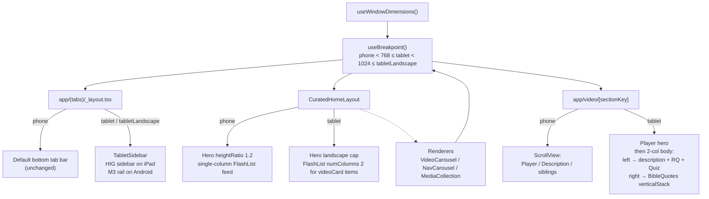

# feat: Tablet (iPad + Android Tablet) experience layout

## Overview

Add a tablet-adaptive layout to `apps/mobile` so that on iPad and large Android tablets the app renders with a persistent vertical sidebar (replacing the bottom tab bar), multi-column content rails, a reduced-height cinematic hero, and a 2-column Video Detail layout beneath the player. Phones keep the current layout unchanged. No new CMS content types. Same SDUI pipeline — renderers become breakpoint-aware rather than forking.

The scope follows the origin document's Stitch project exactly: Home + Video Detail × iPad (HIG) + Android tablet (M3). Library / Discover / Profile redesigns are deferred (see origin).

## Problem Frame

The app is portrait-locked and phone-shaped. On iPad it runs at 2× scale, cards balloon to ~600–720 pt wide, the bottom tab bar floats across a canvas that wants a sidebar, and the Video Detail screen wastes the right ~50% of landscape viewport on whitespace. Both Apple HIG (iPadOS) and Material 3 (large screens) explicitly recommend against bottom tabs at tablet widths and call for multi-column content layouts. (See origin: `docs/brainstorms/2026-04-20-tablet-experience-redesign-requirements.md`.)

## Requirements Trace

- **R1.** Persistent vertical nav on tablet — sidebar (iPad) / navigation rail (Android). (Origin R1, R6)
- **R2.** Full-bleed hero across the content pane (right of the sidebar), shorter than the phone `screenWidth * 1.2` formula. (Origin R2)
- **R3.** Multi-column rails + grids at tablet widths: NavigationCarousel 4–5 visible, VideoCard grid 2-col, VideoCarousel 3–4 visible, MediaCollection 2–3 visible. (Origin R3)
- **R4.** Video Detail: player hero on top, then a 2-column body — left (~60%) description + CTAs, right (~40%) Bible Quotes vertical stack. (Origin R4)
- **R5.** Platform chrome: HIG on iPad (SF Symbols, SF Pro, HIG sidebar chrome), Material 3 on Android (rounded Material Symbols, Roboto, M3 rail chrome). (Origin R5)
- **R6.** No bottom tab bar on tablet, width-gated; phones unchanged. (Origin R6)
- **R7.** All phone block types render on tablet — only arrangement and density change. (Origin R7)
- **R8.** No invented metrics or social features (view counts, "Continue Watching", duration badges). (Origin R8)
- **R9.** Landscape-first — portrait uses a sidebar collapse, not a separate layout. (Origin R9)
- **R10.** Dark theme only. (Origin R10)

## Scope Boundaries

- Phone layout is unchanged. All tablet branches are width-gated so no renderer regresses on ≤ 767 pt devices.
- No light-theme support in this plan.
- No changes to the GraphQL schema or `packages/graphql` fragments. Same `NormalizedBlock` shape.
- No portrait-specific mockups or tablet-portrait-exclusive layout features — portrait collapses the sidebar to a rail width, nothing more.
- The sidebar does NOT auto-hide during video playback — persistent navigation is a requirement (see origin Key Decisions).

### Deferred to Separate Tasks

- **Tablet redesigns of Discover / Library / Profile**: Deferred. Those tabs scale up as-is. Library has a strong list-detail opportunity — treat as a follow-up brainstorm + plan.
- **Component test infrastructure for `apps/mobile`**: No `*.test.{ts,tsx}` files and no `__tests__` directories exist today (`jest --passWithNoTests` is the CI check). Adding `@testing-library/react-native` + breakpoint snapshot coverage is a separate chore, not a blocker for this plan. This plan calls out the test scenarios an implementer should cover **if** tests are wired up; otherwise verification leans on EAS preview builds on real devices and simulators (also the existing de-facto QA path).

  **Superseded 2026-08-15 (`apps/mobile` only).** `apps/mobile` now has a component-render harness, and it needed no new dependency. See `apps/mobile/CLAUDE.md`, section "Component render tests". The paragraph above stays as the record of what was true when it was written. `apps/tv` statements of the same shape remain true, because TV stays on SDK 54.

  **This note covers the whole plan, not this paragraph alone.** Every later "no component test infra" and "no infra to host unit tests" line in this document is superseded on the same date and for the same reason — Unit 1 (two lines), Unit 2, Unit 3, Unit 4 and Unit 5. Each of those lines carries the same stamp in place. Read each one as history, and write the component test it says to skip. The lines stay as the record of what was true when they were written.

- **Raising `useTypography` `MAX_FACTOR` globally**: Current cap is 1.15×, clipping on iPad so body text is the same size as on a 6.5" phone. Considered during planning but not required for this feature — heading / hero scale is handled per-component. Track as a separate typography pass.

## Context & Research

### Relevant Code and Patterns

- `apps/mobile/app/(tabs)/_layout.tsx` — static `<Tabs>` with four `<Tabs.Screen>` entries. No dynamic `tabBarStyle`, no custom `tabBar` render prop, no width gating. Platform-specific chrome limited to `tabBarLabelStyle.fontSize` (`Platform.select({ ios: 10, android: 12 })`).
- `apps/mobile/src/components/sections/ContainerRenderer.tsx` — **the existing width-driven breakpoint precedent in the codebase** (`breakpointForWidth(width)` at lines 33–39 returning `'xs' | 'sm' | 'md' | 'lg' | 'xl'` at 640 / 768 / 1024 / 1280 thresholds, consumed via `useWindowDimensions()` inside the component — lines 59–61). This is the direct analogue for the new `useBreakpoint()` hook: consult `useWindowDimensions()` inside the component, switch layout without prop-drilling. Note the `tablet` / `tabletLandscape` thresholds in this plan (≥ 768 / ≥ 1024) align exactly with the existing `sm`/`md`/`lg` cuts.
- `apps/mobile/src/components/sections/CuratedHomeLayout.tsx` — renders a three-layer hero + single-column FlashList feed. Hero height is `screenWidth * 1.2` (line 35). FlashList uses the default single column. `@shopify/flash-list@^2.0.2` is used here and in `app/(tabs)/library.tsx` (both single-column today); no `numColumns`, `masonry`, `estimatedItemSize`, or `drawDistance` props passed to FlashList anywhere. (A `FlatList numColumns={2}` exists in `app/(tabs)/watch.tsx` for the search grid — FlatList, not FlashList.)
- Per-renderer card sizing (all currently ratio- or fixed-pt-based — awkward at tablet widths):
  - `VideoCarouselRenderer.tsx` — `CARD_WIDTH_RATIO = 0.6`, `CARD_ASPECT_RATIO = 9/16` (lines 49–50). Yields ~615 pt cards on a 1024 pt iPad.
  - `MediaCollectionRenderer.tsx` — `CARD_WIDTH_RATIO = 0.37`, `CARD_ASPECT = 3/4` (lines 54–55). Yields ~380 pt cards on iPad.
  - `NavigationCarouselRenderer.tsx` — hard `CARD_WIDTH = 110`, `CARD_HEIGHT = 130` (lines 28–29). Cards stay 110 pt on iPad — too small in the other direction.
  - `BibleQuotesCarouselRenderer.tsx` — full-width pager, `cardWidth = screenWidth - HORIZONTAL_PADDING*2` (line 167), `HORIZONTAL_PADDING = 16`, `CARD_GAP = 12` (lines 44–45). Needs a vertical-stack variant for the tablet right column.
- `apps/mobile/src/lib/color.ts` — single source of brand tokens: `ACCENT = "#CB333B"`, `BG_COLOR = "#1c1917"`, `SURFACE_COLOR = "#292524"`, `TEXT_PRIMARY = "#f5f5f4"`, `TEXT_SECONDARY = "#a8a29e"`, `TEXT_BODY = "#d6d3d1"`, plus `hexToRgba()`. Note: `app/(tabs)/_layout.tsx` currently inlines `"#CB333B"` / `"#a8a29e"` / `"#1c1917"` instead of importing — import during Unit 2.
- `apps/mobile/src/styles/shared.ts` — exports `HORIZONTAL_PADDING = 16`, `CARD_GAP = 12`, `CARD_BORDER_RADIUS = 12`, plus semantic groups (`layout`, `text`, `card`, `button`, `feedback`, `overlay`, `carousel`). Convention: shared style first, local overrides last.
- `apps/mobile/src/hooks/useTypography.ts` — `useWindowDimensions()`-driven scale, `BASE_WIDTH = 375`, clamped `MIN_FACTOR = 0.85`, `MAX_FACTOR = 1.15`. Already rotation-safe (no module-scope `Dimensions.get`).
- `apps/mobile/app/video/[sectionKey].tsx` — single 318-line file, `ScrollView` → `playerContainer` (line ~280, absolute-positioned `VideoView` + thumbnail + `styles.playCircle`) → `descriptionArea` → `<ContentDispatcher content={nestedContent} />`. No separation into reusable player/body components yet — refactor is part of Unit 5.
- `apps/mobile/app/_layout.tsx` — root Stack wraps everything in `SafeAreaProvider` → `ExperienceSelectionProvider` → `ExperienceShell` → `Stack`. Uses `require()` for imports to survive env-validation throws (see inline comment). Tablet changes must not perturb this wrapper chain — `ExperienceProvider` must remain at the root so `/video/[sectionKey]` keeps reading siblings.
- `apps/mobile/app.json` — currently `"orientation": "portrait"` with `"ios.supportsTablet": true`. Relax to `"default"` in Unit 1.

### Institutional Learnings

- `docs/solutions/mobile/responsive-typography-hook.md` — existing hook is the canonical scaling surface; watch for module-scope `Dimensions.get` anti-patterns (the BibleQuotesCarousel stale-dimension bug).
- `docs/solutions/best-practices/shared-stylesheet-extraction-mobile-v2-20260409.md` — new tablet constants belong in `src/styles/shared.ts`, not scattered across renderers; shared-first-local-last composition.
- `docs/solutions/best-practices/expo-tv-platform-setup-sdui-monorepo-20260410.md` — `apps/tv` consumes the same SDUI pipeline by adding per-kind variants to existing renderers, not by forking the dispatcher. Same approach applies to tablet: no parallel type hierarchy, no tablet-specific dispatcher.
- `docs/solutions/mobile/android-lazy-section-viewport-gating-oom-fix.md` — Android decoder budget is 3–5 hardware slots on mid-range devices. Multi-column tablet layouts will mount more sections per viewport, making the budget tighter. Note: `LazySection` / `FixedHeroLayout` documented in that solution belonged to the deprecated v1 mobile app and no longer exist in the current `apps/mobile` tree (current feed is `CuratedHomeLayout` + FlashList with no viewport-gating wrapper). The decoder-budget warning still applies; mitigation for this plan is FlashList's own windowing plus explicit verification on Android tablets (Unit 6).
- `docs/solutions/ui-bugs/android-tv-density-scaling-and-native-view-clipping-20260416.md` — Android form-factor dp math varies; `backgroundColor` on an outer `View` can clip native children (`expo-image`, `LinearGradient`). Same family of bugs is plausible on Android tablets — verify on a real device (see Unit 6 verification).
- `docs/solutions/mobile/full-bleed-video-hero-with-scroll-over-content.md` — three-layer hero pattern (VideoHero zIndex 0, FlashList overlay, interactive Pressable layer positioned via `measureLayout`). Tablet hero keeps this layering but with a reduced height formula; `measureLayout` math on the interactive overlay must continue to hit the correct coordinates after the height change.

### External References

External research deliberately skipped. The codebase has an adjacent precedent (`apps/tv` consumes the same SDUI pipeline via per-kind variants on existing renderers — the exact model tablet should follow), and the remaining technical questions (Expo Router 6 custom `tabBar` render prop, `@shopify/flash-list` v2 `numColumns`) are standard library features the implementer can consult the official docs for at execution time rather than pre-resolving here.

## Key Technical Decisions

- **Single-source breakpoint hook, not per-renderer ratios.** Add `src/hooks/useBreakpoint.ts` returning `'phone' | 'tablet' | 'tabletLandscape'`. Every renderer that needs to switch behavior consults this hook. Rationale: mirrors the existing `ContainerRenderer.tsx` `STACK_BREAKPOINT = 500` pattern; keeps call sites clean; avoids prop-drilling a `variant` through every SDUI boundary; preserves the "no parallel type hierarchy" rule in `apps/mobile/CLAUDE.md`.
- **Two breakpoints.** `tablet` at ≥ 768 pt (iPad portrait, mid Android tablets), `tabletLandscape` at ≥ 1024 pt (iPad landscape / large tablets / iPad Pro). Phone < 768 pt. Rationale: matches iPadOS compact-vs-regular width boundary and Material 3 expanded-window threshold; keeps the rule simple (two breakpoints, not five).
- **Custom `tabBar` render prop, not a parallel route tree.** On tablet breakpoints, `<Tabs>` in `app/(tabs)/_layout.tsx` renders a custom `TabletSidebar` component via its `tabBar` prop; the default bottom tab bar is returned on phone. Rationale: Expo Router 6 / React Navigation 7 natively support `tabBar` render-prop injection. Avoids duplicating the route tree, preserves deep linking, preserves `ExperienceShell` wrapper chain.
- **TabletSidebar is platform-branched internally.** One component, with `Platform.select` for surface styling (HIG translucent-ish sidebar vs Material 3 rail active-indicator pill). Rationale: matches the existing `HomeHeader.tsx` / `VideoHeroRenderer.tsx` / `useTypography.ts` convention of one component with `Platform.select` branches for cosmetic differences, same React Native codebase (`apps/mobile/CLAUDE.md`).
- **Renderers become breakpoint-aware via `useBreakpoint()` call, not new props.** `CuratedHomeLayout`, `VideoCarouselRenderer`, `NavigationCarouselRenderer`, `MediaCollectionRenderer`, and `BibleQuotesCarouselRenderer` each consult the hook internally and switch card-width constants / FlashList `numColumns`. No new public props on renderers. Rationale: matches `ContainerRenderer` precedent; call sites (dispatcher, layout, video detail) stay unchanged.
- **Video Detail bucketizes siblings, doesn't restructure the graph.** On tablet, `app/video/[sectionKey].tsx` splits its children into a left column (description Text + RelatedQuestions + QuizButton) and a right column (BibleQuotesCarousel) by running two filtered `<ContentDispatcher>` calls against the same siblings array. Rationale: preserves the ContentDispatcher contract, no new block classification, clean separation at the route level where the tablet-specific decision belongs.
- **Hero height formula per breakpoint.** Phone: existing `screenWidth * 1.2`. Tablet landscape: `min(screenWidth * 0.5, screenHeight * 0.55)` so the hero leaves room for the rail start above the fold. Tablet portrait: `screenWidth * 0.7`. Rationale: the current formula overflows landscape iPad (1230 pt tall on a 1024 pt wide device with only ~820 pt height); landscape needs an explicit cap against viewport height, not width alone.
- **Orientation unlocked globally, not gated per-screen.** `apps/mobile/app.json` becomes `"orientation": "default"`. Rationale: Expo doesn't reliably support per-route orientation on iPadOS without ejecting; unlocking globally is simpler and the phone UX doesn't regress because phones typically stay portrait by user habit. Trade-off accepted.
- **Bible Quotes carousel gains a `variant="verticalStack"` prop** (exception to the "no new renderer props" rule). Rationale: the horizontal-pager behavior is a meaningful departure from a vertical stack (different gesture handling, different component height), not a cosmetic switch — a prop makes the call site's intent explicit when the Video Detail body places the carousel in its right column. All other renderers stay internal-switch.

## Open Questions

### Resolved During Planning

- **What width threshold triggers the tablet layout?** → Two breakpoints: `tablet` at ≥ 768 pt, `tabletLandscape` at ≥ 1024 pt. (See Key Technical Decisions.)
- **Should Bible Quotes on Video Detail stay a horizontal carousel or become a vertical stack on tablet?** → Vertical stack in the right column. (Origin Outstanding Question, answered.)
- **How does the app support landscape on iPad?** → Unlock orientation globally in `app.json`. (Origin Dependencies / Assumptions made concrete.)
- **Parallel type hierarchy vs breakpoint-aware renderers?** → Breakpoint-aware renderers, reading `useBreakpoint()` internally. Matches the `apps/tv` SDUI pattern and the `ContainerRenderer` precedent.

### Deferred to Implementation

- **Exact card counts per rail at each breakpoint** — origin deferred this. Implementation picks values within the R3 range, iterated against a real iPad Pro 13" and a real 10"–11" Android tablet (Unit 6). A reasonable starting point: NavigationCarousel `CARD_WIDTH = 180` / `CARD_HEIGHT = 210` at `tablet`, MediaCollection `CARD_WIDTH_RATIO = 0.22` at `tabletLandscape`, VideoCarousel `CARD_WIDTH_RATIO = 0.28`. Final numbers decided during device testing.
- **Safe-area insets and sidebar top-offset on iPad home-indicator / Android 3-button-nav** — depends on device behavior at runtime; use `react-native-safe-area-context`'s `useSafeAreaInsets()` and verify.
- **Whether the three-layer hero's `measureLayout` math needs adjustment for a partial-width hero** — the tablet hero is still full width of the content pane (not left/right split), so the existing math should hold, but this needs a real-device sanity pass (Unit 6).
- **Android decoder budget ceiling in multi-column mode** — current `CuratedHomeLayout` has no `LazySection` wrapper (that component lived only in the v1 mobile tree and is gone). Verify FlashList recycling alone is sufficient at 2 columns on a mid-range Android tablet. If decoder-starved flicker appears, options are narrowing FlashList `drawDistance`, dropping to 1 column on Android tablets, or reintroducing a viewport-gated wrapper.
- **Whether `useTypography` `MAX_FACTOR` needs raising** — tracked separately (see Deferred to Separate Tasks). Hero type scales via explicit `fontSize` in `VideoHeroRenderer`, not `useTypography`, so this isn't blocking.

## High-Level Technical Design

> _This illustrates the intended approach and is directional guidance for review, not implementation specification. The implementing agent should treat it as context, not code to reproduce._

Three orthogonal concerns:

1. **Navigation chrome.** One `useBreakpoint()` read inside `(tabs)/_layout.tsx`. At tablet widths, inject a `tabBar` render prop that returns `TabletSidebar`. The sidebar is platform-branched (HIG vs M3) but shares its logical state (active route, labels, icons) with the default bottom bar.
2. **Home feed density.** `CuratedHomeLayout` reduces hero height and flips FlashList to `numColumns={2}` for video-card items at tablet breakpoints. Individual card/carousel renderers internally swap their card-width constants by reading `useBreakpoint()` — no prop drilling.
3. **Video Detail geometry.** The route file refactors into `<VideoPlayerHero />` + `<VideoDetailBody />`. `VideoDetailBody` at phone breakpoint behaves exactly as today (description + single `ContentDispatcher`). At tablet breakpoints it filters the siblings array by `kind` into left/right buckets and renders two `ContentDispatcher` calls inside a flex row.

## Implementation Units

- [ ] **Unit 1: Foundation — breakpoint hook, orientation unlock, shared tablet tokens**

**Goal:** Add the single source of truth for tablet vs phone detection, unlock landscape orientation, and place tablet-aware spacing constants in the shared styles module so downstream units read from one place.

**Requirements:** R1, R6, R9

**Dependencies:** None

**Files:**

- Create: `apps/mobile/src/hooks/useBreakpoint.ts`
- Modify: `apps/mobile/app.json`
- Modify: `apps/mobile/src/styles/shared.ts`
- Test: none — `apps/mobile` has no component test infra today (`jest --passWithNoTests`). Hook is exercised transitively by every subsequent unit's device verification.

  **Superseded 2026-08-15.** `apps/mobile` now has a component-render harness (`src/test-utils/rnTestRenderer.ts`) and it needed no new dependency, so this test IS writable. See the note under "Deferred to Separate Tasks" above.

**Approach:**

- `useBreakpoint()` consults `useWindowDimensions()` and returns `'phone' | 'tablet' | 'tabletLandscape'` using the ≥ 768 / ≥ 1024 thresholds. No module-scope `Dimensions.get` (canonical `responsive-typography-hook` anti-pattern).
- Export constants alongside the hook: `PHONE_MAX = 767`, `TABLET_MAX = 1023`. The hook's return type is a string union used in prop types if ever needed.
- `app.json`: change `"orientation": "portrait"` → `"orientation": "default"`. Leave `"ios.supportsTablet": true` as-is. Verify Android manifest via `expo prebuild --clean`-style dry-run is not needed — Expo SDK 54 managed workflow writes the Android manifest from `app.json` automatically.
- Extend `src/styles/shared.ts` with a new `tablet` namespace for breakpoint-specific spacing (e.g., `TABLET_HORIZONTAL_PADDING = 32`, `TABLET_CARD_GAP = 16`). Keep the shared-first-local-last convention from `shared-stylesheet-extraction-mobile-v2-20260409`.

**Patterns to follow:**

- `apps/mobile/src/components/sections/ContainerRenderer.tsx` — width detection inside the component via `useWindowDimensions`, no prop drilling.
- `apps/mobile/src/hooks/useTypography.ts` — hook shape, rotation-safe dimension reads.

**Test scenarios:**

<!-- useBreakpoint is a pure function of useWindowDimensions; its correctness is observable downstream. -->

- Test expectation: none — pure width-to-enum mapping with no infra to host unit tests in this repo today. The 3 return values are exercised by Units 2, 3, and 5 on device.

  **Superseded 2026-08-15.** The infra exists. A pure width-to-enum mapping is a plain unit test, and the hook itself is now renderable. See the note under "Deferred to Separate Tasks" above.

**Verification:**

- `pnpm --filter @forge/mobile typecheck` passes.
- On an iOS simulator iPhone 15, `useBreakpoint()` returns `'phone'`; on iPad Pro 13" it returns `'tabletLandscape'` (verified by a temporary `console.log` removed before commit, or by the subsequent unit's sidebar visibility).
- Rotating an iPad simulator portrait ↔ landscape flips the return value between `'tablet'` and `'tabletLandscape'` live, without app reload.

---

- [ ] **Unit 2: Tablet navigation chrome — sidebar / rail component**

**Goal:** Replace the bottom tab bar with a platform-branched sidebar at tablet breakpoints, keeping the phone tab bar untouched.

**Requirements:** R1, R5, R6

**Dependencies:** Unit 1

**Files:**

- Create: `apps/mobile/src/components/navigation/TabletSidebar.tsx`
- Modify: `apps/mobile/app/(tabs)/_layout.tsx`
- Test: none (no component test infra). Device verification below.

  **Superseded 2026-08-15.** `apps/mobile` now has a component-render harness (`src/test-utils/rnTestRenderer.ts`) and it needed no new dependency, so this test IS writable. Device verification stays the acceptance evidence for layout. See the note under "Deferred to Separate Tasks" above.

**Approach:**

- `TabletSidebar` receives React Navigation `BottomTabBarProps` (the custom `tabBar` render-prop contract from Expo Router 6 / React Navigation 7). It reads `state.routes` + `state.index` for active state, `descriptors[route.key].options` for the title and icon, and calls `navigation.emit('tabPress' …)` + `navigation.navigate(route.name)` on row press.
- One component, platform-branched internally:
  - iPad (`Platform.OS === 'ios'`): HIG-style column. Width 240 pt. Top: `JESUSFILM` wordmark in `SF Pro Display`. 4 destination rows (~48 pt tall, SF Symbol + label). Active row: `ACCENT` text + `hexToRgba(ACCENT, 0.15)` pill background. Inactive: `TEXT_SECONDARY`.
  - Android: Material 3 navigation rail. Width 96 dp. Top: "JF" monogram centred. 4 destination rows (~72 dp), icon above label. Active: filled pill (`ACCENT`) behind the icon, icon renders `TEXT_PRIMARY` on top. Inactive: `TEXT_SECONDARY`.
- Width-gate inside the component: if `useBreakpoint() === 'phone'`, return `null` (React Navigation then falls back to the default tab bar).
  - Note: the more correct hook placement is in the `<Tabs>` options callback — render prop returns `TabletSidebar` when tablet, default when phone. Pick whichever keeps the root layout's required wrapper chain (`SafeAreaProvider → ExperienceSelectionProvider → ExperienceShell`) uncompromised. Both approaches land the same user-visible outcome.
- In `app/(tabs)/_layout.tsx`:
  - Import colour tokens from `src/lib/color.ts` instead of inlining `"#CB333B"` / `"#a8a29e"` / `"#1c1917"` (drive-by cleanup noted in repo research).
  - Pass `tabBar={(props) => <TabletSidebar {...props} />}` conditionally — either always and let the component short-circuit, or via a `useBreakpoint()` check at this level.
  - When rendering the sidebar (tablet breakpoints), also hide the default bottom tab bar: `tabBarStyle: { display: 'none' }` at tablet breakpoints, OR rely on the render-prop swap to replace it entirely (preferred — `display: 'none'` leaves a padding ghost).
- Label + icon map for destinations (same 4 as today):
  - Home — `house.fill` (iOS) / `home` (Android) — title "Home"
  - Discover — `safari` / `explore` — title "Discover"
  - Library — `books.vertical` / `collections_bookmark` — title "Library"
  - Profile — `person.crop.circle` / `person` — title "Profile"
- Use `@expo/vector-icons/Ionicons` if SF Symbols are not available in the existing icon set (check the current `(tabs)/_layout.tsx` imports — it uses Ionicons today). Accept Ionicons for both platforms to avoid introducing a new icon font family in this plan; the HIG / M3 distinction then sits mostly on layout + colour, which is the higher-impact axis.

**Patterns to follow:**

- `apps/mobile/src/components/sections/VideoHeroRenderer.tsx` and `HomeHeader.tsx` — `Platform.select` branches for cosmetic differences.
- `apps/mobile/src/lib/color.ts` — single source of brand tokens.
- `apps/mobile/src/styles/shared.ts` — spacing tokens.

**Test scenarios:**

- **Happy path**: Launching the app on iPad Pro 13" simulator shows the HIG sidebar on the left, no bottom tab bar. Tapping each of the 4 rows navigates to the correct tab and updates the active indicator.
- **Happy path**: Launching on a Pixel Tablet / Android tablet emulator shows the M3 navigation rail, active pill on Home, no bottom tab bar.
- **Edge case — rotation**: On iPad, rotating portrait ↔ landscape does not flash, crash, or leave the sidebar in a wrong-width state. The sidebar remains visible in both orientations (portrait is the "collapsed rail" case per origin R9 — acceptable to keep full-width or narrow to the 96 dp rail width in portrait; decide during device testing).
- **Edge case — phone regression**: On iPhone 15 simulator, the bottom tab bar renders exactly as today with no visual diff. No sidebar appears.
- **Integration**: Deep link to `jfwatch://video/<sectionKey>` on iPad still resolves to the video detail route and the sidebar remains visible on that route (persistent-nav requirement, origin R1).
- **Integration**: Tapping from Home → Library → Home via the sidebar updates the active row; pressing back from within a nested stack should not dismiss the sidebar.

**Verification:**

- Both simulators (iPhone 15 + iPad Pro 13" + a landscape-default Android tablet) render the expected chrome.
- `(tabs)/_layout.tsx` no longer inlines hex strings; all colours route through `src/lib/color.ts`.

---

- [ ] **Unit 3: Curated Home — tablet hero + multi-column feed**

**Goal:** Reduce the cinematic hero height at tablet breakpoints and render the video-card section feed as a 2-column FlashList at tablet widths, keeping the three-layer hero pattern intact.

**Requirements:** R2, R3, R7, R10

**Dependencies:** Unit 1

**Files:**

- Modify: `apps/mobile/src/components/sections/CuratedHomeLayout.tsx`
- Test: none (no component test infra).

  **Superseded 2026-08-15.** `apps/mobile` now has a component-render harness (`src/test-utils/rnTestRenderer.ts`) and it needed no new dependency, so this test IS writable. See the note under "Deferred to Separate Tasks" above.

**Approach:**

- Import `useBreakpoint()`. Replace the single `heroHeight = screenWidth * 1.2` with a breakpoint switch:
  - `phone` → `screenWidth * 1.2` (unchanged).
  - `tablet` (portrait) → `screenWidth * 0.7`, clamped to `min(screenHeight * 0.65, screenWidth * 0.7)`.
  - `tabletLandscape` → `min(screenWidth * 0.5, screenHeight * 0.55)` — guarantees the rail below the hero is above the fold on an iPad Pro 13".
- Threading: `VideoHeroRenderer` already accepts an optional `heroHeight` prop (repo research confirmed — line 181 reads `heroHeight ?? screenWidth * 1.2`). Pass the breakpoint-aware height through from `CuratedHomeLayout`.
- FlashList column layout: classify the rendered feed items. Items whose `kind === 'videoCard'` (the `SectionDispatcher.classifySection` output) render in a 2-column grid at tablet breakpoints; all other kinds (VideoCarousel, NavigationCarousel, MediaCollection, BibleQuotesCarousel, QuizButton) remain full-width rows.
- Two viable mechanics — pick during implementation:
  1. **`numColumns` with `overrideItemLayout`** or the v2 masonry API — videoCard items span 1, all others span both columns. Simplest if the FlashList v2 `overrideItemLayout` callback supports cross-span items cleanly.
  2. **Pre-grouping pass** — before handing items to FlashList, group consecutive `videoCard` items into a single row item that renders as a 2-col flex row. Deterministic; avoids FlashList span APIs entirely. Probable cost: harder measurement on rotation.
  - Default recommendation: try (1) first; fall back to (2) if v2's API requires workarounds that degrade perf.
- Current `CuratedHomeLayout` relies on FlashList's built-in windowing — there is no `LazySection` wrapper today (that component lived only in the deprecated v1 mobile app). Keep FlashList recycling intact at tablet breakpoints; don't introduce render-all fallbacks.
- Preserve the three-layer hero pattern (`full-bleed-video-hero-with-scroll-over-content`): interactive overlay still positions via `measureLayout` against the hero container. Verify the overlay's mute-button hit target still lands correctly after the hero height change.
- Horizontal padding inside the content pane: use the new `TABLET_HORIZONTAL_PADDING` constant from Unit 1 at tablet breakpoints.

**Patterns to follow:**

- `apps/mobile/src/components/sections/ContainerRenderer.tsx` — breakpoint switch inside the component.
- Existing FlashList call site at `apps/mobile/src/components/sections/CuratedHomeLayout.tsx` lines 183-194 (current single-column) — preserve `recyclingKey`, `keyExtractor`, and any `drawDistance` props.

**Test scenarios:**

- **Happy path — landscape iPad**: Home renders a ~55% viewport-height hero, then NavigationCarousel rail with 4–5 cards visible, then the first row of the 2-col Featured videoCard grid above the fold.
- **Happy path — portrait iPad**: Home renders a ~70% screenWidth hero, rail, and at least one row of the 2-col grid above the fold.
- **Happy path — phone**: Home is unchanged — hero at `screenWidth * 1.2`, single-column feed. Visual diff vs `main` should be zero on iPhone 15.
- **Edge case — rotation**: Rotating iPad portrait ↔ landscape during home scroll does not crash, does not lose scroll position catastrophically (some reset is acceptable), and the FlashList re-layouts to / from 2-col smoothly.
- **Edge case — empty feed**: Experience with zero video-card sections still renders the hero + rails without crashing on the `numColumns` path.
- **Edge case — mute-button hit target**: After the tablet hero height change, tapping the mute overlay in the top-right still works (three-layer hero `measureLayout` math).
- **Integration — Android decoder budget**: Scrolling a 2-col feed on a mid-range Android tablet emulator (e.g. Pixel Tablet) does not trigger decoder-starved flickering or OOM. If it does, the current codebase has no `LazySection` wrapper to tune — mitigations would be narrowing FlashList `drawDistance`, reducing the tablet column count, or reintroducing a viewport-gated wrapper (treat as a follow-up, not a blocker).

**Verification:**

- iPad Pro 13" simulator in landscape: Home above the fold shows hero + rail + first 2-col grid row (matches canonical mockup `projects/17660151889101631070/screens/af4495e8d2f24b60a10ac041f9abcc41`).
- iPhone 15 simulator: Home identical to current `main` (no regression).
- `pnpm --filter @forge/mobile lint` passes.

---

- [ ] **Unit 4: Renderer density — carousels, nav cards, media collection**

**Goal:** Re-tune per-card sizing in `VideoCarouselRenderer`, `NavigationCarouselRenderer`, and `MediaCollectionRenderer` so that at tablet breakpoints 4–5 / 3–4 / 2–3 items are visible per rail as required (origin R3). Phone values remain unchanged.

**Requirements:** R3, R7

**Dependencies:** Unit 1

**Files:**

- Modify: `apps/mobile/src/components/sections/VideoCarouselRenderer.tsx`
- Modify: `apps/mobile/src/components/sections/NavigationCarouselRenderer.tsx`
- Modify: `apps/mobile/src/components/sections/MediaCollectionRenderer.tsx`
- Test: none (no component test infra).

  **Superseded 2026-08-15.** `apps/mobile` now has a component-render harness (`src/test-utils/rnTestRenderer.ts`) and it needed no new dependency, so this test IS writable. See the note under "Deferred to Separate Tasks" above.

**Approach:**

- Each renderer imports `useBreakpoint()` and picks card-width constants by breakpoint. Starting values (subject to device-testing iteration per Deferred open question):
  - `VideoCarouselRenderer`: `phone` → `CARD_WIDTH_RATIO = 0.6`, `tablet` → `CARD_WIDTH_RATIO = 0.32`, `tabletLandscape` → `CARD_WIDTH_RATIO = 0.26`.
  - `NavigationCarouselRenderer`: `phone` → `CARD_WIDTH = 110` / `CARD_HEIGHT = 130`, `tablet` → `CARD_WIDTH = 170` / `CARD_HEIGHT = 200`, `tabletLandscape` → `CARD_WIDTH = 200` / `CARD_HEIGHT = 230`.
  - `MediaCollectionRenderer`: `phone` → `CARD_WIDTH_RATIO = 0.37`, `tablet` → `CARD_WIDTH_RATIO = 0.26`, `tabletLandscape` → `CARD_WIDTH_RATIO = 0.22`.
- These ratios target the R3 visible-item counts (4-5 nav / 3-4 carousel / 2-3 collection) and must be verified on real devices in Unit 6.
- Preserve each renderer's aspect ratios, padding, press feedback (`feedback.pressed` iOS, `android_ripple` Android), and composite keys (`${kind}-${id}-${index}`).
- Use `Math.round()` on any computed pixel widths on Android to avoid sub-pixel blur (canonical `apps/mobile/CLAUDE.md` guidance).

**Patterns to follow:**

- `apps/mobile/src/components/sections/ContainerRenderer.tsx` — breakpoint-switch inside the component.
- Existing renderer structure in each of the three files — same prop surface, just branched constants.

**Test scenarios:**

- **Happy path — iPad landscape**: NavigationCarousel shows 4–5 cards, VideoCarousel shows 3–4, MediaCollection shows 2–3, all above the fold. Cards feel "tablet-sized" rather than "phone-card-zoomed".
- **Happy path — phone**: All three rails render identically to current `main`. Pixel-diff expected zero.
- **Edge case — very wide tablet (≥ 1366 pt)**: Ratios still produce sensible card counts; if a ratio of 0.22 yields too many cards, add an optional soft max-width clamp per renderer.
- **Edge case — iPad portrait**: Visible-card counts fall within the R3 lower bound even though the screen is narrower; adjust the `tablet` (non-landscape) ratios during device testing if they come up short.
- **Integration — fast scroll**: FlatList horizontal performance on a 2-col-feed scroll does not degrade compared to phone baseline.

**Verification:**

- Device check on iPad Pro 13" + Galaxy Tab S10 (or iPad Air + a 10" Android tablet emulator if Tab S10 unavailable). Card visible-counts match R3.
- iPhone 15 regression check passes.

---

- [ ] **Unit 5: Video Detail — player hero + 2-column body**

**Goal:** Refactor `app/video/[sectionKey].tsx` into a player-hero component and a body component; add a tablet branch that splits the body into a left (~60%) column with description + related-questions + quiz, and a right (~40%) column with the Bible Quotes carousel in vertical-stack mode.

**Requirements:** R4, R7, R10

**Dependencies:** Unit 1, Unit 2 (so the sidebar is present when this route renders)

**Files:**

- Modify: `apps/mobile/app/video/[sectionKey].tsx`
- Modify: `apps/mobile/src/components/sections/BibleQuotesCarouselRenderer.tsx`
- Test: none (no component test infra).

  **Superseded 2026-08-15.** `apps/mobile` now has a component-render harness (`src/test-utils/rnTestRenderer.ts`) and it needed no new dependency, so this test IS writable. See the note under "Deferred to Separate Tasks" above.

**Approach:**

- Refactor `app/video/[sectionKey].tsx` into two local (or colocated-in-file) sub-components:
  1. `<VideoPlayerHero />` — owns `playerContainer`, the `VideoView`, the thumbnail / play-circle pause state, and the scrub bar. 16:9, fills content-pane width. Identical logic on phone and tablet.
  2. `<VideoDetailBody />` — receives the current section's `contentParagraphs`, the sibling-content array (`section.siblingContent`), and the breakpoint. Renders phone vs tablet layouts.
- Phone body (`useBreakpoint() === 'phone'`): unchanged — `descriptionArea` (contentParagraphs + "Read more" toggle) then `<ContentDispatcher content={nestedContent} />`. Zero behaviour change.
- Tablet body:
  - Flex row, gap `TABLET_CARD_GAP * 2`.
  - Left column `flex: 3` (~60%): renders a `<DescriptionBlock />` (paragraphs + Read more) followed by a filtered `<ContentDispatcher>` that passes only non-BibleQuotes siblings — text / relatedQuestions / quizButton kinds.
  - Right column `flex: 2` (~40%): renders a filtered `<ContentDispatcher>` that passes only siblings whose `kind === 'bibleQuotesCarousel'`. That ContentDispatcher internally picks up the new `variant="verticalStack"` prop and renders a vertical stack of quote cards instead of a horizontal pager.
- The filter is the single tablet-specific decision at the route level. Implement it as a `filterSiblings(siblings, predicate)` helper inside the route file; do not add kind-awareness inside `ContentDispatcher` itself.
- `BibleQuotesCarouselRenderer` changes:
  - Accept an optional `variant: 'carousel' | 'verticalStack'` prop. Default `'carousel'` (phone-unchanged).
  - When `verticalStack`: render the same card composition (`reference` chip, quote text, attribution) but stacked vertically (`flexDirection: 'column'`), no paging gesture, card width `100%` of the container.
- ContentDispatcher path to the variant:
  - Cleanest: thread a `variantOverrides?: Partial<Record<BlockKind, Record<string, unknown>>>` optional prop down from the route, and merge per-renderer. This is the only renderer that needs a non-default prop; a scoped overrides map avoids polluting the dispatcher's public API with kind-specific fields.
  - Simpler alternative: a dedicated wrapper component on the right column that loops the filtered siblings and, for each bibleQuotesCarousel, renders `<BibleQuotesCarouselRenderer section={s} variant="verticalStack" />` directly — bypassing ContentDispatcher for the right column only. This keeps the dispatcher untouched. Implementer should prefer this unless the sibling array contains multiple non-BibleQuotes kinds that must also appear in the right column (currently it does not).
- Preserve the existing header navigation (`useLayoutEffect` + `navigation.setOptions({ headerRight })`) and the `contentParagraphs` guard (`Array.isArray()`). No changes to `ExperienceProvider` or sibling graph behaviour.

**Patterns to follow:**

- `apps/mobile/src/components/sections/ContainerRenderer.tsx` — breakpoint switch + flex-row layout.
- `apps/mobile/src/components/sections/SectionDispatcher.tsx` + `ContentDispatcher.tsx` — existing dispatcher conventions (composite keys, NormalizedBlock shape).
- Existing player styling in `apps/mobile/app/video/[sectionKey].tsx` (`playCircle`, `playerContainer`) — keep as-is, just extract into the hero sub-component.

**Test scenarios:**

- **Happy path — iPad landscape**: Video Detail shows the 16:9 player at full content-pane width, then a 2-col body with description + Ask/Quiz buttons in the left column and the first 2 bible quotes visible in the right column vertical stack, all above the fold (matches canonical mockup `projects/17660151889101631070/screens/c00c5b88cd284eff89f8dd332b7570de`).
- **Happy path — Android tablet**: Same structure, M3 chrome — matches `projects/17660151889101631070/screens/7b0ff80fa36d4cb180ac33c838c959da`.
- **Happy path — phone**: Video Detail identical to current `main` (player on top, description below, full sibling stack under). No regression.
- **Edge case — section with no bible quotes**: Tablet body gracefully renders only the left column (right column empty, no layout crash).
- **Edge case — section with no description paragraphs**: Left column renders only the CTAs; right column still shows bible quotes.
- **Edge case — rotation**: Rotating iPad portrait ↔ landscape during playback does not stop playback, does not re-mount the `VideoView`, does not crash. Body layout re-flows smoothly.
- **Edge case — long description with `contentParagraphs` above the fold**: "Read more" toggle still works and does not overflow the left column.
- **Error path — malformed siblings**: If the siblings array is empty or a kind is unknown, the body renders without throwing (same guard behaviour as phone today).
- **Integration — back navigation + sibling graph**: Tapping back from Video Detail returns to the sidebar-Home view; `useSectionByKey()` continues to resolve sibling sections correctly since `ExperienceShell` wrapper chain is preserved.

**Verification:**

- iPad Pro 13" simulator: above-the-fold tablet layout matches the canonical mockup within layout tolerance.
- Android tablet emulator: same, M3 chrome.
- iPhone 15: zero visual regression.

---

- [ ] **Unit 6: Device verification + manual QA checklist**

**Goal:** Run the tablet experience on real-form-factor targets, confirm R1–R10, capture any residual regressions against phone.

**Requirements:** all

**Dependencies:** Units 1–5

**Files:**

- Modify: `docs/plans/2026-04-20-001-feat-tablet-experience-layout-plan.md` (tick implementation-unit checkboxes + append a short "device verification results" subsection once complete, if that matches team convention)

**Approach:**

- Build EAS preview profiles for iOS + Android and install on:
  - iPad Pro 13" (M-series) in landscape — primary target.
  - iPad 10th gen / iPad Air in portrait — compact-tablet sanity.
  - A 10"–11" Android tablet (Galaxy Tab S9/S10 or Pixel Tablet) in landscape — M3 primary target.
  - iPhone 15 / recent Android phone — regression canary.
- Verify each of R1 through R10 against the four mockups in `projects/17660151889101631070`. Log deviations as issues, not plan-blocking fixes.
- Specifically sanity-check: Android tablet low-dpi native-view clipping (per `android-tv-density-scaling-and-native-view-clipping` learning — any `backgroundColor` on an outer `View` that wraps an `expo-image` or `LinearGradient` is suspect), iPad three-layer-hero mute button hit target (per `full-bleed-video-hero-with-scroll-over-content`), Android decoder budget under 2-col scrolling (per `android-lazy-section-viewport-gating-oom-fix`).
- If any of the "exact card count" starting values from Unit 4 misses the R3 range on a real device, iterate the ratios once and commit.

**Patterns to follow:**

- EAS preview build scripts in `apps/mobile/package.json` (`update:preview`).
- Existing team QA convention for EAS preview QR distribution.

**Test scenarios:**

- Test expectation: none — this is a manual verification unit, no code changes except the optional plan-file update.

**Verification:**

- Mock-up fidelity photographed against canonical Stitch screens. Any residual gaps triaged as follow-up issues rather than held for this PR.
- Phone regression canary confirms zero visual diff.

## System-Wide Impact

- **Interaction graph:** `(tabs)/_layout.tsx` gains a custom `tabBar` render prop, crossing the Expo Router / React Navigation tab navigator boundary. `CuratedHomeLayout`, `VideoCarouselRenderer`, `NavigationCarouselRenderer`, `MediaCollectionRenderer`, `BibleQuotesCarouselRenderer` all read a new hook (`useBreakpoint`). `app/video/[sectionKey].tsx` adds an internal split into hero + body sub-components and an optional `variant` thread into BibleQuotesCarousel. No cross-app coupling beyond that — `apps/web`, `apps/cms`, `packages/graphql`, and the root `ExperienceShell` wrapper chain are untouched.
- **Error propagation:** All width-gated branches fall back to the phone path on unknown / undefined breakpoint values (treat `useBreakpoint()` as defensive: unknown → `'phone'`). No new throw sites.
- **State lifecycle risks:** Rotation on iPad is the main new state transition. `expo-video` must not re-mount during rotation (can pause playback / lose scrub position). Verify on device (Unit 5 test scenarios). FlashList `numColumns` transitions at breakpoint crossing should preserve scroll position best-effort — some reset is acceptable per test-scenario note.
- **API surface parity:** No public API changes. `packages/graphql` operations unchanged. No new environment variables. Origin CMS schema unchanged.
- **Integration coverage:** End-to-end cross-layer behaviour (sidebar → video detail → back → sidebar state) is covered by Unit 2 + Unit 5 manual verification. Unit tests alone cannot prove this — device verification (Unit 6) is the coverage mechanism.
- **Unchanged invariants:**
  - `NormalizedBlock` shape — unchanged.
  - `ExperienceProvider` → `useSectionByKey` contract — unchanged. `ExperienceShell` stays at root.
  - `apps/mobile/CLAUDE.md` rules on `expo-image`, `Platform.isPad`-free guards, composite keys, `hexToRgba(color, 0)` gradients, `Math.round` on Android font sizes — preserved.
  - Phone layout pixel output — required zero regression (enforced by device canary).
  - No new CMS content types. No new block kinds. Dispatcher routing logic — unchanged.

## Risks & Dependencies

| Risk                                                                                                                                                                                  | Mitigation                                                                                                                                                                                                                                                           |
| ------------------------------------------------------------------------------------------------------------------------------------------------------------------------------------- | -------------------------------------------------------------------------------------------------------------------------------------------------------------------------------------------------------------------------------------------------------------------- |
| FlashList v2's `numColumns` + mixed-span (full-width rails mixed with 2-col cards) behaves differently than v1 and needs non-trivial workarounds.                                     | Start with FlashList v2 native API (Unit 3 approach 1); fall back to pre-grouping (approach 2) if the v2 API requires hacks. Time-boxed within Unit 3.                                                                                                               |
| Expo Router 6 custom `tabBar` render prop drops `ExperienceShell`'s sibling context on tablet routes (regression in video detail sibling fetch).                                      | `ExperienceShell` lives at the root `_layout.tsx`, above `(tabs)/_layout.tsx`. The render-prop swap stays strictly inside the tabs layout. Smoke-test sibling resolution on iPad (Unit 5 integration scenario).                                                      |
| Three-layer hero `measureLayout` math for the mute button hit target breaks after hero height change.                                                                                 | Explicit test scenario in Unit 3. The `measureLayout` logic reads the hero container's bounds dynamically; the height change alone shouldn't break it, but verify.                                                                                                   |
| Android tablet decoder-budget starvation under 2-col video feed.                                                                                                                      | Current `CuratedHomeLayout` has no `LazySection` wrapper to tune (deprecated with v1). First-line mitigations: narrower FlashList `drawDistance`, or drop to 1 column on Android tablets. Captured in Deferred open question.                                        |
| Unlocking orientation globally (`app.json`) accidentally lets the phone rotate into landscape with content that wasn't designed for it.                                               | Phones typically stay portrait by user habit, and the phone layout is unchanged. If the team wants to re-lock phones, add per-platform orientation config or use `expo-screen-orientation` at phone breakpoint. Not blocking — defer if phones show layout breakage. |
| Hard-coded starter ratios in Unit 4 undershoot or overshoot on real devices.                                                                                                          | Explicitly deferred to Unit 6 device iteration. Expected to need one pass of tuning.                                                                                                                                                                                 |
| `projects/17660151889101631070` Stitch mockups have three documented deviations from the spec (hero density, poster frames, above-the-fold arrangement — see origin Mockups section). | Implementer treats the origin requirements (R1–R10) as the contract, not the mockups. Use mockups as visual reference, not pixel ground truth.                                                                                                                       |

## Documentation / Operational Notes

- After merging, update `apps/mobile/CLAUDE.md` with a short tablet-layout entry: breakpoint hook pattern, sidebar/rail component location, and the `variant="verticalStack"` bible quotes prop — so future work treats these as conventions.
- No runbook or on-call changes. No new environment variables. No new Railway / Cloudflare config.
- EAS preview channel distribution unchanged; preview QR reaches the team the existing way.
- If a Compound Engineering learning emerges (e.g. a FlashList v2 columns gotcha, Android tablet density trap), capture via `/ce-compound` post-merge per repo convention.

## Sources & References

- **Origin document:** [docs/brainstorms/2026-04-20-tablet-experience-redesign-requirements.md](../brainstorms/2026-04-20-tablet-experience-redesign-requirements.md)
- **Stitch canonical mockups (project `projects/17660151889101631070`):**
  - iPad Home: screen `af4495e8d2f24b60a10ac041f9abcc41`
  - Android Home: screen `22c32a33a3c7497ba5b96e75c833639c`
  - iPad Video Detail: screen `c00c5b88cd284eff89f8dd332b7570de`
  - Android Video Detail: screen `7b0ff80fa36d4cb180ac33c838c959da`
- **Codebase patterns referenced:**
  - `apps/mobile/src/components/sections/ContainerRenderer.tsx`
  - `apps/mobile/src/components/sections/CuratedHomeLayout.tsx`
  - `apps/mobile/src/components/sections/VideoHeroRenderer.tsx`
  - `apps/mobile/src/components/sections/BibleQuotesCarouselRenderer.tsx`
  - `apps/mobile/src/hooks/useTypography.ts`
  - `apps/mobile/src/lib/color.ts`
  - `apps/mobile/src/styles/shared.ts`
  - `apps/mobile/app/(tabs)/_layout.tsx`
  - `apps/mobile/app/video/[sectionKey].tsx`
- **Institutional learnings referenced:**
  - `docs/solutions/mobile/responsive-typography-hook.md`
  - `docs/solutions/best-practices/shared-stylesheet-extraction-mobile-v2-20260409.md`
  - `docs/solutions/best-practices/expo-tv-platform-setup-sdui-monorepo-20260410.md`
  - `docs/solutions/mobile/android-lazy-section-viewport-gating-oom-fix.md`
  - `docs/solutions/ui-bugs/android-tv-density-scaling-and-native-view-clipping-20260416.md`
  - `docs/solutions/mobile/full-bleed-video-hero-with-scroll-over-content.md`
