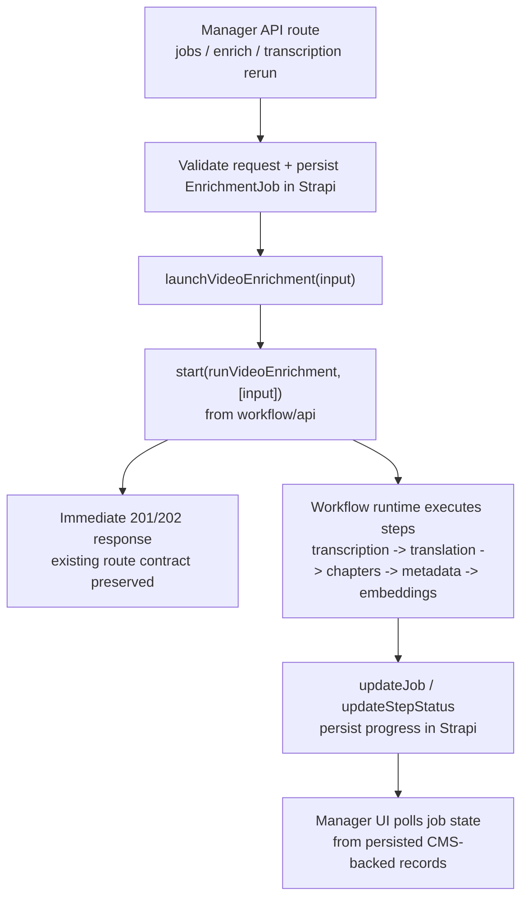

# feat: Make the manager video enrichment workflow actually durable

## Overview

Plan the next narrow slice for `feat-031`: wire the existing `apps/manager` video enrichment pipeline into a real workflow runtime so `runVideoEnrichment()` is no longer just a plain async function launched from a request handler. This slice is about durable execution for the current five-step pipeline, not about adding new enrichment capabilities.

## Problem Frame

`feat-031` is marked `in-progress`, and the current manager app already contains step orchestration for transcription, translation, chapters, metadata, embeddings, mux sync, and related artifact persistence. `origin/main` also now has substantial workflow-body and route-level test coverage. But the code still explicitly says the `"use workflow"` / `"use step"` directives are inert because `apps/manager/next.config.ts` does not enable the workflow build plugin, and the enrichment workflow is still launched directly from route handlers instead of via `start()` from `workflow/api`.

Today, `POST /api/jobs`, `POST /api/enrich`, and `POST /api/jobs/[id]/transcription/rerun` all still end up calling `runVideoEnrichment(...)` from inside `after(...)`. That means the pipeline behaves like best-effort background work tied to the request lifecycle instead of a durable workflow. A restart, deployment, or runtime interruption can strand jobs mid-run even though operator-visible job state already lives in Strapi. This leaves a core part of `feat-031` incomplete. (see origin: `docs/roadmap/media-generation/feat-031-ai-video-enrichment-pipeline.md`)

## Requirements Trace

- R1. The existing enrichment pipeline in `apps/manager` must execute through real workflow-runtime semantics rather than direct inline async work.
- R2. Keep the implementation bounded to the current five-step pipeline: transcription, translation, chapters, metadata, embeddings.
- R3. Preserve Strapi-backed `EnrichmentJob` records in `apps/manager/src/lib/state.ts` as the operator-facing source of truth.
- R4. All enrichment launch entrypoints must dispatch through the same shared runtime path: `POST /api/jobs`, `POST /api/enrich`, and `POST /api/jobs/[id]/transcription/rerun`.
- R5. Red/Green TDD is required. The plan must use dispatch-level tests in addition to existing workflow-body tests.
- R6. A user smoke test is required against a built manager runtime, not only Vitest or `pnpm dev`.
- R7. Verification must prove the runtime launch path works without regressing job-state updates or route behavior.
- R8. Work must follow repo branch/PR conventions: canonical branch `feat/031-ai-video-enrichment-pipeline`, PR target `main`, and no skipped pre-commit hooks.
- R9. This slice must not rename or reorder the persisted manager workflow step inventory unless a deliberate follow-up ticket expands scope.

## Scope Boundaries

- No voiceover/TTS work. That belongs to `feat-014` even though older manager docs mention it in the broader pipeline vision.
- No new dashboard surface beyond whatever existing job-state fields already show.
- No new CMS schema or GraphQL codegen work unless runtime integration proves an unavoidable persistence gap.
- No rewrite of the enrichment services themselves.
- No new queueing system beyond the workflow runtime already intended for this app.
- No renaming or reordering of `FORGE_WORKFLOW_STEPS`; coverage reporting, CMS enums, and generated GraphQL contracts already depend on that inventory.

## Context & Research

### Relevant Code and Patterns

- `apps/manager/src/workflows/videoEnrichment.ts`
  The orchestration logic already exists, but the file header documents that durability is disabled until the workflow plugin is configured.
- `apps/manager/src/app/api/jobs/route.ts`
  Creates a Mux asset and then runs the entire enrichment pipeline inside `after(...)`.
- `apps/manager/src/app/api/enrich/route.ts`
  Creates batch jobs from CMS videos and duplicates the same direct `after(...)` launch pattern.
- `apps/manager/src/app/api/jobs/[id]/transcription/rerun/route.ts`
  Requeues transcription reruns but still launches `runVideoEnrichment(...)` directly inside `after(...)`.
- `apps/manager/next.config.ts`
  Still exports a minimal Next config with no workflow build plugin.
- `apps/manager/src/config/env.ts`
  Already defines `WORKFLOW_API_KEY`, so the app has started the env contract for durable execution.
- `apps/manager/src/lib/state.ts`
  Job progress already persists in Strapi and should remain the canonical operator view during this slice. This is more trustworthy than the stale "file-backed" wording still present in `apps/manager/AGENTS.md`.
- `apps/manager/src/lib/workflow-steps.ts`
  Canonical persisted step inventory for manager jobs.
- `apps/manager/src/lib/workflow-steps.test.ts`
  Locks the manager step inventory to the CMS enum and generated GraphQL types, so durability work should not casually change step order or names.
- `apps/manager/src/features/coverage/coverage-report-model.ts`
  Coverage/completeness logic derives from persisted manager workflow steps, so step-contract drift would leak into operator-facing reporting immediately.
- `apps/manager/src/workflows/videoEnrichment.test.ts`
  `origin/main` already has substantial workflow-body coverage, so the plan should extend tests rather than acting as if the harness is missing.
- `apps/manager/src/app/api/enrich/route.test.ts`
  Existing route-test pattern for enrich helpers.
- `apps/manager/src/app/api/jobs/[id]/transcription/rerun/route.test.ts`
  Existing route-test pattern already mocking `after(...)` and `runVideoEnrichment(...)`; this should evolve into dispatch assertions once the launcher changes.
- `docs/solutions/platform/videoforge-manager-integration.md`
  Records the intended durable-workflow architecture and confirms this was part of the original manager direction, even though the current code has not fully closed the loop.
- `docs/plans/2026-03-17-001-feat-videoforge-manager-full-port-plan.md`
  Older broad manager plan. Useful for context, but too wide to drive the next safe step on `feat-031`.
- `docs/solutions/best-practices/workflow-dispatch-test-mode-divergence-20260421.md`
  Strongest local learning for this slice: workflow-body tests are insufficient once `withWorkflow` is enabled; dispatch sites must be tested directly.
- `docs/plans/2026-04-21-002-fix-admin-workflow-dispatch-plan.md`
  Best local implementation precedent for enabling real workflow dispatch in this monorepo.
- `apps/admin/src/test-helpers/workflow-dispatch.ts`
  Existing helper pattern for asserting `start()` dispatches correctly.
- Official Workflow DevKit docs:
  `withWorkflow(...)` is the actual Next.js boundary that transforms `"use workflow"` / `"use step"` directives, and `start()` is the runtime API for enqueueing workflow runs from API routes. The local world is bundled automatically for local development, and the vendor's own compatibility tests run against a built Next.js app started with `next start`.

### Institutional Learnings

- The manager app already treats workflow steps as idempotent; that should remain the contract once the runtime is actually enabled.
- `after()` is acceptable for post-response launch bookkeeping, but it is not a substitute for durable orchestration.
- The repo already prefers keeping operator-visible truth in existing persisted state rather than inventing a second shadow status store.
- useworkflow has a proven repo-local trap: `"use workflow"` functions can still pass unit tests while crashing in a real built runtime if callers forget to dispatch via `start()`.

## Key Technical Decisions

- **Create one shared launcher abstraction.**
  Add `apps/manager/src/workflows/launchVideoEnrichment.ts` as the only place API routes trigger the workflow runtime. This removes duplicated launch logic from the routes and isolates SDK-specific wiring to one module.

- **Enable the workflow plugin in `apps/manager/next.config.ts`.**
  This slice should turn on the build/runtime path that makes `"use workflow"` and `"use step"` real. Leaving durability behind a silent missing-plugin state would keep `feat-031` misleadingly "in progress" without closing the core gap.

- **Mirror the admin app's bounded workflow scan.**
  The manager app should follow `apps/admin/next.config.ts` and restrict workflow scanning to `src/workflows`. That keeps plugin scope tight and avoids reintroducing the wide directory scan risk already documented in the admin precedent.

- **Use the admin dispatch pattern as the runtime reference, not manager's current behavior.**
  `apps/admin` is now the only app in the monorepo with a live workflow dispatch pattern. Manager should follow that precedent for plugin wiring and dispatch tests rather than treating its existing direct invocation as a reference.

- **Dispatch directly from the request path; do not keep `after()` as the primary launch boundary.**
  Official Workflow docs describe `start()` as the runtime API for API routes and note that it returns immediately after enqueueing a run. For manager's enrichment routes, the target state should therefore be: persist the job, call `start()` exactly once, then return the normal 201/202 response. Keeping the enqueue itself inside `after()` should be treated as a fallback only if implementation uncovers a concrete incompatibility.

- **Keep Strapi `EnrichmentJob` as the canonical job record.**
  Do not add a second durable-job table in this slice. The runtime handles execution durability; Strapi remains the UI-facing state and audit surface.

- **Retain the existing five workflow steps.**
  Do not add `voiceover`, `mux_upload`, or `cms_notify` while enabling durability. Finishing execution semantics is already enough scope for one PR-sized slice.

- **Cover every workflow launch surface in one slice.**
  The shared launcher must replace direct calls in `POST /api/jobs`, `POST /api/enrich`, and `POST /api/jobs/[id]/transcription/rerun`. Fixing only two of the three would leave the same production crash class behind.

- **Red/Green TDD must focus on dispatch, not just workflow internals.**
  Existing `videoEnrichment.test.ts` cases remain valuable, but the required new red tests should assert dispatch through `start()` from `workflow/api` at the call sites. That is the only test layer that catches the built-runtime failure class documented on 2026-04-21.

- **The user smoke test must exercise a built runtime.**
  Because directives can remain inert in test/dev execution paths, smoke must run against the built manager runtime, then invoke a real enrichment path and confirm durable dispatch/job progression. This is also consistent with Workflow DevKit's own published local-world compatibility testing, which validates built Next.js apps started in production mode.

- **The execution plan should follow the repo's canonical branch and PR path.**
  The implementation branch for this ticket remains `feat/031-ai-video-enrichment-pipeline`, the PR should target `main`, and the plan should call out that pre-commit hooks must not be bypassed.

## Open Questions

### Resolved During Planning

- **Should this slice include voiceover because older manager docs mention it?**
  No. `feat-014` exists as a separate roadmap ticket, and this run should not merge ticket scope.

- **Should both API routes keep their own launch logic?**
  No. They should converge on a single launcher helper so the runtime integration, error handling, and fallback policy live in one place.

- **Should transcription rerun be part of this slice?**
  Yes. `origin/main` shows it dispatching the same workflow directly, so leaving it out would preserve the same non-durable path in production.

- **Should this slice add new CMS fields for workflow-run identifiers?**
  Not initially. The smallest safe slice is to enable durable execution while continuing to use the existing `EnrichmentJob` record.

### Deferred To Implementation

- **Exact SDK hook-up details for `workflow@4.2.2`.**
  Confirm the concrete `withWorkflow(...)` and `start(...)` usage from the installed package while implementing, but keep that uncertainty boxed inside `launchVideoEnrichment.ts`, route tests, and `next.config.ts`.

- **Whether any manager route truly still needs `after()` once dispatch is durable.**
  The default plan assumption is "no" because `start()` already enqueues without waiting for workflow completion. If one route still needs `after()`, implementation should document why that route is exceptional.

- **Whether the current parallel `Promise.all(...)` block should remain a single orchestration segment or be broken into smaller runtime-managed units.**
  Start by preserving the current step boundaries. If the SDK makes that pattern awkward, treat finer-grained fan-out as follow-up work rather than broadening this slice.

- **Whether manager should copy the admin test helper directly or create a manager-local equivalent.**
  Decide during implementation based on import-path ergonomics and whether the helper belongs in a shared package. The important requirement is dispatch-level coverage, not where the helper lives.

## Implementation Units

- [x] **Unit 1: Red phase — add dispatch-focused tests for every enrichment launch surface**

  **Goal:** Prove the current `origin/main` dispatch boundary is wrong before implementation, and establish regression coverage for the built-runtime failure class.

  **Requirements:** R4, R5, R7

  **Dependencies:** None

  **Files:**
  - Create: `apps/manager/src/app/api/jobs/route.test.ts`
  - Modify: `apps/manager/src/app/api/enrich/route.test.ts`
  - Modify: `apps/manager/src/app/api/jobs/[id]/transcription/rerun/route.test.ts`
  - Modify or Create: a manager dispatch test helper if reusing the admin helper directly is not appropriate

  **Approach:**
  - Mock `start()` from `workflow/api` and assert each entrypoint dispatches the workflow with the expected function reference and args tuple
  - Follow the local dispatch-test learning from `docs/solutions/best-practices/workflow-dispatch-test-mode-divergence-20260421.md`
  - Preserve existing route-level auth and validation assertions
  - Assert exactly one dispatch per request path so the slice catches accidental double-dispatch regressions during the move away from `after(...)`
  - Do not treat current `videoEnrichment.test.ts` coverage as sufficient for this slice; those tests are workflow-body coverage, not dispatch coverage

  **Verification:**
  - The new/updated tests fail red on current `origin/main` because entrypoints still call `runVideoEnrichment(...)` directly

- [x] **Unit 2: Enable the workflow runtime in the manager build**

  **Goal:** Make the manager app compile the enrichment workflow through the intended workflow runtime instead of leaving directive strings inert.

  **Requirements:** R1, R7

  **Dependencies:** Unit 1

  **Files:**
  - Modify: `apps/manager/next.config.ts`
  - Modify: `apps/manager/src/config/env.ts` (only if the SDK requires additional env wiring beyond `WORKFLOW_API_KEY`)

  **Approach:**
  - Add the workflow build plugin to the Next.js config for `apps/manager`
  - Mirror admin's bounded `workflows.dirs = [\"src/workflows\"]` pattern unless manager's file layout proves that restriction is insufficient
  - Keep the config change isolated to manager; do not change root monorepo build settings
  - Preserve existing `output: "standalone"` and `typedRoutes` behavior
  - Make missing runtime configuration explicit instead of silently leaving the workflow as plain async code

  **Verification:**
  - `pnpm --filter @forge/manager typecheck`
  - `pnpm --filter @forge/manager build`
  - Build output no longer relies on the "plugin missing" condition described in `videoEnrichment.ts`

- [x] **Unit 3: Centralize workflow launching behind one shared helper**

  **Goal:** Replace duplicated direct invocation logic with a single launch path that can own runtime integration, local fallback policy, and launch-time error handling.

  **Requirements:** R1, R3, R4, R7

  **Dependencies:** Unit 2

  **Files:**
  - Create: `apps/manager/src/workflows/launchVideoEnrichment.ts`
  - Modify: `apps/manager/src/workflows/videoEnrichment.ts`

  **Approach:**
  - Define a shared launcher function that accepts the existing `VideoEnrichmentInput`
  - Keep `runVideoEnrichment()` responsible for orchestration logic only
  - Move runtime-specific trigger code out of route handlers and into the launcher
  - Make the launcher's default contract "dispatch exactly once and return enqueue metadata", not "wait for workflow completion"
  - Normalize launch failures so callers can mark jobs failed or surface an actionable operator error without duplicating that logic
  - If a direct local-development fallback is retained, make the mode explicit in code and logs rather than silently reintroducing non-durable behavior

  **Verification:**
  - `apps/manager/src/workflows/videoEnrichment.ts` no longer has to double as both runtime entrypoint and route-launch surface
  - Launcher compiles cleanly and is the only workflow trigger path used by routes

- [x] **Unit 4: Switch all enrichment entrypoints to the shared launcher**

  **Goal:** Ensure every enrichment job enters the durable runtime the same way, whether it starts from a raw input URL, a CMS video selection, or a transcription rerun.

  **Requirements:** R3, R4, R5, R7

  **Dependencies:** Unit 3

  **Files:**
  - Modify: `apps/manager/src/app/api/jobs/route.ts`
  - Modify: `apps/manager/src/app/api/enrich/route.ts`
  - Modify: `apps/manager/src/app/api/jobs/[id]/transcription/rerun/route.ts`

  **Approach:**
  - Replace direct workflow calls with the launcher helper and `start(...)` dispatch path
  - Keep route handlers focused on auth, validation, lookup/ingest, and job creation
  - Prefer direct dispatch from the request path; only keep `after()` if implementation proves one route needs post-response enqueue semantics
  - Keep job creation semantics unchanged so the dashboard and existing polling behavior continue to work

  **Verification:**
  - All three entrypoints compile and call the same launcher
  - No entrypoint both dispatches inline and enqueues a second run via `after()`
  - Launch-time failures produce a clear job failure path instead of leaving a silently pending job
  - Existing response shapes stay stable

## High-Level Technical Design

This diagram is directional planning guidance, not implementation specification.

Design implications:

- The route owns validation, job creation, and one-time dispatch.
- The workflow function owns orchestration and step-level persistence.
- Strapi remains the operator-facing source of truth; workflow runtime durability is execution infrastructure, not a replacement job store.
- Because `start()` already enqueues asynchronously, the route should not need to wait for workflow completion or wrap the whole workflow body in `after()`.

- [x] **Unit 5: Green phase — keep workflow-body coverage honest and aligned**

  **Goal:** Preserve and extend the existing manager workflow-body tests so dispatch wiring does not hide real orchestration regressions.

  **Requirements:** R5, R7

  **Dependencies:** Unit 4

  **Files:**
  - Modify: `apps/manager/src/workflows/videoEnrichment.test.ts`

  **Approach:**
  - Keep existing body-level tests intact; only adjust them where plugin/runtime integration changes helper boundaries or import paths
  - Add one focused case if needed to ensure the launcher/runtime integration does not change the current workflow contract unexpectedly
  - Avoid replacing body coverage with dispatch coverage; both layers are needed

  **Verification:**
  - `pnpm --filter @forge/manager test -- src/workflows/videoEnrichment.test.ts`

- [x] **Unit 6: Align manager docs with the post-change runtime truth**

  **Goal:** Remove the current mismatch where manager docs describe durable workflows while the code comments still say the runtime is inert.

  **Requirements:** R7, R8

  **Dependencies:** Unit 5

  **Files:**
  - Modify: `apps/manager/CLAUDE.md`
  - Modify: `docs/solutions/platform/videoforge-manager-integration.md`
  - Consider Modify: `docs/solutions/best-practices/workflow-dispatch-test-mode-divergence-20260421.md` only if the manager implementation adds a reusable nuance worth compounding

  **Approach:**
  - Update manager guidance to state the actual runtime requirement and launch path after implementation lands
  - Keep the solution doc honest about what is now durable versus what remains future work

  **Verification:**
  - Repo docs no longer contradict the implementation state of `feat-031`

- [ ] **Unit 7: Run required user smoke test against the built runtime**

  **Goal:** Prove the new dispatch path works in the only environment that matters for this bug class: the compiled manager runtime.

  **Requirements:** R6, R7

  **Dependencies:** Unit 6

  **Files:**
  - No required source changes
  - Capture evidence in the PR description or follow-up compound doc if the repo's normal workflow expects it

  **Approach:**
  - Run `pnpm --filter @forge/manager build`
  - Start the built manager app with `pnpm --filter @forge/manager start`
  - Trigger a real enrichment path through one of the operator entrypoints
  - Confirm the route returns quickly, the workflow dispatch succeeds, and job state advances through the persisted Strapi surface
  - Prefer a user-visible smoke that proves the feature end-to-end rather than relying only on logs

  **Verification:**
  - Smoke is performed against the built runtime, not only `pnpm dev`
  - Evidence shows dispatch succeeds without the direct-call runtime error
  - Current run completed a production-mode boot smoke (`next build`, `next start`, `GET /login`, `GET /api/health`) with placeholder env values, but did not exercise a real enrichment job because live Strapi/Mux/OpenRouter credentials were not present in this environment

## Red/Green TDD Plan

This slice requires explicit Red/Green TDD.

### Red

1. Add dispatch tests around:
   - `apps/manager/src/app/api/jobs/route.ts`
   - `apps/manager/src/app/api/enrich/route.ts`
   - `apps/manager/src/app/api/jobs/[id]/transcription/rerun/route.ts`
2. Mock `start()` from `workflow/api` and assert the correct workflow function + args tuple are dispatched.
3. Confirm those tests fail against the current direct-call implementation.

### Green

1. Wire `withWorkflow(...)` into `apps/manager/next.config.ts`.
2. Introduce `apps/manager/src/workflows/launchVideoEnrichment.ts`.
3. Update all three route entrypoints to dispatch via the launcher instead of calling `runVideoEnrichment(...)` directly.
4. Update/repair existing `videoEnrichment.test.ts` cases only as needed to preserve workflow-body coverage.

### Smoke

1. Build manager with `pnpm --filter @forge/manager build`.
2. Start the built app with `pnpm --filter @forge/manager start`.
3. Trigger a real enrichment launch and confirm durable dispatch plus persisted job progression.

## Repo Workflow Requirements

- Use the canonical ticket branch: `feat/031-ai-video-enrichment-pipeline`
- Keep the work in one PR-sized slice
- Target PRs to `main`
- Use conventional commits
- Do not skip pre-commit hooks with `--no-verify`
- Before opening or updating the PR, run the touched-scope validation and include the required red/green test evidence plus the built-runtime smoke result

## System-Wide Impact

- Primary impact is limited to `apps/manager`
- No expected `apps/cms` or `packages/graphql` changes in the first slice
- Manager build behavior changes materially: `next.config.ts` will now transform workflow directives and should mirror the admin app's bounded workflow directory configuration
- API semantics stay intentionally stable at the surface level (201/202 job creation responses), but the internal execution boundary changes from in-process async work to dispatched workflow runs
- Strapi job persistence remains on the critical path for operator truth; dispatch durability reduces execution fragility but does not remove the need for step-level write correctness
- Coverage/reporting contracts should remain unchanged because persisted workflow step names and order are explicitly out of scope for this slice
- Local smoke likely exercises Workflow's bundled local world rather than an external service, so runtime verification should be framed as "built manager runtime + persisted job progression", not as an infrastructure migration

## Risks & Mitigations

- **Workflow SDK API drift or unclear package ergonomics**
  Keep all SDK-specific code inside the launcher helper and `next.config.ts` so the rest of the manager code stays stable.

- **Dispatch tests are skipped in favor of body tests**
  Treat that as a plan failure, not an implementation shortcut. The admin dispatch learning shows body tests alone will miss the production regression class.

- **Build/runtime surprises after enabling the plugin**
  Validate with a real manager build in the implementation phase instead of relying on typecheck alone.

- **Direct-route dispatch accidentally changes request timing or response shape**
  Keep the route contract explicit: dispatch once, return the existing job payload, and do not await workflow completion.

- **Double-dispatch during the transition from `after()` to `start()`**
  Add red tests that assert one dispatch per request path, then remove `after()` from the happy path unless a route proves it is strictly necessary.

- **Silent local fallback reintroduces the same durability gap**
  Avoid fallback-by-default. Production/staging should fail closed if runtime configuration is missing.

- **Current parallel step fan-out may not map perfectly to runtime checkpoints**
  Preserve the current shape first. If finer-grained runtime fan-out is needed, capture it as a follow-up instead of expanding this ticket slice mid-run.

- **Plugin scan scope grows too wide and slows or destabilizes builds**
  Start with the admin precedent of `workflows.dirs = [\"src/workflows\"]` and only widen the scope if manager's workflow layout truly requires it.

- **Smoke passes in dev but not in the built runtime**
  Treat `pnpm dev` as insufficient proof for this feature. The required smoke must run against the compiled app.

## Verification Strategy

- Red TDD:
  - `pnpm --filter @forge/manager test -- src/app/api/enrich/route.test.ts 'src/app/api/jobs/[id]/transcription/rerun/route.test.ts'`
  - plus the new `src/app/api/jobs/route.test.ts`
- `pnpm --filter @forge/manager typecheck`
- `pnpm --filter @forge/manager test -- src/workflows/videoEnrichment.test.ts`
- `pnpm --filter @forge/manager build`
- User smoke test against the built manager runtime:
  - create a job through `POST /api/jobs` or `POST /api/enrich`
  - optionally verify rerun dispatch through `POST /api/jobs/[id]/transcription/rerun`
  - confirm the route returns quickly after job creation
  - confirm the job enters the shared launch path via workflow dispatch
  - confirm Strapi-backed step state still transitions through running/completed or failed

## Sources & References

- Origin ticket: `docs/roadmap/media-generation/feat-031-ai-video-enrichment-pipeline.md`
- Existing manager plan: `docs/plans/2026-03-17-001-feat-videoforge-manager-full-port-plan.md`
- Existing manager solution doc: `docs/solutions/platform/videoforge-manager-integration.md`
- Dispatch test learning: `docs/solutions/best-practices/workflow-dispatch-test-mode-divergence-20260421.md`
- Admin workflow-dispatch precedent: `docs/plans/2026-04-21-002-fix-admin-workflow-dispatch-plan.md`
- Official Workflow DevKit docs:
  - [withWorkflow API](https://useworkflow.dev/docs/api-reference/workflow-next/with-workflow)
  - [start API](https://useworkflow.dev/docs/api-reference/workflow-api/start)
  - [Local World](https://workflow-sdk.dev/worlds/local)
