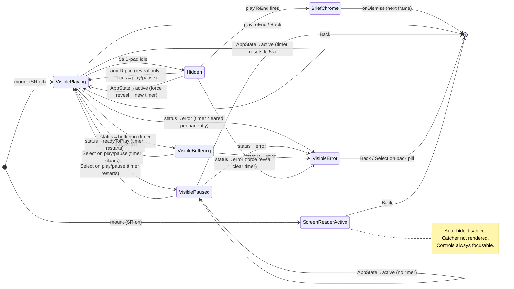

# TV Video Player — Auto-Hide Controls + Play/Pause Initial Focus

## Overview

The TV app's custom video player overlay (`apps/tv/src/components/VideoPlayer.tsx`) currently renders its top "← Back" pill and bottom controls panel permanently, covering ~35–40% of the screen. Initial focus also lands on the back button, forcing the user to press D-pad DOWN before they can play/pause. The player also uses a warm-salmon accent palette (`#ffb3b0` / `#410006` / `#e9e1dd` / `#a98987`) borrowed from an early Stitch mockup, which visually diverges from the rest of the Crimson Gallery TV app. This plan introduces a Netflix/YouTube-TV-style auto-hide pattern (5 s inactivity → fade both chrome layers), fixes initial focus, **retires the warm-salmon palette in favor of the app-wide Crimson Gallery tokens**, and fully specifies edge-case behavior (buffering, playback error, video-end, app backgrounding, screen reader, reduce motion, Siri remote swipe).

All product decisions are locked by the origin brainstorm, with one addition captured in this plan: the color-palette alignment to Crimson Gallery (superseding the implicit warm-salmon choice mentioned in the brainstorm's constraints). This plan is about _how_ to sequence the implementation in a single file, respect existing TV focus/animation patterns, and avoid the known react-native-tvos pitfalls surfaced by prior learnings.

## Problem Frame

See origin: [docs/brainstorms/2026-04-21-tv-video-player-controls-auto-hide-requirements.md](../brainstorms/2026-04-21-tv-video-player-controls-auto-hide-requirements.md).

Two user-visible bugs:

1. Controls permanently cover the video — no hide/show affordance.
2. Initial focus is on the back button, not the play/pause control users reach for first.

Plus eight edge-case behaviors that the current player does not address (D9–D16 in the origin).

## Requirements Trace

The origin enumerates 16 decisions (D1–D16), 11 implementation notes (I1–I11), and 15 success criteria. This plan traces by the origin's numbering to avoid renumbering drift.

- **Core behavior:** D1–D8 (visibility, focus, timer, fade, trigger rules) → Units 1–4
- **Edge-case behavior:** D9 buffering, D10 error, D11 video-end, D12 AppState, D13 screen reader, D14 timer-reset-on-any-dpad, D15 paused no-op, D16 Siri swipe → Units 1, 2, 5, 6, 7
- **Implementation mechanics:** I1 catcher, I2 focus restore, I3 ref-based timer, I4 pause guard, I6 dual one-shot flags (extended to a third `errorFocusPending` flag in Unit 1/4 for D10 error focus), I7 fade ordering, I8 event routing, I9 Android z-order, I10 a11y tree, I11 progress-bar updates (explicitly verified in Unit 2) → distributed across Units 1–7
- **Preservation constraints (not new work):** I4a `playToEnd` is unconditional — any new logic added to Unit 6's `playToEnd` listener must still call `onDismissRef.current()`. I5 all eight existing numbered fixes (#4, #5, #6, #8, #9, #15, #24, #25) remain effective — regression probes listed per unit and in the Risks table
- **Success criteria 1–15** → all traced via unit-level test scenarios

## Scope Boundaries

- Single-file change: `apps/tv/src/components/VideoPlayer.tsx` only. No refactor of `HomeHero.tsx`, `FocusableCard.tsx`, or the SDUI renderers.
- No new dependencies; use RN `Animated` (the codebase does not use `react-native-reanimated`).
- No switch to `nativeControls={true}` on `VideoView`.
- No changes to the `TVFocusGuideView` trap semantics (already `trapFocus*` in all four directions).
- No changes to CMS schema, GraphQL queries, or deployment config.
- No porting of this pattern to `apps/mobile` — mobile's player is separate.

### Deferred to Separate Tasks

- **Pause-on-background / resume-if-was-playing** behavior following the mobile `wasPlayingRef` pattern — not specified in the origin brainstorm. Current TV player has no AppState handling at all; adding it is net-new scope. Capture as a follow-up if product wants it.
- **Audit-level sweep of remaining warm-salmon artifacts** elsewhere in the TV app (if any turn up) — this plan retires the palette inside `VideoPlayer.tsx`; no other file currently uses those four hex values, but a post-merge grep (`ffb3b0`, `410006`, `e9e1dd`, `a98987`) can confirm.

## Context & Research

### Relevant Code and Patterns

- `apps/tv/src/components/VideoPlayer.tsx` — the target file; existing fixes #4/#5/#6/#8/#9/#15/#24/#25 must be preserved unchanged.
- `apps/tv/src/components/HomeHero.tsx:72-86` — `AccessibilityInfo.isReduceMotionEnabled()` + `reduceMotionChanged` subscription; `Animated.Value` + `Animated.parallel` + `Animated.timing` with `useNativeDriver: true`. Mirror this shape for screen-reader and reduce-motion subscriptions.
- `apps/tv/src/components/FocusableCard.tsx:64-96` — `useRef(new Animated.Value(1)).current` + `Animated.spring(scale, { useNativeDriver: true }).start()`. Mirror the ref allocation pattern.
- `apps/tv/app/index.tsx:7,205` — `AccessibilityInfo.announceForAccessibility()` usage (not needed for this plan, just confirms `AccessibilityInfo` is a known primitive in the TV app).
- Existing `TVFocusGuideView` trap with all four `trapFocus*` props at `apps/tv/src/components/VideoPlayer.tsx:347-353` — must remain intact.
- Existing one-shot `hasTVPreferredFocus` pattern at `apps/tv/src/components/VideoPlayer.tsx:136-139` (Fix #5) — must be mirrored for the new `revealFocusPending` flag (I6).
- Existing try/catch-wrapped `player.pause()`/`player.play()` at `apps/tv/src/components/VideoPlayer.tsx:171-190, 274-285` — the "shared object released" guard. Any new `player.*` call added by this plan must follow the same guard pattern.

### Institutional Learnings

- `docs/solutions/ui-bugs/tv-videoplayer-pointerevents-blocks-avplayerlayer-tvos-20260415.md` — do NOT wrap the overlay `VideoView` in `pointerEvents="none"`. The current file already uses `focusable={false}` directly; preserve that.
- `docs/solutions/ui-bugs/tv-videoview-steals-dpad-focus-20260413.md` — `TVFocusGuideView` with `trapFocus*` is the sanctioned D-pad containment primitive; already in use.
- `docs/solutions/best-practices/react-native-tvos-porting-pitfalls-20260414.md` (Pitfalls 3 & 5) — focusable controls must render in normal flex flow, not `position: "absolute"`. Play/pause is inside `controlsRow` which is a flex row inside `controlsContainer`; this is compliant. New invisible catcher (I1) must also avoid absolute positioning of its focusable element, or be positioned via the parent `contentLayer` (which is already the layout container).
- `docs/solutions/best-practices/tv-focus-driven-hero-patterns-20260420.md` (§4, §6, §9) — attach `onFocus` to the leaf `Pressable`, honor `AccessibilityInfo.isReduceMotionEnabled()` (snap-not-fade when reduce motion is on), use `collapsable={false}` on chrome layers above the Android `VideoView`.
- `docs/solutions/best-practices/playlist-video-player-sdui-mobile-20260409.md` (§5) — `player.addListener('statusChange', cb)` + `subscription.remove()` is the confirmed API for buffering/playing state. Wrap `player.play()` / `player.pause()` in try/catch.
- `docs/solutions/ui-bugs/tv-video-hero-blank-autoplay-20260413.md` — existing file already calls `player.play()` from `useEffect` (Fix in place since the brainstorm's authors hit this).

### External References

None needed at plan time. React-native-tvos APIs (`useTVEventHandler`, `TVEventControl`) are standard; the implementer will look up exact event-name shape at implementation time — captured as deferred questions below.

## Key Technical Decisions

- **Animation primitive**: use RN `Animated` with `useNativeDriver: true` for opacity. Established codebase pattern; no new dependency.
- **Timer primitive**: plain `setTimeout` stored in a `useRef<ReturnType<typeof setTimeout> | null>` so resets don't trigger re-renders (I3).
- **Event routing — two channels, one owner each**:
  - `BackHandler.addEventListener('hardwareBackPress', ...)` is the canonical Back/Menu channel on both tvOS AND Android TV (react-native-tvos `BackHandler.ios.js` already bridges tvOS hardware Menu into `hardwareBackPress`). Owns dismiss semantics and the hidden-state reveal-on-Back path (D6). Returns `true` to consume.
  - `useTVEventHandler` (react-native-tvos) handles arrow keys, Siri-remote swipes, Select, and long-Select **only**. Does NOT branch on `menu` — that would race with `BackHandler`.
  - Handler stability: the `useTVEventHandler` callback must be ref-stable. Mirror the existing `onDismissRef` pattern (Fix #15) — keep `controlsVisibleRef`, `isScreenReaderEnabledRef`, and `scheduleHideRef` updated via separate effects; the TV-event callback reads from refs, not state, so it doesn't churn the underlying native emitter subscription.
- **`TVEventControl.enableTVMenuKey()` on tvOS**: called on mount, released on unmount. Prevents Expo Router's Stack from auto-popping before our handler runs (I8). Wrapped in `Platform.isTV` guard. On Android, `BackHandler.hardwareBackPress` is the only channel; no equivalent global flag is needed.
- **Catcher placement**: inside the existing `TVFocusGuideView` (the `contentLayer` View), not as a sibling of `VideoView`. This preserves the Android TV z-order (I9) and keeps focus trapped inside the overlay.
- **Three focus flags** (I6 extended): `shouldRequestFocus` (existing mount-only, now drives play/pause instead of back), `revealFocusPending` (set true every time `controlsVisible` flips false→true), and `errorFocusPending` (set true on transition to the error state, drives the back pill instead of play/pause). Each has its own one-shot useEffect that clears it after the render that consumed it. `hasTVPreferredFocus={shouldRequestFocus || revealFocusPending}` on the play/pause Pressable; `hasTVPreferredFocus={errorFocusPending}` on the back pill.
- **Reduce-motion behavior**: when `isReduceMotionEnabled === true`, `hideControls`/`revealControls` call `opacityAnim.setValue(0|1)` directly instead of `Animated.timing`. Mirrors the HomeHero pattern.
- **Fade ordering** (I7): strictly serialize focusable-toggle → catcher mount → animation start on hide, and the inverse on reveal, to prevent orphan focus rings.
- **Progress bar state** (I11): `timeUpdate` subscription is NOT gated on `controlsVisible`; it keeps `currentTime` in sync so the reveal shows the true position with no visible jump.
- **Error UI**: inline label inside the existing bottom controls panel — no new modal, no new layer. Preserves the single-file constraint and mirrors how the current player handles transient state (everything happens in one overlay).
- **Testing posture**: manual couch QA on Apple TV Simulator + Android TV emulator is the project convention (`apps/tv` has `jest --passWithNoTests`, two utility tests only, zero component tests). New unit tests are not introduced by this plan. The origin doc's success criteria (#1–#15) serve as the manual QA checklist.
- **Color palette alignment (supersedes a brainstorm constraint)**: the four file-local design tokens at the top of `VideoPlayer.tsx` (`ACCENT = "#ffb3b0"`, `ACCENT_ON = "#410006"`, `TEXT_PRIMARY = "#e9e1dd"`, `TEXT_SECONDARY = "#a98987"`) are **removed** and all call-sites switch to the Crimson Gallery tokens already imported from `../lib/colors`:
  - `ACCENT` → `COLORS.primary` (`#CB333B` — Crimson Red; play button fill, progress bar fill, focused-skip-button text/chrome).
  - `ACCENT_ON` → `COLORS.text` (`#F5F5F4` — play/pause icon color on the crimson button fill; white-on-crimson is WCAG-AA contrast compliant).
  - `TEXT_PRIMARY` → `COLORS.text` (`#F5F5F4` — video title row).
  - `TEXT_SECONDARY` → `COLORS.muted` (`#A8A29E` — subtitle row, elapsed-time + total-time readouts).
  - Focus-state glow (`shadowColor: COLORS.primary`) is already crimson — unchanged. Removing the intermediate salmon tokens makes the focus treatment consistent between focused and unfocused states instead of mixing two accent hues.
  - The existing `// ── Design Tokens (Stitch: Video Playback - The Last Supper) ───` banner and its three-line comment about "deviating from the Crimson Gallery primary palette" are deleted along with the consts; they are no longer accurate.
  - This is a visual change surface; include "before/after" screenshots on the PR if practical.

## Open Questions

### Resolved During Planning

- **Animation library?** RN `Animated` — matches HomeHero and FocusableCard usage; no `react-native-reanimated` in `apps/tv/package.json`.
- **Where does the catcher live?** Inside `contentLayer` (the existing `TVFocusGuideView`), not as a sibling of `VideoView`. Resolves I9 / Android TV z-order.
- **Reduce motion handling?** Snap (use `setValue`) when `isReduceMotionEnabled === true`; animate otherwise. Not explicit in the origin but required by `docs/solutions/best-practices/tv-focus-driven-hero-patterns-20260420.md` §6 for any new fade in the TV app.
- **Formal component tests?** No — TV app has no component-test infrastructure and establishing one is out of scope. Manual QA only, per project convention. Where pure-function state-machine logic can be cleanly extracted, the implementer may optionally add a vitest unit test for the reducer — not required by this plan.
- **expo-video status enum (what does `statusChange` actually emit)?** Confirmed from `expo-video/build/VideoPlayer.types.d.ts`: `VideoPlayerStatus = 'idle' | 'loading' | 'readyToPlay' | 'error'`. There is no `'buffering'` or `'playing'` value. Unit 5 branches on `'loading'` (buffering/suspend path) vs `'readyToPlay'` (resume path) vs `'error'`. To disambiguate seek-related loading from network buffering, gate the suspend path on `seekTargetRef.current === null` — if a seek is in flight, a `'loading'` status is expected and does NOT suspend the timer.
- **Back/Menu channel**: `BackHandler.addEventListener('hardwareBackPress', ...)` is the unified channel for both tvOS and Android TV. `useTVEventHandler` does NOT branch on `menu`. See Key Technical Decisions > Event routing.
- **`BackHandler` subscription initial-focus race**: `BackHandler`'s most-recently-added listener is called first (standard RN behavior). Subscription is added in the same useEffect as other event handlers, so ordering is deterministic within this component.

### Deferred to Implementation

- **Exact `useTVEventHandler` event-type string for arrows / Select / swipes on react-native-tvos 0.81**: likely `up`/`down`/`left`/`right`/`select`/`longSelect`, with `swipeUp`/`swipeDown`/`swipeLeft`/`swipeRight` on Siri-remote-gen-1 only. Log actual event shapes on first device run. Fallback: use a defensive "any recognized TV-event in the hidden state triggers reveal" handler rather than a whitelist.
- **Does `hasTVPreferredFocus` trigger a native focus transfer on a continuously-mounted Pressable when flipped false→true?** Fix #5's mount-time behavior is proven; the Unit 4 multi-cycle reveal behavior is not. See Risks table for mitigation options (fresh key per reveal, focusable toggle, or cluster unmount). Implementer picks during Unit 4 after device test.
- **Does `useNativeDriver: true` on opacity produce any warning on react-native-tvos 0.81?** Generally supported; verify no frame drops or "Native driver not supported" warnings on device (per Verification).
- **Siri remote swipe support across remote generations**: Siri remote 1st gen has a touch surface and emits swipe events. 2nd-gen+ remotes (introduced 2021) have a clickpad with limited gesture support. D16 behavior on 2nd-gen+ remotes may degrade to arrow-equivalent; acceptable because directional arrow presses from the clickpad still reveal controls.
- **Initial `scheduleHide` trigger**: first `playingChange` event where `isPlaying === true`. If that event doesn't arrive within 2 s of mount (e.g. auto-play retried but the stream stalled), fall back to calling `scheduleHide()` anyway so controls don't stick — the buffering-aware timer logic (Unit 5) then suspends it if status is still `'loading'`.

## High-Level Technical Design

> _This state diagram illustrates the intended visibility state machine and is directional guidance for review, not implementation specification. The implementing agent should treat it as context, not code to reproduce._

## Implementation Units

- [ ] **Unit 1: Foundation — state, refs, lifecycle subscriptions, initial focus fix, color-token alignment**

**Goal:** Establish the state machine scaffolding and subscribe to all three lifecycle sources (`AppState`, `AccessibilityInfo` screen-reader, `AccessibilityInfo` reduce-motion). Move initial focus from the back pill to the play/pause button. Retire the warm-salmon file-local design tokens and switch to Crimson Gallery `COLORS.*` throughout the player chrome.

**Requirements:** D1, D2, D12 (partial — scaffolding only), D13 (partial — gate state only), I3, I5, I6 (add `revealFocusPending` and `errorFocusPending` flags; wiring in Unit 4), I11 (keep timeUpdate subscription unchanged). Success criteria #2, #11, #12 (scaffolding).

**Dependencies:** None. Unit 1 is self-contained — it introduces all state/refs/subscriptions but defines stable refs for handlers that Units 2 and 3 populate later (see below). Nothing in Unit 1 invokes `scheduleHide` or `revealControls` directly.

**Files:**

- Modify: `apps/tv/src/components/VideoPlayer.tsx`

**Approach:**

- Add state: `controlsVisible` (default `true`), `controlsFocusable` (default `true`), `status` (default `'idle'`, typed from expo-video's `VideoPlayerStatus`), `hasError` (default `false`), `isScreenReaderEnabled` (default `false`), `isReduceMotionEnabled` (default `false`).
- Add one-shot focus state: `revealFocusPending` (default `false`) and `errorFocusPending` (default `false`), each with its own useEffect that clears it after the render that set it to true (mirror Fix #5's pattern — see the existing `shouldRequestFocus` useEffect at the top of the file).
- Add refs: `inactivityTimerRef` (`ReturnType<typeof setTimeout> | null`), `opacityAnim` (`useRef(new Animated.Value(1)).current`).
- Add **stable handler refs** for cross-unit wiring (mirrors Fix #15's `onDismissRef` pattern):
  - `scheduleHideRef = useRef<() => void>(() => {})` — Unit 2 updates `.current` once `scheduleHide` is defined; Unit 1's AppState handler calls `scheduleHideRef.current()` so no forward-reference error.
  - `revealControlsRef = useRef<() => void>(() => {})` — similarly populated by Unit 2 and consumed by Unit 3's event handler.
  - `controlsVisibleRef = useRef<boolean>(true)` and `isScreenReaderEnabledRef = useRef<boolean>(false)` — each updated in a useEffect whenever the corresponding state changes. The `useTVEventHandler` callback in Unit 3 reads refs (not state) so the handler stays referentially stable and doesn't churn the native emitter subscription.
- Add two `AccessibilityInfo` subscriptions in a single useEffect: `isScreenReaderEnabled()` seed + `screenReaderChanged` listener; `isReduceMotionEnabled()` seed + `reduceMotionChanged` listener. Clean up both on unmount.
- Add `AppState.addEventListener('change', ...)` subscription: on transition to `'active'`, force `controlsVisible=true` + `controlsFocusable=true` + `opacityAnim.setValue(1)` + `scheduleHideRef.current()` (fresh 5 s timer).
- On mount (inside `Platform.isTV` guard) wrapped in try/catch, with a `menuKeyEnabledRef` bookkeeping flag so cleanup only runs if enable succeeded: call `TVEventControl.enableTVMenuKey()`. On cleanup: `TVEventControl.disableTVMenuKey()`.
- Move `hasTVPreferredFocus={shouldRequestFocus}` from the back-button `Pressable` to the play/pause `Pressable`, changing it to `hasTVPreferredFocus={shouldRequestFocus || revealFocusPending}`. Add `hasTVPreferredFocus={errorFocusPending}` to the back-button `Pressable` (takes effect only in the error state).
- **Color-token swap to Crimson Gallery:**
  - Delete the four file-local `const` declarations at the top of the file (`ACCENT`, `ACCENT_ON`, `TEXT_PRIMARY`, `TEXT_SECONDARY`) and the "Stitch: Video Playback - The Last Supper" comment banner that introduces them.
  - At every call-site in the `StyleSheet.create({...})` block and inline styles, replace:
    - `ACCENT` → `COLORS.primary` (progress-fill, skip-button text, play/pause button `backgroundColor`, focused-skip background via `hexToRgba(COLORS.primary, 0.15)`, focused-shadowColor — the shadow is already `COLORS.primary` in the existing code, leave as-is).
    - `ACCENT_ON` → `COLORS.text` (play/pause icon color).
    - `TEXT_PRIMARY` → `COLORS.text` (video title, back-button text).
    - `TEXT_SECONDARY` → `COLORS.muted` (video subtitle, time readouts).
  - Update both the `<PlayIcon>` and `<PauseIcon>` default `color` prop values (currently `ACCENT_ON`) to `COLORS.text`; these are the icons rendered on the crimson play/pause button.
  - Audit: after the edit, grep the file for the four retired hex strings (`ffb3b0`, `410006`, `e9e1dd`, `a98987`) and confirm zero hits.
- Keep all eight existing numbered fixes intact — no line touched inside Fix #4/#5/#6/#8/#9/#15/#24/#25 bodies.

**Patterns to follow:**

- `AccessibilityInfo` subscription shape from `apps/tv/src/components/HomeHero.tsx` (the `isReduceMotionEnabled()` + `reduceMotionChanged` listener near the top of the component).
- `useRef(new Animated.Value(...)).current` allocation from `apps/tv/src/components/FocusableCard.tsx`.
- One-shot `hasTVPreferredFocus` useEffect pattern from existing Fix #5 in `apps/tv/src/components/VideoPlayer.tsx` (top of the component, the `shouldRequestFocus` state + clearing effect).
- Ref-based cross-unit handler wiring mirrors Fix #15's `onDismissRef` in `apps/tv/src/components/VideoPlayer.tsx` (the listener registered in the `playToEnd` effect reads `onDismissRef.current` instead of closing over `onDismiss` directly).
- Try/catch-wrapped subscription cleanup from existing listeners in `apps/tv/src/components/VideoPlayer.tsx` (each `subscription.remove()` sits in a try/catch that tolerates "shared object" errors).

**Test scenarios:**

- Test expectation: none for the state/subscription scaffolding — no behavioral surface yet. Behavioral success criteria proved in Units 2–7.
- Manual QA spot checks (pre-feature-complete):
  - Open a video, confirm focus ring lands on play/pause rather than back (success criterion #2).
  - Visual: play/pause button fill is Crimson Red `#CB333B`, not warm-salmon `#ffb3b0`. Progress bar fill is the same crimson. Skip-button text is crimson. Side-by-side with `HomeHero.tsx`'s focus ring (also Crimson Red), the two chromes visually unify.
  - Visual: title text reads as `#F5F5F4` (bright off-white) instead of `#e9e1dd` (cream). Subtitle + time readouts read as `#A8A29E` (neutral muted) instead of `#a98987` (rose-muted).

**Verification:**

- `pnpm --filter @forge/tv typecheck` passes.
- `pnpm --filter @forge/tv lint` passes.
- No "unmounted listener" console warnings when rapidly navigating in/out of a video.
- Back pill no longer has `hasTVPreferredFocus`; play/pause does.
- `grep -E "ffb3b0|410006|e9e1dd|a98987" apps/tv/src/components/VideoPlayer.tsx` returns zero matches. The four retired hex strings are fully removed from the file.
- All color literals in `VideoPlayer.tsx` come from `COLORS.*` (via `../lib/colors`) — no orphan hex strings remain in the stylesheet or icon default props.

---

- [ ] **Unit 2: Core auto-hide with fade — visible ↔ hidden state transitions**

**Goal:** Implement the 5 s inactivity timer with 150 ms ease-out hide / 100 ms ease-in reveal. Timer only runs during playback and is reset by every D-pad activity in the visible state. Controls become non-focusable before fade starts (I7 ordering). Reduce-motion snaps instead of animating.

**Requirements:** D3, D4, D7, D8, D14, D15, I4, I7. Success criteria #1, #6, #8.

**Dependencies:** Unit 1.

**Files:**

- Modify: `apps/tv/src/components/VideoPlayer.tsx`

**Approach:**

- Wrap the top `topBar` View and the bottom `controlsContainer` View each in their own `Animated.View` bound to the same shared `opacityAnim`. Single source of truth. Both `Animated.View`s carry `collapsable={false}` (Android TV z-order — learnings §9). If content from the bottom panel ever extends into the top pill's horizontal region (e.g. long title text), the bottom panel renders below the top pill in z-order via source ordering — bottom `Animated.View` rendered first inside `contentLayer`, top `Animated.View` rendered after so it sits on top.
- `controlsFocusable` state was scaffolded in Unit 1; each control `Pressable` (back, rewind, play/pause, forward) reads `focusable={controlsFocusable}`.
- Implement `scheduleHide()`: clears `inactivityTimerRef.current` if present, then only if `!isPaused && status !== 'buffering' && status !== 'error' && !hasError && !isScreenReaderEnabled`, sets a new 5000 ms timeout that calls `hideControls()`.
- Implement `hideControls()`:
  1. `setControlsFocusable(false)` (causes a render commit — controls drop out of UIFocusEngine).
  2. Catcher mounts on that render (wiring in Unit 3 — here only allocate the slot).
  3. If `isReduceMotionEnabled`: `opacityAnim.setValue(0)` + `setControlsVisible(false)` synchronously. Else: `Animated.timing(opacityAnim, { toValue: 0, duration: 150, easing: Easing.out(Easing.cubic), useNativeDriver: true }).start(() => setControlsVisible(false))`.
- Implement `revealControls()`:
  1. `setControlsVisible(true)` + `setRevealFocusPending(true)` + `setControlsFocusable(true)` in one batch.
  2. If `isReduceMotionEnabled`: `opacityAnim.setValue(1)` synchronously. Else: `Animated.timing(opacityAnim, { toValue: 1, duration: 100, easing: Easing.in(Easing.cubic), useNativeDriver: true }).start()`. **Do not** `setValue(0)` or otherwise reset opacityAnim before starting — if a hide animation was in flight, the reveal should animate from the current mid-fade opacity value (e.g. 0.4 → 1) for a smooth reversal, avoiding a jarring flash.
  3. Call `scheduleHide()` to arm the next cycle.
- After Unit 1's refs are in place, assign `scheduleHideRef.current = scheduleHide` and `revealControlsRef.current = revealControls` inside a useEffect that runs whenever these functions are re-created (closure-over-state). This is what bridges Unit 1's AppState handler and Unit 3's TV-event handler to the Unit 2 implementation without re-registering their subscriptions.
- Modify each control `Pressable`'s `onPress` (back, rewind, play/pause, forward) to call `scheduleHide()` after the original handler runs — satisfies D14 (every activation resets the timer).
- Modify each control `Pressable`'s `onFocus` to call `scheduleHide()` — D14 covers focus movement too.
- Modify the existing `playingChange` listener: on pause → clear `inactivityTimerRef`; on resume → `scheduleHide()`.
- **Initial timer arming**: `scheduleHide()` is triggered by the first `playingChange` event where `isPlaying === true` — this is the authoritative "video actually started playing" signal and avoids the race against expo-video's auto-play retry at mount. Fallback: a `setTimeout(() => scheduleHideRef.current(), 2000)` on mount; if the normal path already armed the timer, the fallback's call is a no-op (`scheduleHide` is idempotent — it clears any existing timer before setting a new one).
- **Idempotence note:** `scheduleHide()` is designed to be called repeatedly — from `playingChange` resume, from onFocus, from onPress, from AppState active, from the initial fallback — and always results in exactly one active 5 s timer.

**Patterns to follow:**

- `Animated.timing(value, { toValue, duration, useNativeDriver: true }).start(callback)` from `apps/tv/src/components/HomeHero.tsx:141-146`.
- `Easing.out(Easing.cubic)` import from `'react-native'`.
- Reduce-motion snap pattern from `apps/tv/src/components/HomeHero.tsx:72-77`.

**Test scenarios:**

- Happy path (manual QA): Open video → wait 5 s untouched → both top pill and bottom panel fade to 0 over ~150 ms ease-out. Video visible edge-to-edge.
- Happy path (manual QA): Press D-pad right while controls visible → timer resets (controls stay visible another 5 s).
- Happy path (manual QA): Press Select on forward-10 repeatedly → controls stay visible for each press + 5 s after last press.
- Edge case (manual QA): Pause the video → wait 10 s → controls do NOT hide.
- Edge case (manual QA): Resume from pause → 5 s timer starts fresh.
- Edge case (manual QA, tvOS): With Accessibility → Reduce Motion enabled, repeat the open-and-wait test — controls snap to hidden, no fade. Repeat reveal — controls snap to visible.
- Error path (manual QA): Close the player mid-fade (back button while opacity is animating) → no crash, no "orphaned Animated value" warning.
- Integration (manual QA): Rapid Select mashing on play/pause from visible state → Fix #9 still holds, state is monotonic, no double-toggle.

**Verification:**

- Timer reliably cleared on pause and on unmount (no console warnings about setState on unmounted component).
- `useNativeDriver: true` emits no warnings on Apple TV Simulator.
- On a real Apple TV device, the fade is 60 fps (verify via Xcode Instruments or eyeball — no visible frame drops).
- Fix #9 regression probe passes: rapid Select does not produce double-toggle.
- **I11 progress bar:** hide controls mid-video via the 5 s timer. Wait 5 s hidden. Reveal. Progress bar position reflects true current time (~5 s advanced from hide moment), not a jump from where it was when hidden. Confirms the `timeUpdate` subscription continues driving `currentTime` while `controlsVisible === false`.
- Mid-fade reversal: press D-pad while controls are fading out. Controls animate back to opacity 1 smoothly from the current value — no visible flash to 0 before the reveal.

---

- [ ] **Unit 3: Invisible D-pad catcher + event routing**

**Goal:** While controls are hidden, a single invisible focusable element catches all D-pad input (arrows, Select, Menu/Back, Siri-remote swipes), reveals controls, and suppresses the action bound to whatever was focused. While controls are visible, hardware Menu/Back is routed to `onDismiss` instead of to Expo Router's Stack.

**Requirements:** D5, D6, D16, I1, I8, I9. Success criteria #3, #4, #5, #13.

**Dependencies:** Unit 2.

**Files:**

- Modify: `apps/tv/src/components/VideoPlayer.tsx`

**Approach:**

- Add a `useTVEventHandler` subscription at component scope whose callback is **ref-stable** (reads `controlsVisibleRef.current` + `isScreenReaderEnabledRef.current` + calls `revealControlsRef.current()`; does not close over state). This prevents the TV emitter subscription from churning on every render — see Key Technical Decisions > Event routing. The callback handles arrow keys, Siri-remote swipes, Select, and long-Select. It does **not** branch on `menu`.
  - If `controlsVisibleRef.current === false && !isScreenReaderEnabledRef.current`: call `revealControlsRef.current()` and return early. Applies to `up`, `down`, `left`, `right`, plus `swipeUp`/`swipeDown`/`swipeLeft`/`swipeRight` when present (Siri remote 1st gen), plus `select` and `longSelect`. Use a defensive whitelist-or-fallback: if the observed event-type string doesn't match any known value but the payload is non-empty and we're in hidden state, still trigger reveal.
  - If `controlsVisibleRef.current === true`: return — these events are handled by the normal Pressable / focus engine path (moving focus, activating the focused button). D14 (timer reset on D-pad activity) is handled by each Pressable's `onFocus`/`onPress` calling `scheduleHideRef.current()`, not by the TV event handler. The Siri remote **swipe** case while visible is an exception — swipes don't fire focus events, so the TV-event handler's visible branch should call `scheduleHideRef.current()` for swipes (only) to satisfy D14.
- **Back / Menu / hardware-back**: add a single `BackHandler.addEventListener('hardwareBackPress', ...)` subscription. react-native-tvos's `BackHandler.ios.js` bridges hardware Menu (tvOS) into `hardwareBackPress`, so one subscription covers both platforms. Logic:
  - Hidden state: call `revealControlsRef.current()` and return `true` (consume).
  - Visible state: call `onDismissRef.current()` and return `true` (consume). Preserves existing dismiss behavior from the visible back pill's `onPress` but now also covers hardware Menu.
- The back pill's `onPress` handler from Fix-preserved code still calls `onDismiss` directly when the user presses Select on the focused back pill. The BackHandler path covers hardware Menu / hardware Back button. Two code paths, two channels, no overlap.
- Conditionally render an invisible `Pressable` catcher inside the `TVFocusGuideView` (at the top of `contentLayer`'s children) when `!controlsVisible && !isScreenReaderEnabled`:
  - `focusable={true}`, `hasTVPreferredFocus={true}` (one-shot — catcher mounts fresh each hide cycle, so this naturally only fires on mount).
  - `onPress={revealControls}` — primary Select handler on tvOS. Since the catcher holds focus while hidden, Select lands on the catcher's `onPress` before reaching any control. The `useTVEventHandler` select branch is a secondary safety net only.
  - `accessibilityLabel="Show player controls"`, `accessibilityRole="button"`, `accessibilityElementsHidden={isScreenReaderEnabled}` (belt-and-suspenders — the conditional render already covers this but keeps the attr consistent).
  - Style: `StyleSheet.absoluteFillObject` inside `contentLayer`, `collapsable={false}`.
- **Reveal de-duplication guard**: `revealControls()` (implemented in Unit 2) reads `controlsVisibleRef.current` at entry — if already `true`, returns early without re-arming the timer or re-triggering the fade. This prevents the catcher-onPress + useTVEventHandler-select double-dispatch race from causing two reveals on a single Select press.
- Order operations strictly per I7:
  - **On hide (extending Unit 2's hideControls):** after `setControlsFocusable(false)`, the catcher mounts on the next render. Only then start the opacity animation.
  - **On reveal:** `setControlsVisible(true)` unmounts the catcher; `setControlsFocusable(true)` restores controls; `revealFocusPending` directs focus to play/pause (wired in Unit 4). Opacity animation starts after this state batch commits.

**Patterns to follow:**

- `useTVEventHandler` import from `react-native` (react-native-tvos surfaces it on the base `'react-native'` module).
- `BackHandler.addEventListener('hardwareBackPress', ...)` is standard RN; return `true` from the callback to consume the event. Works on both tvOS (via react-native-tvos's Menu→hardwareBackPress bridge) and Android TV.
- Existing `onDismissRef` pattern from Fix #15 in `apps/tv/src/components/VideoPlayer.tsx` — mirror it for all new ref-based handlers (`scheduleHideRef`, `revealControlsRef`, `controlsVisibleRef`, `isScreenReaderEnabledRef`, `menuKeyEnabledRef`).

**Test scenarios:**

- Happy path (manual QA, tvOS): Hidden state → press D-pad right → controls reveal, focus on play/pause, video position unchanged (no seek fired).
- Happy path (manual QA, tvOS): Hidden state → press Select → controls reveal, video keeps playing (first Select was reveal-only). Press Select again → video pauses.
- Happy path (manual QA, tvOS): Hidden state → press hardware Menu on Siri remote → controls reveal, player NOT dismissed. Press Menu again → player dismisses.
- Happy path (manual QA, tvOS): Hidden state → swipe right on Siri-remote touch surface → controls reveal identically to arrow press.
- Happy path (manual QA, Android TV): Hidden state → press D-pad any direction → controls reveal (confirms catcher sits above VideoView in z-order).
- Happy path (manual QA, Android TV): Hidden state → press Back on remote → controls reveal. Press Back again → player dismisses.
- Edge case (manual QA): Rapid D-pad during hide animation (press arrow while opacity is animating 1→0) → controls re-reveal without getting stuck mid-fade.
- Error path (manual QA): Close the app (home button) while hidden → return → `TVEventControl.disableTVMenuKey()` is correctly released on unmount (no duplicate enable on re-entry).
- Integration (manual QA): Mid-video dismiss from visible state via the back Pressable's onPress still works (Fix #15/#24 intact).

**Verification:**

- Expo Router's Stack does NOT auto-pop on hardware Menu when our handler runs. Verify by pressing Menu in the hidden state and confirming we stay on the player route.
- Catcher is present in the view hierarchy ONLY when `controlsVisible === false` (verify via React DevTools or a temporary `console.log`).
- Android TV: D-pad presses in the hidden state reliably reveal controls (not silently dropped by z-order).
- No double-handler firing: a single arrow press produces exactly one reveal, not two.

---

- [ ] **Unit 4: Focus restore on reveal (play/pause as anchor)**

**Goal:** Every reveal cycle lands focus on the play/pause button, regardless of where focus was before the hide. Survives multiple hide/reveal cycles within a single player session.

**Requirements:** I2, I6. Success criterion #3 (focus-on-reveal assertion).

**Dependencies:** Unit 3.

**Files:**

- Modify: `apps/tv/src/components/VideoPlayer.tsx`

**Approach:**

- `revealFocusPending` and `errorFocusPending` state flags were scaffolded in Unit 1 (along with their one-shot clearing useEffects) and flipped true by Unit 2's `revealControls()` / Unit 5's error transition respectively.
- Wire the flags:
  - Play/pause `Pressable`: `hasTVPreferredFocus={shouldRequestFocus || revealFocusPending}`.
  - Back pill `Pressable`: `hasTVPreferredFocus={errorFocusPending}`.
- Clearing useEffects (pattern difference from Fix #5, flagged explicitly):
  - Fix #5 uses `[]`-deps useEffect that runs once at mount.
  - `revealFocusPending` uses `[revealFocusPending]`-deps useEffect guarded by `if (revealFocusPending) { setRevealFocusPending(false); }` — runs every hide/reveal cycle. `errorFocusPending` uses the identical pattern.
  - The if-guard prevents the second run (where the value is `false`) from looping.
- **Risk: `hasTVPreferredFocus` on a continuously-mounted Pressable may not re-trigger a native focus transfer when flipped false→true.** Fix #5 works because its Pressable is a fresh native attach. The reveal path in this plan keeps play/pause mounted. Three mitigations exist; pick one during Unit 4 device testing (documented in Risks table):
  - (a) **Key remount** — wrap the play/pause Pressable with `key={revealCount}` so each reveal is a fresh mount. Simplest; slight render cost.
  - (b) **focusable toggle** — Unit 2 already flips `controlsFocusable` false→true, which means each reveal is a native "view added back to focus environment" event. Verify this on tvOS; if focus lands, no `hasTVPreferredFocus` needed.
  - (c) **Cluster unmount** — unmount the entire `<Animated.View>{controls}</Animated.View>` wrapper while hidden (opacity 0, but tree removed). Controls tree is fresh-mounted on reveal; Fix #5-style behavior.
- Implementer's default preference: (b) if it works on device, otherwise (a). (c) is a last resort — it complicates I11 (progress bar state would reset across cycles unless the parent owns it).

**Patterns to follow:**

- Fix #5's one-shot `hasTVPreferredFocus` + useEffect in `apps/tv/src/components/VideoPlayer.tsx` (top of component).

**Test scenarios:**

- Happy path (manual QA): Hide controls (wait 5 s), reveal via arrow → focus on play/pause.
- Happy path (manual QA): Hide, reveal, press arrow right to move focus to forward-10, hide again (wait 5 s), reveal → focus back on play/pause, NOT forward.
- Edge case (manual QA): Five or more hide/reveal cycles in one session → focus reliably on play/pause every time.
- Integration (manual QA): Initial mount focus is still on play/pause (Fix #5 not regressed).

**Verification:**

- `revealFocusPending` does not cause an infinite re-render loop (verify React DevTools commits).
- Initial mount focus still works after the file's useEffect order is extended by Units 1–3.

---

- [ ] **Unit 5: Buffering and error states**

**Goal:** Suspend the auto-hide timer while the stream is buffering. On playback error, force controls visible permanently with an inline error label inside the bottom controls panel.

**Requirements:** D9, D10. Success criteria #9, #10.

**Dependencies:** Unit 2 (needs `scheduleHide` and the status gate).

**Files:**

- Modify: `apps/tv/src/components/VideoPlayer.tsx`

**Approach:**

- Subscribe to expo-video's `player.addListener('statusChange', cb)` (same subscription shape as existing `playToEnd` / `playingChange` / `timeUpdate` / `sourceLoad`). Status enum is confirmed from `expo-video/build/VideoPlayer.types.d.ts`: `VideoPlayerStatus = 'idle' | 'loading' | 'readyToPlay' | 'error'` — no `'buffering'` or `'playing'` value exists. Branch as follows:
  - **Status `'loading'` and a seek is in flight** (`seekTargetRef.current !== null`): do nothing — the stall is expected, not a network buffer. Fix #4's existing seek guard already handles the UI side.
  - **Status `'loading'` and no seek in flight**: clear `inactivityTimerRef` (suspend the timer — do not call `scheduleHide`). If `controlsVisible === false`, also force a reveal — a hidden stall is indistinguishable from "video ended" for a low-confidence user (per D9 spirit + user-safety principle). Implementation: `revealControls()` (the de-dup guard in Unit 3 makes this a no-op if already visible).
  - **Status `'readyToPlay'`** (transition back from loading): call `scheduleHide()` to restart the 5 s countdown.
  - **Status `'idle'`**: no-op — mount-time default; not a runtime transition we need to handle.
  - **Status `'error'`**: enter the error path (below).
- **Error path** — when status transitions to `'error'` (or if `playingChange`/`timeUpdate` surface an error via their error payload, whichever appears first on device):
  1. Set `hasError = true`, clear `inactivityTimerRef` permanently (do not call `scheduleHide` again for this mount).
  2. Force `setControlsVisible(true)` + `setControlsFocusable(true)` + `opacityAnim.setValue(1)` (snap — this is a forced system state, not a user-initiated reveal).
  3. Set `errorFocusPending = true` (drives the back pill's `hasTVPreferredFocus`, per Unit 4 wiring). Do NOT set `revealFocusPending` — play/pause is inert in the error state.
- **Error-state rendering**:
  - Replace the title row text with the error message "Playback failed — press Back to exit." (inline `<Text>` in the existing `titleRow` View; not a new overlay). Keep the subtitle present if it was set, for context.
  - Ghost the rewind / play/pause / forward Pressables: apply `opacity: 0.3` + `focusable={false}` while `hasError === true`. Keep them mounted (preserves spatial layout so the user's mental model of "where back is" doesn't shift). Do not hide them entirely.
  - The back pill stays at full opacity and is the only focusable control.
- Clean up the `statusChange` subscription on unmount (try/catch-wrapped `subscription.remove()` matching the existing pattern).

**Patterns to follow:**

- Existing `player.addListener('playToEnd'/'playingChange'/'timeUpdate'/'sourceLoad', cb)` subscriptions in `apps/tv/src/components/VideoPlayer.tsx`.
- Try/catch-wrapped subscription cleanup used by every listener in that file.

**Test scenarios:**

- Happy path (manual QA): Throttle the network (e.g., via Network Link Conditioner on macOS for tvOS Simulator) while playing → status flips to buffering → timer suspends → controls stay visible. Remove throttle → status flips to playing → timer restarts from zero.
- Error path (manual QA): Launch the player pointed at an unreachable URL (replace `streamingUrl` with a stub 404 for testing, or revoke the stream mid-playback via a local proxy) → controls stay visible permanently with the error label. Back pill is focused; Back dismisses.
- Edge case (manual QA): Brief stall during a seek operation (the existing seek guard can cause momentary stalls) should NOT trip the error path — only the timer is affected.
- Integration (manual QA): If status bounces buffering → playing → buffering quickly, the timer does not leak — only one active timer at a time.

**Verification:**

- Inline error label appears inside the existing bottom controls panel, not as a new overlay.
- No new console errors on either platform when switching between statuses.
- Status subscription reliably cleans up on unmount (no warnings).

---

- [ ] **Unit 6: Lifecycle edge cases — video end while hidden + AppState resume polish**

**Goal:** Make `playToEnd` show controls for one frame before dismissing when they were hidden (D11). Verify Unit 1's AppState subscription actually restores controls + resets the timer end-to-end (D12).

**Requirements:** D11, D12 (full verification). Success criterion #7 (playToEnd flash), #11 (foreground resume).

**Dependencies:** Unit 1 (AppState scaffolding + `scheduleHideRef`), Unit 2 (fade/reveal primitives + `revealControlsRef`), Unit 5 (error state must be in place so the "background while in error state" and "playToEnd cannot fire from error state" invariants are testable).

**Files:**

- Modify: `apps/tv/src/components/VideoPlayer.tsx`

**Approach:**

- Modify the existing `playToEnd` listener. New logic (preserves existing Fix #15/#24 semantics):
  - If `controlsVisible === true`: behavior unchanged — call `onDismissRef.current()` immediately.
  - If `controlsVisible === false`: intent is "imperceptible technical continuity — no black flash," NOT "visible flash of chrome." Chrome visibility here should be as brief as possible while guaranteeing the paint happens before dismiss. Implementation:
    1. Synchronously `setControlsVisible(true)` + `setControlsFocusable(true)` + `opacityAnim.setValue(1)` (snap, not animated — animating here would add 100 ms of visible chrome, which is the wrong trade-off for an exit).
    2. Schedule `onDismissRef.current()` via `setTimeout(() => onDismissRef.current(), 0)`. `setTimeout(0)` is preferred over `requestAnimationFrame` under react-native-tvos because rAF's mapping to the native paint thread is less well-specified on this fork; `setTimeout(0)` reliably queues after the current render commit, which is what we need. QA should verify on-device that the dismiss transition doesn't show a black frame — if it does, switch to `requestAnimationFrame`.
- This is compliant with I4a (playToEnd dismiss is unconditional — we always call it, we just give the commit one tick to render the chrome first).
- **AppState handler validation** (already scaffolded in Unit 1; this unit verifies end-to-end):
  - On `AppState.change` → `'active'`: force `setControlsVisible(true)` + `setControlsFocusable(true)` + `opacityAnim.setValue(1)` (snap) + call `scheduleHideRef.current()` (fresh 5 s timer).
  - Explicit behavior in edge states: if `hasError === true`, skip the `scheduleHideRef` call (error state keeps controls visible permanently). If `isPaused === true`, skip `scheduleHideRef` (paused state has no active timer, per D15).
  - Do NOT attempt to resume `player.play()` or pause on background — out of scope per the deferred notes above.

**Patterns to follow:**

- Existing `playToEnd` subscription + `onDismissRef.current()` pattern in `apps/tv/src/components/VideoPlayer.tsx`.
- Existing try/catch-wrapped cleanup in the same file.

**Test scenarios:**

- Happy path (manual QA): Play a ~10 s test video → let the 5 s idle elapse so controls hide → wait for playToEnd → chrome briefly appears before the player dismisses (no cut-to-black-screen flash).
- Happy path (manual QA): Backgrounding the app with controls hidden (tvOS: home button; Android TV: home button) → wait a beat → return → controls are visible + 5 s timer starts fresh.
- Edge case (manual QA): Backgrounding while in error state → return → error state persists, no auto-hide.
- Edge case (manual QA): Backgrounding with player paused → return → controls visible, paused, no timer running (D15 still holds).
- Integration (manual QA): Mid-video dismiss via Back button from visible state still works instantly (no one-frame delay — that's for playToEnd only).

**Verification:**

- No black-screen frame on playToEnd dismiss (visual inspection on device).
- AppState subscription fires exactly once per foreground transition (verify with `console.log` under `__DEV__`).

---

- [ ] **Unit 7: Accessibility polish — screen reader + reduce motion + catcher a11y tree**

**Goal:** When a screen reader is active, fully disable auto-hide and never mount the invisible catcher. Ensure every control Pressable has a meaningful `accessibilityLabel`. Verify reduce-motion handling works end-to-end.

**Requirements:** D13, I10. Success criterion #12 (screen reader). Reduce-motion behavior scaffolded in Unit 2 is verified here.

**Dependencies:** Unit 3 (catcher).

**Files:**

- Modify: `apps/tv/src/components/VideoPlayer.tsx`

**Approach:**

- Update the catcher render condition (from Unit 3): `{!controlsVisible && !isScreenReaderEnabled && <Pressable ...catcher... />}`. Already covered; this unit just verifies and audits.
- `scheduleHide()` already guards on `!isScreenReaderEnabled` (added in Unit 2); this unit verifies it.
- Handle mid-session screen-reader activation: if the `screenReaderChanged` subscription flips `isScreenReaderEnabled` to true AND `controlsVisible === false` at that moment, synchronously `revealControlsRef.current()` (bypass the reveal-only gate — user did not press a button, the a11y state changed). The opacity animation still runs, but no button action is suppressed because there was no button press. Also call `AccessibilityInfo.announceForAccessibility('Player controls visible')` so the screen-reader user gets an audible confirmation that the UI just became available (pattern already used at `apps/tv/app/index.tsx`).
- Handle mid-session screen-reader **deactivation**: if `isScreenReaderEnabled` flips to `false` while the video is playing, immediately call `scheduleHideRef.current()` to re-arm the auto-hide timer. Without this, a passive viewer who toggled VoiceOver off would never get controls to hide again until they pressed D-pad.
- Audit accessibility labels on each control `Pressable`:
  - Back pill: `accessibilityLabel="Back, to {subtitle}"` (or omit the trailing clause when subtitle is absent).
  - Rewind: `accessibilityLabel="Rewind 10 seconds"`.
  - Play/pause: `accessibilityLabel={isPaused ? "Play" : "Pause"}`.
  - Forward: `accessibilityLabel="Forward 10 seconds"`.
- Error-state inline label (from Unit 5): verify it is announced by VoiceOver/TalkBack as plain text.

**Patterns to follow:**

- `AccessibilityInfo.isScreenReaderEnabled()` + `screenReaderChanged` subscription — same shape as the reduce-motion subscription from Unit 1, which mirrors `apps/tv/src/components/HomeHero.tsx:72-77`.
- Standard React Native `accessibilityLabel` prop (no TV-specific API needed).

**Test scenarios:**

- Happy path (manual QA, tvOS with VoiceOver): Open player → wait 15 s → controls do NOT hide. VoiceOver announces "Play" when play/pause button is focused.
- Happy path (manual QA, Android TV with TalkBack): same.
- Edge case (manual QA): Enable VoiceOver mid-playback while controls are hidden → controls reveal immediately; auto-hide does not re-arm.
- Edge case (manual QA): Disable VoiceOver mid-playback → auto-hide resumes (timer starts on the next D-pad activity).
- Edge case (manual QA, tvOS with Reduce Motion enabled): Open player → wait 5 s → controls snap-hide (no fade). Reveal → controls snap-visible.
- Integration (manual QA): Error state + VoiceOver → error message is announced when back pill is focused (combines Unit 5 + Unit 7).

**Verification:**

- VoiceOver/TalkBack never announces the invisible catcher as an interactive element (it's not rendered when SR is on).
- Each control Pressable has a meaningful accessibilityLabel (verify via device's Accessibility Inspector on tvOS).
- Reduce-motion snap path does not animate (verify visually — no 150 ms fade when the setting is on).

## System-Wide Impact

- **Interaction graph:**
  - Net-new subscriptions on the player component: `useTVEventHandler` (1), `BackHandler.hardwareBackPress` (1, Android only), `AppState.change` (1), `AccessibilityInfo.screenReaderChanged` (1), `AccessibilityInfo.reduceMotionChanged` (1), `player.addListener('statusChange')` (1). All must clean up on unmount. This brings the total listener count on `VideoPlayer.tsx` from 4 existing (playToEnd, playingChange, timeUpdate, sourceLoad) to 10. All use the same try/catch-wrapped `subscription.remove()` cleanup pattern.
  - Net-new side-effects: `TVEventControl.enableTVMenuKey()` on mount / `disableTVMenuKey()` on cleanup (tvOS only). Sibling components (e.g., the Experience detail screen that pushes this route) must not be relying on hardware Menu popping the Stack while the player is mounted — verify no regression to the back-button behavior on the Experience screen itself.
- **Error propagation:** The error-state branch of `statusChange` does not call `onDismiss` automatically — the user must press Back. Downstream consumers (e.g., the route that mounts `<VideoPlayer onDismiss={…} />`) receive the same dismiss contract as today.
- **State lifecycle risks:**
  - Timer cleanup is the highest-risk surface. Six distinct paths clear or set `inactivityTimerRef`: mount, pause, play-resume, buffering, error, and every D-pad activity. A missed cleanup is a classic "setState on unmounted component" warning and a memory leak on rapid video switching.
  - `TVEventControl.enableTVMenuKey()` leak — if the component crashes before cleanup runs, the next route may not receive Menu events. Wrap `enableTVMenuKey()` in try/catch and ensure the cleanup also runs in a catch path.
  - `revealFocusPending` + `shouldRequestFocus` OR gate must not produce an infinite render loop. The one-shot useEffect pattern prevents this, but requires careful effect-deps auditing.
- **API surface parity:** None — `VideoPlayer.tsx` is a leaf component with a stable `onDismiss` contract. No GraphQL, no exported types changed.
- **Integration coverage:** The 15 success criteria from the origin brainstorm cover every cross-layer interaction (VideoView + overlay + focus engine + AccessibilityInfo + AppState). These are manual-QA items; a unit test harness would not prove them without a real TV runtime.
- **Unchanged invariants:**
  - The `VideoPlayer` prop contract (`streamingUrl`, `title?`, `subtitle?`, `onDismiss`) is unchanged.
  - The overlay's `TVFocusGuideView` with all four `trapFocus*` props stays in place.
  - The eight existing numbered fixes (#4, #5, #6, #8, #9, #15, #24, #25) all remain effective.
  - `VideoView` continues to use `nativeControls={false}`, `contentFit="contain"`, `focusable={false}`.
  - The `COLORS` export from `apps/tv/src/lib/colors.ts` is not modified — this plan only changes which tokens `VideoPlayer.tsx` consumes.

- **Changed surfaces (intentional):**
  - **Color palette**: the four file-local warm-salmon design tokens (`ACCENT = "#ffb3b0"`, `ACCENT_ON = "#410006"`, `TEXT_PRIMARY = "#e9e1dd"`, `TEXT_SECONDARY = "#a98987"`) are removed; all uses point at the existing `COLORS.primary` / `COLORS.text` / `COLORS.muted` tokens. The player chrome now matches `HomeHero.tsx`, `FocusableCard.tsx`, and the rest of the TV app. This supersedes the brainstorm's implicit "keep the Stitch warm-salmon accent" assumption and the origin brainstorm's constraint line referencing "Crimson Gallery / warm-salmon accent design" (the warm-salmon half of that phrase is no longer in effect).

## Risks & Dependencies

| Risk                                                                                                                                                                                           | Mitigation                                                                                                                                                                                                                                                                                                                                                                                                                                                                                           |
| ---------------------------------------------------------------------------------------------------------------------------------------------------------------------------------------------- | ---------------------------------------------------------------------------------------------------------------------------------------------------------------------------------------------------------------------------------------------------------------------------------------------------------------------------------------------------------------------------------------------------------------------------------------------------------------------------------------------------- |
| `TVEventControl.enableTVMenuKey()` conflicts with Expo Router's Stack hardware-back handling, preventing any dismiss path                                                                      | Verify on tvOS device during Unit 3 implementation. If `enableTVMenuKey()` breaks the visible-state dismiss path too, fall back to letting the Stack handle Menu by default and only intercepting via the `BackHandler` subscription in the hidden state.                                                                                                                                                                                                                                            |
| `BackHandler` subscription competes with `useTVEventHandler`'s own `menu` branch, causing double-fire on tvOS                                                                                  | **Resolved in plan**: `useTVEventHandler` does not branch on `menu`. Only `BackHandler.addEventListener('hardwareBackPress', ...)` handles Menu/Back. Single channel, no race.                                                                                                                                                                                                                                                                                                                       |
| Catcher-onPress + `useTVEventHandler` select both fire on one press, causing double-reveal                                                                                                     | **Resolved in plan**: `revealControls()` short-circuits on `controlsVisibleRef.current === true`. Catcher's `onPress` is the primary path; the TV-event select branch is a safety-net that becomes a no-op once the first path has executed.                                                                                                                                                                                                                                                         |
| Android TV z-order regression — catcher below `VideoView` causes D-pad silently dropped                                                                                                        | Place catcher inside existing `contentLayer` (already above VideoView). Add `collapsable={false}` on every `View` in the chrome layer stack. Manually test on Android TV emulator in Unit 3's verification.                                                                                                                                                                                                                                                                                          |
| `revealFocusPending` causes infinite render loop                                                                                                                                               | Strict one-shot useEffect pattern with if-guard (`if (revealFocusPending) setRevealFocusPending(false)`).                                                                                                                                                                                                                                                                                                                                                                                            |
| `hasTVPreferredFocus` flip on stable Pressable does not re-trigger native focus on tvOS (Unit 4's multi-cycle reveal path may fail)                                                            | **Three mitigation options documented in Unit 4.** Implementer picks (b) `focusable` toggle first, (a) `key` remount second, (c) cluster unmount last resort. Device test during Unit 4 QA decides.                                                                                                                                                                                                                                                                                                  |
| Rapid D-pad during hide animation produces a half-faded stuck state                                                                                                                            | `Animated.timing().start()` replaces running animation in place. Unit 2 explicitly does NOT `setValue(0)` before starting the reveal anim, so mid-fade values animate smoothly to 1.                                                                                                                                                                                                                                                                                                                 |
| Fix #9 regression from the reveal-only gate (double-toggle on rapid Select mashing from visible state)                                                                                         | The reveal-only gate is guarded by `controlsVisibleRef.current === false`. In the visible state, Select routes through the normal `togglePlayPause` path unchanged. Explicit regression probe in Unit 2's integration test.                                                                                                                                                                                                                                                                          |
| `player.addListener('statusChange')` doesn't distinguish network-buffering from in-flight seek stall                                                                                           | **Resolved in plan**: Unit 5 branches the `'loading'` status on `seekTargetRef.current` — seek-related stalls are ignored; only network buffering suspends the timer.                                                                                                                                                                                                                                                                                                                                |
| A crash during mount leaks `TVEventControl.enableTVMenuKey()` state across routes                                                                                                              | `menuKeyEnabledRef` tracks whether enable succeeded; both enable and disable are try/catch-wrapped; cleanup always runs even on mount error.                                                                                                                                                                                                                                                                                                                                                         |
| `TVEventControl.enableTVMenuKey()` side-effect leaks into the Experience detail screen underneath (action-at-a-distance across routes)                                                         | `enableTVMenuKey` is called in mount, `disableTVMenuKey` in cleanup — while VideoPlayer is mounted, we own Menu handling; when it unmounts, the Stack resumes default behavior. Verify the Experience detail screen's Back still works after player dismiss during Unit 1 QA.                                                                                                                                                                                                                        |
| Listener leak on rapid video-switching (user dismisses + opens a new video within the same second)                                                                                             | All subscriptions return `remove()` functions stored in useEffect cleanup. Each cleanup is try/catch-wrapped so one failure doesn't skip the others. Manual test: rapid open/dismiss cycles 10 times, watch for console warnings.                                                                                                                                                                                                                                                                    |
| Regression in any of the 8 existing fixes (#4 seek guard, #5 one-shot focus, #6 duration seed, #8 forward clamp, #9 monotonic isPaused, #15 onDismissRef stability, #24/#25 try/catch cleanup) | Each fix has an explicit regression probe in the unit that touches its surrounding code: #4 in Unit 5 (seek-vs-buffering branching), #5 in Unit 1 (focus moved to play/pause — must still work on first mount), #6 in Unit 5 (statusChange may interact with sourceLoad ordering — probe that duration still seeds from initializer), #8 untouched (no change), #9 in Unit 2 (rapid Select mashing), #15 in Unit 6 (playToEnd handler rewritten), #24/#25 in every new subscription's cleanup block. |
| `useTVEventHandler` event-type strings vary across react-native-tvos versions and remote generations (Siri remote 2nd-gen+ lacks touch surface, so swipe events may not exist)                 | Unit 3 uses defensive whitelist-or-fallback: any recognized TV event in hidden state triggers reveal. Arrows always present (ring/clickpad). Swipe events gracefully absent on 2nd-gen+ hardware — D16 degrades to arrow-equivalent, which is acceptable.                                                                                                                                                                                                                                            |
| Color-token swap degrades contrast in some state (e.g. crimson skip-button text on the semi-transparent glass panel becomes harder to read than warm-salmon was)                               | Verify on device during Unit 1 QA: skip-button text `#CB333B` on `GLASS_BG` (`hexToRgba(COLORS.surfaceContainer, 0.8)` over video) — should remain legible. If not, fall back to `COLORS.text` for skip-button _default_ text and keep `COLORS.primary` only for the focused state. WCAG-AA threshold for large text on dark surface is 3:1; `#CB333B` against `#221F1D` clears that.                                                                                                                |

## Documentation / Operational Notes

- No user-facing documentation needed (the brainstorm doc itself will serve as the record of user-visible behavior).
- Once this ships, add a short entry to `docs/solutions/ui-bugs/` capturing the auto-hide + reveal-only pattern as institutional knowledge for future TV overlays. Filename suggestion: `tv-overlay-auto-hide-dpad-reveal-pattern-20260422.md`. This is post-ship work, triggered via `/ce-compound` after PR merge.
- Consider updating `apps/tv/CLAUDE.md` "Common Pitfalls" to list the `Animated` opacity + `collapsable={false}` on chrome requirement for Android TV z-order. Post-ship.
- PR description should call out the color-palette change as a user-visible visual delta alongside the behavioral changes — reviewers shouldn't have to diff the file to discover the warm-salmon retirement. Include before/after screenshots if practical (Apple TV Simulator screenshot of the current salmon chrome vs the new crimson chrome).

## Sources & References

- **Origin document:** [docs/brainstorms/2026-04-21-tv-video-player-controls-auto-hide-requirements.md](../brainstorms/2026-04-21-tv-video-player-controls-auto-hide-requirements.md)
- Target file: `apps/tv/src/components/VideoPlayer.tsx`
- Related learnings:
  - `docs/solutions/ui-bugs/tv-videoplayer-pointerevents-blocks-avplayerlayer-tvos-20260415.md`
  - `docs/solutions/ui-bugs/tv-videoview-steals-dpad-focus-20260413.md`
  - `docs/solutions/best-practices/react-native-tvos-porting-pitfalls-20260414.md` (pitfalls 3, 5)
  - `docs/solutions/best-practices/tv-focus-driven-hero-patterns-20260420.md` (§4, §6, §9)
  - `docs/solutions/best-practices/playlist-video-player-sdui-mobile-20260409.md` (§5)
  - `docs/solutions/ui-bugs/tv-video-hero-blank-autoplay-20260413.md`
- Reference components: `apps/tv/src/components/HomeHero.tsx`, `apps/tv/src/components/FocusableCard.tsx`
- TV app conventions: `apps/tv/CLAUDE.md`
