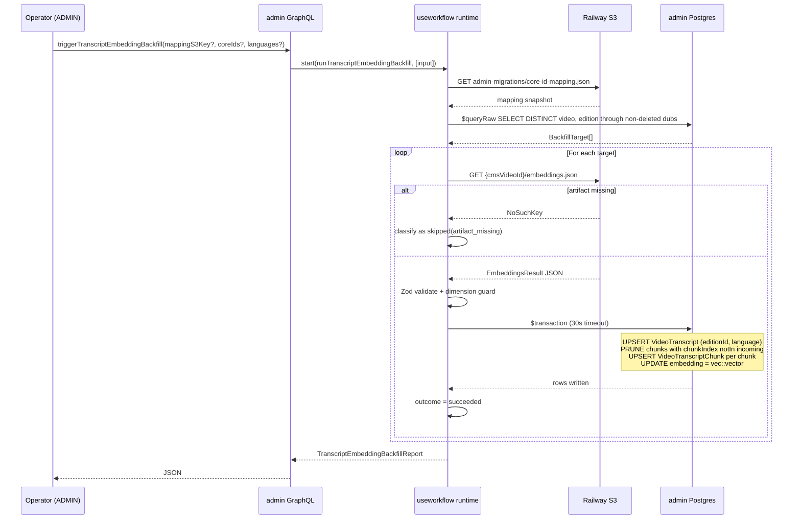

# feat: Port transcript embeddings infrastructure to apps/admin (R2)

## Overview

Port transcript-embedding storage, indexing, and backfill to `apps/admin`,
riding on R1's foundation (see `docs/plans/2026-04-19-001-feat-admin-scene-embeddings-infra-plan.md`).
R2 mirrors R1's shape — new Prisma models, migration, indexer, useworkflow
backfill, ADMIN-only mutation — with **one material divergence**:

**Vectors are reused from `apps/manager`'s `{assetId}/embeddings.json`
artifact rather than regenerated.** Manager's embedding pipeline writes
each chunk's vector alongside its text (see
`apps/manager/src/services/embeddings.ts` `EmbeddingsResult.chunks[].embedding`),
so admin can trust-and-copy the precomputed vectors. Zero OpenRouter
spend on R2 backfill. Admin still validates `dimensions === 1536` and
logs model-stamp drift for future model-upgrade awareness.

## Problem Frame

Admin already has scene embeddings (R1, merged 2026-04-21 via PR #798 +
#818 + #819 + #820; prod smoke still blocked on the operator's Doppler
access — see `docs/handoffs/2026-04-21-admin-migration-r1-smoke-and-r2-handoff.md`).
It still lacks **chunk-level transcript embeddings** — the vector
representation of the video's spoken content, chunked and embedded.
Hybrid search (R4), recommendations (R5), and personalization (R6) all
consume transcript-chunk vectors. Until admin has parity with cms's
`transcript_embeddings` rows, none of those steps can move.

Admin and cms run separate Postgres databases with incompatible
schemas — the same cross-DB constraint that forced R1 to re-index from
S3 rather than copy rows. R2 inherits R1's "read from manager's S3,
persist into admin's pgvector" architecture. R2 additionally inherits
R1's coreId→cmsVideoId mapping file, the shared Railway S3 bucket, and
the workflow dispatch + classification + security conventions R1 proved
out.

## Requirements Trace

- **R2.1** — Admin gains a Prisma model pair: `VideoTranscript` (one per
  `(VideoEdition, language)`) carrying artifact-level metadata, and
  `VideoTranscriptChunk` (one per chunk) carrying chunk text + timecodes
  - `embedding vector(1536)`. Migration `0004` appends after R1's
    `0003`. Partial HNSW indexes per language on chunk embeddings.
    (origin: R2 in playbook)
- **R2.2** — Admin gains an indexer service
  (`transcript-embedding.service.ts`) that reads `embeddings.json` from
  manager's S3 and writes vectors directly (no re-embedding). Idempotent
  upsert; Prisma `$transaction` with explicit 30s timeout; raw
  `::vector` write. (origin: R2)
- **R2.3** — Admin gains a useworkflow durable backfill
  (`transcriptEmbeddingBackfill.ts`) that iterates
  `(video, edition) → transcript` targets, invokes the indexer with
  per-target error isolation, and reports aggregate outcomes. Dispatch
  via `start()` from `workflow/api`; dispatch-level test mandatory.
  (origin: R2; constraint surfaced 2026-04-21 in R1 review)
- **R2.4** — Admin exposes `triggerTranscriptEmbeddingBackfill` GraphQL
  mutation (ADMIN-only via `write:transcript-embeddings` permission).
  Reuses the `mappingS3Key` default `admin-migrations/core-id-mapping.json`.
  Dispatch-site test asserts `start()` invocation. No vector field on
  any exposed Pothos type.
- **R2.5** — R2 reuses R1's `core-id-mapping.service.ts` (loader + safe
  key validator + typed errors) and extends
  `manager-artifacts.service.ts` with a sibling
  `readEmbeddingsArtifact(assetId)` reader + `EmbeddingsResult` Zod
  schema. No new CLI is required; the existing
  `pnpm --filter @forge/admin refresh:core-id-mapping` mapping snapshot
  is the same one R2 consumes.

## Scope Boundaries

- **Not** re-embedding transcript chunks in admin. Vectors come
  verbatim from `EmbeddingsResult.chunks[].embedding`. If the artifact's
  `dimensions` disagrees with admin's expected 1536, the indexer treats
  it as `artifact_invalid` rather than re-embedding.
- **Not** porting manager's transcript generation (transcription,
  chunking, or embedding). Admin remains strictly an indexer. Manager
  continues to own artifact production through R9.
- **Not** indexing per-language per-edition transcripts. Manager today
  writes ONE `{assetId}/embeddings.json` per asset (a single
  source-language transcription per asset — see
  `apps/manager/src/workflows/videoEnrichment.ts` around `stepEmbeddings`).
  R2 honors that cardinality. A future multi-language artifact layout
  (`{assetId}/{lang}/embeddings.json`) would be an additive schema
  concern handled when manager ships it.
- **Not** renaming `generateExperienceEmbedding` → `generateTextEmbedding`.
  The R2 handoff flagged the rename as a reasonable moment of
  opportunity, but R2's hot path does **not** call that helper — vectors
  are reused from S3. The rename is a pure janitorial improvement for
  R1 code and remains deferred.
- **Not** exposing transcript chunk content or vectors via GraphQL
  `t.relation`. Read access is service-layer only (R4/R5 will add the
  required services). Pothos types are scaffolded minimally so R4/R5
  can attach fields without a further migration.
- **Not** supporting metadata-level embedding
  (`EmbeddingsResult.metadataEmbedding`). That's an artifact-level
  field distinct from chunk content; if/when admin needs it, attach to
  `Video` or `VideoLocale` in a later migration. R2 ignores it.
- **Not** adding `SET LOCAL hnsw.ef_search` tuning to R2 writes (write
  path doesn't use HNSW). Read-path tuning — if any R4/R5 service adds
  it — must run inside a `$transaction` per
  `docs/solutions/database-issues/set-local-requires-transaction-for-pgvector-search.md`.
- **Not** provisioning new Railway services or env vars. R2 inherits
  R1's env matrix verbatim (`RAILWAY_S3_*`, `ADMIN_ARTIFACT_DIR`,
  `OPENROUTER_API_KEY`/`OPENAI_API_KEY` only needed if metadata-level
  re-embedding is ever added).
- **Not** deleting cms's `transcript_embeddings` table. cms continues
  serving consumers until R8.

## Context & Research

### Relevant Code and Patterns

- `apps/admin/src/services/scene-embedding.service.ts` — R1 indexer.
  Direct reference for ABAC gate, idempotent upsert ordering, raw
  `$executeRaw` + `::vector` cast, explicit `{ timeout: 30_000 }` on
  `$transaction`, `Promise.allSettled` pre-transaction to isolate
  per-scene failures, typed-error `code`-discriminated class, and the
  pre-transaction prune logic. R2 mirrors each of these explicitly.
- `apps/admin/src/workflows/sceneEmbeddingBackfill.ts` — R1 workflow.
  The `stepLoadMapping → stepEnumerateTargets → stepIndexEditionLocale
→ stepReport` shape is the template. R2's inner dimension is
  `language` instead of `locale` — the enumeration and outcome shape
  stay identical.
- `apps/admin/src/graphql/mutations/scene-embedding.ts` — R1 mutation.
  Provides the `start()` dispatch split, the exported
  `dispatchSceneEmbeddingBackfill` helper, and the `JSON` scalar return
  with internally-typed `Report`. Copy the split shape.
- `apps/admin/src/graphql/mutations/scene-embedding.test.ts` — R1
  dispatch test. Template for the R2 dispatch test; assertions cover
  `start()` call, args-tuple shape, rejection propagation, call count.
- `apps/admin/src/test-helpers/workflow-dispatch.ts` — the `wrapStartSpy`
  helper. Reuse verbatim.
- `apps/admin/src/services/manager-artifacts.service.ts` — R1 artifact
  reader. R2 extends this module with `readEmbeddingsArtifact` and a
  new `EmbeddingsResultSchema`. Keep the `ManagerArtifactError` reuse so
  the workflow's `artifact_missing → skipped` demotion works unchanged.
- `apps/admin/src/services/core-id-mapping.service.ts` and
  `apps/admin/src/services/core-id-mapping.constants.ts` — R1 mapping
  loader. Reuse as-is; no changes needed.
- `apps/admin/src/db/pgvector.ts::toPgVector` — vector literal
  serialization. Same shape for R2.
- `apps/admin/src/db/client.ts` — Prisma client extension that strips
  `embedding` from default result sets. Extend to also strip
  `videoTranscriptChunk.embedding`. The scene-embedding indexer already
  added `videoSceneLocale.embedding`; mirror that registration.
- `apps/admin/prisma/migrations/0003_scene_embeddings/migration.sql` —
  R1 migration. Template for raw-SQL HNSW partial index syntax,
  per-language partial index convention, and the `@@map` → snake-case
  table naming.
- `apps/admin/prisma/schema.prisma` — existing `VideoEdition`,
  `Video`, `VideoSubtitle`, `VideoScene`, `VideoSceneLocale` models.
  R2 attaches via `VideoEdition.transcripts[]` relation.
- `apps/admin/src/scripts/refresh-core-id-mapping.ts` — the R1 CLI; R2
  uses the same produced mapping snapshot.
- `apps/manager/src/services/embeddings.ts` — producer of
  `{assetId}/embeddings.json`. Shape of `EmbeddingsResult`
  (model, dimensions, chunks[], averagedEmbedding, metadata,
  artifactKeys) is the source of truth for the Zod schema. Manager's
  provider-response validation happens at write time (token count,
  response index alignment, dimension check), so admin's read-time
  validation can be lighter but MUST still confirm `dimensions`.
- `apps/manager/src/workflows/videoEnrichment.ts` `stepEmbeddings` —
  confirms one embeddings.json per asset, driven by the asset's
  source-language transcript.

### Institutional Learnings

- **`docs/solutions/best-practices/review-fix-round-2-sibling-call-site-regressions-20260421.md`** —
  the meta-learning from R1's PR #819 + #820. Round-2 review must be
  scoped to the **fix-commit diff** (`git diff ${round1_commit}..${fix_commit}`),
  not the full PR. Grep sibling call sites before marking any round-1
  finding "applied". R2's review-fix loops must apply this verbatim.
- **`docs/solutions/best-practices/workflow-dispatch-test-mode-divergence-20260421.md`** —
  `"use workflow"` directives are inert under vitest but enforced in
  production. Every call site needs a `vi.mock("workflow/api")` +
  `start` spy + `dispatch.expectDispatched(fn, [args])` test. R2's
  `triggerTranscriptEmbeddingBackfill` needs this test from day one.
- **`docs/solutions/best-practices/zod-validation-errors-must-not-echo-user-controlled-input-20260420.md`** —
  don't surface Zod error messages in errors returned to callers if
  the caller's input is echoed back. The R2 indexer's typed error class
  should include a stable `code` discriminant; the human-readable
  message may name the failed field but must not echo the user's input.
  Mirrors R1's `ManagerArtifactError` pattern.
- **`docs/solutions/best-practices/parallel-workflow-error-robustness-20260420.md`** —
  `Promise.allSettled` pre-transaction; typed-error classification with
  `instanceof`/`.code`; exhaustive `switch` on outcome unions with
  `never` fallthrough; explicit `$transaction` timeout. R2 pre-bakes
  each of these; no round-1 findings should be required to surface them.
- **`docs/solutions/performance-issues/pgvector-hnsw-index-bypass-with-where-filter-20260415.md`** —
  global HNSW is silently bypassed when a `WHERE <filter-column> = ?`
  predicate is present on the same table. R2 creates per-language
  partial HNSW indexes (`_hnsw_en`, `_hnsw_es`, `_hnsw_fr`) plus a
  global `WHERE embedding IS NOT NULL` fallback, matching the R1
  pattern for `video_scene_locale`.
- **`docs/solutions/database-issues/set-local-requires-transaction-for-pgvector-search.md`** —
  out-of-scope for R2's write path, but any R4/R5 search service that
  tunes `hnsw.ef_search` must run the `SET LOCAL` and the query inside
  a single `$transaction`.
- **`docs/solutions/best-practices/vector-embedding-storage-scope-sequencing-2026-04-11.md`** —
  transcript chunks live in a dedicated table (one row per chunk);
  metadata/scene/profile vectors are never co-mingled with chunk
  vectors. Validates R2's `VideoTranscriptChunk` granularity and the
  decision to ignore `metadataEmbedding` in R2 scope.
- **`docs/solutions/integration-issues/manager-embeddings-transcript-aware-optional-metadata-2026-04-08.md`** —
  defines the `embeddings.json` contract admin consumes. Provider
  response validation happens inside manager before the artifact is
  written; admin's read-time responsibility is shape + dimension +
  chunk-index uniqueness. (Surfaced by learnings-researcher 2026-04-22.)
- **`docs/solutions/integration-issues/manager-job-read-model-source-language-metadata-20260409.md`** —
  manager sometimes falls back to English when the requested source
  language isn't available (`sourceSelectionReason: "fallback-en"`).
  When attributing BCP-47 on `VideoTranscript.language`, stamp the
  **actual** transcribed language from the artifact's
  `metadata.chunkingStrategy` (or infer from the transcript payload
  manager emits), not from the caller's request. (Surfaced by
  learnings-researcher 2026-04-22.)
- **`docs/solutions/cms/admin-app-data-model-decisions.md`** — admin's
  attach-where-semantics-live principle. Transcript chunks attach to
  `VideoEdition` because chunk timecodes derive from the edition's cut
  — same reasoning as `VideoSubtitle` and `VideoScene`.
- **`docs/solutions/platform/admin-scene-embeddings-indexer-pattern.md`** —
  R1's durable-learning doc. R2 will land a sibling doc after merge
  that captures the **cross-service vector-reuse trust boundary**
  (model-stamp drift warning, dimension hard-guard, artifact-to-DB
  copy ergonomics) — this is a net-new compound learning R1 doesn't
  cover.

### External References

- None required. Local patterns + institutional learnings are
  comprehensive. No external research pass.

## Key Technical Decisions

- **Two-table shape: `VideoTranscript` (parent) + `VideoTranscriptChunk`
  (child).** Parent holds per-run artifact metadata (model, dimensions,
  chunking strategy, totalChunks, totalTokens, generatedAt). Child
  holds one row per chunk with its vector.
  **Why:** mirrors R1's `VideoScene` + `VideoSceneLocale` parent-child
  shape so operators and future authors see a consistent pattern across
  admin. Parent-level metadata makes "has this edition's transcript
  been indexed?" a one-row check without `COUNT(*)` scanning. Chunk
  language is denormalized onto the child for partial HNSW.

- **Attachment point: `VideoEdition`.** Same reasoning as
  `VideoSubtitle` and `VideoScene` — chunk timecodes follow the
  edition's cut.
  **Why:** admin's `attach-where-semantics-live` principle. If a video
  has multiple editions reachable through dubs, R2's backfill writes
  one transcript-per-edition using the same artifact, matching R1's
  enumeration pattern. Timecode drift across cuts is an existing
  data-quality concern independent of R2 schema.

- **`language` is denormalized onto `VideoTranscriptChunk`.** Partial
  HNSW filter columns must live on the indexed table; filtering through
  a parent join defeats HNSW. Enforce `chunk.language === parent.language`
  via indexer logic (not DB constraint — Postgres doesn't support
  cross-row CHECK constraints cleanly).
  **Why:** the pgvector HNSW bypass learning — queries that
  `WHERE language = ?` against chunks must hit a per-language partial
  index.

- **Vectors reused from manager's artifact, not regenerated.** The
  artifact's `chunks[].embedding` is trusted after two explicit guards:
  dimensions === 1536 (hard reject as `artifact_invalid`) and model
  string (log-only warning on mismatch).
  **Why:** R2's single material divergence from R1. Manager already
  ran the provider with validation; re-running from admin would double
  the provider spend for identical output. Model-mismatch warning
  preserves future observability when admin ever needs to re-embed
  after a model upgrade.

- **Language attribution comes from the artifact, not the caller.** The
  indexer infers the transcript language from
  `EmbeddingsResult.metadata.chunkingStrategy` (or the upstream
  transcript manifest — implementation confirms which field during
  Unit 3). Caller-supplied language filters in the workflow restrict
  which targets are processed, but do not override the actual
  transcribed language stamped on `VideoTranscript.language`.
  **Why:** the manager-source-language-metadata learning — manager
  falls back to English sometimes; stamping the caller's requested
  language would hide the fallback from downstream reads.

- **One artifact → one transcript per edition.** Manager writes a
  single `{assetId}/embeddings.json` per asset, tied to one source
  language. R2 writes one `VideoTranscript` row per `(editionId,
artifact-reported-language)`. If/when manager layers
  `{assetId}/{lang}/embeddings.json`, R2's artifact-key resolver
  extends additively — no schema change.
  **Why:** preserve parity with current manager cardinality without
  encoding future structure speculatively.

- **Per-language partial HNSW indexes + global NULL-excluded fallback.**
  Three per-language partial indexes (en/es/fr — the Phase 1 languages
  matching R1) plus a global partial index on `embedding IS NOT NULL`.
  **Why:** mirrors R1's verified pattern. Unknown-language queries hit
  the global index; known-language queries hit the per-language index;
  no WHERE-induced bypass.

- **Idempotent upsert keyed on `(editionId, language)` for transcript
  and `(transcriptId, chunkIndex)` for chunks.** Re-running the
  indexer overwrites chunks in place. Pre-transaction prune removes
  chunks whose `chunkIndex` is outside the incoming range (manager
  re-chunks with fewer segments, for example).
  **Why:** matches R1's upsert-then-prune pattern. Avoids the
  delete-then-insert window where a concurrent reader sees zero rows.

- **Artifact read, Zod validate, dimension guard happen BEFORE the
  `$transaction`.** The transaction wraps only DB writes. Provider-side
  work (in R2's case, pure artifact parsing) stays outside the
  transaction window so 30s timeout covers only row upserts + vector
  writes.
  **Why:** same rationale as R1 — keep transaction windows short; make
  per-chunk validation failures reject the whole artifact cleanly
  without half-writing.

- **Typed error class: `TranscriptIndexError` with `code`
  discriminant.** Codes: `forbidden`, `missing_cms_video_id`,
  `dimension_mismatch`, `empty_chunk_text`. `artifact_missing` /
  `artifact_invalid` come from the sibling `ManagerArtifactError` and
  are re-thrown unchanged. The workflow demotes only
  `ManagerArtifactError.code === "artifact_missing"` to `skipped`;
  every `TranscriptIndexError` other than that is a failure the
  operator must see. **[Revised post-review 2026-04-22]** The earlier
  draft included a `duplicate_chunk_index` code; round-1 review
  observed that `chunkIndex` is derived from the loop counter at the
  service layer, so uniqueness is guaranteed by construction and the
  runtime assertion was unreachable. The code was dropped from the
  union and the synchronous duplicate check was removed.
  **Why:** mirrors `SceneIndexError` / `ManagerArtifactError`. Keeps
  the workflow's per-target branching by typed-error class, not by
  error-message regex.

- **Reuse R1's `BackfillTarget` shape via soft import.** The target
  struct (`{ videoId, videoEditionId, coreId, cmsVideoId }`) is
  identical. Either extract it to a shared module or copy the type
  and keep the two workflows independent.
  **Decision:** copy the type into the R2 workflow. Shared-module
  extraction is a refactor opportunity during review if a second
  consumer exists (R5 recommendations likely will need it).
  **Why:** avoid a cross-workflow dependency this early. The type is
  five lines and the semantics match exactly.

- **Permission key: `write:transcript-embeddings`.** New entry in the
  `PermissionKey` matrix, ADMIN and SYSTEM tiers only.
  **Why:** matches R1's `write:scene-embeddings`. Compile error if the
  matrix entry is missing (per admin's permission system design).

- **Mutation defaults match R1.** `mappingS3Key` defaults to
  `admin-migrations/core-id-mapping.json` (imported from R1's
  constants module). `coreIds` and `languages` optional with
  length-0 arrays treated as "omitted" (see R1 workflow's empty-array
  handling in `sceneEmbeddingBackfill.ts`).
  **Why:** preserve the operator's muscle memory across R1 and R2 —
  the commands look identical aside from the mutation name.

- **Dispatch-first-class test.** Mutation file exports a
  `dispatchTranscriptEmbeddingBackfill` helper that wraps
  `start(runTranscriptEmbeddingBackfill, [input])`. Dispatch test
  asserts the helper calls `start()` with the right function reference
  and args-tuple.
  **Why:** R1 proved in production that workflow-body tests don't
  catch missing `start()` wrappers. Non-negotiable per the dispatch
  divergence learning.

## Open Questions

### Resolved During Planning

- **Artifact cardinality: per-asset or per-(asset, language)?**
  → One `{assetId}/embeddings.json` per asset, confirmed by reading
  `apps/manager/src/services/storage.ts::artifactKey` and
  `apps/manager/src/workflows/videoEnrichment.ts::stepEmbeddings`.
  Manager runs embeddings once per video-enrichment pass against the
  source-language transcript.
- **Are vectors cached in S3?** → Yes. `EmbeddingsResult.chunks[i].embedding`
  carries the vector directly. R2 reuses; R1 could not (scene-analysis
  artifacts are text-only).
- **Vector dimensions: match R1?** → Yes. `text-embedding-3-small` is
  1536d across both admin and manager. Hard-guard on artifact read.
- **Attachment point: Video, VideoLocale, or VideoEdition?**
  → `VideoEdition`, matching `VideoSubtitle` and `VideoScene`.
- **Schema split: per-locale rows like R1 or parent-chunks?**
  → Parent-chunks. Transcripts aren't locale-translated; chunks are
  per-artifact child rows. `language` denormalized onto chunks for HNSW.
- **Model string handling if it doesn't match admin's expected model?**
  → Log warning, proceed. The whole point of R2's vector reuse is to
  trust manager's stamp. Hard-reject would re-introduce the cost
  manager already paid. A future model-upgrade workflow can re-embed
  selectively.
- **Does R2 need a new CLI?** → No. `pnpm --filter @forge/admin
refresh:core-id-mapping` already produces the snapshot R2 consumes.
- **Should R2 rename `generateExperienceEmbedding`?** → No. R2 doesn't
  call that helper. Rename remains optional janitorial work on R1.
- **Plan sequence number:** `2026-04-22-002` — two `001`s already
  exist today (`feat-admin-core-consumer-migration` and
  `refactor-demo-search-canonical-ux`); `002` is the next free slot.

### Deferred to Implementation

- **[R2.1][Technical]** Exact FK shape for `VideoTranscript.videoEditionId`
  and `VideoTranscriptChunk.transcriptId`. Follow the types used by
  `VideoSubtitle.videoEditionId` and `VideoScene.videoEditionId` (both
  `String @map("video_edition_id")`). Denormalize `videoId` onto
  `VideoTranscript` for join convenience if the first R4/R5 query
  shape would benefit — match `VideoScene`'s `videoId` denorm pattern.
- **[R2.2][Technical]** Exact source for the `language` field stamped
  on `VideoTranscript`. Candidates: (a) a new top-level
  `transcript.language` field manager adds to `EmbeddingsResult` (not
  present today — would require a manager PR), (b) infer from
  `Video.primaryLanguageId` on the admin side, (c) caller-supplied
  workflow argument. Safest default: caller-supplied with a fallback
  to admin's `Video.primaryLanguageId`; if manager's artifact grows a
  language field later, adopt it then.
- **[R2.2][Technical]** Whether to validate chunk `startTime`/`endTime`
  monotonicity during read. Manager's segment-aware chunking should
  produce monotonic chunks; a broken artifact is a manager bug. R2's
  call: warn on non-monotonic and proceed (log-only) rather than reject.
- **[R2.3][Needs research]** useworkflow handling of the (edition,
  language) target tuple for the artifact's single-language case.
  Likely one `stepIndexEditionTranscript(target)` call per edition
  with language inferred from the artifact. Confirm during
  implementation that the step's retry semantics survive a partial
  prune.
- **[R2.2][Technical]** Whether to fail fast on `artifact.model`
  mismatch or continue. Decision pre-baked as "log-only" but the
  threshold may shift if the first real backfill reveals a model
  transition is underway in manager.
- **[R2.1][Technical]** Whether to add a partial composite index
  `(video_edition_id, language)` on `video_transcript` for "does this
  edition have any transcript?" queries. Likely yes — add during
  migration review if R4/R5 planning confirms the query shape.

## High-Level Technical Design

> _This illustrates the intended approach and is directional guidance
> for review, not implementation specification. The implementing agent
> should treat it as context, not code to reproduce._

### Data flow



### Prisma model shape (directional)

```
model VideoTranscript {
  id              String   // cuid
  videoEditionId  String   // FK
  videoId         String   // denormalized
  language        String   // BCP-47, stamped from artifact
  model           String
  dimensions      Int
  chunkingType    String   // "segment-aware" | "plain-text"
  maxChunkTokens  Int
  overlapTokens   Int
  totalChunks     Int
  totalTokens     Int
  generatedAt     DateTime // artifact's stamp
  createdAt       DateTime
  updatedAt       DateTime

  edition VideoEdition
  video   Video
  chunks  VideoTranscriptChunk[]

  @@unique([videoEditionId, language])
  @@index([videoId])
  @@map("video_transcript")
}

model VideoTranscriptChunk {
  id              String
  transcriptId    String   // FK
  language        String   // denormalized for partial HNSW
  chunkIndex      Int
  chunkId         String   // manager's chunk identifier (e.g. "chunk-0")
  text            String
  tokenCount      Int
  startSeconds    Float?
  endSeconds      Float?
  embedding       Unsupported("vector(1536)")?
  model           String
  dimensions      Int
  createdAt       DateTime
  updatedAt       DateTime

  transcript      VideoTranscript

  @@unique([transcriptId, chunkIndex])
  @@index([language])
  @@map("video_transcript_chunk")
}
```

Raw migration SQL (in addition to table DDL) creates:

```
CREATE INDEX video_transcript_chunk_embedding_hnsw
  ON video_transcript_chunk USING hnsw (embedding vector_cosine_ops)
  WHERE embedding IS NOT NULL;

CREATE INDEX video_transcript_chunk_embedding_hnsw_en
  ON video_transcript_chunk USING hnsw (embedding vector_cosine_ops)
  WHERE embedding IS NOT NULL AND language = 'en';
-- repeat for es, fr
```

## Implementation Units

- [ ] **Unit 1: Prisma schema — `VideoTranscript` + `VideoTranscriptChunk` + migration 0004**

**Goal:** Define the R2 data model, append migration `0004_transcript_embeddings`
after R1's `0003`, create per-language partial HNSW indexes, wire the
relation to `VideoEdition`.

**Requirements:** R2.1

**Dependencies:** none

**Files:**

- Modify: `apps/admin/prisma/schema.prisma` (add two models, add
  `transcripts` back-relation on `VideoEdition`, add `transcripts`
  back-relation on `Video`)
- Create: `apps/admin/prisma/migrations/0004_transcript_embeddings/migration.sql`
- Modify: `apps/admin/src/graphql/classification.test.ts` (register
  `VideoTranscript` + `VideoTranscriptChunk` in the allowed registry
  with `@classification public-shape` — chunk text and timecodes are
  public-shape; the vector column is the security-sensitive field and
  is field-list-excluded, not classification-excluded)
- Modify: `apps/admin/src/graphql/schema.test.ts` (extend the
  "no embed/vector/similarit" assertion coverage — no action required
  if the existing regex scans the full SDL; confirm coverage during
  review)
- Modify: `apps/admin/src/db/client.ts` (extend embedding-strip Prisma
  client extension to cover `videoTranscriptChunk.embedding` alongside
  `experienceLocale.embedding` and `videoSceneLocale.embedding`)

**Approach:**

- FK: `VideoTranscript.videoEditionId → video_edition.id ON DELETE CASCADE`.
- FK: `VideoTranscript.videoId → video.id ON DELETE CASCADE`.
- FK: `VideoTranscriptChunk.transcriptId → video_transcript.id ON
DELETE CASCADE`.
- Unique: `(videoEditionId, language)` on `VideoTranscript`;
  `(transcriptId, chunkIndex)` on `VideoTranscriptChunk`.
- `embedding`: `Unsupported("vector(1536)")?` on chunk.
- Partial HNSW per Phase 1 language (en/es/fr) + global NULL-excluded
  fallback, all keyed on `embedding IS NOT NULL`.
- Denormalize `language` on chunk (indexer keeps `chunk.language ===
transcript.language` in sync — no DB-level CHECK).
- Append migration **only** — do not touch 0001–0003.
- After schema changes, run `pnpm --filter @forge/admin db:generate`
  to surface any Pothos/Prisma plugin type drift.

**Patterns to follow:**

- `apps/admin/prisma/migrations/0003_scene_embeddings/migration.sql`
  for SQL shape, snake_casing, default literals, HNSW index syntax.
- `apps/admin/prisma/schema.prisma` existing `VideoScene` +
  `VideoSceneLocale` for doc comments, `@@unique`, `@@index`,
  `@@map` conventions.
- `apps/admin/src/db/client.ts` existing embedding-strip registrations.

**Test scenarios:**

- `db:generate` produces no type errors.
- `db:migrate:dev` applies 0004 cleanly against a fresh Postgres with
  pgvector extension.
- `\d video_transcript_chunk` (psql) lists three per-language partial
  HNSW indexes + the global one.
- `classification.test.ts` continues to pass with new types registered.
- `schema.test.ts` "no embed/vector/similarit" assertion passes — the
  vector column must be absent from every exposed type's field list.
- Attempting to `SELECT embedding` via Prisma's default client returns
  undefined (client extension strip working).

**Verification:**

- `pnpm --filter @forge/admin db:generate` green.
- `pnpm --filter @forge/admin db:migrate:dev` applies and reports
  0004 as a new migration; replays idempotently on re-run.
- `pnpm --filter @forge/admin typecheck` green.
- Migration diff reviewed against R1's `0003` for symmetry.

- [ ] **Unit 2: Extend `manager-artifacts.service.ts` with embeddings artifact reader**

**Goal:** Read `{assetId}/embeddings.json` from the shared Railway S3
bucket and return a Zod-validated `EmbeddingsResult`. Reuse
`ManagerArtifactError`.

**Requirements:** R2.5

**Dependencies:** none

**Files:**

- Modify: `apps/admin/src/services/manager-artifacts.service.ts`
  (add `EmbeddingsResultSchema`, add `readEmbeddingsArtifact`)
- Modify: `apps/admin/src/services/manager-artifacts.service.test.ts`
  (cover new reader)

**Approach:**

- Model the Zod schema on `EmbeddingsResult` from
  `apps/manager/src/services/embeddings.ts` — `model`, `dimensions`,
  `chunks[]` (each with `chunkId`, `text`, `embedding`, `metadata:
{ tokenCount, startTime?, endTime? }`), `averagedEmbedding`,
  `metadata` (with `totalChunks`, `totalTokens`, `chunkingStrategy`,
  `embeddingDimensions`, `generatedAt`), `metadataEmbedding?`,
  `artifactKeys`.
- `EmbeddingsResultSchema.chunks[].embedding`: `z.array(z.number().finite())`
  with `.nonempty()`.
- Use `.passthrough()` at the top level to tolerate future
  manager-side additions; `.strict()` at the chunk level to catch
  shape drift that would corrupt vector storage.
- Reuse `readArtifact(assetId, "embeddings", "json")` via
  `@/storage/s3` — same helper R1 uses.
- Classify errors identically to `readSceneAnalysisArtifact`:
  `ManagerArtifactError` with codes `artifact_missing` |
  `artifact_invalid` | `artifact_read_failed`. Do not echo user-
  controlled fields in error messages (see zod-echo learning); log
  Zod's detail server-side only.
- Export `EmbeddingsArtifact` type alias from the inferred Zod type.

**Patterns to follow:**

- `readSceneAnalysisArtifact` and `SceneAnalysisResultSchema` in the
  same file — copy the shape, swap the content schema.
- `docs/solutions/best-practices/zod-validation-errors-must-not-echo-user-controlled-input-20260420.md`.

**Test scenarios:**

- Parses a minimal valid artifact (1 chunk, dimensions=1536) and
  returns the typed result.
- Throws `ManagerArtifactError("artifact_missing")` for `NoSuchKey` /
  `ENOENT`.
- Throws `ManagerArtifactError("artifact_invalid")` for non-JSON
  content.
- Throws `ManagerArtifactError("artifact_invalid")` when a chunk is
  missing `embedding` or `chunkId`.
- Throws `ManagerArtifactError("artifact_invalid")` when `dimensions`
  is missing or non-positive.
- Throws `ManagerArtifactError("artifact_read_failed")` for an S3
  transport error that isn't a missing-key discriminant.
- Tolerates an artifact with an unknown top-level field (via
  `.passthrough()`).
- Does NOT echo user-controlled fields in `artifact_invalid.message`.

**Verification:**

- Unit tests green.
- Error message inspection in the `artifact_invalid` path confirms no
  user-controlled content leaked (reviewer spot-check).

- [ ] **Unit 3: Transcript indexer service**

**Goal:** Implement `indexEditionTranscript(prisma, input)` — ABAC
gate, artifact read, dimension guard, transaction-scoped upsert of
`VideoTranscript` + `VideoTranscriptChunk`, raw `::vector` writes,
return a typed `IndexEditionTranscriptResult`.

**Requirements:** R2.2

**Dependencies:** Unit 1, Unit 2

**Files:**

- Create: `apps/admin/src/services/transcript-embedding.service.ts`
- Create: `apps/admin/src/services/transcript-embedding.service.test.ts`

**Execution note:** Pre-bake R1's review learnings on first draft.
`Promise.allSettled` is not required (no per-chunk provider call) but
the artifact-level dimension guard must happen before any DB write;
inside the `$transaction` only DB operations run. Explicit
`{ timeout: 30_000 }`. Typed-error discriminants as specified in Key
Technical Decisions.

**Approach:**

- Export:
  - `type IndexEditionTranscriptInput = { editionId, videoId, coreId,
user, artifactOverride?, cmsVideoIdOverride?, cmsVideoId? }` —
    `language` is inferred from the artifact, not accepted as input.
    (Unless the deferred `language` decision lands as "caller-supplied
    with fallback" — in which case `language?: string` is added and
    used as a hint, not an override.)
  - `type IndexEditionTranscriptResult = { editionId, language,
chunksIndexed, embeddingsWritten, chunksSkipped, chunksPruned,
model, dimensions }`.
  - `class TranscriptIndexError extends Error` with `readonly code`
    from the discriminant list in Key Technical Decisions.
  - `async function indexEditionTranscript(prisma, input):
Promise<IndexEditionTranscriptResult>`.
- ABAC gate at entry: `if (!canWriteDerived(user)) throw
TranscriptIndexError("forbidden", ...)`.
- Resolve `cmsVideoId` (override or required arg).
- Read artifact via `readEmbeddingsArtifact(String(cmsVideoId))` or
  use `artifactOverride` if supplied.
- Early return for `artifact.chunks.length === 0` (same pattern as
  R1's empty-scenes branch).
- Validate `artifact.dimensions === 1536` — else
  `TranscriptIndexError("dimension_mismatch")`.
- Log-only model-stamp mismatch: if
  `artifact.model !== EXPECTED_MODEL_STAMP`, `console.warn` a
  structured line with `{ event: "transcript_model_mismatch",
artifactModel, expected }`. Continue.
- Validate chunk invariants synchronously:
  - All `chunk.embedding.length === 1536` (else `dimension_mismatch`).
  - _(historical note)_ The earlier draft validated that no
    `chunkIndex` repeats. Dropped post-review because the indexer
    derives `chunkIndex` from the loop counter, so uniqueness is a
    construction invariant rather than a runtime-checkable condition.
  - No empty `text` (else `empty_chunk_text`) — soft fail per the
    "defensible-defaults" principle; warn-and-skip is also acceptable
    if review deems empty chunks a manager-side bug rather than
    admin's rejection concern.
- Derive `language` per the deferred decision (inferred from artifact
  or caller-hint+fallback).
- Start `prisma.$transaction(async (tx) => { ... }, { timeout: 30_000 })`:
  - Upsert `VideoTranscript` by `(videoEditionId, language)` composite
    unique. `create` sets artifact-metadata fields; `update` refreshes
    them (model/dimensions/chunking strategy/generatedAt/totalChunks/
    totalTokens).
  - Prune chunks via `tx.videoTranscriptChunk.deleteMany({ where: {
transcriptId, chunkIndex: { notIn: incomingChunkIndexes } } })`
    (mirrors R1's `scenesPruned` pattern).
  - For each incoming chunk:
    - Upsert `VideoTranscriptChunk` by `(transcriptId, chunkIndex)`.
    - `tx.$executeRaw\`UPDATE video_transcript_chunk SET embedding =
      ${toPgVector(chunk.embedding)}::vector, updated_at = NOW()
      WHERE id = ${chunkId}\``.
- Return the typed result.

**Patterns to follow:**

- `apps/admin/src/services/scene-embedding.service.ts` — whole file.
  Adjust the inner loop for chunks-not-scenes and strip the
  `Promise.allSettled` fan-out for provider calls (R2 has none).
- `apps/admin/src/services/embeddings.service.ts::writeExperienceLocaleEmbedding`
  — `::vector` cast pattern.
- `docs/solutions/best-practices/parallel-workflow-error-robustness-20260420.md`
  for exhaustive switch + typed-error classification.

**Test scenarios:**

- Given a valid artifact with 3 chunks (dimensions=1536), writes 1
  `VideoTranscript` row and 3 `VideoTranscriptChunk` rows with
  `embedding IS NOT NULL`.
- Re-running for the same `(edition, language)` keeps the 3 rows
  stable; updates metadata fields on the parent and overwrites chunk
  text if manager re-chunked.
- Re-running with fewer chunks (5 → 3) prunes the 2 stale chunks;
  returns `chunksPruned: 2`.
- Empty `chunks: []` returns `{ chunksIndexed: 0 }` without writing
  rows.
- Dimension mismatch on artifact throws
  `TranscriptIndexError("dimension_mismatch")` and writes nothing.
- Model mismatch logs a warning and proceeds successfully.
- _(Retired post-review)_ An earlier draft tested duplicate
  `chunkIndex` rejection. Removed because `chunkIndex` is derived
  from the loop counter and cannot duplicate by construction.
- `canWriteDerived(null)` (public principal) throws
  `TranscriptIndexError("forbidden")`.
- `ADMIN` principal passes.
- Prisma client default reads of `VideoTranscriptChunk` do NOT
  include `embedding`.
- Transaction rollback: injected failure inside `$transaction` leaves
  DB state unchanged (no partial chunks).

**Verification:**

- Unit tests green against a disposable Postgres with pgvector.
- `SELECT COUNT(*) FROM video_transcript_chunk WHERE embedding IS
NOT NULL` grows by exactly `chunks.length` per successful run.
- `pnpm --filter @forge/admin typecheck` / `lint` / `test` green.

- [ ] **Unit 4: Backfill workflow**

**Goal:** Durable useworkflow job that enumerates
`(video, edition)` targets via the coreId mapping, invokes the
transcript indexer per target, isolates per-target failures, and
reports aggregate outcomes. Matches R1's workflow shape exactly.

**Requirements:** R2.3

**Dependencies:** Unit 3

**Files:**

- Create: `apps/admin/src/workflows/transcriptEmbeddingBackfill.ts`
- Create: `apps/admin/src/workflows/transcriptEmbeddingBackfill.test.ts`

**Execution note:** Test-first for the loop, error-classification, and
empty-input branches (mock the indexer; inject typed failures; assert
the workflow continues and logs each outcome). Do NOT test the
dispatch boundary here — that belongs in Unit 5's mutation test per
the dispatch-divergence learning.

**Approach:**

- Workflow entry:
  `async function runTranscriptEmbeddingBackfill(input:
TranscriptEmbeddingBackfillInput): Promise<TranscriptEmbeddingBackfillReport>`
  with the `"use workflow"` directive.
- Input shape: `{ mappingS3Key: string, coreIds?: readonly string[],
languages?: readonly string[] }`. Empty arrays treated as "omitted"
  (match R1's
  `sceneEmbeddingBackfill.ts::runSceneEmbeddingBackfill` guard).
- Steps (all `"use step"`):
  - `stepLoadMapping(mappingS3Key)` → calls `loadCoreIdMapping`.
  - `stepEnumerateTargets(coreIdFilter, mapping)` → same raw SQL as
    R1: `SELECT DISTINCT v.id, e.id, v.core_id FROM video v JOIN
video_dub d ON ... JOIN video_edition e ON ... WHERE
deleted_at IS NULL`. Filter by `coreIdFilter` and by the mapping
    `Map`. Returns `BackfillTarget[]`.
  - `stepIndexEditionTranscript(target, languageHint?)` → calls
    `indexEditionTranscript(prisma, { editionId, videoId, coreId,
cmsVideoId, user: SYSTEM_PRINCIPAL })`. Catch errors; classify
    `ManagerArtifactError.code === "artifact_missing"` as `skipped`;
    every other error as `failed`.
  - `stepReport({ outcomes, ... })` → aggregate with exhaustive
    `switch` + `_exhaustive: never` fallthrough.
- Outcome union: `succeeded` | `skipped` | `failed`, each carrying
  `target`, `language`, `durationMs`, and success-shape or
  failure-reason.
- Languages filter interpretation: because each edition has (today)
  one transcript language stamped by manager, the `languages` filter
  narrows which outcomes to keep, not which artifacts to fetch. The
  indexer reports the actual language; the workflow filters the final
  outcomes by caller-supplied `languages` (if any).
- `SYSTEM_PRINCIPAL` copied from R1's workflow.
- Structured logs per outcome (JSON lines with workflow name, event,
  coreId, videoEditionId, language, counts, duration).
- Export `_internals` for body-test access to pure helpers
  (`stepReport`, `logOutcome`, …), mirroring R1.

**Patterns to follow:**

- `apps/admin/src/workflows/sceneEmbeddingBackfill.ts` whole file.
- `docs/solutions/platform/backfill-worker-pattern-manager-20260407.md`
  for output-table-as-progress-tracker.
- `docs/solutions/best-practices/parallel-workflow-error-robustness-20260420.md`.

**Test scenarios:**

- 3 targets × 1 language each (manager's current shape) → 3 outcomes
  of `succeeded`, `totalTargets: 3`.
- Indexer throws `ManagerArtifactError("artifact_missing")` for 1
  target → outcome is `skipped`, not `failed`.
- Indexer throws any other error for 1 target → outcome is `failed`,
  error message surfaced, workflow continues for remaining targets.
- `coreIds: ["core-1"]` filter restricts enumeration to 1 target.
- `coreIds: []` behaves as if omitted (all targets).
- `languages: ["es"]` filter drops outcomes whose indexer-reported
  language is not `es`.
- `languages: []` behaves as if omitted (all languages).
- Empty `targets` returns `{ totalTargets: 0, succeeded: 0 }` with no
  indexer calls.
- Soft-deleted dubs excluded from enumeration (verified by fixture:
  1 live edition + 1 edition whose only dub is soft-deleted should
  yield 1 target).
- `stepReport` exhaustive-switch fails at compile time if the outcome
  union gains a new variant (negative test via `@ts-expect-error` on a
  synthetic variant).

**Verification:**

- Body tests green.
- `pnpm --filter @forge/admin typecheck` green.
- Structured log output reviewed manually against the event-name
  conventions (`transcript_index_complete`, `transcript_index_skipped`,
  `transcript_index_failed`).

- [ ] **Unit 5: GraphQL mutation + dispatch helper + dispatch test**

**Goal:** Expose `triggerTranscriptEmbeddingBackfill` mutation with
ADMIN-only scope, dispatch via `start()` from `workflow/api`, and
lock the dispatch boundary with a dedicated test.

**Requirements:** R2.4

**Dependencies:** Unit 4

**Files:**

- Create: `apps/admin/src/graphql/mutations/transcript-embedding.ts`
- Create: `apps/admin/src/graphql/mutations/transcript-embedding.test.ts`
- Modify: `apps/admin/src/graphql/schema.ts` (side-effect import of
  new mutation module, respecting the `reference.ts`-first import
  ordering)
- Modify: `apps/admin/src/auth/permissions.ts` (add
  `write:transcript-embeddings` to the `PermissionKey` matrix with
  ADMIN and SYSTEM tiers)

**Execution note:** Dispatch test mandatory. Compile-time error from
the `PermissionKey` matrix must surface if the new key is added
without a matrix entry; do not bypass the matrix. Follow the
`wrapStartSpy` + `vi.hoisted` pattern from R1's mutation test.

**Approach:**

- Mutation arg shape mirrors R1:
  - `mappingS3Key: string = DEFAULT_CORE_ID_MAPPING_S3_KEY` (imported
    from `@/services/core-id-mapping.service`).
  - `coreIds: [String!]?` — "Omitted = all mapped videos."
  - `languages: [String!]?` — "Omitted = ['en', 'es', 'fr']."
- Auth scope: `authScopes: { hasPermission: "write:transcript-embeddings" }`.
- Return type: `JSON` (mirrors R1); internal typed as
  `TranscriptEmbeddingBackfillReport`.
- Export `async function dispatchTranscriptEmbeddingBackfill(input):
Promise<TranscriptEmbeddingBackfillReport>` that calls
  `start(runTranscriptEmbeddingBackfill, [input])` and returns
  `run.returnValue`.
- Resolver body: argument normalization (empty-array → undefined),
  then call `dispatchTranscriptEmbeddingBackfill(normalizedInput)`.

**Patterns to follow:**

- `apps/admin/src/graphql/mutations/scene-embedding.ts` and
  `scene-embedding.test.ts` verbatim shape.
- `apps/admin/src/test-helpers/workflow-dispatch.ts::wrapStartSpy`.
- `docs/solutions/best-practices/workflow-dispatch-test-mode-divergence-20260421.md`.

**Test scenarios:**

- Dispatch test: `dispatchTranscriptEmbeddingBackfill(input)` calls
  `start(runTranscriptEmbeddingBackfill, [input])` exactly once with
  the right args tuple.
- Dispatch test: omitting optional filters passes `undefined` through
  without coercion.
- Dispatch test: workflow rejection propagates as a thrown error.
- Dispatch test: `expect(start).toHaveBeenCalledTimes(1)` per call.
- Auth test (resolver-level, separate file or in this one depending on
  how R1 structures it): unauthenticated request rejected; EDITOR
  rejected; ADMIN accepted.
- Negative: passing a `mappingS3Key` outside the
  `admin-migrations/` prefix surfaces as a workflow-level failure
  (already handled by `core-id-mapping.service::assertMappingS3KeyAllowed`;
  the test asserts the rejection path).

**Verification:**

- Dispatch test green.
- Resolver test green.
- `pnpm --filter @forge/admin test` suite green.
- GraphQL introspection includes
  `triggerTranscriptEmbeddingBackfill` with the documented arg
  descriptions.
- No `embedding|vector|similarit` fields appear on the new Pothos
  types via introspection.

- [ ] **Unit 6: Pothos type scaffolding for read paths**

**Goal:** Add minimal Pothos types for `VideoTranscript` and
`VideoTranscriptChunk` so R4 (hybrid search) and R5
(recommendations) can attach relation fields without a further
migration. `embedding` column explicitly excluded from every type's
field list.

**Requirements:** R2.4 (parity with R1's scene-types scaffolding)

**Dependencies:** Unit 1

**Files:**

- Create: `apps/admin/src/graphql/types/videoTranscript.ts`
- Modify: `apps/admin/src/graphql/schema.ts` (side-effect import of
  the new type module, respecting the reference.ts-first convention —
  see admin/CLAUDE.md)
- Modify: `apps/admin/src/graphql/classification.test.ts` (register
  both types; confirm they're `@classification public-shape`)

**Approach:**

- `builder.prismaObject("VideoTranscript", {...})` with `@classification
public-shape` JSDoc tag. Fields: `id`, `videoEditionId`, `videoId`,
  `language`, `model`, `dimensions`, `totalChunks`, `totalTokens`,
  `generatedAt`, `createdAt`, `updatedAt`. Omit `chunkingType`,
  `maxChunkTokens`, `overlapTokens` unless a downstream consumer
  needs them (YAGNI).
- `builder.prismaObject("VideoTranscriptChunk", {...})` with
  `@classification public-shape`. Fields: `id`, `transcriptId`,
  `language`, `chunkIndex`, `chunkId`, `text`, `tokenCount`,
  `startSeconds`, `endSeconds`, `model`, `dimensions`, `createdAt`,
  `updatedAt`. **Omit `embedding` from the field list.**
- Do not add `t.relation("chunks")` or similar until R4/R5 need it —
  adding an unused relation clutters the SDL.

**Patterns to follow:**

- `apps/admin/src/graphql/types/videoScene.ts` (R1's scaffolding) —
  same field-list-omit-embedding pattern.
- `apps/admin/src/graphql/types/reference.ts` import ordering.

**Test scenarios:**

- `classification.test.ts` asserts both types are registered with
  `@classification public-shape`.
- `schema.test.ts` "no embed/vector/similarit" regex passes — runs
  against the full SDL.
- GraphQL introspection includes `VideoTranscript` and
  `VideoTranscriptChunk` without an `embedding` field.

**Verification:**

- Type registration and introspection confirmed.
- `pnpm --filter @forge/admin test` green.

- [ ] **Unit 7: End-to-end smoke + CLAUDE.md + durable-learning doc**

**Goal:** Confirm the chain (mapping → artifact reader → indexer →
workflow → persisted rows) works against a disposable admin Postgres
and a fixture `embeddings.json`. Document the operational runbook
and capture the R2-specific learnings.

**Requirements:** R2.1–R2.5 (integration-level verification)

**Dependencies:** Units 1–6

**Files:**

- Create: `apps/admin/src/services/transcript-embedding.e2e.test.ts`
  (preferred — workflow body exercised end-to-end) OR a small script
  under `apps/admin/src/scripts/` (if test ergonomics are poor; R1
  ended up shipping both approaches)
- Modify: `apps/admin/CLAUDE.md` — add a "Transcript embeddings (R2)"
  section beside the existing "Scene embeddings" section. Document:
  artifact source and cardinality (one per asset today), vector-reuse
  semantics (no re-embed), model/dimension guards, GraphQL mutation
  name, idempotency and prune behavior, operational runbook parity
  with R1.
- Create: `docs/solutions/platform/admin-transcript-embeddings-vector-reuse-pattern.md`
  — the net-new learning. Cover: trust boundary with manager, hard
  guard on dimensions, log-only on model drift, parent-child schema
  shape, per-language HNSW, and the "R1 regenerates, R2 reuses"
  contrast.
- (Optional) Modify: `docs/handoffs/2026-04-21-admin-migration-r1-smoke-and-r2-handoff.md`
  with a status update line noting R2 infra lands (retain the R1 smoke
  unblocker instructions verbatim).

**Approach:**

- Seed the disposable Postgres with: 1 Video (+ coreId), 1
  VideoEdition, 1 VideoDub linking them.
- Place a minimal `embeddings.json` fixture under
  `.tmp/artifacts/{cmsVideoId}/embeddings.json` with 2 chunks at
  dimensions=1536 (use a deterministic small vector — e.g.
  `new Array(1536).fill(0.01)` — to avoid fixture bloat).
- Seed a coreId mapping JSON at the default S3 key (local fallback:
  `.tmp/artifacts/admin-migrations/core-id-mapping.json`).
- Run the workflow body with `{ coreIds: [coreId] }`.
- Assert:
  - 1 `VideoTranscript` row created with
    `(videoEditionId, language)` matching expectations.
  - 2 `VideoTranscriptChunk` rows created with non-null `embedding`.
  - Re-running is idempotent (same row counts).
  - Re-running with a fixture of 1 chunk prunes the second chunk
    (`chunksPruned: 1`).
- Capture the learnings doc before closing the ticket.

**Patterns to follow:**

- R1's `apps/admin/src/services/scene-embedding.service.test.ts` for
  disposable-Postgres integration style.
- `docs/solutions/platform/admin-scene-embeddings-indexer-pattern.md`
  for durable-doc structure.

**Test scenarios:**

- Fresh run writes expected rows.
- Re-run is idempotent (same counts).
- Re-run with fewer chunks prunes (count decreases).
- Artifact dimension-mismatch fixture surfaces as
  `TranscriptIndexError("dimension_mismatch")` via the workflow's
  failed outcome.
- Missing artifact surfaces as `skipped` outcome.
- Re-run populates `updatedAt` on parent and chunk rows.

**Verification:**

- Smoke test green.
- CLAUDE.md R2 section present and accurate.
- Durable-learning doc present in `docs/solutions/platform/`.
- Manual sanity query against the disposable DB:
  `SELECT language, COUNT(*) FROM video_transcript_chunk WHERE
embedding IS NOT NULL GROUP BY 1` matches fixture expectations.

## System-Wide Impact

- **Interaction graph:** admin's useworkflow runtime gains a second
  durable job (`runTranscriptEmbeddingBackfill`). Same dispatch
  endpoint (`/.well-known/workflow/v1/*`); same HMAC auth; same Redis
  dependency (`apps/admin/src/graphql/plugins/rate-limit.ts` already
  enforced). No new platform infra needed.
- **Error propagation:** indexer throws typed `TranscriptIndexError`;
  workflow catches per-target and continues; mutation surfaces the
  report as JSON. Mutation-layer errors (scope-auth, zod arg
  validation) rejected before dispatch.
- **State lifecycle risks:**
  - **Partial-write**: a chunk `$executeRaw` failure mid-transaction
    rolls back all chunks for that `(edition, language)`. Mitigation:
    per-`(edition, language)` `$transaction` — same granularity as R1.
  - **Mapping drift**: new videos added to cms after the mapping snapshot
    are invisible to R2 backfill until the operator re-runs
    `pnpm --filter @forge/admin refresh:core-id-mapping`. Document in
    CLAUDE.md alongside R1's mapping-drift note.
  - **Manager re-chunking**: if manager re-writes an `embeddings.json`
    with fewer chunks, the prune step (`deleteMany WHERE chunkIndex
notIn incoming`) correctly removes the orphans. Verify in Unit 7.
  - **Concurrent runs**: two workflow invocations against the same
    edition would upsert over each other; row-level idempotency
    absorbs the duplication. If observed at scale, add a
    `sync_locks` row for `transcript-embedding-backfill` in a
    follow-up.
  - **Model-stamp drift**: if manager upgrades the embedding model
    mid-backfill, a mix of old + new vectors lands in one table. The
    model-stamp warning surfaces this in logs. A "re-index everything
    on model change" follow-up is a deferred R2 extension.
- **API surface parity:** admin adds one GraphQL mutation and two
  Pothos types. No new REST endpoint (R4 introduces REST surfaces).
- **Integration coverage:** Unit 7 end-to-end smoke against a
  disposable Postgres with pgvector. Dispatch boundary covered by
  Unit 5's mutation test. Workflow internals covered by Unit 4's body
  test. Indexer internals covered by Unit 3's service test.

## Risks & Dependencies

- **Manager artifact shape stability.** A breaking change to
  `EmbeddingsResult` (e.g., removing `chunks[].embedding` or changing
  `chunkId` format) would fail R2's Zod validation at read. Mitigate
  via `.passthrough()` at the top level + explicit `artifact_invalid`
  rejection rather than silent fallback. No downstream data
  corruption risk because the transaction is rolled back.
- **R1 prod smoke still open.** R2 does not block on R1 smoke per the
  handoff, but the refresh CLI (`pnpm --filter @forge/admin refresh:core-id-mapping`)
  is the shared prerequisite. If R1 smoke surfaces a mapping format
  bug, R2 inherits the same fix.
- **Dimension mismatch in production artifacts.** If any currently
  deployed `embeddings.json` was written at a non-1536 dimension
  (unlikely — manager hard-codes `text-embedding-3-small`), those
  targets will fail in R2's backfill as `artifact_invalid`. Observable
  via the workflow report's `failed` count; per-target error message
  names the offending dimension.
- **Multiple editions sharing one transcript.** Manager writes one
  artifact per asset; admin writes one transcript per edition (all
  editions of the same video share identical chunks with potentially
  misaligned timecodes across cuts). This is a data-quality concern
  inherited from the cms pattern; R2 preserves parity. A future
  improvement is timecode re-mapping per edition, tracked as a
  post-migration follow-up.
- **coreId coverage.** Admin Videos without a `coreId` are silently
  excluded from enumeration (same as R1). Document in CLAUDE.md;
  log the excluded count per run for operator visibility.
- **Concurrency with R1 code.** R2 reuses `manager-artifacts.service.ts`
  and `core-id-mapping.service.ts` unchanged beyond additive exports.
  Merge conflict surface with in-flight R1 work is minimal —
  `schema.prisma` and `graphql/schema.ts` import list are the likely
  collision points, both trivially resolvable.
- **Manager's `embeddings.json` may be absent on some assets.**
  Enrichment is run opportunistically; not every cms video has a
  transcript. Missing artifacts surface as `skipped`, not `failed`.
  Expect a non-trivial `skipped` count on the first full-catalog run.
- **Review-fix loop discipline.** R1 taught that round-1 reviewers
  miss sibling call-site regressions. Every R2 finding marked
  "applied" must include `rg -n '<pattern>' apps/ packages/` evidence
  in the PR thread. Round 2 reviewers receive the fix-commit diff
  only (`git diff ${round1_commit}..${fix_commit}`).

## Documentation / Operational Notes

- **`apps/admin/CLAUDE.md`**: new section **"Transcript embeddings
  (R2 of admin migration playbook)"** sibling to the existing Scene
  embeddings section. Mirror the runbook shape: source artifact,
  vector reuse vs regenerate, dimension/model guards, GraphQL mutation
  name, idempotency and prune behavior, verification queries.
- **`docs/solutions/platform/admin-transcript-embeddings-vector-reuse-pattern.md`**:
  net-new durable-learning doc. Capture the trust boundary between
  manager (embedder) and admin (reader), dimension hard-guard, model
  log-only, parent-chunk schema shape, and contrast with R1's
  regenerate pattern.
- **Operator runbook** (additive to R1's, unchanged commands):
  1. Refresh the coreId mapping:
     `pnpm --filter @forge/admin refresh:core-id-mapping`
     (same CLI as R1; same snapshot consumed by both workflows).
  2. Ensure admin's Railway service has `RAILWAY_S3_*`, `REDIS_*`,
     and the database env vars (all pre-existing from R1 prod).
  3. Invoke `triggerTranscriptEmbeddingBackfill` via GraphQL.
     `mappingS3Key` defaults to `admin-migrations/core-id-mapping.json`.
  4. Verify:
     `SELECT COUNT(*) FROM video_transcript_chunk WHERE embedding IS
NOT NULL` grows as expected;
     `SELECT DISTINCT video_edition_id FROM video_transcript` lists
     indexed editions.
- **Roadmap update** (post-merge): add a new `feat-NNN` file in
  `docs/roadmap/platform/` for R2 since there isn't one yet (parallel
  to feat-092 for R1). Link the roadmap entry to this plan's path.
  Assign to Nisal with `status: in-progress` during work,
  `status: complete` on merge.

## Sources & References

- **Origin document:**
  [docs/brainstorms/2026-04-19-admin-migration-playbook-requirements.md](../brainstorms/2026-04-19-admin-migration-playbook-requirements.md)
- **R1 plan (template):**
  [docs/plans/2026-04-19-001-feat-admin-scene-embeddings-infra-plan.md](./2026-04-19-001-feat-admin-scene-embeddings-infra-plan.md)
- **R1 → R2 handoffs:**
  - [docs/handoffs/2026-04-20-admin-migration-r2-handoff.md](../handoffs/2026-04-20-admin-migration-r2-handoff.md)
  - [docs/handoffs/2026-04-21-admin-migration-r1-smoke-and-r2-handoff.md](../handoffs/2026-04-21-admin-migration-r1-smoke-and-r2-handoff.md)
- **R1 reference implementation (reuse as template):**
  - `apps/admin/src/services/scene-embedding.service.ts`
  - `apps/admin/src/workflows/sceneEmbeddingBackfill.ts`
  - `apps/admin/src/graphql/mutations/scene-embedding.ts`
  - `apps/admin/src/graphql/mutations/scene-embedding.test.ts`
  - `apps/admin/src/services/manager-artifacts.service.ts`
  - `apps/admin/src/services/core-id-mapping.service.ts`
  - `apps/admin/src/services/core-id-mapping.constants.ts`
  - `apps/admin/src/scripts/refresh-core-id-mapping.ts`
  - `apps/admin/prisma/migrations/0003_scene_embeddings/migration.sql`
  - `apps/admin/src/test-helpers/workflow-dispatch.ts`
- **Artifact producer:**
  - `apps/manager/src/services/embeddings.ts` — `EmbeddingsResult`
    shape is the source of truth for R2's Zod schema.
  - `apps/manager/src/workflows/videoEnrichment.ts` `stepEmbeddings`
    — confirms one-artifact-per-asset cardinality.
  - `apps/manager/src/services/storage.ts::artifactKey` — artifact
    key format `{assetId}/{artifactType}.{ext}`.
- **Durable learnings applied verbatim:**
  - `docs/solutions/best-practices/review-fix-round-2-sibling-call-site-regressions-20260421.md`
  - `docs/solutions/best-practices/workflow-dispatch-test-mode-divergence-20260421.md`
  - `docs/solutions/best-practices/zod-validation-errors-must-not-echo-user-controlled-input-20260420.md`
  - `docs/solutions/best-practices/parallel-workflow-error-robustness-20260420.md`
  - `docs/solutions/performance-issues/pgvector-hnsw-index-bypass-with-where-filter-20260415.md`
  - `docs/solutions/database-issues/set-local-requires-transaction-for-pgvector-search.md`
  - `docs/solutions/best-practices/vector-embedding-storage-scope-sequencing-2026-04-11.md`
  - `docs/solutions/integration-issues/manager-embeddings-transcript-aware-optional-metadata-2026-04-08.md`
  - `docs/solutions/integration-issues/manager-job-read-model-source-language-metadata-20260409.md`
  - `docs/solutions/cms/admin-app-data-model-decisions.md`
  - `docs/solutions/platform/admin-scene-embeddings-indexer-pattern.md`
