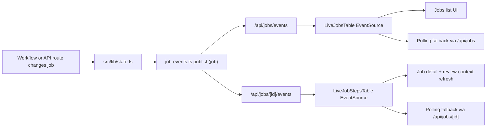

# feat: Manager live jobs via SSE + polling fallback

## Overview

Replace the Manager jobs surfaces' "live by polling" behavior with true
server-pushed updates while keeping the existing polling APIs as the fallback
and reconciliation path.

The first implementation should make two user-visible surfaces react to the same
job-change stream:

- `apps/manager/src/features/jobs/live-jobs-table.tsx`
- `apps/manager/src/features/jobs/live-job-steps-table.tsx`

When one operator creates a job, reruns transcription, accepts a Mux override,
or simply watches a workflow advance, every open Manager jobs list or job
detail page should update without waiting for the next 5 second poll. Polling
remains in the product as the degraded mode when SSE disconnects, is blocked, or
cannot provide correctness.

## Found Brainstorm

Found brainstorm from 2026-04-22: `manager-live-jobs-sse-fallback`. It settles
the main product choices:

- Goal: shared multi-user realtime across open Manager screens
- Transport: server-sent events, not WebSockets
- Fallback: retain polling explicitly
- Scope: both jobs list and single-job detail
- Boundary: tie live updates to durable job-state changes, not to local UI-only
  optimistic actions

## Research Decision

External research was useful here because the repo has no existing SSE pattern.
I used official Next.js and MDN documentation only.

Key takeaways:

- Next.js App Router route handlers support streaming and are not cached by
  default, which fits an SSE route cleanly.
- SSE is one-way, browser-native, auto-reconnecting, and supports named events,
  which matches Manager's "server pushes job changes" need without requiring
  bidirectional WebSocket complexity.
- SSE requires `text/event-stream`, UTF-8 event framing, and periodic keepalive
  comments to avoid idle disconnects.
- Browser connection limits can be low on HTTP/1, especially with multiple
  tabs. This is a real product constraint for Manager jobs tabs and should be
  called out explicitly.
- Streaming must work end-to-end in deployment. Proxy buffering or platform
  buffering can break SSE even when local dev works.

Inference from those docs:

- A process-local event publisher inside the Manager app is the smallest v1 that
  fits the repo today.
- Because the repo does not already have shared pub/sub infrastructure, the plan
  must state the deployment assumption plainly: v1 delivers true shared realtime
  only when connected clients and job mutations are handled by the same Manager
  instance. Polling fallback preserves correctness if that assumption is not met.

## Repo Workflow Notes

- Planning was attached to `feat-106`; the roadmap ticket should move from
  `status: "in-progress"` to `status: "complete"` once implementation and
  verification land.
- The implementation branch for this work is
  `feat/manager-live-jobs-sse-fallback`, targeting `main`.
- Before opening the implementation PR, check recent PRs so the title/body
  matches current repo conventions.
- Required repo loop after implementation: `ce:review` before PR and
  `ce:compound` after merge-ready completion.

## Current State Research

### Existing list polling

- `apps/manager/src/features/jobs/live-jobs-polling.ts` defines shared polling
  cadence: 5s foreground, 30s background.
- `apps/manager/src/features/jobs/live-jobs-table.tsx` calls
  `/api/jobs?view=summary`, aborts stale requests, updates local state, and
  prints the "Auto-updating every 5s" status.
- The list page already uses one stable `JobRecord[]` shape and groups rows
  locally with `groupJobsByDay(...)`.

### Existing detail polling

- `apps/manager/src/features/jobs/live-job-steps-table.tsx` polls
  `/api/jobs/[id]`, pushes the result upward through `onJobUpdate`, and stops
  scheduling polling once the job reaches `completed` or `failed`.
- `apps/manager/src/features/jobs/live-job-detail-screen.tsx` reloads review
  context whenever `job.updatedAt` changes, which is a useful existing boundary.

### Existing job-state write seam

- `apps/manager/src/lib/state.ts` already centralizes `createJob`, `getJob`,
  `listJobSummaries`, `updateJob`, `mergeJobArtifacts`, and `updateStepStatus`.
- `apps/manager/src/workflows/videoEnrichment.ts` updates job status and steps
  through that shared state module, so it is the natural place to publish live
  events.
- `docs/solutions/cms/strapi-enrichment-job-content-type.md` documents the
  repeatable-component read-then-write constraint, so live events should publish
  after the shared write boundary returns a new `JobRecord`, not before.

### Existing correctness guardrails

- `docs/solutions/integration-issues/manager-job-read-model-source-language-metadata-20260409.md`
  reinforces that list and detail must share one truthful read model through
  `toJobRecord(...)`.
- That means SSE payloads should stay aligned with the existing `JobRecord`
  contract instead of inventing a second, loosely related live-update shape.

### Existing adjacent consumers

- `apps/manager/src/features/nav/dashboard-nav.tsx` still polls the Jobs count
  every 30 seconds.
- This plan should either keep that badge explicitly out of scope or call it
  out as a follow-up so the implementation does not overclaim that every Jobs
  surface is fully live.

### Current test surface

- `apps/manager/src/lib/state.test.ts` covers read-model contracts but not live
  event publishing.
- `apps/manager/vitest.config.ts` is still centered on `src/**/*.test.ts`, so
  the first transport tests should stay node-friendly rather than starting with
  broad `.test.tsx` EventSource component coverage.
- There is no current `apps/manager/src/app/api/jobs/route.test.ts` or
  `apps/manager/src/app/api/jobs/[id]/route.test.ts`; plan to add route coverage
  for the new SSE endpoints instead of assuming the HTTP layer is already
  protected.
- There are no current tests for `live-jobs-table.tsx` or
  `live-job-steps-table.tsx`, so this feature needs new component tests for
  stream updates and fallback behavior.

## SpecFlow Notes

The `spec-flow-analyzer` skill was not available in this environment, so this
section is a manual flow and edge-case pass.

Core flows:

1. Jobs list mounts with SSR-provided initial jobs, opens an SSE connection,
   receives an initial snapshot, then applies pushed updates.
2. Job detail mounts with SSR-provided initial job, opens an SSE connection for
   that job, then refreshes review context when `updatedAt` changes.
3. A user action such as rerun or subtitle override updates job state once,
   then the pushed update reconciles every open screen.
4. A dropped stream degrades to polling and later reconnects safely.

Important edge cases:

- stream connects after SSR and must still reconcile any drift
- rapid successive step updates must not apply out of order in the client
- manual "Refresh now" still works even when SSE is healthy
- detail view should not stay stale after a job reaches a terminal state
- auth/session expiry on the stream route must fail cleanly
- multiple tabs can hit browser SSE connection limits on HTTP/1
- deployment buffering can make local SSE look healthy while production stalls

## Scope Boundaries

In scope:

- one Manager-owned live event publisher at the shared state boundary
- one or two SSE route handlers under `app/api/jobs/`
- list and detail client updates driven primarily by SSE
- explicit polling fallback and resync behavior
- red/green TDD for publisher, stream routes, list UI, and detail UI
- a real user smoke test across open Manager screens
- roadmap and plan doc updates needed for this feature

Out of scope for this ticket:

- introducing a generic repo-wide websocket or pub/sub framework
- redesigning Jobs information architecture or step copy
- changing the `JobRecord` data model shape beyond additive live-event metadata
- replacing existing jobs JSON/API routes with streaming-only behavior
- solving multi-instance fan-out with new infrastructure unless current
  deployment reality proves the process-local default is insufficient

## Product Decisions

### 1. Use separate list and detail stream routes

Add:

- `apps/manager/src/app/api/jobs/events/route.ts`
- `apps/manager/src/app/api/jobs/[id]/events/route.ts`

This keeps route behavior aligned with the existing list/detail API split and
lets each surface receive the payload shape it already understands.

### 2. Send an initial snapshot, then additive upserts

Each stream should send:

- an initial `snapshot` event after auth succeeds
- named `job-upsert` events for later changes
- keepalive comments during idle periods

This avoids a reconnect gap where the client has to wait for a future mutation
before becoming truthful again.

### 3. Publish after shared state writes complete

`createJob`, `updateJob`, `mergeJobArtifacts`, and `updateStepStatus` should
publish events only after the write returns a new `JobRecord`. This keeps live
payloads aligned with the same normalized read model used by list/detail REST
reads.

### 4. Keep polling as the degraded mode, not the steady state

List and detail clients should:

- prefer SSE while connected
- start or resume polling when the stream errors or closes
- perform a reconciliation fetch after reconnect or fallback transition
- preserve manual `Refresh now`

### 5. Keep the current `updatedAt` review-context trigger

Do not leave review-context loading on raw `job.updatedAt` alone.

Today that boundary works acceptably with 5 second polling, but SSE can emit
more granular updates. Narrow the detail refresh trigger to a small derived key
that changes only when review-relevant data changes, such as artifacts,
playback identity, or terminal-state transitions.

Recommended approach:

- add one helper such as `getReviewContextRefreshKey(job)`
- keep `LiveJobDetailScreen` as the owner of review-context loading
- update the dependency from raw `updatedAt` to that dedicated key

This preserves the single ownership boundary without forcing a review-context
refetch on every unrelated step mutation.

### 6. Accept the v1 deployment default explicitly

Default to a process-local event publisher inside Manager. This is the
right-sized first implementation for the repo today, but the PR must document
that true cross-instance fan-out is not guaranteed without shared pub/sub.

### 7. Keep detail stream subscriptions open for page lifetime

The detail page currently pauses fallback polling when a job becomes terminal,
but terminal jobs still allow rerun and override actions.

Decision:

- keep the SSE subscription open while the detail page is mounted
- pause degraded polling only while the job is terminal
- if a local rerun or override moves the job back to `running`, resume fallback
  polling automatically only when the stream is degraded

This keeps post-terminal actions live without forcing the user to reload or
manually resubscribe.

### 8. Be explicit about the list window contract

The list is a newest-first 50-row window today. A pushed new job can fall
outside the current client window logic if we only upsert locally forever.

Decision:

- use local upsert for existing row changes
- for unknown job IDs, prepend locally for instant feedback, trim to 50, and
  schedule one immediate summary resync

That keeps the UI responsive while still reconciling to server truth.

## High-Level Technical Design

This work is easiest to reason about as one state lifecycle with two transport
paths instead of as "bolt SSE onto two components."

```text
job write completes in src/lib/state.ts
  -> normalized JobRecord is published to in-memory subscribers
  -> SSE routes fan that update out to list/detail clients
  -> clients apply snapshot/upsert through one shared realtime controller
  -> if the stream is unavailable, controller falls back to existing REST reads
  -> after reconnect, controller performs one explicit reconciliation fetch
```

Design intent:

- `state.ts` remains the only durable write boundary
- SSE transports the same truth the REST reads already expose
- the shared realtime controller owns ordering, fallback, and resync logic
- UI components stay thin and mostly presentational

This is intentionally non-prescriptive about exact helper names beyond the
proposed module boundaries elsewhere in the plan.

## Technical Approach

### 1. Introduce a small Manager event publisher

Add a new module, likely:

- `apps/manager/src/lib/job-events.ts`

Responsibilities:

- maintain in-memory subscribers
- publish `snapshot` and `job-upsert` payloads
- support all-jobs and single-job subscriptions
- provide cleanup on disconnect
- centralize SSE framing helpers such as `encodeEvent(...)`

Recommended payload contract:

```ts
type JobStreamEvent =
  | { type: "snapshot"; jobs: JobRecord[] }
  | { type: "snapshot"; job: JobRecord }
  | { type: "job-upsert"; job: JobRecord }
```

Use the existing `JobRecord` shape for `job` payloads. Do not create a second
live-only DTO unless implementation proves the payload is too heavy.

### 2. Add Manager SSE route handlers

Add route handlers for:

- `GET /api/jobs/events`
- `GET /api/jobs/[id]/events`

Requirements:

- authenticate with existing Manager auth
- set route config for streaming-friendly dynamic behavior
- return `Content-Type: text/event-stream`
- disable caching/buffering where the platform honors those headers
- send an initial snapshot
- keep the connection alive with periodic comments
- unsubscribe cleanly when the request aborts

Implementation note from Next.js docs:

- Route Handlers support streaming responses.
- Route Handlers are not cached by default for dynamic behavior, but be explicit
  in the route config where needed so intent is obvious in code review.

### 3. Publish events from the shared job-state seam

Update `apps/manager/src/lib/state.ts` so the live publisher is invoked from:

- `createJob(...)`
- `updateJob(...)`
- `mergeJobArtifacts(...)`
- `updateStepStatus(...)`

That keeps workflow-driven updates, reruns, overrides, and API-created jobs on
one live path.

### 4. Upgrade the jobs list transport

Refactor `apps/manager/src/features/jobs/live-jobs-table.tsx` to:

- open `EventSource("/api/jobs/events")`
- replace initial local state when a `snapshot` event arrives
- upsert rows locally on `job-upsert`
- prepend unknown jobs locally, trim to 50, then schedule a reconciliation
  fetch so the visible window stays aligned with server truth
- keep existing grouping/presentation logic
- start polling fallback only on stream failure or close
- preserve the current manual refresh button

Implementation detail:

- keep stale-result guards for fallback fetches
- ensure a pushed row update does not destroy the current language-query suffix
  logic used for row navigation

### 5. Upgrade the job-detail transport

Refactor `apps/manager/src/features/jobs/live-job-steps-table.tsx` to:

- open `EventSource("/api/jobs/<id>/events")`
- replace local job state from `snapshot` and `job-upsert`
- continue calling `onJobUpdate(...)` so `LiveJobDetailScreen` stays in sync
- use polling only as the fallback transport
- keep the SSE connection alive while the page is mounted, even after terminal
  states
- retain manual refresh

In parallel, update `LiveJobDetailScreen` so review-context refresh depends on a
dedicated review-relevant refresh key instead of raw `job.updatedAt`.

### 6. Keep status copy honest

Update the live status messaging so it distinguishes:

- connected live stream
- reconnecting / degraded to polling
- terminal job paused
- manual refresh in progress

Do not keep saying "Auto-updating every 5s" when the stream is healthy.

## System-Wide Impact

- `apps/manager/src/lib/state.ts`
  This becomes both a persistence boundary and the source of live fan-out, so
  any future job-state writes that bypass it would become correctness bugs.
- `apps/manager/src/workflows/videoEnrichment.ts`
  Workflow-owned status and step mutations now indirectly drive live UI updates,
  which raises the importance of keeping those writes normalized and minimal.
- `apps/manager/src/features/jobs/live-jobs-table.tsx`
  The list window remains capped to the newest 50 jobs, so client-side upserts
  must stay aligned with a later server reconciliation pass.
- `apps/manager/src/features/jobs/live-job-detail-screen.tsx`
  Review-player refresh behavior depends on job changes and must not regress
  into excessive `/review-context` refetching.
- `apps/manager/src/features/nav/dashboard-nav.tsx`
  This ticket intentionally leaves the Jobs count badge on polling, which means
  page-body liveliness and nav-badge liveliness will temporarily differ.
- Deployment/runtime behavior
  SSE correctness depends on stream support through the actual runtime path. If
  the platform buffers responses or if requests land on different Manager
  instances, fallback polling becomes the correctness path.

## Flow Diagram



## Red/Green TDD Units

### Unit 1: Fallback route truth

Red:

- Add `apps/manager/src/app/api/jobs/route.test.ts`.
- Add `apps/manager/src/app/api/jobs/[id]/route.test.ts`.
- Write failing tests for:
  - auth required
  - `GET /api/jobs` summary and count modes return the expected envelope
  - `GET /api/jobs/[id]` returns `404` for missing jobs and normalized job data
    for present jobs

Green:

- Add the missing route coverage without changing the existing fallback
  contract.

Refactor:

- Keep these routes boring and unchanged unless the tests expose a real bug.

### Unit 2: Event publisher contract

Red:

- Add `apps/manager/src/lib/job-events.test.ts`.
- Write failing tests for:
  - subscriber receives `job-upsert` after publish
  - job-specific subscriber only receives matching job IDs
  - unsubscribe stops further delivery
  - SSE encoder emits valid `event:` / `data:` framing

Green:

- Implement the small in-memory publisher and framing helpers.

Refactor:

- Keep the module Manager-local and boring. Do not build a generic global event
  system.

### Unit 3: SSE route handlers

Red:

- Add `apps/manager/src/app/api/jobs/events/route.test.ts`.
- Add `apps/manager/src/app/api/jobs/[id]/events/route.test.ts`.
- Write failing tests for:
  - auth required
  - `text/event-stream` response headers
  - initial snapshot uses `listJobSummaries()` or `getJob()`
  - request abort triggers unsubscribe cleanup

Green:

- Implement both route handlers with snapshot + keepalive behavior.

Refactor:

- Extract shared route-stream setup helpers only if duplication is mechanical.

### Unit 4: Publish from the state seam

Red:

- Extend `apps/manager/src/lib/state-create.test.ts` and
  `apps/manager/src/lib/state.test.ts`.
- Add failing assertions that successful `createJob`, `updateJob`, and
  `updateStepStatus` publish a normalized `JobRecord` event.

Green:

- Wire publisher calls into the shared state functions after successful writes.

Refactor:

- Keep all publish calls below the normalization boundary so live payloads stay
  aligned with current REST reads.

### Unit 5: Shared realtime controller helper

Red:

- Add `apps/manager/src/features/jobs/live-jobs-realtime.ts`.
- Add `apps/manager/src/features/jobs/live-jobs-realtime.test.ts`.
- Write failing tests for:
  - list snapshot replaces stale initial jobs
  - detail snapshot replaces stale initial job state
  - `job-upsert` updates existing entries
  - unknown job IDs prepend and schedule resync
  - stream error switches into polling fallback mode
  - reconnect triggers reconciliation and clears degraded mode
  - terminal-job throttling rules are preserved

Green:

- Implement a node-friendly transport controller that owns stream events,
  fallback decisions, stale-event rejection, and resync triggers.

Refactor:

- Keep React components thin; put transport decisions in the helper rather than
  scattering EventSource logic across multiple files.

### Unit 6: Component wiring regressions

Red:

- Add the narrowest regression coverage needed to prove:
  - list wiring consumes the shared realtime helper correctly
  - detail wiring still calls `onJobUpdate(...)`
  - review-context reload still happens from pushed job changes

If this requires widening Vitest coverage to include `.test.tsx`, do it only
after the node-friendly helper tests exist and keep the component assertions
minimal.

Green:

- Wire the shared realtime helper into `live-jobs-table.tsx`,
  `live-job-steps-table.tsx`, and `live-job-detail-screen.tsx`.

Refactor:

- Leave `LiveJobDetailScreen` in place as the review-context owner unless tests
  prove a stronger refactor is needed.

### Unit 7: User smoke test and PR hygiene

- Run the user smoke test below against real local Manager/CMS services.
- Capture screenshots or notes proving multi-screen updates and degraded
  fallback behavior.
- Use implementation branch `feat/manager-live-jobs-sse-fallback`.
- Use PR title `feat(manager): add live jobs via sse fallback`.
- Check recent PRs before opening the new one so naming and structure match the
  current repo pattern.
- Do not bypass hooks or validation.

## Acceptance Criteria

- [x] Jobs list updates from server-pushed events without waiting for the next
      scheduled poll.
- [x] Job detail updates from server-pushed events without waiting for the next
      scheduled poll.
- [x] The list and detail views stay aligned through the same `JobRecord`
      contract.
- [x] New job creation, reruns, overrides, and workflow step/status changes all
      publish through the same live path.
- [x] Stream reconnect or failure degrades cleanly to polling without losing
      correctness.
- [x] Manual refresh still works on both list and detail surfaces.
- [x] Detail review context still refreshes when the derived review-context
      refresh key changes.
- [x] Live status copy distinguishes streaming from polling fallback.
- [x] Red/Green TDD evidence exists for publisher, SSE routes, list UI, and
      detail UI.
- [x] A user smoke test proves multi-screen updates with no manual refresh.
- [x] A degraded-mode smoke test proves correctness still recovers through
      polling when the stream is unavailable.
- [x] Manager lint, typecheck, targeted tests, and clean diff formatting all
      pass
      before PR.

## Completion Notes

Implementation completed on `feat/manager-live-jobs-sse-fallback`.

Delivered behavior:

- `src/lib/state.ts` now publishes normalized `JobRecord` updates through the
  new `src/lib/job-events.ts` process-local publisher.
- `GET /api/jobs/events` and `GET /api/jobs/[id]/events` now stream `snapshot`
  plus `job-upsert` events over SSE.
- `live-jobs-table.tsx` and `live-job-steps-table.tsx` now share one realtime
  controller that prefers SSE, falls back to polling, and reconciles after
  reconnects.
- `LiveJobDetailScreen` now refreshes review context from a dedicated
  review-relevant key instead of every raw `job.updatedAt` change.

Validation evidence from the completion run:

- `pnpm --filter @forge/manager test`
- `pnpm --filter @forge/manager typecheck`
- `pnpm --filter @forge/manager lint`
- Real local browser smoke showed the jobs list auto-populate with a newly
  created job without manual refresh.
- Real local browser smoke showed job detail update from `Attempts: 1` to
  `Attempts: 2` after `Rerun with Mux` without manual refresh.
- Degraded-mode smoke blocked `/api/jobs/events`, showed polling fallback copy,
  and reconciled to a second newly created job without a page reload.

## Verification

Red-first verification should proceed in this order:

1. Fallback route truth
2. Event publisher contract
3. SSE route handlers
4. Shared state-boundary publishing
5. Shared realtime controller helper
6. Narrow component-wiring regressions

Green verification should prove, at minimum:

- targeted route coverage for fallback and SSE endpoints
- state tests covering post-write event publication
- node-friendly realtime-controller tests covering snapshot, upsert, fallback,
  reconnect, and terminal-state behavior
- Manager static validation and type validation
- clean diff formatting with no whitespace or patch-shape issues

If the transport refactor broadens beyond the targeted files, expand validation
to the wider Manager suite before PR.

## User Smoke Test

Use the real local Manager app with local CMS data and Manager auth.

1. Start or reuse local CMS and Manager dev servers.
2. Log into Manager and open `/dashboard/jobs` in one tab.
3. Open `/dashboard/jobs` in a second tab and a running job detail page in a
   third tab.
4. Trigger a real state change:
   - create a new job from Coverage, or
   - use job-detail rerun/override controls on an eligible job.
5. Confirm both jobs-list tabs update before the next visible 5 second poll
   window would have expired.
6. Confirm the job detail tab updates step status without pressing
   `Refresh now`.
7. Confirm the browser Network panel shows an open `text/event-stream` request
   while the live update happens.
8. Confirm the detail page still refreshes the review-context-dependent UI after
   the pushed job update lands.
9. Capture screenshot or note evidence from both tabs plus one Network-panel
   capture showing the open SSE request.

Fallback proof:

10. Simulate stream failure by blocking the SSE request in devtools or
    otherwise forcing the EventSource connection to fail.
11. Trigger another real job-state change.
12. Confirm the UI status switches to degraded polling mode.
13. Confirm the list/detail still become correct through fallback polling
    without a full page reload.
14. Restore the stream and confirm the UI resyncs to correct current state.
15. Document the exact failure simulation used.

## Operational / Rollout Notes

- Local success is not sufficient. Before calling the feature done, verify that
  deployed Manager responses actually stream and are not buffered by an
  intermediate proxy.
- If deployed verification shows buffering or missing fan-out across instances,
  keep the feature behind a truthful claim boundary: "best-effort live with
  polling fallback" until shared pub/sub or infra changes are in place.
- Include one short release note or compound note describing:
  - the process-local emitter assumption
  - the fallback correctness model
  - the fact that the nav badge remains on polling as a follow-up
- If product wants fully live Jobs chrome, create a follow-up for
  `dashboard-nav.tsx` rather than quietly widening this PR.

## Risks & Mitigations

### Risk: v1 stream is only process-local

If Manager scales to multiple instances, clients connected to one instance may
not see immediately pushed events from mutations handled by another instance.

Mitigation:

- keep polling fallback for correctness
- verify current deployment topology before release claims
- document this as a known boundary in PR notes

### Risk: proxy buffering breaks production SSE

Streaming can work locally but stall behind buffering proxies or load balancers.

Mitigation:

- set streaming-friendly headers in the route
- include real deployed smoke verification before describing the feature as
  fully live
- document any platform-specific buffering findings in compound notes

### Risk: browser SSE connection limits hurt many-tab usage

MDN documents low per-browser limits when HTTP/2 is not available.

Mitigation:

- keep one stream per page surface, not multiple nested streams
- keep fallback polling intact
- note the constraint in PR/testing notes

### Risk: stream and fallback race each other

Clients can receive pushed data and a slower fallback fetch for older state.

Mitigation:

- keep existing stale-result guards for fetches
- treat snapshot and upsert handling as a single reducer path

### Risk: detail refactor breaks review-player behavior

The detail page has dependent behavior tied to `job.updatedAt`, and naïve SSE
integration could increase review-context fetch frequency.

Mitigation:

- preserve `LiveJobDetailScreen` as the review-context owner
- narrow refresh dependencies to review-relevant changes
- add targeted smoke coverage that proves review context still refreshes

### Risk: Jobs list looks live but the nav badge still looks stale

The page body can become stream-driven while `dashboard-nav.tsx` still polls
count every 30 seconds.

Mitigation:

- keep the nav badge explicitly out of scope for this ticket
- mention it in PR notes as a follow-up if product review wants fully live Jobs
  chrome later

## PR & Branch Requirements

- Planning docs remain on `docs/manager-live-jobs-sse-fallback`.
- Implementation should use `feat/manager-live-jobs-sse-fallback`.
- Target branch is `main`.
- Keep the implementation PR scoped to Manager jobs live transport, fallback,
  tests, and required roadmap/plan/docs updates.
- Include explicit red/green TDD notes and smoke-test evidence in the PR body.
- After merge-ready completion:
  - update `docs/roadmap/media-generation/feat-106-manager-live-jobs-sse-fallback.md`
    to `status: "complete"`
  - update `docs/roadmap/README.md`
  - run `ce:compound`

## References

### Internal

- `apps/manager/src/features/jobs/live-jobs-polling.ts`
- `apps/manager/src/features/jobs/live-jobs-table.tsx`
- `apps/manager/src/features/jobs/live-job-steps-table.tsx`
- `apps/manager/src/features/jobs/live-job-detail-screen.tsx`
- `apps/manager/src/app/api/jobs/route.ts`
- `apps/manager/src/app/api/jobs/[id]/route.ts`
- `apps/manager/src/lib/state.ts`
- `apps/manager/src/workflows/videoEnrichment.ts`
- `docs/brainstorms/2026-04-22-manager-live-jobs-sse-fallback-brainstorm.md`
- `docs/roadmap/media-generation/feat-106-manager-live-jobs-sse-fallback.md`
- `docs/solutions/cms/strapi-enrichment-job-content-type.md`
- `docs/solutions/integration-issues/manager-job-read-model-source-language-metadata-20260409.md`
- `docs/plans/2026-04-13-fix-enrich-now-feedback-plan.md`

### External

- [Next.js Route Handlers and Middleware](https://nextjs.org/docs/15/app/getting-started/route-handlers-and-middleware)
- [Next.js Route Handlers (streaming reference)](https://nextjs.org/docs/14/app/building-your-application/routing/route-handlers)
- [Next.js self-hosting guide: streaming and buffering](https://nextjs.org/docs/app/guides/self-hosting)
- [MDN: Using server-sent events](https://developer.mozilla.org/en-US/docs/Web/API/Server-sent_events/Using_server-sent_events)
