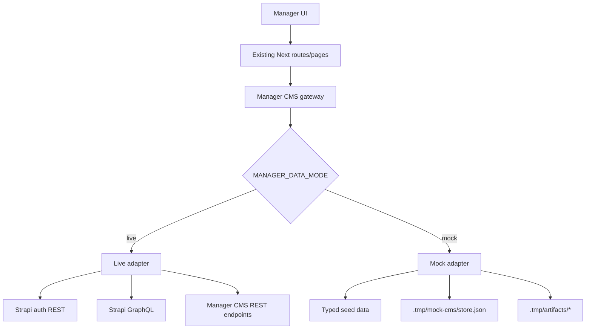

# Manager Single-Process Mock CMS Mode Plan

## Overview

Add a Manager-owned mock CMS mode so `apps/manager` can run as a single Railway/Next.js process for preview, demo, and QA without a separate Strapi service. The current production model stays intact: `live` mode remains Strapi-backed and canonical. The new `mock` mode is an explicit non-production adapter seam with seeded data, local runtime state, and zero canonical CMS writes.

The key architecture choice is to avoid faking all of Strapi. Instead, Manager gets a narrow internal gateway with `live` and `mock` adapters. Existing routes, pages, and features talk to that gateway, while only the `live` adapter keeps using Strapi GraphQL and REST.

## Found Inputs

- Roadmap ticket: `docs/roadmap/platform/feat-106-manager-single-process-mock-cms-mode.md`
- Related roadmap tickets:
  - `docs/roadmap/media-generation/feat-084-manager-agents-automations.md`
  - `docs/roadmap/media-generation/feat-087-manager-agent-dry-run-mode.md`
  - `docs/roadmap/platform/feat-033-roadmap-dashboard-app.md`
- Branch: `feat/manager-single-process-mock-cms-mode`
- User requirement: Red/Green TDD and a user smoke test are required.

### Compound Learnings Reviewed

- `docs/solutions/platform/optional-railway-s3-local-fallback.md` — preferred env-gated fallback pattern using `.tmp/` storage.
- `docs/solutions/platform/backfill-worker-pattern-manager-20260407.md` — same-process Railway/Next.js work is valid when the Manager app already owns the dependencies.
- `docs/solutions/integration-issues/manager-automation-dry-run-report-boundary-20260413.md` — keep read-only selection logic shared with live mode and branch before mutation.
- `docs/solutions/developer-experience/env-matrix-drift-from-runtime-requirements-20260421.md` — derive mock/live env requirements from code and smoke real routes, not only `/api/health`.
- `docs/solutions/cms/strapi-enrichment-job-content-type.md` — durable operational records should stay simple and additive.
- `docs/plans/2026-03-22-001-feat-manager-strapi-cms-data-integration-plan.md` — prior work deliberately moved Manager away from fake/file-backed production state, so this mode must be called out as non-production only.

## Requirements Trace

- Manager must boot in cloud as a single process without a live CMS when `MANAGER_DATA_MODE=mock`.
- Mock mode must support operator-visible login, coverage, jobs, agents, and demo job creation.
- Live mode must preserve today's Strapi-backed behavior.
- The implementation must not create a fake general-purpose Strapi REST/GraphQL server.
- Mock mode must not perform canonical CMS writes, Mux mutations, or embedding index writes.
- Mock mode must use explicit, honest demo data and runtime state rather than pretending production truth.
- The plan must produce a repo-aligned feature branch, conventional commit path, and PR expectations.
- Implementation must follow Red/Green TDD and finish with a user smoke test on the built standalone Manager runtime.

## Scope Boundaries

In scope:

- Manager env gating, auth/session behavior, data access seam, seeded mock data, runtime store, and route/page integration.
- Mock implementations for the Manager-facing read/write surfaces that exist today.
- Demo-safe job/automation mutations that stay inside Manager-owned mock state.
- Documentation updates needed to explain mock mode and correct Manager doc drift once implemented.

Out of scope:

- Replacing Strapi in production.
- A generic `/graphql` emulator or fake Strapi admin.
- CMS schema changes, `packages/graphql` regeneration, or new public contracts in V1.
- Running real Mux/OpenRouter/embedding sync flows in mock mode.
- Durable cross-redeploy persistence; V1 only needs runtime persistence within the running process/container.

## Current State Research

- `apps/manager/src/config/env.ts` currently makes `STRAPI_URL` and `STRAPI_API_TOKEN` mandatory.
- `apps/manager/src/lib/auth.ts` and `src/app/api/auth/login/route.ts` require Strapi `/api/auth/local`, `/api/users/me`, and `/api/users/:id?populate=role`.
- `apps/manager/src/cms/client.ts` points Apollo directly to `${env.STRAPI_URL}/graphql`.
- `apps/manager/src/lib/state.ts` stores and reads `EnrichmentJob` through Strapi GraphQL.
- `apps/manager/src/app/api/videos/route.ts`, `src/app/api/languages/route.ts`, and `src/features/agents/automation-runner.ts` already consume narrower CMS-facing read models, which makes them good adapter targets.
- `apps/manager/src/services/cmsClient.ts` is the shared REST writer boundary for CMS-backed mutations.
- `apps/manager/railway.toml` already defines the single-process standalone build/start shape we should keep.

## Research Decision

No external web research is needed. The implementation is repo-specific, and the relevant constraints are already documented in the current Manager code, adjacent roadmap work, and local compound docs.

## Product Decisions

- Add `MANAGER_DATA_MODE` with values `"live"` and `"mock"`. Default is `"live"` when unset.
- Add `MANAGER_MOCK_SESSION_SECRET`, optional in `live` and required in `mock`, to sign Manager-issued mock session tokens.
- Add `MANAGER_MOCK_DATA_PATH`, optional in both modes, defaulting to `.tmp/mock-cms/store.json`.
- Preserve the existing `strapi-jwt` cookie name in V1 so middleware and route protection changes stay narrow; in mock mode the cookie contains a Manager-issued signed token, not a Strapi JWT.
- Keep `apps/manager/src/cms/client.ts` as the live-only GraphQL client; do not reuse it in mock mode.
- Introduce a typed gateway under `apps/manager/src/cms/`:
  - `gateway.ts`
  - `live-adapter.ts`
  - `mock-adapter.ts`
  - `mock-store.ts`
  - `mock-seed.ts`
- Seed one Manager user, a small language tree, a coverage dataset, at least one collection with child videos, one standalone video, one existing job detail with review artifacts, two automations, and one prior automation run.
- Reuse `.tmp/artifacts/` for mock review artifacts and downloadables where possible instead of inventing a second artifact path.
- Demo job creation in mock mode creates synthetic `EnrichmentJob` records and report artifacts only. It does not call Mux, OpenRouter, `runVideoEnrichment(...)`, `/embedding/index`, `/scene-embedding/index`, or `/enrichment-job/internal-create`.
- Mock mode must expose the same browser routes and JSON route shapes as live mode so the UI does not need a separate demo shell.

## Architecture

### Gateway Surface

The gateway should expose Manager-level operations rather than transport-level helpers:

- `loginManagerUser(...)`
- `verifyManagerSession(...)`
- `getLanguageGeo()`
- `getVideoCoverage(languageIds)`
- `getCoverageSnapshots(...)`
- `listJobs()`, `getJob(id)`, `createDemoJob(...)`, `updateJob(...)`
- `listAutomations()`, `getAutomation(id)`, `createAutomation(...)`, `updateAutomation(...)`
- `listAutomationRuns(...)`, `createAutomationRun(...)`, `completeAutomationRun(...)`
- `getVideoReviewSource(videoDocumentId)`
- `getVideosForEnrich(videoIds)`, `getLanguagesByIds(ids)`, `getAutomationCandidates(...)`

These methods replace direct `getClient()`, `cmsGet()`, and `cmsPost()` imports at Manager callsites.

## Implementation Units

- [x] **Unit 1: Add data-mode env gating and the gateway seam**

  **Goal:** Introduce a single Manager-owned interface that all CMS-backed reads/writes pass through.

  **Files:**
  - Modify: `apps/manager/src/config/env.ts`
  - Add: `apps/manager/src/cms/gateway.ts`
  - Add: `apps/manager/src/cms/live-adapter.ts`
  - Add: `apps/manager/src/cms/mock-adapter.ts`
  - Add: `apps/manager/src/cms/mock-store.ts`
  - Add: `apps/manager/src/cms/mock-seed.ts`
  - Keep but narrow to live-only use: `apps/manager/src/cms/client.ts`, `apps/manager/src/services/cmsClient.ts`

  **Approach:**
  - Make `STRAPI_*` validation conditional on `MANAGER_DATA_MODE === "live"`.
  - Make `MANAGER_MOCK_SESSION_SECRET` required only when `MANAGER_DATA_MODE === "mock"`.
  - Put all adapter selection in one place so downstream callsites do not branch on env directly.
  - Follow the repo's optional-backend pattern from `optional-railway-s3-local-fallback`.

  **Red tests first:**
  - `env.ts` rejects missing `STRAPI_*` in `live` mode and rejects missing mock secret in `mock` mode.
  - gateway selection returns the live adapter in default mode and the mock adapter in mock mode.

- [x] **Unit 2: Replace Strapi auth with gateway-backed live/mock auth**

  **Goal:** Let login and route protection work in both modes while preserving the current Manager role requirement.

  **Files:**
  - Modify: `apps/manager/src/lib/auth.ts`
  - Modify: `apps/manager/src/lib/require-auth.ts`
  - Modify: `apps/manager/src/app/api/auth/login/route.ts`
  - Review: `apps/manager/src/middleware.ts`

  **Approach:**
  - In `live`, preserve current Strapi login and role verification.
  - In `mock`, validate the seeded Manager user from the runtime store and sign a Manager-owned token with `MANAGER_MOCK_SESSION_SECRET`.
  - Keep the `strapi-jwt` cookie name in V1 to minimize route churn.
  - Ensure mock-mode verification still enforces `role.name === "Manager"`.

  **Red tests first:**
  - successful mock login sets the cookie and returns the seeded user
  - invalid password rejects
  - a tampered mock cookie rejects
  - a non-Manager mock user rejects if added later

- [x] **Unit 3: Port Manager reads to the gateway and seed honest demo data**

  **Goal:** Make the main report/pages/routes load entirely from mock mode without Strapi.

  **Files:**
  - Modify: `apps/manager/src/app/api/videos/route.ts`
  - Modify: `apps/manager/src/app/api/languages/route.ts`
  - Modify: `apps/manager/src/app/api/coverage-snapshots/route.ts`
  - Modify: `apps/manager/src/app/dashboard/jobs/page.tsx`
  - Modify: `apps/manager/src/app/dashboard/jobs/[id]/page.tsx`
  - Modify: `apps/manager/src/app/dashboard/agents/page.tsx`
  - Modify: `apps/manager/src/features/jobs/review-player/load-job-review-context.ts`

  **Approach:**
  - Route and page output shapes stay unchanged.
  - Mock data must exercise the real UI branches:
    - language filtering
    - collection vs standalone video grouping
    - existing job rows and job detail review player
    - automation list and run history
    - coverage snapshot charts
  - Seed enough artifact-backed data for the job detail screen to be smoke-tested without a live CMS.

  **Red tests first:**
  - route tests for `/api/videos`, `/api/languages`, and `/api/coverage-snapshots` in mock mode
  - page/data-loader tests proving jobs and agents dashboards render mock-fed data
  - review-context tests proving mock review source uses safe local artifact-backed data

- [x] **Unit 4: Port job and automation mutations to demo-safe mock writes**

  **Goal:** Preserve interactive Manager actions in mock mode without crossing into live workflow/CMS mutation paths.

  **Files:**
  - Modify: `apps/manager/src/lib/state.ts`
  - Modify: `apps/manager/src/features/agents/automation-store.ts`
  - Modify: `apps/manager/src/features/agents/automation-runner.ts`
  - Modify: `apps/manager/src/app/api/enrich/route.ts`
  - Review writer boundaries:
    - `apps/manager/src/services/cmsClient.ts`
    - `apps/manager/src/services/embeddingSync.ts`
    - `apps/manager/src/services/sceneEmbeddingSync.ts`

  **Approach:**
  - In `mock`, `createEnrichmentJobs(...)` writes demo job records into the runtime store and returns accepted job ids.
  - Mock automation runs use the same candidate selection rules but store run records and summary data locally.
  - Keep the dry-run lesson: branch before mutation boundaries. In mock mode, never fall through to `cmsPost(...)` or real workflow dispatch.
  - If a UI action reaches a feature we do not support in mock mode, return an explicit, user-visible “unsupported in mock mode” error instead of silently failing.

  **Red tests first:**
  - mock job creation updates the runtime store and never calls `runVideoEnrichment(...)`
  - mock automation run creation updates the runtime store and never calls `cmsPost(...)`
  - regression tests prove `/embedding/index`, `/scene-embedding/index`, and other live writer boundaries are not reached in mock mode

- [x] **Unit 5: Final validation, doc alignment, and PR hygiene**

  **Goal:** Prove the mode works in the actual standalone runtime and leave the docs truthful.

  **Files:**
  - Update as needed after implementation:
    - `apps/manager/AGENTS.md`
    - `apps/manager/CLAUDE.md`
    - `docs/solutions/...` if a new durable pattern emerges

  **Approach:**
  - Align Manager docs so they no longer drift on “file-backed” vs “Strapi-backed” truth.
  - Capture the mock/live boundary clearly in code comments and docs.
  - Validate the built standalone runtime, not only `pnpm dev`.

## Red/Green TDD Sequence

1. Add failing env/gateway tests for live vs mock mode selection.
2. Add failing auth tests for mock login, session verification, and role enforcement.
3. Add failing route/page tests for mock-fed coverage, language geo, snapshots, jobs, and agents reads.
4. Add failing store tests for mock job and automation persistence.
5. Add failing negative-boundary tests proving mock mode does not reach `cmsPost(...)`, real workflow dispatch, or external writer paths.
6. Only after those greens, run package lint/typecheck/build and the user smoke test.

## User Smoke Test

Run the smoke against the built standalone Manager runtime, not only `pnpm dev`.

### Setup

1. Build Manager using the existing standalone pattern from `apps/manager/railway.toml`.
   - For local standalone smoke, include the same static asset copy used in Railway:
     `cp -r apps/manager/.next/static apps/manager/.next/standalone/apps/manager/.next/static`
2. Start it with:
   - `MANAGER_DATA_MODE=mock`
   - `MANAGER_MOCK_SESSION_SECRET=<local secret>`
   - `HOSTNAME=0.0.0.0`
3. Use the seeded credentials:
   - email: `manager@forge.test`
   - password: `mock-manager-password`

### Smoke steps

1. Open `/login` and sign in with the seeded Manager user.
2. Confirm the dashboard loads without a live CMS.
3. Open Coverage and verify:
   - language selector loads
   - at least one collection and one standalone video render
   - counts update when filtering by a seeded language
4. Open Jobs and verify:
   - seeded jobs render
   - a job detail page opens
   - review-player data and artifact links load from local mock-backed data
5. Create a demo enrichment job from the mock UI path.
6. Refresh Jobs and confirm the new job is still present in the running process.
7. Open Agents and verify:
   - seeded automations render
   - run history renders
   - a manual mock automation action creates a visible local run without live side effects
8. Restart only if desired to confirm V1 is explicit about runtime-only persistence.

## Verification Commands

- `pnpm --filter @forge/manager test`
- `pnpm --filter @forge/manager lint`
- `pnpm --filter @forge/manager typecheck`
- standalone build matching the existing Railway build/start shape
- `git diff --check`

## Execution Notes

- The final standalone browser smoke passed after matching Railway's static-asset copy step. Before that copy, the standalone login page served HTML but not the client chunks, so the page did not hydrate locally.
- Browser proof captured:
  - `/login` → `/dashboard/coverage` in mock mode
  - `/dashboard/jobs`
  - `/dashboard/jobs/mock-job-1`
- Validation commands completed:
  - `pnpm --filter @forge/manager test`
  - `pnpm --filter @forge/manager lint`
  - `pnpm --filter @forge/manager typecheck`
  - `MANAGER_DATA_MODE=mock ... pnpm --filter @forge/manager build`

## Risks and Mitigations

- **Risk: mock mode quietly regresses live mode.**
  Keep one gateway seam, default to `live`, and add mode-specific tests around the live adapter.

- **Risk: mock mode accidentally reintroduces fake production truth.**
  Keep the feature named and documented as non-production only, with explicit mutation suppression and runtime-scoped persistence.

- **Risk: route/page code forks into a second UI.**
  Preserve current route/page contracts and move branching into the gateway only.

- **Risk: healthcheck passes while real routes fail.**
  Require the user smoke to hit login, coverage, jobs, job detail, and agents in the built standalone runtime.

## PR and Branch Hygiene

- Work on `feat/manager-single-process-mock-cms-mode`.
- Use a conventional commit, likely `feat(manager): add single-process mock CMS mode`.
- Target `main` with a squash-merge PR.
- Do not skip pre-commit hooks.
- Since V1 avoids CMS schema changes, no `packages/graphql` regeneration should be needed. If the implementation later expands into CMS schema work, regenerate GraphQL outputs in the same PR.
- Mark `docs/roadmap/platform/feat-106-manager-single-process-mock-cms-mode.md` complete only after tests, standalone build verification, and the user smoke test pass.

## Expected Outcome

- `apps/manager` can run in cloud as a single process in `mock` mode for preview/demo/QA.
- The UI remains honest because it uses real Manager routes and state transitions, not screenshots or a separate demo shell.
- Production `live` mode remains Strapi-backed and unchanged in behavior.
