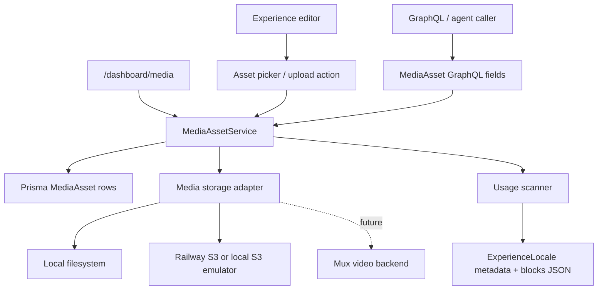

# Admin Media Asset Library

## Overview

Build an admin-native media asset library in `apps/admin` for images, PDFs,
generic files, and future video assets. The first user-facing slice makes image
selection work inside the experience editor, while the underlying model supports
generic files and a future Mux-backed video backend. Local development must work
without Railway S3 or Mux credentials.

The plan intentionally treats this as a media subsystem, not a widget. Assets
get canonical metadata, backend-aware storage, usage discovery, permissioned
service operations, and editor/agent entry points.

## Problem Frame

`apps/admin` is replacing Strapi as the editorial source of truth, but media is
currently stored as scattered URL strings in `ExperienceLocale.ogImageUrl` and
block JSON. Editors cannot safely reuse, replace, or delete images because they
cannot see where a file is used. Agents have the same problem at a lower level:
they can inspect raw JSON, but there is no structured answer to "where is this
image used?" or "replace this image everywhere it appears."

The origin requirements define the durable behavior and boundaries (see origin:
`docs/brainstorms/2026-04-23-admin-media-asset-library-requirements.md`).

## Requirements Trace

- R1-R5. Add an admin-owned asset library with browsable, searchable, reusable
  asset records and guarded replacement/deletion.
- R6-R11a. Keep storage backend-aware, with Railway S3 for production
  images/files, local development without real cloud credentials, future
  Mux-ready video metadata, and a decision on S3-compatible local emulation.
- R12-R15. Let existing image-bearing experience metadata and blocks choose
  managed assets while keeping first-slice PDF/file support pragmatic.
- R16-R18. Provide structured "where used" visibility across metadata and
  nested block JSON, including transitional URL fields.
- R19-R21. Expose agent-friendly operations through the same service/API layer
  as the UI.
- R22-R25. Enforce upload validation, derive image metadata where practical,
  surface clear errors, and test local storage, usage, permissions, and editor
  asset selection.

## Scope Boundaries

- Do not use Strapi as a source-of-truth or migration dependency.
- Do not build real Mux upload/transcoding in this first milestone.
- Do not require web/mobile/TV consumer migration.
- Do not build approvals, licensing workflows, rendition marketplaces, or CDN
  purge tooling.
- Do not permit silent deletion or replacement when usage exists.
- Do not let callers concatenate object storage URLs; all preview/download URLs
  come from admin-owned helpers.

### Deferred to Separate Tasks

- **Mux upload/transcoding:** This plan defines the backend boundary and fields,
  but actual Mux direct-upload creation, webhooks, and playback publication land
  later.
- **Materialized usage index:** This plan starts with deterministic on-demand
  usage scanning. A persisted usage index is a later optimization if scan cost
  becomes meaningful.
- **Public consumer rendering:** Existing public apps keep their current content
  path until the broader admin consumer migration work lands.

## Context & Research

### Relevant Code and Patterns

- `apps/admin/AGENTS.md` and `apps/admin/CLAUDE.md` define the hard boundary:
  UI calls services/GraphQL, services own mutations, Prisma is the data layer,
  and permission checks belong in services.
- `apps/admin/src/storage/s3.ts` already provides Railway S3 plus local fallback
  object APIs with safe key validation and timeout-bound S3 calls.
- `apps/admin/src/storage/s3.test.ts` and
  `apps/admin/src/storage/s3.s3-backend.test.ts` split local fallback tests
  from S3-client behavior tests. Keep that tiering.
- `apps/admin/src/services/experience.service.ts` shows the service mutation
  pattern: Zod parse, permission/ABAC check, Prisma write, revision snapshot.
- `apps/admin/src/services/experience.schemas.ts` and
  `apps/admin/src/domain/blocks.ts` are the service-boundary validation layer
  for experience metadata and blocks.
- `apps/admin/src/graphql/types/experience.ts` and
  `apps/admin/src/graphql/schema.ts` show the Pothos side-effect registration
  pattern and classification tags.
- `apps/admin/src/app/dashboard/media/page.tsx` is currently a read-heavy media
  signals page. This becomes the asset library workflow surface.
- `apps/admin/src/app/dashboard/experiences/experience-editor.tsx` already has
  visual affordances and strings for choosing images/videos from a media
  library, but the backing asset picker is not real yet.
- `apps/admin/prisma/schema.prisma` already has `VideoImage`, `MuxVideo`, and
  `ExperienceLocale.ogImageUrl`, but no generic `MediaAsset`.

### Institutional Learnings

- `docs/solutions/deployment/nextjs-pnpm-monorepo-railway-standalone.md`:
  production storage cannot rely on ephemeral local files.
- `docs/solutions/platform/optional-railway-s3-local-fallback.md` is referenced
  by the admin foundation plan as the local-storage fallback precedent.
- `docs/solutions/security-issues/zod-validation-errors-must-not-echo-user-controlled-input-20260420.md`:
  upload/type validation errors should be clear but not echo unsafe input or
  raw provider details.
- `docs/solutions/best-practices/verify-infra-writes-via-independent-read-path-20260420.md`:
  verify stored object writes through a read path, not only by trusting the
  write call response.

### External References

- `s3rver` is an npm S3-like server for sandbox testing, but the current npm
  package is `3.7.1` and last modified in 2022. Useful as a lightweight option,
  but not a strong default for production-like parity.
- `fake-s3` is also old (`3.1.3`, modified in 2022) and should not be the main
  recommendation.
- MinIO provides S3-compatible object storage that can run in a local container
  and works with normal S3 clients by changing endpoint/credentials:
  https://docs.min.io/
- LocalStack supports S3 locally and can serve as a broader AWS-service emulator:
  https://docs.localstack.cloud/aws/services/s3/
- Mux Direct Uploads return signed upload URLs and create assets asynchronously;
  local development should not call this path by default:
  https://www.mux.com/docs/api-reference/video/direct-uploads

## Key Technical Decisions

- **Canonical `MediaAsset` records, not storage-object records:** The asset
  record is the editorial identity. Storage object keys, Mux IDs, local paths,
  and preview keys are backend details.
- **Generic model now, image-forward UI first:** Add kinds for `IMAGE`, `VIDEO`,
  `PDF`, and `FILE`. The first polished picker/preview path targets images
  because that unblocks existing blocks.
- **Additive asset references in block JSON:** Introduce asset-ID fields beside
  existing URL fields (`imageAssetId`, `backgroundImageAssetId`,
  `mediaAssetId`, `imageOverrideAssetId`, etc.). New editor writes treat the
  asset ID as canonical; existing URL fields remain transitional preview/cache
  fields until downstream consumers are migrated.
- **On-demand usage scanning first:** Build a deterministic scanner over
  `ExperienceLocale` metadata and blocks. It returns structured labels and JSON
  paths. Persisting a usage index is deferred until scan cost or replacement
  concurrency proves it is needed.
- **Filesystem fallback remains the default local/test backend:** Keep normal
  tests fast and offline. Add documentation and env support for pointing the
  existing S3 backend at MinIO/LocalStack for integration parity rather than
  adding a stale npm emulator dependency now.
- **Mux is a backend boundary, not first-slice behavior:** Store Mux-ready
  fields and statuses for video assets, but local videos use placeholder/local
  metadata and never upload to Mux unless explicitly configured later.
- **UI uploads can use server actions, but all behavior goes through services:**
  Binary upload through GraphQL is not required for this milestone. The UI can
  submit multipart forms to server actions/routes that call `MediaAssetService`;
  GraphQL exposes listing, inspection, usage, registration, and replacement
  operations for agents and non-binary workflows.

## Open Questions

### Resolved During Planning

- **Filesystem fallback vs S3 emulator:** Use filesystem fallback for normal
  dev/test and support S3-compatible emulators as an optional integration tier
  by configuring the existing S3 endpoint/bucket/env vars. Do not add `s3rver`
  or `fake-s3` as a dependency in the first implementation.
- **Usage table vs on-demand scan:** Start on demand. Keep the scanner pure and
  deterministic so a future materialized table can reuse it.
- **GraphQL upload vs service-backed server action:** Avoid GraphQL multipart
  upload complexity for the first slice. Use services as the invariant; expose
  non-binary agent operations through GraphQL.
- **Existing URL fields:** Do not break them immediately. Treat URL fields as
  legacy/preview and introduce canonical asset-ID fields additively.

### Deferred to Implementation

- Exact migration filename after implementation starts. The next migration will
  follow `apps/admin/prisma/migrations/0005_*`.
- Final field names in the experience editor helper functions; the plan names
  canonical concepts, not exact local variable names.
- Whether image dimension extraction uses a small dependency or built-in
  parsing. The implementer should choose based on package health and supported
  formats during implementation.

## Output Structure

Expected new/expanded shape:

```text
apps/admin/src/services/
  media-asset.schemas.ts
  media-asset.service.ts
  media-asset.usage.ts
  media-asset.service.test.ts
  media-asset.usage.test.ts
apps/admin/src/graphql/types/
  mediaAsset.ts
apps/admin/src/graphql/mutations/
  media-asset.ts
apps/admin/src/storage/
  media.ts
  media.test.ts
apps/admin/src/app/dashboard/media/
  page.tsx
  media-actions.ts
  [id]/page.tsx
apps/admin/prisma/migrations/0005_media_assets/
  migration.sql
```

## High-Level Technical Design

> _This illustrates the intended approach and is directional guidance for review, not implementation specification. The implementing agent should treat it as context, not code to reproduce._



Asset references in blocks should follow this transition rule:

```text
new writes:
  imageAssetId = "asset_cuid"
  imageUrl = generated preview URL/cache only when needed by current renderers

usage scanner:
  prefer asset-id matches
  also match legacy URL fields against asset URLs/object keys during transition
```

## Implementation Units

- [ ] **Unit 1: Media Asset Data Model And Permissions**

**Goal:** Add first-class `MediaAsset` persistence and permission gates.

**Requirements:** R1-R3, R5-R8, R19-R22

**Dependencies:** None

**Files:**

- Modify: `apps/admin/prisma/schema.prisma`
- Create: `apps/admin/prisma/migrations/0005_media_assets/migration.sql`
- Modify: `apps/admin/src/auth/permissions.ts`
- Test: `apps/admin/src/auth/permissions.test.ts`
- Test: `apps/admin/src/graphql/classification.test.ts`

**Approach:**

- Add enums for media kind, storage backend, visibility, and processing status.
  Suggested concepts:
  - kind: image, video, pdf, file
  - backend: local, s3, mux
  - status: pending, uploading, processing, ready, failed, missing
  - visibility: private, public
- Add `MediaAsset` with editor metadata (`displayName`, `description`,
  `altText`), file metadata (`mimeType`, `byteSize`, `width`, `height`,
  `durationMs`, `originalFilename`, `checksumSha256`), backend identifiers
  (`objectKey`, `previewObjectKey`, `muxAssetId`, `muxUploadId`,
  `muxPlaybackId`), status/error metadata, creator, timestamps, and indexes for
  browse/search filters.
- Keep `VideoImage` unchanged. It remains Core/video-derived poster metadata,
  not the generic editorial asset model.
- Add permission keys such as `read:media-assets`, `write:media-assets`, and
  `delete:media-assets`. EDITOR can create/update non-destructive assets;
  destructive delete remains ADMIN or explicitly usage-gated in service.
- Add classification expectations for the future Pothos `MediaAsset` type.

**Patterns to follow:**

- `apps/admin/prisma/schema.prisma` enum/comment style.
- `apps/admin/src/auth/permissions.ts` permission matrix pattern.
- `apps/admin/src/graphql/classification.test.ts` for type classification
  guardrails.

**Test scenarios:**

- Happy path: `hasPermission(editor, "write:media-assets")` returns true.
- Error path: VIEWER cannot write or delete media assets.
- Error path: PUBLIC cannot read private media assets once service ABAC exists.
- Schema guard: a new Pothos media type must include a classification tag.

**Verification:**

- Prisma schema has a generic asset table with backend-independent metadata.
- Permission matrix compiles and tests cover read/write/delete tiers.

- [ ] **Unit 2: Storage Adapter For Media Objects**

**Goal:** Add a media-focused storage boundary that supports local filesystem,
S3-compatible object storage, and future Mux video backends without exposing
raw object paths to callers.

**Requirements:** R6-R11a, R22-R24

**Dependencies:** Unit 1

**Files:**

- Create: `apps/admin/src/storage/media.ts`
- Test: `apps/admin/src/storage/media.test.ts`
- Modify: `apps/admin/src/storage/s3.ts`
- Test: `apps/admin/src/storage/s3.test.ts`
- Test: `apps/admin/src/storage/s3.s3-backend.test.ts`
- Modify: `apps/admin/src/config/env.ts`
- Test: `apps/admin/src/config/env.test.ts`
- Modify: `apps/admin/.env.example`

**Approach:**

- Keep `apps/admin/src/storage/s3.ts` as the low-level object API. Add a
  media adapter above it for object-key construction, backend selection,
  content type, byte limits, and preview URL generation.
- Local backend writes under a media-specific directory such as
  `.tmp/media-assets/<asset-id>/original`.
- S3 backend writes under stable object keys such as
  `media-assets/<asset-id>/original/<safe-filename>` and optional preview keys.
- Add env/config support only where needed. Existing `RAILWAY_S3_*` variables
  should already allow pointing at MinIO or LocalStack through endpoint,
  bucket, region, and credentials.
- Document emulator usage in `.env.example` or operational docs, but do not add
  `s3rver`/`fake-s3` dependencies.
- Represent Mux as an unsupported/future backend in this unit: service calls
  should fail clearly if an implementation tries to upload bytes to Mux before
  the real backend exists.

**Patterns to follow:**

- `apps/admin/src/storage/s3.ts` safe key validation and production fail-fast.
- `apps/admin/src/storage/s3.s3-backend.test.ts` mocked AWS SDK behavior.
- `apps/admin/src/scripts/refresh-core-id-mapping.ts` local fallback layout
  comments for developer ergonomics.

**Test scenarios:**

- Happy path: local media write returns a stable object key and read path can
  retrieve the same bytes.
- Happy path: S3 backend sends `PutObjectCommand` with bucket, key, body, and
  content type.
- Error path: unsafe filenames/object keys are rejected before storage calls.
- Error path: production without configured S3 fails loudly for non-local
  backend.
- Error path: Mux byte upload returns a typed unsupported-backend error.
- Integration expectation: document a MinIO/LocalStack env profile; do not make
  it part of normal unit test runs.

**Verification:**

- Media service callers can ask for write/read/preview behavior without knowing
  whether the backend is local or S3.
- Local tests run without Railway S3 credentials.

- [ ] **Unit 3: Media Asset Service And GraphQL API**

**Goal:** Implement service-layer asset CRUD/registration, metadata validation,
preview/download URL generation, and agent-friendly GraphQL operations.

**Requirements:** R1-R5, R11, R18-R24

**Dependencies:** Units 1-2

**Files:**

- Create: `apps/admin/src/services/media-asset.schemas.ts`
- Create: `apps/admin/src/services/media-asset.service.ts`
- Test: `apps/admin/src/services/media-asset.service.test.ts`
- Modify: `apps/admin/src/services/index.ts`
- Create: `apps/admin/src/graphql/types/mediaAsset.ts`
- Create: `apps/admin/src/graphql/mutations/media-asset.ts`
- Modify: `apps/admin/src/graphql/schema.ts`
- Test: `apps/admin/src/graphql/schema.test.ts`
- Test: `apps/admin/src/graphql/schema.security.test.ts`

**Approach:**

- Add Zod schemas for create/register/update/filter inputs. Validate MIME kind
  compatibility (`image/*` -> image, `application/pdf` -> pdf, common video
  MIME types -> video).
- Add service methods for:
  - list/search/filter assets
  - get asset by id
  - create/register asset metadata
  - upload/store image or file bytes from UI server actions
  - update metadata such as display name, notes, alt text
  - generate preview/download URLs through the storage adapter
  - mark missing/failed states with sanitized messages
- Add GraphQL query/mutation fields for non-binary operations useful to agents:
  list, inspect, usage handoff in Unit 4, register local/dev asset, update
  metadata, request replacement.
- Avoid GraphQL file upload in this milestone. UI binary uploads call service
  methods directly from server actions/routes.
- Ensure all service mutations call permission helpers before storage or Prisma
  writes.

**Patterns to follow:**

- `apps/admin/src/services/experience.service.ts` service method structure.
- `apps/admin/src/services/errors.ts` typed service errors.
- `apps/admin/src/graphql/types/experience.ts` Pothos type/query style.

**Test scenarios:**

- Happy path: EDITOR registers an image asset with metadata and receives a
  ready local-backed asset row.
- Happy path: ADMIN updates asset metadata and generated preview URL comes from
  the service/storage helper.
- Happy path: agent-style GraphQL list returns stable id, kind, backend, status,
  label, and timestamps.
- Edge case: PDF registers as `PDF`, not generic `FILE`.
- Error path: MIME/kind mismatch is rejected.
- Error path: VIEWER cannot create or update assets.
- Error path: raw storage/provider error maps to a sanitized service error.

**Verification:**

- Asset list/inspect/update operations work through services and GraphQL.
- No resolver directly calls Prisma for media mutations.

- [ ] **Unit 4: Usage Scanner And Safe Replacement Guards**

**Goal:** Provide structured "where used" data and block destructive operations
when assets are still referenced.

**Requirements:** R5, R16-R18, R19-R21, R24

**Dependencies:** Units 1 and 3

**Files:**

- Create: `apps/admin/src/services/media-asset.usage.ts`
- Test: `apps/admin/src/services/media-asset.usage.test.ts`
- Modify: `apps/admin/src/services/media-asset.service.ts`
- Test: `apps/admin/src/services/media-asset.service.test.ts`
- Modify: `apps/admin/src/graphql/types/mediaAsset.ts`
- Modify: `apps/admin/src/graphql/mutations/media-asset.ts`

**Approach:**

- Build a pure usage scanner that accepts asset rows and `ExperienceLocale`
  records and emits structured usage objects:
  - asset id
  - entity type/id/title
  - locale
  - field name
  - block type
  - nested item label/index when available
  - JSON path
  - editor route
  - source type: asset-id reference or legacy URL match
- Scan:
  - `ExperienceLocale.ogImageUrl`
  - top-level block fields
  - nested section/container content
  - Bible quote items
  - navigation carousel items
  - media collection items
  - video carousel items
- Add a registry of media field descriptors rather than scattering ad hoc
  string checks through the scanner.
- Add service guard methods:
  - `getUsage(assetId)`
  - `canDelete(assetId)` or `deleteAsset({ force: false })`
  - guarded replacement for known asset-ID fields, leaving legacy URL-only
    mass replacement either unsupported or preview-only until a human confirms.
- Do not maintain a materialized usage table in this unit.

**Patterns to follow:**

- `apps/admin/src/services/embeddings.service.ts` block traversal style.
- `apps/admin/src/domain/blocks.ts` block shape and nested field names.
- `apps/admin/src/app/dashboard/experiences/[id]/page.tsx` editor route shape.

**Test scenarios:**

- Happy path: usage scanner finds an asset used in `ogImageAssetId` or
  equivalent locale metadata.
- Happy path: usage scanner finds an asset in a top-level card media field.
- Happy path: usage scanner finds an asset inside a nested media collection
  item and includes block/item labels.
- Transition path: scanner reports legacy URL usage when an asset's generated
  URL/object URL matches an existing `imageUrl` field.
- Error path: delete without force is rejected when usage exists.
- Error path: replacement rejects incompatible kind, such as replacing an image
  field with a PDF asset.

**Verification:**

- Asset detail and GraphQL usage calls can answer where an asset is used without
  exposing raw JSON only.
- Destructive operations are usage-aware.

- [ ] **Unit 5: Block Schemas And Experience Editor Asset References**

**Goal:** Make existing image-bearing blocks asset-aware while preserving
current save/publish behavior and transitional URL compatibility.

**Requirements:** R12-R15, R22-R25

**Dependencies:** Units 1, 3, and 4

**Files:**

- Modify: `apps/admin/src/domain/blocks.ts`
- Test: `apps/admin/src/domain/blocks.test.ts`
- Modify: `apps/admin/src/services/experience.schemas.ts`
- Test: `apps/admin/src/services/experience.service.test.ts`
- Modify: `apps/admin/src/app/dashboard/experiences/[id]/page.tsx`
- Modify: `apps/admin/src/app/dashboard/experiences/experience-editor.tsx`
- Test: `apps/admin/src/app/dashboard/experiences/experience-editor.test.tsx`

**Approach:**

- Add optional asset-ID fields to the current block schemas:
  - `imageAssetId` next to `imageUrl`
  - `backgroundImageAssetId` next to `backgroundImageUrl`
  - `mediaAssetId` next to `mediaUrl`
  - `imageOverrideAssetId` next to `imageOverrideUrl`
- Add `ogImageAssetId` to the experience locale edit path if the data model
  supports it in Unit 1. Keep `ogImageUrl` as transitional metadata.
- Validate that asset-ID fields are strings and let the service check existence
  and kind compatibility before save.
- Update save actions to preserve asset IDs through JSON serialization.
- In the editor, implement at least one complete image-field integration first
  (recommended: card `mediaAssetId` or section `backgroundImageAssetId`), then
  apply the same picker control to the other image fields.
- The picker should support choose, preview, clear, replace, and jump to asset
  detail.
- Keep URL fields visible or available only as legacy/advanced fallback if
  needed during transition.

**Patterns to follow:**

- Existing `experience-editor.tsx` block inspector helpers around
  `backgroundImageUrl`, `mediaUrl`, and `imageUrl`.
- Existing video picker modal patterns in the experience editor.
- `apps/admin/src/domain/blocks.ts` strict Zod schemas.

**Test scenarios:**

- Happy path: block schema accepts `imageAssetId` plus existing `imageUrl`.
- Happy path: editor selecting an image asset updates the selected block and
  hidden blocks JSON submitted to the server.
- Happy path: clearing an asset removes the asset ID and preview URL/cache for
  that field.
- Edge case: existing URL-only block data still parses and renders in the
  editor.
- Error path: saving a block with a non-image asset in an image field is
  rejected by the service.
- Integration: update an experience locale with an asset-aware block, reload
  the editor, and see the selected asset preview state restored.

**Verification:**

- An editor can select a managed image for at least one block image field,
  persist it, reload, and see usage on the asset detail page.

- [ ] **Unit 6: Media Library Dashboard And Asset Detail View**

**Goal:** Turn `/dashboard/media` into an operational asset library with upload,
search/filter, preview, metadata editing, and usage inspection.

**Requirements:** R3-R5, R14-R18, R22-R25

**Dependencies:** Units 1-5

**Files:**

- Modify: `apps/admin/src/app/dashboard/media/page.tsx`
- Create: `apps/admin/src/app/dashboard/media/media-actions.ts`
- Create: `apps/admin/src/app/dashboard/media/[id]/page.tsx`
- Modify: `apps/admin/src/app/dashboard/dashboard-ui.test.tsx`
- Modify: `apps/admin/src/i18n/messages.ts`
- Test: `apps/admin/src/app/dashboard/dashboard-ui.test.tsx`

**Approach:**

- Replace the read-heavy "Recent Media Rows" posture with an asset library
  table/grid fed by `MediaAssetService`.
- Add filters for kind, backend, status, and search text.
- Add an upload/register form. Image/PDF/file binary upload can go through a
  server action that calls the service; local video assets should be
  register/placeholder only in this milestone.
- Add asset detail page with metadata, preview/download action, backend/status,
  usage list, and guarded delete/replace actions.
- Use existing `admin-ui` primitives (`DashboardPageHeader`, `DataTable`,
  `PageSection`, `OperatorRail`) unless the current primitives cannot support
  the workflow.
- Keep copy operational, not marketing. Avoid in-app explanatory text about
  implementation details.

**Patterns to follow:**

- `apps/admin/src/app/dashboard/experiences/page.tsx` server-action pattern.
- `apps/admin/src/app/dashboard/media/page.tsx` current layout primitives.
- `apps/admin/src/components/confirm-modal.tsx` for destructive confirmation.

**Test scenarios:**

- Happy path: media page renders asset rows with kind, status, backend, and
  updated timestamp.
- Happy path: image upload/register action calls service and redirects or
  revalidates to show the new asset.
- Happy path: asset detail shows metadata and usage rows.
- Edge case: empty library shows an operator-ready empty state with upload
  action.
- Error path: delete action with usage returns a visible blocked state.
- Error path: failed/missing asset shows status without raw provider errors.

**Verification:**

- `/dashboard/media` is a real asset workflow, not just an operations summary.
- Asset detail gives editors a safe place to inspect and act.

- [ ] **Unit 7: Documentation, Emulator Guidance, And Roadmap Closeout**

**Goal:** Document the media subsystem, local storage choices, and follow-up
boundaries so future agents do not rediscover the same decisions.

**Requirements:** R6-R11a, R19-R21, R24-R25

**Dependencies:** Units 1-6

**Files:**

- Modify: `apps/admin/CLAUDE.md`
- Modify: `apps/admin/docs/cms-operational-vs-deferred.md`
- Create: `apps/admin/docs/media-assets.md`
- Modify: `docs/roadmap/platform/feat-107-admin-media-asset-library.md`
- Optional create: `docs/solutions/platform/admin-media-asset-local-storage-pattern.md`

**Approach:**

- Add an admin playbook section covering:
  - MediaAsset model role
  - local filesystem backend
  - optional S3 emulator tier via S3 endpoint env vars
  - future Mux backend boundary
  - how to add a new asset kind or field usage descriptor
  - agent operations and permission constraints
- Update operational/deferred docs to mark what is now real and what remains
  future work.
- If implementation discovers a durable local storage/emulator pattern, capture
  it in `docs/solutions/platform/`.
- Complete the roadmap ticket only after implementation and validation pass.

**Patterns to follow:**

- `apps/admin/docs/add-a-new-entity.md` for agent-readable structure.
- Existing `docs/solutions/` concise learning style.
- Roadmap status rules in `CLAUDE.md`.

**Test scenarios:**

- Test expectation: none for documentation-only updates, beyond the validation
  commands for the whole feature.

**Verification:**

- A future agent can understand how to use and extend media assets without
  reading the full implementation first.

## System-Wide Impact

- **Interaction graph:** Media touches dashboard pages, server actions,
  services, Prisma, storage, GraphQL, and experience editor block JSON.
- **Error propagation:** Storage/provider failures should map to typed service
  errors, then UI/GraphQL-safe messages. Do not expose credentials, object-store
  internals, or raw provider responses.
- **State lifecycle risks:** Uploads can create metadata without bytes or bytes
  without committed metadata if not transactional. Prefer writing bytes first to
  a deterministic key, then committing metadata with clear cleanup/status rules.
- **API surface parity:** UI and agent paths must use the same service methods
  for register, inspect, usage, replace, and delete decisions.
- **Integration coverage:** Unit tests cover pure scanner/storage/service logic;
  at least one cross-layer test should prove editor save -> asset usage detail.
- **Unchanged invariants:** Existing `VideoImage` Core sync data remains
  read-oriented video poster metadata. Existing public consumers are not
  migrated by this work.

## Risks & Dependencies

| Risk                                                            | Mitigation                                                                                                       |
| --------------------------------------------------------------- | ---------------------------------------------------------------------------------------------------------------- |
| Block JSON migration becomes too large for one PR               | Add asset-ID fields additively and preserve URL fields during transition.                                        |
| Local storage diverges from production S3 behavior              | Keep filesystem tests for speed and document MinIO/LocalStack as optional S3 endpoint integration tier.          |
| Usage scanning misses nested fields                             | Centralize media field descriptors and test top-level, section/container, carousel, quote, and collection cases. |
| Deleting/replacing breaks published content                     | Make service delete/replace usage-aware by default and require explicit guarded behavior for destructive paths.  |
| Mux-ready fields imply Mux is implemented                       | Keep statuses/backend errors explicit; document real Mux upload as future work.                                  |
| Large binary uploads through server actions stress Next runtime | Keep file size allowlists conservative; defer resumable/large video uploads to future Mux direct-upload work.    |

## Documentation / Operational Notes

- Update `.env.example` or admin docs with a local S3 emulator example that
  points `RAILWAY_S3_ENDPOINT`, `RAILWAY_S3_BUCKET`,
  `RAILWAY_S3_ACCESS_KEY_ID`, and `RAILWAY_S3_SECRET_ACCESS_KEY` at a local
  MinIO/LocalStack instance.
- Production must continue to fail closed when object storage is required but
  not configured.
- Local video placeholders should be visually and operationally distinguishable
  from real Mux-backed assets.
- Roadmap `feat-107` is already in progress for planning. Mark complete only
  after implementation validation, not after this plan alone.

## Success Metrics

- Editors can upload/register an image, choose it in an experience block, save,
  reload, and see usage from the asset detail page.
- Editors can register/upload a PDF/generic file and see correct metadata and
  status in the media library.
- Developers can run normal tests without Railway S3 or Mux credentials.
- Agents can query asset metadata and structured usage through the admin API.
- Destructive operations are blocked or clearly guarded when usage exists.

## Sources & References

- Origin document:
  `docs/brainstorms/2026-04-23-admin-media-asset-library-requirements.md`
- Roadmap ticket: `docs/roadmap/platform/feat-107-admin-media-asset-library.md`
- Admin guide: `apps/admin/AGENTS.md`
- Admin conventions: `apps/admin/CLAUDE.md`
- Existing storage adapter: `apps/admin/src/storage/s3.ts`
- Existing block schemas: `apps/admin/src/domain/blocks.ts`
- Existing editor: `apps/admin/src/app/dashboard/experiences/experience-editor.tsx`
- MinIO docs: https://docs.min.io/
- LocalStack S3 docs: https://docs.localstack.cloud/aws/services/s3/
- Mux Direct Uploads: https://www.mux.com/docs/api-reference/video/direct-uploads
- s3rver npm package: https://www.npmjs.com/package/s3rver
