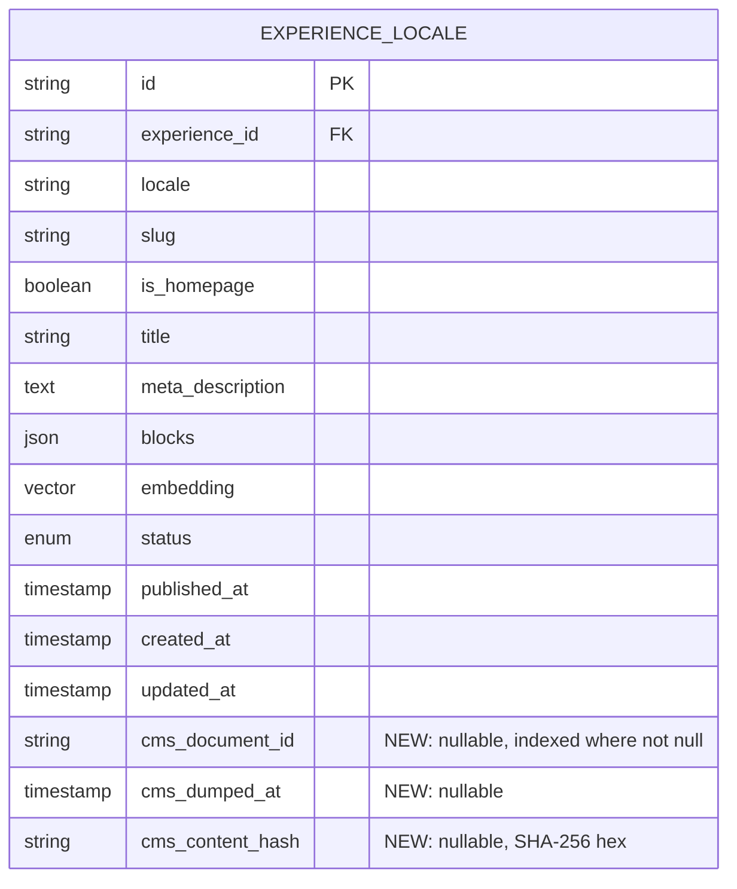

# R3 — Experience Content Migration (cms → admin)

## Overview

R3 ports the Experience corpus from `apps/cms` (Strapi v5) into
`apps/admin` (Forge Admin). It introduces an ADMIN-only GraphQL
mutation `triggerExperienceContentDump` which dispatches a useworkflow
job that reads cms's Postgres directly, transforms Strapi dynamic-zone
`blocks` into admin's Zod `BlockSchema`, merge-upserts per-locale
`ExperienceLocale` rows, and dispatches `runExperienceEmbedding` for
locales whose hashable content has changed.

cms remains the editor surface and consumer-facing renderer until the
R8 cutover. Admin's Experience corpus during the R3→R8 window is a
refreshed mirror of cms with one tolerance: admin-side
`ContentRevision` DRAFTs survive reruns because they live in a
separate table the dump never touches.

## Problem Frame

R1 + R2 (PR #828, merged 2026-04-22 as commit 4ccd8db) gave admin
scene + transcript embedding infrastructure but admin's
`Experience` + `ExperienceLocale` tables are empty. R4 (hybrid
search), R5 (recommendations), and any near-term experience-quality
measurement need a representative corpus to operate over. Without it,
admin's experience surface is structurally complete but operationally
inert. (See origin: `docs/brainstorms/2026-04-23-r3-experience-content-migration-requirements.md`.)

## Requirements Trace

Carried forward verbatim from the origin document. Each implementation
unit annotates which requirements it satisfies.

- **R3.1** ADMIN-only GraphQL mutation `triggerExperienceContentDump`
  with R1/R2 JSON return-shape parity.
- **R3.2** Dispatched as a useworkflow job via `start()` from
  `workflow/api`, with a dispatch-level test.
- **R3.3** Reads cms's Postgres directly via `CMS_DATABASE_URL` env on
  forge-admin (read-only role recommended).
- **R3.4** Maps every cms `experiences` row (per-locale, per-publish-state)
  into admin's per-locale model, mapping cms's `published_at` semantics
  onto admin's `LocaleStatus`.
- **R3.5** `Experience.isTemplate` (cms's only non-localized attribute)
  carried onto the admin canonical `Experience`.
- **R3.6** Block content transformed to admin's Zod `BlockSchema`;
  every dumped `ExperienceLocale.blocks` validates before write; one
  bad block fails just that locale.
- **R3.7** Locale set is data-derived from `SELECT DISTINCT locale
FROM experiences`; optional `locales` arg is a pure inclusion
  filter; no hardcoded list, no fallback.
- **R3.8** Reruns are merge-aware: cms-derived fields overwrite per-row;
  admin-side `ContentRevision` rows untouched.
- **R3.9** Per-locale content-hash gates `runExperienceEmbedding`
  dispatch.
- **R3.10** `Experience.ownerId` is `NULL` on every dumped Experience.
- **R3.11** Per-target error isolation; run summary tallies per-outcome.
- **R3.12** Two consecutive runs against unchanged cms produce zero
  block / metadata writes (only timestamp bookkeeping).
- **R3.13** Planning-time recon against prod cms PG to confirm exact
  schema (delivered in Unit 0).

## Scope Boundaries

Carried from origin:

- No write-protection on cms; no cms code changes.
- No consumer cutover (R8 owns that).
- No cms decommission work (R8/R9/R10 own that).
- No Strapi REST or GraphQL dependency.
- No new Strapi-source-only fields persisted on admin (drop at boundary).
- No new admin write surface for "promote dumped DRAFT to PUBLISHED" —
  the existing `ContentRevision` publish flow already handles it.
- No admin Experience UI changes.
- No backwards-or-forwards-compatible scaffolding — verify schema
  pre-merge, ship against verified shape.
- No hardcoded locale defaults of any kind.
- `runExperienceEmbedding` workflow used unchanged.

## Context & Research

### Relevant Code and Patterns

R3 mirrors the R2 pattern very closely. Verified parity points
(file paths absolute):

- `apps/admin/src/graphql/mutations/scene-embedding.ts`,
  `apps/admin/src/graphql/mutations/transcript-embedding.ts` —
  `t.field({ type: "JSON", authScopes: { hasPermission: ... }, args, resolve })`
  with a separately-exported `dispatchXxxBackfill()` that calls
  `start(workflowFn, [args])` from `"workflow/api"`. Permission key
  registered in `apps/admin/src/auth/permissions.ts`.
- `apps/admin/src/workflows/sceneEmbeddingBackfill.ts`,
  `apps/admin/src/workflows/transcriptEmbeddingBackfill.ts` —
  `"use workflow"` at top of run function; inner `stepX` async
  functions with `"use step"`; sequential `for...of` over targets;
  per-target `try/catch` with typed-error branching; exhaustive
  `stepReport` with `_exhaustive: never` guard; `export const _internals
= { ... }` at file bottom for test visibility.
- `apps/admin/src/services/scene-embedding.service.ts`,
  `apps/admin/src/services/transcript-embedding.service.ts` —
  `(prisma, input)` signature; typed error class with inline code
  union; `canWriteDerived(input.user)` as first statement; raw
  writes wrapped in `prisma.$transaction(async (tx) => { ... }, {
timeout: TRANSACTION_TIMEOUT_MS })` with `TRANSACTION_TIMEOUT_MS =
30_000`; pre-transaction prune via `tx.x.deleteMany({where:{...,
notIn: incomingIds}})`.
- `apps/admin/src/test-helpers/workflow-dispatch.ts` and the
  `wrapStartSpy<TResult>(start)` pattern used by
  `apps/admin/src/graphql/mutations/scene-embedding.test.ts` —
  `vi.hoisted(() => ({ start: vi.fn() }))` + `vi.mock("workflow/api",
() => ({ start }))` + `dispatch.expectDispatched(workflowFn,
[argsObject])`.
- `apps/admin/src/config/env.ts` — optional Zod fields wrapped in
  `emptyToUndefined(process.env.X)` in the `runtimeEnv` block;
  runtime-required envs throw `new Error(...)` at the call site
  (mirror `apps/admin/src/services/embeddings.service.ts:129-149`).
- `apps/admin/src/graphql/schema.test.ts` — `/embed|vector|similarit/i`
  field-leak guard already covers types `VideoScene`,
  `VideoSceneLocale`, `Experience`, `ExperienceLocale`. R3 must
  extend this guard to also block `/cms_?content_?hash|cms_?document_?id|cms_?dumped_?at|cmsContentHash|cmsDocumentId|cmsDumpedAt/i`
  on the same types.
- `apps/admin/prisma/schema.prisma` — append-only migration convention;
  Unsupported vector columns; see CLAUDE.md "Migrations" section.
- `apps/admin/src/domain/blocks.ts` — Zod `BlockSchema` discriminated
  union; 16 top-level variants + leaf items; three scopes (top-level,
  section content, container content); strict mode rejects unknown keys.

### Institutional Learnings

- `docs/solutions/best-practices/dead-invariant-checks-from-sibling-port-20260422.md`
  — re-derive any assertion ported from R1/R2; `i` from a `for` loop
  cannot duplicate, so a `seen.has(i)` guard is dead.
- `docs/solutions/best-practices/prototype-defaults-vs-data-derived-enumeration-20260422.md`
  — no hardcoded locale lists, no `"en"` fallback; data-derived
  enumeration from day one.
- `docs/solutions/best-practices/review-fix-round-2-sibling-call-site-regressions-20260421.md`
  — grep sweep after removing publicly-named concepts; pin every new
  branch with a test.
- `docs/solutions/best-practices/workflow-dispatch-test-mode-divergence-20260421.md`
  — `"use workflow"` directives are inert in vitest; only a dispatch
  test against `start()` catches a missing wrapper.
- `docs/solutions/security-issues/zod-validation-errors-must-not-echo-user-controlled-input-20260420.md`
  — log Zod `.error` server-side; throw a generic typed error to
  the resolver. Critical here: `blocks` is editor-controlled JSON.
- `docs/solutions/best-practices/parallel-workflow-error-robustness-20260420.md`
  — branch on typed `instanceof`/`code`, never `err.message`.
- `docs/solutions/platform/admin-transcript-embeddings-vector-reuse-pattern.md`
  — pre-transaction prune; idempotent upsert (never delete-then-insert
  to avoid mid-run empty state).
- `docs/solutions/platform/admin-scene-embeddings-indexer-pattern.md`
  — static dump artifact + idempotent upsert per-target.
- `docs/solutions/best-practices/experience-embedding-pipeline-pgvector-strapi-v5-20260414.md`
  — the existing cms-side experience embedding pipeline. Documents
  the recursive flattener for the 16 dynamic-zone components and the
  `populate.blocks.populate.{...}` deep-populate spec needed for full
  fidelity. R3's transformer mirrors the same component-recursion
  shape, but operates on raw PG rows (not the Document Service).

### External References

- Strapi v5 Document concept (cross-locale, cross-publish grouping):
  <https://docs.strapi.io/cms/api/document>
- Strapi v5 Document Service status (draft+publish row layout):
  <https://docs.strapi.io/cms/api/document-service/status>
- Strapi v5 i18n (no `_localizations_lnk` table; locale column on
  content-type table; cross-locale group via shared `document_id`):
  <https://docs.strapi.io/cms/api/document-service/locale>
- Strapi v4 → v5 DB columns breaking change (the `_components` →
  `_cmps` rename, `component_id` → `cmp_id`, `document_id` /
  `locale` / `published_at` mandatory columns):
  <https://docs.strapi.io/cms/migration/v4-to-v5/breaking-changes/database-columns>
- Open issue #25542 (discard-drafts not duplicating media morphs in
  some 5.x — relevant if R3's recovery walks both states):
  <https://github.com/strapi/strapi/issues/25542>

## Key Technical Decisions

1. **cms data source: direct Postgres, read-only role.** Reasoning
   carried from origin (Strapi REST gates fields by permission and
   has dynamic-zone populate limits). Operational shape: a new
   `CMS_DATABASE_URL` env on `forge-admin` resolves to a read-only PG
   role provisioned by the platform team. The role is not required at
   admin boot — only when the mutation fires.

2. **`document_id` is the cross-locale grouping key.** Strapi v5
   stores all locale variants and all draft/publish rows of one
   logical document with a shared `document_id` (24-char alphanumeric).
   No `_localizations_lnk` table. The dump groups by `document_id` →
   one admin `Experience` per group; one admin `ExperienceLocale` per
   `(document_id, locale)`.

3. **Draft + Published collapse: prefer published as canonical when
   both exist.** Strapi v5 stores at most two rows per `(document_id,
locale)`: one with `published_at IS NULL` (draft) and one with
   `published_at IS NOT NULL` (published). The dump:
   - If only a published row exists → admin row gets
     `status=PUBLISHED`, content from the published row.
   - If only a draft row exists → admin row gets `status=DRAFT`,
     content from the draft row.
   - If both exist → admin row gets `status=PUBLISHED`, content from
     the **published** row. The draft (the "pending edits in cms")
     is NOT mirrored into admin's `ContentRevision` table because
     doing so would conflict with admin's preserve-DRAFTs invariant.
     If `draft.updated_at > published.updated_at` (editor has
     unpublished pending work in cms), emit a `draft_pending_newer`
     warning per outcome so editors get a paper trail.

4. **Per-row dump snapshot: three columns on `ExperienceLocale`.**
   `cms_document_id TEXT NULL` (the Strapi v5 grouping key);
   `cms_dumped_at TIMESTAMP NULL` (when the dump last touched this
   row); `cms_content_hash TEXT NULL` (SHA-256 over the canonical
   merge payload — gates both rerun-skip and embedding-redispatch).
   No separate snapshot table: every dumped locale has exactly one
   snapshot, queries always join 1:1, no audit history needed.
   Partial index on `cms_document_id WHERE cms_document_id IS NOT
NULL` for "find admin row matching this cms document".

5. **Hash function: SHA-256 over canonical-JSON of the admin merge
   payload.** Payload object: `{slug, title, metaDescription,
ogTitle, ogDescription, ogImageUrl, pathSegment, isHomepage,
blocks}` — exactly the fields the dump writes. Canonicalization
   via stable key ordering. The embedding text-flattener consumes a
   subset of these fields, so any change that affects embeddings
   also changes the hash; no separate embedding hash needed.

6. **Per-locale write atomicity: single `$transaction` per locale.**
   The locale row upsert + `cms_content_hash` write + embedding
   dispatch boundary all live inside one Prisma `$transaction` with
   `TRANSACTION_TIMEOUT_MS = 30_000`. The hash is persisted ONLY
   when the merge writes succeed; the embed-dispatch happens AFTER
   the transaction commits but the hash bookkeeping is committed
   first (not the new hash; the previous-known hash). On embed
   dispatch failure, the row stores the OLD hash, so the next
   rerun's "differs?" check correctly retries the embed.

7. **Slug-uniqueness collision: pre-write check + `slug_collision`
   outcome.** Admin enforces partial unique `(locale, slug) WHERE
status='published'`. Before each upsert, the dump queries admin
   for an existing published row at `(locale, slug)` belonging to a
   different `cms_document_id`. On collision, the per-target
   outcome is `failed_validation: slug_collision` with both
   conflicting `cms_document_id` values surfaced. No silent
   workaround.

8. **`isHomepage` duplicates: enumeration-time detection, most-recent
   published wins.** Group enumeration results by `locale`; if more
   than one cms experience has `isHomepage=true` for a single locale,
   keep the one with the most recent `published_at` as `isHomepage=true`
   and dump the rest with `isHomepage=false`. Surface every duplicate
   in the run summary so editors fix cms.

9. **Block-transform validation: per-component thrown errors AND
   `BlocksSchema.parse()` failures both fail the locale.** Each
   per-component transformer either produces a valid `Block` or
   throws a `BlockTransformError`. After all blocks are transformed,
   the assembled array is validated with `BlocksSchema.parse()`; any
   parse error is also a locale failure. The outcome reason carries
   `{ blockIndex, componentName, reason }` — never the raw Zod error
   message (Zod messages echo input values; cf. the security
   learning).

10. **Media misses: drop optional, fail required.** Each per-component
    transformer takes a `mediaResolver` callback that returns
    `string | null`. If the resolver returns `null` (media file
    deleted or `files_related_mph` link missing) and the target
    field is Zod-optional, the field is omitted; if required, the
    locale fails with `failed_validation: required_media_missing`.
    Every miss is logged into a `mediaResolutionMisses[]` array on
    the per-target outcome regardless of fail/success.

11. **Video-relation misses: drop reference, do NOT fail locale.**
    Cms `videoHero.video` / `mediaCollection.items[].video` /
    `videoCarousel.items[].video` resolve via cms-numeric-video-id
    → cms-coreId → admin-Video-cuid. If the lookup misses (admin's
    Video corpus is still being filled during R3→R8), the
    transformer drops `videoId` (the field is `.optional()` on
    every block that uses it — verified against
    `apps/admin/src/domain/blocks.ts`). Every miss is recorded into
    `videoResolutionMisses[]` on the per-target outcome.

12. **Embedding dispatch: only on succeeded outcome AND hash change.**
    `runExperienceEmbedding` is dispatched via `start()` from
    `"workflow/api"` ONLY for outcomes where `status === "succeeded"`
    AND `previousHash !== newHash` (or `previousHash === null` for
    first dumps). Dispatch happens INSIDE the workflow loop but
    OUTSIDE the per-locale `$transaction` (transactions cannot
    suspend across `start()`). Dispatch failure → `embed_dispatch_failed`
    outcome variant; the hash stays at the previous value so the
    next rerun retries.

13. **Mutation return shape: `ExperienceContentDumpReport`, JSON
    scalar.** Mirrors `SceneEmbeddingBackfillReport` /
    `TranscriptEmbeddingBackfillReport`:
    `{ generatedAt: string, totalTargets: number, localeFilter:
readonly string[] | null, experienceFilter: readonly string[] |
null, succeeded: number, skipped: number, failed: number,
outcomes: ExperienceContentDumpOutcome[] }`. Outcome is a
    discriminated union on `status`: - `succeeded`: `{ status, target, locale, action: "created" |
"updated" | "skipped_unchanged", embedDispatched: boolean,
mediaResolutionMisses, videoResolutionMisses,
draftPendingNewer, durationMs }` - `skipped`: `{ status, target, locale, reason:
"skipped_unchanged" | ..., durationMs }` - `failed`: `{ status, target, locale, reason: "null_locale" |
"slug_collision" | "failed_validation" | "required_media_missing"
| "embed_dispatch_failed" | "cms_read" | "db_write", details,
durationMs }`

14. **Permission key: `write:experience-content-dump`.** Registered
    in `apps/admin/src/auth/permissions.ts` matrix (compile-time
    enforcement). Coarse gate at the GraphQL layer; `canWriteDerived(user)`
    is the fine-grained service-layer ABAC check (returns true for
    SYSTEM and ADMIN only, mirroring R1/R2).

15. **Repository abstraction with real + fake implementations.**
    `cms-experience-source.repository.ts` exposes typed methods
    returning Strapi-shaped row objects. The real implementation
    uses the `pg.Pool` against `CMS_DATABASE_URL`; tests use a
    hand-built fake repository. Repository unit tests separately
    verify the real SQL against a Strapi-shaped fixture in a
    Postgres testcontainer. This isolates "do my SQL queries work"
    from "does my dump-service logic work" and avoids needing a
    cms testcontainer in every service test.

16. **No `ContentRevision` writes from the dump.** Per the schema
    docstring at `apps/admin/prisma/schema.prisma:247` ("Sync writes
    and workflow-derived column updates skip revisioning") and
    R3.8's "admin-only state survives reruns", dump-driven upserts
    explicitly do NOT create `HISTORICAL` revisions. Captured here
    so the implementer doesn't try to add revision tracking by
    analogy with the editor-driven flow.

## Open Questions

### Resolved During Planning

- **Dynamic-zone table naming (R3.6):** `experiences_cmps` (renamed
  from v4's `experiences_components`). Column `cmp_id` (was
  `component_id`). `order` is `double precision`.
- **Cross-locale grouping (R3.4, R3.7):** `document_id` shared across
  all locale variants and across draft/published rows. No
  `_localizations_lnk` table in v5.
- **Locale enumeration query (R3.7):** `SELECT DISTINCT locale FROM
experiences WHERE locale IS NOT NULL`. Rows with `locale = NULL`
  are a data-quality failure surfaced as `failed_other: null_locale`.
- **Per-row snapshot storage (R3.8):** three columns on
  `ExperienceLocale` (decided in Key Decisions §4).
- **Hash function (R3.9):** SHA-256 over canonical-JSON of the merge
  payload (decided §5).
- **Mutation return shape (R3.11):** `ExperienceContentDumpReport`
  with R1/R2 parity (decided §13).
- **Slug-collision policy (R3.8):** pre-write check, fail with
  `slug_collision` (§7).
- **Draft+published row collision (R3.4):** prefer published; emit
  `draft_pending_newer` warning if draft is newer (§3).
- **`isHomepage` duplicates:** most-recent published wins; surface
  every duplicate in run summary (§8).
- **Block transform recursion:** `section.content[]` and
  `container.content[]` recurse into the narrower scopes already
  declared in `apps/admin/src/domain/blocks.ts`
  (`SectionContentBlockSchema`, `ContainerContentBlockSchema`).

### Deferred to Implementation

- Exact cms component table names (`collectionName` field per
  `apps/cms/src/components/sections/*.json` — read each verbatim
  rather than pluralizing).
- Exact `<owner>_id` column in each `_lnk` table (e.g. `video_hero_id`
  vs `videohero_id`). Verify with `\d <table>` against a live cms PG
  before writing the SQL.
- Whether admin's `BlockSchema.strict()` will reject Strapi-emitted
  fields admin doesn't model (e.g. Strapi internal `__component`,
  `id`, `__strapi_internal_*`). The transformer must explicitly drop
  Strapi-only metadata BEFORE handing to admin schemas, OR each
  per-block transformer constructs the admin shape from scratch.
  Prefer "construct from scratch" — purer and survives Strapi
  internal-shape drift.
- Hash canonicalization helper (`json-stable-stringify` vs
  hand-rolled deterministic stringify). Prefer the established npm
  package; add to `apps/admin/package.json`.
- `runExperienceEmbedding` dispatch shape: input args + return
  contract. Read `apps/admin/src/workflows/experienceEmbedding.ts`
  before authoring the dispatch site.
- The `Principal` shape passed from mutation → dispatch → workflow
  → service. R1/R2 already construct a SYSTEM principal in the
  workflow; mirror that pattern (likely a helper in
  `apps/admin/src/auth/permissions.ts` or similar).
- `pg.Pool` lifecycle on Next.js — singleton vs per-request; mirror
  the pattern admin uses for Redis (`apps/admin/src/db/...`).
- Whether Strapi v5 deletes orphan `experiences_cmps` rows on
  publish. Open issue #22166 documents missing component order on
  published rows in some 5.4.x builds. If observed in practice,
  fall back to enumerating components in `cmp_id` order (last-resort
  determinism). Detect during repository tests against the live cms
  PG.

## High-Level Technical Design

> _This illustrates the intended approach and is directional guidance
> for review, not implementation specification. The implementing agent
> should treat it as context, not code to reproduce._

### Schema additions on `ExperienceLocale`



### Per-target dump pipeline (one locale)

```mermaid
sequenceDiagram
  participant W as runExperienceContentDump
  participant R as cms-experience-source.repository
  participant T as block-transformers
  participant V as cms-video-id-resolver
  participant S as experience-content-dump.service
  participant A as admin Postgres
  participant E as runExperienceEmbedding

  W->>R: enumerateDocumentLocales()
  R-->>W: [{document_id, locale, has_published, has_draft, ...}]
  loop per (document_id, locale)
    W->>S: dumpLocale(target, user)
    S->>R: loadExperienceRow(document_id, locale, prefer published)
    S->>R: loadComponents(entity_id, field='blocks')
    S->>T: transformBlocks(components, mediaResolver, videoResolver)
    T->>R: loadMedia(component_type, cmp_id, field) (per leaf)
    T->>V: resolveVideoIds(cmsVideoIds)
    T-->>S: Block[]
    S->>S: BlocksSchema.parse(blocks)
    S->>S: hash = sha256(canonical(merge payload))
    S->>A: existingRow + existingHash lookup (collision check)
    alt hash unchanged
      S-->>W: outcome=skipped_unchanged
    else hash changed or first dump
      S->>A: $transaction { upsert(locale row), set cms_dumped_at }
      S-->>W: outcome=succeeded(action=created|updated)
      W->>E: start(runExperienceEmbedding, [{experienceLocaleId, ...}])
      alt dispatch ok
        W->>A: $executeRaw UPDATE cms_content_hash = newHash
      else dispatch failed
        W-->>W: outcome=failed(embed_dispatch_failed); hash stays old
      end
    end
  end
  W-->>W: stepReport(outcomes)
```

## Implementation Units

- [ ] **Unit 1: Schema additions + Prisma migration**

  **Goal:** Add the three dump-snapshot columns to `ExperienceLocale`
  and a partial index on `cms_document_id`.

  **Requirements:** R3.4, R3.8, R3.9.

  **Dependencies:** None.

  **Files:**
  - Modify: `apps/admin/prisma/schema.prisma`
  - Create: `apps/admin/prisma/migrations/<NNN>_r3_experience_cms_dump_snapshot/migration.sql`

  **Approach:**
  - Append three nullable columns: `cms_document_id TEXT`,
    `cms_dumped_at TIMESTAMP(3)`, `cms_content_hash TEXT`.
  - Partial index: `CREATE INDEX experience_locale_cms_document_id_idx
ON experience_locale(cms_document_id) WHERE cms_document_id IS
NOT NULL`.
  - Match the existing append-only convention in admin (no rewriting
    of `0001_init`); see `apps/admin/CLAUDE.md` "Migrations" section.
  - Schema docstrings on the new fields explain their role for the
    dump (matching admin's style on `embedding`, `cms_video_id_override`
    etc.).

  **Patterns to follow:**
  - `apps/admin/prisma/schema.prisma` `ExperienceLocale` model
    (lines 837-875) for column conventions.
  - The R2 migration that added `VideoTranscript` /
    `VideoTranscriptChunk` for raw-SQL CREATE conventions.

  **Test scenarios:**
  - Migration applies cleanly to a fresh DB.
  - `pnpm --filter @forge/admin db:generate` produces a Prisma
    client with the new fields typed as `string | null` and
    `Date | null`.

  **Verification:**
  - Migration applies on a fresh testcontainer Postgres.
  - `prisma format` is a no-op on the modified `schema.prisma`.

- [ ] **Unit 2: cms Postgres connection + env wiring**

  **Goal:** Provision a singleton `pg.Pool` connected to
  `CMS_DATABASE_URL`, lazy-initialized so admin still boots when the
  env is unset.

  **Requirements:** R3.3.

  **Dependencies:** None.

  **Files:**
  - Create: `apps/admin/src/db/cms-pg.ts`
  - Create: `apps/admin/src/db/cms-pg.test.ts`
  - Modify: `apps/admin/src/config/env.ts` (add `CMS_DATABASE_URL`
    optional Zod field + `runtimeEnv` entry wrapped in
    `emptyToUndefined`)
  - Modify: `apps/admin/src/config/env.test.ts` (cover unset / empty
    / valid URL paths)

  **Approach:**
  - Singleton pattern matching admin's existing single-Pool services
    (e.g. the Redis connection at `apps/admin/src/db/redis.ts`).
  - Lazy init: `getCmsPgPool()` throws `new Error("CMS_DATABASE_URL
is required for the experience-content-dump workflow")` if the
    env is unset (mirror the `OPENROUTER_API_KEY` runtime-required
    pattern at `apps/admin/src/services/embeddings.service.ts:140`).
  - SSL config: read-only role on Railway; default `pg.Pool` SSL
    behavior matches the existing admin DB connection.
  - Connection limits modest (≤ 5) — this is a periodic-rerun
    workload, not a hot path.

  **Patterns to follow:**
  - `apps/admin/src/config/env.ts` `emptyToUndefined` wrapper +
    `.optional()` + `runtimeEnv` block.
  - `apps/admin/src/services/embeddings.service.ts:129-149` runtime-
    required-env throw pattern.

  **Test scenarios:**
  - `getCmsPgPool()` throws with a specific message when env is
    unset.
  - `getCmsPgPool()` returns the same instance on repeat calls
    (singleton).
  - Env validation accepts a `postgres://...` URL; rejects
    non-URL strings.

  **Verification:**
  - Admin boots on a developer machine with `CMS_DATABASE_URL`
    unset (no behavior regression).
  - Unit tests cover the three env states.

- [ ] **Unit 3: cms experience source repository**

  **Goal:** Typed read interface over cms's Strapi v5 schema with
  both a real `pg.Pool`-backed implementation and a hand-built fake
  for service tests.

  **Requirements:** R3.3, R3.4, R3.6, R3.7.

  **Dependencies:** Unit 2.

  **Files:**
  - Create: `apps/admin/src/services/cms-experience-source.repository.ts`
    (interface + real implementation)
  - Create: `apps/admin/src/services/cms-experience-source.fake.ts`
    (in-memory fake for service tests)
  - Create: `apps/admin/src/services/cms-experience-source.repository.test.ts`
    (real-impl tests against testcontainer + Strapi-shaped fixture)
  - Create: `apps/admin/src/services/cms-experience-source.fixture.sql`
    (CREATE TABLE + INSERT script for the testcontainer)

  **Approach:**
  - Interface methods (typed, snake_case row shapes consistent with
    Strapi DB): - `enumerateDocumentLocales(filter?: { documentIds?, locales? })`
    → `Array<{ document_id, locale, has_published, has_draft,
published_at | null, draft_updated_at | null }>` - `loadExperienceRow(documentId, locale, prefer:
'published'|'draft')` → cms attributes (slug, title,
    meta_description, og_title, og_description, og_image_id |
    null, path_segment, is_homepage, is_template, published_at,
    updated_at, entity_id) - `loadComponents(entityId, field)` →
    `Array<{ cmp_id, component_type, order }>` ordered by
    `order ASC` - `loadComponentRow(componentType, cmpId)` → row attrs (typed
    union over the 16 component shapes) - `loadMediaUrl(relatedType, relatedId, field)` → first matching
    `files.url` or `null` - `loadComponentVideoRelation(componentTable, ownerColumn,
ownerId)` → cms numeric video id or `null`
  - Real impl uses `pg.Pool.query` with `$1, $2 ...` parameterized
    SQL. Snake_case column names (per CLAUDE.md `bcp47 → bcp_47`
    note).
  - Fixture SQL creates the minimum cms tables (`experiences`,
    `experiences_cmps`, the 16 `components_sections_*`, `files`,
    `files_related_mph`, the relation `_lnk` tables) and seeds 3-4
    representative documents covering: single-locale published-only,
    single-locale draft-only, two-locale draft+published with the
    draft newer than the published, an experience with media, an
    experience with a `videoHero` relation.
  - Strapi component table names come from each
    `apps/cms/src/components/sections/*.json`'s `collectionName`
    field — read each verbatim rather than pluralizing names.

  **Execution note:** Test-first — fixture rows define the contract;
  implementation runs queries against them.

  **Patterns to follow:**
  - `apps/admin/src/db/pgvector.ts::toPgArray()` for typed-array
    casting (relevant if a query returns multi-row IDs).
  - The repository-vs-service split is novel for admin (R1/R2 don't
    have it) — the precedent is the manager codebase's
    `apps/manager/src/lib/db.ts` separation.

  **Test scenarios:**
  - `enumerateDocumentLocales` returns one row per `(document_id,
locale)` regardless of how many publish-state rows exist; the
    `has_published` / `has_draft` flags reflect both rows.
  - `loadExperienceRow(documentId, locale, 'published')` returns
    NULL for documents that have only a draft row.
  - `loadExperienceRow(documentId, locale, 'draft')` always returns
    a row when the document+locale exists (Strapi v5 invariant: a
    published doc always has a draft counterpart).
  - `loadComponents` returns rows ordered by `order ASC`, even when
    `order` is fractional.
  - `loadMediaUrl` returns NULL when the `files` row has been
    deleted but the `files_related_mph` link survives (cms data-
    quality failure mode).
  - Repository SQL uses `$N` placeholders, never string interpolation.
  - The fake repo's contract matches the real repo's contract
    (run the same suite against both — `describe.each([realImpl,
fakeImpl])`).

  **Verification:**
  - Repository tests pass against the testcontainer.
  - Service consumers (Unit 6) get useful types without needing
    the testcontainer.

- [ ] **Unit 4: Block transformers (per-component)**

  **Goal:** One transformer module per cms component → admin
  `BlockSchema` variant. Transformers are pure (in-memory) and take
  the component row + a `mediaResolver` callback + a `videoResolver`
  callback.

  **Requirements:** R3.6.

  **Dependencies:** Unit 3 (for the row shapes), but only the types
  — transformers don't read from the repo themselves.

  **Files:**
  - Create: `apps/admin/src/services/cms-block-transforms/index.ts`
    (registry, dispatch by `component_type`, recursion entry point)
  - Create: `apps/admin/src/services/cms-block-transforms/types.ts`
    (input row types per component, output `Block` type re-export)
  - Create per-component (16 files):
    `apps/admin/src/services/cms-block-transforms/{adventCountdown,bibleQuotesCarousel,card,container,cta,easterDates,infoBlocks,mediaCollection,navigationCarousel,promoBanner,quizButton,relatedQuestions,section,text,video,videoCarousel,videoHero}.ts`
  - Create matching tests next to each (`*.test.ts`).
  - Create: `apps/admin/src/services/cms-block-transforms/transform-error.ts`
    (`BlockTransformError` typed class with code union)

  **Approach:**
  - Each transformer constructs the admin shape FROM SCRATCH (no
    spread of cms row attrs into admin shape) so Strapi internal
    fields (`__component`, `id`, etc.) never leak in.
  - Transformers do NOT call `BlocksSchema.parse()` themselves —
    they return the constructed object. The dump service runs
    `BlocksSchema.parse()` once on the assembled top-level array
    (cleaner error attribution and one validation pass).
  - Recursion: `section.content[]` recurses into
    `SectionContentBlockSchema`; `container.content[]` recurses
    into `ContainerContentBlockSchema` (both already declared in
    `apps/admin/src/domain/blocks.ts`). The registry routes to the
    correct scope based on the parent.
  - Media resolution: each transformer that needs a URL calls
    `mediaResolver(componentType, cmpId, field)` and gets `string |
null`. If the field is required by admin's BlockSchema and the
    callback returns `null`, throw `BlockTransformError("required_media_missing", ...)`.
  - Video resolution: transformers that take a `videoId` call
    `videoResolver(cmsVideoId)` → `string | null` and pass through;
    a null result drops the field (admin's `videoId` is `.optional()`
    on every variant that uses it — verified against
    `apps/admin/src/domain/blocks.ts:75, 110-117, 302-303, 337-338`).
  - Strapi richtext → admin string: cms's `richtext` is markdown
    serialized to a string in v5, so the field can be passed
    through directly. Verify against cms's actual serialization
    (likely a single `string` column at the DB layer, not nested
    JSON).
  - **Re-derive any ported assertion.** Do NOT copy assertions from
    other transformers without checking they apply to the cms shape
    being transformed (cf. dead-invariant-checks learning).

  **Patterns to follow:**
  - `apps/admin/src/domain/blocks.ts` — every output object must be
    a `BlockSchema.parse()`-compatible shape; reference the leaf
    schemas (`CtaBlockSchema`, `VideoHeroBlockSchema`, etc.) for
    field lists.
  - Existing cms-side flattener at the equivalent in
    `apps/cms/src/api/experience/services/embedding-text.ts` (or
    similar — see learning doc
    `experience-embedding-pipeline-pgvector-strapi-v5-20260414.md`)
    for component-recursion shape.

  **Test scenarios:**
  - Per transformer: happy-path with all fields → output passes
    `BlockSchema.parse()` for the relevant scope.
  - Per transformer with media: media resolver returns a URL → the
    URL appears in the output.
  - Per transformer with media: media resolver returns null and
    the field is optional → output omits the field.
  - Per transformer with media: media resolver returns null and
    the field is required → throws `BlockTransformError("required_media_missing", ...)`.
  - Per transformer with video relation: resolver returns null →
    `videoId` is omitted, admin BlockSchema parse still succeeds.
  - Section transformer: nested content (text + cta) returns
    correctly-typed `SectionContentBlock[]`.
  - Container transformer: `containerSlot` divider + `text` recurses
    correctly.
  - QuizButton: returned only as `SectionContentBlock`; never as
    a top-level `BlockSchema` variant.

  **Verification:**
  - 16 per-component tests pass. Snapshot tests assert specific
    output shapes per representative input.
  - `BlocksSchema.parse(transformAll([...]))` succeeds on a
    representative full-page sample.

- [ ] **Unit 5: cms video-id resolver**

  **Goal:** Map cms numeric video ids → admin Video cuids via the
  shared `coreId` axis.

  **Requirements:** R3.6.

  **Dependencies:** Units 2, 3.

  **Files:**
  - Create: `apps/admin/src/services/cms-video-id-resolver.ts`
  - Create: `apps/admin/src/services/cms-video-id-resolver.test.ts`

  **Approach:**
  - Single batched lookup: given a `Set<number>` of cms video ids,
    join cms's `videos` table to get their `core_id` values, then
    join admin's `video` table on `core_id` to get cuids.
  - Returns `Map<cmsVideoId, { coreId: string, adminVideoId: string
| null }>`. Misses (no admin Video for that coreId, or no cms
    Video for that id) return `null` for `adminVideoId`.
  - Per-target callers receive a closure `(cmsVideoId: number) =>
string | null` so the transformer signature stays narrow.
  - The dump service builds the resolver ONCE per locale by
    pre-collecting every cms video id from the locale's components
    (`videoHero.video`, `mediaCollection.items[].video`,
    `videoCarousel.items[].video`, `video.video`) before invoking
    transformers. This avoids N+1 round-trips.

  **Patterns to follow:**
  - The existing cms-coreId mapping logic in
    `apps/admin/src/scripts/refresh-core-id-mapping.ts` already
    bridges cms↔core ids (different direction; the SQL shape is
    instructive).

  **Test scenarios:**
  - All requested cms video ids resolve → map carries every
    cuid.
  - Some cms video ids have no `core_id` → result has `coreId:
null, adminVideoId: null` for those.
  - Some cms video ids resolve to coreIds that don't match any
    admin Video → result has `coreId: <value>, adminVideoId: null`.
  - Empty input → empty map (no SQL query issued).

  **Verification:**
  - `videoResolutionMisses[]` populated correctly in dump-service
    integration tests.

- [ ] **Unit 6: Dump service (per-target indexer)**

  **Goal:** `dumpExperienceLocale(prisma, input)` orchestrates the
  per-locale pipeline: load, transform, validate, hash, upsert.
  Mirrors R1's `indexEditionScenes` / R2's `indexEditionTranscript`.

  **Requirements:** R3.4, R3.5, R3.6, R3.8, R3.9, R3.11.

  **Dependencies:** Units 1, 3, 4, 5.

  **Files:**
  - Create: `apps/admin/src/services/experience-content-dump.service.ts`
  - Create: `apps/admin/src/services/experience-content-dump.service.test.ts`

  **Approach:**
  - Exported function: `dumpExperienceLocale(prisma: PrismaClient,
input: { user, target, repo, videoResolver }): Promise<DumpOutcome>`
    where `target` is `{ documentId, locale, hasPublished, hasDraft,
publishedAt | null, draftUpdatedAt | null }`.
  - First statement: `if (!canWriteDerived(input.user)) throw new
ExperienceContentDumpError("forbidden", ...)`.
  - Steps: 1. Pick the source row: published if exists, else draft. Set
    `targetStatus = "PUBLISHED" | "DRAFT"` accordingly. 2. Load components (`repo.loadComponents(entity_id, "blocks")`). 3. Pre-collect cms video ids → call `cmsVideoIdResolver` to
    get the per-locale closure. 4. Transform each component via the registry; assemble
    `Block[]`. Per-component throws → fail locale with reason
    `failed_validation: transform_error` carrying
    `{blockIndex, componentName, reason}`. 5. `BlocksSchema.parse(blocks)` — failures → fail locale with
    `failed_validation: schema_error` (log Zod detail server-side
    per the Zod-echo learning; never surface raw message). 6. Build merge payload `{slug, title, metaDescription, ogTitle,
ogDescription, ogImageUrl, pathSegment, isHomepage,
blocks}`. Resolve `ogImageUrl` via the same `mediaResolver`. 7. Compute `hash = sha256(canonicalJson(payload))`. 8. Upsert parent `Experience` row by `cms_document_id`-derived
    key (no Strapi document_id stored on `Experience`; group via
    `ExperienceLocale.cms_document_id` + a stable lookup).
    Approach: query `experience_locale WHERE cms_document_id =
? LIMIT 1` to find the canonical Experience id; if missing,
    create a new `Experience` (ownerId NULL, `isTemplate` from
    cms) and use its id. 9. Slug-collision check: query `experience_locale WHERE locale
= ? AND slug = ? AND status = 'PUBLISHED' AND experience_id
!= ? LIMIT 1`. If hit → fail locale with `slug_collision`,
    surface other row's `cms_document_id`. 10. `prisma.$transaction(async (tx) => { ... }, { timeout:
TRANSACTION_TIMEOUT_MS })`: - `tx.experienceLocale.upsert({where: {experienceId_locale:
{...}}, create: {..., cms_document_id, cms_dumped_at:
now}, update: {..., cms_dumped_at: now}})` - status mapped per Key Decision §3 (PUBLISHED if cms
    published row used, DRAFT otherwise) - `publishedAt = cms.published_at` when status=PUBLISHED;
    `null` when status=DRAFT - explicitly set `updatedAt: cms.updated_at` (mirror admin's
    existing "explicit timestamp on sync writes" pattern at
    `apps/admin/CLAUDE.md` line 207-211) - DO NOT write `cms_content_hash` here — that's deferred to
    after embed-dispatch (Unit 7) 11. Determine `action`: `"created" | "updated" |
"skipped_unchanged"` based on whether the row existed
    pre-upsert and whether the previous hash matched the new
    hash. 12. Return outcome `{ status: "succeeded", target, locale,
action, mediaResolutionMisses, videoResolutionMisses,
draftPendingNewer: hasDraft && hasPublished &&
draftUpdatedAt > publishedAt, newHash, durationMs }`.
    `embedDispatched` is set by the workflow (Unit 7), not the
    service.
  - `ExperienceContentDumpError` typed class with codes:
    `"forbidden" | "null_locale" | "slug_collision" |
"failed_validation" | "required_media_missing" |
"embed_dispatch_failed" | "cms_read" | "db_write"`.

  **Patterns to follow:**
  - `apps/admin/src/services/transcript-embedding.service.ts`
    overall shape, error class, ABAC gate, `$transaction` boundary,
    pre-transaction prune.
  - `apps/admin/src/services/scene-embedding.service.ts` for
    upsert-vs-update branching.

  **Test scenarios** (using fake repo):
  - First-time dump for a new (document_id, locale) → outcome
    `succeeded, action=created`, `Experience` and `ExperienceLocale`
    rows exist, `cms_dumped_at` set.
  - Second dump with no cms-side change → outcome
    `succeeded, action=skipped_unchanged`, no metadata writes
    (verifiable via `updatedAt` not changing).
  - Second dump with a cms-side change → outcome `succeeded,
action=updated`, hash differs.
  - Cms row has only a draft → row dumped with `status=DRAFT`,
    `publishedAt=null`.
  - Cms row has both draft + published, draft newer →
    `draftPendingNewer: true` on outcome; published row's content
    is what's in admin.
  - Slug collision: two different cms documents both publish the
    same `(locale, slug)` → second outcome is
    `failed (slug_collision)`.
  - Block validation failure: a transformer throws → locale fails
    with `failed_validation`, no admin write.
  - `BlocksSchema.parse()` failure: assembled `blocks[]` has a
    field admin's schema doesn't accept → `failed_validation:
schema_error`, no admin write, Zod error logged but not in
    outcome message.
  - `canWriteDerived(user)` returns false → throws
    `ExperienceContentDumpError("forbidden", ...)`.
  - cms repo throws `cms_read` error → caught and surfaced as
    failed outcome (workflow level).
  - `isTemplate` from cms → carried onto canonical Experience.

  **Verification:**
  - Service tests pass against the fake repo.
  - All `failed_*` outcomes stay typed; no raw `err.message` echo.

- [ ] **Unit 7: Workflow (`runExperienceContentDump`)**

  **Goal:** Useworkflow job that enumerates targets, fans out to
  the dump service per-target, dispatches embeddings for changed
  locales, returns the final report.

  **Requirements:** R3.1, R3.2, R3.4, R3.7, R3.9, R3.11, R3.12.

  **Dependencies:** Units 2, 3, 6.

  **Files:**
  - Create: `apps/admin/src/workflows/experienceContentDump.ts`
  - Create: `apps/admin/src/workflows/experienceContentDump.test.ts`

  **Approach:**
  - Exports `runExperienceContentDump(input: ExperienceContentDumpInput):
Promise<ExperienceContentDumpReport>` with `"use workflow"` as
    the first statement of the function body.
  - Input: `{ documentIds?: readonly string[], locales?:
readonly string[] }`. Both optional; omitted = "all
    data-derived".
  - Inner steps (each `"use step"`): - `stepEnumerateTargets(input)` — calls
    `repo.enumerateDocumentLocales({documentIds, locales})`,
    filters out `locale = NULL` rows (each becomes a
    `failed_other: null_locale` outcome), detects `isHomepage`
    duplicates per locale and adjusts (most-recent published
    wins; rest dumped with `isHomepage=false` AND warning
    surfaced). - `stepDumpTarget(target)` — wraps `dumpExperienceLocale` with
    a try/catch: - `ExperienceContentDumpError` → typed mapping to outcome. - Other errors → `failed_other: db_write | cms_read`. - `stepDispatchEmbedding(outcome, prevHash)` — only invoked
    when `outcome.status === "succeeded" && outcome.action !==
"skipped_unchanged" && (prevHash === null || prevHash !==
outcome.newHash)`. Calls `start(runExperienceEmbedding,
[{ experienceLocaleId, locale }])` from `"workflow/api"`.
    On success: `tx.$executeRaw\`UPDATE experience_locale SET
    cms_content_hash = ${outcome.newHash} WHERE id =
    ${outcome.experienceLocaleId}\``(separate raw SQL to avoid
Prisma's revision-tracking pathway). On`start()`rejection:
mutate the outcome to`failed (embed_dispatch_failed)`,
preserve `prevHash`so next rerun retries.
    -`stepReport(outcomes)`— pure helper (no`"use step"`),
      tallies `succeeded/skipped/failed`via exhaustive switch on
     `outcome.status`, `\_exhaustive: never` guard in the default
    arm.
  - Run loop: sequential `for...of` over targets — NOT
    `Promise.all`. Mirrors R1/R2.
  - `export const _internals = { stepEnumerateTargets, stepDumpTarget,
stepDispatchEmbedding, stepReport }` at file bottom for test
    visibility.

  **Patterns to follow:**
  - `apps/admin/src/workflows/transcriptEmbeddingBackfill.ts` for
    the file shape, `_internals` export, exhaustive `stepReport`.
  - `apps/admin/src/workflows/sceneEmbeddingBackfill.ts:185-238` for
    the data-derived enumeration SQL shape (R3 enumerates against
    cms PG, not admin PG; pattern is the same).

  **Test scenarios:**
  - Empty target list → succeeds with `totalTargets: 0`, no
    dispatches.
  - One target succeeds → outcome `succeeded`, hash persisted,
    embed dispatched.
  - One target succeeds (skipped_unchanged) → no embed dispatched,
    `cms_dumped_at` updated only.
  - One target's embed dispatch rejects → outcome flips to
    `failed (embed_dispatch_failed)`, hash NOT updated.
  - Multiple targets — one fails, rest succeed → `failed: 1`,
    `succeeded: N-1`, run completes.
  - `locale = NULL` enumeration row → contributes a `failed_other:
null_locale` outcome.
  - `isHomepage` duplicates in enumeration → most-recent wins;
    outcome carries `isHomepageAdjusted: true` (or surfaces in run
    summary).
  - `documentIds: ["nonexistent"]` filter → 0 targets, 0 outcomes.
  - `locales: ["es"]` filter when corpus has no `es` content →
    0 targets, 0 outcomes (no fallback to other locales).
  - Workflow report's `succeeded + skipped + failed === outcomes.length`.
  - Workflow report's `localeFilter` and `experienceFilter` reflect
    inputs verbatim (or `null` for omitted).
  - **Dispatch test:** Unit 8's mutation test pins
    `start(runExperienceContentDump, [args])`. This unit's tests
    pin `start(runExperienceEmbedding, [{experienceLocaleId, ...}])`
    inside `stepDispatchEmbedding` using the same `wrapStartSpy`
    helper (cf. `workflow-dispatch-test-mode-divergence-20260421.md`).

  **Verification:**
  - All workflow-level integration tests pass against the fake
    repo.
  - No `Promise.all` anywhere in the workflow body (sequential
    per-target).
  - No hardcoded locale or document-id default constants anywhere
    in the file (cf. `prototype-defaults-vs-data-derived-enumeration-20260422.md`).

- [ ] **Unit 8: GraphQL mutation `triggerExperienceContentDump`**

  **Goal:** ADMIN-only mutation that dispatches the workflow.

  **Requirements:** R3.1, R3.2, R3.11.

  **Dependencies:** Units 2, 7. Permission key registration.

  **Files:**
  - Create: `apps/admin/src/graphql/mutations/experience-content-dump.ts`
  - Create: `apps/admin/src/graphql/mutations/experience-content-dump.test.ts`
  - Modify: `apps/admin/src/auth/permissions.ts` (add
    `"write:experience-content-dump"` permission key + matrix entry
    — TypeScript will error if missing).
  - Modify: `apps/admin/src/graphql/schema.ts` (side-effect import
    for the new mutation file — easy to forget; cf.
    `apps/admin/CLAUDE.md` "Adding a new Pothos type" pitfall, same
    rule applies to mutations).

  **Approach:**
  - Mirror `apps/admin/src/graphql/mutations/transcript-embedding.ts`: - `import { start } from "workflow/api"` (verbatim spec). - `export async function dispatchExperienceContentDump(input)
{ const run = await start(runExperienceContentDump, [input]);
return run.returnValue }` — exported separately so the
    dispatch test can target it without rendering the Pothos
    schema. - `builder.mutationFields((t) => ({ triggerExperienceContentDump:
t.field({ type: "JSON", authScopes: { hasPermission:
"write:experience-content-dump" }, args: { documentIds:
t.arg.stringList({ required: false }), locales:
t.arg.stringList({ required: false }) }, resolve:
async (_root, args) => dispatchExperienceContentDump({
documentIds: args.documentIds ?? undefined, locales:
args.locales ?? undefined }) }) }))`.
  - `description` field on the mutation references the runbook
    location and the operational precondition (`CMS_DATABASE_URL`
    must be set).

  **Patterns to follow:**
  - `apps/admin/src/graphql/mutations/transcript-embedding.ts`
    line-for-line where applicable.
  - Dispatch test pattern in
    `apps/admin/src/graphql/mutations/transcript-embedding.test.ts`
    (or scene-embedding equivalent if more illustrative).
  - `apps/admin/src/auth/permissions.ts` matrix entry pattern — the
    file's TypeScript will error if a `PermissionKey` lacks a tier
    mapping.

  **Test scenarios:**
  - Dispatch test: calling `dispatchExperienceContentDump({
documentIds: ["doc1"], locales: ["en"] })` invokes
    `start(runExperienceContentDump, [{ documentIds: ["doc1"],
locales: ["en"] }])` exactly once with the expected tuple
    (`wrapStartSpy.expectDispatched`).
  - Dispatch test: omitted args pass through as `undefined` (not
    coerced to empty arrays).
  - Dispatch test: dispatch propagates rejection.
  - GraphQL surface: mutation `triggerExperienceContentDump` is
    registered on the schema.
  - GraphQL surface: requires `write:experience-content-dump` (test
    by mocking the user context with EDITOR role and asserting
    rejection).

  **Verification:**
  - Schema test (Unit 9) registers the new mutation.
  - Permission matrix compile-checks the new key.
  - `pnpm --filter @forge/admin build` succeeds.

- [ ] **Unit 9: Schema test additions + field-leak guard**

  **Goal:** Pin the GraphQL surface contract for the new mutation
  and the new dump-snapshot columns.

  **Requirements:** Defense-in-depth around R3.8 (snapshot columns
  must not leak via GraphQL).

  **Dependencies:** Units 1, 8.

  **Files:**
  - Modify: `apps/admin/src/graphql/schema.test.ts`

  **Approach:**
  - Add a new `it("Mutation root exposes the experience content
dump trigger", ...)` block mirroring the existing scene/transcript
    test (lines ~59-82 in current file).
  - Add per-arg type/default assertion for the optional `documentIds`
    and `locales` args.
  - Extend the field-leak loops in the `Experience` and
    `ExperienceLocale` per-type tests to also block patterns
    `cms_?content_?hash`, `cms_?document_?id`, `cms_?dumped_?at`,
    `cmsContentHash`, `cmsDocumentId`, `cmsDumpedAt`. Pattern:
    ```ts
    expect(fields.cmsContentHash).toBeUndefined()
    expect(fields.cmsDocumentId).toBeUndefined()
    expect(fields.cmsDumpedAt).toBeUndefined()
    for (const key of Object.keys(fields)) {
      expect(key).not.toMatch(
        /embed|vector|similarit|cms_?content_?hash|cms_?document_?id|cms_?dumped_?at|cmsContentHash|cmsDocumentId|cmsDumpedAt/i,
      )
    }
    ```
  - **Bonus** (gap from R2 review): add a registration test for
    `triggerTranscriptEmbeddingBackfill` that's missing from the
    current file. Same pattern as the scene-embedding registration
    test. Captured here because the schema-test file is the right
    place; flagging in PR description.

  **Patterns to follow:**
  - `apps/admin/src/graphql/schema.test.ts` lines 59-128, 151-181
    for the existing leak-guard loops.

  **Test scenarios:**
  - `fields.triggerExperienceContentDump` defined.
  - `triggerExperienceContentDump.args.locales.type` is a
    `[String!]` shape.
  - `Experience` type's GraphQL fields contain none of:
    `cmsContentHash, cmsDocumentId, cmsDumpedAt`.
  - `ExperienceLocale` type's GraphQL fields contain none of the
    above.
  - The regex test catches a synthetic field named `cms_content_hash`
    (verify the regex).

  **Verification:**
  - `pnpm --filter @forge/admin test src/graphql/schema.test.ts`
    passes.

- [ ] **Unit 10: Operational runbook + apps/admin/CLAUDE.md update**

  **Goal:** Document the R3 surface in admin's playbook, mirroring
  the R1 and R2 sections.

  **Requirements:** R3.13.

  **Dependencies:** Units 1-9 conceptually; can be drafted in
  parallel.

  **Files:**
  - Modify: `apps/admin/CLAUDE.md` (add a new "Experience content
    dump (R3 of admin migration playbook)" section after the
    transcript-embeddings section)
  - Create: `docs/solutions/platform/admin-experience-content-dump-pattern.md`
    (the durable learnings doc, paralleling the R1/R2 platform
    docs)

  **Approach:**
  - The CLAUDE.md section follows the R1/R2 template: 1. What it does (one paragraph) 2. Schema additions (the three new columns + index) 3. Indexer service / workflow / mutation file paths 4. Operational runbook: - `CMS_DATABASE_URL` must be set on `forge-admin` Doppler;
    read-only PG role provisioning notes (forwarding to a
    platform-team handoff) - Mutation invocation example (GraphQL + curl) - Verification SQL (`SELECT COUNT(*) FROM experience`,
    `SELECT COUNT(*) FROM experience_locale WHERE
cms_dumped_at IS NOT NULL`, etc.) 5. Common pitfalls / things to remember (the dispatch directive
    requirement, the "no Promise.all in the workflow" reminder,
    etc.)
  - The docs/solutions doc captures the R3-specific learnings
    that future R-stage ports will benefit from:
    - Repository-vs-service split for cross-DB reads.
    - `document_id` as the cross-locale grouping key in v5.
    - The merge-with-snapshot pattern + per-locale `$transaction`
      boundary.
    - Why dispatch happens outside the transaction (transactions
      can't suspend across `start()`).

  **Patterns to follow:**
  - `apps/admin/CLAUDE.md` "Scene embeddings (R1 of admin migration
    playbook)" section (lines ~355-413).
  - `apps/admin/CLAUDE.md` "Transcript embeddings (R2 of admin
    migration playbook)" section (lines ~415-490).
  - `docs/solutions/platform/admin-scene-embeddings-indexer-pattern.md`
    and `docs/solutions/platform/admin-transcript-embeddings-vector-reuse-pattern.md`
    for the durable-learnings doc shape.

  **Verification:**
  - Markdown lints clean.
  - Both files cross-link to the requirements doc + this plan.

## System-Wide Impact

- **Interaction graph:**
  - Admin schema gains three nullable columns on `ExperienceLocale`
    (Unit 1). Existing reads / writes are unaffected.
  - Admin GraphQL gains one new mutation; no existing mutation
    surface changes.
  - Admin gets a new env dep (`CMS_DATABASE_URL`) — optional at boot,
    runtime-required for the mutation.
  - `runExperienceEmbedding` workflow is dispatched by R3's workflow
    but is itself unmodified.
  - The Pothos schema-test file gets stricter (Unit 9). If anyone
    has a draft branch that adds a `cmsXxx` GraphQL field, it'll
    fail CI — desired.
- **Error propagation:**
  - cms PG read failures in the workflow surface as per-target
    `failed_other: cms_read`; the run continues with remaining
    targets.
  - Per-locale Prisma write failures surface as `failed_other:
db_write`; row state is unchanged (transaction rolled back).
  - Embedding dispatch failures surface as `failed (embed_dispatch_failed)`;
    the row's content is committed but the hash stays at the
    previous value, so the next rerun retries.
  - Zod validation errors are logged server-side with full detail;
    the outcome carries only `{ blockIndex, componentName, reason }`
    (cf. `zod-validation-errors-must-not-echo-user-controlled-input-20260420.md`).
- **State lifecycle risks:**
  - The merge policy means admin's `ExperienceLocale` content is
    intentionally a derived state during R3→R8. Any admin-side UI
    that allows editing of `blocks` / `slug` / `title` / `meta*`
    must understand the next dump may overwrite. Editor UX warning
    deferred to feat-100/103 (tatai's parallel work).
  - `ContentRevision` rows survive reruns (per requirements R3.8 +
    schema docstring). The dump's $transaction does NOT touch the
    `content_revision` table.
  - cms-side concurrent edits during a dump run are a TOCTOU issue
    (G13): enumeration is the run's frozen target set. Documented
    explicitly so cron cadence is a deliberate choice.
- **API surface parity:**
  - The mutation matches R1/R2's JSON-return-shape parity (per
    requirements R3.11 and Key Decision §13).
  - Permission-matrix entry mirrors R1/R2's
    `write:scene-embeddings` / `write:transcript-embeddings`.
- **Integration coverage:**
  - End-to-end coverage: the workflow test against the fake repo
    plus 2-3 representative admin DB integration tests (testcontainer)
    cover the cross-layer surface. The repository tests separately
    cover SQL correctness against a Strapi-shaped fixture.
  - Dispatch tests pin both the mutation→workflow boundary AND the
    workflow→`runExperienceEmbedding` boundary (cf.
    `workflow-dispatch-test-mode-divergence-20260421.md`).

## Risks & Dependencies

- **External dependency: read-only PG role on cms.** Platform team
  must provision a `forge_admin_readonly` role with `SELECT` on the
  experience-related tables (`experiences`, `experiences_cmps`,
  `components_sections_*`, `files`, `files_related_mph`, `videos`,
  every `*_lnk` table for relations + media). Documented in the
  runbook (Unit 10). Until this is provisioned, R3 mutation runs in
  prod will throw the runtime-required-env error (clean failure
  mode).
- **Strapi v5 schema drift during R3→R8 window.** The dump SQL is
  written against the schema at recon time. If cms ships a content-
  type change to Experience or any of the 16 components during
  R3→R8, R3's next rerun fails until the SQL is updated. Mitigation:
  the platform team's cms-change checklist should include "ping
  admin team if Experience-or-component schema changes". Out of
  R3's scope.
- **Strapi v5 known-issue #22166 (component order on published
  rows).** If observed in cms 5.42.x prod, fall back to enumerating
  components in `cmp_id` ASC for last-resort determinism. Detect at
  recon time.
- **Strapi v5 known-issue #25542 (discard-drafts media morph
  duplication).** Affects cms's discard-draft pathway, not R3
  reads. Worth knowing if R3's recovery ever walks both states.
- **Hash collisions: SHA-256 over canonical JSON.** Practically
  zero collision risk at this catalog scale; documented for
  posterity.
- **Embed dispatch latency.** `runExperienceEmbedding` is a
  separate useworkflow job; dispatching N of them on a full-corpus
  rerun queues N work items. Admin's existing useworkflow runtime
  on Railway already handles R1's full-corpus backfill (~thousands
  of targets), so 100 experiences × ~3 locales = 300 embed
  dispatches is well within capacity.
- **Doppler access blocker (out of band).** Per the existing
  `feedback_review_fix_loop` and Nisal's project memory, the R1
  prod-smoke is gated on a Doppler access blocker for the
  `forge-admin` project. R3's prod execution inherits this. Code
  work is unaffected; only the runbook calls it out.
- **Slug-collision detection is best-effort.** A race between two
  concurrent invocations of the workflow could both pass the
  pre-write check and both attempt the upsert; the second loses to
  the partial unique index with a P2002 that the catch translates
  to `slug_collision`. Per Key Decision §15, concurrency is safe
  via key-based upserts; document the race as benign because the
  loser surfaces as `failed`, not as silent corruption.

## Documentation / Operational Notes

- `apps/admin/CLAUDE.md` gains an R3 section (Unit 10).
- `docs/solutions/platform/admin-experience-content-dump-pattern.md`
  is the durable learnings doc (Unit 10).
- The PR description should call out:
  - The new `CMS_DATABASE_URL` env on forge-admin (operator action
    required pre-mutation-invoke).
  - The new permission key `write:experience-content-dump`.
  - The schema migration adds three nullable columns + one partial
    index — append-only, no rewrites.
  - Dispatch + workflow + service file paths for review focus.
  - The bonus `triggerTranscriptEmbeddingBackfill` schema-test
    addition (Unit 9).
- After merge, before the first prod invocation: provision the
  read-only cms PG role + add `CMS_DATABASE_URL` to the
  `forge-admin` Doppler config. Both are blocked on existing
  Doppler access blocker until that resolves.

## Sources & References

- **Origin document:** [docs/brainstorms/2026-04-23-r3-experience-content-migration-requirements.md](../brainstorms/2026-04-23-r3-experience-content-migration-requirements.md)
- **Playbook:** [docs/brainstorms/2026-04-19-admin-migration-playbook-requirements.md](../brainstorms/2026-04-19-admin-migration-playbook-requirements.md)
- **R1 reference impl:** `apps/admin/src/services/scene-embedding.service.ts`,
  `apps/admin/src/workflows/sceneEmbeddingBackfill.ts`,
  `apps/admin/src/graphql/mutations/scene-embedding.ts`.
- **R2 reference impl:** `apps/admin/src/services/transcript-embedding.service.ts`,
  `apps/admin/src/workflows/transcriptEmbeddingBackfill.ts`,
  `apps/admin/src/graphql/mutations/transcript-embedding.ts`.
- **Dispatch test helper:** `apps/admin/src/test-helpers/workflow-dispatch.ts`.
- **Admin BlockSchema:** `apps/admin/src/domain/blocks.ts`.
- **Admin schema:** `apps/admin/prisma/schema.prisma` (Experience,
  ExperienceLocale, ContentRevision).
- **cms Experience source:** `apps/cms/src/api/experience/content-types/experience/schema.json`.
- **cms section components:** `apps/cms/src/components/sections/*.json`.
- **PR #828 (R2 merge):** commit `4ccd8db` (2026-04-22).
- **External Strapi v5 docs:** Document concept, Document Service status,
  v4→v5 DB columns breaking change (URLs in Context & Research §3).
- **Institutional learnings:** All `docs/solutions/best-practices/...20260420-22.md`
  entries listed in Context & Research §2.
