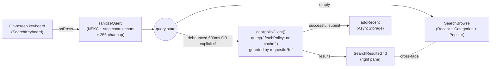

# feat: TV App Search UI (feat-106, expanded scope)

## Overview

Add a D-pad-navigable search surface to `apps/tv` that hits the same `semanticSearch` backend web and mobile consume. The entry is a persistent Search chip in a new home header, and the `/search` route is a two-pane screen: left pane = on-screen keyboard (alphabetical grid with a top-row frequency shortcut), right pane = browse surface (Recent + hardcoded Categories + Popular experiences) that cross-fades to a results grid once the query is non-empty.

feat-106 ships a single input method — the on-screen D-pad keyboard — plus three typing-free paths (Recent, Categories, Popular). **External-keyboard input** (Bluetooth, Apple TV Remote app, Google TV app) and **voice search** are both deferred to separate post-106 follow-up tickets after the doc-review round. Both require native modules, which are a meaningful step-change in review posture and timeline; keeping feat-106 scoped to pure React Native territory lets it ship in ~1 week instead of ~1 month.

The brainstorm's most important product-level insight is preserved: **TV typing is slow, so the UX is won by letting users avoid typing most of the time** — Recent + Categories + Popular carry that load in Phase A. External keyboards and voice add alternative input paths later when their own tickets invest in the native-module work they each require.

---

## Problem Frame

`apps/tv` currently has no search surface — viewers can only discover Experiences via the home rail. Web shipped a floating search + modal; mobile has a dedicated search tab. TV is the last surface without it, and will fall further behind every time new Experiences land.

See origin for full problem frame, actors, and key flows.

---

## Requirements Trace

Every origin requirement is satisfied by at least one implementation unit below. Requirements that span multiple units are noted in each relevant unit's **Requirements** field.

- R1–R2, R16. Home Search chip entry + Back focus restoration → **U2**.
- **Doc-review addendum** (search→experience→search round-trip): `/search` preserves both query and results when the user navigates back from an `/experience/[slug]` result. Focus restores to the specific result card the user left from (not the first card, not the keyboard). Implementation lives in U4 (`/search` screen owns query + results state; expo-router's `useFocusEffect` or equivalent detects re-focus and applies `hasTVPreferredFocus` to the last-selected result card). Fresh-search reset happens only when user presses Back on `/search` itself to reach home, OR when user explicitly clears the query via ⌫ to empty.
- R3–R4. Two-pane layout + query display → **U4**.
- R5–R7. On-screen keyboard (frequency + alphabetical + numerals/⌫/⏎) → **U3**.
- R8–R9. **Dropped from feat-106.** Both Bluetooth keyboard (`onKeyPress` is not a prop on non-TextInput views in `react-native-tvos`) and companion-app routing (tvOS text-entry channel incompatibility) require native modules. Folded into a single follow-up ticket: "TV search — external keyboard input (Bluetooth + Apple TV Remote app + Google TV app) via native modules". See "Deferred to Follow-Up Work".
- R10–R11. 600 ms debounce, ⏎-bypass, stale-guard, first-result auto-focus → **U5, U6**.
- R12–R13. **Dropped from feat-106 entirely.** User decision during doc review: voice search is cut because (a) the push-to-talk pivot no longer honors the brainstorm's zero-press promise, and (b) voice needs the monorepo's first custom native module + first Expo config plugin + first Privacy Manifest edit, which is a significantly larger review and shipping surface than the rest of feat-106. File as a new roadmap feature `feat-NNN TV voice search` when the product is ready to re-brainstorm what voice should actually be on TV. See "Deferred to Follow-Up Work".
- R14–R15. Recent searches persistence (AsyncStorage) + Clear-history → **U8**; surfaced by U7.
- R17–R20. Pre-search right-pane composition (Recent + Categories + Popular) + cross-fade on typing → **U7, U4**.
- R18. Category card click bypasses debounce → **U7**.
- R19. Popular card click navigates directly to `/experience/[slug]` → **U7**.
- R21–R24. Results grid layout + empty / loading / error + degraded-backend handling → **U6**.
- R25. Result selection navigates to `/experience/[slug]` (scene-seek behavior owned by feat-076) → **U6**.
- R26–R29. Styling invariants (COLORS, scale(), Math.round on Android, focus scale + glow, locale helper) → enforced throughout; spot-checked in each feature-bearing unit.

**Origin actors:** A1 (primary TV viewer with D-pad remote), A2 (viewer with companion iPhone/Android phone or Bluetooth keyboard), A3 (viewer using Siri / Google Assistant dictation).

**Origin flows:** F1 (category card → results), F2 (on-screen keyboard → results), F3 (phone or BT keyboard → results), F4 (voice dictation → results), F5 (re-run recent query), F6 (exit and return restores Search-chip focus).

---

## Scope Boundaries

- No pagination, "Load more", or infinite scroll — results are whatever one backend call returns. Follow-up if the default limit proves too small.
- No filters, sort toggles, or result-type segmentation.
- No analytics / tracking hooks. A later PR can add instrumentation points.
- No language selector; `locale: "en"` stays hardcoded until feat-109 ships.
- No individual recent-search deletion; Clear-history only.
- No trending/popular search-term pills. "Popular" means experiences, not queries.
- No personalization of Categories, Popular, or Recent.
- Scene-timestamp seek on result tap is owned by feat-076; this plan only navigates to `/experience/[slug]`.
- No changes to `apps/web`, `apps/mobile`, `apps/cms`, or `packages/graphql` (the `semanticSearch` op is already proven there).

### Deferred to Follow-Up Work

- **Single phase within feat-106:** U1–U8 ship as the complete scope. Original Phase B (voice search) was cut during doc review — see bullet below. See "Phased Delivery" below.
- **External-keyboard input (Bluetooth keyboard + Apple TV Remote iPhone app + Google TV phone app)** — all three require native modules in `react-native-tvos`: `onKeyPress` is not a prop on non-`TextInput` views (breaks the BT-keyboard-on-focused-view assumption), and companion-app typing only routes through the system text-entry channel (e.g., `UISearchController` presented keyboards). The three originally-scoped paths (R8/R9/U9) all collapse onto the same solution shape: a custom tvOS native module (`UISearchController`-backed or `UIKeyCommand`-based) + an Android TV native module (`SearchFragment` / `dispatchKeyEvent` override). File as a new roadmap feature after feat-106 ships.
- **Backend log redaction for `semanticSearch` query variables** — operational (Strapi middleware / Cloudflare log configuration), not TV-app code. Surfaced by the security review. Filed as a separate infra ticket; required to honor the "queries are not logged server-side" posture and feed App Privacy Label answers.
- **Per-entry recent-search deletion** — clear-history-only is the v1 stance; per-row delete is a trivial follow-up if viewers ask.
- **Voice search (tvOS `SFSpeechRecognizer` / Android `RecognizerIntent`)** — cut from feat-106 during doc review. Requires the monorepo's first custom native module, first Expo config plugin, and first Privacy Manifest edit; deserves its own roadmap ticket where the UX, scope, and product intent can be brainstormed fresh (the push-to-talk pivot no longer matches the brainstorm's zero-press framing). File as `feat-NNN TV voice search` when product is ready.
- **Shared `popularExperiences` GraphQL op** — this plan reuses `LIST_EXPERIENCES` data; a dedicated popularity signal belongs in its own ticket once signal exists.

---

## Context & Research

### Relevant Code and Patterns

- `apps/tv/app/_layout.tsx` — single `<Stack>` with `headerShown: false` + Crimson background; `/search.tsx` will pick these up automatically.
- `apps/tv/app/index.tsx` — home screen; the new `HomeHeader` with the Search chip is added here, above `<HomeHero>` and outside the existing rail focus.
- `apps/tv/src/components/FocusableCard.tsx` — canonical focus primitive. `{ onPress, onFocus?, onBlur?, hasTVPreferredFocus?, focusScale=1.05 }`. All keyboard keys, category cards, recent chips, popular tiles, and result tiles wrap this.
- `apps/tv/src/components/ContentRail.tsx` — horizontal-only rail with `<TVFocusGuideView autoFocus>` and a typed `renderItem(item, index, hooks)` signature. Reusable for Recent + Categories + Popular rails. Not usable for the vertical results grid.
- `apps/tv/src/components/TVFocusGuideView.tsx` — typed wrapper over RN's TVFocusGuideView; supports `trapFocusLeft/Right/Up/Down` and `destinations`. Used for the results-grid focus walls.
- `apps/tv/src/lib/apolloClient.ts` — lazy-singleton `getApolloClient()`. Never module-scope. Called inside callbacks, not at top-level import time.
- `apps/tv/src/lib/queries.ts` — all `graphql()` operations registered here. `SEMANTIC_SEARCH` is added at the bottom (after `LIST_EXPERIENCES` at line 450).
- `apps/mobile/src/lib/queries.ts` line 448 — `semanticSearch` GraphQL op with 4 vars and `$locale: String!` (not `I18NLocaleCode!`). Copy verbatim.
- `apps/mobile/app/(tabs)/watch.tsx` lines 151, 213 — `getApolloClient().query({ fetchPolicy: "no-cache" })` pattern that is the correct Apollo shape for search (not `useLazyQuery`).
- `apps/web/src/components/SearchOverlay.tsx` — `requestIdRef` stale-guard implementation to mirror.
- `apps/web/src/components/FloatingSearchBar.tsx` — the 6 hardcoded category entries (Bible Stories / Parables / Animated / Study / Family / Christmas) + gradient strings to port verbatim.
- `apps/tv/src/lib/scale.ts` line 29 — `scale()` applies `Math.round` for Android; every dp uses `scale()`.
- `apps/tv/src/lib/colors.ts` — Crimson Gallery palette + `hexToRgba(color, 0)` for gradient stops (never `"transparent"`).

### Institutional Learnings

- `docs/solutions/best-practices/react-native-tvos-porting-pitfalls-20260414.md` — **never `position:"absolute"` on focusable elements**; programmatic scroll-to-focus requires an invisible `Pressable` anchor + `setNativeProps({ hasTVPreferredFocus: true })` with ~400 ms delay.
- `docs/solutions/best-practices/tv-focus-driven-hero-patterns-20260420.md` — `TVFocusGuideView` destinations must be **siblings**, not descendants; wire `onFocus` on the leaf `Pressable`; close over `item` not `data[index]` in callbacks (Apollo cache can shrink).
- `docs/solutions/best-practices/mobile-search-ui-patterns-20260416.md` — `getApolloClient().query({ fetchPolicy: "no-cache" })`, not `useLazyQuery`; stale guard `finally` on search; `loadMore.finally` must be unguarded.
- `docs/solutions/best-practices/nextjs-search-overlay-ui-patterns-20260415.md` — canonical `requestIdRef` debounce-race pattern.
- `docs/solutions/best-practices/hybrid-semantic-search-api-strapi-v5-pgvector.md` — `semanticSearch` locale arg is `String!` on the CMS custom resolver.
- `docs/solutions/runtime-errors/silent-semantic-search-degradation-missing-openrouter-key-20260415.md` — empty-array-with-200 means **backend degraded**, not "no matches". UI must distinguish.
- `docs/solutions/ui-bugs/tv-videoview-steals-dpad-focus-20260413.md` — if result cards add video previews later, wrap `VideoView` in `pointerEvents="none"`. Not triggered by this plan's v1 image-only cards.
- `docs/solutions/design-patterns/rntvos-video-overlay-async-native-event-patterns-2026-04-23.md` — if `useTVEventHandler` is used for remote-button shortcuts, apply the ref-mirror + eager-sync pattern.

### External References

None fetched. feat-106 now ships entirely within React Native territory (no native modules), so the feasibility unknowns that originally motivated external research (hidden-`<TextInput>` routing, Expo-config-plugin for dictation) are both out of scope — they belong to the voice-search and external-keyboard follow-up tickets where desk research should lead implementation.

---

## Key Technical Decisions

- **Apollo pattern: `getApolloClient().query({ fetchPolicy: "no-cache" })`, not `useLazyQuery`.** feat-106's original note to use `useLazyQuery` is superseded by the mobile learning — `fetchMore()` silently drops page 1 with `useLazyQuery`. The search runs direct-client calls inside a debounced callback, guarded by `requestIdRef`.
- **Debounce stays at 600 ms (origin R10), not mobile/web's 300 ms.** TV input is slower and we want fewer wasted round-trips. The `requestIdRef` pattern is still used so any in-flight query is discarded on new submit.
- **Search chip is NOT absolute-positioned.** Per `react-native-tvos-porting-pitfalls` learning, absolute-positioned focusables are ignored by the focus engine. The chip lives in a new `HomeHeader` flexbox row above `HomeHero`. It looks "pinned to the top" because it's the topmost flexbox element, not because it's `position:"absolute"`.
- **Results grid is a new component, not a repurposed `ContentRail`.** `ContentRail` is horizontal-only. `SearchResultsGrid` uses `FlatList numColumns=N` wrapped in `<TVFocusGuideView trapFocusLeft trapFocusRight>`.
- **First-result auto-focus via invisible anchor + `setNativeProps` + 400 ms delay.** Plain scrolling doesn't move focus on tvOS. An invisible 48px `Pressable` sits at the top of the results grid and receives `setNativeProps({ hasTVPreferredFocus: true })` on results-land; the real first card receives focus via its own `onFocus` hand-off. Pattern is documented in `react-native-tvos-porting-pitfalls`.
- **Empty-results state is two distinct states.** `results.length === 0 && !error && !degraded` renders "No results for '<query>'". `degraded === true` (derivable from the `semanticSearch` response or a response-shape signal) renders "Search is temporarily unavailable — try again". Silent degradation (OPENROUTER key missing) is a real production failure we must surface.
- **Category gradients via `expo-linear-gradient` (already installed v55.0.13).** The 6 card entries + gradient strings are copied verbatim from `apps/web/src/components/FloatingSearchBar.tsx`.
- **Popular rail reuses home's `LIST_EXPERIENCES`.** Share the Apollo cache — no second network request. First N experiences (tune-here constant) render as the Popular rail.
- **AsyncStorage key shape: `tv.searchHistory.v1`.** Versioned prefix so a future schema shift (e.g., storing timestamps or locale) is a migration, not a breaking change.
- **Cross-fade duration: 250 ms.** Defined as a named constant (e.g., `SEARCH_PANE_CROSSFADE_MS` in `apps/tv/src/lib/animation.ts` or equivalent) so U4, U6, and U7 all use the same value. 250 ms is slow enough to feel intentional on TV, fast enough not to feel broken.
- **Single phase within `feat-106`.** feat-106 now ships as one continuous effort — U1 through U8 — since voice and external-keyboard input were both cut to follow-up tickets. The original 3-phase structure collapsed to 1.
- **External keyboard support (BT + companion-app) is dropped from feat-106 entirely.** Two structural blockers in `react-native-tvos`: (1) `onKeyPress` is not a prop on non-`TextInput` views (verified against `react-native/Libraries/Components/TV/TVViewPropTypes.js` and `ReactAndroidHWInputDeviceHelper.kt`) — so BT keys cannot land on a focused `Pressable`; (2) the Apple TV Remote iOS app and Google TV app route text only into the system text-entry channel (`UISearchController`-style presented keyboards), not arbitrary RN components. Both paths require native modules. Folded into one follow-up ticket; feat-106 itself ships entirely within React Native territory (no native modules, no prebuild cycles).
- **Query sanitization applied at every `setQuery` site.** NFKC-normalise, strip control chars + RTL overrides + zero-width joiners, trim, cap at 256 chars. Low-cost defense-in-depth for the on-screen keyboard path today; becomes mandatory when voice or external keyboards land in their follow-up tickets.

---

## Open Questions

### Resolved During Planning

- **Voice search scope?** Dropped from feat-106 entirely (user decision during doc review). Filed as a separate roadmap feature; the push-to-talk pivot triggered by feasibility findings no longer honors the brainstorm's zero-press promise, so voice deserves a fresh brainstorm rather than being bolted onto this ticket.
- **External-keyboard input scope?** Dropped from feat-106 entirely (doc review P0 resolution). Both BT and companion-app paths need native modules; consolidated into a single post-106 follow-up ticket.

- **Apollo hook vs direct client?** Direct client. (`useLazyQuery` proven unreliable in mobile's search.)
- **`semanticSearch` op shape — mobile's 4-var or web's 5-var (`type` + `searchMode`)?** Mobile's 4-var. Simpler and matches feat-106's original sketch. Upgrade to 5-var is a follow-up if result-type segmentation is ever added.
- **`locale` arg type?** `String!`, NOT `I18NLocaleCode!`. `semanticSearch` is a CMS custom resolver. The rest of `queries.ts` uses `I18NLocaleCode!` for Strapi's generated queries — do not copy that shape for search.
- **Do Categories and Popular render as `ContentRail` or a custom rail?** `ContentRail`. Matches Recent. Consistency beats one-off layout for horizontal rows.
- **Single PR vs stacked?** Stacked, one ticket. Phase A alone is ~5–7 days; bundling all three into one PR is unreviewable.
- **Hidden `<TextInput>` approach for BT + companion-app input?** Abandoned. Feasibility review confirmed it triggers the tvOS full-screen entry overlay and cannot route companion-app text. BT keyboard is reachable via `onKeyPress`; companion-app is deferred to a follow-up ticket.

### Deferred to Implementation

- **Exact grid column counts for 1080p vs 4K.** Start with 4 / 6; verify on simulator + emulator before merge. Tuning lives in `SearchResultsGrid`.
- **Frequency top-row visual treatment.** Same size as alphabetical, or smaller and visually separated? Decide during U3 implementation iteration.

---

## High-Level Technical Design

> _This illustrates the intended approach and is directional guidance for review, not implementation specification. The implementing agent should treat it as context, not code to reproduce._

### Input flow (all sources funnel into one state, then through sanitisation, then to search)



Key differences from the brainstorm's assumed architecture: there is no hidden `<TextInput>` sink (tvOS rejects that shape); external-keyboard input (BT + companion-app) is deferred to a follow-up ticket entirely; voice input is deferred to a follow-up ticket entirely; every query write passes through `sanitizeQuery` as defense-in-depth for those future sources.

### Screen composition

```
apps/tv/app/search.tsx
  └── <View style={twoPane}>
        ├── <View style={leftPane}>
        │     ├── <QueryDisplay value={query} />
        │     └── <SearchKeyboard
        │            value={query}
        │            onChange={setQuery}
        │            onSubmit={submit} />
        └── <TVFocusGuideView trapFocusLeft>   // right pane focus wall
              └── { query.trim().length === 0
                    ? <SearchBrowse
                         recents={recents}
                         onRecent={runQuery}
                         onCategory={runQuery}
                         onPopularPress={goToExperience} />
                    : <SearchResultsGrid
                         results={results}
                         state={state}           // loading | ready | empty | error | degraded
                         onResultPress={goToExperience} /> }
```

### Debounce + stale-guard (prose sketch)

On every `query` change: clear any pending timer, increment `requestIdRef`, start a 600 ms timer. On timer fire (or ⏎ press, which bypasses the timer): capture the current `requestIdRef.current` as `thisRequest`, await the Apollo query, then only apply results when `requestIdRef.current === thisRequest`. `finally` on search clears the loading state **guarded** by the same check. Empty query is a no-op — never fires a network call, never increments `requestIdRef`.

---

## Implementation Units

- [ ] U1. **Roadmap alignment, route scaffold, GraphQL op, async-storage dep**

**Goal:** Land the lowest-risk scaffolding so later units can be reviewed in isolation: update the `feat-106` ticket body, add an empty `/search` route, add the `SEMANTIC_SEARCH` GraphQL op, and install `@react-native-async-storage/async-storage`.

**Requirements:** R29 (locale helper wiring — op references the locale arg correctly), plus scaffolding only; no product-visible behavior yet.

**Dependencies:** None.

**Files:**

- Modify: `docs/roadmap/topic-experiences/feat-106-tv-app-search-ui.md` — revise `duration` (original: 2 days; planner's expectation: Phase A ≈ 5–7 days, Phase B ≈ 2–3 weeks), add link to `docs/brainstorms/2026-04-24-tv-search-ui-requirements.md`, remove the "hidden `<TextInput>` is permitted" framing — feat-106 ships without any `<TextInput>`; external-keyboard input is a post-106 follow-up.
- Create: `apps/tv/app/search.tsx` — minimal screen returning a placeholder; subsequent units flesh it out.
- Modify: `apps/tv/src/lib/queries.ts` — append a `SEMANTIC_SEARCH = graphql(...)` export and derive `SearchResponse` / `SearchResult` types from `ResultOf<typeof SEMANTIC_SEARCH>`. Copy the shape from `apps/mobile/src/lib/queries.ts` (around line 448) **and extend** with a `degraded: Boolean` field on `semanticSearch` (see CMS change below). Confirm `$locale: String!` at compile time.
- Modify: `apps/cms/src/api/<semantic-search-resolver>` (exact path TBD by U1's implementer — likely in the custom resolver that backs `semanticSearch`) — add a `degraded: Boolean` return field that is `true` when the resolver fell back to a non-semantic path (e.g., OPENROUTER key missing, see `docs/solutions/runtime-errors/silent-semantic-search-degradation-missing-openrouter-key-20260415.md`). This is ~15 LOC in the resolver and unblocks U5/U6's distinct degraded UX. Ship the CMS change in U1's PR or as a prerequisite PR; do not leave U5 with a dead `"degraded"` branch.
- Modify: `apps/tv/package.json` — add `@react-native-async-storage/async-storage` pinned to the same version as `apps/mobile/package.json` (`^2.2.0`).
- Test: n/a for this unit; verification is typecheck-passes + route renders + CMS GraphQL introspection exposes the new `degraded` field.

**Approach:**

- No behavior changes. Pure scaffolding so U2–U8 stay independently reviewable.
- Run `pnpm install` and confirm TV custom-dev-client build still succeeds after the AsyncStorage dep lands (no autolinking quirks on `react-native-tvos` expected, but verify).

**Patterns to follow:**

- Existing `apps/tv/src/lib/queries.ts` pattern — one file holds every `graphql()` op for the app.
- `apps/mobile/src/lib/queries.ts` line 448 for the exact `semanticSearch` shape.

**Test scenarios:**

- Test expectation: none — this unit is pure scaffolding (route registration, dependency install, roadmap doc revision, GraphQL op declaration). Verification is typecheck + build.

**Verification:**

- `apps/tv` typecheck passes.
- `apps/tv` dev build launches and navigating to `/search` renders the placeholder without crash.
- The `feat-106` ticket body reflects the expanded scope and references the brainstorm.

---

- [ ] U2. **Home: `HomeHeader` + Search chip + back-focus restore**

**Goal:** Add a focusable Search chip to the home screen in a new flexbox header above `HomeHero`, reachable via D-pad-up from the Experiences rail. Back from `/search` restores focus to the chip.

**Requirements:** R1, R2, R16.

**Dependencies:** U1.

**Files:**

- Create: `apps/tv/src/components/HomeHeader.tsx` — flexbox row (NOT absolute-positioned) containing a single `FocusableCard` rendered as the Search chip (magnifier icon + "Search" label, Crimson Gallery chip styling via background shift, 16 px radius, crimson focus glow inherited from `FocusableCard`).
- Modify: `apps/tv/app/index.tsx` — mount `<HomeHeader />` at the top of the existing `<ScrollView>` `contentContainerStyle`, above `<HomeHero />`. Wire chip `onPress={() => router.push('/search')}`. Add a `hasTVPreferredFocus` effect that re-seeds focus on the chip when the route regains focus after Back (mirror the tvos #852 pattern already used for retry button at `app/index.tsx:234`).
- Test: `apps/tv/src/components/HomeHeader.test.tsx`.

**Approach:**

- Header is one row with the chip anchored to the left edge, 24 px top + 24 px left padding (scaled). Rest of the row is empty for future top-nav items (localization selector, profile, etc.).
- The chip's focus ring reuses `FocusableCard`'s `focusScale=1.05` + crimson shadow. No new focus primitive is needed.
- Back-focus restoration: on `/search` screen mount we don't need to do anything; on home screen regain-focus we conditionally apply `hasTVPreferredFocus` to the chip only when navigation history indicates we came from `/search` (inspect expo-router's history — if that's brittle, fall back to "always claim focus on home focus" and accept that initial home render takes focus away from the rail once — the rail's `TVFocusGuideView autoFocus` should win on first mount because the chip's `hasTVPreferredFocus` only fires on regain-focus).

**Patterns to follow:**

- `apps/tv/app/index.tsx:234` retry button focus pattern.
- `apps/tv/src/components/FocusableCard.tsx` for the chip.
- Do NOT `position:"absolute"` the chip (per `react-native-tvos-porting-pitfalls-20260414.md`).

**Test scenarios:**

- Covers F1, F2, F3, F4, F5 entry leg. Happy path: rendering `<HomeHeader />` produces a single focusable chip with accessibilityLabel "Search".
- Happy path: pressing the chip (simulated via `onPress`) navigates to `/search`.
- Edge case: focusing the chip applies the crimson focus style (scale + shadow) — snapshot or style-prop assertion.
- Integration: D-pad-up from the first Experiences rail card on home reaches the chip (tested on Apple TV simulator at verification time, not in unit test).

**Verification:**

- Launching the TV app on Apple TV Simulator: chip is visible top-left on home, focus-scales on focus, and pressing center opens `/search`.
- After `/search` Back, home re-renders with focus on the chip, not on the rail's first card.
- `pnpm --filter tv typecheck` passes.

---

- [ ] U3. **`SearchKeyboard`: alphabetical grid + frequency top row**

**Goal:** Build the on-screen keyboard as a self-contained focus-trapped component. Top row is the 7-letter frequency shortcut (E T A O I N S). Rows below are A–Z in alphabetical order, then numerals 0–9, then space + `'` + `.` + ⌫ + ⏎.

**Requirements:** R5, R6, R7.

**Dependencies:** U1.

**Files:**

- Create: `apps/tv/src/components/search/SearchKeyboard.tsx`.
- Test: `apps/tv/src/components/search/SearchKeyboard.test.tsx`.

**Approach:**

- `SearchKeyboard` is a controlled component: props `{ value: string; onChange: (next: string) => void; onSubmit: () => void }`. It owns focus layout but not query state.
- Layout: vertical `<View>` of horizontal key rows. Top row is the 7 frequency letters. Below the top row an 80% opacity rule (thin visual separator, background-color only — no `1px border`). Then A–G / H–N / O–U / V–Z. ' . rows. Then 0–9 (two rows). Then a final row with space (wide) + ⌫ + ⏎.
- Each key is a `FocusableCard` wrapping a `<Text>` glyph. `onPress` dispatches the appropriate handler (`appendChar`, `backspace`, `submit`). `focusScale=1.05`, crimson glow (inherited).
- Wrapped in `<TVFocusGuideView trapFocusLeft trapFocusDown>` so D-pad-left from the leftmost key is a no-op and D-pad-down from the bottom row crosses the pane into the results pane. D-pad-right at the rightmost key crosses into the right pane.
- `hasTVPreferredFocus` applied to the "A" key when the screen mounts empty. If query is non-empty on mount (e.g., returning from a submit), focus lands on the most-recently-pressed key's position — but in practice this unit does not need to track that; U4 owns the focus-restoration policy by controlling the keyboard's `autoFocus` prop.
- Frequency row visual treatment: same font size as alphabetical rows in v1 (keeps it predictable). A muted label ("Quick letters") above the row is optional polish — decide during implementation.

**Execution note:** Test-first. Keyboard is a deterministic component with well-defined behaviors, and a failing test per key category is the cleanest way to prove the controlled-state contract.

**Patterns to follow:**

- `apps/tv/src/components/FocusableCard.tsx` for every key.
- `apps/tv/src/components/TVFocusGuideView.tsx` for the focus wall.
- `apps/tv/src/lib/scale.ts` for every dp.
- `apps/tv/src/lib/colors.ts` — no raw hex.

**Test scenarios:**

- Happy path: pressing "A" calls `onChange("A")`; pressing "B" after "A" calls `onChange("AB")`.
- Happy path: pressing ⌫ when value is "HELLO" calls `onChange("HELL")`.
- Happy path: pressing ⌫ when value is "" is a no-op (does not call `onChange`).
- Happy path: pressing ⏎ calls `onSubmit()`.
- Happy path: pressing the space key calls `onChange(value + " ")`.
- Edge case: rapid successive key presses (simulate 5 in 200 ms) produce exactly 5 sequential `onChange` calls.
- Edge case: focus remains on the pressed key after press — focus ring stays where it was (not implicitly re-pushed to "A").
- Edge case: D-pad-left on the leftmost column of a row is trapped (does not escape the keyboard) — asserted via TVFocusGuideView's `trapFocusLeft` prop being set.

**Verification:**

- Simulator: every key is focusable, press produces the expected edit, focus ring renders crimson + scale.
- Typecheck passes; tests pass.

---

- [ ] U4. **`/search` screen layout + query display + state owner**

**Goal:** Compose the `/search` screen's two-pane layout, own the `query` state, wire `SearchKeyboard` to it, render a query display above the keyboard. The right pane is stubbed with a placeholder until U6 and U7 land. `hasTVPreferredFocus` lives on the keyboard's first key on mount.

**Requirements:** R3, R4 (and prepares scaffolding for R17–R24, R10–R11 in later units).

**Dependencies:** U1, U3.

**Files:**

- Modify: `apps/tv/app/search.tsx` (replacing the U1 placeholder).
- Create: `apps/tv/src/components/search/QueryDisplay.tsx`.
- Test: `apps/tv/src/components/search/QueryDisplay.test.tsx`, `apps/tv/src/app/__tests__/search.test.tsx` (or the project's equivalent; the tv app test convention at time of writing is colocated `*.test.tsx`).

**Approach:**

- `apps/tv/app/search.tsx` owns `const [query, setQuery] = useState("")`, renders a two-pane `<View>`.
- Left pane: `<QueryDisplay value={query} />` above `<SearchKeyboard value={query} onChange={setQuery} onSubmit={() => { /* U5 wires this */ }} />`.
- Right pane: `<TVFocusGuideView trapFocusLeft>` wrapping a `<View>` with "Search placeholder — populated by U6/U7" text (replaced later).
- QueryDisplay: text field styled like a chip (surface container background, text color), shows `value || "Type to search"` with placeholder at `COLORS.muted`. Not focusable — it's purely a readout.
- No submission behavior in this unit.

**Patterns to follow:**

- `apps/tv/app/index.tsx` scaffolding for `ScrollView` + state-owned screen.
- `apps/tv/src/components/TVFocusGuideView.tsx` for the right-pane wall.

**Test scenarios:**

- Happy path: mounting `/search` renders with an empty query display showing "Type to search" and the keyboard beside it.
- Happy path: typing via `SearchKeyboard` updates the query display — "A" appears, then "AB".
- Edge case: clearing the query (pressing ⌫ to empty) returns the display to the "Type to search" placeholder state.
- Integration: keyboard + display stay synchronised — every `onChange` from the keyboard updates the display's rendered text.

**Verification:**

- Simulator: opening `/search` from the home chip focuses the first keyboard key; typing populates the display live; ⌫ empties it back to placeholder.
- Tests pass.

---

- [ ] U5. **Semantic search wiring: sanitize + debounce + stale-guard + submit paths + error classification**

**Goal:** Wire the `query` state to `semanticSearch`. Implement: input sanitization (defense-in-depth — applies to on-screen keyboard input too, not only voice), 600 ms trailing debounce, explicit ⏎ bypass, `requestIdRef` stale-guard, `isSubmitting` flag to no-op rapid double-submits, no-op on empty query, cancel-in-flight on new submit. Distinguish loading / ready / empty / error / degraded states.

**Requirements:** R10, R11 (results-land focus finished in U6), R24 (error classification).

**Dependencies:** U1, U4.

**Files:**

- Create: `apps/tv/src/lib/search.ts` — exports:
  - `sanitizeQuery(input: string): string` helper — NFKC normalize, strip control chars + RTL overrides + zero-width joiners via `[--Ÿ​-‏‪-‮]`, trim, cap at 256 chars. Applied at every write site (U4's `setQuery` path). Scaffolded in this unit so Phase A ships with the protection; voice transcripts in Phase B (U10) route through the same helper with no change.
  - `useSemanticSearch(query, options)` hook — returns `{ state, results, submit, isSubmitting }` where `state` is `"idle" | "loading" | "ready" | "empty" | "error" | "degraded"`. Internal: `requestIdRef`, `timerRef`, `isSubmittingRef`, `getApolloClient().query(...)` call.
- Modify: `apps/tv/app/search.tsx` — wrap the `setQuery` setter with `sanitizeQuery` so every input source is sanitized. Call `useSemanticSearch(query)` and pass `state`, `results` down to the right pane (populated in U6).
- Test: `apps/tv/src/lib/search.test.ts`.

**Approach:**

- Hook signature: `useSemanticSearch(query, { debounceMs = 600 })`. On query change: clear pending timer, increment `requestIdRef.current`, start 600 ms timer. On timer fire or `submit()` call: capture `thisRequest = requestIdRef.current`, set state to `"loading"`, `await client.query({ query: SEMANTIC_SEARCH, variables: { query, locale: getLocale(), limit: 40 }, fetchPolicy: "no-cache" })`, then only apply results when `requestIdRef.current === thisRequest`.
- Empty query (`query.trim().length === 0`) short-circuits: state returns to `"idle"` and no request fires.
- Degraded-backend detection: if the response's `results` is an empty array AND the backend includes any "degraded" / "fallback" signal (check `semanticSearch` response shape post-U1; may need to compare shape to `docs/solutions/runtime-errors/silent-semantic-search-degradation-missing-openrouter-key-20260415.md`). If no explicit signal exists in the response, the hook returns `"empty"` — and an operational follow-up to add a degraded signal is filed separately.
- Error: any thrown error → state `"error"`, results stays empty; `submit()` re-runs the last query.
- Cleanup: hook's unmount clears pending timers and increments `requestIdRef` to invalidate in-flight responses.

**Patterns to follow:**

- `apps/mobile/app/(tabs)/watch.tsx` lines 151 and 213 — `getApolloClient().query({ fetchPolicy: "no-cache" })`.
- `apps/web/src/components/SearchOverlay.tsx` — `requestIdRef` stale-guard shape.
- `apps/tv/src/lib/apolloClient.ts` — the singleton accessor; never module-scope.

**Test scenarios:**

- Happy path: calling the hook with "bible" after 600 ms fires exactly one Apollo call with the right variables (mock `getApolloClient`).
- Happy path: explicit `submit()` bypasses debounce — fires immediately.
- Happy path: non-empty results land — state transitions `"idle"` → `"loading"` → `"ready"`.
- Happy path (sanitization): `sanitizeQuery("BIBLE​‮")` returns `"BIBLE"` (zero-width joiner + RTL override stripped).
- Happy path (sanitization): `sanitizeQuery("a".repeat(300))` caps at 256 chars.
- Edge case: two rapid query changes within 600 ms fire only one network call (the second one, after the timer completes).
- Edge case: a new query starts while a prior is in-flight — the prior's response is discarded (state stays with the new query's result).
- Edge case: `submit()` called twice within 100 ms while a query is in-flight fires exactly ONE Apollo call (isSubmitting guard).
- Edge case: empty query → state stays `"idle"` and zero network calls are made.
- Error path: Apollo throws → state `"error"`.
- Error path: response returns `results: []` → state `"empty"`.
- Error path (integration): degraded-backend signal present in response → state `"degraded"` (requires U1's CMS `degraded` field; if missing, collapse to `"empty"` and log a warning).
- Edge case: hook unmount during an in-flight request cleans up cleanly (no "set state on unmounted" warnings).

**Verification:**

- Tests pass.
- Simulator: typing "bible" in the keyboard waits ~600 ms, then results appear in the right pane (rendered by U6).
- Pressing ⏎ mid-debounce fires immediately.
- Simulator with backend stubbed to return `results: []` shows the distinct empty vs. degraded messaging.

---

- [ ] U6. **`SearchResultsGrid`: rendering, focus walls, auto-focus-first, state messages**

**Goal:** Render the results grid in the right pane, focus-trapped, with empty / loading / error / degraded UI. First result auto-focuses on successful ready-state transition. Selecting a result navigates to `/experience/[slug]`.

**Requirements:** R21, R22, R23, R24, R11, R25.

**Dependencies:** U1, U4, U5.

**Files:**

- Create: `apps/tv/src/components/search/SearchResultsGrid.tsx`.
- Create: `apps/tv/src/components/search/ResultCard.tsx` (a Focusable card variant sized for a vertical grid — distinct from ContentRail's horizontal card sizing).
- Modify: `apps/tv/app/search.tsx` — conditionally render `<SearchResultsGrid ... />` vs. the U7 `<SearchBrowse ... />` based on query emptiness.
- Test: `apps/tv/src/components/search/SearchResultsGrid.test.tsx`, `apps/tv/src/components/search/ResultCard.test.tsx`.

**Approach:**

- `SearchResultsGrid` props: `{ results, state, query, onResultPress }`. Renders:
  - `state === "loading"`: centered `ActivityIndicator` with the Crimson accent color.
  - `state === "ready"` + results non-empty: `FlatList` with `numColumns=4` (1080p) wrapped in `TVFocusGuideView trapFocusLeft trapFocusRight`, plus an invisible 48 px `Pressable` anchor at the top of the list that receives `setNativeProps({ hasTVPreferredFocus: true })` after 400 ms on results-land; focus hands off to the real first card via the anchor's `onFocus`. This applies regardless of input source — keyboard submit, Recent chip click, Category card click, and voice submit all route focus to the first result (doc-review decision: the Recent-chip-to-vanishing-rail case specifically avoids focus-lost-to-nowhere by jumping to results, same as keyboard-driven submit).
  - `state === "empty"`: centered message "No results for '\{query\}'" with focus returning to the keyboard's **⏎ key** (not "A") so the user can edit-and-resubmit in one press — emits an `onEmpty` callback; `apps/tv/app/search.tsx` resolves the focus return by applying `hasTVPreferredFocus` to the ⏎ key specifically via a prop on `SearchKeyboard`.
  - `state === "error"`: centered message + a focusable Retry button that calls `submit()` (passed through props).
  - `state === "degraded"`: centered message "Search is temporarily unavailable. Please try again." + focusable Retry.
- `ResultCard` wraps `FocusableCard`. Displays image (via `expo-image`) + title. Uses the image fallback pattern from `apps/tv/app/index.tsx` for the rail card. `onPress` calls `router.push('/experience/' + encodeURIComponent(item.slug))`.
- Column count: 4 by default; derive from a simple `isHighDpi` check (or just scaled layout — TBD during implementation; see "Open Questions → Deferred to Implementation").

**Patterns to follow:**

- `apps/tv/app/index.tsx` FocusableCard + image fallback composition for ResultCard visuals.
- `apps/tv/src/components/TVFocusGuideView.tsx` for the focus walls.
- `docs/solutions/best-practices/react-native-tvos-porting-pitfalls-20260414.md` for the invisible-anchor focus trick.
- Close over `item`, never `data[index]`, in any focus/press handlers (`tv-focus-driven-hero-patterns-20260420.md`).

**Test scenarios:**

- Happy path: rendering with `state="ready"` + results array of 8 lays out 4 columns × 2 rows.
- Happy path: pressing a result card calls `onResultPress(result)` with that exact item.
- Happy path: `state="loading"` renders an ActivityIndicator and no FlatList.
- Edge case: `state="empty"` + query "xyz" renders "No results for 'xyz'" and calls the `onEmpty` callback.
- Edge case: `state="degraded"` renders the distinct "temporarily unavailable" message + Retry; the Retry is focusable.
- Edge case: empty results array + `state="ready"` still routes to the empty UI (defensive — shouldn't happen given U5's state classification, but guard in case).
- Integration: transitioning `state` loading → ready fires the 400 ms invisible-anchor focus-claim on the first result.
- Integration: 1-result case still focuses the single result (not a no-op because `results[0]` is the anchor target).

**Verification:**

- Simulator: Apple TV Simulator — searching "bible" produces a grid whose first card focuses automatically ~400 ms after land. D-pad-right from the rightmost column of the last row is trapped (stays in the grid).
- Android TV emulator — same results grid renders at a slightly different column count (TBD verify during implementation).
- Empty result scenario: typing a gibberish query renders "No results for '\{query\}'" and D-pad-up returns focus to the keyboard.
- Pressing a card opens `/experience/[slug]`.
- Tests pass.

---

- [ ] U7. **`SearchBrowse`: Recent + Categories + Popular rails**

**Goal:** Render the pre-search right-pane stack: optional Recent rail (Clear-history button included), 6-card Categories rail, Popular experiences rail. Clicking a category populates query + bypasses debounce. Clicking a popular experience navigates directly.

**Requirements:** R17, R18, R19, R20.

**Dependencies:** U1, U4, U5, U8 (for Recent hook).

**Files:**

- Create: `apps/tv/src/components/search/SearchBrowse.tsx`.
- Create: `apps/tv/src/components/search/CategoryCard.tsx`.
- Create: `apps/tv/src/components/search/RecentChip.tsx`.
- Create: `apps/tv/src/components/search/categories.ts` — the 6-entry `const` (`{title, searchTerm, gradient}`) ported verbatim from `apps/web/src/components/FloatingSearchBar.tsx`.
- Modify: `apps/tv/app/search.tsx` — render `<SearchBrowse ... />` when query is empty.
- Test: `apps/tv/src/components/search/SearchBrowse.test.tsx`, `apps/tv/src/components/search/CategoryCard.test.tsx`.

**Approach:**

- `SearchBrowse` props: `{ recents, onRecent, onClearHistory, onCategory, onPopularPress, popularExperiences }`.
- Rendered as 2 or 3 stacked `ContentRail`s (depending on whether `recents.length > 0`).
  - Recent rail: title "Recent". Items are `RecentChip` (a pill-sized FocusableCard with the query string). Last focusable in the rail is a "Clear" chip whose `onPress` is `onClearHistory`.
  - Categories rail: title "Browse topics". Items are `CategoryCard`s — each a FocusableCard with an `expo-linear-gradient` background (gradient string parsed from the CSS gradient syntax used in web — or replaced with `colors` / `locations` arrays equivalent to those hex stops), a white title text overlay, scaled 280 × 158 dimensions matching home cards.
  - Popular rail: title "Popular experiences". Items are the first N experiences from `LIST_EXPERIENCES` (Apollo cache hit — no new query). Card visual matches the home rail's ExperienceCard.
- Category click: `onCategory(card.searchTerm)` — search.tsx's handler sets `query = searchTerm` and calls `submit()` (bypasses debounce).
- Popular click: `onPopularPress(experience.slug)` — search.tsx navigates to `/experience/[slug]`.

**Patterns to follow:**

- `apps/tv/src/components/ContentRail.tsx` for all three rails.
- `apps/web/src/components/FloatingSearchBar.tsx` for the exact 6-category entries — port verbatim.
- `hexToRgba(color, 0)` for any gradient-transparency stops (never `"transparent"`).
- `apps/tv/app/index.tsx` for the Apollo cache reuse pattern (`useQuery(LIST_EXPERIENCES)` with the same variables → cache hit).

**Test scenarios:**

- Happy path: rendering with `recents=[]` hides the Recent rail; rendering with 3 recents shows it + Clear chip.
- Happy path: clicking a category card calls `onCategory` with the card's `searchTerm`.
- Happy path: clicking a popular card calls `onPopularPress` with that experience's slug.
- Happy path: clicking the Clear chip calls `onClearHistory`.
- Edge case: the 6-category `const` has exactly the same titles/terms/gradients as `apps/web/src/components/FloatingSearchBar.tsx` — regression guard against drift (snapshot or deep-equal).
- Integration: category click from search.tsx triggers submit() immediately — the Apollo query fires without debounce wait.
- Integration: popular click from search.tsx navigates to `/experience/[slug]` (asserted via a navigation mock).

**Verification:**

- Simulator: `/search` opens with keyboard focused; D-pad-right from the last keyboard column reaches the first pre-search rail.
- Clicking a category runs the query and cross-fades to results.
- Clicking a popular experience navigates directly.
- If there's a recent query, clicking it re-runs the search.
- Tests pass.

---

- [ ] U8. **Recent searches: AsyncStorage-backed hook + policy**

**Goal:** Provide `useSearchHistory()` returning `{ recents, addRecent, clearAll }`. Persist up to 5 entries at key `tv.searchHistory.v1`. Dedupe to front; only record successful non-empty-result submits.

**Requirements:** R14, R15.

**Dependencies:** U1 (for the async-storage dep install).

**Files:**

- Create: `apps/tv/src/lib/searchHistory.ts`.
- Modify: `apps/tv/app/search.tsx` — call `useSearchHistory()` and call `addRecent(query)` when U5 transitions to `state="ready"` with a non-empty result set.
- Test: `apps/tv/src/lib/searchHistory.test.ts`.

**Approach:**

- Hook internal state: `const [recents, setRecents] = useState<string[]>([])`. On mount: `AsyncStorage.getItem('tv.searchHistory.v1')` → parse JSON → hydrate state. `addRecent(q)`: trim, de-empty guard, `setRecents(prev => [q, ...prev.filter(p => p !== q)].slice(0, 5))` + `AsyncStorage.setItem(...)`. `clearAll()`: `setRecents([])` + `AsyncStorage.removeItem(...)`.
- Guard against `AsyncStorage` failures: catch errors, log once, return empty history (search still works without recents).
- Versioned key: `tv.searchHistory.v1`. Future schema changes (timestamps, locale-tag) bump the suffix.

**Execution note:** Test-first. Pure logic + a well-defined side-effect surface; the test path is cleaner than implementation-first.

**Patterns to follow:**

- Mobile uses `@react-native-async-storage/async-storage ^2.2.0` — match the version exactly.

**Test scenarios:**

- Happy path: `addRecent("bible")` then `addRecent("parables")` produces `["parables", "bible"]`.
- Happy path: `addRecent("bible")` then `addRecent("bible")` stays `["bible"]` (dedupe).
- Happy path: `addRecent` called with an existing middle-entry moves it to the front (dedupe order preserved).
- Edge case: cap at 5 — adding 6 entries drops the oldest.
- Edge case: `addRecent("")` and `addRecent("   ")` are no-ops (empty-after-trim guard).
- Edge case: `clearAll()` resets state and persistence.
- Error path: `AsyncStorage.getItem` throws → hook returns empty recents and logs once.
- Error path: `AsyncStorage.setItem` throws → in-memory state still updates (optimistic), error logged.
- Integration: reloading the app re-hydrates recents from disk (tested via persisted AsyncStorage mock across two hook mounts).

**Verification:**

- Tests pass.
- Simulator: after submitting a query that returns ≥ 1 result, reopening `/search` shows the query in the Recent rail.
- Clearing history removes the Recent rail on next visit.

---

- [ ] ~~U9. **Bluetooth keyboard routing**~~ — **REMOVED.** External keyboard support (BT + companion-app) is dropped from feat-106 per the doc-review P0 resolution. Both paths require native modules that belong in a dedicated follow-up ticket. U-ID intentionally left as a gap per plan-local U-ID stability rule. See "Deferred to Follow-Up Work".

---

- [ ] ~~U10. **Push-to-talk voice search**~~ — **REMOVED.** Voice search is dropped from feat-106 per user decision during the doc-review round. Rationale: (a) the push-to-talk pivot no longer honors the brainstorm'''s zero-press promise; (b) voice requires the monorepo'''s first custom native module, first Expo config plugin, and first Privacy Manifest edit — a meaningful step-change in review and shipping posture that belongs in its own ticket; (c) scope-guardian reviewer had independently recommended this cut. U-ID intentionally left as a gap per plan-local U-ID stability rule. File as a new roadmap feature \`feat-NNN TV voice search\` when the product is ready to re-brainstorm what voice should be on TV. See "Deferred to Follow-Up Work".

---

## System-Wide Impact

- **Interaction graph:** The new `HomeHeader` sits above `HomeHero`. `HomeHero` and the Experiences rail are unchanged — focus flows from the rail upward via D-pad to the chip, as it would to any top-level flexbox row. `feat-076` video-player seek-on-scene-match behavior is consumed but not modified by this plan.
- **Error propagation:** `useSemanticSearch` classifies errors into `"error"` vs. `"degraded"` vs. `"empty"`, and the grid component renders distinct messages. Unrelated Apollo errors (e.g., network down) surface as `"error"` with a Retry. No silent swallowing.
- **State lifecycle risks:** Recent-history write happens only after a successful non-empty-results submit (U8) — guards against half-written entries. AsyncStorage writes are best-effort; a write failure does not block the in-memory update.
- **API surface parity:** `apps/web` and `apps/mobile` already consume `semanticSearch` with the same shape (4-var on mobile, 5-var on web). TV adopts the 4-var shape for v1; cross-surface parity is preserved.
- **Integration coverage:** The critical cross-layer behaviors — dictation-end auto-submit (U10), hidden-TextInput routing (U9), invisible-anchor focus claim (U6) — are device-testable only. Unit tests cover the state-machine shape; device verification is explicit in each unit.
- **Unchanged invariants:** `apps/tv/src/components/FocusableCard.tsx`, `ContentRail.tsx`, `TVFocusGuideView.tsx`, `HomeHero.tsx`, and all existing `apps/tv/src/lib/*` helpers are read-only for this plan. No behavioral changes, no prop additions. The existing home-screen focus-driven-hero behavior (feat-2026-04-17) is preserved exactly — only the flexbox position changes (`HomeHeader` → `HomeHero` → `ContentRail`), not the rail's focus model.

---

## Risks & Dependencies

| Risk                                                                                              | Likelihood | Impact                                          | Mitigation                                                                                                                                                                                                                      |
| ------------------------------------------------------------------------------------------------- | ---------- | ----------------------------------------------- | ------------------------------------------------------------------------------------------------------------------------------------------------------------------------------------------------------------------------------- |
| Category gradients rendered via `expo-linear-gradient` don't match web's CSS gradients exactly    | Low        | Low (cosmetic)                                  | Port the hex stops verbatim and accept a 1 px color-interpolation difference. Cross-surface pixel parity isn't a stated requirement.                                                                                            |
| First-result auto-focus (U6) fires before the first card has laid out (race)                      | Low        | Medium (user starts in the grid but on nothing) | 400 ms delay after results-land is the established timing from `react-native-tvos-porting-pitfalls`. If that proves flaky on Android TV, tune per-platform.                                                                     |
| Degraded-backend detection relies on a signal the `semanticSearch` response may not include       | Medium     | Medium (degraded state collapses into "empty")  | If no signal exists, U5 ships with `"empty"` classification and a backend-side follow-up ticket is filed to add a `degraded: boolean` or similar field. UX-wise, the user still sees "No results" — tolerable in the near term. |
| AsyncStorage migration when `tv.searchHistory.v1` schema changes                                  | Low        | Low                                             | Versioned key prefix (`v1`) — future migrations write to `v2` and drop `v1` silently after reading once.                                                                                                                        |
| Scope creep — this plan's work will exceed `feat-106`'s original 2-day duration by ~3× (5–7 days) | High       | Low                                             | Native-module-heavy original scope (BT, voice) was cut. Remaining scope is pure RN and well-patterned; 5–7 days is realistic.                                                                                                   |

---

## Delivery

feat-106 ships as a single continuous effort: U1–U8, delivered as one stacked PR or two (scaffold + home chip + keyboard as one; screen + search wiring + browse + history as the other), whichever reviewer appetite prefers. Estimated 5–7 days of focused work.

Delivers: home chip, full `/search` screen, on-screen keyboard typing, Recent + Categories + Popular, debounced/error-classified search, results grid with auto-focus.

~~Original Phase B (Bluetooth keyboard)~~ and ~~Original Phase C (push-to-talk voice)~~ are both cut from feat-106. Both require native modules; both deserve their own roadmap tickets where the native-module work is the central effort, not a tail-end cost tacked onto a pure-RN ticket. See "Deferred to Follow-Up Work".

---

## Alternative Approaches Considered

- **Native `UISearchController` on tvOS + system search IME on Android TV instead of a custom on-screen keyboard.** Rejected for feat-106 because (a) design control drops — the Crimson Gallery look fights the system IME, (b) cross-platform parity becomes two different experiences, (c) category-grid + popular-rail pre-search surface is the highest-leverage UX move and the native surface doesn't compose well with it. The follow-up ticket for external-keyboard input will re-evaluate `UISearchController` since companion-app typing necessarily goes through that channel — that's the right place for the tradeoff, not here.
- **Single enormous PR.** Rejected for review bandwidth. feat-106 ships as 1–2 stacked PRs instead.
- **Modal overlay instead of a route.** The web surface uses a modal. Rejected for TV because (a) TV convention is dedicated full-screen surfaces, (b) the three-section pre-search + keyboard would over-stuff a modal, (c) `expo-router` Stack + Back-key semantics are clearer than modal-style overlay state.
- **Separate GraphQL query for Popular instead of reusing `LIST_EXPERIENCES`.** Rejected for v1 — no dedicated popularity signal exists on the CMS. Follow-up ticket if "popular" becomes a first-class concept.
- **Keep voice in feat-106 with the push-to-talk pivot.** Rejected during doc review. The pivot no longer honors the brainstorm's zero-press framing, and voice needs the monorepo's first custom native module — a step-change in review posture that belongs in its own ticket. Cutting voice also cuts the entire native-module budget from feat-106, letting it ship as pure React Native work in ~1 week instead of ~1 month.

---

## Documentation / Operational Notes

- `feat-106` ticket body updated in U1 (duration, brainstorm link, removal of "no `<TextInput>` fallback" framing since feat-106 now ships without any `<TextInput>` whatsoever).
- `docs/solutions/` additions expected from this work: none specific to feat-106. The original U9/U10 follow-up learnings (BT keyboard routing, Expo config plugin for voice) move to their respective follow-up tickets.
- No rollout flags required — TV app releases are cut via EAS and this is a purely additive UX surface.
- Monitoring: no new alerts. If `semanticSearch` backend degradation becomes common, file a separate observability ticket.

---

## Doc Review Findings (2026-04-24)

A `ce-doc-review` pass across 7 personas (coherence, feasibility, product-lens, design-lens, security-lens, scope-guardian, adversarial) surfaced the following. Safe-auto fixes (screen-composition diagram, `PrivacyInfo.xcprivacy` merge-not-create, learning-doc filenames) were applied silently during synthesis.

### Resolution summary (walked through interactively with user)

**P0 — RESOLVED.** `onKeyPress` feasibility blocker → **BT keyboard dropped from feat-106 entirely.** U9 removed; BT + companion-app routing consolidated into a single post-106 follow-up ticket. U-ID gap at U9 preserved per U-ID stability rule.

**P1 — RESOLVED (user subsequently chose a larger scope cut).**

- Voice UX pivot → **User changed mind: voice cut from feat-106 entirely.** U10 removed; filed as a separate roadmap feature where the UX can be re-brainstormed without the doc-review-driven pivot. The honest framing work that would have been needed is moot.
- Empty-state focus target → **⏎ (Search) key.** U6 updated.
- Search→experience→search round-trip → **Query + results persist; focus returns to the result user left from.** U2 Requirements Trace addendum.
- Recent chip click → vanishing rail → **Focus jumps to first result** (same as keyboard-driven submit). U6 updated.
- `sanitizeQuery` scaffolding → **Moved to U5** so feat-106 ships with defense-in-depth. Future voice / BT follow-ups inherit the protection.
- Degraded-backend signal → **Added to U1 as a CMS change** (~15 LOC: `degraded: Boolean` on `semanticSearch` return). No dead `"degraded"` branch.
- Real-hardware verification gate, senior-RN reviewer, App Store rejection buffer → **Moot** (U10 cut).
- U9 Files vs Approach contradiction → **Moot** (U9 cut).
- Cross-fade duration → **Pinned at 250 ms** as a named constant in `apps/tv/src/lib/animation.ts`.
- Mic button placement, voice cancellation UX → **Moot** (U10 cut).

**Net effect of the two cuts (U9 + U10):** feat-106 is now a pure React Native ticket. No native modules, no Expo config plugins, no Privacy Manifest edits, no App Store review cycles specific to this ticket. 8 implementation units, 5–7 days estimate, single delivery.

### P2 — addressed in Resolution summary above OR deliberately accepted as-is

The P2 items below remain as originally written in the findings because they are either too minor to materially affect the plan or were deliberately accepted (e.g., Popular rail kept in Phase A; `HomeHeader` stays as its own file for future top-nav growth). Preserved here for audit trail and in case later judgment wants to revisit.

### FYI — advisory observations (no action required)

Unchanged from the original review — see the advisory list further down this section. None block implementation.

### Original findings (preserved for audit trail)

### P0 — Blocks Phase B implementation

- **`onKeyPress` is not a prop on `Pressable` / `View` in `react-native-tvos`.** The feasibility reviewer verified against `node_modules/react-native/Libraries/Components/TV/TVViewPropTypes.js` (prop not present) and `ReactAndroidHWInputDeviceHelper.kt` lines 70-87 (closed keycode allowlist that excludes letter and number keys). The `onKeyPress` prop is defined only on `TextInput`'s native component. **U9 as written cannot receive BT-keyboard printable characters on either platform** — the SPIKE will fail because the events never get dispatched, not because the dispatch is unreliable. Three viable paths: (a) bundle a BT-native-module with U9 (tvOS `UIKeyCommand`-based capture + Android `dispatchKeyEvent` override), expanding Phase B from ~1 day to ~1 week; (b) move U9 into the companion-app follow-up ticket (both need native modules; both become one larger effort); (c) drop BT-keyboard support from feat-106 entirely and accept on-screen typing as the only Phase A/B input. **Resolution required before Phase B planning.**

### P1 — Should address before Phase A/B PRs open

- **Coherence: U9 Files section pre-commits to creating `KeyboardInputSink.tsx`** while U9 Approach explicitly says the SPIKE decides the structure (dedicated sink vs. container handler vs. `useTVEventHandler`). Internal contradiction — an implementer either creates a file the SPIKE may rule out, or ignores Files guidance. Converges with the P0 above; both will be resolved together.
- **Focus target after empty-state is unowned across U3, U4, U6.** U3 says "U4 owns focus-restoration policy"; U4 stubs the right pane until U6/U7; U6 emits an `onEmpty` callback for `search.tsx` to handle via `hasTVPreferredFocus` — but no unit names which key receives focus (A? most-recently-pressed key? ⏎?). Implementers will resolve independently. Recommend: focus lands on ⏎ on empty-state so the user can edit-and-resubmit in one press.
- **Back from experience→search round-trip state is unspecified.** The most common session pattern (search → select → watch → Back → search again) has no policy: does query persist? do results persist? where does focus land? Implementer will guess.
- **Focus lands on a vanishing element after Recent chip triggers results cross-fade.** R11 says focus stays where it is when the user is on the browse surface at results-land; but the Recent chip's rail is being unmounted by the cross-fade. Known source of focus-lost-to-nowhere bugs on react-native-tvos. Recommend: when source is a Recent/Category chip, let focus jump to the first result (same as keyboard-driven submit path).
- **Security: `sanitizeQuery` is defined in U10 but referenced as applying to every source.** Phase B's BT keyboard (U9) would ship without sanitization — the input-flow diagram at line 173 claims sanitization applies to all sources, but the helper doesn't exist until Phase C. Fix: scaffold `sanitizeQuery` (minimal NFKC + control-char strip + 256-char cap) in U5, regardless of whether U10 ships. Apply at every `setQuery` site.
- **Feasibility: degraded-backend detection relies on a response field that does not exist in `semanticSearch`.** The op's selection set is fixed (mobile's canonical copy has no `degraded` / `fallback` field). Plan currently says "if signal exists, route to degraded; else ship as empty — file follow-up." Solution doc `silent-semantic-search-degradation-missing-openrouter-key-20260415.md` warns this exact empty-as-degraded collapse is a production failure. Fix: add the `degraded` field to `semanticSearch` in U1 as a CMS change (~15 LOC custom resolver edit), OR add a client-side canary heuristic (if a common term like "bible" returns empty, assume degraded).
- **Adversarial: no real-hardware verification gate before Phase C merge.** U10 Verification allows simulator + emulator only. SFSpeechRecognizer on real Apple TV hardware and `RecognizerIntent` on real Android TV devices diverge from simulator behavior. Fix: promote "real Apple TV 4K device + real Android TV device" verification from optional to required; name the devices; if not available, file hardware-acquisition as a Phase C blocker.
- **Adversarial: monorepo's first custom native module has no named senior-RN reviewer.** Whichever module ships first becomes the de-facto template. U10 Dependencies should include a named senior reviewer and a short README in `apps/tv/modules/voice-search/` capturing the pattern for future native modules.
- **Adversarial: no App Store rejection buffer in Phase C's 2–3 week estimate.** First-time tvOS Privacy Manifest submissions are frequently rejected on first pass; each round-trip adds 24–72h + rework. Fix: add 1–2 week schedule buffer AND run Xcode's Privacy Report validator before cutting the production EAS build.
- **Product-lens convergence (3 findings align): the voice UX pivot is materially different from the brainstorm; the "product intent preserved" claim is overstated; and the companion-app deferral silently contradicts the Alternatives-Considered section.**
  - The brainstorm promised zero-presses voice (hold Siri button, speak, done). The revised UX requires navigating focus to a mic button, pressing it, reviewing the transcript, navigating to ⏎, and pressing ⏎. That's at least 3 D-pad presses, not zero. The plan acknowledges "UX shifts materially" but retains "product intent preserved" framing.
  - Alternatives Considered rejected `UISearchController` on the grounds that "custom keyboard + hidden `<TextInput>` covers the companion-app use case" — but the hidden-TextInput approach was abandoned. That rejection logic no longer holds, yet companion-app routing is still deferred. If `UISearchController` is the only remaining path AND U10 is already building the monorepo's first native module, a combined Phase C (voice + UISearchController in one PR) may be more efficient than two sequential native-module PRs.
  - **Recommendation**: either take the voice UX pivot back to `/ce-brainstorm` to confirm the user accepts the material UX change, or honestly revise the plan's "intent preserved" framing to "intent materially revised — zero-presses voice is not achievable within feat-106's scope."

### P2 — Worth addressing but not blocking

- **Scope: U10 (voice search) is arguably out of feat-106's scope.** Origin ticket's "What To Build" has 5 items, none of them voice. Voice was added via brainstorm R12/R13 and has now grown to the monorepo's first custom native module + first Expo config plugin + first Privacy Manifest. Recommend: split U10 into a sibling `feat-NNN` ticket for voice search specifically. feat-106 completes with Phase A + B. (See also the companion-app combined-Phase-C consideration above.)
- **Scope: Popular experiences rail is pre-search surface scope creep** — not in the origin ticket's "What To Build". Consider deferring to Phase B (where `SearchBrowse` already exists) rather than Phase A.
- **Scope: `CategoryCard.tsx` and `RecentChip.tsx` as separate files is premature decomposition.** Each is 5–15 lines of JSX wrapping `FocusableCard`. Collapse into `SearchBrowse.tsx` as inline components; `categories.ts` data file stays separate.
- **Design: No `accessibilityLabel` specified for any interactive element except the Search chip.** Mic button, ⌫, ⏎, Clear-history chip, Retry, category cards, QueryDisplay all need labels for VoiceOver/TalkBack. Mic button especially — icon has no inherent accessible name; blind viewers get no announcement.
- **Design: Cross-fade duration unspecified across U4/U6/U7.** Three implementers will pick three durations. Pick one (suggest 250ms) and put it in `apps/tv/src/lib/animation.ts` or a named constant.

- **Design: `COLORS.muted` on `#161311` background computes to ~3.4:1 contrast ratio** — below WCAG 2.1 AA 4.5:1 text minimum. Used for placeholder text in `QueryDisplay` (and likely result snippet text in U6). TV viewers include low-vision users; this is an accessibility regression. Consider bumping muted text color or using full-contrast text for placeholders.
- **Coherence: Backend log-redaction follow-up ticket has no owner or timeline.** Lines 70 + 668 describe it as "required to honor posture" but the Risks table hedges as "not a blocker." Pick one framing.
- **Feasibility: TypeScript config plugins DO work in Expo SDK 54** — `@react-native-tvos/config-tv` itself is compiled from TS. Soften U10's ".js only" constraint to "JS or compiled TS acceptable."
- **Feasibility: Mic button placement** should be pinned in U3 (not deferred to U10) because U3 owns the keyboard's focus walls and layout.
- **Adversarial: AsyncStorage write race with unmount** on rapid search → select → back → search flows (still relevant even without voice). Two searches may land out of order in history. Either await `setItem` before navigation, or use a serialising queue, or accept best-effort and document it. Recommend: await before navigation.
- **Adversarial: Double-⏎ during in-flight search** fires two Apollo calls. Add an `isSubmitting` flag that no-ops subsequent submits until the first resolves, and visually reflect loading state on the ⏎ key.

### FYI — advisory observations (no action required)

- Prior-decision "audio black-boxed via platform" framing is stale — `SFSpeechRecognizer` via `AVAudioEngine` opens an `AVAudioSession` directly on tvOS. Permission-string copy and overall privacy posture remain accurate; only the rationale prose needs refresh.
- 400ms invisible-anchor focus-delay is inherited from a scroll-into-view context; consider `onLayout`-driven focus-claim instead of a hardcoded timer.
- `LIST_EXPERIENCES` cache-hit for Popular rail depends on byte-identical variables (`{ locale: "en" }`); if feat-109 ships between phases, the cache silently drifts.
- 6 hardcoded categories have no CMS refresh story. File a Deferred follow-up so the drift problem across web/mobile/tv is visible.
- Cloudflare Authenticated Origin Pulls posture for the TV app's Apollo client unverified. Mobile works; TV should inherit, but verify.
- `HomeHeader` as a separate file is advisory — could inline in `index.tsx`. The "for future top-nav items" framing is speculative extensibility.

---

## Sources & References

- **Origin document:** [docs/brainstorms/2026-04-24-tv-search-ui-requirements.md](../brainstorms/2026-04-24-tv-search-ui-requirements.md)
- **Roadmap ticket:** [docs/roadmap/topic-experiences/feat-106-tv-app-search-ui.md](../roadmap/topic-experiences/feat-106-tv-app-search-ui.md)
- **Dependency feature ticket:** [docs/roadmap/content-discovery/feat-010-semantic-search-api.md](../roadmap/content-discovery/feat-010-semantic-search-api.md)
- **Related web brainstorm (category grid source):** [docs/brainstorms/2026-04-20-web-floating-search-redesign-requirements.md](../brainstorms/2026-04-20-web-floating-search-redesign-requirements.md)
- **Related institutional learnings:**
  - [docs/solutions/best-practices/react-native-tvos-porting-pitfalls-20260414.md](../solutions/best-practices/react-native-tvos-porting-pitfalls-20260414.md)
  - [docs/solutions/best-practices/tv-focus-driven-hero-patterns-20260420.md](../solutions/best-practices/tv-focus-driven-hero-patterns-20260420.md)
  - [docs/solutions/best-practices/mobile-search-ui-patterns-20260416.md](../solutions/best-practices/mobile-search-ui-patterns-20260416.md)
  - [docs/solutions/best-practices/nextjs-search-overlay-ui-patterns-20260415.md](../solutions/best-practices/nextjs-search-overlay-ui-patterns-20260415.md)
  - [docs/solutions/runtime-errors/silent-semantic-search-degradation-missing-openrouter-key-20260415.md](../solutions/runtime-errors/silent-semantic-search-degradation-missing-openrouter-key-20260415.md)
- **Related code (reference only):**
  - `apps/mobile/src/lib/queries.ts` line 448 — `semanticSearch` op to copy.
  - `apps/mobile/app/(tabs)/watch.tsx` lines 151, 213 — direct-client search pattern.
  - `apps/web/src/components/FloatingSearchBar.tsx` — 6-category source of truth.
  - `apps/web/src/components/SearchOverlay.tsx` — `requestIdRef` pattern.
