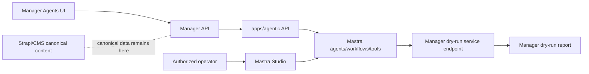

# feat: Agentic Runtime App

## Overview

Create `apps/agentic` as Forge's first-class Agentic runtime and Mastra Studio app. Manager is the first consumer, but Agentic must be a reusable app boundary for future Forge apps, not a hidden Manager dependency.

V1 should prove the smallest safe path: scaffold `@forge/agentic`, expose an authenticated/operator-only Studio, add one constrained Mastra workflow that can trigger a Manager automation dry-run through an explicit service contract, and prove that no Manager-owned live side effect can happen without Manager-owned approval.

## Problem Statement

Manager already has template-driven agents/automations, dry-run reports, durable enrichment workflows, and service bearer routes. The repo does not currently have `apps/agentic`, `packages/agents`, or any `@mastra/*` implementation in this checkout. If Mastra is embedded directly into Manager, future apps will either duplicate agent runtime code or cross-import Manager internals, violating app boundaries.

The new runtime also introduces a sharp security boundary. Official Mastra docs note that Studio connects to a running Mastra server and can manage agents, workflows, and tools; without authentication, Studio and API routes are public. Therefore Studio access, service-to-service authority, and dry-run/approval behavior must be part of V1, not a later hardening pass.

## Source Context

- Brainstorm: `docs/brainstorms/2026-05-01-agentic-runtime-app-requirements.md`
- Roadmap: `docs/roadmap/platform/feat-115-agentic-runtime-app.md`
- New app pattern: `docs/solutions/platform/adding-new-apps.md`
- CI/deploy pattern: `docs/solutions/platform/new-app-ci-and-deployment-patterns.md`
- Railway caveat: `docs/solutions/deployment/railway-dashboard-override-shadows-railway-toml-20260429.md`
- Manager automation contracts: `apps/manager/src/features/agents/automation-contract.ts`
- Manager automation runner: `apps/manager/src/features/agents/automation-runner.ts`
- Manager service enqueue route: `apps/manager/src/app/api/automations/runs/[id]/enqueue/route.ts`
- Manager service auth: `apps/manager/src/lib/auth.ts`
- Manager-to-admin service proxy precedent: `apps/manager/src/lib/admin-embed-trigger.ts`

## External Research

- Mastra project structure uses `src/mastra/index.ts` as the central entry point, with `src/mastra/agents`, `src/mastra/tools`, and `src/mastra/workflows` as the default organization: https://mastra.ai/docs/getting-started/project-structure
- Mastra manual install requires modern TS settings (`module`/`moduleResolution` compatible with bundler/ES modules), and typical scripts are `mastra dev` and `mastra build`: https://mastra.ai/docs/getting-started/manual-install
- Mastra server builds into `.mastra/output/index.mjs`, exposes `GET /health`, defaults to port `4111`, and can run with `mastra start` or `node .mastra/output/index.mjs`: https://mastra.ai/docs/deployment/mastra-server
- Mastra Studio can run alongside the server or as a standalone SPA. The docs explicitly warn that once connected to a server, Studio has full access to agents, workflows, and tools and must be secured in production: https://mastra.ai/docs/studio/deployment
- Mastra Studio auth says setting `server.auth` protects both Studio UI and built-in/custom API routes. Without auth, Studio and all API routes are public: https://mastra.ai/docs/studio/auth
- Mastra storage persists suspended workflows, memory, traces, eval datasets, and workflow state; without storage configuration, data does not persist across restarts/deployments: https://mastra.ai/docs/server-db/storage

## Proposed Solution

Build `apps/agentic` as a standalone Mastra server app inside the pnpm workspace. The app owns Mastra runtime configuration, Studio, agents, tools, workflows, operational storage, app-local docs, and deployment configuration.

Manager integrates through HTTP APIs only. The first integration is intentionally narrow:

1. Manager starts an Agentic dry-run workflow for an existing automation.
2. Agentic records a Mastra runtime run/session and calls a Manager endpoint that can only execute `runMode: "dry_run"`.
3. Manager returns a dry-run report with `enqueuedCount: 0` and no normal enrichment jobs.
4. Manager shows the report/run result in its existing Agents surfaces or a minimal integration proof surface.
5. Studio shows the Mastra run/session only to an authorized operator.

No live mutation path is allowed in this slice. If a later plan adds live actions, it must introduce Manager-owned approval/session semantics before Agentic can enqueue live work.

## Architecture



### Ownership Boundaries

- Agentic owns: runtime sessions, workflow run IDs, tool registration, Studio, operational traces, Mastra storage, and Agentic app docs.
- Manager owns: enrichment job truth, automation definitions, dry-run reports, live job creation, human approval surfaces, and Manager UI.
- CMS/Strapi owns: canonical content.
- Future apps consume Agentic through documented APIs or a deliberately scoped shared contract package created in a later PR.

### Runtime State

V1 must explicitly choose storage:

- Local development: LibSQL/file-backed Mastra storage is acceptable.
- Deployed environments: use a real persistent store if run/session history must survive deploys. If no production storage is provisioned in V1, document runtime state as non-durable and keep the first user-facing report in Manager, not only in Mastra.

The preferred V1 default is: Mastra stores operational state in its configured storage, and Manager stores the operator-visible dry-run report. This keeps user-visible truth out of Mastra until the runtime has production storage and retention decisions.

## API Contract

### Agentic Endpoint: Start Manager Automation Dry Run

Create a custom Mastra API route, exact framework wiring to be confirmed during implementation:

```http
POST /forge/manager-automation-dry-run
Authorization: Bearer ${AGENTIC_SERVICE_API_KEY}
Content-Type: application/json
```

Request:

```ts
type StartManagerAutomationDryRunRequest = {
  automationDocumentId: string
  requestedBy: {
    kind: "manager_user" | "service"
    id: string
  }
  idempotencyKey: string
}
```

Response:

```ts
type StartManagerAutomationDryRunResponse =
  | {
      ok: true
      agenticRunId: string
      managerAutomationRunDocumentId: string
      status: "queued" | "running" | "success" | "no_op" | "failed"
      reportUrl?: string
      summary: string
    }
  | {
      ok: false
      code:
        | "unauthorized"
        | "not_found"
        | "invalid_automation"
        | "manager_unavailable"
        | "mastra_runtime_error"
      message: string
    }
```

### Manager Endpoint: Dry-Run Only Backstop

Do not let Agentic call the existing live/dry-run enqueue route with a broad payload in V1. Add or wrap a Manager route with a dry-run-only contract, for example:

```http
POST /api/automations/{id}/agentic-dry-run
Authorization: Bearer ${MANAGER_AGENTIC_API_KEY}
Content-Type: application/json
```

Requirements:

- It must derive the automation from Manager/CMS-owned state by `id`; Agentic should not send a full automation object that can drift or be forged.
- It must force `runMode: "dry_run"` server-side.
- It must reject templates that are not creatable today.
- It must return typed `ok`/`code` results and include the Manager dry-run report or a URL/reference to it.
- It must never call `createEnrichmentJobs(...)`, `runVideoEnrichment(...)`, CMS writer endpoints, Mux track writes, or embedding index writers.

## Implementation Phases

### Phase 0: Red Tests And Contract Lock

Write failing tests before implementation:

- `apps/agentic/src/config/env.test.ts` proves missing production auth/storage/model env vars fail validation, while CI placeholders are accepted.
- `apps/agentic/src/mastra/index.test.ts` proves the Mastra instance registers the expected workflow/tool IDs and has auth configured.
- `apps/agentic/src/api/manager-automation-dry-run.test.ts` proves anonymous requests fail, malformed payloads fail, and valid requests call the workflow launcher with an idempotency key.
- `apps/manager/src/app/api/automations/[id]/agentic-dry-run/route.test.ts` proves the route forces dry-run and rejects attempts to pass `runMode: "live"`.
- `apps/manager/src/features/agents/automation-runner.test.ts` or route-level tests prove Agentic dry-run does not call `createEnrichmentJobs(...)`.
- A cross-app contract fixture test validates the same request/response shapes from both apps.

Green happens only after the implementation satisfies these tests.

### Phase 1: Scaffold `apps/agentic`

Create:

- `apps/agentic/package.json` with `name: "@forge/agentic"`, standard scripts, and Mastra dependencies.
- `apps/agentic/tsconfig.json` using Mastra-compatible modern TS module settings.
- `apps/agentic/.env.example` and `.env.ci`.
- `apps/agentic/src/config/env.ts` with Zod validation and CI-safe behavior.
- `apps/agentic/src/mastra/index.ts` as the central Mastra registry.
- `apps/agentic/src/mastra/agents/manager-automation-agent.ts`
- `apps/agentic/src/mastra/tools/manager-automation-dry-run-tool.ts`
- `apps/agentic/src/mastra/workflows/manager-automation-dry-run-workflow.ts`
- `apps/agentic/AGENTS.md` and `apps/agentic/CLAUDE.md`.
- `apps/agentic/railway.toml` if the team intends Config-as-code Path to be set for the service.

Do not add root workspace globs. `pnpm-workspace.yaml` already covers `apps/*`.

### Phase 2: Secure Studio And Server

- Configure Mastra server host/port for local and Railway. Use `0.0.0.0` in deployed server config.
- Keep `GET /health` unauthenticated and minimal.
- Configure Studio/auth so anonymous users cannot access Studio or built-in/custom Mastra API routes.
- Prefer a simple V1 auth gate that is production-safe over a broad dev bypass. If using Mastra Simple Auth locally, make it impossible to enable in production accidentally.
- Document whether Cloudflare Access, Mastra `server.auth`, Railway private networking, or another operator gate is the production source of truth.

### Phase 3: Manager Integration

- Add Manager env var(s) for Agentic base URL and service auth.
- Add a Manager client module modeled after `apps/manager/src/lib/admin-embed-trigger.ts`: Zod input/output validation, timeout, typed errors, no raw provider messages.
- Add the Manager dry-run-only endpoint or wrapper that Agentic may call.
- Add a minimal Manager trigger path for one automation dry-run through Agentic. The UI can be tiny, but the user smoke must be real.
- Keep existing Manager automation reports and run history as the operator-facing source of truth.

### Phase 4: Docs, CI, Labels, Deployment

- Update `apps/AGENTS.md` and `apps/README.md` to list `agentic`, and opportunistically bring existing app ownership notes current for manager/admin/roadmap/tv if touched.
- Update `.github/workflows/issue-labels.yml` to include `agentic` as a valid scope, or document that PRs should use `feat(tooling): ...`. Prefer adding `agentic` because this is a first-class app.
- Add deployment documentation to `apps/agentic/CLAUDE.md`:
  - Railway service name.
  - Build command.
  - Start command.
  - Whether `apps/agentic/railway.toml` is authoritative.
  - Required proof that Railway `configFile` is not `null` when using a per-service toml.
- Add PR checklist notes for Red/Green TDD, user smoke, and post-deploy health/config verification.

### Phase 4 Implementation Notes

Docs/metadata preparation should land before or with the app scaffold:

- `apps/AGENTS.md` and `apps/README.md` list `apps/agentic` as a first-class app boundary and state that Manager is the first consumer through API contracts.
- `.github/workflows/issue-labels.yml` accepts `agentic` as an issue/PR scope, so the implementation PR title can use `feat(agentic): ...`.
- The PR description should include these validation commands once implementation files exist:
  - `pnpm --filter @forge/agentic lint`
  - `pnpm --filter @forge/agentic typecheck`
  - `pnpm --filter @forge/agentic test`
  - `pnpm --filter @forge/agentic build`
  - `pnpm --filter @forge/manager test -- src/app/api/automations src/features/agents`
  - `pnpm --filter @forge/manager typecheck`
  - `pnpm run format:check`
  - `git diff --check`
- The PR description should include post-deploy monitoring notes for `apps/agentic`:
  - Confirm the Railway deployment record has `configFile: "apps/agentic/railway.toml"` if the app-local toml is intended to be authoritative.
  - Treat `configFile: null` as a failed deploy-configuration verification, not as an acceptable default.
  - Confirm `/health` returns `200` without auth.
  - Confirm Studio and Mastra API routes reject anonymous access and allow only the intended operator/service credential path.
  - Capture exact local and deployed URLs used for the Manager dry-run smoke, Studio authorized smoke, and anonymous Studio rejection.

### Phase 5 Implementation Notes

- `apps/agentic` now exists as `@forge/agentic` with Mastra runtime, Studio, auth-gated custom route, LibSQL runtime storage configuration, package-local docs, and Railway config.
- Manager integrates through HTTP only via `AGENTIC_BASE_URL` and service bearer credentials; the first Manager route is dry-run-only and rejects `runMode: "live"`.
- Mastra custom route path is `/forge/manager-automation-dry-run` rather than `/api/forge/manager-automation-dry-run`, because Mastra reserves `/api/*` routes for built-in API behavior.
- Red/Green TDD evidence:
  - Red: initial `pnpm --filter @forge/agentic test` failed on missing route/env/runtime registration behavior before implementation.
  - Green: `pnpm --filter @forge/agentic test`, `typecheck`, `lint`, and `build` passed after implementation.
  - Green: `pnpm --filter @forge/manager test -- src/app/api/automations src/features/agents src/lib/agentic-automation-dry-run.test.ts`, `typecheck`, and `lint` passed after implementation.
- User smoke evidence:
  - Local Agentic built server ran on `http://127.0.0.1:4111` with a fake Manager service on `http://127.0.0.1:3999`.
  - `GET /health` returned HTTP `200`.
  - Anonymous `POST /forge/manager-automation-dry-run` returned HTTP `401`.
  - Authenticated `POST /forge/manager-automation-dry-run` returned HTTP `200` with `managerAutomationRunDocumentId: "manager-run-smoke"` and a dry-run summary.
  - Anonymous Studio `GET /` returned HTTP `401`.
  - Authorized Studio `GET /` returned HTTP `200`.
  - Browser screenshots were captured at `output/mastra-studio-authorized-smoke.png` and `output/mastra-studio-anonymous-rejected-smoke.png`.

### Phase 6 Mastra Docs-Alignment Follow-Up

- External docs review found three setup mismatches after the first PR pass:
  service credentials were too broad, `/health` was duplicated as a custom route
  even though Mastra provides a built-in health endpoint, and Railway `PORT`
  fallback was missing.
- Red/Green TDD evidence:
  - Red: `pnpm --filter @forge/agentic test` failed because `PORT` was ignored
    and a service bearer token could pass the global middleware for Studio/root
    access.
  - Green: service bearer access is now limited to the Manager dry-run `POST`
    route; operator bearer access covers Studio and built-in APIs; `/health`
    relies on Mastra's built-in endpoint; `AGENTIC_PORT` takes precedence over
    Railway `PORT`, with `PORT` as the fallback.
- Additional tests lock service-token rejection for `/` and `/api/agents`,
  operator-token access for Studio/built-ins, direct `server.auth.authorize`
  behavior, invalid service bearer rejection on the dry-run route, and port
  precedence.
- Follow-up smoke evidence:
  - Built Agentic server ran on `http://127.0.0.1:4112` with `PORT=4112` and
    `AGENTIC_PORT` unset, proving Railway `PORT` fallback.
  - `GET /health` returned HTTP `200` with Mastra built-in body
    `{"success":true}`.
  - Anonymous Studio `GET /` returned HTTP `401`.
  - Operator Studio `GET /` returned HTTP `200`.
  - Service bearer Studio `GET /` returned HTTP `401`.
  - Service bearer `GET /api/agents` returned HTTP `401`.
  - Service bearer `POST /forge/manager-automation-dry-run` returned HTTP `200`
    with `managerAutomationRunDocumentId: "manager-run-smoke-2"`.
  - Browser screenshots were captured at
    `output/mastra-studio-operator-auth-followup.png` and
    `output/mastra-studio-service-rejected-followup.png`.

## Red/Green TDD Requirements

The implementation PR must begin with failing tests that demonstrate:

- `apps/agentic` cannot start insecurely in production mode without an auth/operator gate.
- Anonymous Studio/API access is rejected while `/health` remains public.
- The Manager-to-Agentic contract validates payloads and returns typed errors.
- The Agentic-to-Manager contract can only run dry-run behavior in V1.
- Dry-run never calls Manager live job creation.
- The first Mastra workflow records a run ID/idempotency key and returns a stable status/result shape.

Then implement until those tests pass. Do not accept a PR that only tests Mastra agent internals without testing service auth and cross-app boundary behavior.

## User Smoke Test

Required before PR is marked ready:

1. Start `apps/agentic` locally on a non-conflicting port, expected default `4111` unless the implementation chooses another.
2. Start Manager locally with `AGENTIC_BASE_URL` and service credentials pointed at the Agentic app.
3. Log in to Manager as a Manager user.
4. Trigger the Agentic-backed automation dry-run from the Manager UI or an authenticated Manager route.
5. Confirm Manager shows a dry-run report with `runMode: "dry_run"`, `enqueuedCount: 0`, `wouldEnqueueCount` populated when candidates exist, and suppressed operations visible.
6. Confirm no normal enrichment job is created and no live workflow is dispatched.
7. Open Mastra Studio as an authorized operator and confirm the corresponding run/session is visible.
8. Attempt anonymous Studio access and confirm it fails.
9. Capture browser evidence with a screenshot or short note of the exact local URLs and visible states.

If browser smoke is blocked by missing local dependencies or credentials, leave the PR as draft and document the blocker.

## Acceptance Criteria

- [x] `apps/agentic` exists as package `@forge/agentic` with standard `dev`, `build`, `start`, `lint`, `typecheck`, and `test` scripts.
- [x] `apps/agentic` follows Mastra project structure with `src/mastra/index.ts`, `agents`, `tools`, and `workflows`.
- [x] Studio and Mastra API routes are protected by an explicit auth/access layer; anonymous access is rejected in tests and smoke.
- [x] `GET /health` stays unauthenticated and returns `200`.
- [x] Manager calls Agentic through an HTTP/API contract only; no app-to-app imports.
- [x] Agentic can call only a Manager dry-run-only contract in V1.
- [x] Manager dry-run report remains operator-visible and no live jobs are created.
- [x] Runtime/session storage choice is documented, with production durability limits stated honestly.
- [x] `apps/agentic/AGENTS.md` and `apps/agentic/CLAUDE.md` explain ownership, env vars, auth, runtime state, tools/workflows, and cross-app rules.
- [x] `apps/AGENTS.md`, `apps/README.md`, and issue/PR label scopes are updated for the new app.
- [x] Railway deployment config source of truth is verified or explicitly documented.
- [x] Red/Green tests and user smoke test evidence are included in the PR.

## Validation Commands

Run from repo root:

```bash
pnpm install
pnpm --filter @forge/agentic lint
pnpm --filter @forge/agentic typecheck
pnpm --filter @forge/agentic test
pnpm --filter @forge/agentic build
pnpm --filter @forge/manager test -- src/app/api/automations src/features/agents
pnpm --filter @forge/manager typecheck
pnpm run format:check
git diff --check
```

Deployment or production-readiness verification:

```bash
curl -i "$AGENTIC_BASE_URL/health"
# If Railway Config-as-code Path is intended:
# verify deployment configFile references apps/agentic/railway.toml instead of null
```

## PR Requirements

- Branch: `feat/115-mastra-agentic-runtime-app`
- PR title: `feat(agentic): add Agentic runtime app`
- Target: `main`
- Do not skip pre-commit hooks.
- Keep the PR scoped to the Agentic app, Manager first integration, docs, CI labels, and roadmap status.
- If user smoke is incomplete, open as draft with the exact blocker.

## Risks And Mitigations

- **Studio accidentally public:** Require failing anonymous-access tests first; document production gate; smoke anonymous access.
- **Agentic can mutate Manager live state:** Use a dry-run-only Manager route and a distinct service credential; do not give Agentic generic live enqueue authority in V1.
- **Contract drift between apps:** Share Zod schemas only if needed; otherwise use mirrored fixtures and contract tests in both apps.
- **Agentic runtime state mistaken for content truth:** Document operational-only state and keep Manager/CMS as sources of truth.
- **Railway toml ignored:** Verify Config-as-code Path or document dashboard config as canonical before considering deployment complete.
- **External framework churn:** Pin Mastra package versions and record the exact official docs used in `apps/agentic/CLAUDE.md`.

## Out Of Scope

- Free-form agents that can mutate CMS/Mux/content without approval.
- Moving Manager enrichment workflows into Agentic.
- Recreating the absent `packages/agents` package in this first slice.
- Replacing Strapi/CMS or Manager job state with Agentic storage.
- Production deployment to Mastra Platform unless explicitly chosen in a follow-up.

## Next Steps

Post-deploy verification remains: confirm Railway `configFile` references `apps/agentic/railway.toml`, then repeat `/health`, Studio auth, and Manager dry-run smoke against the deployed URLs.
