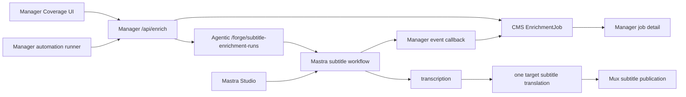

# feat: Agentic Subtitle Enrichment Workflow

## Overview

Recreate Manager's subtitle enrichment execution as an Agentic/Mastra workflow so Manager becomes the consumer/control plane rather than the workflow host. Manager keeps the operator UX, coverage selection, automation eligibility, approvals, CMS-backed `EnrichmentJob` truth, and job detail screens. Agentic owns the Mastra workflow run, runtime state, traces, retries, Studio visibility, and subtitle execution.

V1 is intentionally subtitle-only:

1. Source subtitle/transcription step.
2. One target-language subtitle translation step.
3. Mux subtitle publication step.
4. Agentic-to-Manager events that update the existing job detail UI.

Do not migrate chapters, metadata, embeddings, audio cleanup, scene analysis, voiceover, or other enrichment steps in this plan.

## Source Context

- Brainstorm: `docs/brainstorms/2026-05-05-agentic-subtitle-enrichment-backend-brainstorm.md`
- Roadmap: `docs/roadmap/media-generation/feat-116-agentic-subtitle-enrichment-backend.md`
- Agentic app boundary: `apps/agentic/AGENTS.md`
- Manager app boundary: `apps/manager/AGENTS.md`
- Current Manager workflow: `apps/manager/src/workflows/videoEnrichment.ts`
- Current dispatch wrapper: `apps/manager/src/workflows/launchVideoEnrichment.ts`
- Current Manager enrichment route: `apps/manager/src/app/api/enrich/route.ts`
- Existing Agentic dry-run contract: `apps/agentic/src/contracts/manager-automation-dry-run.ts`
- Existing Agentic route pattern: `apps/agentic/src/api/manager-automation-dry-run.ts`
- Existing Manager Agentic client: `apps/manager/src/lib/agentic-automation-dry-run.ts`
- Current subtitle service: `apps/manager/src/services/subtitleTranslation/index.ts`
- Current Mux sync service: `apps/manager/src/services/mux-sync/index.ts`
- Current job state adapter: `apps/manager/src/lib/state.ts`
- Current job step model: `apps/manager/src/lib/workflow-steps.ts`

## External Research

Mastra docs were rechecked because workflow APIs and Studio behavior are framework-owned and drift-prone.

- Workflows are appropriate for known multi-step processes where execution order, schemas, and data flow must be explicit: https://mastra.ai/docs/workflows/overview
- Mastra workflow steps use `createStep()` with input/output schemas; workflows use `createWorkflow()` and `.commit()`: https://mastra.ai/docs/workflows/overview
- Registered workflows should be accessed through `mastra.getWorkflow()` for runtime config, telemetry, storage, and type inference: https://mastra.ai/docs/workflows/overview
- Mastra can stream workflow run events and returns typed statuses such as `success`, `failed`, `suspended`, `tripwire`, and `paused`: https://mastra.ai/docs/workflows/overview
- Workflow state persists across the run and suspend/resume cycles through state schemas: https://mastra.ai/docs/workflows/workflow-state
- Workflow steps can call registered agents or tools from `execute()`, which fits Agentic-owned execution tools: https://mastra.ai/docs/workflows/agents-and-tools
- Mastra supports workflow and step retries for transient external failures: https://mastra.ai/docs/workflows/error-handling
- Suspended workflow snapshots persist through the configured storage provider, so production storage must be durable if run continuity matters: https://mastra.ai/docs/workflows/suspend-and-resume

## Institutional Learnings

- Keep dry-run branching above live job creation. Dry-run reports must not create jobs, artifacts, or Mux tracks. See `docs/solutions/integration-issues/manager-automation-dry-run-report-boundary-20260413.md`.
- Keep one target subtitle automation/run scoped to one target language until eligibility can model ownership per target language. See `docs/solutions/integration-issues/manager-agents-target-subtitle-contract-and-language-labels-20260412.md`.
- Keep provider routing and attempt provenance in metadata artifacts, not canonical transcript/subtitle outputs. See `docs/solutions/integration-issues/manager-transcription-routing-artifact-boundary-20260412.md`.
- Do not overwrite the last successful canonical transcript/subtitle artifacts on failed reruns. See `docs/solutions/integration-issues/manager-elevenlabs-routing-and-rerun-2026-04-11.md`.
- Test dispatch and runtime boundaries, not only workflow body behavior. See `docs/solutions/best-practices/workflow-dispatch-test-mode-divergence-20260421.md`.
- For Agentic Railway deployment, verify the service really uses `apps/agentic/railway.toml`; an app-local file is ignored unless Railway's Config-as-code Path points to it. See `docs/solutions/platform/new-app-ci-and-deployment-patterns.md`.

## Proposed Solution

Add a subtitle-only Agentic workflow and route:

```http
POST /forge/subtitle-enrichment-runs
Authorization: Bearer ${AGENTIC_SERVICE_API_KEY}
Content-Type: application/json
```

Manager creates the CMS job first, then calls Agentic with an approved job id, materialization context, source language, exactly one target language, and an idempotency key. Agentic starts a Mastra run and emits events back to Manager:

```http
POST /api/agentic/subtitle-enrichment-runs/:runId/events
Authorization: Bearer ${MANAGER_AGENTIC_API_KEY}
Content-Type: application/json
```

Manager applies those events idempotently to the CMS-backed `EnrichmentJob`. Manager never imports Agentic internals, and Agentic never imports Manager internals.



## Ownership Decisions

### Manager Owns

- Coverage selection and operator intent.
- Automation eligibility, caps, dry-run reports, and approval state.
- CMS `EnrichmentJob` creation and user-visible job truth.
- Job detail rendering, artifact review links, override and recovery UI.
- Agentic feature flag and local fallback before Agentic accepts a run.

### Agentic Owns

- Mastra workflow definition and run id.
- Runtime storage, run status, traces, Studio visibility, retries, and step execution.
- Subtitle workflow execution for source transcription, one target translation, and Mux subtitle publication.
- Event emission to Manager.

### Shared Through Contracts Only

- Request/response schemas.
- Event envelope schemas.
- Artifact manifest shapes.
- Failure code enums.

If implementation reveals duplicated pure service logic is becoming unsafe, create a deliberately scoped shared package for provider clients and artifact schemas. Do not cross-import app internals.

## Key Contracts

### Start Request

File: `apps/agentic/src/contracts/subtitle-enrichment-run.ts`

```ts
type StartSubtitleEnrichmentRunRequest = {
  jobId: string
  videoDocumentId?: string
  assetId: string
  muxAssetId: string
  muxPlaybackId?: string
  sourceLanguage: string
  targetLanguage: string
  materialization: {
    mode: "direct_mux_asset_reuse" | "snapshot_to_stage_clone"
    targetEnvironment: "mux-production" | "mux-stage"
  }
  requestedTranscriptionProvider?: "automatic" | "mux" | "elevenlabs"
  initialArtifacts?: Record<string, unknown>
  requestedBy: {
    kind: "manager_user" | "service"
    id: string
  }
  idempotencyKey: string
}
```

Rules:

- `targetLanguage` is singular in V1.
- Agentic rejects a duplicate `idempotencyKey` with a different normalized payload as `idempotency_conflict`.
- Agentic rejects requests without a Manager-created job id as `job_not_approved`.
- Service bearer can call only this route and the existing dry-run route; operator bearer can access Studio/API.

### Start Response

```ts
type StartSubtitleEnrichmentRunResponse =
  | {
      ok: true
      agenticRunId: string
      managerJobId: string
      status: "queued" | "running"
      summary: string
    }
  | {
      ok: false
      code:
        | "unauthorized"
        | "invalid_request"
        | "job_not_approved"
        | "idempotency_conflict"
        | "manager_unavailable"
        | "mastra_runtime_error"
      message: string
    }
```

### Event Envelope

File: `apps/manager/src/app/api/agentic/subtitle-enrichment-runs/[runId]/events/route.ts`

```ts
type SubtitleEnrichmentRunEvent = {
  eventId: string
  runId: string
  jobId: string
  idempotencyKey: string
  sequence: number
  occurredAt: string
  type:
    | "workflow_started"
    | "step_started"
    | "step_completed"
    | "step_failed"
    | "artifact_created"
    | "workflow_completed"
    | "workflow_failed"
  step?: "transcription" | "translation" | "mux_upload"
  artifactKey?: string
  artifacts?: Record<string, unknown>
  details?: Record<string, unknown>
  error?: {
    code: string
    message: string
  }
}
```

Manager event rules:

- Deduplicate by `eventId`.
- Reject events where `runId` path param and body `runId` differ.
- Apply events in increasing `sequence`.
- Ignore stale non-terminal events after a terminal job state.
- Allow terminal `workflow_failed` to record evidence even if a previous step event was missed.
- Persist only sanitized error messages and artifact metadata.

## Subtitle-Only Job Model

Current Manager job initialization assumes the full enrichment pipeline. Agentic subtitle-only runs need a distinct step model so Manager does not show unrelated steps as pending.

Implementation should add either:

1. `workflowKind: "full_enrichment" | "subtitle_only"` in job options plus a step initializer, or
2. a narrower `createSubtitleOnlyJob(...)` helper that seeds only subtitle steps.

Preferred V1:

- `transcription`
- `translation`
- `mux_upload`

Non-V1 steps should not be shown as pending. If the UI needs continuity, mark them `skipped` with detail reason `not_in_subtitle_only_v1`.

## Implementation Plan

### Phase 0: Contract Decisions And Red Tests

Add failing tests before implementation:

- `apps/agentic/src/contracts/subtitle-enrichment-run.test.ts`
  - validates singular target language
  - rejects malformed materialization
  - validates response failure codes
- `apps/agentic/src/api/subtitle-enrichment-run.test.ts`
  - rejects anonymous and operator/service misuse correctly
  - launches valid requests with idempotency
  - rejects duplicate key with different payload
- `apps/manager/src/lib/agentic-subtitle-enrichment.test.ts`
  - posts to `/forge/subtitle-enrichment-runs`
  - handles config missing, timeout, invalid JSON, contract mismatch, and upstream errors
- `apps/manager/src/app/api/agentic/subtitle-enrichment-runs/[runId]/events/route.test.ts`
  - authenticates with `MANAGER_AGENTIC_API_KEY`
  - dedupes duplicate events
  - rejects out-of-order or mismatched run events
  - maps step events to existing job status fields

Red proof commands:

```sh
pnpm --filter @forge/agentic test -- src/contracts/subtitle-enrichment-run.test.ts
pnpm --filter @forge/agentic test -- src/api/subtitle-enrichment-run.test.ts
pnpm --filter @forge/manager test -- src/lib/agentic-subtitle-enrichment.test.ts
pnpm --filter @forge/manager test -- "src/app/api/agentic/subtitle-enrichment-runs/[runId]/events/route.test.ts"
```

Expected before implementation: these tests fail because the files/contracts do not exist.

### Phase 1: Agentic Route, Workflow Shell, Registry, And Auth

Build:

- `apps/agentic/src/contracts/subtitle-enrichment-run.ts`
- `apps/agentic/src/api/subtitle-enrichment-run.ts`
- `apps/agentic/src/mastra/workflows/subtitle-enrichment-workflow.ts`
- registry wiring in `apps/agentic/src/mastra/index.ts`

Initial workflow may be no-op except for start and completion events. It must still use a real Mastra workflow registration so Studio can see it.

Tests:

- Agentic contract tests pass.
- Agentic route tests pass.
- Agentic registry test proves:
  - `subtitleEnrichmentWorkflow` is registered
  - `/forge/subtitle-enrichment-runs` is registered
  - service bearer can call this route
  - service bearer cannot access Studio or built-in `/api/*`
  - operator bearer can access Studio and built-in API

### Phase 2: Manager Client, Feature Flag, And Callback Ingestion

Build:

- `apps/manager/src/lib/agentic-subtitle-enrichment.ts`
- `apps/manager/src/app/api/agentic/subtitle-enrichment-runs/[runId]/events/route.ts`
- feature flag in `apps/manager/src/config/env.ts`, for example `AGENTIC_SUBTITLE_ENRICHMENT_ENABLED`
- `.env.example` updates for Manager and Agentic as needed

Rules:

- If the flag is disabled, Manager uses the existing local workflow path.
- If the flag is enabled but Agentic env is missing, Manager fails closed with a per-video batch error.
- Fallback to local workflow is allowed only before Agentic accepts a run.
- After `agenticRunId` exists, retry/resume/cancel must use Agentic run/idempotency semantics, not local redispatch.

Tests:

- Manager `/api/enrich` creates a subtitle-only job and calls Agentic behind the flag.
- Manager `/api/enrich` uses local `launchVideoEnrichment(...)` when the flag is disabled.
- Manager rejects Agentic subtitle-only dispatch when more than one target language is selected.
- Event callback updates step/job status and artifacts through `updateJob`/`updateStepStatus`.

### Phase 3: Subtitle-Only Step Model

Build:

- subtitle-only job step initializer in `apps/manager/src/lib/workflow-steps.ts` or adjacent helper
- `workflowKind` tracking in job options/types where needed
- Manager UI presenter adjustments only if required to avoid pending non-V1 steps

Tests:

- New subtitle-only jobs seed `transcription`, `translation`, and `mux_upload`.
- Non-subtitle steps do not remain pending in job detail.
- Existing full enrichment jobs keep the full step list.

### Phase 4: Agentic Subtitle Execution

Move execution into Agentic without importing Manager internals.

Preferred implementation:

- Re-home or extract pure subtitle runtime primitives needed by Agentic.
- Keep shared schemas in the contract file or a deliberately scoped package if required.
- Agentic uses its own tools/steps for:
  - transcription
  - subtitle translation
  - artifact creation
  - Mux subtitle publication

Agentic must not receive broad CMS mutation credentials. Manager remains the only writer of CMS job truth through event callbacks.

Tests:

- Agentic workflow test proves transcription emits canonical `transcript.json` artifact metadata.
- Agentic workflow test proves translation emits `subtitles-{lang}.vtt` and `translation-{lang}.json` artifact metadata.
- Agentic workflow test proves failure emits `step_failed` and `workflow_failed` events.
- Artifact compatibility tests compare output key names and metadata shape with current Manager expectations.

### Phase 5: Mux Publication And Reports

Agentic can perform Mux subtitle publication only after Manager has approved the job and sent the materialized target context. The result must preserve the current `MuxSyncReport` shape so Manager job detail, override, and recovery flows remain meaningful.

Tests:

- Mux publication emits a `mux_upload` completion event with report metadata.
- Mux publication failures map to `mux_sync_failed` without masking prior successful transcript/subtitle artifacts.
- Existing Manager Mux override tests continue to pass.

### Phase 6: User Smoke And Deployment Proof

User smoke test:

1. Run Manager and Agentic locally.
2. Open Manager Coverage.
3. Select one video and exactly one target language.
4. Start subtitle enrichment.
5. Verify Manager job detail shows transcription, translation, and Mux upload progress from Agentic events.
6. Verify non-subtitle steps are not left pending.
7. Verify subtitle artifact links resolve.
8. Open Mastra Studio with operator bearer auth.
9. Verify the matching Agentic run appears in Studio.
10. Verify anonymous Studio/API access is rejected.

Capture proof:

- Browser screenshot of Manager job detail.
- Browser screenshot or HTTP proof of Studio run visibility behind operator auth.
- HTTP proof that service token cannot access Studio or built-in `/api/*`.

Railway/stage proof:

- Verify `agentic` Railway service is named `agentic`.
- Verify Config-as-code Path points to `apps/agentic/railway.toml`.
- Verify deployment record has non-null `configFile`.
- Verify `/health` is public.
- Verify service and operator tokens are distinct.
- Verify production storage is durable, not `:memory:` or relative file storage.

## Acceptance Criteria

### Functional

- [x] Manager can start subtitle-only enrichment through Agentic behind a feature flag.
- [x] Manager remains the source of user-visible job truth.
- [ ] Agentic owns the Mastra workflow run and appears in Studio.
- [x] Manual Coverage Agentic dispatch requires exactly one target language.
- [ ] Automation live dispatch still uses Manager eligibility, caps, and duplicate suppression before Agentic execution.
- [ ] Automation dry-run still stops before job creation and suppresses artifact/Mux mutations.
- [x] Agentic events update Manager job status, subtitle step status, artifacts, and errors.
- [x] Duplicate idempotency key with the same payload returns the same run or stable result.
- [x] Duplicate idempotency key with a different payload returns `idempotency_conflict`.
- [x] Agentic does not receive broad CMS mutation credentials.

### Red/Green TDD

- [x] Red tests are committed or at least captured before implementation for Agentic contracts.
- [x] Red tests are committed or at least captured before implementation for Manager Agentic client behavior.
- [x] Red tests are committed or at least captured before implementation for Manager event ingestion.
- [x] Green implementation makes those tests pass without weakening existing local workflow tests.
- [x] Existing Manager full enrichment dispatch tests continue to pass.

### User Smoke

- [ ] Manager Coverage to job detail flow is tested in a browser.
- [ ] Mastra Studio run visibility is tested with operator auth.
- [x] Anonymous Studio/API access rejection is tested.
- [x] Smoke evidence is saved under `output/playwright/` or the current repo proof location.

## Implementation Progress

Completed in the first implementation branch:

- Added Agentic subtitle enrichment request/response contracts, service route,
  idempotency handling, Mastra workflow registration, and prototype workflow
  event emission.
- Added Manager Agentic client, feature flag, subtitle-only job step model, and
  callback event ingestion.
- Wired Manager `/api/enrich` to call Agentic behind
  `AGENTIC_SUBTITLE_ENRICHMENT_ENABLED` for exactly one target language.
- Proved service bearer access is limited to the Forge service route while
  anonymous/built-in API access remains rejected.

Deferred follow-up:

- Real subtitle transcription, subtitle translation artifact generation, Mux
  subtitle publication, Manager Coverage browser proof, and Studio run browser
  proof are tracked in
  `todos/016-pending-p1-complete-agentic-subtitle-execution-and-smoke.md`.

Smoke evidence captured:

- `output/playwright/agentic-subtitle-health-smoke.png`
- `output/playwright/agentic-subtitle-unauthorized-smoke.png`

Validation completed on 2026-05-05:

- `pnpm --filter @forge/agentic lint`
- `pnpm --filter @forge/agentic typecheck`
- `pnpm --filter @forge/agentic test`
- `pnpm --filter @forge/agentic build`
- `pnpm --filter @forge/manager lint`
- `pnpm --filter @forge/manager typecheck`
- `pnpm --filter @forge/manager test`
- `pnpm run format:check`
- `git diff --check`

## Validation Commands

Run before PR:

```sh
pnpm --filter @forge/agentic lint
pnpm --filter @forge/agentic typecheck
pnpm --filter @forge/agentic test
pnpm --filter @forge/agentic build
pnpm --filter @forge/manager lint
pnpm --filter @forge/manager typecheck
pnpm --filter @forge/manager test
pnpm run format:check
git diff --check
```

Focused tests likely needed during implementation:

```sh
pnpm --filter @forge/agentic test -- src/contracts/subtitle-enrichment-run.test.ts
pnpm --filter @forge/agentic test -- src/api/subtitle-enrichment-run.test.ts
pnpm --filter @forge/agentic test -- src/mastra/workflows/subtitle-enrichment-workflow.test.ts
pnpm --filter @forge/agentic test -- src/mastra/index.test.ts
pnpm --filter @forge/manager test -- src/lib/agentic-subtitle-enrichment.test.ts
pnpm --filter @forge/manager test -- "src/app/api/agentic/subtitle-enrichment-runs/[runId]/events/route.test.ts"
pnpm --filter @forge/manager test -- src/app/api/enrich/route.test.ts
pnpm --filter @forge/manager test -- src/lib/workflow-steps.test.ts
```

## Risks And Mitigations

| Risk                                                         | Mitigation                                                                            |
| ------------------------------------------------------------ | ------------------------------------------------------------------------------------- |
| Manager shows pending non-subtitle steps                     | Add subtitle-only step initialization and UI/presenter tests                          |
| Duplicate or out-of-order Agentic events corrupt job truth   | Add event id, sequence, terminal precedence, and idempotent event tests               |
| Agentic gets too much CMS authority                          | Give Agentic no broad CMS mutation token; Manager writes CMS job truth from callbacks |
| Cross-app imports creep in                                   | Use HTTP contracts or a scoped shared package, never app internals                    |
| Mux sync semantics drift                                     | Preserve `MuxSyncReport` shape and existing override/recovery tests                   |
| Fallback creates duplicate work after Agentic accepted a run | Allow fallback only before `agenticRunId` exists                                      |
| Mastra Studio becomes public                                 | Keep operator bearer auth tests and browser smoke                                     |
| Railway ignores app-local config                             | Verify service Config-as-code Path and deployment `configFile`                        |

## PR And Branch Requirements

- Continue on branch `feat/116-agentic-subtitle-enrichment-workflow`.
- Use a PR title like `feat(agentic): add subtitle enrichment workflow backend`.
- Keep PR scope to `apps/agentic`, `apps/manager`, focused docs, and any deliberately scoped shared package.
- Do not include unrelated lockfile or generated GraphQL churn unless the implementation actually requires it.
- Include screenshots or equivalent browser proof in the PR body.
- Include Red/Green notes in the PR body: which tests failed before implementation and which commands passed after.

## Out Of Scope

- Multi-target-language subtitle runs.
- Chapters, metadata, embeddings, scene analysis, audio cleanup, and voiceover migration.
- Free-form agent instructions for live media mutation.
- Replacing Manager job and coverage UI.
- Making Mastra Studio the user-facing status source.
- Broad CMS mutation access from Agentic.

## Open Questions

None blocking. Defaults chosen for implementation:

1. Subtitle-only jobs use a distinct step set rather than the full enrichment step list.
2. Agentic owns subtitle execution and Mux publication only for Manager-approved jobs.
3. Manager applies callbacks idempotently by event id and sequence.
4. Idempotency conflicts reject mismatched duplicate payloads.
5. Rerun support should preserve old canonical artifacts until a replacement succeeds, but can be deferred unless the V1 UI exposes rerun for Agentic jobs.
