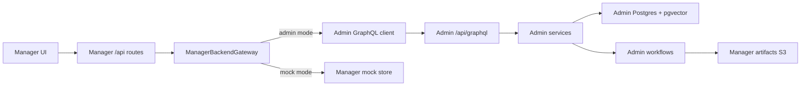

# feat: Migrate Manager backend from Strapi to Admin

## Overview

Move `apps/manager` off Strapi-backed auth, reads, and writeback contracts and
onto `apps/admin` as the backend. Manager's browser-facing dashboard and API
routes should stay stable for operators, but their upstream transport changes
from Strapi REST/GraphQL to Admin GraphQL/service-owned contracts.

This is a cross-app migration, but the product boundary is Manager: Admin adds
only the contracts Manager needs, and Manager becomes the consumer of those
contracts. Strapi remains useful as historical source evidence during
implementation, not as the runtime fallback for production.

## Latest `origin/main` Review

`origin/main` and this worktree are both at `87d2b985` (`feat(admin): classify
NoSuchKey as artifact_missing + emit missingArtifacts list (feat-119 PR1)
(#892)`). There is no unmerged local delta against remote main.

Admin is past foundation/v1 scaffold and into operational hardening plus
workflow expansion:

- `apps/admin/CLAUDE.md` marks Units 1-13 complete for the original Admin
  foundation: Next.js, Yoga/Pothos, Prisma/Postgres/pgvector, Better Auth,
  Core sync, workflow, storage, and operational surfaces.
- `apps/admin/docs/v1-operational-surfaces.md` says login, dashboard, system
  status, experiences, videos, workflows, embeddings, search, users, settings,
  languages, and media are real DB-backed surfaces, with several still
  intentionally read-only in v1.
- The latest main commits add or harden Admin media and embedding workflows:
  media library (#877), localized image enrichment (#884), embed-backfill
  parallelism/cache/bulk writes (#882/#885/#889), and manager-artifact
  `NoSuchKey` classification (#892).
- Admin already reads Manager artifacts from Manager's S3 bucket and Manager
  already has thin REST proxies to Admin embedding-trigger mutations.

Stage assessment: Admin is an operational Strapi-replacement platform with
Core-synced content/read models and workflow execution, but it is not yet a
drop-in Manager backend. Missing Manager-specific runtime contracts include
Manager access/session validation, `language-geo`, `video-coverage`,
coverage snapshots, enrichment job persistence, and replacement paths for
remaining Manager-to-CMS writeback helpers.

## Problem Frame

Manager currently depends on Strapi in these load-bearing ways:

- Login and dashboard auth use Strapi Users & Permissions endpoints and a
  `strapi-jwt` cookie.
- Manager server routes read Strapi custom REST endpoints:
  `/api/video-coverage` and `/api/language-geo`.
- Coverage snapshots and job state use Strapi GraphQL through
  `@forge/graphql`.
- `services/cmsClient.ts` posts to Strapi REST endpoints for embedding and
  backfill-related writes.
- The workflow step vocabulary still exposes CMS-shaped names such as
  `cms_notify`.

Retiring Strapi requires replacing those contracts with Admin-owned contracts
before removing the old env vars and tokens. The safest migration is
characterization-first: pin Manager's current browser-facing route payloads,
add Admin parity behind a new adapter, then cut over route by route.

## Requirements Trace

- R1. Manager production mode can boot and run without `STRAPI_URL`,
  `STRAPI_API_TOKEN`, or `STRAPI_INTERNAL_API_TOKEN`.
- R2. Manager login/session validation uses Admin Better Auth and Admin-owned
  access permissions, not Strapi Users & Permissions.
- R3. Manager's existing browser-facing routes keep their response contracts:
  `/api/videos`, `/api/languages`, `/api/coverage-snapshots`,
  `/api/jobs`, `/api/jobs/:id`, job events, and admin embed trigger routes.
- R4. Admin provides Manager-needed read models with service-layer ownership,
  Prisma/Postgres data access, and Pothos GraphQL exposure.
- R5. Enrichment job state moves from Strapi `EnrichmentJob` to Admin-owned
  persistence without changing Manager UI expectations.
- R6. Manager enrichment writebacks stop posting to Strapi/CMS endpoints and
  either write to Admin contracts or trigger Admin workflows.
- R7. Manager mock mode remains available and keeps parity with the new
  Admin-shaped contracts for preview/demo work.
- R8. The cutover is observable and reversible before Strapi removal, but
  production after completion has no hidden Strapi fallback.

## Scope Boundaries

- In scope: `apps/manager`, narrow supporting contracts in `apps/admin`,
  roadmap/docs updates, and focused validation.
- Out of scope: migrating `apps/web`, `apps/mobile`, or `packages/graphql` to
  Admin; deleting `apps/cms`; bulk historical Strapi data migration beyond
  the Manager state/read models required here.
- Out of scope: rebuilding Manager UI. Frontend changes should be limited to
  copy or state labels made necessary by the backend migration.
- Non-goal: a generic Strapi emulator inside Admin or Manager.

## Context & Research

### Relevant Code and Patterns

- `apps/manager/src/cms/gateway.ts` already introduced a live/mock boundary.
  It is the right migration seam, but its live adapter still delegates to
  Strapi-shaped handlers.
- `apps/manager/src/config/env.ts` enforces `STRAPI_*` in live mode and already
  has `ADMIN_GRAPHQL_URL` / `ADMIN_EMBED_TRIGGER_API_KEY` for embed-trigger
  proxying.
- `apps/manager/src/app/api/videos/cache.ts` and
  `apps/manager/src/app/api/languages/cache.ts` are narrow read-model
  boundaries. Keep Manager's public route shape and swap only the upstream
  fetcher.
- `apps/manager/src/lib/state.ts` centralizes job persistence. It is the
  migration seam for job state, even though it currently contains inline
  Strapi GraphQL operations.
- `apps/admin/src/graphql/context.ts`, `src/auth/permissions.ts`, and
  `src/auth/principal.ts` already support a narrow service-to-service
  `WORKFLOW_TRIGGER` principal for Manager-to-Admin embedding triggers.
- `apps/admin/src/services/video.service.ts` and `src/graphql/types/video.ts`
  already expose read-only Core-sourced videos, but the current `videos` query
  is paginated at 200 and is not the Manager coverage aggregation contract.

### Institutional Learnings

- `docs/solutions/performance-issues/manager-video-coverage-sql-aggregation-20260402.md`:
  Manager coverage must be a pre-aggregated backend read model, not a nested
  GraphQL crawl. Admin should implement this with Prisma/raw SQL in a service.
- `docs/solutions/integration-issues/manager-mock-coverage-language-parity-20260422.md`:
  mock mode must store filter-specific truth and derive coverage on read.
  Preserve this when reshaping the adapter.
- `docs/solutions/best-practices/nextjs-route-shape-migration-cross-cutting-contract-drift-20260430.md`:
  cross-cutting route/API contract migrations need centralized builders and
  seam-crossing tests, not only colocated unit tests.
- `docs/solutions/best-practices/mocked-shape-vs-real-contract-discipline-20260506.md`:
  mocked tests prove branch shape; at least one real-contract fixture or
  runtime smoke must prove the Admin boundary shape.
- `docs/solutions/platform/admin-core-sync-entity-coverage.md`:
  Admin should treat Core as the source for Core entities, filter soft-deleted
  children, and expose operational coverage through independent read paths.

### External References

External research skipped. This plan uses repo-local patterns for Next.js App
Router, Admin Yoga/Pothos/Prisma contracts, Better Auth already wired inside
Admin, and Manager's existing backend gateway.

## Key Technical Decisions

- Add Admin contracts first, then switch Manager. Manager cannot safely cut
  over until Admin exposes the specific read/write surfaces Manager consumes.
- Prefer Admin GraphQL for cross-app contracts, with Manager keeping its own
  browser-facing REST routes. This matches Admin's single API direction while
  avoiding frontend churn in Manager.
- Introduce `MANAGER_BACKEND_MODE=admin|mock|strapi` during migration, then
  remove or deprecate `strapi` after cutover. The temporary `strapi` value is
  an implementation escape hatch, not the final production state.
- Rename the cookie from `strapi-jwt` to a Manager-neutral session cookie as
  part of cutover. During transition, read both cookies so existing sessions do
  not hard-fail mid-deploy; after the rollout window, remove the old name.
- Add an Admin `access:manager` permission rather than equating Manager access
  with all Admin access. This keeps the decision explicit if Manager should be
  open to `ADMIN`, `EDITOR`, or a future role/permission shape.
- Preserve Manager's route payloads and tests. The user-facing contract is
  Manager's `/api/*` shape, not Strapi's old transport shape.

## Open Questions

### Resolved During Planning

- Is Admin ready to replace Strapi outright for Manager? Not yet. It is
  operational, but missing Manager-specific backend contracts.
- Should Manager call Admin's database directly? No. Admin owns Prisma/services;
  Manager calls Admin GraphQL or narrow Admin API endpoints.
- Should Manager's frontend routes change? No. Keep Manager route/API shapes
  stable and move the upstream backend.

### Deferred to Implementation

- Exact Admin GraphQL field names may adjust during schema implementation, but
  they should stay Manager-scoped and documented in Admin schema tests.
- Whether coverage snapshots are imported from Strapi history or recomputed
  only from Admin data depends on available historical data at implementation
  time. The plan requires preserving Manager's route contract either way.
- Exact Better Auth cookie forwarding behavior for localhost/worktree previews
  should be proven in runtime smoke, because browser cookie domain behavior is
  environment-sensitive.

## High-Level Technical Design

> _This illustrates the intended approach and is directional guidance for review, not implementation specification. The implementing agent should treat it as context, not code to reproduce._

Manager stays the operator app. Admin becomes the source of durable content,
identity, coverage, job, and embedding/search state. Manager artifacts in S3
remain a deliberate cross-app boundary for expensive enrichment outputs.

## Implementation Units

- [x] **Unit 1: Characterize Manager's current backend contracts**

**Goal:** Pin the Manager route/session/job contracts before replacing their
upstream backend.

**Requirements:** R3, R5, R7.

**Dependencies:** None.

**Files:**

- Modify: `apps/manager/src/app/api/auth/login/route.test.ts`
- Modify: `apps/manager/src/lib/auth.test.ts`
- Modify: `apps/manager/src/app/api/videos/route.test.ts`
- Modify: `apps/manager/src/app/api/videos/route.mock.test.ts`
- Modify: `apps/manager/src/app/api/languages/route.test.ts`
- Modify: `apps/manager/src/app/api/coverage-snapshots/route.test.ts`
- Modify: `apps/manager/src/lib/state.test.ts`
- Modify: `apps/manager/src/lib/state-create.test.ts`

**Approach:**

- Add characterization tests around response shapes and auth behavior before
  moving transport.
- Cover at least two language-filtered `/api/videos` responses so the new
  Admin contract cannot collapse language filtering into one generic payload.
- Cover job create/list/detail/update shape from Manager's `JobRecord`
  perspective, not Strapi's GraphQL response shape.

**Execution note:** Characterization-first. These tests should fail only when
the migration changes Manager-visible behavior.

**Patterns to follow:**

- Existing Manager route tests in `apps/manager/src/app/api/videos/`.
- Mock parity guidance from `docs/solutions/integration-issues/manager-mock-coverage-language-parity-20260422.md`.

**Test scenarios:**

- Login success sets a Manager session and returns `{ user: { id, email, role } }`.
- Invalid login returns 401 without leaking upstream backend details.
- `/api/videos?languageIds=A` and `/api/videos?languageIds=B` preserve the same
  video universe while changing coverage counts.
- `/api/languages` returns continents, countries, and language country mappings.
- Coverage snapshot `latest=true` and date-range calls preserve shape.
- Job create with `videoDocumentId` persists a retrievable job.

**Verification:**

- Existing Manager tests pass before the backend adapter is changed.

- [x] **Unit 2: Add Admin Manager access/session contract**

**Goal:** Let Manager authenticate and validate users through Admin Better Auth
and a Manager-specific permission.

**Requirements:** R1, R2, R4.

**Dependencies:** Unit 1.

**Files:**

- Modify: `apps/admin/src/auth/permissions.ts`
- Modify: `apps/admin/src/auth/session.ts`
- Create: `apps/admin/src/graphql/types/managerSession.ts`
- Modify: `apps/admin/src/graphql/schema.ts`
- Create: `apps/admin/src/graphql/types/managerSession.test.ts`
- Create: `apps/admin/src/app/api/manager/session/route.ts` only if cookie
  forwarding proves cleaner than GraphQL for session validation.
- Test: `apps/admin/src/auth/permissions.test.ts`
- Test: `apps/admin/src/graphql/schema.test.ts`

**Approach:**

- Add `access:manager` permission and define which Admin roles satisfy it.
- Expose a Manager-scoped viewer/session contract that returns the fields
  Manager needs: stable id, email, role/permission name, and expiry/session
  validity.
- Keep Admin as the authority for Better Auth cookie parsing. Manager should
  not duplicate Better Auth internals.
- If GraphQL session validation cannot cleanly forward cookies across
  localhost/worktree domains, add a narrow Admin route under `/api/manager/*`
  that still delegates to Admin auth/session code.

**Patterns to follow:**

- `apps/admin/src/auth/session.ts`
- `apps/admin/src/graphql/context.ts`
- `apps/admin/src/auth/permissions.ts` `WORKFLOW_TRIGGER` comments for
  deliberately narrow cross-app access.

**Test scenarios:**

- `ADMIN` and the chosen operator role can satisfy `access:manager`.
- Unauthenticated/public callers cannot satisfy `access:manager`.
- Manager viewer/session query returns a stable Manager user shape.
- Session resolution never allows a bearer workflow key to masquerade as an
  interactive Manager user.

**Verification:**

- Admin schema exposes a Manager session contract gated by Admin auth.

- [x] **Unit 3: Add Admin Manager read models for languages, coverage, and snapshots**

**Goal:** Provide Admin-owned equivalents of the Strapi read models Manager
currently calls.

**Requirements:** R3, R4.

**Dependencies:** Unit 2.

**Files:**

- Create: `apps/admin/src/services/manager-read-model.service.ts`
- Create: `apps/admin/src/services/manager-read-model.service.test.ts`
- Create: `apps/admin/src/graphql/types/managerReadModels.ts`
- Create: `apps/admin/src/graphql/types/managerReadModels.test.ts`
- Modify: `apps/admin/src/graphql/schema.ts`
- Modify: `apps/admin/prisma/schema.prisma` if coverage snapshots need an
  Admin-owned persisted model.
- Create: `apps/admin/prisma/migrations/<next>_manager_coverage_snapshots/migration.sql` if needed.
- Test: `apps/admin/src/graphql/schema.test.ts`

**Approach:**

- Implement `managerLanguageGeo` from Admin `Language`, `Country`,
  `CountryLanguage`, `Continent`, and locale rows.
- Implement `managerVideoCoverage(languageIds)` as a service-owned aggregation,
  not by walking nested Pothos relations. Use Prisma/raw SQL where necessary.
- Implement `managerCoverageSnapshots(latest | range)` from Admin data. If
  historical snapshots do not exist in Admin, add the schema/model and a small
  import/recompute path as part of this unit or explicitly defer historical
  import while preserving route shape with `null`/empty arrays.
- Keep Admin relation filters at `deletedAt: null`.

**Patterns to follow:**

- `docs/solutions/performance-issues/manager-video-coverage-sql-aggregation-20260402.md`
- `docs/solutions/platform/admin-core-sync-entity-coverage.md`
- `apps/admin/src/services/video.service.ts`

**Test scenarios:**

- Language geo returns stable continents/countries/languages with country ids,
  continent ids, and speaker counts.
- Video coverage with no language filter returns global counts.
- Video coverage with one or more language ids returns language-scoped counts
  and preserves the video universe.
- Unknown language ids do not crash and produce honest zero/empty coverage.
- Latest and date-range snapshots match Manager route expectations.

**Verification:**

- Admin GraphQL can serve every Manager read model without Strapi.

- [x] **Unit 4: Add Admin enrichment job state model and mutations**

**Goal:** Move Manager job persistence from Strapi `EnrichmentJob` to Admin
Postgres while preserving Manager's `JobRecord` contract.

**Requirements:** R1, R3, R5.

**Dependencies:** Unit 2.

**Files:**

- Modify: `apps/admin/prisma/schema.prisma`
- Create: `apps/admin/prisma/migrations/<next>_manager_enrichment_jobs/migration.sql`
- Create: `apps/admin/src/services/manager-job.service.ts`
- Create: `apps/admin/src/services/manager-job.service.test.ts`
- Create: `apps/admin/src/graphql/types/managerJob.ts`
- Create: `apps/admin/src/graphql/types/managerJob.test.ts`
- Modify: `apps/admin/src/graphql/schema.ts`

**Approach:**

- Model job records and repeatable steps in Admin-native tables, preserving
  Manager fields: job id, asset/video identifiers, source language, target
  languages, step names/statuses, artifacts, errors, options, and timestamps.
- Expose list/detail/create/update/update-step operations through Admin
  GraphQL, gated by `access:manager` or a narrower `write:manager-jobs`
  permission if implementation needs finer separation.
- Keep writes service-owned. GraphQL resolvers delegate to the service; no
  resolver-side Prisma mutation logic.
- Include a one-time migration/import strategy for currently important Strapi
  job records if production continuity requires it.

**Patterns to follow:**

- `apps/manager/src/lib/state.ts` public API.
- Admin service/mutation split in `apps/admin/src/services/experience.service.ts`
  and `apps/admin/src/graphql/mutations/experience.ts`.

**Test scenarios:**

- Create job with and without existing Admin video id.
- Update job status and step status idempotently.
- List summaries sort and paginate in the shape Manager expects.
- Detail returns full steps/artifacts/options.
- Unauthorized callers cannot read or mutate job state.

**Verification:**

- A synthetic Manager job can be created, updated, listed, and fetched through
  Admin without Strapi.

- [x] **Unit 5: Replace Manager Strapi transport with an Admin backend adapter**

**Goal:** Switch Manager server code from Strapi clients to a Manager backend
gateway with Admin and mock adapters.

**Requirements:** R1, R2, R3, R5, R7, R8.

**Dependencies:** Units 2-4.

**Files:**

- Modify: `apps/manager/src/config/env.ts`
- Modify: `apps/manager/.env.example`
- Create: `apps/manager/src/backend/admin-client.ts`
- Create: `apps/manager/src/backend/admin-client.test.ts`
- Create: `apps/manager/src/backend/gateway.ts` or evolve
  `apps/manager/src/cms/gateway.ts` in place.
- Modify: `apps/manager/src/cms/client.ts` or delete after callsites move.
- Modify: `apps/manager/src/services/cmsClient.ts` or replace with Admin
  helpers.
- Modify: `apps/manager/src/lib/auth.ts`
- Modify: `apps/manager/src/app/api/auth/login/route.ts`
- Modify: `apps/manager/src/app/api/auth/logout/route.ts`
- Modify: `apps/manager/src/app/api/videos/cache.ts`
- Modify: `apps/manager/src/app/api/languages/cache.ts`
- Modify: `apps/manager/src/app/api/coverage-snapshots/cache.ts`
- Modify: `apps/manager/src/lib/state.ts`
- Test: existing Manager tests from Unit 1 plus new adapter tests.

**Approach:**

- Introduce `MANAGER_BACKEND_MODE=admin|mock|strapi` for the migration window.
  Make `admin` the intended production value and `mock` the standalone preview
  value. Keep `strapi` only long enough to compare old/new behavior.
- Add `ADMIN_GRAPHQL_URL` and an appropriate Manager-to-Admin credential/session
  strategy for all Admin calls. Reuse the existing bearer key posture only for
  service-trigger mutations; interactive Manager user calls should be tied to
  Admin session/access.
- Move `fetchLanguageGeo`, `fetchVideoCoverage`, coverage snapshots, auth, and
  job state onto the new gateway.
- Keep Manager's `/api/*` route responses stable; only upstream client code
  changes.
- Read old `strapi-jwt` cookies during a short transition, but write a neutral
  Manager/Admin session cookie going forward.

**Execution note:** Keep this unit characterization-test driven; each moved
route should have a failing adapter test before the route is rewired.

**Patterns to follow:**

- Existing `apps/manager/src/cms/gateway.ts` adapter split.
- Existing `apps/manager/src/lib/admin-embed-trigger.ts` timeout/error envelope.

**Test scenarios:**

- Manager boots in admin mode without `STRAPI_*`.
- Login delegates to Admin and sets the new cookie.
- Authenticated Manager routes validate Admin sessions.
- API bearer auth via `MANAGER_API_KEY` still works for external callers.
- `/api/videos`, `/api/languages`, `/api/coverage-snapshots`, and job routes
  use Admin client and preserve response shape.
- Mock mode still works without Admin or Strapi.

**Verification:**

- Manager tests pass in admin mode with Strapi env unset.

- [ ] **Unit 6: Move enrichment writeback and sync communication off CMS**

**Status 2026-05-06:** Admin mode now hard-disables `cmsClient` so Manager no
longer silently calls Strapi REST in the new production mode. The full
Admin-native replacement for embedding/scene/backfill writebacks is tracked as
`todos/007-ready-p1-manager-admin-writeback-cutover.md` and should be executed
as the next `workflows-work` pass.

**Goal:** Remove remaining Manager-to-Strapi writeback calls and route
enrichment outputs to Admin-owned workflows/contracts.

**Requirements:** R1, R6.

**Dependencies:** Units 3-5.

**Files:**

- Modify: `apps/manager/src/services/embeddingSync.ts`
- Modify: `apps/manager/src/services/sceneEmbeddingSync.ts`
- Modify: `apps/manager/src/services/backfillQueue.ts`
- Modify: `apps/manager/src/services/backfill.ts`
- Modify: `apps/manager/src/services/sceneEmbedder.ts`
- Modify: `apps/manager/src/lib/admin-embed-trigger.ts`
- Modify: `apps/manager/src/types/job.ts`
- Modify: `apps/manager/src/workflows/videoEnrichment.ts`
- Test: `apps/manager/src/services/embeddingSync.test.ts`
- Test: `apps/manager/src/services/sceneEmbeddingSync.test.ts`
- Test: `apps/manager/src/lib/admin-embed-trigger.test.ts`

**Approach:**

- Replace direct `cmsPost`/`cmsGet` paths with Admin GraphQL mutations or
  explicit Admin workflow triggers.
- Prefer Manager writing artifacts to its bucket and asking Admin to index
  those artifacts, matching the existing R1/R2 architecture.
- Rename new workflow semantics to `admin_sync` / `admin_notify` while keeping
  read compatibility for persisted old `cms_notify` values until legacy jobs
  age out or are migrated.
- Ensure the old CMS embedding indexer endpoints are not called in admin mode.

**Patterns to follow:**

- `apps/admin/CLAUDE.md` "Triggering embeds from manager".
- `docs/roadmap/content-discovery/feat-119-embed-backfill-artifact-missing-classification-and-opt-in-enrichment.md`
  for explicit operator-triggered enrichment/indexing boundaries.

**Test scenarios:**

- A completed enrichment job writes artifacts and triggers/admin-notifies
  without calling CMS.
- Admin trigger errors use the existing retryable/non-retryable envelope.
- Mock mode suppresses real Admin/CMS writer paths.
- Legacy `cms_notify` persisted jobs still render with a sensible label.

**Verification:**

- No `cmsPost`/`cmsGet` call remains in production Manager paths.

- [ ] **Unit 7: Cutover docs, env, and runtime validation**

**Goal:** Make the Admin backend the documented production path and prove the
Manager app works end to end without Strapi.

**Requirements:** R1-R8.

**Dependencies:** Units 1-6.

**Files:**

- Modify: `apps/manager/AGENTS.md`
- Modify: `apps/manager/CLAUDE.md`
- Modify: `apps/admin/AGENTS.md`
- Modify: `apps/admin/CLAUDE.md`
- Modify: `docs/roadmap/platform/feat-120-manager-admin-backend-migration.md`
- Modify: `docs/roadmap/README.md`
- Add or update a `docs/solutions/` learning if implementation uncovers a
  durable migration pattern or trap.

**Approach:**

- Update docs so Manager production setup references Admin backend env, Admin
  session/auth, and Admin GraphQL contracts.
- Document any temporary transition flags and their planned removal.
- Remove stale instructions that say live Manager requires Strapi Users &
  Permissions or `STRAPI_*`.
- Run a local or deployed smoke where Manager uses Admin and Strapi env vars
  are absent.

**Test scenarios:**

- Login to Manager through Admin-backed auth.
- Open Coverage and switch two language filters; payload and UI change.
- Open Jobs list/detail and create a job.
- Trigger scene/transcript admin embed proxy from Manager.
- Confirm `/api/videos`, `/api/languages`, `/api/coverage-snapshots`,
  `/api/jobs`, and `/api/jobs/:id` return expected shapes with no Strapi env.

**Verification:**

- `pnpm --filter @forge/admin test`
- `pnpm --filter @forge/admin typecheck`
- `pnpm --filter @forge/admin lint`
- `pnpm --filter @forge/manager test`
- `pnpm --filter @forge/manager typecheck`
- `pnpm --filter @forge/manager lint`
- Browser smoke artifact for Manager running in Admin backend mode.
- `rg -n "STRAPI_|strapi-jwt|/api/auth/local|/api/users/me|cmsPost\\(|cmsGet\\(" apps/manager/src`
  shows no production-path dependencies, only migration compatibility comments
  or tests.

## System-Wide Impact

- **Interaction graph:** Manager UI -> Manager API routes -> Manager backend
  gateway -> Admin GraphQL/services -> Admin Postgres/workflows. Manager
  artifacts S3 remains read-only input for Admin embedding workflows.
- **Error propagation:** Manager should translate Admin transport/GraphQL
  failures into its existing 502/503 style envelopes, not leak Pothos/Prisma
  internals to the browser.
- **State lifecycle risks:** Job state moves stores. Existing in-flight jobs
  need either migration/import or an explicit cutover window where old jobs are
  read-only/archived.
- **API surface parity:** Manager browser-facing route payloads are the stable
  contract; Admin GraphQL names can be new as long as the Manager adapter maps
  them cleanly.
- **Integration coverage:** Unit tests alone will not prove cookie/session
  forwarding. A real browser smoke is required.

## Risks & Dependencies

- Admin does not yet have every Manager-specific model. The migration must add
  those contracts before flipping Manager.
- Better Auth cookie behavior differs between localhost worktrees and
  production subdomains. Plan for real browser proof.
- Video coverage can regress badly if implemented as nested GraphQL reads.
  It must be a service-owned aggregation.
- Historical coverage snapshots and historical job records may need one-time
  import from Strapi if operators depend on old history.
- During migration, `strapi` fallback helps compare behavior but is dangerous
  if left as a silent production path. Remove or hard-disable it before
  declaring Strapi retired for Manager.

## Documentation / Operational Notes

- Update Doppler/Railway variable names for `forge-manager` from Strapi to
  Admin backend naming.
- Keep `ADMIN_EMBED_TRIGGER_API_KEY` distinct from any interactive Manager
  session mechanism; it is a service-trigger credential with narrow blast
  radius.
- Add an operator runbook for verifying Manager no longer depends on Strapi:
  boot without `STRAPI_*`, login, load Coverage, load Jobs, create a job, and
  trigger Admin embedding.

## Sources & References

- Origin ticket: `docs/roadmap/platform/feat-120-manager-admin-backend-migration.md`
- Admin stage: `apps/admin/CLAUDE.md`
- Admin v1 surfaces: `apps/admin/docs/v1-operational-surfaces.md`
- Manager guide: `apps/manager/AGENTS.md`
- Manager current Strapi contracts: `apps/manager/CLAUDE.md`
- Manager gateway: `apps/manager/src/cms/gateway.ts`
- Manager auth: `apps/manager/src/lib/auth.ts`
- Manager read routes: `apps/manager/src/app/api/videos/cache.ts`,
  `apps/manager/src/app/api/languages/cache.ts`,
  `apps/manager/src/app/api/coverage-snapshots/cache.ts`
- Manager job state: `apps/manager/src/lib/state.ts`
- Admin auth/session: `apps/admin/src/auth/session.ts`,
  `apps/admin/src/auth/permissions.ts`, `apps/admin/src/graphql/context.ts`
- Admin video service/type: `apps/admin/src/services/video.service.ts`,
  `apps/admin/src/graphql/types/video.ts`
- Institutional learning: `docs/solutions/performance-issues/manager-video-coverage-sql-aggregation-20260402.md`
- Institutional learning: `docs/solutions/integration-issues/manager-mock-coverage-language-parity-20260422.md`
- Institutional learning: `docs/solutions/platform/admin-core-sync-entity-coverage.md`
